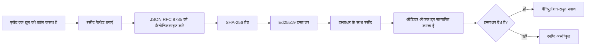
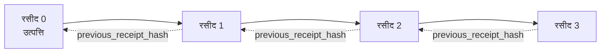

[पाठ वीडियो देखें: क्रिप्टोग्राफिक रसीदों के साथ AI एजेंट्स को सुरक्षित करना](https://youtu.be/PLACEHOLDER_VIDEO_ID)

> _(पाठ वीडियो और थंबनेल Microsoft कंटेंट टीम द्वारा मर्ज के बाद जोड़े जाएंगे, जो पाठ 14 / 15 पैटर्न के अनुरूप होंगे।)_

# क्रिप्टोग्राफिक रसीदों के साथ AI एजेंट्स को सुरक्षित करना

## परिचय

यह पाठ निम्नलिखित को कवर करेगा:

- अनुपालन, डिबगिंग, और विश्वास के लिए AI एजेंट्स के ऑडिट ट्रेल क्यों महत्वपूर्ण हैं।
- क्रिप्टोग्राफिक रसीद क्या होती है और यह बिना साइन किए गए लॉग लाइन से कैसे भिन्न होती है।
- एक एजेंट के टूल कॉल के लिए साइन की गई रसीद कैसे बनाएं, साधारण Python में।
- ऑफ़लाइन रसीद की जांच कैसे करें और छेड़छाड़ कैसे पता लगाएं।
- रसीदों को कैसे चेन करें ताकि किसी एक को हटाने या पुनः क्रमित करने से चेन टूट जाए।
- रसीदें क्या साबित करती हैं और वे स्पष्ट रूप से क्या साबित नहीं करती हैं।

## सीखने के उद्देश्य

इस पाठ को पूरा करने के बाद, आप जानेंगे कैसे:

- उन फेलियर मोड्स की पहचान करें जो एजेंट क्रियाओं के लिए क्रिप्टोग्राफिक प्रादुर्भावना को प्रेरित करते हैं।
- canonical JSON payload पर Ed25519 द्वारा साइन की गई रसीद उत्पन्न करें।
- केवल साइनर की सार्वजनिक कुंजी का उपयोग करके स्वतंत्र रूप से रसीद की पुष्टि करें।
- संशोधित रसीद पर पुनः सत्यापन चलाकर छेड़छाड़ का पता लगाएं।
- रसीदों की हैश-चेन वाली श्रृंखला बनाएं और समझाएं कि चेन क्यों महत्वपूर्ण है।
- यह पहचानें कि रसीदें क्या प्रमाणित करती हैं (अट्रिब्यूशन, इंटीग्रिटी, ऑर्डरिंग) और क्या प्रमाणित नहीं करतीं (क्रिया की सहीता, नीति की ध्वनि).

## समस्या: आपके एजेंट का ऑडिट ट्रेल

कल्पना करें कि आपने Contoso Travel के लिए एक AI एजेंट तैनात किया है। एजेंट ग्राहक अनुरोध पढ़ता है, एक फ्लाइट API को देखता है विकल्पों के लिए, और ग्राहक की ओर से सीटें बुक करता है। पिछले तिमाही में, एजेंट ने 50,000 बुकिंग्स संसाधित कीं।

आज एक ऑडिटर आता है। वे एक सरल सवाल पूछते हैं: "मुझें दिखाएं कि आपका एजेंट क्या किया।"

आप अपने लॉग फ़ाइलें सौंपते हैं। ऑडिटर उन्हें देखता है और एक कठिन सवाल पूछता है: "मुझे कैसे पता चले कि इन लॉग्स को संपादित नहीं किया गया?"

यह ऑडिट-ट्रेल समस्या है। आज अधिकांश एजेंट तैनाती निम्न पर निर्भर करती हैं:

- **एप्लिकेशन लॉग्स**: एजेंट स्वयं द्वारा लिखे गए, जिन्हें फ़ाइल सिस्टम एक्सेस वाले कोई भी संपादित कर सकता है।
- **क्लाउड लॉगिंग सेवाएँ**: प्लेटफ़ॉर्म स्तर पर छेड़छाड़ का पता लगाने योग्य, लेकिन केवल अगर ऑडिटर प्लेटफ़ॉर्म ऑपरेटर पर भरोसा करता हो।
- **डेटाबेस ट्रांज़ैक्शन लॉग्स**: डेटाबेस परिवर्तनों के लिए उपयुक्त, लेकिन मनमाने टूल कॉल के लिए नहीं।

इनमें से कोई भी बिना ऑडिटर को किसी पर भरोसा करने के सवाल का जवाब नहीं दे सकता (आप, आपका क्लाउड प्रदाता, आपका डेटाबेस विक्रेता)। आंतरिक उपयोग के लिए, यह भरोसा अक्सर स्वीकार्य होता है। विनियमित वर्कलोड के लिए (वित्त, स्वास्थ्य देखभाल, EU AI अधिनियम के अधीन कोई भी), यह स्वीकार्य नहीं है।

क्रिप्टोग्राफिक रसीदें इस समस्या का समाधान करती हैं क्योंकि वे प्रत्येक एजेंट क्रिया को स्वतंत्र रूप से सत्यापित योग्य बनाती हैं। ऑडिटर को आप पर भरोसा करने की आवश्यकता नहीं है। उन्हें केवल आपकी सार्वजनिक कुंजी और रसीद चाहिए।

## क्रिप्टोग्राफिक रसीद क्या होती है?

रसीद एक JSON ऑब्जेक्ट है जो रिकॉर्ड करता है कि एजेंट ने क्या किया, और इसे डिजिटल हस्ताक्षर के साथ साइन किया जाता है।



एक न्यूनतम रसीद इस प्रकार दिखती है:

```json
{
  "type": "agent.tool_call.v1",
  "agent_id": "contoso-travel-bot",
  "tool_name": "lookup_flights",
  "tool_args_hash": "sha256:a3f9c1...",
  "result_hash": "sha256:7b2e1d...",
  "policy_id": "contoso-travel-policy-v3",
  "timestamp": "2026-04-25T14:30:00Z",
  "sequence": 47,
  "previous_receipt_hash": "sha256:9d4e6a...",
  "signature": {
    "alg": "EdDSA",
    "sig": "c5af83...",
    "public_key": "8f3b2c..."
  }
}
```

तीन गुण काम करते हैं:

1. **हस्ताक्षर**। रसीद एजेंट के गेटवे द्वारा Ed25519 निजी कुंजी से साइन की जाती है। संबंधित सार्वजनिक कुंजी रखने वाला कोई भी व्यक्ति ऑफ़लाइन हस्ताक्षर की जांच कर सकता है। किसी भी क्षेत्र को छेड़ने से हस्ताक्षर अमान्य हो जाता है।

2. **कैनोनिकल एन्कोडिंग**। साइन करने से पहले, रसीद JSON कैनोनिकलाइज़ेशन स्कीम (JCS, RFC 8785) का उपयोग करके सीरियलाइज की जाती है। इससे यह सुनिश्चित होता है कि जो दो इम्प्लीमेंटेशन समान लॉजिकल रसीद बनाते हैं, उनका बाइनरी आउटपुट बिलकुल एक समान होता है। बिना कैनोनिकलाइज़ेशन के, अलग JSON सीरियलाइजर एक ही सामग्री के लिए अलग-अलग हस्ताक्षर बनाते।

3. **हैश चेनिंग**। `previous_receipt_hash` फ़ील्ड प्रत्येक रसीद को उससे पहले वाली रसीद से जोड़ता है। किसी रसीद को हटाने या पुनः क्रमित करने से उसके बाद की प्रत्येक रसीद टूट जाती है। चेन स्तर पर छेड़छाड़ दिखाई देती है भले ही व्यक्तिगत हस्ताक्षर बाइपास हों।

ये गुण मिलकर तीन गारण्टियां प्रदान करते हैं:

- **अट्रिब्यूशन**: यह कुंजी इस सामग्री पर हस्ताक्षर करती है।
- **इंटीग्रिटी**: सामग्री साइन किए जाने के बाद से नहीं बदली।
- **ऑर्डरिंग**: यह रसीद श्रृंखला में उस रसीद के बाद आई।

## Python में रसीद बनाना

रसीद बनाने के लिए आपको किसी विशेष लाइब्रेरी की जरूरत नहीं है। क्रिप्टोग्राफिक प्रिमिटिव्स व्यापक रूप से उपलब्ध हैं और लॉजिक कुछ दर्जन पंक्तियों का Python है।

`code_samples/18-signed-receipts.ipynb` में व्यावहारिक अभ्यास पूरे फ्लो को एक-एक कदम दिखाते हैं। सारांश संस्करण:

```python
import json
import hashlib
import base64
from nacl import signing
from jcs import canonicalize  # RFC 8785 कैनोनिकल JSON

def b64url_nopad(data: bytes) -> str:
    return base64.urlsafe_b64encode(data).decode("ascii").rstrip("=")

def sha256_canonical(obj) -> str:
    """SHA-256 of a Python object's JCS-canonical JSON form."""
    return f"sha256:{hashlib.sha256(canonicalize(obj)).hexdigest()}"

# एक साइनिंग कुंजी उत्पन्न करें या लोड करें (उत्पादन में, इसे की वॉल्ट में स्टोर करें)
signing_key = signing.SigningKey.generate()
verify_key = signing_key.verify_key

# रसीद पेलोड बनाएं (अभी कोई हस्ताक्षर नहीं)
tool_args = {"origin": "SYD", "destination": "LAX"}
tool_result = [{"flight": "QF11", "price": 1850, "stops": 0}]

payload = {
    "type": "agent.tool_call.v1",
    "agent_id": "contoso-travel-bot",
    "tool_name": "lookup_flights",
    "tool_args_hash": sha256_canonical(tool_args),
    "result_hash": sha256_canonical(tool_result),
    "policy_id": "contoso-travel-policy-v3",
    "timestamp": "2026-04-25T14:30:00Z",
    "sequence": 0,
    "previous_receipt_hash": None,
}

# कैनोनिकलाइज़ करें, हैश करें, साइन करें।
canonical_bytes = canonicalize(payload)
message_hash = hashlib.sha256(canonical_bytes).digest()
signature_bytes = signing_key.sign(message_hash).signature

# एक संरचित हस्ताक्षर वस्तु संलग्न करें।
receipt = {
    **payload,
    "signature": {
        "alg": "EdDSA",
        "sig": b64url_nopad(signature_bytes),
        "public_key": b64url_nopad(bytes(verify_key)),
    },
}
```

यह पूरा साइनिंग पाइपलाइन है। नोटबुक के अभ्यास प्रत्येक चरण को समझाते हैं।

## रसीद की जाँच और छेड़छाड़ का पता लगाना

सत्यापन उल्टा ऑपरेशन है:

```python
import base64
import hashlib
from nacl import signing
from nacl.exceptions import BadSignatureError
from jcs import canonicalize

def b64url_decode(s: str) -> bytes:
    padding = "=" * ((4 - len(s) % 4) % 4)
    return base64.urlsafe_b64decode(s + padding)

def verify_receipt(receipt: dict) -> bool:
    # हस्ताक्षर एक संरचित वस्तु है: {"alg", "sig", "public_key"}.
    sig_obj = receipt.get("signature")
    if not sig_obj or sig_obj.get("alg") != "EdDSA":
        return False

    # वह पेलोड पुनर्निर्माण करें जिसे वास्तव में साइन किया गया था (हस्ताक्षर को छोड़कर सब कुछ).
    payload = {k: v for k, v in receipt.items() if k != "signature"}

    canonical_bytes = canonicalize(payload)
    message_hash = hashlib.sha256(canonical_bytes).digest()

    try:
        verify_key = signing.VerifyKey(b64url_decode(sig_obj["public_key"]))
        verify_key.verify(message_hash, b64url_decode(sig_obj["sig"]))
        return True
    except BadSignatureError:
        return False
```

यह फ़ंक्शन एक रसीद लेता है और यदि हस्ताक्षर वैध हो तो `True` लौटाता है, अन्यथा `False`। न कोई नेटवर्क कॉल, न कोई सेवा निर्भरता, किसी तीसरे पक्ष पर भरोसा आवश्यक नहीं।

छेड़छाड़ की जाँच को दिखाने के लिए, नोटबुक में निम्न दिखाए गए हैं:

1. एक वैध रसीद उत्पन्न करना और पुष्टि करना कि वह सत्यापित हो जाती है।
2. `tool_args_hash` फ़ील्ड का एक बाइट संशोधित करना।
3. पुनः सत्यापन करना और विफलता देखना।

यह व्यावहारिक प्रदर्शन है कि रसीदें छेड़छाड़-प्रतिरोधी हैं: कोई भी परिवर्तन, चाहे कितना भी छोटा, हस्ताक्षर को तोड़ देता है।

## मल्टी-स्टेप एजेंट्स के लिए रसीदों को चेन करना

एक सिंगल साइन की गई रसीद एक क्रिया की रक्षा करती है। रसीदों की एक श्रृंखला पूरे क्रम की रक्षा करती है।



प्रत्येक रसीद उससे पहले वाली रसीद के हैश को रिकॉर्ड करती है। अगर कोई हमलावर चुपचाप रसीद 2 को हटाना चाहता है, तो उसे या तो:

- रसीद 3 के `previous_receipt_hash` फ़ील्ड को संशोधित करना होगा (जिससे रसीद 3 का हस्ताक्षर टूट जाएगा), या
- संशोधित रसीद 3 पर नया हस्ताक्षर बनाना होगा (जिसके लिए एजेंट की निजी कुंजी आवश्यक है)।

यदि निजी कुंजी हार्डवेयर की वॉल्ट में है और आप हर रसीद के साथ सार्वजनिक कुंजी प्रकाशित करते हैं, तो बिना पता चले कोई भी हमला संभव नहीं।

नोटबुक में दर्शाया गया है:

1. तीन रसीदों की एक श्रृंखला बनाना।
2. पुष्टि करना कि प्रत्येक रसीद के `previous_receipt_hash` पिछली रसीद के असली हैश से मेल खाते हैं।
3. श्रृंखला के बीच में एक रसीद के साथ छेड़छाड़ करना और देखना कि चेन उसी बिंदु पर टूट जाती है।

यही वह तरीका है जिससे आप एक ऑडिट ट्रेल बनाते हैं जिसे बाहरी ऑडिटर बिना आप पर भरोसा किए सत्यापित कर सकता है।

## रसीदें क्या साबित करती हैं (और क्या नहीं)

यह इस पाठ का सबसे महत्वपूर्ण भाग है। रसीदें शक्तिशाली हैं लेकिन उनकी शक्ति सीमित है।

**रसीदें तीन बातें साबित करती हैं:**

1. **अट्रिब्यूशन**: एक विशिष्ट कुंजी ने एक विशिष्ट पेलोड पर हस्ताक्षर किया।
2. **इंटीग्रिटी**: पेलोड साइनिंग के बाद से नहीं बदला।
3. **ऑर्डरिंग**: यह रसीद श्रृंखला में उस रसीद के बाद आई।

**रसीदें यह साबित नहीं करतीं:**

1. **सहीता**: कि एजेंट की क्रिया सही थी। कोई भी गलत उत्तर के लिए भी रसीद साफ़-सुथरे तरीके से साइन हो सकती है।
2. **नीति अनुपालन**: कि `policy_id` में संदर्भित नीति का वास्तव में मूल्यांकन किया गया, या यदि जाँचा गया तो यह क्रिया की अनुमति देती। रसीद यह रिकॉर्ड करती है कि क्या दावा किया गया, न कि क्या लागू किया गया।
3. **कुंजी से परे पहचान**: रसीद कहती है "यह कुंजी इस सामग्री पर हस्ताक्षर करती है।" यह नहीं कहती "यह व्यक्ति/मानव ने इसको अधिकृत किया।" कुंजी को व्यक्ति या संगठन से जोड़ने के लिए अलग पहचान प्रणाली चाहिए (डायरेक्टरी, सार्वजनिक कुंजी रजिस्ट्री, आदि)।
4. **इनपुट की सत्यता**: यदि एजेंट कोई मैनिपुलेटेड प्रॉम्प्ट प्राप्त करता है और उस पर कार्य करता है, तो रसीद क्रिया को सच्चाई के साथ रिकॉर्ड करती है। रसीदें इनपुट वैलिडेशन के बाद आती हैं, उसका विकल्प नहीं हैं।

इस सीमा के दो कारण हैं:

- यह बताती है कि रसीदें किस लिए उपयोगी हैं: एजेंट व्यवहार को ऑडिटेबल और छेड़छाड़-प्रतिरोधी बनाना, यहां तक कि संगठनात्मक सीमाओं में भी।
- यह बताती है कि आपको अतिरिक्त कौन-से स्तर अभी भी चाहिए: इनपुट वैलिडेशन (पाठ 6), नीति प्रवर्तन (संक्षिप्त रूप से नीचे कवर किया गया), और पहचान अवसंरचना (इस पाठ के दायरे से बाहर)।

एक आम गलती है यह मान लेना कि "हमारे पास रसीदें हैं" मतलब "हम नियंत्रित हैं।" ऐसा नहीं है। रसीदें एक आधार हैं। शासन वह प्रणाली है जो आप इसके ऊपर बनाते हैं।

## उत्पादन संदर्भ

इस पाठ में Python कोड जानबूझकर न्यूनतम है ताकि आप हर पंक्ति पढ़ सकें और यह समझ सकें कि क्या हो रहा है। उत्पादन में आपके पास दो विकल्प हैं:

1. **क्रिप्टोग्राफिक प्रिमिटिव्स पर सीधे आधारित निर्माण करें।** ऊपर दिखाए गए 50 पंक्तियाँ कई उपयोग मामलों के लिए पर्याप्त हैं। PyNaCl (Ed25519) और `jcs` पैकेज (कैनोनिकल JSON) अच्छी तरह से मेंटेन और ऑडिट की गई लाइब्रेरी हैं।

2. **उत्पादन रसीद लाइब्रेरी का उपयोग करें।** कई ओपन-सोर्स प्रोजेक्ट समान पैटर्न को अतिरिक्त विशेषताओं (की रोटेशन, बैच सत्यापन, JWK सेट वितरण, नीति इंजन एकीकरण) के साथ लागू करते हैं:
   - इस पाठ में प्रयुक्त रसीद प्रारूप एक IETF इंटरनेट-ड्राफ्ट (`draft-farley-acta-signed-receipts`) है जो वर्तमान में मानक प्रक्रिया में है।
   - Microsoft Agent Governance Toolkit रसीदों को Cedar-आधारित नीति निर्णयों के साथ संयोजित करता है; उस रिपोजिटरी में ट्यूटोरियल 33 में एक एंड-टू-एंड उदाहरण देखें।
   - `protect-mcp` (npm) और `@veritasacta/verify` (npm) पैकेजेस एक नोड-आधारित रसीद साइनिंग और ऑफ़लाइन सत्यापन कार्यान्वयन प्रदान करते हैं, जो किसी भी MCP सर्वर को छेड़छाड़-प्रतिरोधी ऑडिट ट्रेल के साथ लपेटने के लिए हैं।

अपनी खुद की JWT लाइब्रेरी लिखने और टेस्ट की गई लाइब्रेरी उपयोग करने के निर्णय की तरह, अपनी खुद की रसीद प्रणाली बनाने या लाइब्रेरी उपयोग करने का निर्णय भी वैध है: दोनों समझदारी है; लाइब्रेरी समय बचाती है और ऑडिट सतह कम करती है; फिर भी मूल से लिखने से हर प्रिमिटिव समझ में आता है। यह पाठ आधार प्रदान करता है दोनों विकल्पों के लिए।

## ज्ञान जाँच

व्यावहारिक अभ्यास में जाने से पहले अपनी समझ का परीक्षण करें।

**1. एक रसीद एजेंट की निजी Ed25519 कुंजी से साइन की जाती है। ऑडिटर के पास केवल सार्वजनिक कुंजी है। क्या ऑडिटर रसीद को ऑफ़लाइन सत्यापित कर सकता है?**

<details>
<summary>उत्तर</summary>

हाँ। Ed25519 सत्यापन के लिए केवल सार्वजनिक कुंजी और साइन किए गए बाइट्स की आवश्यकता होती है। न कोई नेटवर्क कॉल, न सेवा निर्भरता। यही विशेषता रसीदों को एयर-गैप्ड, मल्टी-ऑर्गनाइज़ेशन, या कम-भरोसे वाले ऑडिट सेटिंग्स में उपयोगी बनाती है।
</details>

**2. एक हमलावर ने एक रसीद के `policy_id` फ़ील्ड को अधिक उदार नीति के साथ दावा करने के लिए संशोधित किया। हस्ताक्षर मूल पेलोड पर था। सत्यापन के दौरान क्या होता है?**

<details>
<summary>उत्तर</summary>

सत्यापन विफल होता है। हस्ताक्षर मूल पेलोड के कैनोनिकल बाइट्स पर गणना किया गया था; किसी भी फ़ील्ड को बदलने से कैनोनिकल बाइट्स बदलते हैं, जिससे SHA-256 हैश बदलता है, और हस्ताक्षर अमान्य हो जाता है। हमलावर को ताज़ा वैध हस्ताक्षर बनाने के लिए निजी कुंजी की आवश्यकता होगी, जो उसके पास नहीं है।
</details>

**3. क्यों रसीद में कच्चे आर्गुमेंट्स और परिणाम के बजाय `tool_args_hash` और `result_hash` शामिल हैं?**

<details>
<summary>उत्तर</summary>

दो कारण हैं। पहला, रसीद को ऐसे वातावरण में संग्रहित या प्रेषित किया जा सकता है जहाँ कच्ची सामग्री (PII, व्यवसाय डेटा) का लीक होना समस्या हो। हैशिंग रसीद को छोटा और सामग्री को निजी रखता है; ऑडिटर सत्यापित करता है कि हैश असली सामग्री के अलग संग्रहित कॉपी से मेल खाता है। दूसरा, हैश का आकार फिक्स्ड होता है; हैश वाली रसीद इनपुट और आउटपुट के आकार से स्वतंत्र रूप से आकार में बंधित रहती है।
</details>

**4. `previous_receipt_hash` फ़ील्ड प्रत्येक रसीद को उसके पूर्ववर्ती से जोड़ता है। यदि हमलावर चुपचाप श्रृंखला के बीच एक रसीद हटाता है, तो क्या अमान्य हो जाता है?**

<details>
<summary>उत्तर</summary>

उस हटा दी गई रसीद के बाद की हर रसीद। उनके `previous_receipt_hash` अब वास्तविक चेन से मेल नहीं खाते (क्योंकि वे जिस रसीद को संदर्भित करते थे वह अब मौजूद नहीं है, या चेन अब किसी अलग पूर्ववर्ती से जुड़ी है)। हटाने को छिपाने के लिए, हमलावर को हर बाद की रसीद को फिर से साइन करना होगा, जिसके लिए निजी कुंजी आवश्यक है।
</details>

**5. एक रसीद सफलतापूर्वक सत्यापित हो जाती है। क्या यह साबित करता है कि एजेंट की क्रिया सही, साउंड या नीति के अनुरूप थी?**

<details>
<summary>उत्तर</summary>

नहीं। एक वैध रसीद तीन बातें साबित करती है: अट्रिब्यूशन (इस कुंजी ने इस सामग्री पर हस्ताक्षर किया), इंटीग्रिटी (सामग्री नहीं बदली), और ऑर्डरिंग (यह रसीद उस रसीद के बाद आई)। यह साबित नहीं करती कि क्रिया सही थी, कि `policy_id` में नामित नीति का मूल्यांकन हुआ, या एजेंट ने सभी नियमों का पालन किया। रसीद एजेंट के व्यवहार को ऑडिटेबल बनाती है, जरूरी नहीं कि सही।
</details>

## व्यावहारिक अभ्यास

`code_samples/18-signed-receipts.ipynb` खोलें और चारों सेक्शन पूर्ण करें:

1. **सेक्शन 1**: अपनी पहली रसीद पर साइन करें और सत्यापित करें।
2. **सेक्शन 2**: रसीद के साथ छेड़छाड़ करें और सत्यापन विफल देखें।
3. **सेक्शन 3**: तीन रसीदों की चेन बनाएं और चेन की अखंडता सत्यापित करें।
4. **सेक्शन 4**: Microsoft Agent Framework के साथ बनाए गए एजेंट पर पैटर्न लागू करें: टूल कॉल को रसीद साइनिंग के साथ लपेटें, फिर रसीद को स्वतंत्र रूप से सत्यापित करें।

**स्ट्रेच चैलेंज 1:** अपनी पसंद का एक अतिरिक्त फ़ील्ड रसीद स्कीमा में जोड़ें (जैसे ट्रेसिंग के लिए अनुरोध आईडी), कैनोनिकल साइनिंग लॉजिक को अपडेट करें और जांचें कि रसीद अभी भी सत्यापन में सफल है। फिर साइनिंग के बाद फ़ील्ड को संशोधित करें और पुष्टि करें कि सत्यापन विफल हो जाता है। यह आपको हर बाइट के कैनोनिकल एनकोडिंग हस्ताक्षर में योगदान को समझने पर मजबूर करता है।
**स्ट्रेच चैलेंज 2:** अपने दो रसीदों का SHA-256-हैश एक साथ करें (उनके कैनॉनिकल बाइट्स को एक निर्धारक क्रम में जोड़ें) और परिणामस्वरूप डाइजेस्ट को तीसरी रसीद पर एक नया फ़ील्ड बनाकर एम्बेड करें, फिर इसे साइन करें। सत्यापित करें कि तीनों रसीदें अभी भी राउंड-ट्रिप होती हैं। आपने अभी एक स्टेप समावेशन प्रमाण बनाया है: कोई भी तीसरी रसीद रखने वाला साबित कर सकता है कि पहली दो उस समय मौजूद थीं जब इसे साइन किया गया था, बिना उनकी सामग्री का खुलासा किए। यही पैटर्न है जिसका उपयोग चयनात्मक-प्रकटीकरण रसीदों द्वारा बड़े पैमाने पर किया जाता है (मर्कल कमिटमेंट्स, RFC 6962).

## निष्कर्ष

क्रिप्टोग्राफिक रसीदें AI एजेंटों को ऑडिट ट्रेल देती हैं जो कि:

- **स्वतंत्र रूप से सत्यापन योग्य:** किसी भी पक्ष के पास सार्वजनिक कुंजी होने पर वह सत्यापित कर सकता है, कोई सेवा निर्भरता नहीं।
- **छेड़छाड़-प्रमाण:** कोई भी संशोधन हस्ताक्षर को अमान्य कर देता है।
- **पोर्टेबल:** एक रसीद एक छोटा JSON फ़ाइल होती है; इसे संग्रहित, प्रसारित और कहीं भी सत्यापित किया जा सकता है।
- **मानक-अनुरूप:** Ed25519 (RFC 8032), JCS (RFC 8785), और SHA-256 पर निर्मित, ये सभी व्यापक रूप से लागू प्रिमिटिव्स हैं।

वे इनपुट मान्यता, नीति प्रवर्तन, या पहचान अवसंरचना के लिए विकल्प नहीं हैं। वे उन स्तरों के लिए एक नींव हैं। जब आप एजेंटों को विनियमित वर्कलोड, मल्टी-ऑर्गनाइज़ेशन वर्कफ़्लोज़, या किसी भी ऐसी सेटिंग में तैनात कर रहे हों जहाँ भविष्य के ऑडिटर की आप पर भरोसा होना अनिवार्य नहीं है, तो रसीदें वह तरीका हैं जिससे आप ऑडिट ट्रेल को ईमानदार बनाते हैं।

सबसे महत्वपूर्ण निष्कर्ष: रसीदें साबित करती हैं कि किसने क्या कहा, कब। वे यह साबित नहीं करती हैं कि जो कहा गया वह सत्य या सही था। इस अंतर को कड़ाई से पकड़ें। यह ईमानदार स्रोत प्रणाली और भ्रमित करने वाली प्रणाली के बीच का फर्क है।

## प्रोडक्शन चेकलिस्ट

जब आप इस पाठ से आगे बढ़कर रसीद-हस्ताक्षरित एजेंटों को वास्तविक वातावरण में तैनात करने के लिए तैयार हों:

- [ ] **साइनिंग कुंजी को डिवेलपर लैपटॉप से हटा लें।** Azure Key Vault, AWS KMS, या हार्डवेयर सुरक्षा मॉड्यूल का उपयोग करें। आपकी रसीदों पर हस्ताक्षर करने वाली निजी कुंजी कभी भी स्रोत नियंत्रण में या एप्लिकेशन मशीनों पर प्लेनटेक्स्ट में नहीं होनी चाहिए।
- [ ] **सत्यापन सार्वजनिक कुंजी प्रकाशित करें।** ऑडिटर्स को ऑफ़लाइन सत्यापन के लिए इसकी आवश्यकता होती है। मानक पैटर्न एक जेमेके सेट है जो एक अच्छी तरह से ज्ञात URL पर होता है (RFC 7517), उदाहरण के लिए `https://your-org.example.com/.well-known/agent-keys.json`।
- [ ] **चेन को बाहरी रूप से एंकर करें।** समय-समय पर नवीनतम चेन हेड हैश एक ट्रांसपेरेंसी लॉग (Sigstore Rekor, RFC 3161 टाइमस्टैम्प प्राधिकरण, या एक दूसरा आंतरिक सिस्टम) में लिखें ताकि किसी बाहरी पक्ष को पुष्टि हो सके कि "यह चेन इस समय अस्तित्व में थी।"
- [ ] **रसीदों को अपरिवर्तनीय रूप से स्टोर करें।** अपेंड-ओनली ब्लॉब स्टोरेज (Azure Storage इमार्युटेबिलिटी नीतियों के साथ, AWS S3 ऑब्जेक्ट लॉक) एक अंदरूनी व्यक्ति को स्टोरेज स्तर पर इतिहास को पुनर्लेखन करने से रोकता है।
- [ ] **रिटेंशन के बारे में निर्णय लें।** कई अनुपालन नियमों के तहत कई वर्षों तक रखरखाव आवश्यक है। रसीदों के विकास की योजना बनाएं (प्रत्येक रसीद लगभग 500 बाइट्स होती है; एक एजेंट जो प्रति दिन 10K कॉल करता है वह प्रति वर्ष लगभग 1.8 GB उत्पन्न करता है)।
- [ ] **दस्तावेज़ करें कि रसीदें क्या कवर नहीं करती।** रसीदें अभिग्रहण, अखंडता, और क्रमबद्धता प्रमाणित करती हैं। आपका रनबुक स्पष्ट रूप से सूचीबद्ध होना चाहिए कि कौन से अतिरिक्त नियंत्रण (इनपुट मान्यता, नीति प्रवर्तन, दर सीमांकन, पहचान अवसंरचना) आपके शासन के साथ रसीदों के साथ मिलकर काम करते हैं।

### AI एजेंट्स को सुरक्षित करने के बारे में और प्रश्न हैं?

[Microsoft Foundry Discord](https://aka.ms/ai-agents/discord) से जुड़िए ताकि आप अन्य शिक्षार्थियों से मिल सकें, ऑफिस ऑवर्स में भाग ले सकें, और अपने AI एजेंट्स के प्रश्नों के उत्तर प्राप्त कर सकें।

## इस पाठ के आगे

यह पाठ एकल-रसीद साइनिंग और हैश-चेन अनुक्रमों को कवर करता है। वही प्रिमिटिव्स कई और उन्नत पैटर्न्स में सम्मिलित होते हैं जिनका सामना आप अपने शासन के विकसित होते ही कर सकते हैं:

- **चयनात्मक प्रकटीकरण।** जब किसी रसीद के फील्ड स्वतंत्र रूप से कमिटेड होते हैं (RFC 6962-शैली का मर्कल ट्री), तो आप विशिष्ट फील्ड्स को विशिष्ट ऑडिटर्स को दिखा सकते हैं और शेष को असंपादित साबित कर सकते हैं बिना उन्हें उजागर किए। उपयोगी जब वही रसीद एक व्यापक ऑडिट (जो पूर्णता चाहता है) और डेटा-मिनिमाइजेशन नियमों जैसे GDPR (जो ऑडिटर को जितना संभव हो कम दिखाना चाहता है) दोनों को संतुष्ट करनी हो।
- **रसीद रद्द करना।** यदि साइनिंग कुंजी समझौता हो जाती है, तो आपको उस समय से आगे उस कुंजी द्वारा साइन की गई सभी रसीदों को अविश्वसनीय चिह्नित करने का तरीका चाहिए। मानक पैटर्न: अल्पकालिक साइनिंग कुंजियां और प्रकाशित रद्द सूची, या एक ट्रांसपेरेंसी लॉग जिसमें रद्द करने के प्रविष्टियाँ हों।
- **दो पक्षीय / स्प्लिट-सिग्नेचर रसीदें।** कुछ कार्यान्वयन साइन किए गए पेलोड को क्रियान्वयन से पूर्व (`authorization_*`) और पश्चात (`result_*`) आधों में विभाजित कर देते हैं जिनके स्वतंत्र हस्ताक्षर होते हैं, उपयोगी जब प्राधिकरण निर्णय और देखे गए परिणाम विभिन्न अभिनेताओं द्वारा या विभिन्न समयों में बनाए जाते हैं। यह इस पाठ में सिखाए गए रसीद प्रारूप के ऊपर जोड़ता है।
- **पेलोड संयोजन।** एक रसीद में जो भी आप `result_hash` में डालते हैं उसे सील किया जाता है। वास्तविक विश्व पेलोड अक्सर एकल उपकरण कॉल परिणाम से अधिक समृद्ध होते हैं: पूर्व-निर्णय तर्क (मॉडल भविष्यवाणी, विचार किए गए विकल्प, साक्ष्य और उसकी पूर्णता, जोखिम मुद्रा, जवाबदेही श्रृंखला, गेट परिणाम) सभी पेलोड के अंदर रह सकते हैं, जिसे एकल रसीद द्वारा सील किया जाता है। यह रसीद प्रारूप को न्यूनतम रखता है जबकि पेलोड स्कीमाओं को डोमेन-दर-डोमेन विकसित करने देता है।
- **क्रॉस-इम्प्लीमेंटेशन अनुरूपता।** एक ही रसीद प्रारूप के कई स्वतंत्र कार्यान्वयन (पायथन, टाइपस्क्रिप्ट, रस्ट, गो) साझा परीक्षण वेक्टर के खिलाफ क्रॉस-सत्यापन करते हैं। यदि आप अपना स्वयं का कार्यान्वयन बनाते हैं, तो प्रकाशित वेक्टर के खिलाफ सत्यापन तार संगतता की पुष्टि करता है।
- **पोस्ट-क्वांटम माइग्रेशन।** Ed25519 आज व्यापक रूप से कार्यान्वित है लेकिन क्वांटम-रोधी नहीं है। रसीद प्रारूप एल्गोरिदम-गतिशील है: `signature.alg` फ़ील्ड में आप ज़रूरत पड़ने पर `ML-DSA-65` (NIST पोस्ट-क्वांटम हस्ताक्षर मानक) को रख सकते हैं। एक संक्रमण अवधि की योजना बनाएं जहां रसीदें द्वैध-हस्ताक्षरित हों।

## अतिरिक्त संसाधन

- <a href="https://datatracker.ietf.org/doc/draft-farley-acta-signed-receipts/" target="_blank">IETF इंटरनेट-ड्राफ्ट: मशीन-टू-मशीन एक्सेस कंट्रोल के लिए साइन किए गए निर्णय रसीदें</a>
- <a href="https://learn.microsoft.com/azure/ai-studio/responsible-use-of-ai-overview" target="_blank">जिम्मेदार AI अवलोकन (Azure AI)</a>
- <a href="https://datatracker.ietf.org/doc/html/rfc8032" target="_blank">RFC 8032: एडवर्ड्स-कर्व डिजिटल सिग्नेचर एल्गोरिदम (EdDSA)</a>
- <a href="https://datatracker.ietf.org/doc/html/rfc8785" target="_blank">RFC 8785: JSON कैनॉनिकलाइजेशन स्कीम (JCS)</a>
- <a href="https://datatracker.ietf.org/doc/html/rfc6962" target="_blank">RFC 6962: सर्टिफिकेट ट्रांसपेरेंसी</a> (सेलेक्टिव-डिस्क्लोजर रसीदों द्वारा उपयोग किया जाने वाला मर्कल-ट्री निर्माण)
- <a href="https://github.com/microsoft/agent-governance-toolkit/blob/main/docs/tutorials/33-offline-verifiable-receipts.md" target="_blank">Microsoft एजेंट गवर्नेंस टूलकिट, ट्यूटोरियल 33: ऑफलाइन-वेरिफ़िएबल निर्णय रसीदें</a>
- <a href="https://github.com/ScopeBlind/agent-governance-testvectors" target="_blank">इस पाठ में उपयोग किए गए रसीद प्रारूप के लिए क्रॉस-इम्प्लीमेंटेशन अनुरूपता परीक्षण वेक्टर</a> (Apache-2.0)
- <a href="https://pynacl.readthedocs.io/" target="_blank">PyNaCl दस्तावेज़ (Python में Ed25519)</a>

## पिछला पाठ

[कंप्यूटर उपयोग एजेंट बनाने (CUA)](../15-browser-use/README.md)

## अगला पाठ

_(कोर्स मैनेजर्स द्वारा निर्धारित किया जाना है)_

---

<!-- CO-OP TRANSLATOR DISCLAIMER START -->
**अस्वीकरण**:
इस दस्तावेज़ का अनुवाद AI अनुवाद सेवा [Co-op Translator](https://github.com/Azure/co-op-translator) का उपयोग करके किया गया है। जबकि हम सटीकता के लिए प्रयास करते हैं, कृपया ध्यान दें कि स्वचालित अनुवादों में त्रुटियाँ या अशुद्धियाँ हो सकती हैं। मूल दस्तावेज़ अपनी मूल भाषा में ही प्रामाणिक स्रोत माना जाना चाहिए। महत्वपूर्ण जानकारी के लिए, पेशेवर मानव अनुवाद की सिफारिश की जाती है। इस अनुवाद के उपयोग से उत्पन्न किसी भी गलतफहमी या गलत व्याख्या के लिए हम उत्तरदायी नहीं हैं।
<!-- CO-OP TRANSLATOR DISCLAIMER END -->