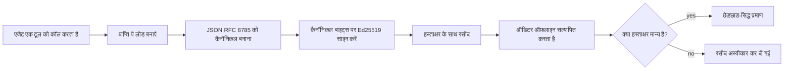
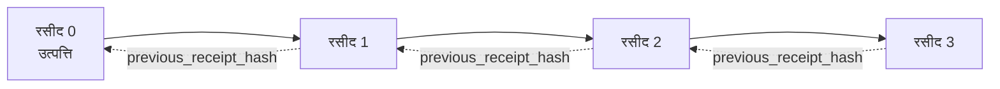

[पाठ वीडियो देखें: क्रिप्टोग्राफिक रसीदों के साथ AI एजेंट्स को सुरक्षित करना](https://youtu.be/PLACEHOLDER_VIDEO_ID)

> _(पाठ वीडियो और थंबनेल Microsoft सामग्री टीम द्वारा मर्ज के बाद जोड़ा जाएगा, पाठ 14 / 15 पैटर्न से मेल खाते हुए.)_

# क्रिप्टोग्राफिक रसीदों के साथ AI एजेंट्स को सुरक्षित करना

## परिचय

इस पाठ में हम कवर करेंगे:

- AI एजेंट्स के लिए ऑडिट ट्रेल compliance, डिबगिंग, और विश्वास के लिए क्यों महत्वपूर्ण है।
- क्रिप्टोग्राफिक रसीद क्या है और यह बिना साइन किए गए लॉग लाइन से कैसे अलग है।
- एक एजेंट के टूल कॉल के लिए साइन की गई रसीद कैसे बनाएं, साधारण Python में।
- ऑफ़लाइन रसीद को कैसे सत्यापित करें और छेड़छाड़ का पता लगाएं।
- रसीदों को कैसे चेन करें ताकि किसी एक को हटाने या पुनःक्रमित करने से श्रृंखला टूट जाए।
- रसीदें क्या साबित करती हैं और वे स्पष्ट रूप से क्या नहीं证明 करतीं।

## सीखने के लक्ष्य

इस पाठ को पूरा करने के बाद, आप जानेंगे कि कैसे:

- उन विफलता मोड्स की पहचान करें जो एजेंट क्रियाओं के लिए क्रिप्टोग्राफिक प्रॉवेनेन्स को प्रेरित करते हैं।
- कैनोनिकल JSON पेलोड पर Ed25519-साइन की गई रसीद उत्पन्न करें।
- केवल साइनर के सार्वजनिक कुंजी का उपयोग करके स्वतंत्र रूप से रसीद सत्यापित करें।
- संशोधित रसीद पर पुनः सत्यापन चलाकर छेड़छाड़ का पता लगाएं।
- रसीदों की हैश-चेन वाली श्रृंखला बनाएं और समझाएं कि यह श्रृंखला क्यों महत्वपूर्ण है।
- पहचानें कि रसीदें क्या प्रमाणित करती हैं (अट्रीब्यूशन, अखंडता, क्रम) और क्या नहीं करतीं (कार्रवाई की शुद्धता, नीति की ठोसता)।

## समस्या: आपके एजेंट का ऑडिट ट्रेल

कल्पना करें कि आपने Contoso Travel के लिए एक AI एजेंट तैनात किया है। एजेंट ग्राहक की मांगों को पढ़ता है, फ्लाइट API को कॉल करता है विकल्प खोजने के लिए, और ग्राहक की ओर से सीटें बुक करता है। पिछले तिमाही में, एजेंट ने 50,000 बुकिंग्स प्रक्रिया कीं।

आज एक ऑडिटर आता है। वे एक सरल सवाल पूछते हैं: "मुझे दिखाओ कि आपका एजेंट क्या किया।"

आप अपने लॉग फाइल्स सौंपते हैं। ऑडिटर उन्हें देखता है और एक कठिन सवाल पूछता है: "मुझे कैसे पता चले कि इन लॉग्स को संपादित नहीं किया गया?"

यह ऑडिट-ट्रेल समस्या है। आज अधिकांश एजेंट तैनाती निम्न पर निर्भर करती हैं:

- **एप्लिकेशन लॉग्स**: एजेंट द्वारा खुद लिखे गए, फाइल सिस्टम एक्सेस वाले कोई भी संपादित कर सकता है।
- **क्लाउड लॉगिंग सेवाएं**: प्लेटफ़ॉर्म स्तर पर छेड़छाड़-सबूत लेकिन केवल यदि ऑडिटर प्लेटफ़ॉर्म ऑपरेटर पर भरोसा करता है।
- **डेटाबेस ट्रांजैक्शन लॉग्स**: डेटाबेस परिवर्तनों के लिए उपयुक्त लेकिन मनमाने टूल कॉल्स के लिए नहीं।

इनमें से कोई भी ऑडिटर के सवाल का जवाब बिना किसी पर भरोसा किए नहीं दे सकता (आप, आपका क्लाउड प्रदाता, आपका डेटाबेस विक्रेता)। आंतरिक उपयोग के लिए, यह विश्वास अक्सर स्वीकार्य है। नियमन के अधीन कार्यभार (वित्त, स्वास्थ्य सेवा, EU AI अधिनियम के तहत) के लिए यह स्वीकार्य नहीं है।

क्रिप्टोग्राफिक रसीदें इस समस्या को हल करती हैं क्योंकि ये प्रत्येक एजेंट क्रिया को स्वतंत्र रूप से सत्यापित करने योग्य बनाती हैं। ऑडिटर को आप पर भरोसा करने की आवश्यकता नहीं होती। उन्हें केवल आपकी सार्वजनिक कुंजी और खुद रसीद की आवश्यकता होती है।

## क्रिप्टोग्राफिक रसीद क्या है?

रसीद एक JSON ऑब्जेक्ट है जो रिकॉर्ड करता है कि एजेंट ने क्या किया, डिजिटल हस्ताक्षर के साथ साइन किया गया।


```mermaid
flowchart LR
    A[एजेंट एक टूल को कॉल करता है] --> B[प्राप्ति पे लोड बनाएँ]
    B --> C[JSON RFC 8785 को कैनॉनिकल बनाना]
    C --> E[कैनॉनिकल बाइट्स पर Ed25519 साइन करें]
    E --> F[हस्ताक्षर के साथ रसीद]
    F --> G[ऑडिटर ऑफ़लाइन सत्यापित करता है]
    G --> H{क्या हस्ताक्षर मान्य है?}
    H -- yes --> I[छेड़छाड़-सिद्ध प्रमाण]
    H -- no --> J[रसीद अस्वीकार कर दी गई]
```

एक न्यूनतम रसीद इस प्रकार दिखती है:

```json
{
  "type": "agent.tool_call.v1",
  "agent_id": "contoso-travel-bot",
  "tool_name": "lookup_flights",
  "tool_args_hash": "sha256:a3f9c1...",
  "result_hash": "sha256:7b2e1d...",
  "policy_id": "contoso-travel-policy-v3",
  "timestamp": "2026-04-25T14:30:00Z",
  "sequence": 47,
  "previous_receipt_hash": "sha256:9d4e6a...",
  "signature": {
    "alg": "EdDSA",
    "sig": "c5af83...",
    "public_key": "8f3b2c..."
  }
}
```

तीन गुण काम कर रहे हैं:

1. **हस्ताक्षर**। रसीद एजेंट के गेटवे द्वारा Ed25519 प्राइवेट की से साइन की जाती है। संबंधित पब्लिक की वाला कोई भी व्यक्ति ऑफ़लाइन हस्ताक्षर सत्यापित कर सकता है। किसी भी फील्ड में छेड़छाड़ हस्ताक्षर को अमान्य कर देती है।

2. **कैनोनिकल एन्कोडिंग**। साइन करने से पहले, रसीद JSON कैनोनिकलाइज़ेशन स्कीम (JCS, RFC 8785) का उपयोग करके सीरियलाइज़ की जाती है। यह सुनिश्चित करता है कि दो अलग-अलग क्रियान्वयन जो समान तार्किक रसीद बनाते हैं, बाइट-परिचालित निरंतर आउटपुट बनाएं। बिना कैनोनिकलाइज़ेशन के, अलग-अलग JSON सीरियलाइज़र समान सामग्री के लिए अलग-अलग हस्ताक्षर बनाते।

3. **हैश चेनिंग**। `previous_receipt_hash` फील्ड प्रत्येक रसीद को उससे पहले की रसीद से लिंक करता है। किसी एक रसीद को हटाने या पुनर्स्थापित करने से हर बाद की रसीद टूट जाती है। छेड़छाड़ श्रृंखला स्तर पर दिखाई देती है यहाँ तक कि यदि व्यक्तिगत हस्ताक्षरों को दरकिनार किया गया हो।

ये गुण एक साथ तीन गारंटियां प्रदान करते हैं:

- **अट्रीब्यूशन**: इस कुंजी ने इस सामग्री पर हस्ताक्षर किया।
- **अखंडता**: हस्ताक्षर के बाद से सामग्री में कोई बदलाव नहीं हुआ।
- **क्रमबद्धता**: यह रसीद श्रृंखला में उस रसीद के बाद आई।

## Python में रसीद तैयार करना

रसीद बनाने के लिए आपको कोई विशेष लाइब्रेरी की जरूरत नहीं है। क्रिप्टोग्राफिक प्रिमिटिव्स व्यापक रूप से उपलब्ध हैं और लॉजिक कुछ दर्जन पंक्तियों में Python में लिखा जा सकता है।

`code_samples/18-signed-receipts.ipynb` में व्यावहारिक अभ्यास पूरे प्रवाह को दिखाते हैं। सारांश संस्करण:

```python
import json
import hashlib
import base64
from nacl import signing
from jcs import canonicalize  # RFC 8785 कैनोनिकल JSON

def b64url_nopad(data: bytes) -> str:
    return base64.urlsafe_b64encode(data).decode("ascii").rstrip("=")

def sha256_canonical(obj) -> str:
    """SHA-256 of a Python object's JCS-canonical JSON form."""
    return f"sha256:{hashlib.sha256(canonicalize(obj)).hexdigest()}"

# एक साइनिंग कुंजी जनरेट करें या लोड करें (उत्पादन में, इसे एक कुंजी वॉल्ट में स्टोर करें)
signing_key = signing.SigningKey.generate()
verify_key = signing_key.verify_key

# रसीद पेलोड बनाएं (अभी कोई हस्ताक्षर नहीं)
tool_args = {"origin": "SYD", "destination": "LAX"}
tool_result = [{"flight": "QF11", "price": 1850, "stops": 0}]

payload = {
    "type": "agent.tool_call.v1",
    "agent_id": "contoso-travel-bot",
    "tool_name": "lookup_flights",
    "tool_args_hash": sha256_canonical(tool_args),
    "result_hash": sha256_canonical(tool_result),
    "policy_id": "contoso-travel-policy-v3",
    "timestamp": "2026-04-25T14:30:00Z",
    "sequence": 0,
    "previous_receipt_hash": None,
}

# JCS बाइट्स को सीधे कैनोनिकलाइज़ करें और साइन करें। PureEdDSA आंतरिक रूप से हैश करता है।
canonical_bytes = canonicalize(payload)
signature_bytes = signing_key.sign(canonical_bytes).signature

# एक संरचित हस्ताक्षर वस्तु संलग्न करें।
receipt = {
    **payload,
    "signature": {
        "alg": "EdDSA",
        "sig": b64url_nopad(signature_bytes),
        "public_key": b64url_nopad(bytes(verify_key)),
    },
}
```

यही पूरी साइनिंग पाइपलाइन है। नोटबुक के अभ्यास प्रत्येक चरण में मार्गदर्शन करते हैं।

## रसीद सत्यापन और छेड़छाड़ का पता लगाना

सत्यापन इसके विपरीत ऑपरेशन है:

```python
import base64
import hashlib
from nacl import signing
from nacl.exceptions import BadSignatureError
from jcs import canonicalize

def b64url_decode(s: str) -> bytes:
    padding = "=" * ((4 - len(s) % 4) % 4)
    return base64.urlsafe_b64decode(s + padding)

def verify_receipt(receipt: dict) -> bool:
    # हस्ताक्षर एक संरचित वस्तु है: {"alg", "sig", "public_key"}.
    sig_obj = receipt.get("signature")
    if not sig_obj or sig_obj.get("alg") != "EdDSA":
        return False

    # पेलोड को पुनः बनाएँ जिसे वास्तव में हस्ताक्षरित किया गया था (हस्ताक्षर को छोड़कर सब कुछ).
    payload = {k: v for k, v in receipt.items() if k != "signature"}

    canonical_bytes = canonicalize(payload)

    try:
        verify_key = signing.VerifyKey(b64url_decode(sig_obj["public_key"]))
        verify_key.verify(canonical_bytes, b64url_decode(sig_obj["sig"]))
        return True
    except BadSignatureError:
        return False
```

यह फ़ंक्शन रसीद लेता है और यदि हस्ताक्षर वैध है तो `True` लौटाता है, अन्यथा `False`। कोई नेटवर्क कॉल नहीं, कोई सेवा निर्भरता नहीं, किसी तृतीय पक्ष पर भरोसा आवश्यक नहीं।

छेड़छाड़ का पता लगाने के लिए नोटबुक निम्नलिखित चरणों को दिखाता है:

1. वैध रसीद बनाएं और पुष्टि करें कि यह सत्यापित होती है।
2. `tool_args_hash` फील्ड के एक बाइट को संशोधित करें।
3. सत्यापन फिर से चलाएं और विफलता देखें।

यह व्यावहारिक प्रदर्शन है कि रसीदें छेड़छाड़-सबूत होती हैं: कोई भी संशोधन, कितना भी छोटा क्यों न हो, हस्ताक्षर को तोड़ देता है।

## मल्टी-स्टेप एजेंट्स के लिए रसीदों की श्रृंखला

एक सिंगल साइन की गई रसीद एक क्रिया की सुरक्षा करती है। रसीदों की एक श्रृंखला एक अनुक्रम की सुरक्षा करती है।


```mermaid
flowchart LR
    R0[रसीद 0<br/>उत्पत्ति] --> R1[रसीद 1]
    R1 --> R2[रसीद 2]
    R2 --> R3[रसीद 3]
    R1 -. previous_receipt_hash .-> R0
    R2 -. previous_receipt_hash .-> R1
    R3 -. previous_receipt_hash .-> R2
```

प्रत्येक रसीद उससे पहले वाली रसीद के हैश को रिकॉर्ड करती है। रसीद 2 को चुपचाप हटाने के लिए, हमलावर को या तो:

- रसीद 3 के `previous_receipt_hash` फील्ड को संशोधित करना होगा (जिससे रसीद 3 का हस्ताक्षर टूटता है), या
- संशोधित रसीद 3 पर नया हस्ताक्षर बनाना होगा (जिसके लिए एजेंट की प्राइवेट की की जरूरत होती है)।

यदि प्राइवेट की हार्डवेयर की वॉल्ट में है और आप प्रत्येक रसीद के साथ सार्वजनिक कुंजी प्रकाशित करते हैं, तो बिना पता चले कोई भी हमला संभव नहीं है।

नोटबुक निम्नलिखित को दिखाता है:

1. तीन रसीदों की श्रृंखला बनाना।
2. सत्यापित करना कि प्रत्येक रसीद का `previous_receipt_hash` पिछले रसीद के वास्तविक हैश से मेल खाता है।
3. बीच में एक रसीद के साथ छेड़छाड़ करना और श्रृंखला उस बिंदु पर टूटते देखना।

यह वह तरीका है जिससे आप एक ऐसा ऑडिट ट्रेल बनाते हैं जिसे बाहरी ऑडिटर बिना आप पर भरोसा किए सत्यापित कर सकता है।

## रसीदें क्या प्रमाणित करती हैं (और क्या नहीं)

इस पाठ का यह सबसे महत्वपूर्ण भाग है। रसीदें शक्तिशाली हैं लेकिन उनकी शक्ति सीमित है।

**रसीदें तीन बातें प्रमाणित करती हैं:**

1. **अट्रीब्यूशन**: एक विशिष्ट कुंजी ने एक विशिष्ट पेलोड पर हस्ताक्षर किया।
2. **अखंडता**: पेलोड साइनिंग के बाद से नहीं बदला।
3. **क्रमबद्धता**: यह रसीद उस रसीद के बाद आई है जो हैश श्रृंखला में है।

**रसीदें ये प्रमाणित नहीं करतीं:**

1. **शुद्धता**: कि एजेंट का क्रिया सही था। गलत जवाब के लिए भी रसीद उतनी ही सफाई से साइन हो सकती है जितनी सही जवाब के लिए।
2. **नीति अनुपालन**: कि `policy_id` में उल्लिखित नीति की वास्तव में जाँच हुई या यह क्रिया अनुमति देगी यदि जाँची जाती। रसीद रिकॉर्ड करता है कि क्या दावा किया गया, क्या लागू किया गया नहीं।
3. **कुंजी से परे पहचान**: रसीद कहती है "इस कुंजी ने इस सामग्री पर हस्ताक्षर किया।" यह नहीं कहती "इस मानव ने इसे अधिकृत किया।" कुंजी को व्यक्ति या संगठन से जोड़ने के लिए अलग पहचान ढांचा (डायरेक्टरी, सार्वजनिक कुंजी रजिस्ट्रि, आदि) आवश्यक है।
4. **इनपुट्स की सत्यता**: यदि एजेंट को किसी मॉडिफाइड प्रॉम्प्ट के साथ फीड किया गया और वह उस पर क्रिया करता है, तो रसीद उस क्रिया को सच्चाई से रिकॉर्ड करती है। रसीदें इनपुट सत्यापन के नीचे हैं, इसका विकल्प नहीं हैं।

यह सीमा दो कारणों से महत्वपूर्ण है:

- यह बताता है कि रसीदें किस लिए उपयोगी हैं: एजेंट के व्यवहार को ऑडिट योग्य और छेड़छाड़-सबूत बनाना, यहां तक कि संगठनात्मक सीमाओं के पार भी।
- यह बताता है कि आपको अतिरिक्त कौन-से स्तर अभी भी चाहिए: इनपुट सत्यापन (पाठ 6), नीति प्रवर्तन (संक्षेप में नीचे कवर किया गया), और पहचान आधारभूत संरचना (इस पाठ के अंतर्गत नहीं)।

एक सामान्य गलती यह मान लेना है कि "हमारे पास रसीदें हैं" मतलब "हम संचालित हैं।" ऐसा नहीं है। रसीदें एक आधार हैं। संचालन वह प्रणाली है जिसे आप इसके ऊपर बनाते हैं।

## यह प्रमाणित करना कि एक मानव ने ठीक वही क्रिया स्वीकृत की

ऊपर आइटम 3 के लिए अपना एक भाग बनने योग्य सेक्शन है: एक क्रिया रसीद कहती है "इस कुंजी ने इस सामग्री पर हस्ताक्षर किया," कभी "एक मानव ने इसे अधिकृत किया।" उच्च जोखिम वाली क्रियाओं (रिफंड, हटाना, वायर ट्रांसफर) के लिए संचालन ढांचे उस लापता कथन को आवश्यक रूप से बढ़ा रहे हैं, और यह उसी प्रिमिटिव्स से उत्पादित किया जा सकता है जो आपने इस पाठ में पहले ही बनाया है।

फॉलो-ऑन नोटबुक `code_samples/human-authorization-receipts.ipynb` एक दूसरी रसीद प्रकार जोड़ता है, `human.approval.v1`, जो पाठ की रसीदों जैसी ही लिफाफे की आकृति में है (एक टाइप किया हुआ पेलोड, Ed25519 से साइन किया गया, इसके कैनोनिकल JCS बाइट्स पर, और `signature` ऑब्जेक्ट साइन किए गए बाइट्स के बाहर)। एक नामित अनुमोदक पूरी कैनोनिकल कार्रवाई और उसका डाइजेस्ट साइन करता है निष्पादन से पहले; एजेंट की क्रिया रसीद उसी क्रिया डाइजेस्ट को ले जाती है और एक `parent_approval_ref`, अप्रूवल की `receipt_hash` जो ऊपर आप ने चेन में जो `previous_receipt_hash` का उपयोग किया उससे मिलता-जुलता है। एक `verify_chain` दोनों कलाकृतियों को अलग-अलग पिन की रजिस्ट्रियों के तहत सत्यापित करता है (अनुमोदक कुंजियाँ बनाम एजेंट कुंजियाँ), इसलिए कोड पथ साझा है लेकिन प्राधिकरण कभी नहीं।

इस गुण का सावधानीपूर्वक वर्णन: *मानव ने इस ठीक क्रिया को स्वीकृत किया, और एजेंट ने बिल्कुल वही स्वीकृत क्रिया का निष्पादन किया।* नोटबुक के अस्वीकार करने वाले परीक्षण वास्तविक बनाते हैं न कि केवल बतलाते हैं:

- क्लासिक सेट: छेड़छाड़, भ्रमित डिप्टी, रप्ले, किसी भी पक्ष पर नकली चाबियाँ, दूषित इनपुट;
- **पुरानी प्राधिकरण**: एक हस्ताक्षर जो अभी भी वैध है, फिर भी इंकार कर दिया गया क्योंकि नीति संस्करण बदल गया, अनुमोदक कुंजी पिन रजिस्ट्रि से हटा दी गई, या निष्पादन से पहले अनुमोदन समाप्त हो गया;
- **डाइजेस्ट प्रतिस्थापन**: एक वैध रूप से साइन की गई क्रिया रसीद जो एक *वास्तविक* अप्रूवल की ओर इशारा करती है जो एक *विभिन्न* कैनोनिकल कार्रवाई से बंधी है।

प्रत्येक विफलता अलग कारण के साथ अस्वीकृत होती है, ताकि ऑडिटर अस्वीकार पढ़ते समय बता सके कि प्राधिकरण पुरानी हो गई या निष्पादित क्रिया बदली। नोटबुक के नियम: एक साइन की गई अप्रूवल स्वयं में प्राधिकरण नहीं है। प्राधिकरण तब होता है जब दोनों रसीदें निष्पादन समय एक ही कैनोनिकल कार्रवाई पर बंधी हों। मानव-अस्वीकृति रसीद एक शैक्षिक संयोजन है जिसे इस पाठ ने परिभाषित किया, न कि `draft-farley-acta-signed-receipts` द्वारा परिभाषित कोई रसीद प्रकार।

## उत्पादन संदर्भ

इस पाठ में Python कोड जानबूझकर न्यूनतम है ताकि आप हर पंक्ति पढ़ सकें और ठीक से समझ सकें कि क्या हो रहा है। उत्पादन में आपके पास दो विकल्प हैं:

1. **सीधे क्रिप्टोग्राफिक प्रिमिटिव्स पर बनाएं।** ऊपर देखे गए 50 लाइन कई उपयोग के मामलों के लिए पर्याप्त हैं। PyNaCl (Ed25519) और `jcs` पैकेज (कैनोनिकल JSON) अच्छी तरह से मेंटेन और ऑडिट किए गए लाइब्रेरीज़ हैं।

2. **एक उत्पादन रसीद लाइब्रेरी का उपयोग करें।** कई ओपन-सोर्स प्रोजेक्ट्स एक ही पैटर्न को अतिरिक्त फीचर्स (की रोटेशन, बैच सत्यापन, JWK सेट वितरण, नीति इंजन इंटीग्रेशन) के साथ लागू करते हैं:
   - साइनिंग पाइपलाइन JCS और सिग्नेचर-स्कोप कन्वेंशंस का उपयोग करती है स्वतंत्र IETF इंटरनेट-ड्राफ्ट ([`draft-farley-acta-signed-receipts`](https://datatracker.ietf.org/doc/draft-farley-acta-signed-receipts/), संस्करण 02) में। इस पाठ की शैक्षिक रसीद ड्राफ्ट के `{payload, signature}` लिफाफे से अलग है और इसे अनुरूप क्रियान्वयन के रूप में पेश नहीं किया गया है। ड्राफ्ट अपने तार प्रारूप को लक्षित क्रियान्वयों के लिए एक साझा अनुरूपता सूट ([agent-governance-testvectors](https://github.com/ScopeBlind/agent-governance-testvectors)) प्रकाशित करता है।
   - Microsoft Agent Governance Toolkit Cedar-आधारित नीति निर्णयों के साथ रसीदों को संयोजित करता है; उस रिपोजिटरी में ट्यूटोरियल 33 देखें एक एंड-टू-एंड उदाहरण के लिए।
   - `protect-mcp` (npm) और `@veritasacta/verify` (npm) पैकेजेस Node आधारित रसीद साइनिंग और ऑफ़लाइन सत्यापन के कार्यान्वयन प्रदान करते हैं, जिसे किसी भी MCP सर्वर को छेड़छाड़-सबूत ऑडिट ट्रेल के साथ रैप करने के लिए डिज़ाइन किया गया है, जिसमें एक होल्ड-फॉर-को-साइन फ्लो भी शामिल है जिसमें रुकी हुई कार्रवाई अप्रूवल रसीद दिखाती है जो कार्रवाई डाइजेस्ट से बंधी होती है (डेस्कटॉप फ्लो में WebAuthn-समर्थित), वह ही अप्रूवल-रसीद पैटर्न जो ऊपर मानव-प्राधिकरण नोटबुक में है।
   - **[nobulex](https://github.com/arian-gogani/nobulex)** Python SDK (`pip install nobulex`) Python में वही Ed25519 + JCS साइनिंग पैटर्न LangChain और CrewAI एकीकरण के साथ प्रदान करता है, जिसमें प्रकाशित क्रॉस-मान्यकरण परीक्षण वेक्टर और [OWASP PR #2210](https://github.com/OWASP/CheatSheetSeries/pull/2210) द्वारा योगदानित अनुपालन मैपिंग शामिल है।

अपनी खुद की रचना करने और लाइब्रेरी उपयोग करने का निर्णय उसी निर्णय की तरह है जैसे अपनी JWT लाइब्रेरी लिखने या परीक्षण की हुई लाइब्रेरी का उपयोग करने का: दोनों उचित हैं; लाइब्रेरी समय बचाती है और ऑडिट सतह कम करती है; स्क्रैच से बनाना आपको हर प्रिमिटिव समझने पर मजबूर करता हैं। यह पाठ स्क्रैच रास्ता सिखाता है ताकि आपके पास दोनों विकल्पों के लिए आधार हो।

## ज्ञान जांच

अभ्यास करने से पहले अपनी समझ का परीक्षण करें।

**1. रसीद एजेंट की प्राइवेट Ed25519 कुंजी से साइन होती है। ऑडिटर के पास केवल सार्वजनिक कुंजी है। क्या ऑडिटर रसीद को ऑफ़लाइन सत्यापित कर सकता है?**

<details>
<summary>उत्तर</summary>

हाँ। Ed25519 सत्यापन के लिए केवल सार्वजनिक कुंजी और साइन किए गए बाइट्स की जरूरत होती है। कोई नेटवर्क कॉल, कोई सेवा निर्भरता नहीं। यह वह गुण है जो रसीदों को एयर-गैप्ड, मल्टी-ऑर्गनाइजेशन, या कम-विश्वास ऑडिट सेटिंग्स में उपयोगी बनाता है।
</details>

**2. एक हमलावर रसीद के `policy_id` फील्ड को अधिक उदार नीति के साथ दावा करने के लिए बदल देता है। हस्ताक्षर मूल पेलोड पर था। सत्यापन के दौरान क्या होता है?**

<details>
<summary>उत्तर</summary>


सत्यापन विफल होता है। हस्ताक्षर मूल पेलोड के कैनॉनिकल बाइट्स पर गणना किया गया था; किसी भी फ़ील्ड को संशोधित करने से वे बाइट्स बदल जाते हैं, जिससे हस्ताक्षर अमान्य हो जाता है। हमलावर को एक नया वैध हस्ताक्षर बनाने के लिए निजी कुंजी की आवश्यकता होगी, जो उनके पास नहीं है।
</details>

**3. रसीद में कच्चे तर्कों और परिणाम के बजाय `tool_args_hash` और `result_hash` क्यों शामिल हैं?**

<details>
<summary>उत्तर</summary>

दो कारण हैं। पहला, रसीद को ऐसी पर्यावरणों में संग्रहित या प्रेषित करने की आवश्यकता हो सकती है जहां कच्ची सामग्री (PII, व्यावसायिक डेटा) का लीक होना समस्या हो। हैशिंग रसीद को छोटा और सामग्री को निजी रखता है; ऑडिटर यह सत्यापित करता है कि हैश अलग से संग्रहीत वास्तविक सामग्री की प्रति से मेल खाता है। दूसरा, हैश की निश्चित आकार होती है; हैश के साथ एक रसीद इनपुट और आउटपुट जितनी भी बड़ी हों, आकार में सीमित रहती है।
</details>

**4. `previous_receipt_hash` फ़ील्ड प्रत्येक रसीद को उसके पूर्ववर्ती से जोड़ता है। यदि हमलावर चेन के बीच से एक रसीद को चुपचाप हटा देता है, तो क्या अमान्य हो जाएगा?**

<details>
<summary>उत्तर</summary>

हर वह रसीद जो हटाई गई रसीद के बाद आई। उनके `previous_receipt_hash` फ़ील्ड अब वास्तविक चेन से मेल नहीं खाते (क्योंकि जिस रसीद की उन्होंने संदर्भ दिया था वह अब मौजूद नहीं है, या चेन अब किसी अलग पूर्ववर्ती की ओर इंगित करता है)। हटाने को छुपाने के लिए, हमलावर को बाद की हर रसीद पर पुनः हस्ताक्षर करना होगा, जिसके लिए निजी कुंजी की आवश्यकता होती है।
</details>

**5. यदि रसीद साफ़-सुथरी सत्यापित होती है तो क्या यह साबित करता है कि एजेंट की कार्रवाई सही, साउंड, या नीति के अनुरूप थी?**

<details>
<summary>उत्तर</summary>

नहीं। एक वैध रसीद तीन बातें साबित करता है: प्रयोजन (इस कुंजी ने इस सामग्री पर हस्ताक्षर किया), अखंडता (सामग्री बदल नहीं हुई), और क्रम (यह रसीद उस रसीद के बाद आई)। यह साबित नहीं करता कि कार्रवाई सही थी, कि `policy_id` में नामित नीति का वास्तव में मूल्यांकन किया गया, या कि एजेंट ने हर नियम का पालन किया। रसीदें एजेंट के व्यवहार को ऑडिट योग्य बनाती हैं, जरूरी नहीं कि सही। यह इस पाठ का सबसे महत्वपूर्ण बिंदु है।
</details>

## अभ्यास अभ्यास

`code_samples/18-signed-receipts.ipynb` खोलें और चारों खंड पूरे करें:

1. **खंड 1**: अपनी पहली रसीद पर हस्ताक्षर करें और उसे सत्यापित करें।
2. **खंड 2**: रसीद में छेड़छाड़ करें और सत्यापन विफल होते देखें।
3. **खंड 3**: तीन-रसीद चेन बनाएं और चेन की अखंडता सत्यापित करें।
4. **खंड 4**: पैटर्न को Microsoft Agent Framework से बनाए गए एजेंट पर लागू करें: एक टूल कॉल को रसीद-हस्ताक्षर के साथ व्रैप करें, फिर स्वतंत्र रूप से रसीद सत्यापित करें।

**विस्तारित चुनौती 1:** अपनी पसंद का एक अतिरिक्त फ़ील्ड रसीद स्कीमा में जोड़ें (उदाहरण के लिए, अनुरोध आईडी ट्रेसिंग के लिए), कैनॉनिकल साइनिंग लॉजिक को इसे शामिल करने के लिए अपडेट करें, और पुष्टि करें कि रसीद सत्यापन के माध्यम से अभी भी राउंड-ट्रिप कर रही है। फिर हस्ताक्षर के बाद फ़ील्ड संशोधित करें और पुष्टि करें कि सत्यापन विफल होता है। इससे आप समझेंगे कि कैनॉनिकल एनकोडिंग के प्रत्येक बाइट का हस्ताक्षर में योगदान कैसे होता है।

**विस्तारित चुनौती 2:** अपनी दो रसीदों को SHA-256 से हैश करें (उनके कैनॉनिकल बाइट्स को एक निर्धारणीय क्रम में जोड़ें) और परिणामी डाइजेस्ट को तीसरी रसीद पर एक नए फ़ील्ड के रूप में एम्बेड करें, फिर उसे साइन करें। जांचें कि तीनों रसीदें अभी भी राउंड-ट्रिप कर रही हैं। आपने अभी एक-चरण सम्मिलन प्रमाण बनाया है: जो कोई भी तीसरी रसीद रखता है वह साबित कर सकता है कि पहली दो उस समय मौजूद थीं जब यह साइन हुई थी, बिना उनकी सामग्री को प्रकट किए। यही पैटर्न चयनात्मक प्रकटीकरण रसीदें बड़े पैमाने पर उपयोग करती हैं (Merkle कमिटमेंट, RFC 6962)।

## निष्कर्ष

क्रिप्टोग्राफिक रसीदें AI एजेंटों को एक ऑडिट ट्रेल देती हैं जो:

- **स्वतंत्र रूप से सत्यापन योग्य**: कोई भी पक्ष सार्वजनिक कुंजी के साथ सत्यापित कर सकता है, कोई सेवा निर्भरता नहीं।
- **छेड़छाड़-सिद्ध**: कोई भी संशोधन हस्ताक्षर को अमान्य कर देता है।
- **पोर्टेबल**: रसीद एक छोटा JSON फ़ाइल होती है; इसे कहीं भी संग्रहित, प्रेषित और सत्यापित किया जा सकता है।
- **मानक-अनुरूप**: Ed25519 (RFC 8032), JCS (RFC 8785), और SHA-256 पर आधारित, जो सभी व्यापक रूप से तैनात प्रिमिटिव्स हैं।

ये इनपुट सत्यापन, नीति लागू करने, या पहचान ढांचे के लिए विकल्प नहीं हैं। वे उन परतों के लिए आधार हैं। जब आप एजेंटों को विनियमित वर्कलोड, बहु-संगठन वर्कफ़्लो, या किसी ऐसे सेटिंग में तैनात कर रहे हों जहां भविष्य का ऑडिटर आप पर भरोसा न कर सके, तो रसीदें आपकी ऑडिट ट्रेल को सचेत बनाती हैं।

सबसे महत्वपूर्ण बात: रसीदें साबित करती हैं कि किसने क्या कहा और कब कहा। वे यह नहीं साबित करतीं कि जो कहा गया वह सत्य या सही था। इस भेद को मजबूती से रखें। यह एक ईमानदार उद्गम प्रणाली और एक भ्रामक के बीच का अंतर है।

## उत्पादन चेकलिस्ट

जब आप इस पाठ से उन्नत होकर रसीद-हस्ताक्षरित एजेंटों को वास्तविक वातावरण में तैनात करने के लिए तैयार हों:

- [ ] **हस्ताक्षर कुंजी को डेवलपर लैपटॉप से हटाएं।** Azure Key Vault, AWS KMS, या एक हार्डवेयर सुरक्षा मॉड्यूल का उपयोग करें। आपकी रसीदों पर हस्ताक्षर करने वाली निजी कुंजी कभी भी स्रोत नियंत्रण या एप्लिकेशन मशीनों पर प्लेनटेक्स्ट में नहीं होनी चाहिए।
- [ ] **सत्यापन सार्वजनिक कुंजी प्रकाशित करें।** ऑडिटर को ऑफ़लाइन सत्यापन के लिए इसकी आवश्यकता होती है। मानक पैटर्न एक JWK सेट होता है जो एक प्रसिद्ध URL पर होता है (RFC 7517), जैसे `https://your-org.example.com/.well-known/agent-keys.json`।
- [ ] **चेन को बाहरी रूप से एंकर करें।** समय-समय पर नवीनतम चेन हेड हैश को एक ट्रांसपेरेंसी लॉग (Sigstore Rekor, RFC 3161 timestamp authority, या दूसरा आंतरिक सिस्टम) में लिखें ताकि कोई बाहरी पक्ष पुष्ट कर सके "यह चेन इस समय मौजूद था।"
- [ ] **रसीदों को अपरिवर्तनीय रूप से संग्रहीत करें।** केवल जोड़ने योग्य ब्लॉब स्टोरेज (Azure Storage with immutability policies, AWS S3 Object Lock) आंतरिक व्यक्ति को संग्रहण स्तर पर इतिहास फिर से लिखने से रोकता है।
- [ ] **रखरखाव नीति का निर्णय लें।** कई अनुपालन प्रणालियां वर्षों तक सामग्री को बनाए रखने की आवश्यकता करती हैं। रसीदों की वृद्धि के लिए योजना बनाएं (प्रत्येक रसीद लगभग 500 बाइट्स होती है; एक एजेंट जो प्रति दिन 10K कॉल करता है वह प्रति वर्ष लगभग 1.8 GB उत्पन्न करता है)।
- [ ] **डॉक्यूमेंट करें कि रसीदें क्या कवर नहीं करतीं।** रसीदें प्रयोजन, अखंडता, और क्रम साबित करती हैं। आपके रनबुक को स्पष्ट रूप से यह सूचीबद्ध करना चाहिए कि कौन से अतिरिक्त नियंत्रण (इनपुट सत्यापन, नीति लागू करना, दर सीमा, पहचान ढांचा) आपकी शासनरत स्थिति में रसीदों के साथ हैं।

### क्या आपके पास AI एजेंटों की सुरक्षा को लेकर और प्रश्न हैं?

[Microsoft Foundry Discord](https://aka.ms/ai-agents/discord) में शामिल हों, अन्य शिक्षार्थियों से मिलें, कार्यालय घंटे में शामिल हों, और अपने AI एजेंट प्रश्नों के उत्तर पाएँ।

## इस पाठ से परे

यह पाठ एकल-रसीद साइनिंग और हैश-चेन किए गए अनुक्रमों को कवर करता है। यही प्रिमिटिव्स कई और उन्नत पैटर्न में समाहित होते हैं जिन्हें आप अपने प्रशासन की स्थिति के विकसित होने पर पा सकते हैं:

- **चयनात्मक प्रकटीकरण।** जब रसीद के फ़ील्ड स्वतंत्र रूप से कमिट किए गए हों (RFC 6962-शैली Merkle ट्री), तो आप विशिष्ट फ़ील्ड को विशिष्ट ऑडिटर को दिखा सकते हैं और बाकी को बदले बिना साबित कर सकते हैं। यह उपयोगी होता है जब एक ही रसीद को एक व्यापक ऑडिट (जो पूर्णता चाहता है) और डेटा-मिनिमाइज़ेशन नियमों जैसे GDPR (जो ऑडिटर को जितना आवश्यक हो उतना ही दिखाने का आग्रह करता है) को संतुष्ट करना हो।
- **रसीद रद्दीकरण।** यदि साइनिंग कुंजी समझौता हो जाए तो आपको उस बिंदु से सभी उस कुंजी द्वारा हस्ताक्षरित रसीदों को अविश्वसनीय चिह्नित करने का तरीका चाहिए। मानक पैटर्न: अल्पकालिक साइनिंग कुंजी और प्रकाशित रद्दीकरण सूची, या रद्दीकरण प्रविष्टियों के साथ ट्रांसपेरेंसी लॉग।
- **द्विपक्षीय / विभाजित-हस्ताक्षर रसीदें।** कुछ कार्यान्वयन पूर्व-कार्य निष्पादन (`authorization_*`) और पश्चात् निष्पादन (`result_*`) payloads को स्वतंत्र हस्ताक्षरों के साथ विभाजित करते हैं, उपयोगी जब प्राधिकरण निर्णय और प्राप्त परिणाम भिन्न अभिनेताओं या विभिन्न समयों पर उत्पन्न किए जाते हैं। यह इस पाठ में सिखाए गए रसीद प्रारूप पर अतिरिक्त रूप से लागू होता है।
- **पेलोड संरचना।** एक रसीद में आपने जो बाइट्स `result_hash` में रखे हैं वह सील हो जाते हैं। वास्तविक दुनिया के पेलोड अक्सर एक टूल कॉल के परिणाम से अधिक समृद्ध होते हैं: पूर्व-निर्णय तर्क (मॉडल भविष्यवाणी, विचार किए गए विकल्प, प्रमाण और उसकी पूर्णता, जोखिम स्थिति, जिम्मेदारी श्रृंखला, द्वार परिणाम) सभी पेलोड के अंदर रह सकते हैं, एकल रसीद द्वारा सील किए जाते हैं। यह रसीद प्रारूप को न्यूनतम रखता है जबकि डोमेन-दर-डोमेन पेलोड स्कीमों को विकासशील होने देता है।
- **क्रॉस-इम्प्लीमेंटेशन अनुपालन।** एक ही रसीद प्रारूप के कई स्वतंत्र कार्यान्वयन (Python, TypeScript, Rust, Go) साझा परीक्षण वेक्टरों के खिलाफ आपस में सत्यापित होते हैं। यदि आप अपना कार्यान्वयन बनाते हैं, तो प्रकाशित वेक्टरों के खिलाफ मान्यता तार संगतता की पुष्टि करती है।
- **पोस्ट-क्वांटम माइग्रेशन।** Ed25519 आज व्यापक रूप से तैनात है लेकिन क्वांटम-प्रतिरोधी नहीं है। रसीद प्रारूप एल्गोरिदम-एजाइल है: जब माइग्रेट करने की जरूरत होती है तो `signature.alg` फ़ील्ड `ML-DSA-65` रख सकता है (NIST पोस्ट-क्वांटम हस्ताक्षर मानक)। ऐसे संक्रमण काल के लिए योजना बनाएं जहां रसीदें दोहरी-संग्रहीत हों।

## अतिरिक्त संसाधन

- <a href="https://datatracker.ietf.org/doc/draft-farley-acta-signed-receipts/" target="_blank">IETF Internet-Draft: मशीन-टू-मशीन एक्सेस कंट्रोल के लिए हस्ताक्षरित निर्णय रसीदें</a>
- <a href="https://learn.microsoft.com/azure/ai-studio/responsible-use-of-ai-overview" target="_blank">जिम्मेदार AI का अवलोकन (Azure AI)</a>
- <a href="https://datatracker.ietf.org/doc/html/rfc8032" target="_blank">RFC 8032: एडवर्ड्स-कर्व डिजिटल सिग्नेचर अल्गोरिद्म (EdDSA)</a>
- <a href="https://datatracker.ietf.org/doc/html/rfc8785" target="_blank">RFC 8785: JSON कैनॉनिकलाइजेशन योजना (JCS)</a>
- <a href="https://datatracker.ietf.org/doc/html/rfc6962" target="_blank">RFC 6962: प्रमाणपत्र पारदर्शिता</a> (Merkle-ट्री निर्माण चयनात्मक प्रकटीकरण रसीदों में उपयोग किया जाता है)
- <a href="https://github.com/microsoft/agent-governance-toolkit/blob/main/docs/tutorials/33-offline-verifiable-receipts.md" target="_blank">Microsoft Agent Governance Toolkit, ट्यूटोरियल 33: ऑफ़लाइन-सत्यापन योग्य निर्णय रसीदें</a>
- <a href="https://github.com/ScopeBlind/agent-governance-testvectors" target="_blank">इस पाठ में प्रयुक्त रसीद प्रारूप के लिए क्रॉस-इम्प्लीमेंटेशन अनुपालन टेस्ट वेक्टर</a> (Apache-2.0)
- <a href="https://pynacl.readthedocs.io/" target="_blank">PyNaCl दस्तावेजीकरण</a> (Python में Ed25519)

## पिछला पाठ

[स्थानीय AI एजेंट बनाना](../17-creating-local-ai-agents/README.md)

---

<!-- CO-OP TRANSLATOR DISCLAIMER START -->
**अस्वीकरण**:
इस दस्तावेज़ का अनुवाद AI अनुवाद सेवा [Co-op Translator](https://github.com/Azure/co-op-translator) का उपयोग करके किया गया है। जबकि हम सटीकता के लिए प्रयास करते हैं, कृपया ध्यान दें कि स्वचालित अनुवादों में त्रुटियाँ या अशुद्धियाँ हो सकती हैं। मूल दस्तावेज़ अपनी मूल भाषा में ही प्रामाणिक स्रोत माना जाना चाहिए। महत्वपूर्ण जानकारी के लिए, पेशेवर मानव अनुवाद की सिफारिश की जाती है। इस अनुवाद के उपयोग से उत्पन्न किसी भी गलतफहमी या गलत व्याख्या के लिए हम उत्तरदायी नहीं हैं।
<!-- CO-OP TRANSLATOR DISCLAIMER END -->