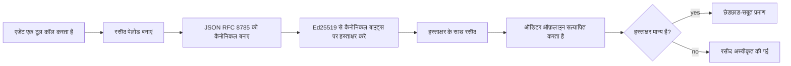
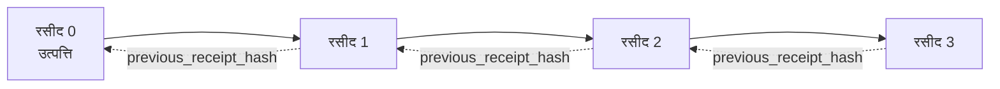

[पाठ वीडियो देखें: क्रिप्टोग्राफिक रसीदों के साथ AI एजेंट्स को सुरक्षित करना](https://youtu.be/PLACEHOLDER_VIDEO_ID)

> _(पाठ वीडियो और थंबनेल मर्ज के बाद Microsoft कंटेंट टीम द्वारा जोड़े जाएंगे, जो पाठ 14 / 15 पैटर्न से मेल खाते हैं।)_

# क्रिप्टोग्राफिक रसीदों के साथ AI एजेंट्स को सुरक्षित करना

## परिचय

यह पाठ निम्न विषयों को कवर करेगा:

- AI एजेंट्स के लिए ऑडिट ट्रेल्स क्यों अनुपालन, डिबगिंग और भरोसे के लिए महत्वपूर्ण हैं।
- क्रिप्टोग्राफिक रसीद क्या है और यह बिना हस्ताक्षर वाले लॉग लाइन से कैसे भिन्न है।
- किसी एजेंट के टूल कॉल के लिए सादे Python में एक हस्ताक्षरित रसीद कैसे तैयार करें।
- ऑफ़लाइन रसीद का सत्यापन कैसे करें और छेड़छाड़ का पता कैसे लगाएं।
- रसीदों को इस तरह कैसे जोड़ें कि एक हटाने या पुनःक्रमित करने से श्रृंखला टूट जाए।
- रसीदें क्या प्रमाणित करती हैं और वे स्पष्ट रूप से क्या प्रमाणित नहीं करतीं।

## सीखने के लक्ष्य

इस पाठ को पूरा करने के बाद, आप जानेंगे कि कैसे:

- असफलता के मोड्स की पहचान करें जो एजेंट क्रियाओं के लिए क्रिप्टोग्राफिक स्रोत प्रेरित करते हैं।
- एक कैनोनिकल JSON पेलोड पर Ed25519-संकेतित रसीद प्रोड्यूस करें।
- केवल सिग्नर की सार्वजनिक कुंजी का उपयोग करके स्वतंत्र रूप से रसीद का सत्यापन करें।
- संशोधित रसीद पर फिर से सत्यापन चलाकर छेड़छाड़ का पता लगाएं।
- रसीदों की हैश-श्रृंखला बनाएं और समझाएं कि यह श्रृंखला क्यों महत्वपूर्ण है।
- पहचानें कि रसीदें क्या प्रमाणित करती हैं (अट्रिब्यूशन, इंटीग्रिटी, ऑर्डरिंग) और वे क्या प्रमाणित नहीं करतीं (क्रिया की सहीता, नीति की सुदृढ़ता)।

## समस्या: आपके एजेंट का ऑडिट ट्रेल

कल्पना करें कि आपने Contoso Travel के लिए एक AI एजेंट तैनात किया है। एजेंट ग्राहक अनुरोध पढ़ता है, उड़ान API को कॉल करता है विकल्प देखने के लिए, और ग्राहक की ओर से सीट बुक करता है। पिछले त्रैमासिक में, एजेंट ने 50,000 बुकिंग्स प्रोसेस कीं।

आज एक ऑडिटर आता है। वह एक सरल सवाल पूछता है: "मुझे दिखाओ कि आपका एजेंट ने क्या किया।"

आप अपनी लॉग फाइल्स सौंपते हैं। ऑडिटर उन्हें देखता है और एक कठिन सवाल पूछता है: "मुझे कैसे पता चले कि इन लॉग्स को संपादित नहीं किया गया?"

यही ऑडिट-ट्रेल समस्या है। आज के अधिकांश एजेंट तैनातियां इस पर निर्भर हैं:

- **एप्लिकेशन लॉग्स**: एजेंट द्वारा स्वयं लिखे गए, फ़ाइल-सिस्टम एक्सेस वाले कोई भी संपादित कर सकता है।
- **क्लाउड लॉगिंग सेवाएँ**: प्लेटफ़ॉर्म स्तर पर छेड़छाड़ प्रकट होती है लेकिन केवल तभी जब ऑडिटर प्लेटफ़ॉर्म ऑपरेटर पर भरोसा करता हो।
- **डेटाबेस ट्रांजैक्शन लॉग्स**: डेटाबेस परिवर्तनों के लिए उपयुक्त लेकिन मनमाने टूल कॉल्स के लिए नहीं।

इनमें से कोई भी ऑडिटर के सवाल का जवाब नहीं दे सकता बिना ऑडिटर के किसी पर भरोसा करने की आवश्यकता के (आप, आपका क्लाउड प्रदाता, आपका डेटाबेस विक्रेता)। आंतरिक उपयोग के लिए, वह भरोसा अक्सर स्वीकार्य होता है। नियमन-युक्त कार्यभारों (वित्त, स्वास्थ्य सेवा, EU AI अधिनियम के अधीन कुछ भी) के लिए, ऐसा नहीं होता।

क्रिप्टोग्राफिक रसीदें इस समस्या को इस तरह हल करती हैं कि प्रत्येक एजेंट क्रिया स्वतंत्र रूप से सत्यापित योग्य होती है। ऑडिटर को आप पर भरोसा करने की आवश्यकता नहीं है। उन्हें केवल आपकी सार्वजनिक कुंजी और रसीद स्वयं चाहिए।

## क्रिप्टोग्राफिक रसीद क्या है?

रसीद एक JSON ऑब्जेक्ट है जो रिकॉर्ड करता है कि एजेंट ने क्या किया, इसे डिजिटल हस्ताक्षर के साथ साइन किया गया है।


```mermaid
flowchart LR
    A[एजेंट एक टूल कॉल करता है] --> B[रसीद पेलोड बनाएं]
    B --> C[JSON RFC 8785 को कैनोनिकल बनाएं]
    C --> E[Ed25519 से कैनोनिकल बाइट्स पर हस्ताक्षर करें]
    E --> F[हस्ताक्षर के साथ रसीद]
    F --> G[ऑडिटर ऑफ़लाइन सत्यापित करता है]
    G --> H{हस्ताक्षर मान्य है?}
    H -- yes --> I[छेड़छाड़-सबूत प्रमाण]
    H -- no --> J[रसीद अस्वीकृत की गई]
```

एक न्यूनतम रसीद इस प्रकार दिखती है:

```json
{
  "type": "agent.tool_call.v1",
  "agent_id": "contoso-travel-bot",
  "tool_name": "lookup_flights",
  "tool_args_hash": "sha256:a3f9c1...",
  "result_hash": "sha256:7b2e1d...",
  "policy_id": "contoso-travel-policy-v3",
  "timestamp": "2026-04-25T14:30:00Z",
  "sequence": 47,
  "previous_receipt_hash": "sha256:9d4e6a...",
  "signature": {
    "alg": "EdDSA",
    "sig": "c5af83...",
    "public_key": "8f3b2c..."
  }
}
```

तीन गुणकारीताएं कार्य कर रही हैं:

1. **हस्ताक्षर**। रसीद एजेंट के गेटवे द्वारा Ed25519 प्राइवेट की से साइन की जाती है। संबंधित सार्वजनिक कुंजी वाला कोई भी ऑफ़लाइन हस्ताक्षर का सत्यापन कर सकता है। किसी भी फ़ील्ड में छेड़छाड़ हस्ताक्षर को अमान्य बना देती है।

2. **कैनोनिकल एंकोडिंग**। हस्ताक्षर से पहले, रसीद JSON कैनोनिकलाइजेशन स्कीम (JCS, RFC 8785) का उपयोग करके सीरियलाइज़ की जाती है। यह सुनिश्चित करता है कि एक जैसे तार्किक रसीद दो निरुपयोगण द्वारा एक जैसे बाइट-पहचान योग्य आउटपुट का उत्पादन करें। बिना कैनोनिकलाइजेशन के, अलग-अलग JSON सीरियलाइज़र एक ही सामग्री के लिए अलग-अलग हस्ताक्षर बनाएंगे।

3. **हैश चेनिंग**। `previous_receipt_hash` फ़ील्ड प्रत्येक रसीद को उससे पहले वाली से जोड़ता है। एक रसीद को हटाने या पुनःक्रमित करने से उसके बाद की हर रसीद टूट जाती है। श्रृंखला स्तर पर छेड़छाड़ दिखाई देती है, भले ही व्यक्तिगत हस्ताक्षर पार हो जाएं।

यह तीनों गुणकारीताएं मिलकर तीन गारंटियाँ प्रदान करती हैं:

- **अट्रिब्यूशन**: इस कुंजी ने इस सामग्री को साइन किया।
- **इंटीग्रिटी**: सामग्री हस्ताक्षर के बाद से नहीं बदली है।
- **ऑर्डरिंग**: यह रसीद श्रृंखला में उस रसीद के बाद आई।

## Python में रसीद बनाना

रसीद बनाने के लिए आपको किसी खास लाइब्रेर की आवश्यकता नहीं है। क्रिप्टोग्राफिक प्रिमिटिव्स व्यापक रूप से उपलब्ध हैं और लॉजिक कुछ दर्जन Python लाइनों का है।

`code_samples/18-signed-receipts.ipynb` में हैंड्स-ऑन अभ्यास पूरे प्रवाह को विस्तार से दिखाता है। सारांश संस्करण:

```python
import json
import hashlib
import base64
from nacl import signing
from jcs import canonicalize  # RFC 8785 कैनोनिकल JSON

def b64url_nopad(data: bytes) -> str:
    return base64.urlsafe_b64encode(data).decode("ascii").rstrip("=")

def sha256_canonical(obj) -> str:
    """SHA-256 of a Python object's JCS-canonical JSON form."""
    return f"sha256:{hashlib.sha256(canonicalize(obj)).hexdigest()}"

# साइनिंग कुंजी उत्पन्न करें या लोड करें (उत्पादन में, इसे की वॉल्ट में स्टोर करें)
signing_key = signing.SigningKey.generate()
verify_key = signing_key.verify_key

# रिसीट पेलोड बनाएँ (अभी कोई हस्ताक्षर नहीं)
tool_args = {"origin": "SYD", "destination": "LAX"}
tool_result = [{"flight": "QF11", "price": 1850, "stops": 0}]

payload = {
    "type": "agent.tool_call.v1",
    "agent_id": "contoso-travel-bot",
    "tool_name": "lookup_flights",
    "tool_args_hash": sha256_canonical(tool_args),
    "result_hash": sha256_canonical(tool_result),
    "policy_id": "contoso-travel-policy-v3",
    "timestamp": "2026-04-25T14:30:00Z",
    "sequence": 0,
    "previous_receipt_hash": None,
}

# JCS बाइट्स को सीधे कैनोनिकलाइज़ और साइन करें। PureEdDSA आंतरिक रूप से हैश करता है।
canonical_bytes = canonicalize(payload)
signature_bytes = signing_key.sign(canonical_bytes).signature

# एक संरचित हस्ताक्षर ऑब्जेक्ट संलग्न करें।
receipt = {
    **payload,
    "signature": {
        "alg": "EdDSA",
        "sig": b64url_nopad(signature_bytes),
        "public_key": b64url_nopad(bytes(verify_key)),
    },
}
```

यही पूरी साइनिंग पाइपलाइन है। नोटबुक में अभ्यास हर कदम walkthrough करता है।

## रसीद का सत्यापन और छेड़छाड़ का पता लगाना

सत्यापन इसके विपरीत संचालन है:

```python
import base64
import hashlib
from nacl import signing
from nacl.exceptions import BadSignatureError
from jcs import canonicalize

def b64url_decode(s: str) -> bytes:
    padding = "=" * ((4 - len(s) % 4) % 4)
    return base64.urlsafe_b64decode(s + padding)

def verify_receipt(receipt: dict) -> bool:
    # हस्ताक्षर एक संरचित वस्तु है: {"alg", "sig", "public_key"}.
    sig_obj = receipt.get("signature")
    if not sig_obj or sig_obj.get("alg") != "EdDSA":
        return False

    # उस पेलोड को पुनर्निर्मित करें जिसे वास्तव में हस्ताक्षरित किया गया था (हस्ताक्षर को छोड़कर सब कुछ).
    payload = {k: v for k, v in receipt.items() if k != "signature"}

    canonical_bytes = canonicalize(payload)

    try:
        verify_key = signing.VerifyKey(b64url_decode(sig_obj["public_key"]))
        verify_key.verify(canonical_bytes, b64url_decode(sig_obj["sig"]))
        return True
    except BadSignatureError:
        return False
```

यह फ़ंक्शन एक रसीद लेता है और यदि हस्ताक्षर वैध है तो `True` लौटाता है, अन्यथा `False`। कोई नेटवर्क कॉल, कोई सेवा निर्भरता, किसी तीसरे पक्ष पर भरोसा आवश्यक नहीं।

छेड़छाड़ का पता लगाने को व्यावहारिक रूप में देखने के लिए, नोटबुक walkthrough करता है:

1. एक वैध रसीद बनाना और पुष्टि करना कि यह सत्यापित होती है।
2. `tool_args_hash` फ़ील्ड का एक बाइट संशोधित करना।
3. सत्यापन को दोबारा चलाना और देखना कि यह विफल हो जाता है।

यह व्यावहारिक प्रदर्शन है कि रसीदें छेड़छाड़-प्रकट हैं: कोई भी संशोधन, चाहे कितना भी छोटा हो, हस्ताक्षर को तोड़ देता है।

## मल्टी-स्टेप एजेंट्स के लिए रसीदों की श्रृंखला बनाना

एक एकल हस्ताक्षरित रसीद एक क्रिया की रक्षा करती है। रसीदों की एक श्रृंखला एक अनुक्रम की रक्षा करती है।


```mermaid
flowchart LR
    R0[रसीद 0<br/>उत्पत्ति] --> R1[रसीद 1]
    R1 --> R2[रसीद 2]
    R2 --> R3[रसीद 3]
    R1 -. previous_receipt_hash .-> R0
    R2 -. previous_receipt_hash .-> R1
    R3 -. previous_receipt_hash .-> R2
```

प्रत्येक रसीद से पहले की रसीद के हैश को रिकॉर्ड करता है। चुपके से रसीद 2 को हटाने के लिए, हमलावर को या तो:

- रसीद 3 के `previous_receipt_hash` फ़ील्ड को संशोधित करना होगा (रसीद 3 के हस्ताक्षर को तोड़ता है), या
- संशोधित रसीद 3 पर नया हस्ताक्षर बनाना होगा (एजेंट के प्राइवेट की की आवश्यकता होती है)।

यदि प्राइवेट की हार्डवेयर की वॉल्ट में हो और आप प्रत्येक रसीद के साथ सार्वजनिक कुंजी प्रकाशित करते हैं, तो बिना पता चले कोई भी हमला संभव नहीं है।

नोटबुक walkthrough करता है:

1. तीन रसीदों की श्रृंखला बनाना।
2. सत्यापित करना कि प्रत्येक रसीद का `previous_receipt_hash` पिछली रसीद के वास्तविक हैश से मेल खाता है।
3. मध्य की एक रसीद के साथ छेड़छाड़ करना और देखना कि श्रृंखला उसी बिंदु पर टूट जाती है।

इस तरह आप एक ऑडिट ट्रेल बनाते हैं जिसे बाहरी ऑडिटर आपकी भरोसा किए बिना सत्यापित कर सकता है।

## रसीदें क्या साबित करती हैं (और क्या नहीं)

यह इस पाठ का सबसे महत्वपूर्ण हिस्सा है। रसीदें शक्तिशाली हैं लेकिन उनकी शक्ति सीमित है।

**रसीदें तीन चीज़ें साबित करती हैं:**

1. **अट्रिब्यूशन**: एक विशिष्ट कुंजी ने एक विशिष्ट पेलोड को साइन किया।
2. **इंटीग्रिटी**: पेलोड साइन करने के बाद से नहीं बदला है।
3. **ऑर्डरिंग**: यह रसीद हैश श्रृंखला में उस रसीद के बाद आई।

**रसीदें यह साबित नहीं करतीं:**

1. **सहीता**: कि एजेंट की क्रिया सही क्रिया थी। एक गलत उत्तर के लिए भी रसीद उतनी ही आसानी से साइन हो सकती है जितनी सही उत्तर के लिए।
2. **नीति अनुपालन**: कि `policy_id` में संदर्भित नीति वास्तव में मूल्यांकित हुई थी, या यदि जाँची गई होती तो यह क्रिया अनुमत होती। रसीद यह रिकॉर्ड करती है कि क्या दावा किया गया था, क्या लागू किया गया था नहीं।
3. **कुंजी से परे पहचान**: रसीद कहती है "इस कुंजी ने इस सामग्री को साइन किया।" यह नहीं कहती "किसी मानव ने इसे अधिकृत किया।" एक कुंजी को व्यक्ति या संगठन से जोड़ने के लिए अलग पहचान अवसंरचना चाहिए (डायरेक्ट्री, सार्वजनिक कुंजी रजिस्ट्री आदि)।
4. **इनपुट की सत्यता**: यदि एजेंट को कोई छेड़ा हुआ प्रॉम्प्ट मिलता है और वह उस पर कार्रवाई करता है, तो रसीद क्रिया को सही रूप में रिकॉर्ड करती है। रसीद इनपुट सत्यापन की जगह नहीं है, यह उसके बाद की प्रक्रिया है।

यह सीमा दो कारणों से महत्वपूर्ण है:

- यह बताती है कि रसीदें किस लिए उपयोगी हैं: एजेंट व्यवहार को ऑडिट योग्य और छेड़छाड़-प्रकट बनाना, यहाँ तक कि संगठनात्मक सीमाओं के पार भी।
- यह बताती है कि आपको अभी कौन-से अतिरिक्त स्तरों की आवश्यकता है: इनपुट सत्यापन (पाठ 6), नीति प्रवर्तन (नीचे संक्षेप में), और पहचान अवसंरचना (इस पाठ के दायरे से बाहर)।

एक सामान्य गलती यह मानना है कि "हमारे पास रसीदें हैं" मतलब "हम सुसंगठित हैं।" ऐसा नहीं है। रसीदें आधार हैं। सुसंगठन वह सिस्टम है जो आप ऊपर बनाते हैं।

## यह साबित करना कि किसी मानव ने ठीक वही क्रिया अनुमोदित की

ऊपर आइटम 3 अपना सेक्षन योग्य है: एक क्रिया रसीद कहती है "इस कुंजी ने इस सामग्री को साइन किया," कभी नहीं "इस मानव ने यह अधिकृत किया।" उच्च जोखिम वाली क्रियाओं (रिफंड, विलोपन, वायर ट्रांसफर) के लिए, शासन ढांचे बढ़ते हुए वही गायब कथन आवश्यक करते हैं, और इसे आप उसी प्रिमिटिव्स से उत्पन्न कर सकते हैं जो इस पाठ में पहले से बनाए हैं।

अगला नोटबुक `code_samples/human-authorization-receipts.ipynb` एक दूसरी रसीद प्रकार जोड़ता है, `human.approval.v1`, समान लिफाफा रूप में जैसा इस पाठ की रसीदों का है (एक टाइप किया हुआ पेलोड जिसे Ed25519 द्वारा उसके कैनोनिकल JCS बाइट्स पर साइन किया गया है, `signature` ऑब्जेक्ट साइन किए गए बाइट्स के बाहर)। एक नामित अनुमोदक पूरी कैनोनिकल क्रिया और उसका डिजेस्ट निष्पादन से पहले साइन करता है; एजेंट की क्रिया रसीद उसी क्रिया डिजेस्ट और `parent_approval_ref` लेकर चलती है, जो स्वीकृति का `receipt_hash` होता है, ठीक उसी कंवेंशन में जैसा `previous_receipt_hash` श्रृंखला में आपकी बनाई श्रृंखला में। एक `verify_chain` दोनों वस्तुओं को **अलग पिन की रजिस्ट्रियों** (अनुमोदक कुंजी विरुद्ध एजेंट कुंजी) के तहत सत्यापित करता है, इसलिए कोड पाथ साझा है लेकिन प्राधिकार कभी साझा नहीं होते।

सावधानीपूर्वक व्यक्त की गई यह संपत्ति: *मानव ने ठीक वही क्रिया अनुमोदित की, और एजेंट ने ठीक वही अनुमोदित क्रिया निष्पादित की।* नोटबुक के अस्वीकार फ़िक्स्चर इस संपत्ति को वास्तविक बनाते हैं बजाय केवल कथित करने के:

- पुराने क्लासिक सेट: छेड़छाड़, भ्रमित डिप्टी, रिप्ले, दोनों तरफ से नकली कुंजी, खराब इनपुट;
- **पुरानी प्राधिकारी**: ऐसा हस्ताक्षर जो अभी भी सत्यापित होता है, पर अस्वीकार कर दिया जाता है क्योंकि नीति संस्करण बदल गया, अनुमोदक कुंजी पिन की गई रजिस्ट्री से हटा दी गई, या स्वीकृति निष्पादन से पहले समाप्त हो गई;
- **डाइजेस्ट प्रतिस्थापन**: एक वैध रूप से साइन की गई क्रिया रसीद जो एक *वास्तविक* स्वीकृति की ओर इशारा करती है जो एक *भिन्न* कैनोनिकल क्रिया को बाधित करती है।

प्रत्येक असफलता एक विशिष्ट कारण के साथ अस्वीकृति प्रदर्शित करती है, ताकि एक ऑडिटर पढ़ते हुए बता सके कि प्राधिकारी पुरानी हुई या निष्पादित क्रिया बदली। नोटबुक का नियम: एक साइन की गई स्वीकृति स्वयं प्राधिकारी नहीं है। प्राधिकारी केवल तब होता है जब दोनों रसीदें निष्पादन के समय एक ही कैनोनिकल क्रिया को बाधित करती हैं। मानव-स्वीकृति रसीद इस पाठ द्वारा परिभाषित एक शैक्षिक संयोजन है, न कि `draft-farley-acta-signed-receipts` के द्वारा परिभाषित कोई रसीद प्रकार।

## उत्पादन संदर्भ

इस पाठ का Python कोड जानबूझकर न्यूनतम है ताकि आप हर लाइन पढ़कर ठीक समझ सकें कि क्या हो रहा है। उत्पादन में आपके पास दो विकल्प हैं:

1. **क्रिप्टोग्राफिक प्रिमिटिव्स पर सीधे निर्माण करें।** ऊपर दिखाए गए 50 लाइन कई उपयोग मामलों के लिए पर्याप्त हैं। PyNaCl (Ed25519) और `jcs` पैकेज (कैनोनिकल JSON) अच्छी तरह से मेंटेन और ऑडिट किए गए लाइब्रेरी हैं।

2. **एक उत्पादन रसीद लाइब्रेरी उपयोग करें।** कई ओपन-सोर्स प्रोजेक्ट्स उसी पैटर्न को अतिरिक्त सुविधाओं (की रोटेशन, बैच सत्यापन, JWK सेट वितरण, नीति इंजन के साथ एकीकरण) के साथ लागू करते हैं:
   - साइनिंग पाइपलाइन JCS और सिग्नेचर-स्कोप कॉन्वेंशनों का उपयोग करती है एक स्वतंत्र IETF इंटरनेट-ड्राफ्ट ([`draft-farley-acta-signed-receipts`](https://datatracker.ietf.org/doc/draft-farley-acta-signed-receipts/), संशोधन 02) में। इस पाठ की फ्लैट शैक्षिक रसीद ड्राफ्ट के `{payload, signature}` लिफाफे से भिन्न है और इसे एक अनुरूप कार्यान्वयन के रूप में प्रस्तुत नहीं किया गया है। ड्राफ्ट एक साझा अनुरूपता सूट ([agent-governance-testvectors](https://github.com/ScopeBlind/agent-governance-testvectors)) जारी करता है जो इसके वायर फॉर्मेट के लिए लक्षित कार्यान्वयनों के लिए है।
   - Microsoft एजेंट गवर्नेंस टूलकिट रसीदों को Cedar-आधारित नीति निर्णयों के साथ संयोजित करता है; उस रिपॉजिटरी में ट्यूटोरियल 33 देखें एंड-टू-एंड उदाहरण के लिए।
   - `protect-mcp` (npm) और `@veritasacta/verify` (npm) पैकेजेज़ Node आधारित रसीद हस्ताक्षर और ऑफ़लाइन सत्यापन प्रदान करते हैं, किसी भी MCP सर्वर को छेड़छाड़-प्रकट ऑडिट ट्रेल के साथ लपेटने के लिए, जिसमें एक होल्ड-फॉर-को-साइन फ्लो शामिल है जिसमें रुकी गई क्रिया एक अनुमोदन रसीद उत्सर्जित करती है जो क्रिया डिजेस्ट से बंधी होती है (डेस्कटॉप फ्लो में WebAuthn-समर्थित), वही अनुमोदन-रसीद पैटर्न जो ऊपर मानव-अधिकृत नोटबुक में है।
   - **[nobulex](https://github.com/arian-gogani/nobulex)** Python SDK (`pip install nobulex`) Python में वही Ed25519 + JCS साइनिंग पैटर्न प्रदान करता है LangChain और CrewAI एकीकरणों के साथ, जिसमें प्रकाशित क्रॉस-वैलिडेशन टेस्ट वेक्टर और [OWASP PR #2210](https://github.com/OWASP/CheatSheetSeries/pull/2210) के माध्यम से योगदान किया गया अनुपालन मानचित्र शामिल है।

अपनी लाइब्रेरी बनाने और एक पुस्तकालय उपयोग करने के बीच निर्णय वही है जो अपनी JWT लाइब्रेरी लिखने और परीक्षण की गई उपयोग करने के बीच होता है: दोनों उचित हैं; लाइब्रेरी समय बचाती है और ऑडिट सतह कम करती है; खुद से शुरुआत का तरीका आपको हर प्रिमिटिव को समझने के लिए मजबूर करता है। यह पाठ शुरुआत से मार्ग दिखाता है ताकि आपके पास दोनों विकल्पों के लिए आधार हो।

## ज्ञान जांच

अभ्यास करने से पहले अपनी समझ का परीक्षण करें।

**1. रसीद एजेंट के निजी Ed25519 कुंजी से साइन होती है। ऑडिटर के पास केवल सार्वजनिक कुंजी है। क्या ऑडिटर रसीद को ऑफ़लाइन सत्यापित कर सकता है?**

<details>
<summary>उत्तर</summary>

हाँ। Ed25519 सत्यापन के लिए केवल सार्वजनिक कुंजी और साइन किए गए बाइट्स की आवश्यकता होती है। कोई नेटवर्क कॉल नहीं, कोई सेवा निर्भरता नहीं। यह वह गुण है जो रसीदों को एयर-गैप्ड, बहु-संगठन या निम्न-भरोसा ऑडिट पर्यावरण में उपयोगी बनाता है।
</details>

**2. एक हमलावर रसीद के `policy_id` फ़ील्ड को संशोधित करता है ताकि यह दावा करे कि यह अधिक उदार नीति द्वारा नियंत्रित था। सिग्नेचर मूल पेलोड पर था। सत्यापन के दौरान क्या होगा?**

<details>
<summary>उत्तर</summary>


सत्यापन विफल हो जाता है। हस्ताक्षर मूल पेलोड के कैनोनिकल बाइट्स पर गणना किया गया था; किसी भी फ़ील्ड को संशोधित करने से वे बाइट्स बदल जाते हैं, जिससे हस्ताक्षर अमान्य हो जाता है। हमलावर को एक नया वैध हस्ताक्षर बनाने के लिए निजी कुंजी की आवश्यकता होगी, जो उनके पास नहीं है।
</details>

**3. रसीद में कच्चे तर्क और परिणाम के बजाय `tool_args_hash` और `result_hash` क्यों शामिल होते हैं?**

<details>
<summary>उत्तर</summary>

दो कारण हैं। पहला, रसीद को उन वातावरणों में संग्रहित या प्रेषित करने की आवश्यकता हो सकती है जहां कच्ची सामग्री (PII, व्यापार डेटा) का लीक होना समस्या हो। हैशिंग रसीद को छोटा और सामग्री को निजी रखता है; ऑडिटर सत्यापित करता है कि हैश वास्तविक सामग्री की अलग-अलग संग्रहीत प्रति से मेल खाता है। दूसरा, हैश की एक निश्चित आकार होती है; हैश वाली रसीद का आकार इनपुट और आउटपुट के आकार की परवाह किए बिना सीमित रहता है।
</details>

**4. `previous_receipt_hash` फ़ील्ड प्रत्येक रसीद को इसके पूर्ववर्ती से जोड़ता है। यदि कोई हमलावर चेन के बीच से एक रसीद चुपचाप हटाता है, तो क्या अमान्य हो जाएगा?**

<details>
<summary>उत्तर</summary>

हटाई गई रसीद के बाद की हर रसीद। उनके `previous_receipt_hash` फ़ील्ड अब वास्तविक चेन से मेल नहीं खाते (क्योंकि जिस रसीद का वे संदर्भ लेते थे वह अब अस्तित्व में नहीं है, या चेन अब दूसरे पूर्ववर्ती की ओर इशारा करता है)। हटाने को छुपाने के लिए, हमलावर को हर बाद की रसीद पर पुनः हस्ताक्षर करना होगा, जिसके लिए निजी कुंजी की आवश्यकता है।
</details>

**5. रसीद साफ़-सुथरी तरह से सत्यापित होती है। क्या यह प्रमाणित करता है कि एजेंट की कार्रवाई सही, उचित, या नीति के अनुरूप थी?**

<details>
<summary>उत्तर</summary>

नहीं। एक वैध रसीद तीन चीजें प्रमाणित करता है: अभिकथन (इस कुंजी ने इस सामग्री पर हस्ताक्षर किया), अखंडता (सामग्री में कोई बदलाव नहीं हुआ), और क्रम (यह रसीद उस रसीद के बाद आई)। यह प्रमाणित नहीं करता कि कार्रवाई सही थी, `policy_id` में नामित नीति का वास्तव में मूल्यांकन किया गया, या एजेंट ने हर नियम का पालन किया। रसीद एजेंट के व्यवहार को ऑडिटेबल बनाती हैं, जरूरी नहीं कि सही। यह पाठ की सबसे महत्वपूर्ण सीमा है।
</details>

## अभ्यास अभ्यास

`code_samples/18-signed-receipts.ipynb` खोलें और सभी चार अनुभाग पूरे करें:

1. **सेक्शन 1**: अपनी पहली रसीद पर हस्ताक्षर करें और उसे सत्यापित करें।
2. **सेक्शन 2**: रसीद में छेड़छाड़ करें और सत्यापन असफल होता देखें।
3. **सेक्शन 3**: तीन-रसीद की चेन बनाएं और चेन की अखंडता सत्यापित करें।
4. **सेक्शन 4**: Microsoft Agent Framework के साथ बनाए गए एजेंट पर पैटर्न लागू करें: एक टूल कॉल को रसीद-हस्ताक्षर में लपेटें, फिर स्वतंत्र रूप से रसीद को सत्यापित करें।

**स्ट्रेच चैलेंज 1:** अपनी पसंद का एक अतिरिक्त फ़ील्ड जोड़कर रसीद स्कीमा बढ़ाएं (उदाहरण के लिए, ट्रेसिंग के लिए एक अनुरोध ID), कैनोनिकल साइन लॉजिक को इसे शामिल करने के लिए अपडेट करें, और पुष्टि करें कि रसीद अभी भी सत्यापन के माध्यम से पूरी तरह से गुजरती है। फिर साइनिंग के बाद फ़ील्ड को संशोधित करें और पुष्टि करें कि सत्यापन विफल हो जाता है। यह आपको समझने के लिए मजबूर करता है कि कैनोनिकल एन्कोडिंग के हर बाइट का हस्ताक्षर में कितना योगदान होता है।

**स्ट्रेच चैलेंज 2:** अपनी दो रसीदों को SHA-256 हैश करें (उनके कैनोनिकल बाइट्स को एक निर्धारित क्रम में संयोजित करें) और परिणामस्वरूप डाइजेस्ट को तीसरी रसीद में एक नए फ़ील्ड के रूप में एम्बेड करें, फिर इसे साइन करें। पुष्टि करें कि तीनों रसीदें अभी भी पूरी तरह से सत्यापित होती हैं। आपने अभी एक-चरण समावेशन प्रमाण बनाया है: जो कोई भी तीसरी रसीद के पास है, वह प्रमाणित कर सकता है कि पहले दो उस समय मौजूद थे जब इसे साइन किया गया था, बिना उनकी सामग्री का खुलासा किए। यह पैटर्न है जिसे स्केल पर सेलेक्टिव-डिस्क्लोज़र रसीदें उपयोग करती हैं (Merkle कमिटमेंट, RFC 6962)।

## निष्कर्ष

क्रिप्टोग्राफिक रसीदें AI एजेंटों को एक ऑडिट ट्रेल प्रदान करती हैं जो:

- **स्वतंत्र रूप से सत्यापित करने योग्य**: किसी भी पक्ष के पास सार्वजनिक कुंजी होने पर वे सत्यापित कर सकते हैं, कोई सेवा निर्भरता नहीं।
- **चेकसुम-प्रमाणित**: कोई भी संशोधन हस्ताक्षर को अमान्य कर देता है।
- **परिवहन योग्य**: रसीद एक छोटा JSON फ़ाइल है; इसे कहीं भी संग्रहित, प्रेषित, और सत्यापित किया जा सकता है।
- **मानकों के अनुरूप**: Ed25519 (RFC 8032), JCS (RFC 8785), और SHA-256 पर निर्मित, ये सभी व्यापक रूप से लागू किए गए प्रिमिटिव हैं।

ये इनपुट सत्यापन, नीति लागू करने, या पहचान अवसंरचना का विकल्प नहीं हैं। वे उन परतों के लिए आधार हैं। जब आप एजेंटों को विनियमित वर्कलोड, मल्टी-ऑर्गनाइज़ेशन वर्कफ़्लो, या किसी ऐसे सेटिंग में तैनात कर रहे हों जहां भविष्य का ऑडिटर आपको भरोसा नहीं कर सकता, रसीदें वह तरीका हैं जिससे आप ऑडिट ट्रेल को ईमानदार बनाते हैं।

सबसे महत्वपूर्ण निष्कर्ष: रसीदें प्रमाणित करती हैं कि किसने क्या कहा, कब कहा। वे यह प्रमाणित नहीं करतीं कि जो कहा गया वह सच या सही था। इस अंतर को मजबूती से पकड़ें। यह एक ईमानदार उत्पत्ति प्रणाली और एक गुमराह करने वाले के बीच का अंतर है।

## उत्पादकता चेकलिस्ट

जब आप इस पाठ से निकलकर वास्तविक पर्यावरण में रसीद-साइन्ड एजेंट तैनात करने के लिए तैयार हों:

- [ ] **हस्ताक्षर कुंजी को डेवलपर लैपटॉप से हटा दें।** Azure Key Vault, AWS KMS, या हार्डवेयर सुरक्षा मॉड्यूल का उपयोग करें। आपके रसीदों पर हस्ताक्षर करने वाली निजी कुंजी कभी स्रोत नियंत्रण में या एप्लिकेशन मशीनों पर सादा पाठ में नहीं होनी चाहिए।
- [ ] **सत्यापन सार्वजनिक कुंजी प्रकाशित करें।** ऑडिटर को ऑफ़लाइन सत्यापन के लिए इसकी आवश्यकता होती है। मानक तरीका JWK सेट होता है जिसे एक प्रसिद्ध URL पर रखा जाता है (RFC 7517), उदाहरण के लिए `https://your-org.example.com/.well-known/agent-keys.json`।
- [ ] **चेन को बाहरी रूप से एंकर करें।** नियमित रूप से नवीनतम चेन हेड हैश को ट्रांसपेरेंसी लॉग (Sigstore Rekor, RFC 3161 टाइमस्टैम्प अथॉरिटी, या कोई दूसरा आंतरिक सिस्टम) में लिखें ताकि बाहरी पक्ष पुष्टि कर सके "यह चेन इस समय मौजूद था।"
- [ ] **रसीदों को अपरिवर्तनीय रूप से संग्रहित करें।** केवल जोड़ने योग्य ब्लॉब स्टोरेज (Azure Storage Immutable Policies के साथ, AWS S3 Object Lock) इंटर्नल से इतिहास को फिर से लिखने से रोकता है।
- [ ] **रिटेंशन पर निर्णय लें।** कई अनुपालन सिस्टम मल्टी-वर्ष रिटेंशन की मांग करते हैं। रसीदों के विकास की योजना बनाएं (प्रत्येक रसीद लगभग 500 बाइट है; एक एजेंट जो प्रति दिन 10K कॉल करता है वह प्रति वर्ष लगभग 1.8 GB उत्पन्न करता है)।
- [ ] **डॉक्यूमेंट करें कि रसीद क्या कवर नहीं करती।** रसीद अभिकथन, अखंडता, और क्रम प्रमाणित करती हैं। आपकी रनबुक में स्पष्ट रूप से सूचीबद्ध होना चाहिए कि अतिरिक्त नियंत्रण (इनपुट सत्यापन, नीति लागू करना, दर सीमा, पहचान अवसंरचना) आपकी शासकीय स्थिति में रसीदों के साथ क्या बैठते हैं।

### AI एजेंटों की सुरक्षा के बारे में अधिक प्रश्न हैं?

[Microsoft Foundry Discord](https://aka.ms/ai-agents/discord) में शामिल हों अन्य शिक्षार्थियों से मिलने, ऑफिस आवर्स में भाग लेने, और अपने AI एजेंट प्रश्नों का उत्तर प्राप्त करने के लिए।

## इस पाठ के परे

यह पाठ एकल-रसीद हस्ताक्षर और हैश-चेन अनुक्रम को कवर करता है। वही प्रिमिटिव कुछ अधिक उन्नत पैटर्न में समाहित होते हैं जिन्हें आप अपनी शासकीय स्थिति के विकास के साथ देख सकते हैं:

- **चयनात्मक प्रकटीकरण।** जब रसीद के फ़ील्ड स्वतंत्र रूप से प्रतिबद्ध (RFC 6962-शैली मर्कल ट्री) होते हैं, आप विशिष्ट ऑडिटर्स को विशिष्ट फ़ील्ड दिखा सकते हैं और बिना उन्हें उजागर किए बाकी को अपरिवर्तित होने का प्रमाण दे सकते हैं। उपयोगी जब एक ही रसीद को व्यापक ऑडिट (जो पूर्णता चाहता है) और डेटा-न्यूनतमकरण नियमों जैसे GDPR (जो ऑडिटर को न्यूनतम देखने देना चाहता है) दोनों को संतुष्ट करना हो।
- **रसीद रद्दीकरण।** यदि किसी हस्ताक्षर कुंजी का समझौता हो जाता है, तो आपको एक तरीका चाहिए जिससे उस कुंजी द्वारा साइन की गई सभी रसीदों को किसी विशिष्ट बिंदु से अविश्वसनीय घोषित किया जा सके। मानक पैटर्न: अल्पकालिक हस्ताक्षर कुंजी और प्रकाशित रद्दीकरण सूची, या एक ट्रांसपेरेंसी लॉग जिसमें रद्दीकरण प्रविष्टियां हों।
- **द्विपक्षीय / विभाजित-हस्ताक्षर रसीदें।** कुछ कार्यान्वयन साइन किए गए पेलोड को पूर्व-प्रकार (`authorization_*`) और बाद-प्रकार (`result_*`) हाफ में विभाजित करते हैं, जिनके स्वतंत्र हस्ताक्षर होते हैं, उपयोगी जब अनुमति निर्णय और देखे गए परिणाम को अलग-अलग अभिनेताओं या समय पर उत्पन्न किया जाता है। यह इस पाठ में सिखाए गए रसीद प्रारूप के शीर्ष पर समेकित होता है।
- **पेलोड संयोजन।** एक रसीद `result_hash` में जो भी बाइट्स आप रखें उसे सील करती है। वास्तविक दुनिया के पेलोड अक्सर एकल टूल कॉल के परिणाम से अधिक समृद्ध होते हैं: निर्णय पूर्व तर्क (मॉडल पूर्वानुमान, विचार किए विकल्प, प्रमाण और उसकी पूर्णता, जोखिम स्थिति, जवाबदेही श्रृंखला, गेट परिणाम) सभी पेलोड के अंदर रह सकते हैं, जो एकल रसीद द्वारा सील किए जाते हैं। इससे रसीद प्रारूप न्यूनतम रहता है जबकि पेलोड स्कीमा डोमेन-बाय-डोमेन विकसित कर सकते हैं।
- **क्रॉस-इम्प्लीमेंटेशन अनुरूपता।** एक ही रसीद प्रारूप के कई स्वतंत्र कार्यान्वयन (Python, TypeScript, Rust, Go) साझा परीक्षण वेक्टरों के खिलाफ क्रॉस-सत्यापन करते हैं। यदि आप अपनी स्वयं की कार्यान्वयन बनाते हैं, तो प्रकाशित वेक्टरों के खिलाफ सत्यापन वायर संगतता की पुष्टि करता है।
- **पोस्ट-क्वांटम माइग्रेशन।** Ed25519 आज व्यापक रूप से तैनात है लेकिन क्वांटम-प्रतिरोधी नहीं है। रसीद प्रारूप एल्गोरिदम-अजाइल है: `signature.alg` फ़ील्ड में तब `ML-DSA-65` (NIST पोस्ट-क्वांटम हस्ताक्षर मानक) हो सकता है जब आपको माइग्रेशन की जरूरत हो। दोहरी रूप से साइन किए गए रसीदों के साथ संक्रमण अवधि की योजना बनाएं।

## अतिरिक्त संसाधन

- <a href="https://datatracker.ietf.org/doc/draft-farley-acta-signed-receipts/" target="_blank">IETF Internet-Draft: मशीन-से-मशीन एक्सेस कंट्रोल के लिए साइन किए गए निर्णय रसीदें</a>
- <a href="https://learn.microsoft.com/azure/ai-studio/responsible-use-of-ai-overview" target="_blank">जिम्मेदार AI अवलोकन (Azure AI)</a>
- <a href="https://datatracker.ietf.org/doc/html/rfc8032" target="_blank">RFC 8032: एडवर्ड्स-कर्व डिजिटल हस्ताक्षर एल्गोरिदम (EdDSA)</a>
- <a href="https://datatracker.ietf.org/doc/html/rfc8785" target="_blank">RFC 8785: JSON कैनोनिकलाइजेशन स्कीम (JCS)</a>
- <a href="https://datatracker.ietf.org/doc/html/rfc6962" target="_blank">RFC 6962: प्रमाणपत्र पारदर्शिता</a> (सेलेक्टिव-डिस्क्लोजर रसीदों द्वारा उपयोग किया गया मर्कल-ट्री निर्माण)
- <a href="https://github.com/microsoft/agent-governance-toolkit/blob/main/docs/tutorials/33-offline-verifiable-receipts.md" target="_blank">Microsoft Agent Governance Toolkit, ट्यूटोरियल 33: ऑफ़लाइन-वेरिफ़िएबल निर्णय रसीदें</a>
- <a href="https://github.com/ScopeBlind/agent-governance-testvectors" target="_blank">इस पाठ में उपयोग किए गए रसीद प्रारूप के लिए क्रॉस-इम्प्लीमेंटेशन अनुरूपता परीक्षण वेक्टर</a> (Apache-2.0)
- <a href="https://pynacl.readthedocs.io/" target="_blank">PyNaCl प्रलेखन</a> (Python में Ed25519)

## पिछला पाठ

[स्थानीय AI एजेंट बनाना](../17-creating-local-ai-agents/README.md)

---

<!-- CO-OP TRANSLATOR DISCLAIMER START -->
**अस्वीकरण**:
इस दस्तावेज़ का अनुवाद AI अनुवाद सेवा [Co-op Translator](https://github.com/Azure/co-op-translator) का उपयोग करके किया गया है। जबकि हम सटीकता के लिए प्रयास करते हैं, कृपया ध्यान दें कि स्वचालित अनुवादों में त्रुटियाँ या अशुद्धियाँ हो सकती हैं। मूल दस्तावेज़ अपनी मूल भाषा में ही प्रामाणिक स्रोत माना जाना चाहिए। महत्वपूर्ण जानकारी के लिए, पेशेवर मानव अनुवाद की सिफारिश की जाती है। इस अनुवाद के उपयोग से उत्पन्न किसी भी गलतफहमी या गलत व्याख्या के लिए हम उत्तरदायी नहीं हैं।
<!-- CO-OP TRANSLATOR DISCLAIMER END -->