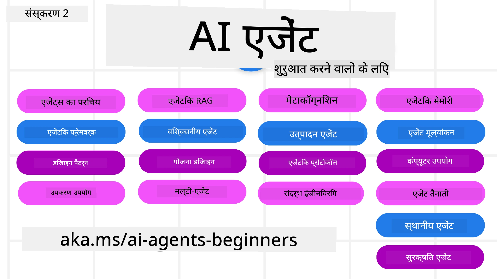

# शुरुआती लोगों के लिए एआई एजेंट्स - एक कोर्स



## एआई एजेंट्स बनाने की शुरुआत करने के लिए आपको जो कुछ भी जानना जरूरी है, वह सिखाने वाला कोर्स

[](https://github.com/microsoft/ai-agents-for-beginners/blob/master/LICENSE?WT.mc_id=academic-105485-koreyst)
[](https://GitHub.com/microsoft/ai-agents-for-beginners/graphs/contributors/?WT.mc_id=academic-105485-koreyst)
[](https://GitHub.com/microsoft/ai-agents-for-beginners/issues/?WT.mc_id=academic-105485-koreyst)
[](https://GitHub.com/microsoft/ai-agents-for-beginners/pulls/?WT.mc_id=academic-105485-koreyst)
[](http://makeapullrequest.com?WT.mc_id=academic-105485-koreyst)

### 🌐 बहुभाषी समर्थन

#### GitHub Action के माध्यम से समर्थित (स्वचालित और हमेशा अपडेट रहता है)

<!-- CO-OP TRANSLATOR LANGUAGES TABLE START -->
[Arabic](../ar/README.md) | [Bengali](../bn/README.md) | [Bulgarian](../bg/README.md) | [Burmese (Myanmar)](../my/README.md) | [Chinese (Simplified)](../zh-CN/README.md) | [Chinese (Traditional, Hong Kong)](../zh-HK/README.md) | [Chinese (Traditional, Macau)](../zh-MO/README.md) | [Chinese (Traditional, Taiwan)](../zh-TW/README.md) | [Croatian](../hr/README.md) | [Czech](../cs/README.md) | [Danish](../da/README.md) | [Dutch](../nl/README.md) | [Estonian](../et/README.md) | [Finnish](../fi/README.md) | [French](../fr/README.md) | [German](../de/README.md) | [Greek](../el/README.md) | [Hebrew](../he/README.md) | [Hindi](./README.md) | [Hungarian](../hu/README.md) | [Indonesian](../id/README.md) | [Italian](../it/README.md) | [Japanese](../ja/README.md) | [Kannada](../kn/README.md) | [Khmer](../km/README.md) | [Korean](../ko/README.md) | [Lithuanian](../lt/README.md) | [Malay](../ms/README.md) | [Malayalam](../ml/README.md) | [Marathi](../mr/README.md) | [Nepali](../ne/README.md) | [Nigerian Pidgin](../pcm/README.md) | [Norwegian](../no/README.md) | [Persian (Farsi)](../fa/README.md) | [Polish](../pl/README.md) | [Portuguese (Brazil)](../pt-BR/README.md) | [Portuguese (Portugal)](../pt-PT/README.md) | [Punjabi (Gurmukhi)](../pa/README.md) | [Romanian](../ro/README.md) | [Russian](../ru/README.md) | [Serbian (Cyrillic)](../sr/README.md) | [Slovak](../sk/README.md) | [Slovenian](../sl/README.md) | [Spanish](../es/README.md) | [Swahili](../sw/README.md) | [Swedish](../sv/README.md) | [Tagalog (Filipino)](../tl/README.md) | [Tamil](../ta/README.md) | [Telugu](../te/README.md) | [Thai](../th/README.md) | [Turkish](../tr/README.md) | [Ukrainian](../uk/README.md) | [Urdu](../ur/README.md) | [Vietnamese](../vi/README.md)

> **स्थानीय रूप से क्लोन करना पसंद करते हैं?**
>
> इस रिपॉजिटरी में 50+ भाषा अनुवाद शामिल हैं, जो डाउनलोड आकार को काफी बढ़ाते हैं। अनुवादों के बिना क्लोन करने के लिए, sparse checkout का उपयोग करें:
>
> **Bash / macOS / Linux:**
> ```bash
> git clone --filter=blob:none --sparse https://github.com/microsoft/ai-agents-for-beginners.git
> cd ai-agents-for-beginners
> git sparse-checkout set --no-cone '/*' '!translations' '!translated_images'
> ```
>
> **CMD (Windows):**
> ```cmd
> git clone --filter=blob:none --sparse https://github.com/microsoft/ai-agents-for-beginners.git
> cd ai-agents-for-beginners
> git sparse-checkout set --no-cone "/*" "!translations" "!translated_images"
> ```
>
> इससे आपको तेजी से डाउनलोड के साथ कोर्स पूरा करने के लिए आवश्यक सबकुछ मिल जाएगा।
<!-- CO-OP TRANSLATOR LANGUAGES TABLE END -->

**यदि आप अतिरिक्त अनुवाद भाषाओं का समर्थन चाहते हैं तो वे इस लिंक पर उपलब्ध हैं: [यहाँ](https://github.com/Azure/co-op-translator/blob/main/getting_started/supported-languages.md)**

[](https://GitHub.com/microsoft/ai-agents-for-beginners/watchers/?WT.mc_id=academic-105485-koreyst)
[](https://GitHub.com/microsoft/ai-agents-for-beginners/network/?WT.mc_id=academic-105485-koreyst)
[](https://GitHub.com/microsoft/ai-agents-for-beginners/stargazers/?WT.mc_id=academic-105485-koreyst)

[](https://discord.gg/nTYy5BXMWG)


## 🌱 शुरूआती कदम

यह कोर्स एआई एजेंट्स बनाने की मूल बातें कवर करता है। प्रत्येक पाठ का अपना विषय होता है, इसलिए आप कहीं भी शुरू कर सकते हैं!

इस कोर्स में बहुभाषी समर्थन उपलब्ध है। हमारे [उपलब्ध भाषाओं यहाँ देखें](#-multi-language-support)। 

यदि यह आपका पहली बार जनरेटिव AI मॉडल के साथ काम कर रहे हैं, तो हमारा [Generative AI For Beginners](https://aka.ms/genai-beginners) कोर्स देखें, जिसमें GenAI के साथ निर्माण के लिए 21 पाठ शामिल हैं।

इस रिपॉजिटरी को [स्टार (🌟) करना न भूलें](https://docs.github.com/en/get-started/exploring-projects-on-github/saving-repositories-with-stars?WT.mc_id=academic-105485-koreyst) और [फोर्क करें](https://github.com/microsoft/ai-agents-for-beginners/fork) ताकि आप कोड चला सकें।

### अन्य सीखने वालों से मिलें, अपने सवालों के जवाब पाएं

अगर आप फंस जाएं या AI एजेंट्स बनाने को लेकर कोई सवाल हो, तो हमारे समर्पित Discord चैनल में शामिल हों [Microsoft Foundry Discord](https://aka.ms/ai-agents/discord) में।

### आपको क्या चाहिए 

इस कोर्स का हर पाठ कोड उदाहरणों के साथ आता है, जो code_samples फ़ोल्डर में मिल सकते हैं। आप [इस रिपॉजिटरी को फोर्क कर](https://github.com/microsoft/ai-agents-for-beginners/fork) अपनी खुद की कॉपी बना सकते हैं।  

इन अभ्यासों में कोड उदाहरण Microsoft Agent Framework और Azure AI Foundry Agent Service V2 का उपयोग करते हैं:

- [Microsoft Foundry](https://aka.ms/ai-agents-beginners/ai-foundry) - Azure अकाउंट आवश्यक है

यह कोर्स Microsoft के निम्नलिखित AI Agent फ्रेमवर्क और सेवाओं का उपयोग करता है:

- [Microsoft Agent Framework (MAF)](https://aka.ms/ai-agents-beginners/agent-framework)
- [Azure AI Foundry Agent Service V2](https://aka.ms/ai-agents-beginners/ai-agent-service)

कुछ कोड उदाहरण वैकल्पिक OpenAI-अनुरूप प्रदाताओं को भी सपोर्ट करते हैं जैसे [MiniMax](https://platform.minimaxi.com/), जो बड़े-कॉन्टेक्स्ट मॉडल (204K टोकन तक) प्रदान करता है। कॉन्फ़िगरेशन विवरण के लिए [Course Setup](./00-course-setup/README.md) देखें।

इस कोर्स के कोड को चलाने के बारे में अधिक जानकारी के लिए, [Course Setup](./00-course-setup/README.md) देखें।

## 🙏 मदद करना चाहते हैं?

क्या आपके पास सुझाव हैं या स्पेलिंग/कोड में त्रुटि मिली है? [अमसूल समस्याएँ दर्ज करें](https://github.com/microsoft/ai-agents-for-beginners/issues?WT.mc_id=academic-105485-koreyst) या [पुल रिक्वेस्ट बनाएं](https://github.com/microsoft/ai-agents-for-beginners/pulls?WT.mc_id=academic-105485-koreyst)


## 📂 हर पाठ में शामिल है

- README में लिखित पाठ और एक संक्षिप्त वीडियो
- Microsoft Agent Framework और Azure AI Foundry के साथ Python कोड उदाहरण
- आपकी सीख जारी रखने के लिए अतिरिक्त संसाधनों के लिंक


## 🗃️ पाठ

| **पाठ**                                       | **पाठ्य और कोड**                                    | **वीडियो**                                                  | **अतिरिक्त सीखना**                                                                     |
|----------------------------------------------|----------------------------------------------------|------------------------------------------------------------|----------------------------------------------------------------------------------------|
| AI एजेंट्स और एजेंट उपयोग मामलों का परिचय     | [लिंक](./01-intro-to-ai-agents/README.md)          | [वीडियो](https://youtu.be/3zgm60bXmQk?si=z8QygFvYQv-9WtO1)  | [लिंक](https://aka.ms/ai-agents-beginners/collection?WT.mc_id=academic-105485-koreyst) |
| एआई एजेंटिक फ्रेमवर्क्स का अन्वेषण            | [लिंक](./02-explore-agentic-frameworks/README.md)  | [वीडियो](https://youtu.be/ODwF-EZo_O8?si=Vawth4hzVaHv-u0H)  | [लिंक](https://aka.ms/ai-agents-beginners/collection?WT.mc_id=academic-105485-koreyst) |
| AI एजेंटिक डिजाइन पैटर्न को समझना             | [लिंक](./03-agentic-design-patterns/README.md)     | [वीडियो](https://youtu.be/m9lM8qqoOEA?si=BIzHwzstTPL8o9GF)  | [लिंक](https://aka.ms/ai-agents-beginners/collection?WT.mc_id=academic-105485-koreyst) |
| टूल उपयोग डिजाइन पैटर्न                         | [लिंक](./04-tool-use/README.md)                    | [वीडियो](https://youtu.be/vieRiPRx-gI?si=2z6O2Xu2cu_Jz46N)  | [लिंक](https://aka.ms/ai-agents-beginners/collection?WT.mc_id=academic-105485-koreyst) |
| एजेंटिक RAG                                   | [लिंक](./05-agentic-rag/README.md)                 | [वीडियो](https://youtu.be/WcjAARvdL7I?si=gKPWsQpKiIlDH9A3)  | [लिंक](https://aka.ms/ai-agents-beginners/collection?WT.mc_id=academic-105485-koreyst) |
| विश्वसनीय AI एजेंट्स बनाना                      | [लिंक](./06-building-trustworthy-agents/README.md) | [वीडियो](https://youtu.be/iZKkMEGBCUQ?si=jZjpiMnGFOE9L8OK ) | [लिंक](https://aka.ms/ai-agents-beginners/collection?WT.mc_id=academic-105485-koreyst) |
| योजना डिजाइन पैटर्न                             | [लिंक](./07-planning-design/README.md)             | [वीडियो](https://youtu.be/kPfJ2BrBCMY?si=6SC_iv_E5-mzucnC)  | [लिंक](https://aka.ms/ai-agents-beginners/collection?WT.mc_id=academic-105485-koreyst) |
| मल्टी-एजेंट डिजाइन पैटर्न                      | [लिंक](./08-multi-agent/README.md)                 | [वीडियो](https://youtu.be/V6HpE9hZEx0?si=rMgDhEu7wXo2uo6g)  | [लिंक](https://aka.ms/ai-agents-beginners/collection?WT.mc_id=academic-105485-koreyst) |
| मेटकॉग्निशन डिज़ाइन पैटर्न                 | [लिंक](./09-metacognition/README.md)               | [वीडियो](https://youtu.be/His9R6gw6Ec?si=8gck6vvdSNCt6OcF)  | [लिंक](https://aka.ms/ai-agents-beginners/collection?WT.mc_id=academic-105485-koreyst) |
| प्रोडक्शन में AI एजेंट्स                       | [लिंक](./10-ai-agents-production/README.md)        | [वीडियो](https://youtu.be/l4TP6IyJxmQ?si=31dnhexRo6yLRJDl)  | [लिंक](https://aka.ms/ai-agents-beginners/collection?WT.mc_id=academic-105485-koreyst) |
| एजेंटिक प्रोटोकॉल्स का उपयोग (MCP, A2A और NLWeb) | [लिंक](./11-agentic-protocols/README.md)           | [वीडियो](https://youtu.be/X-Dh9R3Opn8)                                 | [लिंक](https://aka.ms/ai-agents-beginners/collection?WT.mc_id=academic-105485-koreyst) |
| AI एजेंट्स के लिए कॉन्टेक्स्ट इंजीनियरिंग    | [लिंक](./12-context-engineering/README.md)         | [वीडियो](https://youtu.be/F5zqRV7gEag)                                 | [लिंक](https://aka.ms/ai-agents-beginners/collection?WT.mc_id=academic-105485-koreyst) |
| एजेंटिक मेमोरी का प्रबंधन                    | [लिंक](./13-agent-memory/README.md)     |      [वीडियो](https://youtu.be/QrYbHesIxpw?si=vZkVwKrQ4ieCcIPx)                                                      |                                                                                        |
| माइक्रोसॉफ्ट एजेंट फ्रेमवर्क का अन्वेषण                    | [लिंक](./14-microsoft-agent-framework/README.md)                            |                                                            |                                                                                        |
| कंप्यूटर उपयोग एजेंट्स (CUA) बनाना               | [लिंक](./15-browser-use/README.md)     |                                                            | [लिंक](https://docs.browser-use.com/examples/templates/playwright-integration)         |
| स्केलेबल एजेंट्स को तैनात करना                | जल्द आ रहा है                            |                                                            |                                                                                        |
| लोकल AI एजेंट्स बनाना                         | जल्द आ रहा है                               |                                                            |                                                                                        |
| AI एजेंट्स की सुरक्षा                         | [लिंक](./18-securing-ai-agents/README.md)  |                                                            | [लिंक](https://aka.ms/ai-agents-beginners/collection?WT.mc_id=academic-105485-koreyst) |

## 🎒 अन्य पाठ्यक्रम

हमारी टीम अन्य पाठ्यक्रम भी बनाती है! देखें:

<!-- CO-OP TRANSLATOR OTHER COURSES START -->
### LangChain
[](https://aka.ms/langchain4j-for-beginners)
[](https://aka.ms/langchainjs-for-beginners?WT.mc_id=m365-94501-dwahlin)
[](https://github.com/microsoft/langchain-for-beginners?WT.mc_id=m365-94501-dwahlin)
---

### Azure / Edge / MCP / एजेंट्स
[](https://github.com/microsoft/AZD-for-beginners?WT.mc_id=academic-105485-koreyst)
[](https://github.com/microsoft/edgeai-for-beginners?WT.mc_id=academic-105485-koreyst)
[](https://github.com/microsoft/mcp-for-beginners?WT.mc_id=academic-105485-koreyst)
[](https://github.com/microsoft/ai-agents-for-beginners?WT.mc_id=academic-105485-koreyst)

---
 
### जनरेटिव AI श्रृंखला
[](https://github.com/microsoft/generative-ai-for-beginners?WT.mc_id=academic-105485-koreyst)
[-9333EA?style=for-the-badge&labelColor=E5E7EB&color=9333EA)](https://github.com/microsoft/Generative-AI-for-beginners-dotnet?WT.mc_id=academic-105485-koreyst)
[-C084FC?style=for-the-badge&labelColor=E5E7EB&color=C084FC)](https://github.com/microsoft/generative-ai-for-beginners-java?WT.mc_id=academic-105485-koreyst)
[-E879F9?style=for-the-badge&labelColor=E5E7EB&color=E879F9)](https://github.com/microsoft/generative-ai-with-javascript?WT.mc_id=academic-105485-koreyst)

---
 
### कोर लर्निंग
[](https://aka.ms/ml-beginners?WT.mc_id=academic-105485-koreyst)
[](https://aka.ms/datascience-beginners?WT.mc_id=academic-105485-koreyst)
[](https://aka.ms/ai-beginners?WT.mc_id=academic-105485-koreyst)
[](https://github.com/microsoft/Security-101?WT.mc_id=academic-96948-sayoung)
[](https://aka.ms/webdev-beginners?WT.mc_id=academic-105485-koreyst)
[](https://aka.ms/iot-beginners?WT.mc_id=academic-105485-koreyst)
[](https://github.com/microsoft/xr-development-for-beginners?WT.mc_id=academic-105485-koreyst)

---
 
### कोपिलट श्रृंखला
[](https://aka.ms/GitHubCopilotAI?WT.mc_id=academic-105485-koreyst)
[](https://github.com/microsoft/mastering-github-copilot-for-dotnet-csharp-developers?WT.mc_id=academic-105485-koreyst)
[](https://github.com/microsoft/CopilotAdventures?WT.mc_id=academic-105485-koreyst)
<!-- CO-OP TRANSLATOR OTHER COURSES END -->

## 🌟 समुदाय को धन्यवाद

Agentic RAG प्रदर्शित करने वाले महत्वपूर्ण कोड उदाहरणों के लिए [Shivam Goyal](https://www.linkedin.com/in/shivam2003/) का धन्यवाद।

## योगदान करना

यह परियोजना योगदान और सुझावों का स्वागत करती है। अधिकांश योगदानों के लिए आपको एक 
Contributor License Agreement (CLA) पर सहमति देना आवश्यक है जिसमें आप घोषणा करते हैं कि आपके पास 
कन्ट्रीब्यूशन का उपयोग करने के अधिकार हैं और आप वास्तव में हमें इसका उपयोग करने का अधिकार देते हैं। विवरण के लिए देखें <https://cla.opensource.microsoft.com>।

जब आप पुल रिक्वेस्ट सबमिट करते हैं, तो एक CLA बॉट स्वचालित रूप से यह तय करेगा कि क्या आपको CLA प्रदान करना आवश्यक है 
और PR को उपयुक्त रूप से सजाएगा (जैसे, स्थिति जांच, टिप्पणी)। कृपया बॉट द्वारा दिए गए निर्देशों का पालन करें। 
हमें यह प्रक्रिया हर रिपोजिटरी में केवल एक बार करनी होती है जो हमारा CLA उपयोग करती है।

इस परियोजना ने [Microsoft Open Source Code of Conduct](https://opensource.microsoft.com/codeofconduct/) को अपनाया है।
अधिक जानकारी के लिए देखें [Code of Conduct FAQ](https://opensource.microsoft.com/codeofconduct/faq/) या
[opencode@microsoft.com](mailto:opencode@microsoft.com) पर किसी भी अतिरिक्त प्रश्न या टिप्पणी के लिए संपर्क करें।

## ट्रेडमार्क

इस परियोजना में प्रोजेक्ट्स, उत्पादों या सेवाओं के लिए ट्रेडमार्क या लोगो हो सकते हैं। Microsoft ट्रेडमार्क या लोगो का अधिकृत उपयोग 
Subject to and must follow [Microsoft's Trademark & Brand Guidelines](https://www.microsoft.com/legal/intellectualproperty/trademarks/usage/general)।
इस परियोजना के संशोधित संस्करणों में Microsoft ट्रेडमार्क या लोगो के उपयोग से भ्रम या Microsoft के प्रायोजन का संकेत नहीं मिलना चाहिए।
किसी भी तृतीय पक्ष ट्रेडमार्क या लोगो के उपयोग के लिए उन तृतीय पक्षों की नीतियों का पालन आवश्यक है।

## सहायता प्राप्त करना

यदि आप अटक जाते हैं या AI ऐप्स बनाने को लेकर कोई प्रश्न है, तो जुड़ें:

[](https://aka.ms/foundry/discord)

यदि आपके पास उत्पाद प्रतिक्रिया है या निर्माण के दौरान त्रुटियाँ आती हैं तो यहाँ जाएँ:

[](https://aka.ms/foundry/forum)

---

<!-- CO-OP TRANSLATOR DISCLAIMER START -->
**अस्वीकरण**:
इस दस्तावेज़ का अनुवाद AI अनुवाद सेवा [Co-op Translator](https://github.com/Azure/co-op-translator) का उपयोग करके किया गया है। जबकि हम सटीकता के लिए प्रयास करते हैं, कृपया ध्यान दें कि स्वचालित अनुवादों में त्रुटियाँ या अशुद्धियाँ हो सकती हैं। मूल दस्तावेज़ अपनी मूल भाषा में ही प्रामाणिक स्रोत माना जाना चाहिए। महत्वपूर्ण जानकारी के लिए, पेशेवर मानव अनुवाद की सिफारिश की जाती है। इस अनुवाद के उपयोग से उत्पन्न किसी भी गलतफहमी या गलत व्याख्या के लिए हम उत्तरदायी नहीं हैं।
<!-- CO-OP TRANSLATOR DISCLAIMER END -->