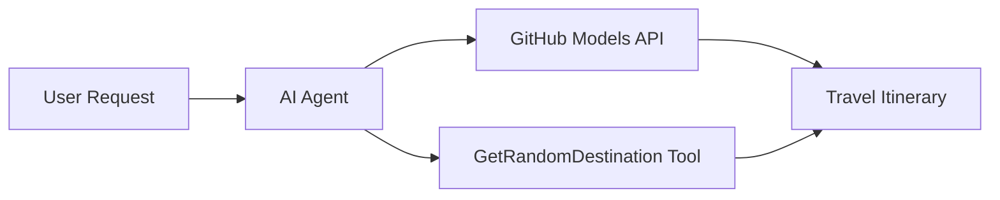

# 🌍 使用 Microsoft Agent Framework (.NET) 的 AI 旅行代理

## 📋 情景概述

此筆記本展示如何使用 Microsoft Agent Framework for .NET 建立一個智能旅行規劃代理。該代理可以自動生成針對全球隨機目的地的個性化一日遊行程。

**主要功能：**
- 🎲 **隨機目的地選擇**：使用自定義工具選擇度假地點
- 🗺️ **智能旅行規劃**：創建詳細的每日行程
- 🔄 **即時流式響應**：支持即時和流式響應
- 🛠️ **自定義工具整合**：展示如何擴展代理功能

## 🔧 技術架構

### 核心技術
- **Microsoft Agent Framework**：最新的 .NET 實現，用於 AI 代理開發
- **GitHub 模型整合**：使用 GitHub 的 AI 模型推理服務
- **OpenAI API 兼容性**：利用 OpenAI 客戶端庫與自定義端點
- **安全配置**：基於環境的 API 密鑰管理

### 主要組件
1. **AIAgent**：主要的代理協調器，負責處理對話流程
2. **自定義工具**：代理可用的 `GetRandomDestination()` 函數
3. **聊天客戶端**：基於 GitHub 模型的對話界面
4. **流式支持**：即時響應生成功能

### 整合模式


## 🚀 快速入門

**先決條件：**
- .NET 9.0 或更高版本
- GitHub Models API 訪問令牌
- 在 `.env` 文件中配置的環境變量

**所需環境變量：**
```env
GITHUB_TOKEN=your_github_token
GITHUB_ENDPOINT=https://models.inference.ai.azure.com
GITHUB_MODEL_ID=gpt-4o-mini
```

按順序運行以下單元格，查看旅行代理的運行效果！

---

## .NET Single File App: AI Travel Agent Example

See `01-dotnet-agent-framework.cs` for the complete runnable code sample.

執行以下代碼示例：

```bash
dotnet run 01-dotnet-agent-framework.cs
```

### Sample Code

```csharp
static string GetRandomDestination()
{
    var destinations = new List<string>
    {
        "Paris, France",
        "Tokyo, Japan",
        "New York City, USA",
        "Sydney, Australia",
        "Rome, Italy",
        "Barcelona, Spain",
        "Cape Town, South Africa",
        "Rio de Janeiro, Brazil",
        "Bangkok, Thailand",
        "Vancouver, Canada"
    };
    var random = new Random();
    int index = random.Next(destinations.Count);
    return destinations[index];
}

// Extract configuration from environment variables
var github_endpoint = Environment.GetEnvironmentVariable("GITHUB_ENDPOINT") ?? throw new InvalidOperationException("GITHUB_ENDPOINT is not set.");
var github_model_id = Environment.GetEnvironmentVariable("GITHUB_MODEL_ID") ?? "gpt-4o-mini";
var github_token = Environment.GetEnvironmentVariable("GITHUB_TOKEN") ?? throw new InvalidOperationException("GITHUB_TOKEN is not set.");

// Configure OpenAI Client Options
var openAIOptions = new OpenAIClientOptions()
{
    Endpoint = new Uri(github_endpoint)
};

// Initialize OpenAI Client with GitHub Models Configuration
var openAIClient = new OpenAIClient(new ApiKeyCredential(github_token), openAIOptions);

// Create AI Agent with Travel Planning Capabilities
AIAgent agent = openAIClient
    .GetChatClient(github_model_id)
    .CreateAIAgent(
        instructions: "You are a helpful AI Agent that can help plan vacations for customers at random destinations",
        tools: [AIFunctionFactory.Create(GetRandomDestination)]
    );

// Execute Agent: Plan a Day Trip (Non-Streaming)
Console.WriteLine(await agent.RunAsync("Plan me a day trip"));

// Execute Agent: Plan a Day Trip (Streaming Response)
await foreach (var update in agent.RunStreamingAsync("Plan me a day trip"))
{
    Console.Write(update);
}
```
