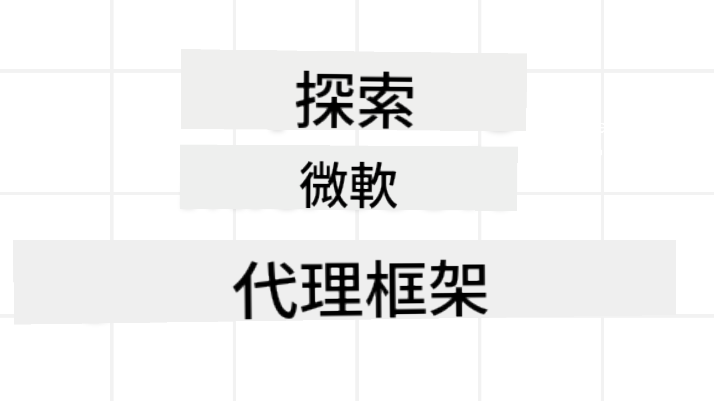
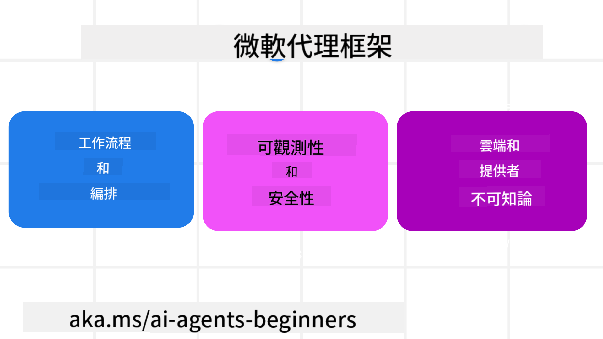
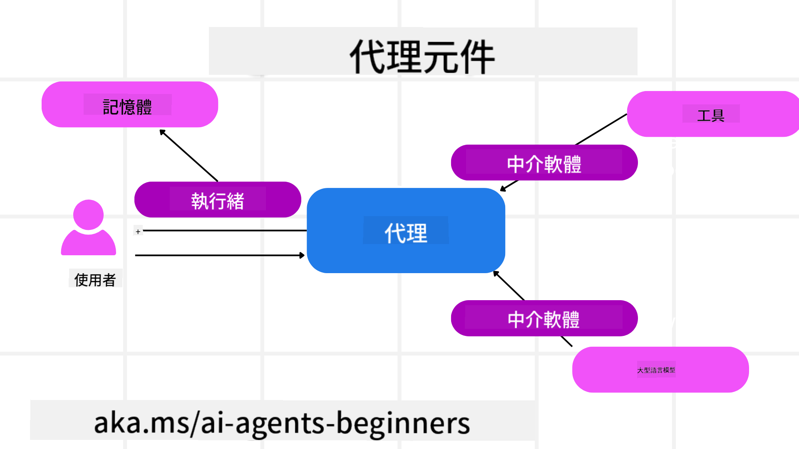

<!--
CO_OP_TRANSLATOR_METADATA:
{
  "original_hash": "19c4dab375acbc733855cc7f2f04edbc",
  "translation_date": "2025-10-01T20:40:06+00:00",
  "source_file": "14-microsoft-agent-framework/README.md",
  "language_code": "hk"
}
-->
# 探索 Microsoft Agent Framework



### 簡介

本課程將涵蓋：

- 理解 Microsoft Agent Framework：主要功能及價值  
- 探索 Microsoft Agent Framework 的核心概念
- 比較 MAF 與 Semantic Kernel 和 AutoGen：遷移指南

## 學習目標

完成本課程後，您將能夠：

- 使用 Microsoft Agent Framework 建立可投入生產的 AI Agents
- 將 Microsoft Agent Framework 的核心功能應用於您的代理使用案例
- 遷移並整合現有的代理框架和工具  

## 程式碼範例

[Microsoft Agent Framework (MAF)](https://aka.ms/ai-agents-beginners/agent-framewrok) 的程式碼範例可在此存儲庫中找到，位於 `xx-python-agent-framework` 和 `xx-dotnet-agent-framework` 文件中。

## 理解 Microsoft Agent Framework



[Microsoft Agent Framework (MAF)](https://aka.ms/ai-agents-beginners/agent-framewrok) 建立在 Semantic Kernel 和 AutoGen 的經驗和學習基礎之上。它提供了靈活性以應對生產和研究環境中各種代理使用案例，包括：

- **順序代理編排**：適用於需要逐步工作流程的場景。
- **並行編排**：適用於代理需要同時完成任務的場景。
- **群組聊天編排**：適用於代理共同協作完成一項任務的場景。
- **交接編排**：適用於代理在完成子任務後將任務交接給其他代理的場景。
- **磁性編排**：適用於管理代理創建並修改任務列表，並協調子代理完成任務的場景。

為了在生產環境中交付 AI Agents，MAF 還包含以下功能：

- **可觀測性**：通過使用 OpenTelemetry，AI Agent 的每個行動，包括工具調用、編排步驟、推理流程和性能監控，都可以通過 Azure AI Foundry 儀表板進行追蹤。
- **安全性**：代理原生託管於 Azure AI Foundry，包含角色基於訪問控制、私人數據處理和內建內容安全等安全控制。
- **持久性**：代理線程和工作流程可以暫停、恢復並從錯誤中恢復，支持長時間運行的過程。
- **控制**：支持人類介入的工作流程，任務可標記為需要人類批准。

Microsoft Agent Framework 還專注於互操作性：

- **雲端無關性**：代理可以在容器、內部部署以及多個不同的雲端上運行。
- **提供者無關性**：代理可以通過您偏好的 SDK 創建，包括 Azure OpenAI 和 OpenAI。
- **整合開放標準**：代理可以利用 Agent-to-Agent (A2A) 和 Model Context Protocol (MCP) 等協議來發現和使用其他代理及工具。
- **插件和連接器**：可以連接到數據和記憶服務，例如 Microsoft Fabric、SharePoint、Pinecone 和 Qdrant。

接下來，我們將探討這些功能如何應用於 Microsoft Agent Framework 的核心概念。

## Microsoft Agent Framework 的核心概念

### 代理



**創建代理**

代理的創建是通過定義推理服務（LLM 提供者）、一組 AI Agent 要遵循的指令以及分配的 `name` 來完成：

```python
agent = AzureOpenAIChatClient(credential=AzureCliCredential()).create_agent( instructions="You are good at recommending trips to customers based on their preferences.", name="TripRecommender" )
```

上述範例使用了 `Azure OpenAI`，但代理也可以使用多種服務創建，包括 `Azure AI Foundry Agent Service`：

```python
AzureAIAgentClient(async_credential=credential).create_agent( name="HelperAgent", instructions="You are a helpful assistant." ) as agent
```

OpenAI 的 `Responses` 和 `ChatCompletion` API：

```python
agent = OpenAIResponsesClient().create_agent( name="WeatherBot", instructions="You are a helpful weather assistant.", )
```

```python
agent = OpenAIChatClient().create_agent( name="HelpfulAssistant", instructions="You are a helpful assistant.", )
```

或使用 A2A 協議的遠程代理：

```python
agent = A2AAgent( name=agent_card.name, description=agent_card.description, agent_card=agent_card, url="https://your-a2a-agent-host" )
```

**運行代理**

代理可以通過 `.run` 或 `.run_stream` 方法運行，分別用於非流式或流式回應。

```python
result = await agent.run("What are good places to visit in Amsterdam?")
print(result.text)
```

```python
async for update in agent.run_stream("What are the good places to visit in Amsterdam?"):
    if update.text:
        print(update.text, end="", flush=True)

```

每次代理運行還可以選擇自定義參數，例如代理使用的 `max_tokens`、代理可以調用的 `tools`，甚至是代理使用的 `model`。

這在需要特定模型或工具來完成用戶任務的情況下非常有用。

**工具**

工具可以在定義代理時設置：

```python
def get_attractions( location: Annotated[str, Field(description="The location to get the top tourist attractions for")], ) -> str: """Get the top tourist attractions for a given location.""" return f"The top attractions for {location} are." 


# When creating a ChatAgent directly 

agent = ChatAgent( chat_client=OpenAIChatClient(), instructions="You are a helpful assistant", tools=[get_attractions]

```

也可以在運行代理時設置：

```python

result1 = await agent.run( "What's the best place to visit in Seattle?", tools=[get_attractions] # Tool provided for this run only )
```

**代理線程**

代理線程用於處理多輪對話。線程可以通過以下方式創建：

- 使用 `get_new_thread()`，使線程可以隨時間保存。
- 在運行代理時自動創建線程，線程僅在當前運行期間存在。

創建線程的程式碼如下：

```python
# Create a new thread. 
thread = agent.get_new_thread() # Run the agent with the thread. 
response = await agent.run("Hello, I am here to help you book travel. Where would you like to go?", thread=thread)

```

然後可以序列化線程以供日後使用：

```python
# Create a new thread. 
thread = agent.get_new_thread() 

# Run the agent with the thread. 

response = await agent.run("Hello, how are you?", thread=thread) 

# Serialize the thread for storage. 

serialized_thread = await thread.serialize() 

# Deserialize the thread state after loading from storage. 

resumed_thread = await agent.deserialize_thread(serialized_thread)
```

**代理中介軟件**

代理與工具和 LLM 交互以完成用戶的任務。在某些場景中，我們希望在這些交互之間執行或追蹤操作。代理中介軟件使我們能夠做到這一點：

*功能中介軟件*

此中介軟件允許我們在代理調用功能/工具之前執行操作。例如，您可能希望在功能調用時進行一些日誌記錄。

在以下程式碼中，`next` 定義了是否應調用下一個中介軟件或實際功能。

```python
async def logging_function_middleware(
    context: FunctionInvocationContext,
    next: Callable[[FunctionInvocationContext], Awaitable[None]],
) -> None:
    """Function middleware that logs function execution."""
    # Pre-processing: Log before function execution
    print(f"[Function] Calling {context.function.name}")

    # Continue to next middleware or function execution
    await next(context)

    # Post-processing: Log after function execution
    print(f"[Function] {context.function.name} completed")
```

*聊天中介軟件*

此中介軟件允許我們在代理與 LLM 之間的請求中執行或記錄操作。

這包含重要信息，例如發送到 AI 服務的 `messages`。

```python
async def logging_chat_middleware(
    context: ChatContext,
    next: Callable[[ChatContext], Awaitable[None]],
) -> None:
    """Chat middleware that logs AI interactions."""
    # Pre-processing: Log before AI call
    print(f"[Chat] Sending {len(context.messages)} messages to AI")

    # Continue to next middleware or AI service
    await next(context)

    # Post-processing: Log after AI response
    print("[Chat] AI response received")

```

**代理記憶**

如 `Agentic Memory` 課程中所述，記憶是使代理能夠在不同上下文中運作的重要元素。MAF 提供了幾種不同類型的記憶：

*內存存儲*

這是在應用程序運行期間存儲在線程中的記憶。

```python
# Create a new thread. 
thread = agent.get_new_thread() # Run the agent with the thread. 
response = await agent.run("Hello, I am here to help you book travel. Where would you like to go?", thread=thread)
```

*持久消息*

此記憶用於在不同會話中存儲對話歷史。它是通過 `chat_message_store_factory` 定義的：

```python
from agent_framework import ChatMessageStore

# Create a custom message store
def create_message_store():
    return ChatMessageStore()

agent = ChatAgent(
    chat_client=OpenAIChatClient(),
    instructions="You are a Travel assistant.",
    chat_message_store_factory=create_message_store
)

```

*動態記憶*

此記憶在運行代理之前添加到上下文中。這些記憶可以存儲在外部服務中，例如 mem0：

```python
from agent_framework.mem0 import Mem0Provider

# Using Mem0 for advanced memory capabilities
memory_provider = Mem0Provider(
    api_key="your-mem0-api-key",
    user_id="user_123",
    application_id="my_app"
)

agent = ChatAgent(
    chat_client=OpenAIChatClient(),
    instructions="You are a helpful assistant with memory.",
    context_providers=memory_provider
)

```

**代理可觀測性**

可觀測性對於構建可靠且可維護的代理系統至關重要。MAF 與 OpenTelemetry 集成，提供追蹤和計量以提高可觀測性。

```python
from agent_framework.observability import get_tracer, get_meter

tracer = get_tracer()
meter = get_meter()
with tracer.start_as_current_span("my_custom_span"):
    # do something
    pass
counter = meter.create_counter("my_custom_counter")
counter.add(1, {"key": "value"})
```

### 工作流程

MAF 提供了預定義的步驟來完成任務，並將 AI 代理作為這些步驟中的組件。

工作流程由不同的組件組成，允許更好的控制流。工作流程還支持 **多代理編排** 和 **檢查點** 以保存工作流程狀態。

工作流程的核心組件包括：

**執行器**

執行器接收輸入消息，執行分配的任務，然後生成輸出消息。這使工作流程向完成更大的任務邁進。執行器可以是 AI 代理或自定義邏輯。

**邊**

邊用於定義工作流程中的消息流。這些可以是：

*直接邊* - 執行器之間的簡單一對一連接：

```python
from agent_framework import WorkflowBuilder

builder = WorkflowBuilder()
builder.add_edge(source_executor, target_executor)
builder.set_start_executor(source_executor)
workflow = builder.build()
```

*條件邊* - 在滿足某些條件後激活。例如，當酒店房間不可用時，執行器可以建議其他選項。

*Switch-case 邊* - 根據定義的條件將消息路由到不同的執行器。例如，如果旅遊客戶有優先訪問權，他們的任務將通過另一個工作流程處理。

*Fan-out 邊* - 將一條消息發送到多個目標。

*Fan-in 邊* - 收集來自不同執行器的多條消息並發送到一個目標。

**事件**

為了更好地觀測工作流程，MAF 提供了內建的執行事件，包括：

- `WorkflowStartedEvent` - 工作流程執行開始
- `WorkflowOutputEvent` - 工作流程生成輸出
- `WorkflowErrorEvent` - 工作流程遇到錯誤
- `ExecutorInvokeEvent` - 執行器開始處理
- `ExecutorCompleteEvent` - 執行器完成處理
- `RequestInfoEvent` - 發出請求

## 從其他框架遷移（Semantic Kernel 和 AutoGen）

### MAF 與 Semantic Kernel 的差異

**簡化的代理創建**

Semantic Kernel 需要為每個代理創建一個 Kernel 實例。MAF 使用擴展為主要提供者提供簡化的方法。

```python
agent = AzureOpenAIChatClient(credential=AzureCliCredential()).create_agent( instructions="You are good at reccomending trips to customers based on their preferences.", name="TripRecommender" )
```

**代理線程創建**

Semantic Kernel 需要手動創建線程。在 MAF 中，代理直接分配線程。

```python
thread = agent.get_new_thread() # Run the agent with the thread. 
```

**工具註冊**

在 Semantic Kernel 中，工具註冊到 Kernel，然後將 Kernel 傳遞給代理。在 MAF 中，工具直接在代理創建過程中註冊。

```python
agent = ChatAgent( chat_client=OpenAIChatClient(), instructions="You are a helpful assistant", tools=[get_attractions]
```

### MAF 與 AutoGen 的差異

**Teams vs Workflows**

`Teams` 是 AutoGen 中代理事件驅動活動的結構。MAF 使用 `Workflows`，通過基於圖形的架構將數據路由到執行器。

**工具創建**

AutoGen 使用 `FunctionTool` 封裝代理可調用的功能。MAF 使用 @ai_function，運作方式類似，但還能自動推斷每個功能的架構。

**代理行為**

在 AutoGen 中，代理默認是單輪代理，除非 `max_tool_iterations` 設置為更高的值。在 MAF 中，`ChatAgent` 默認是多輪代理，意味著它會持續調用工具直到完成用戶的任務。

## 程式碼範例

Microsoft Agent Framework 的程式碼範例可在此存儲庫中找到，位於 `xx-python-agent-framework` 和 `xx-dotnet-agent-framework` 文件中。

## 有更多關於 Microsoft Agent Framework 的問題？

加入 [Azure AI Foundry Discord](https://aka.ms/ai-agents/discord)，與其他學習者交流，參加辦公時間並解答您的 AI Agents 問題。

---

**免責聲明**：  
本文件已使用 AI 翻譯服務 [Co-op Translator](https://github.com/Azure/co-op-translator) 進行翻譯。雖然我們致力於提供準確的翻譯，但請注意，自動翻譯可能包含錯誤或不準確之處。原始文件的母語版本應被視為權威來源。對於重要資訊，建議使用專業人工翻譯。我們對因使用此翻譯而引起的任何誤解或錯誤解釋概不負責。