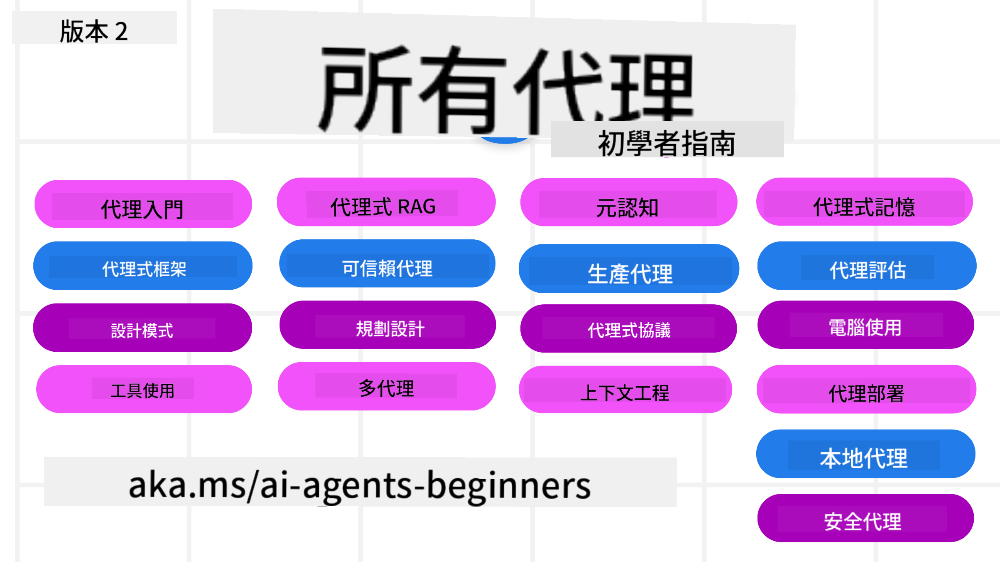

<!--
CO_OP_TRANSLATOR_METADATA:
{
  "original_hash": "b3581c11869b3563f33773adfb011949",
  "translation_date": "2025-12-24T22:56:30+00:00",
  "source_file": "README.md",
  "language_code": "hk"
}
-->
# AI Agents for Beginners - A Course

## A course teaching everything you need to know to start building AI Agents

### 🌐 多語言支援

#### 透過 GitHub Action 支援（自動且即時更新）

<!-- CO-OP TRANSLATOR LANGUAGES TABLE START -->
[阿拉伯語](../ar/README.md) | [孟加拉語](../bn/README.md) | [保加利亞語](../bg/README.md) | [緬甸語（緬甸）](../my/README.md) | [中文（簡體）](../zh/README.md) | [中文（繁體，香港）](./README.md) | [中文（繁體，澳門）](../mo/README.md) | [中文（繁體，台灣）](../tw/README.md) | [克羅地亞語](../hr/README.md) | [捷克語](../cs/README.md) | [丹麥語](../da/README.md) | [荷蘭語](../nl/README.md) | [愛沙尼亞語](../et/README.md) | [芬蘭語](../fi/README.md) | [法語](../fr/README.md) | [德語](../de/README.md) | [希臘語](../el/README.md) | [希伯來語](../he/README.md) | [印地語](../hi/README.md) | [匈牙利語](../hu/README.md) | [印尼語](../id/README.md) | [義大利語](../it/README.md) | [日語](../ja/README.md) | [卡納達語](../kn/README.md) | [韓語](../ko/README.md) | [立陶宛語](../lt/README.md) | [馬來語](../ms/README.md) | [馬拉雅拉姆語](../ml/README.md) | [馬拉地語](../mr/README.md) | [尼泊爾語](../ne/README.md) | [尼日利亞皮欽語](../pcm/README.md) | [挪威語](../no/README.md) | [波斯語（法爾西）](../fa/README.md) | [波蘭語](../pl/README.md) | [葡萄牙語（巴西）](../br/README.md) | [葡萄牙語（葡萄牙）](../pt/README.md) | [旁遮普語（Gurmukhi）](../pa/README.md) | [羅馬尼亞語](../ro/README.md) | [俄語](../ru/README.md) | [塞爾維亞語（西里爾）](../sr/README.md) | [斯洛伐克語](../sk/README.md) | [斯洛文尼亞語](../sl/README.md) | [西班牙語](../es/README.md) | [史瓦希里語](../sw/README.md) | [瑞典語](../sv/README.md) | [他加祿語（菲律賓）](../tl/README.md) | [泰米爾語](../ta/README.md) | [泰盧固語](../te/README.md) | [泰語](../th/README.md) | [土耳其語](../tr/README.md) | [烏克蘭語](../uk/README.md) | [烏爾都語](../ur/README.md) | [越南語](../vi/README.md)
<!-- CO-OP TRANSLATOR LANGUAGES TABLE END -->

**如果您希望新增其他翻譯語言，可在[這裡](https://github.com/Azure/co-op-translator/blob/main/getting_started/supported-languages.md) 查看支援語言清單**

## 🌱 開始之前

本課程包含多個課程單元，涵蓋構建 AI 代理的基礎知識。每個課程單元都有各自的主題，您可以從任何一課開始！

本課程支援多語言。請至我們的[可用語言列表](../..)。

如果您是第一次使用生成式 AI 模型進行構建，請參考我們的 [Generative AI For Beginners](https://aka.ms/genai-beginners) 課程，內含 21 節有關使用 GenAI 的課程。

別忘了為此倉庫 [加星 (🌟)](https://docs.github.com/en/get-started/exploring-projects-on-github/saving-repositories-with-stars?WT.mc_id=academic-105485-koreyst) 並 [fork 這個倉庫](https://github.com/microsoft/ai-agents-for-beginners/fork) 來執行程式碼。

### 與其他學習者交流、獲得問題解答

如果您在構建 AI 代理時遇到困難或有任何問題，歡迎加入我們在 [Microsoft Foundry Discord] 的專用 Discord 頻道，以取得協助。

### 您需要的項目

本課程的每個單元都包含程式範例，可在 code_samples 資料夾中找到。您可以 [fork 這個倉庫](https://github.com/microsoft/ai-agents-for-beginners/fork) 來建立自己的副本。  

這些練習中的程式範例使用 Azure AI Foundry 與 GitHub Model Catalogs 來與語言模型互動：

- [Github Models](https://aka.ms/ai-agents-beginners/github-models) - 免費 / 有限制
- [Azure AI Foundry](https://aka.ms/ai-agents-beginners/ai-foundry) - 需要 Azure 帳戶

本課程還使用微軟提供的以下 AI 代理框架與服務：

- [Microsoft Agent Framework (MAF) - 全新！](https://aka.ms/ai-agents-beginners/agent-framewrok)
- [Azure AI Agent Service](https://aka.ms/ai-agents-beginners/ai-agent-service)
- [Semantic Kernel](https://aka.ms/ai-agents-beginners/semantic-kernel)
- [AutoGen](https://aka.ms/ai-agents/autogen)

如需更多關於如何執行本課程程式碼的資訊，請前往 [Course Setup](./00-course-setup/README.md)。

## 🙏 想要幫忙嗎？

您有建議或發現拼字或程式碼錯誤嗎？[提出 issue](https://github.com/microsoft/ai-agents-for-beginners/issues?WT.mc_id=academic-105485-koreyst) 或 [建立 pull request](https://github.com/microsoft/ai-agents-for-beginners/pulls?WT.mc_id=academic-105485-koreyst)

## 📂 每個課程單元包含

- 位於 README 的書面課程與短片教學
- 支援 Azure AI Foundry 與 Github Models（免費）的 Python 範例程式碼
- 繼續學習的額外資源連結

## 🗃️ 課程單元

| **課程**                                      | **文字與程式碼**                                    | **影片**                                                  | **額外學習**                                                                           |
|----------------------------------------------|----------------------------------------------------|------------------------------------------------------------|----------------------------------------------------------------------------------------|
| AI 代理入門與使用案例                         | [連結](./01-intro-to-ai-agents/README.md)          | [影片](https://youtu.be/3zgm60bXmQk?si=z8QygFvYQv-9WtO1)    | [更多學習資源](https://aka.ms/ai-agents-beginners/collection?WT.mc_id=academic-105485-koreyst) |
| 探索 AI 代理框架                             | [連結](./02-explore-agentic-frameworks/README.md)  | [影片](https://youtu.be/ODwF-EZo_O8?si=Vawth4hzVaHv-u0H)    | [更多學習資源](https://aka.ms/ai-agents-beginners/collection?WT.mc_id=academic-105485-koreyst) |
| 理解 AI 代理設計模式                         | [連結](./03-agentic-design-patterns/README.md)     | [影片](https://youtu.be/m9lM8qqoOEA?si=BIzHwzstTPL8o9GF)    | [更多學習資源](https://aka.ms/ai-agents-beginners/collection?WT.mc_id=academic-105485-koreyst) |
| 工具使用設計模式                             | [連結](./04-tool-use/README.md)                    | [影片](https://youtu.be/vieRiPRx-gI?si=2z6O2Xu2cu_Jz46N)    | [更多學習資源](https://aka.ms/ai-agents-beginners/collection?WT.mc_id=academic-105485-koreyst) |
| Agentic RAG                                  | [連結](./05-agentic-rag/README.md)                 | [影片](https://youtu.be/WcjAARvdL7I?si=gKPWsQpKiIlDH9A3)    | [更多學習資源](https://aka.ms/ai-agents-beginners/collection?WT.mc_id=academic-105485-koreyst) |
| 建立可信的 AI 代理                           | [連結](./06-building-trustworthy-agents/README.md) | [影片](https://youtu.be/iZKkMEGBCUQ?si=jZjpiMnGFOE9L8OK )   | [更多學習資源](https://aka.ms/ai-agents-beginners/collection?WT.mc_id=academic-105485-koreyst) |
| 規劃設計模式                                 | [連結](./07-planning-design/README.md)             | [影片](https://youtu.be/kPfJ2BrBCMY?si=6SC_iv_E5-mzucnC)    | [更多學習資源](https://aka.ms/ai-agents-beginners/collection?WT.mc_id=academic-105485-koreyst) |
| 多代理設計模式                               | [連結](./08-multi-agent/README.md)                 | [影片](https://youtu.be/V6HpE9hZEx0?si=rMgDhEu7wXo2uo6g)    | [更多學習資源](https://aka.ms/ai-agents-beginners/collection?WT.mc_id=academic-105485-koreyst) |
| 元認知設計模式                               | [連結](./09-metacognition/README.md)               | [影片](https://youtu.be/His9R6gw6Ec?si=8gck6vvdSNCt6OcF)    | [更多學習資源](https://aka.ms/ai-agents-beginners/collection?WT.mc_id=academic-105485-koreyst) |
| 生產環境中的 AI 代理                      | [連結](./10-ai-agents-production/README.md)        | [影片](https://youtu.be/l4TP6IyJxmQ?si=31dnhexRo6yLRJDl)  | [連結](https://aka.ms/ai-agents-beginners/collection?WT.mc_id=academic-105485-koreyst) |
| 使用 Agentic 協議 (MCP、A2A 與 NLWeb) | [連結](./11-agentic-protocols/README.md)           | [影片](https://youtu.be/X-Dh9R3Opn8)                                 | [連結](https://aka.ms/ai-agents-beginners/collection?WT.mc_id=academic-105485-koreyst) |
| AI 代理的情境工程            | [連結](./12-context-engineering/README.md)         | [影片](https://youtu.be/F5zqRV7gEag)                                 | [連結](https://aka.ms/ai-agents-beginners/collection?WT.mc_id=academic-105485-koreyst) |
| 管理 Agentic 記憶                      | [連結](./13-agent-memory/README.md)     |      [影片](https://youtu.be/QrYbHesIxpw?si=vZkVwKrQ4ieCcIPx)                                                      |                                                                                        |
| 探索 Microsoft Agent Framework                         | [連結](./14-microsoft-agent-framework/README.md)                            |                                                            |                                                                                        |
| 建立 電腦使用代理 (CUA)           | Coming Soon                            |                                                            |                                                                                        |
| 部署可擴展代理                    | Coming Soon                            |                                                            |                                                                                        |
| 建立本地 AI 代理                     | Coming Soon                               |                                                            |                                                                                        |
| 保護 AI 代理                           | Coming Soon                               |                                                            |                                                                                        |

## 🎒 其他課程

我們團隊還製作了其他課程！查看：

<!-- CO-OP TRANSLATOR OTHER COURSES START -->
### LangChain

---

### Azure / Edge / MCP / Agents

---
 
### 生成式 AI 系列

[-9333EA?style=for-the-badge&labelColor=E5E7EB&color=9333EA)](https://github.com/microsoft/Generative-AI-for-beginners-dotnet?WT.mc_id=academic-105485-koreyst)
[-C084FC?style=for-the-badge&labelColor=E5E7EB&color=C084FC)](https://github.com/microsoft/generative-ai-for-beginners-java?WT.mc_id=academic-105485-koreyst)
[-E879F9?style=for-the-badge&labelColor=E5E7EB&color=E879F9)](https://github.com/microsoft/generative-ai-with-javascript?WT.mc_id=academic-105485-koreyst)

---
 
### 核心學習

---
 
### Copilot 系列

<!-- CO-OP TRANSLATOR OTHER COURSES END -->

## 🌟 社群致謝

感謝 [Shivam Goyal](https://www.linkedin.com/in/shivam2003/) 提供示範 Agentic RAG 的重要程式碼範例。 

## 貢獻

本專案歡迎貢獻與建議。大多數貢獻需要您同意一份
Contributor License Agreement (CLA)，聲明您有權利且實際上授予我們使用您貢獻的權利。詳情請參閱 <https://cla.opensource.microsoft.com>。

當您提交 pull request 時，CLA 機器人會自動判斷您是否需要提供
CLA，並相應地標註 PR（例如：狀態檢查、留言）。請依照機器人的指示操作。您只需在所有使用我們 CLA 的儲存庫中執行此動作一次。

本專案已採用 [Microsoft Open Source Code of Conduct](https://opensource.microsoft.com/codeofconduct/)。
欲了解更多資訊，請參閱 [行為準則常見問題](https://opensource.microsoft.com/codeofconduct/faq/) 或
透過 [opencode@microsoft.com](mailto:opencode@microsoft.com) 聯絡我們提出其他問題或意見。

## 商標

本專案可能包含專案、產品或服務的商標或標誌。經授權使用 Microsoft
商標或標誌須遵守並遵循
[Microsoft 的商標與品牌指南](https://www.microsoft.com/legal/intellectualproperty/trademarks/usage/general)。
在此專案的修改版本中使用 Microsoft 商標或標誌不得導致混淆或暗示 Microsoft 的贊助。
任何第三方商標或標誌的使用均須遵守該第三方的政策。

## 獲取協助

如果您在建立 AI 應用時遇到困難或有任何問題，請加入：

如果您在開發過程中有產品回饋或遇到錯誤，請造訪：

---

<!-- CO-OP TRANSLATOR DISCLAIMER START -->
免責聲明：
本文件已使用 AI 翻譯服務 Co-op Translator（https://github.com/Azure/co-op-translator）進行翻譯。雖然我們力求準確，但請注意自動翻譯可能包含錯誤或不準確之處。原始語言版本應被視為具權威性的來源。如涉及重要資訊，建議委託專業人工翻譯。我們不對因使用本翻譯而導致的任何誤解或錯誤詮釋承擔責任。
<!-- CO-OP TRANSLATOR DISCLAIMER END -->