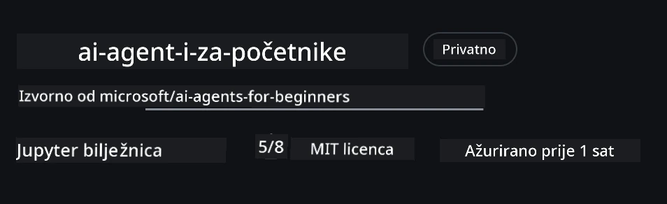
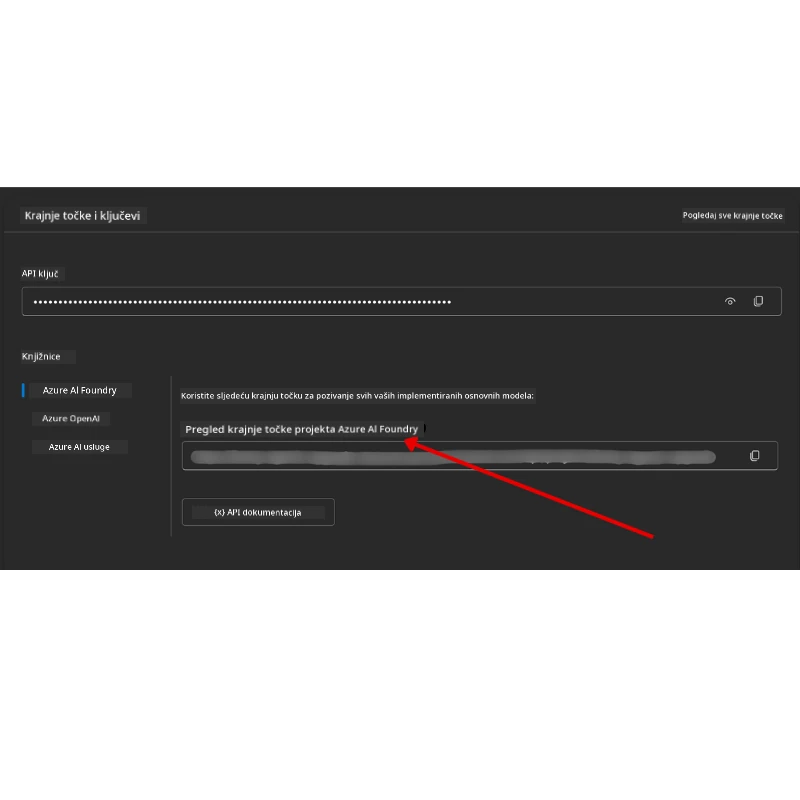

# Postavljanje tečaja

## Uvod

Ova lekcija će pokriti kako pokrenuti primjere koda ovog tečaja.

## Pridružite se drugim polaznicima i zatražite pomoć

Prije nego što započnete kloniranje svog repozitorija, pridružite se [AI Agents For Beginners Discord kanalu](https://aka.ms/ai-agents/discord) kako biste dobili pomoć oko postavljanja, postavili pitanja vezana uz tečaj ili se povezali s drugim polaznicima.

## Klonirajte ili napravite fork ovog repozitorija

Za početak, molimo klonirajte ili napravite fork GitHub repozitorija. Time ćete imati svoju verziju materijala tečaja kako biste mogli pokretati, testirati i prilagođavati kod!

To možete učiniti klikom na link <a href="https://github.com/microsoft/ai-agents-for-beginners/fork" target="_blank">fork repozitorija</a>

Sada biste trebali imati svoju forkanu verziju ovog tečaja na sljedećem linku:



### Plitko kloniranje (preporučeno za radionicu / Codespaces)

  >Pokazivač cijelog repozitorija može biti veliki (~3 GB) kada preuzmete svu povijest i sve datoteke. Ako prisustvujete samo radionici ili trebate samo nekoliko mapa lekcija, plitko kloniranje (ili sparse kloniranje) preuzima mnogo manje.

#### Brzo plitko kloniranje — minimalna povijest, sve datoteke

Zamijenite `<your-username>` u naredbama ispod s URL-om vašeg forka (ili upstream URL ako više volite).

Za kloniranje samo najnovije povijesti commitova (mali download):

```bash
git clone --depth 1 https://github.com/<your-username>/ai-agents-for-beginners.git
```

Za kloniranje određenog brancha:

```bash
git clone --depth 1 --branch <branch-name> https://github.com/<your-username>/ai-agents-for-beginners.git
```

#### Djelomično (sparse) kloniranje — minimalni blobovi + samo odabrane mape

Ovo koristi djelomično kloniranje i sparse-checkout (zahtijeva Git 2.25+ i preporuča se moderni Git s podrškom za djelomično kloniranje):

```bash
git clone --depth 1 --filter=blob:none --sparse https://github.com/<your-username>/ai-agents-for-beginners.git
```

Uđite u mapu repozitorija:

```bash
cd ai-agents-for-beginners
```

Zatim definirajte koje mape želite (primjer ispod pokazuje dvije mape):

```bash
git sparse-checkout set 00-course-setup 01-intro-to-ai-agents
```

Nakon kloniranja i provjere datoteka, ako trebate samo datoteke i želite osloboditi prostor (bez git povijesti), molimo izbrišite metapodatke repozitorija (💀nepovratno — izgubiti ćete svu Git funkcionalnost):

```bash
# zsh/bash
rm -rf .git
```

```powershell
# PowerShell
Remove-Item -Recurse -Force .git
```

#### Korištenje GitHub Codespaces (preporučeno za izbjegavanje velikih lokalnih preuzimanja)

- Kreirajte novi Codespace za ovaj repozitorij preko [GitHub UI](https://github.com/codespaces).  

- U terminalu novostvorenog codespacea, pokrenite jednu od gore navedenih shallow/sparse klon naredbi da donesete samo mape lekcija koje trebate u Codespace workspace.
- Opcionalno: nakon kloniranja unutar Codespaces, uklonite .git da biste oslobodili dodatni prostor (pogledajte naredbe za uklanjanje gore).
- Napomena: Ako više volite otvoriti repozitorij direktno u Codespaces (bez dodatnog kloniranja), imajte na umu da Codespaces konstruira devcontainer okruženje i može i dalje pripremiti više nego što vam treba.

#### Savjeti

- Uvijek zamijenite URL za klon sa svojim forkom ako želite uređivati/commitati.
- Ako vam kasnije treba više povijesti ili datoteka, možete ih dohvatiti ili prilagoditi sparse-checkout da uključite dodatne mape.

## Pokretanje koda

Ovaj tečaj nudi niz Jupyter bilježnica koje možete pokretati da biste stekli praktično iskustvo izgradnje AI agenata.

Primjeri koda koriste **Microsoft Agent Framework (MAF)** s `FoundryChatClient`, koji se povezuje s **Microsoft Foundry Agent Service V2** (Responses API) preko **Microsoft Foundry**.

Sve Python bilježnice su označene sa `*-python-agent-framework.ipynb`.

## Zahtjevi

- Python 3.12+
  - **NAPOMENA**: Ako nemate instaliran Python 3.12, osigurajte da ga instalirate. Zatim kreirajte svoj venv koristeći python3.12 da biste osigurali da se instaliraju ispravne verzije iz datoteke requirements.txt.
  
    >Primjer

    Kreirajte Python venv direktorij:

    ```bash
    python -m venv venv
    ```

    Zatim aktivirajte venv okruženje za:

    ```bash
    # zsh/bash
    source venv/bin/activate
    ```
  
    ```dos
    # Command Prompt for Windows
    venv\Scripts\activate
    ```

- .NET 10+: Za primjere koda koji koriste .NET, osigurajte da instalirate [.NET 10 SDK](https://dotnet.microsoft.com/download/dotnet/10.0) ili noviju verziju. Zatim provjerite verziju instaliranog .NET SDK:

    ```bash
    dotnet --list-sdks
    ```

- **Azure CLI** — Potrebno za autentifikaciju. Instalirajte sa [aka.ms/installazurecli](https://aka.ms/installazurecli).
- **Azure pretplata** — Za pristup Microsoft Foundry i Microsoft Foundry Agent Service.
- **Microsoft Foundry projekt** — Projekt s implementiranim modelom (npr. `gpt-5-mini`). Pogledajte [Korak 1](#korak-1-kreirajte-microsoft-foundry-projekt) u nastavku.

U korijenu ovog repozitorija uključili smo datoteku `requirements.txt` koja sadrži sve potrebne Python pakete za pokretanje primjera koda.

Možete ih instalirati pokretanjem sljedeće naredbe u terminalu u korijenu repozitorija:

```bash
pip install -r requirements.txt
```

Preporučujemo kreiranje Python virtualnog okruženja kako biste izbjegli bilo kakve sukobe i probleme.

## Postavljanje VSCode

Provjerite da koristite ispravnu verziju Pythona u VSCode.


## Postavite Microsoft Foundry i Microsoft Foundry Agent Service

### Korak 1: Kreirajte Microsoft Foundry projekt

Trebate Microsoft Foundry **hub** i **projekt** s implementiranim modelom da biste pokrenuli bilježnice.

1. Idite na [ai.azure.com](https://ai.azure.com) i prijavite se sa svojim Azure računom.
2. Kreirajte **hub** (ili koristite postojeći). Pogledajte: [Pregled Hub resursa](https://learn.microsoft.com/azure/ai-foundry/concepts/ai-resources).
3. Unutar huba kreirajte **projekt**.
4. Implementirajte model (npr. `gpt-5-mini`) iz **Models + Endpoints** → **Deploy model**.

### Korak 2: Dohvatite Endpoint projekta i ime implementacije modela

Iz vašeg projekta u Microsoft Foundry portalu:

- **Endpoint projekta** — Idite na stranicu **Overview** i kopirajte URL endpointa.



- **Ime implementacije modela** — Idite na **Models + Endpoints**, odaberite implementirani model, i zabilježite **Deployment name** (npr. `gpt-5-mini`).

### Korak 3: Prijavite se u Azure s `az login`

Većina bilježnica autentificira se preko vaše **Azure CLI prijave** — koristeći `AzureCliCredential` ili `DefaultAzureCredential` (oba koriste vašu `az login` sesiju) iz `azure-identity` paketa — tako da ne zahtijevaju API ključeve. Nekoliko lekcija i opcionalnih integracija koristi API ključeve; provjerite preduvjete svake lekcije za dodatne varijable okoline. Ovo zahtijeva da ste prijavljeni kroz Azure CLI.

1. **Instalirajte Azure CLI** ako već niste: [aka.ms/installazurecli](https://aka.ms/installazurecli)

2. **Prijavite se** pokretanjem:

    ```bash
    az login
    ```

    Ili ako ste u udaljenom/Codespace okruženju bez preglednika:

    ```bash
    az login --use-device-code
    ```

3. **Odaberite pretplatu** ako se to zatraži — odaberite onu koja sadrži vaš Foundry projekt.

4. **Provjerite** da ste prijavljeni:

    ```bash
    az account show
    ```

> **Zašto `az login`?** Bilježnice se autentificiraju koristeći `AzureCliCredential` (ili `DefaultAzureCredential`, koji također koristi vašu Azure CLI prijavu) iz `azure-identity` paketa. To znači da vaša Azure CLI sesija pruža vjerodajnice — bez API ključeva ili tajni u vašoj `.env` datoteci. Ovo je [sigurnosna najbolja praksa](https://learn.microsoft.com/azure/developer/ai/keyless-connections).

### Korak 4: Kreirajte svoj `.env` fajl

Kopirajte primjerni fajl:

```bash
# zsh/bash
cp .env.example .env
```

```powershell
# PowerShell
Copy-Item .env.example .env
```

Otvorite `.env` i popunite ove dvije vrijednosti:

```env
AZURE_AI_PROJECT_ENDPOINT=https://<your-project>.services.ai.azure.com/api/projects/<your-project-id>
AZURE_AI_MODEL_DEPLOYMENT_NAME=gpt-5-mini
```

| Varijabla | Gdje je pronaći |
|----------|-----------------|
| `AZURE_AI_PROJECT_ENDPOINT` | Foundry portal → vaš projekt → stranica **Overview** |
| `AZURE_AI_MODEL_DEPLOYMENT_NAME` | Foundry portal → **Models + Endpoints** → ime vašeg implementiranog modela |

To je to za većinu lekcija! Bilježnice će se automatski autentificirati preko vaše `az login` sesije.

### Korak 5: Instalirajte Python ovisnosti

```bash
pip install -r requirements.txt
```

Preporučujemo da ovo pokrenete unutar virtualnog okruženja koje ste ranije kreirali.

## Opcionalno postavljanje: Azure AI Search (Lekcije 5 i 16)

Bilježnice za Lekciju 5 (Agentic RAG) i Lekciju 16 rade odmah s **in-memory knowledge base** — nije potrebna dodatna Azure sredstva. Ako ih želite podržati s pravim **Azure AI Search** indeksom, imajte na umu da Lekcija 16 trenutno koristi autentifikaciju temeljenu na ključu: prelazi s in-memory pretraživanja na Azure AI Search samo kada su **obje** varijable `AZURE_SEARCH_SERVICE_ENDPOINT` **i** `AZURE_SEARCH_API_KEY` postavljene, inače ostaje na in-memory pretraživanju — stoga da biste je pokrenuli s pravim indeksom morate postaviti i administratorski ključ. Bezključna autentifikacija s Microsoft Entra ID-jem (RBAC) je preporučeni pristup za vlastiti produkcijski kod, u skladu s `az login` tokom koji se koristi svuda u ovom tečaju.

RBAC koraci u nastavku odnose se na primjere u vodiču za postavljanje i vlastiti kod. Ne omogućuju bezključnu autentifikaciju u bilježnici Lekcije 16; Lekcija 16 i dalje zahtijeva i endpoint i admins key za korištenje Azure AI Search.

1. **Omogućite pristup temeljen na ulogama** na svom servis za pretragu:

    ```bash
    az search service update --name <service-name> --resource-group <resource-group> --auth-options aadOrApiKey
    ```

2. **Dodijelite sebi potrebne uloge** (kreiranje/učitavanje indeksa i upite):

    ```bash
    az role assignment create --assignee <your-user-or-principal-id> --role "Search Service Contributor" --scope $(az search service show -g <resource-group> -n <service-name> --query id -o tsv)
    az role assignment create --assignee <your-user-or-principal-id> --role "Search Index Data Contributor" --scope $(az search service show -g <resource-group> -n <service-name> --query id -o tsv)
    ```

3. **Dodajte endpoint** u svoju `.env` datoteku:

| Varijabla | Gdje je pronaći |
|----------|-----------------|
| `AZURE_SEARCH_SERVICE_ENDPOINT` | Azure portal → vaš **Azure AI Search** resurs → **Overview** → URL |
| `AZURE_SEARCH_API_KEY` | Potrebno (uz endpoint) za omogućavanje Azure AI Search u bilježnici Lekcije 16, koja koristi autentifikaciju temeljenu na ključu. Azure portal → **Settings** → **Keys** → primarni admins key |

> **Zašto bezključna autentifikacija?** Administratorski ključevi daju potpuni pristup zapisu vašem servisu za pretragu i mogu procuriti preko `.env` datoteka. S RBAC-om se koristi identitet vaše Azure CLI prijave — isti bezključni Entra ID obrazac koji koriste bilježnice tečaja (putem `AzureCliCredential` / `DefaultAzureCredential`). Vidi [Povezivanje na Azure AI Search koristeći uloge](https://learn.microsoft.com/azure/search/search-security-rbac).

Pogledajte [Vodič za postavljanje Azure AI Search](./AzureSearch.md) za primjere kompletne izrade indeksa u Python i .NET.

## Dodatno postavljanje za lekcije koje izravno pozivaju Azure OpenAI (Lekcije 6 i 8)

Neke bilježnice u lekcijama 6 i 8 izravno pozivaju **Azure OpenAI** (koristeći **Responses API**) umjesto preko Microsoft Foundry projekta. Ovi primjeri su ranije koristili GitHub modele, koji su zastarjeli i ne podržavaju Responses API. Dodajte ove varijable u svoju `.env` datoteku:

| Varijabla | Gdje je pronaći |
|----------|-----------------|
| `AZURE_OPENAI_ENDPOINT` | Azure portal → vaš **Azure OpenAI** resurs → **Keys and Endpoint** → Endpoint (npr. `https://<your-resource>.openai.azure.com`) |
| `AZURE_OPENAI_DEPLOYMENT` | Ime vašeg implementiranog modela (npr. `gpt-5-mini`) koji podržava Responses API |
| `AZURE_OPENAI_API_KEY` | Opcionalno — samo ako koristite autentifikaciju temeljenu na ključu umjesto `az login` / Entra ID |

> Responses API koristi stabilni `/openai/v1/` endpoint, tako da nije potreban `api-version`. Prijavite se s `az login` da biste koristili ključnu Entra ID autentifikaciju.

## Alternativni pružatelj: MiniMax (kompatibilan s OpenAI)

[MiniMax](https://platform.minimaxi.com/) pruža modele velikog konteksta (do 204K tokena) kroz OpenAI-kompatibilan API. Budući da Microsoft Agent Frameworkov `OpenAIChatClient` radi s bilo kojim OpenAI-kompatibilnim endpointom, možete koristiti MiniMax kao zamjenu za lekcije koje koriste `OpenAIChatClient`.

Dodajte ove varijable u svoju `.env` datoteku:

| Varijabla | Gdje je pronaći |
|----------|-----------------|
| `MINIMAX_API_KEY` | [MiniMax Platform](https://platform.minimaxi.com/) → API ključevi |
| `MINIMAX_BASE_URL` | Koristite `https://api.minimax.io/v1` (zadana vrijednost) |
| `MINIMAX_MODEL_ID` | Ime modela za korištenje (npr., `MiniMax-M3`) |

**Primjeri modela**: `MiniMax-M3` (preporučeno), `MiniMax-M2.7`, `MiniMax-M2.7-highspeed` (brže odgovore). Imena modela i dostupnost mogu se mijenjati, a pristup određenom modelu može ovisiti o vašem računu.

Primjeri koda koji koriste `OpenAIChatClient` (npr., workflow hotelske rezervacije u Lekciji 14) automatski će detektirati i koristiti vašu MiniMax konfiguraciju kada je `MINIMAX_API_KEY` postavljen.


## Alternativni pružatelj usluge: Foundry Local (pokrenite modele na uređaju)

[Foundry Local](https://foundrylocal.ai) je lagano runtime okruženje koje preuzima, upravlja i poslužuje jezične modele **potpuno na vašem vlastitom računalu** putem OpenAI-kompatibilnog API-ja — bez potrebe za oblakom.

Budući da Microsoft Agent Framework-ov `OpenAIChatClient` radi s bilo kojom OpenAI-kompatibilnom krajnjom točkom, Foundry Local je lokalna alternativa Azure OpenAI-ju koja se može jednostavno zamijeniti.

**1. Instalirajte Foundry Local**

```bash
# Windows
winget install Microsoft.FoundryLocal

# macOS
brew install foundrylocal
```

**2. Preuzmite i pokrenite model** (ovo također pokreće lokalnu uslugu):

```bash
foundry model list          # vidi dostupne modele
foundry model run phi-4-mini
```

**3. Instalirajte Python SDK** koji se koristi za pronalaženje lokalne krajnje točke:

```bash
pip install foundry-local-sdk
```

**4. Uputite Microsoft Agent Framework na vaš lokalni model:**

```python
from foundry_local import FoundryLocalManager
from agent_framework.openai import OpenAIChatClient

# Preuzima (ako je potrebno) i lokalno poslužuje model, zatim pronalazi endpoint/port.
manager = FoundryLocalManager("phi-4-mini")

chat_client = OpenAIChatClient(
    base_url=manager.endpoint,      # npr. http://localhost:<port>/v1
    api_key=manager.api_key,        # uvijek "not-required" za Foundry Local
    model_id=manager.get_model_info("phi-4-mini").id,
)

agent = chat_client.as_agent(
    name="LocalAgent",
    instructions="You are a helpful assistant running fully on-device.",
)
```

> **Napomena:** Foundry Local izlaže OpenAI-kompatibilnu krajnju točku **Chat Completions**. Koristite je za lokalni razvoj i offline scenarije. Za cjelokupni skup značajki **Responses API** (stanje razgovora itd.) koristite Azure OpenAI ili Microsoft Foundry projekt.

## Dodatna konfiguracija za Lekciju 8 (Bing Grounding Workflow)

Uvjetni radni tok u bilježnici lekcije 8 koristi **Bing grounding** putem Microsoft Foundry-a. Ako planirate pokrenuti taj primjer, dodajte ovu varijablu u vašu `.env` datoteku:

| Varijabla | Gdje je pronaći |
|----------|-----------------|
| `BING_CONNECTION_ID` | Microsoft Foundry portal → vaš projekt → **Upravljanje** → **Povezani resursi** → vaša Bing veza → kopirajte ID veze |

## Rješavanje problema

### Pogreške pri provjeri SSL certifikata na macOS

Ako ste na macOS-u i naiđete na pogrešku poput:

```plaintext
ssl.SSLCertVerificationError: [SSL: CERTIFICATE_VERIFY_FAILED] certificate verify failed: self-signed certificate in certificate chain
```

Ovo je poznati problem s Pythonom na macOS-u gdje sustavni SSL certifikati nisu automatski povjereni. Isprobajte sljedeća rješenja redom:

**Opcija 1: Pokrenite Python-ov Install Certificates skriptu (preporučeno)**

```bash
# Zamijenite 3.XX sa vašom instaliranom verzijom Pythona (npr., 3.12 ili 3.13):
/Applications/Python\ 3.XX/Install\ Certificates.command
```

**Opcija 2: Koristite `connection_verify=False` u vašoj bilježnici (samo za GitHub Models bilježnice)**

U bilježnici Lekcije 6 (`06-building-trustworthy-agents/code_samples/06-system-message-framework.ipynb`), već je uključen zakomentirani zaobilazni način. Otkomentirajte `connection_verify=False` kada naiđete na pogreške certifikata:

```python
client = ChatCompletionsClient(
    endpoint=endpoint,
    credential=AzureKeyCredential(token),
    connection_verify=False,  # Onemogući provjeru SSL certifikata ako naiđeš na greške certifikata
)
```

> **⚠️ Upozorenje:** Onemogućavanje SSL provjere (`connection_verify=False`) smanjuje sigurnost preskačući provjeru certifikata. Koristite to samo kao privremeni zaobilazni način u razvojnom okruženju. Nikada nemojte koristiti u produkciji.

**Opcija 3: Instalirajte i koristite `truststore`**

```bash
pip install truststore
```

Zatim dodajte sljedeće na vrh vaše bilježnice ili skripte prije bilo kojih poziva mreži:

```python
import truststore
truststore.inject_into_ssl()
```

## Zapeli ste negdje?

Ako imate bilo kakvih problema s pokretanjem ove postavke, pridružite se našem <a href="https://discord.gg/kzRShWzttr" target="_blank">Azure AI Community Discord</a> ili <a href="https://github.com/microsoft/ai-agents-for-beginners/issues?WT.mc_id=academic-105485-koreyst" target="_blank">otvorite issue</a>.

## Sljedeća lekcija

Sada ste spremni pokrenuti kod za ovaj tečaj. Sretno u daljnjem učenju svijeta AI agenata!

[Uvod u AI agente i scenarije korištenja agenata](../01-intro-to-ai-agents/README.md)

---

<!-- CO-OP TRANSLATOR DISCLAIMER START -->
**Napomena**:
Ovaj dokument je preveden korištenjem AI prevoditeljskog servisa [Co-op Translator](https://github.com/Azure/co-op-translator). Iako težimo točnosti, imajte na umu da automatski prijevodi mogu sadržavati greške ili netočnosti. Izvorni dokument na izvornom jeziku treba smatrati autoritativnim izvorom. Za važne informacije preporuča se profesionalni ljudski prijevod. Nismo odgovorni za bilo kakva nesporazumevanja ili pogrešne interpretacije koje proizlaze iz korištenja ovog prijevoda.
<!-- CO-OP TRANSLATOR DISCLAIMER END -->