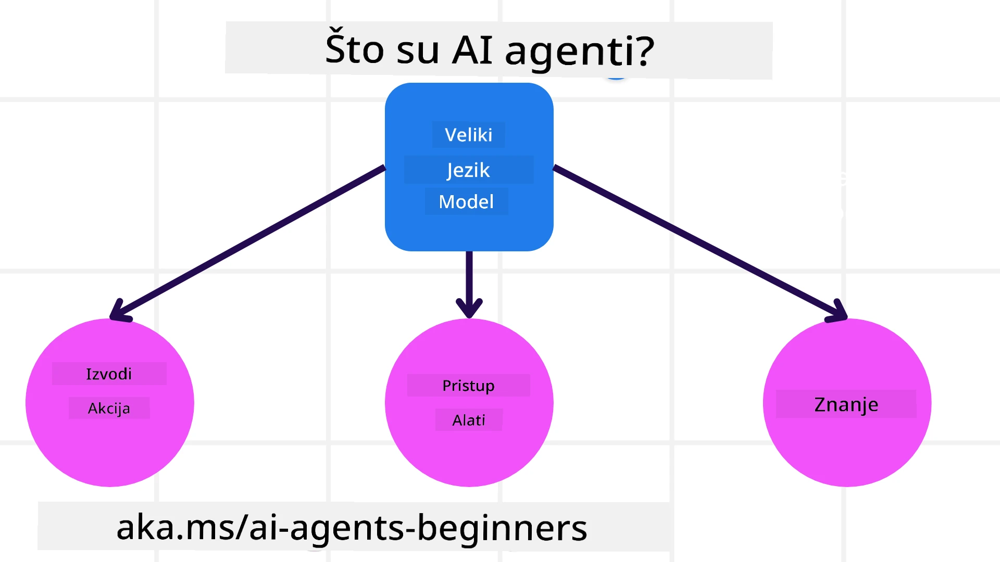
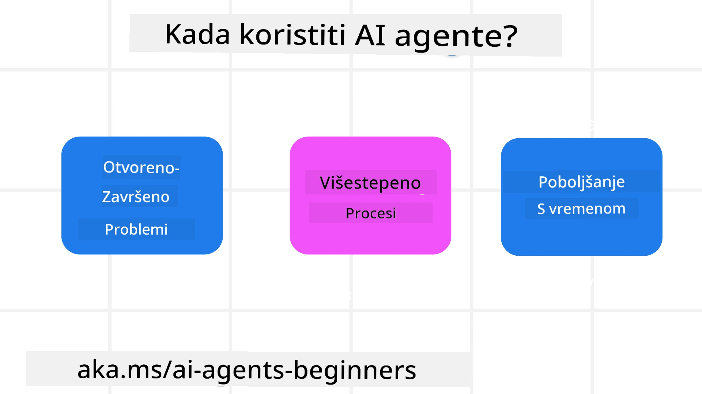

> _(Kliknite na gornju sliku za pregled videa ovog časa)_

# Uvod u AI agente i primjere korištenja agenata

Dobrodošli na kurs "AI Agent za početnike"! Ovaj kurs pruža osnovno znanje i primjere za izgradnju AI agenata.

Pridružite se <a href="https://discord.gg/kzRShWzttr" target="_blank">Azure AI Discord zajednici</a> kako biste upoznali druge učenike i graditelje AI agenata te postavili sva pitanja koja imate o ovom kursu.

Za početak ovog kursa, započinjemo s boljim razumijevanjem što su AI agenti i kako ih možemo koristiti u aplikacijama i radnim tokovima koje gradimo.

## Uvod

Ovaj čas pokriva:

- Što su AI agenti i koje su različite vrste agenata?
- Koji su najbolji primjeri korištenja AI agenata i kako nam mogu pomoći?
- Koji su neki osnovni gradivni blokovi pri dizajniranju agentnih rješenja?

## Ciljevi učenja
Nakon završetka ovog časa, trebali biste moći:

- Razumjeti koncepte AI agenata i kako se razlikuju od drugih AI rješenja.
- Najefikasnije primjenjivati AI agente.
- Produktivno dizajnirati agentna rješenja za korisnike i kupce.

## Definiranje AI agenata i vrste AI agenata

### Što su AI agenti?

AI agenti su **sistemi** koji omogućuju **velikim jezičnim modelima (LLM)** da **izvode radnje** proširujući njihove mogućnosti davanjem LLM-ovima **pristupa alatima** i **znanju**.

Razložimo ovu definiciju na manje dijelove:

- **Sistem** - Važno je razmišljati o agentima ne kao o pojedinačnoj komponenti, već kao o sistemu mnogih komponenti. Na osnovnoj razini, komponente AI agenta su:
  - **Okolina** - Definirani prostor u kojem AI agent djeluje. Na primjer, ako imamo AI agenta za rezervacije putovanja, okolina može biti sustav za rezervaciju putovanja koji agent koristi za izvršavanje zadataka.
  - **Senzori** - Okoline imaju informacije i pružaju povratne informacije. AI agenti koriste senzore da prikupe i interpretiraju informacije o trenutnom stanju okoline. U primjeru agent putničke rezervacije, sustav za rezervacije može pružiti informacije poput dostupnosti hotela ili cijena letova.
  - **Aktuatori** - Kada AI agent primi trenutno stanje okoline, za zadatak koji ima, agent određuje koju radnju treba izvršiti kako bi promijenio okolinu. Za agenta za putničku rezervaciju to može biti rezervacija dostupne sobe za korisnika.

**Veliki jezični modeli** - Koncept agenata postojao je prije stvaranja LLM-ova. Prednost izgradnje AI agenata s LLM-ovima je njihova sposobnost tumačenja ljudskog jezika i podataka. Ova sposobnost omogućava LLM-ovima tumačenje informacija iz okoline i definiranje plana za promjenu okoline.

**Izvođenje radnji** - Izvan sistema AI agenata, LLM-ovi su ograničeni na situacije gdje je radnja generiranje sadržaja ili informacija na temelju korisničkog upita. Unutar sistema AI agenata, LLM-ovi mogu izvršavati zadatke tumačeći zahtjev korisnika i koristeći alate dostupne u njihovoj okolini.

**Pristup alatima** - Koji alati su dostupni LLM-u određeno je 1) okolinom u kojoj djeluje i 2) programerom AI agenta. Za primjer našeg agenta za putovanja, alati agenta su ograničeni operacijama dostupnim u sustavu za rezervaciju i/ili programer može ograničiti pristup agentovim alatima samo na letove.

**Memorija+Znanje** - Memorija može biti kratkoročna u kontekstu razgovora između korisnika i agenta. Dugoročno, osim informacija koje pruža okolina, AI agenti mogu dohvatiti znanje iz drugih sustava, servisa, alata pa čak i drugih agenata. U primjeru agenta za putovanja, to znanje može biti informacije o korisnikovim preferencijama putovanja pohranjene u bazi podataka korisnika.

### Različite vrste agenata

Sad kad imamo opći definiranje AI agenata, pogledajmo neke specifične vrste agenata i kako bi se oni primijenili na AI agenta za rezervacije putovanja.

| **Vrsta agenta**              | **Opis**                                                                                                                          | **Primjer**                                                                                                                                                                        |
| ----------------------------- | --------------------------------------------------------------------------------------------------------------------------------- | --------------------------------------------------------------------------------------------------------------------------------------------------------------------------------- |
| **Jednostavni refleksni agenti** | Izvršavaju trenutne radnje na temelju unaprijed definiranih pravila.                                                           | Agent za putovanja interpretira kontekst e-maila i prosljeđuje pritužbe putovanja službi za korisnike.                                                                             |
| **Model-based refleksni agenti** | Izvršavaju radnje na temelju modela svijeta i promjena tog modela.                                                            | Agent za putovanja prioritizira rute s značajnim promjenama cijena koristeći povijesne podatke o cijenama.                                                                         |
| **Agent s ciljevima**          | Izrađuju planove za postizanje specifičnih ciljeva tumačeći cilj i određujući radnje potrebne za njegovo ostvarenje.           | Agent za putovanja rezervira putovanje određujući potrebne aranžmane (auto, javni prijevoz, letove) od trenutne lokacije do odredišta.                                           |
| **Agent temeljen na korisnosti** | Razmatra preferencije i numerički procjenjuje kompromise kako bi odredio kako postići ciljeve.                                 | Agent za putovanja maksimizira korisnost procjenjujući pogodnost naspram troškova prilikom rezervacije putovanja.                                                                   |
| **Učeći agenti**              | Poboljšavaju se tijekom vremena odgovarajući na povratne informacije i prilagođavajući radnje u skladu s tim.                  | Agent za putovanja poboljšava se koristeći povratne informacije korisnika iz anketa nakon putovanja te vrši prilagodbe budućih rezervacija.                                        |
| **Hijerarhijski agenti**       | Sastoje se od više agenata u slojevitoj strukturi, pri čemu viši agenti razlažu zadatke u podzadatke koje niži agenti izvršavaju. | Agent za putovanja otkazuje putovanje dijeleći zadatak u podzadatke (na primjer, otkazivanje specifičnih rezervacija) koje izvršavaju niži agenti, a zatim se izvještava višem agentu. |
| **Sustavi s više agenata (MAS)** | Agenti neovisno izvršavaju zadatke, bilo suradnički ili natjecateljski.                                                       | Suradnički: Više agenata rezervira specifične usluge putovanja poput hotela, letova i zabave. Natjecateljski: Više agenata upravlja i natječe se za rezervacije u zajedničkom kalendaru hotela. |

## Kada koristiti AI agente

U prethodnom odjeljku koristili smo primjer agenta za putničke rezervacije za objasniti kako se različite vrste agenata mogu koristiti u različitim scenarijima rezervacije putovanja. Nastavimo koristiti ovu aplikaciju kroz cijeli kurs.

Pogledajmo vrste primjera korištenja za koje su AI agenti najbolje primjenjivi:

- **Problemi otvorenog tipa** - LLM sam određuje potrebne korake za izvršenje zadatka jer se ti koraci ne mogu uvijek unaprijed hardkodirati u radni tok.
- **Višekoračni procesi** - zadaci koji zahtijevaju razinu kompleksnosti u kojoj AI agent mora koristiti alate ili informacije tijekom više koraka, a ne samo jednokratno dohvaćanje.
- **Poboljšanje tijekom vremena** - zadaci gdje se agent može poboljšavati kroz vrijeme primanjem povratnih informacija iz okoline ili od korisnika za pružanje bolje usluge.

Više o razmatranjima korištenja AI agenata obrađujemo u lekciji o izgradnji pouzdanih AI agenata.

## Osnove agentnih rješenja

### Razvoj agenata

Prvi korak u dizajniranju sustava AI agenata je definirati alate, radnje i ponašanja. U ovom kursu fokusiramo se na korištenje **Azure AI Agent Service** za definiranje naših agenata. Nudi funkcije poput:

- Izbor otvorenih modela kao što su OpenAI, Mistral i Llama
- Korištenje licenciranih podataka putem pružatelja poput Tripadvisor
- Korištenje standardiziranih OpenAPI 3.0 alata

### Agentni obrasci

Komunikacija s LLM-ovima odvija se putem upita (prompta). Zbog polu-autonomne prirode AI agenata, ne može se uvijek ili nije potrebno ručno ponovno postavljati upite LLM-u nakon promjene u okolini. Koristimo **agentne obrasce** koji nam omogućuju da upite LLM-u postavljamo kroz više koraka na skalabilniji način.

Ovaj kurs podijeljen je prema nekim od trenutno popularnih agentnih obrazaca.

### Agentni okviri

Agentni okviri omogućuju developerima implementaciju agentnih obrazaca kroz kod. Ovi okviri nude predloške, dodatke i alate za bolju suradnju AI agenata. Takve prednosti omogućuju bolju uvidljivost i otklanjanje problema u sustavima AI agenata.

U ovom kursu istražit ćemo Microsoft Agent Framework (MAF) za izgradnju produkcijski spremnih AI agenata.

## Primjeri koda

- Python: [Agent Framework](./code_samples/01-python-agent-framework.ipynb)
- .NET: [Agent Framework](./code_samples/01-dotnet-agent-framework.md)

## Imate li još pitanja o AI agentima?

Pridružite se [Microsoft Foundry Discordu](https://aka.ms/ai-agents/discord) da upoznate druge učenike, sudjelujete u konzultacijama i dobijete odgovore na svoja pitanja o AI agentima.

## Prethodna lekcija

[Postavljanje kursa](../00-course-setup/README.md)

## Sljedeća lekcija

[Istraživanje agentnih okvira](../02-explore-agentic-frameworks/README.md)

---

<!-- CO-OP TRANSLATOR DISCLAIMER START -->
**Odricanje od odgovornosti**:
Ovaj dokument preveden je pomoću AI prevoditeljskog servisa [Co-op Translator](https://github.com/Azure/co-op-translator). Iako težimo točnosti, imajte na umu da automatski prijevodi mogu sadržavati pogreške ili netočnosti. Izvorni dokument na izvornom jeziku treba se smatrati službenim izvorom. Za važne informacije preporučuje se profesionalni ljudski prijevod. Nismo odgovorni za bilo kakve nesporazume ili kriva tumačenja koja proizlaze iz korištenja ovog prijevoda.
<!-- CO-OP TRANSLATOR DISCLAIMER END -->