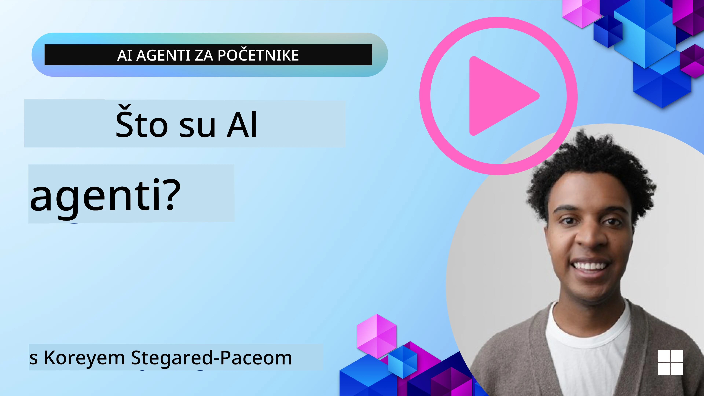
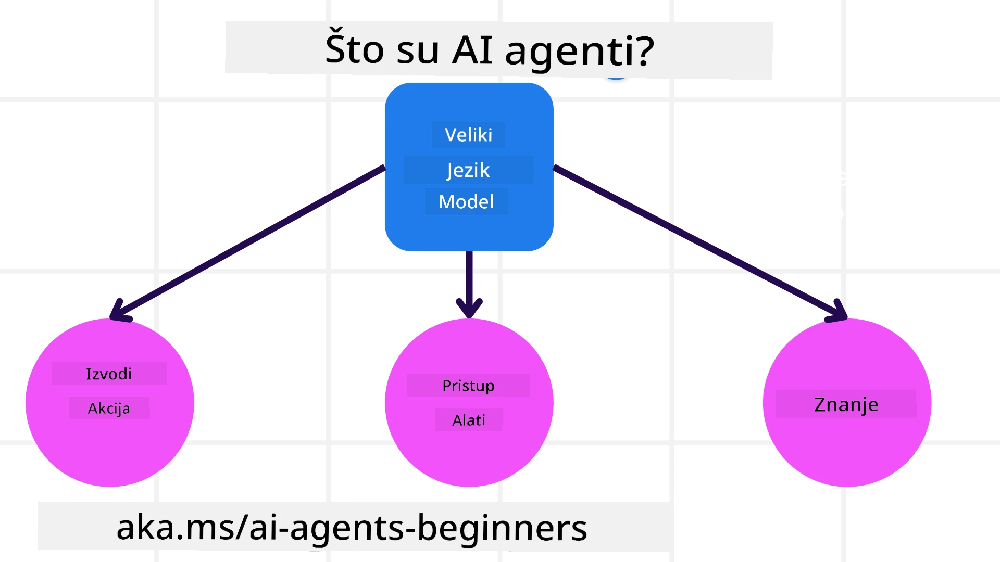
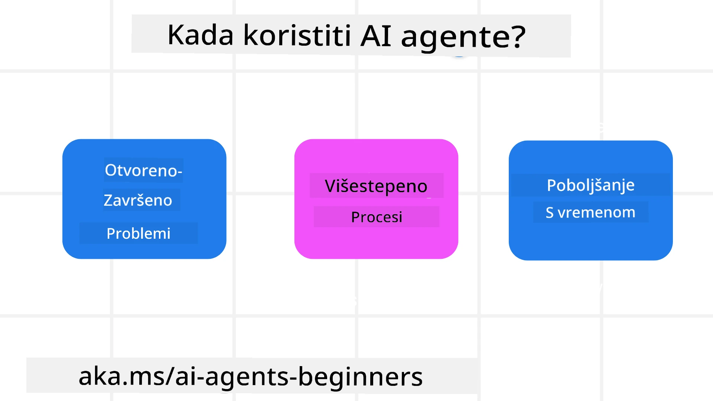

> _(Kliknite sliku iznad da pogledate video za ovu lekciju)_

# Uvod u AI agente i primjere njihove primjene

Dobrodošli na tečaj **AI Agenti za početnike**! Ovaj tečaj vam daje temeljnog znanja — i stvaran radni kod — za početak izgradnje AI agenata od nule.

Dođite pozdraviti se u <a href="https://discord.gg/kzRShWzttr" target="_blank">Azure AI Discord zajednicu</a> — puna je učenika i AI tvoraca koji rado odgovaraju na pitanja.

Prije nego što krenemo u izgradnju, pobrinimo se da stvarno razumijemo što AI agent *jeste* i kada ima smisla koristiti ga.

---

## Uvod

Ova lekcija obuhvaća:

- Što su AI agenti i različite vrste koje postoje
- Za koje vrste zadataka su AI agenti najbolje prikladni
- Osnovne građevne blokove koje ćete koristiti prilikom dizajniranja agentnog rješenja

## Ciljevi učenja

Do kraja ove lekcije trebali biste biti u stanju:

- Objasniti što je AI agent i kako se razlikuje od običnog AI rješenja
- Znati kada posegnuti za AI agentom (a kada ne)
- Skicirati osnovni dizajn agentnog rješenja za problem iz stvarnog svijeta

---

## Definiranje AI agenata i vrste AI agenata

### Što su AI agenti?

Evo jednostavan način razmišljanja o tome:

> **AI agenti su sustavi koji dopuštaju Velikim jezičnim modelima (LLM) zapravo *raditi stvari* — dajući im alate i znanje da djeluju na svijet, a ne samo odgovaraju na zahtjeve.**

Razjasnimo malo:

- **Sustav** — AI agent nije samo jedna stvar. To je skup dijelova koji rade zajedno. U svojoj biti, svaki agent ima tri dijela:
  - **Okruženje** — Prostor u kojem agent djeluje. Za agenta za rezervaciju putovanja to bi bila sama platforma za rezervacije.
  - **Senzore** — Kako agent čita trenutačno stanje svog okruženja. Naš agent za putovanja može provjeravati dostupnost hotela ili cijene letova.
  - **Aktuatore** — Kako agent poduzima akcije. Agent za putovanja može rezervirati sobu, poslati potvrdu ili otkazati rezervaciju.

- **Veliki jezični modeli** — Agenti su postojali i prije LLM-a, ali LLM-ovi čine moderne agente toliko moćnima. Oni mogu razumjeti prirodni jezik, rezonirati o kontekstu i pretvoriti nejasan korisnički zahtjev u konkretan plan djelovanja.

- **Izvođenje radnji** — Bez agentnog sustava, LLM samo generira tekst. Unutar agentnog sustava, LLM zapravo može *izvršavati* korake — pretraživati bazu podataka, pozivati API, slati poruku.

- **Pristup alatima** — Koje alate agent može koristiti ovisi o (1) okruženju u kojem radi i (2) što mu je programer odabrao dati. Agent za putovanja može pretraživati letove, ali ne i uređivati podatke o kupcima — sve ovisi što povežete.

- **Memorija + znanje** — Agenti mogu imati kratkotrajnu memoriju (trenutni razgovor) i dugotrajnu memoriju (bazu podataka kupaca, prošle interakcije). Agent za putovanja može "zapamtiti" da preferirate sjedala uz prozor.

---

### Različite vrste AI agenata

Nisu svi agenti izgrađeni na isti način. Evo pregleda glavnih vrsta, koristeći agenta za rezervaciju putovanja kao primjer:

| **Vrsta agenta** | **Što radi** | **Primjer agenta za putovanja** |
|---|---|---|
| **Jednostavni refleksni agenti** | Slijede unaprijed zadana pravila — nemaju memoriju, nemaju planiranje. | Vidi pritužbu u emailu → prosljeđuje službi za korisnike. To je to. |
| **Model-Temeljeni refleksni agenti** | Drži unutarnji model svijeta i ažurira ga kako se stvari mijenjaju. | Prati povijesne cijene letova i označava rute koje su iznenada skupe. |
| **Agenti temeljeni na cilju** | Imaju cilj i korak po korak pronalaze način kako ga ostvariti. | Rezervira cjelokupno putovanje (letove, auto, hotel) počevši od vaše trenutačne lokacije do odredišta. |
| **Agenti temeljeni na korisnosti** | Ne pronalaze samo *rješenje* — pronalaze *najbolje* rješenje procjenjujući kompromise. | Uravnotežuje cijenu i pogodnost da pronađe putovanje koje najviše odgovara vašim preferencijama. |
| **Agenti koji uče** | Vremenom postaju bolji učeći iz povratnih informacija. | Prilagođava buduće preporuke rezervacija na temelju ankete nakon putovanja. |
| **Hijerarhijski agenti** | Viši agent razlaže posao na podzadatke i delegira nižerazrednim agentima. | Zahtjev "otkaži putovanje" se dijeli na: otkaži let, otkaži hotel, otkaži najam auta — svaki vodi pod-agent. |
| **Sustavi s više agenata (MAS)** | Više neovisnih agenata surađuje ili konkurira. | Kooperativno: zasebni agenti upravljaju hotelima, letovima i zabavom. Konkurentski: više agenata natječe se za rezervaciju hotelskih soba po najboljoj cijeni. |

---

## Kada koristiti AI agente

Samo zato što *možete* koristiti AI agenta ne znači da to uvijek *trebate*. Evo situacija gdje agenti stvarno briljiraju:

- **Problemi otvorenog tipa** — Kada se koraci za rješavanje problema ne mogu prethodno programirati. Potreban vam je LLM da dinamički pronađe put.
- **Procesi s više koraka** — Zadatci koji zahtijevaju korištenje alata kroz više koraka, ne samo jedno pretraživanje ili generiranje.
- **Poboljšanje tijekom vremena** — Kada želite da sustav postaje pametniji na temelju povratnih informacija korisnika ili signala iz okoline.

Detaljnije ćemo istražiti kada (i kada *ne*) koristiti AI agente u lekciji **Izgradnja pouzdanih AI agenata** kasnije u tečaju.

---

## Osnove agentnih rješenja

### Razvoj agenata

Prvo što učinite pri izgradnji agenta je definirati *što može raditi* — njegove alate, akcije i ponašanja.

U ovom tečaju koristimo **Microsoft Foundry Agent Service** kao našu glavnu platformu. Podržava:

- Modele od pružatelja poput OpenAI, Mistral i Meta (Llama)
- Licencirane podatke od pružatelja poput Tripadvisor
- Standardizirane definicije alata OpenAPI 3.0

### Agentni obrasci

Komunicirate s LLM-ovima putem upita. S agentima ne možete uvijek ručno izrađivati svaki upit — agent mora djelovati kroz mnogo koraka. Tu ulaze **agentni obrasci**. To su ponovljivo upotrebljive strategije za promptiranje i orkestraciju LLM-ova na skalabilniji i pouzdaniji način.

Ovaj tečaj je strukturiran oko najčešćih i najkorisnijih agentnih obrazaca.

### Agentni okviri

Agentni okviri pružaju programerima gotove predloške, alate i infrastrukturu za izgradnju agenata. Olakšavaju:

- Povezivanje alata i mogućnosti
- Promatranje što agent radi (i ispravljanje grešaka)
- Suradnju među više agenata

U ovom tečaju fokusiramo se na **Microsoft Agent Framework (MAF)** za izgradnju agenata spremnih za produkciju.

---

## Primjeri koda

Spremni vidjeti to u akciji? Evo primjera koda za ovu lekciju:

- 🐍 Python: [Agent Framework](./code_samples/01-python-agent-framework.ipynb)
- 🔷 .NET: [Agent Framework](./code_samples/01-dotnet-agent-framework.md)

---

## Imate pitanja?

Pridružite se [Microsoft Foundry Discordu](https://discord.com/invite/ATgtXmAS5D) da se povežete s drugim učenicima, sudjelujete na uredskim satima i dobijete odgovore na pitanja o AI agentima od zajednice.

---

## Prethodna lekcija

[Postavljanje tečaja](../00-course-setup/README.md)

## Sljedeća lekcija

[Istraživanje agentnih okvira](../02-explore-agentic-frameworks/README.md)

---

<!-- CO-OP TRANSLATOR DISCLAIMER START -->
**Napomena**:
Ovaj dokument je preveden korištenjem AI prevoditeljskog servisa [Co-op Translator](https://github.com/Azure/co-op-translator). Iako težimo točnosti, imajte na umu da automatski prijevodi mogu sadržavati greške ili netočnosti. Izvorni dokument na izvornom jeziku treba smatrati autoritativnim izvorom. Za važne informacije preporuča se profesionalni ljudski prijevod. Nismo odgovorni za bilo kakva nesporazumevanja ili pogrešne interpretacije koje proizlaze iz korištenja ovog prijevoda.
<!-- CO-OP TRANSLATOR DISCLAIMER END -->