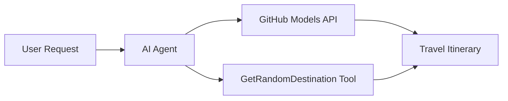

# 🌍 AI Putni Agent s Microsoft Agent Frameworkom (.NET)

## 📋 Pregled scenarija

Ovaj priručnik pokazuje kako izraditi inteligentnog agenta za planiranje putovanja koristeći Microsoft Agent Framework za .NET. Agent može automatski generirati personalizirane jednodnevne itinerere za nasumične destinacije širom svijeta.

**Ključne mogućnosti:**
- 🎲 **Nasumični odabir destinacije**: Koristi prilagođeni alat za odabir lokacija za odmor
- 🗺️ **Inteligentno planiranje putovanja**: Stvara detaljne itinerere po danima
- 🔄 **Streaming u stvarnom vremenu**: Podržava trenutne i streaming odgovore
- 🛠️ **Integracija prilagođenih alata**: Pokazuje kako proširiti mogućnosti agenta

## 🔧 Tehnička arhitektura

### Osnovne tehnologije
- **Microsoft Agent Framework**: Najnovija .NET implementacija za razvoj AI agenata
- **Integracija GitHub modela**: Koristi GitHubovu uslugu za inferenciju AI modela
- **Kompatibilnost s OpenAI API-jem**: Koristi OpenAI klijentske biblioteke s prilagođenim endpointima
- **Sigurna konfiguracija**: Upravljanje API ključevima putem okruženja

### Ključne komponente
1. **AIAgent**: Glavni orkestrator agenta koji upravlja tijekom razgovora
2. **Prilagođeni alati**: Funkcija `GetRandomDestination()` dostupna agentu
3. **Chat klijent**: Sučelje za razgovor podržano GitHub modelima
4. **Podrška za streaming**: Sposobnost generiranja odgovora u stvarnom vremenu

### Uzorak integracije


## 🚀 Početak rada

**Preduvjeti:**
- .NET 9.0 ili noviji
- Pristupni token za GitHub Models API
- Konfigurirane varijable okruženja u `.env` datoteci

**Potrebne varijable okruženja:**
```env
GITHUB_TOKEN=your_github_token
GITHUB_ENDPOINT=https://models.inference.ai.azure.com
GITHUB_MODEL_ID=gpt-4o-mini
```

Pokrenite ćelije ispod redoslijedom kako biste vidjeli agenta za putovanja u akciji!

---

## .NET Single File App: AI Travel Agent Example

See `01-dotnet-agent-framework.cs` for the complete runnable code sample.

Pokrenite primjer koda ispod:

```bash
dotnet run 01-dotnet-agent-framework.cs
```

### Sample Code

```csharp
static string GetRandomDestination()
{
    var destinations = new List<string>
    {
        "Paris, France",
        "Tokyo, Japan",
        "New York City, USA",
        "Sydney, Australia",
        "Rome, Italy",
        "Barcelona, Spain",
        "Cape Town, South Africa",
        "Rio de Janeiro, Brazil",
        "Bangkok, Thailand",
        "Vancouver, Canada"
    };
    var random = new Random();
    int index = random.Next(destinations.Count);
    return destinations[index];
}

// Extract configuration from environment variables
var github_endpoint = Environment.GetEnvironmentVariable("GITHUB_ENDPOINT") ?? throw new InvalidOperationException("GITHUB_ENDPOINT is not set.");
var github_model_id = Environment.GetEnvironmentVariable("GITHUB_MODEL_ID") ?? "gpt-4o-mini";
var github_token = Environment.GetEnvironmentVariable("GITHUB_TOKEN") ?? throw new InvalidOperationException("GITHUB_TOKEN is not set.");

// Configure OpenAI Client Options
var openAIOptions = new OpenAIClientOptions()
{
    Endpoint = new Uri(github_endpoint)
};

// Initialize OpenAI Client with GitHub Models Configuration
var openAIClient = new OpenAIClient(new ApiKeyCredential(github_token), openAIOptions);

// Create AI Agent with Travel Planning Capabilities
AIAgent agent = openAIClient
    .GetChatClient(github_model_id)
    .CreateAIAgent(
        instructions: "You are a helpful AI Agent that can help plan vacations for customers at random destinations",
        tools: [AIFunctionFactory.Create(GetRandomDestination)]
    );

// Execute Agent: Plan a Day Trip (Non-Streaming)
Console.WriteLine(await agent.RunAsync("Plan me a day trip"));

// Execute Agent: Plan a Day Trip (Streaming Response)
await foreach (var update in agent.RunStreamingAsync("Plan me a day trip"))
{
    Console.Write(update);
}
```
