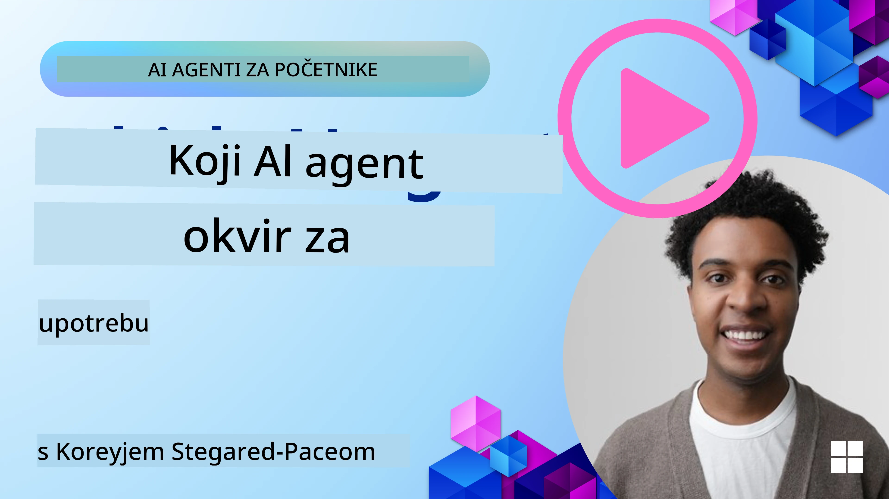

[](https://youtu.be/ODwF-EZo_O8?si=1xoy_B9RNQfrYdF7)

> _(Kliknite gornju sliku za pregled videa ovog lekcija)_

# Istražite AI Agent Frameworke

AI agent frameworki su softverske platforme osmišljene da pojednostave izradu, implementaciju i upravljanje AI agentima. Ovi frameworki pružaju programerima predizgrađene komponente, apstrakcije i alate koji olakšavaju razvoj složenih AI sustava.

Ovi frameworki pomažu programerima da se fokusiraju na jedinstvene aspekte svojih aplikacija pružajući standardizirane pristupe zajedničkim izazovima u razvoju AI agenata. Oni poboljšavaju skalabilnost, pristupačnost i učinkovitost u izgradnji AI sustava.

## Uvod

Ova lekcija će obuhvatiti:

- Što su AI Agent Frameworki i što omogućuju programerima da postignu?
- Kako timovi mogu koristiti ove frameworke za brzo prototipiranje, iteraciju i poboljšanje sposobnosti svog agenta?
- Koje su razlike između frameworka i alata koje su stvorili Microsoft (<a href="https://aka.ms/ai-agents-beginners/ai-agent-service" target="_blank">Azure AI Agent Service</a> i <a href="https://learn.microsoft.com/azure/ai-services/openai/how-to/responses" target="_blank">Microsoft Agent Framework</a>)?
- Mogu li integrirati postojeće alate u Azure ekosistemu izravno, ili trebam samostalna rješenja?
- Što je Azure AI Agents usluga i kako mi pomaže?

## Ciljevi učenja

Ciljevi ove lekcije su da vam pomognu razumjeti:

- Ulogu AI Agent Frameworka u AI razvoju.
- Kako iskoristiti AI Agent Frameworke za izgradnju inteligentnih agenata.
- Ključne sposobnosti koje omogućuju AI Agent Frameworki.
- Razlike između Microsoft Agent Frameworka i Azure AI Agent Service.

## Što su AI Agent Frameworki i što omogućuju programerima?

Tradicionalni AI Frameworki mogu vam pomoći integrirati AI u vaše aplikacije i učiniti ih boljima na sljedeće načine:

- **Personalizacija**: AI može analizirati ponašanje korisnika i njihove preferencije kako bi pružio personalizirane preporuke, sadržaj i iskustva.
Primjer: Streaming servisi poput Netflixa koriste AI za predlaganje filmova i emisija na temelju gledane povijesti, povećavajući angažman i zadovoljstvo korisnika.
- **Automatizacija i učinkovitost**: AI može automatizirati ponavljajuće zadatke, pojednostaviti tokove rada i poboljšati operativnu učinkovitost.
Primjer: Aplikacije korisničke podrške koriste AI-pokretane chatbotove za rješavanje uobičajenih upita, smanjujući vrijeme odgovora i oslobađajući ljudske agente za složenija pitanja.
- **Poboljšano korisničko iskustvo**: AI može unaprijediti cjelokupno korisničko iskustvo pružajući inteligentne značajke poput prepoznavanja glasa, obrade prirodnog jezika i prediktivnog teksta.
Primjer: Virtualni asistenti poput Siri i Google Assistant koriste AI da razumiju i odgovore na glasovne naredbe, olakšavajući korisnicima interakciju s uređajima.

### Sve to zvuči odlično, zar ne? Pa zašto nam onda treba AI Agent Framework?

AI Agent frameworki predstavljaju nešto više od običnih AI frameworka. Dizajnirani su da omoguće izradu inteligentnih agenata koji mogu komunicirati s korisnicima, drugim agentima i okolinom kako bi postigli specifične ciljeve. Ti agenti mogu pokazivati autonomno ponašanje, donositi odluke i prilagođavati se promjenjivim uvjetima. Pogledajmo neke ključne sposobnosti koje omogućuju AI Agent Frameworki:

- **Suradnja i koordinacija agenata**: Omogućuju izradu više AI agenata koji mogu raditi zajedno, komunicirati i koordinirati se za rješavanje složenih zadataka.
- **Automatizacija i upravljanje zadacima**: Pružaju mehanizme za automatizaciju višestepenih tokova rada, delegiranje zadataka i dinamičko upravljanje zadacima među agentima.
- **Kontekstualno razumijevanje i prilagodba**: Opremaju agente sposobnošću razumijevanja konteksta, prilagodbe promjenjivim uvjetima i donošenja odluka na temelju informacija u stvarnom vremenu.

Ukratko, agenti vam omogućuju više, podižu automatizaciju na novu razinu, stvaraju inteligentnije sustave koji se mogu prilagođavati i učiti iz svoje okoline.

## Kako brzo prototipirati, iterirati i poboljšati sposobnosti agenta?

Ovo je brzo promjenjivo područje, ali postoje neki elementi zajednički većini AI Agent Frameworka koji vam mogu pomoći da brzo prototipirate i iterirate, a to su modularne komponente, alati za suradnju i učenje u stvarnom vremenu. Pogledajmo ih detaljnije:

- **Koristite modularne komponente**: AI SDK-ovi nude predizgrađene komponente poput AI i konektora memorije, pozivanje funkcija pomoću prirodnog jezika ili dodataka za kod, predloške za promptove i još mnogo toga.
- **Iskoristite alate za suradnju**: Dizajnirajte agente sa specifičnim ulogama i zadacima, omogućujući im testiranje i usavršavanje suradničkih tokova rada.
- **Učite u stvarnom vremenu**: Implementirajte povratne petlje u kojima agenti uče iz interakcija i dinamički prilagođavaju svoje ponašanje.

### Koristite modularne komponente

SDK-ovi poput Microsoft Agent Frameworka nude predizgrađene komponente poput AI konektora, definicija alata i upravljanja agentima.

**Kako timovi mogu koristiti ove komponente**: Timovi mogu brzo sastaviti ove komponente za izradu funkcionalnog prototipa bez potrebe za radom od početka, što omogućuje brzo eksperimentiranje i iteraciju.

**Kako to funkcionira u praksi**: Možete koristiti već izrađeni parser za izdvajanje informacija iz korisničkog unosa, modul memorije za pohranu i dohvat podataka te generator prompta za interakciju s korisnicima, sve bez potrebe da sami izrađujete te komponente.

**Primjer koda**. Pogledajmo primjer kako koristiti Microsoft Agent Framework s `AzureAIProjectAgentProvider` za odgovaranje modela na korisnički unos s pozivanjem alata:

``` python
# Primjer Microsoft Agent Frameworka u Pythonu

import asyncio
import os
from typing import Annotated

from agent_framework.azure import AzureAIProjectAgentProvider
from azure.identity import AzureCliCredential


# Definirajte primjer funkcije alata za rezervaciju putovanja
def book_flight(date: str, location: str) -> str:
    """Book travel given location and date."""
    return f"Travel was booked to {location} on {date}"


async def main():
    provider = AzureAIProjectAgentProvider(credential=AzureCliCredential())
    agent = await provider.create_agent(
        name="travel_agent",
        instructions="Help the user book travel. Use the book_flight tool when ready.",
        tools=[book_flight],
    )

    response = await agent.run("I'd like to go to New York on January 1, 2025")
    print(response)
    # Primjer izlaza: Vaš let za New York 1. siječnja 2025. uspješno je rezerviran. Sretan put! ✈️🗽


if __name__ == "__main__":
    asyncio.run(main())
```

Iz ovog primjera vidite kako možete iskoristiti predizgrađeni parser za izdvajanje ključnih informacija iz korisničkog unosa, poput polazišta, odredišta i datuma zahtjeva za rezervaciju leta. Ovaj modularni pristup vam omogućuje da se fokusirate na logiku visokog nivoa.

### Iskoristite alate za suradnju

Frameworki poput Microsoft Agent Frameworka olakšavaju izradu više agenata koji mogu raditi zajedno.

**Kako timovi mogu koristiti ove alate**: Timovi mogu dizajnirati agente sa specifičnim ulogama i zadacima, omogućujući im testiranje i usavršavanje suradničkih tokova rada i povećavanje učinkovitosti sustava.

**Kako to funkcionira u praksi**: Možete napraviti tim agenata gdje svaki agent ima specijaliziranu funkciju, poput dohvaćanja podataka, analize ili donošenja odluka. Ti agenti mogu komunicirati i dijeliti informacije kako bi postigli zajednički cilj, poput odgovora na korisnički upit ili izvršavanja zadatka.

**Primjer koda (Microsoft Agent Framework)**:

```python
# Stvaranje više agenata koji rade zajedno koristeći Microsoft Agent Framework

import os
from agent_framework.azure import AzureAIProjectAgentProvider
from azure.identity import AzureCliCredential

provider = AzureAIProjectAgentProvider(credential=AzureCliCredential())

# Agent za dohvat podataka
agent_retrieve = await provider.create_agent(
    name="dataretrieval",
    instructions="Retrieve relevant data using available tools.",
    tools=[retrieve_tool],
)

# Agent za analizu podataka
agent_analyze = await provider.create_agent(
    name="dataanalysis",
    instructions="Analyze the retrieved data and provide insights.",
    tools=[analyze_tool],
)

# Pokretanje agenata redom na zadatku
retrieval_result = await agent_retrieve.run("Retrieve sales data for Q4")
analysis_result = await agent_analyze.run(f"Analyze this data: {retrieval_result}")
print(analysis_result)
```

U prethodnom kodu vidite kako možete kreirati zadatak koji uključuje više agenata koji zajedno analiziraju podatke. Svaki agent obavlja određenu funkciju, a zadatak se izvršava koordinacijom agenata kako bi se postigao željeni rezultat. Izradom namjenskih agenata sa specijaliziranim ulogama možete poboljšati učinkovitost i performanse zadatka.

### Učite u stvarnom vremenu

Napredni frameworki pružaju sposobnosti za razumijevanje konteksta u stvarnom vremenu i prilagodbu.

**Kako timovi mogu iskoristiti ovu mogućnost**: Timovi mogu implementirati povratne petlje u kojima agenti uče iz interakcija i dinamički prilagođavaju svoje ponašanje, što dovodi do kontinuiranog poboljšanja i usavršavanja sposobnosti.

**Kako to funkcionira u praksi**: Agent analizira povratne informacije korisnika, podatke okoline i rezultate zadataka za ažuriranje baze znanja, prilagodbu algoritama odlučivanja i poboljšanje performansi kroz vrijeme. Ovaj iterativni proces učenja omogućuje agentima da se prilagođavaju promjenjivim uvjetima i korisničkim preferencijama, povećavajući ukupnu učinkovitost sustava.

## Koje su razlike između Microsoft Agent Frameworka i Azure AI Agent Service?

Postoji mnogo načina za usporedbu ovih pristupa, ali pogledajmo neke ključne razlike u dizajnu, sposobnostima i ciljnim slučajevima upotrebe:

## Microsoft Agent Framework (MAF)

Microsoft Agent Framework pruža pojednostavljeni SDK za izradu AI agenata koristeći `AzureAIProjectAgentProvider`. Omogućuje programerima stvaranje agenata koji koriste Azure OpenAI modele s ugrađenim pozivanjem alata, upravljanjem razgovorima i sigurnošću na razini poduzeća putem Azure identiteta.

**Primjene**: Izrada produkcijski spremnih AI agenata s upotrebom alata, višestepenim tokovima rada i scenarijima integracije u poduzeću.

Evo nekih važnih osnovnih koncepata Microsoft Agent Frameworka:

- **Agenti**. Agent se kreira putem `AzureAIProjectAgentProvider` i konfigurira s imenom, uputama i alatima. Agent može:
  - **Obraditi poruke korisnika** i generirati odgovore koristeći Azure OpenAI modele.
  - **Automatski pozivati alate** na temelju konteksta razgovora.
  - **Održavati stanje razgovora** kroz više interakcija.

  Evo isječka koda koji pokazuje kako kreirati agenta:

    ```python
    import os
    from agent_framework.azure import AzureAIProjectAgentProvider
    from azure.identity import AzureCliCredential

    provider = AzureAIProjectAgentProvider(credential=AzureCliCredential())
    agent = await provider.create_agent(
        name="my_agent",
        instructions="You are a helpful assistant.",
    )

    response = await agent.run("Hello, World!")
    print(response)
    ```

- **Alati**. Framework podržava definiranje alata kao Python funkcija koje agent može automatski pozvati. Alati se registriraju prilikom stvaranja agenta:

    ```python
    def get_weather(location: str) -> str:
        """Get the current weather for a location."""
        return f"The weather in {location} is sunny, 72\u00b0F."

    agent = await provider.create_agent(
        name="weather_agent",
        instructions="Help users check the weather.",
        tools=[get_weather],
    )
    ```

- **Koordinacija više agenata**. Možete kreirati više agenata s različitim specijalizacijama i koordinirati njihov rad:

    ```python
    planner = await provider.create_agent(
        name="planner",
        instructions="Break down complex tasks into steps.",
    )

    executor = await provider.create_agent(
        name="executor",
        instructions="Execute the planned steps using available tools.",
        tools=[execute_tool],
    )

    plan = await planner.run("Plan a trip to Paris")
    result = await executor.run(f"Execute this plan: {plan}")
    ```

- **Integracija Azure identiteta**. Framework koristi `AzureCliCredential` (ili `DefaultAzureCredential`) za sigurnu autentifikaciju bez ključeva, uklanjajući potrebu za upravljanjem API ključevima izravno.

## Azure AI Agent Service

Azure AI Agent Service je noviji dodatak, predstavljen na Microsoft Ignite 2024. Omogućuje razvoj i implementaciju AI agenata s fleksibilnijim modelima, poput izravnog pozivanja open-source LLM modela poput Llama 3, Mistral i Cohere.

Azure AI Agent Service pruža snažnije sigurnosne mehanizme na razini poduzeća i metode pohrane podataka, što ga čini prikladnim za enterprise aplikacije.

Radi iz kutije zajedno s Microsoft Agent Frameworkom za izradu i implementaciju agenata.

Ova usluga je trenutno u Javnoj predbilježbi i podržava Python i C# za izradu agenata.

Korištenjem Azure AI Agent Service Python SDK-a možemo kreirati agenta s korisnički definiranim alatom:

```python
import asyncio
from azure.identity import DefaultAzureCredential
from azure.ai.projects import AIProjectClient

# Definirajte funkcije alata
def get_specials() -> str:
    """Provides a list of specials from the menu."""
    return """
    Special Soup: Clam Chowder
    Special Salad: Cobb Salad
    Special Drink: Chai Tea
    """

def get_item_price(menu_item: str) -> str:
    """Provides the price of the requested menu item."""
    return "$9.99"


async def main() -> None:
    credential = DefaultAzureCredential()
    project_client = AIProjectClient.from_connection_string(
        credential=credential,
        conn_str="your-connection-string",
    )

    agent = project_client.agents.create_agent(
        model="gpt-4o-mini",
        name="Host",
        instructions="Answer questions about the menu.",
        tools=[get_specials, get_item_price],
    )

    thread = project_client.agents.create_thread()

    user_inputs = [
        "Hello",
        "What is the special soup?",
        "How much does that cost?",
        "Thank you",
    ]

    for user_input in user_inputs:
        print(f"# User: '{user_input}'")
        message = project_client.agents.create_message(
            thread_id=thread.id,
            role="user",
            content=user_input,
        )
        run = project_client.agents.create_and_process_run(
            thread_id=thread.id, agent_id=agent.id
        )
        messages = project_client.agents.list_messages(thread_id=thread.id)
        print(f"# Agent: {messages.data[0].content[0].text.value}")


if __name__ == "__main__":
    asyncio.run(main())
```

### Osnovni koncepti

Azure AI Agent Service ima sljedeće osnovne koncepte:

- **Agent**. Azure AI Agent Service se integrira s Microsoft Foundryem. Unutar AI Foundry, AI Agent djeluje kao "pametna" mikroservisa koja se može koristiti za odgovaranje na pitanja (RAG), izvršavanje radnji ili potpunu automatizaciju tokova rada. To postiže kombiniranjem moći generativnih AI modela s alatima koji mu omogućuju pristup i interakciju s izvorima podataka iz stvarnog svijeta. Evo primjera agenta:

    ```python
    agent = project_client.agents.create_agent(
        model="gpt-4o-mini",
        name="my-agent",
        instructions="You are helpful agent",
        tools=code_interpreter.definitions,
        tool_resources=code_interpreter.resources,
    )
    ```

    U ovom primjeru agent je kreiran s modelom `gpt-4o-mini`, imenom `my-agent` i uputama `You are helpful agent`. Agent je opremljen alatima i resursima za izvođenje zadataka interpretacije koda.

- **Konverzacija (thread) i poruke**. Konverzacija je također važan koncept. Predstavlja razgovor ili interakciju između agenta i korisnika. Konverzacije se koriste za praćenje napretka razgovora, pohranu kontekstualnih podataka i upravljanje stanjem interakcije. Evo primjera konverzacije:

    ```python
    thread = project_client.agents.create_thread()
    message = project_client.agents.create_message(
        thread_id=thread.id,
        role="user",
        content="Could you please create a bar chart for the operating profit using the following data and provide the file to me? Company A: $1.2 million, Company B: $2.5 million, Company C: $3.0 million, Company D: $1.8 million",
    )
    
    # Ask the agent to perform work on the thread
    run = project_client.agents.create_and_process_run(thread_id=thread.id, agent_id=agent.id)
    
    # Fetch and log all messages to see the agent's response
    messages = project_client.agents.list_messages(thread_id=thread.id)
    print(f"Messages: {messages}")
    ```

    U prethodnom kodu kreirana je konverzacija. Zatim se šalje poruka toj konverzaciji. Pozivom `create_and_process_run`, agentu se zadaje da obavi posao u konverzaciji. Na kraju se poruke dohvaćaju i bilježe radi pregleda odgovora agenta. Poruke pokazuju tijek razgovora između korisnika i agenta. Važno je razumjeti da poruke mogu biti različitih tipova kao što su tekst, slika ili datoteka; to znači da je rad agenta rezultirao, na primjer, slikom ili tekstualnim odgovorom. Kao programer, te informacije možete koristiti za daljnju obradu odgovora ili njegovo prikazivanje korisniku.

- **Integracija s Microsoft Agent Frameworkom**. Azure AI Agent Service radi besprijekorno s Microsoft Agent Frameworkom, što znači da možete graditi agente koristeći `AzureAIProjectAgentProvider` i implementirati ih kroz Agent Service za produkcijske scenarije.

**Primjene**: Azure AI Agent Service je dizajniran za enterprise aplikacije koje zahtijevaju sigurnu, skalabilnu i fleksibilnu implementaciju AI agenata.

## Koja je razlika između ovih pristupa?

Čini se da postoje preklapanja, ali postoje ključne razlike u dizajnu, mogućnostima i ciljanim slučajevima upotrebe:

- **Microsoft Agent Framework (MAF)**: Produkcijski spreman SDK za izgradnju AI agenata. Pruža pojednostavljeni API za stvaranje agenata s pozivanjem alata, upravljanjem razgovorom i integracijom Azure identiteta.
- **Azure AI Agent Service**: Platforma i usluga implementacije u Azure Foundryju za agente. Nudi ugrađenu povezivost s uslugama poput Azure OpenAI, Azure AI Search, Bing Search i izvršavanje koda.

Još se ne možete odlučiti koju opciju izabrati?

### Primjeri korištenja

Pogledajmo možemo li vam pomoći kroz neke uobičajene slučajeve upotrebe:

> P: Gradim produkcijske AI agent aplikacije i želim brzo započeti
>

> O: Microsoft Agent Framework je izvrstan izbor. Pruža jednostavan, pythonski API putem `AzureAIProjectAgentProvider` koji vam omogućuje definiranje agenata s alatima i uputama u samo nekoliko redaka koda.

> P: Trebam enterprise-grade implementaciju s Azure integracijama kao što su Search i izvršavanje koda
>
> O: Azure AI Agent Service je najbolja opcija. To je platforma koja pruža ugrađene mogućnosti za višestruke modele, Azure AI Search, Bing Search i Azure Functions. Omogućuje vam jednostavnu izradu agenata u Foundry portalu i njihovu implementaciju u velikoj skali.

> P: Još sam zbunjen, dajte mi samo jednu opciju
>
> O: Počnite s Microsoft Agent Frameworkom za izradu agenata, a zatim koristite Azure AI Agent Service kada trebate implementirati i skalirati agente u produkciji. Ovaj pristup vam omogućuje brzu iteraciju na logici agenta uz jasan put prema enterprise implementaciji.

Sažmimo ključne razlike u tablici:

| Framework | Fokus | Osnovni koncepti | Primjene |
| --- | --- | --- | --- |
| Microsoft Agent Framework | Jednostavan SDK za agente s pozivanjem alata | Agenti, alati, Azure identitet | Izrada AI agenata, upotreba alata, višestepeni tokovi rada |
| Azure AI Agent Service | Fleksibilni modeli, sigurnost poduzeća, generiranje koda, pozivanje alata | Modularnost, suradnja, orkestracija procesa | Sigurna, skalabilna i fleksibilna implementacija AI agenata |

## Mogu li integrirati postojeće alate u Azure ekosistemu izravno, ili trebam samostalna rješenja?
Odgovor je da, možete integrirati svoje postojeće alate iz Azure ekosustava izravno s Azure AI Agent Service, posebno jer je izgrađen tako da besprijekorno radi s drugim Azure uslugama. Na primjer, možete integrirati Bing, Azure AI Search i Azure Functions. Postoji i duboka integracija s Microsoft Foundry.

Microsoft Agent Framework također se integrira s Azure uslugama putem `AzureAIProjectAgentProvider` i Azure identiteta, što vam omogućuje da izravno pozivate Azure usluge iz svojih alata za agente.

## Primjeri koda

- Python: [Agent Framework](./code_samples/02-python-agent-framework.ipynb)
- .NET: [Agent Framework](./code_samples/02-dotnet-agent-framework.md)

## Imate li dodatnih pitanja o AI Agent Frameworks?

Pridružite se [Microsoft Foundry Discord](https://aka.ms/ai-agents/discord) da biste se upoznali s drugim učenicima, sudjelovali u radnim satima i dobili odgovore na svoja pitanja o AI agentima.

## Reference

- <a href="https://techcommunity.microsoft.com/blog/azure-ai-services-blog/introducing-azure-ai-agent-service/4298357" target="_blank">Azure Agent Service</a>
- <a href="https://learn.microsoft.com/azure/ai-services/openai/how-to/responses" target="_blank">Microsoft Agent Framework - Azure OpenAI Responses</a>
- <a href="https://learn.microsoft.com/azure/ai-services/agents/overview" target="_blank">Azure AI Agent service</a>

## Prethodna lekcija

[Uvod u AI agente i primjere upotrebe agenata](../01-intro-to-ai-agents/README.md)

## Sljedeća lekcija

[Razumijevanje agentnih dizajnerskih obrazaca](../03-agentic-design-patterns/README.md)

---

<!-- CO-OP TRANSLATOR DISCLAIMER START -->
**Odricanje od odgovornosti**:
Ovaj dokument je preveden pomoću AI usluge za prevođenje [Co-op Translator](https://github.com/Azure/co-op-translator). Iako težimo točnosti, imajte na umu da automatski prijevodi mogu sadržavati pogreške ili netočnosti. Izvorni dokument na izvornom jeziku treba smatrati autoritativnim izvorom. Za kritične informacije preporučuje se profesionalni ljudski prijevod. Ne snosimo odgovornost za bilo kakve nesporazume ili pogrešna tumačenja koja proizlaze iz korištenja ovog prijevoda.
<!-- CO-OP TRANSLATOR DISCLAIMER END -->