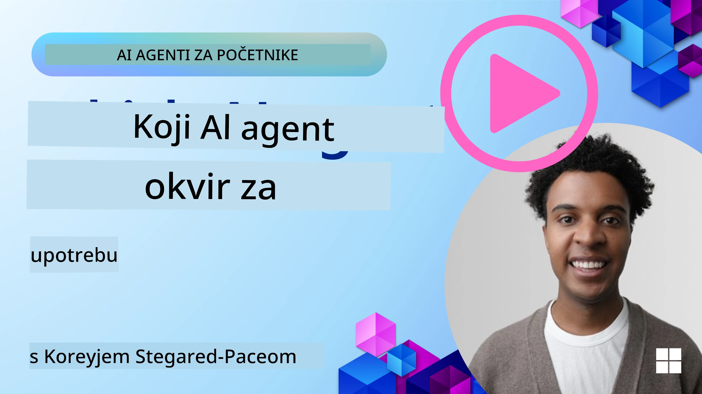

[](https://youtu.be/ODwF-EZo_O8?si=1xoy_B9RNQfrYdF7)

> _(Kliknite gornju sliku za prikaz videa ove lekcije)_

# Istražite AI Agent Okvire

AI agent okviri su softverske platforme dizajnirane kako bi pojednostavile stvaranje, implementaciju i upravljanje AI agentima. Ovi okviri pružaju programerima gotove komponente, apstrakcije i alate koji olakšavaju razvoj složenih AI sustava.

Ovi okviri pomažu programerima da se usredotoče na jedinstvene aspekte svojih aplikacija pružajući standardizirane pristupe uobičajenim izazovima u razvoju AI agenata. Oni poboljšavaju skalabilnost, dostupnost i učinkovitost u izgradnji AI sustava.

## Uvod

Ova lekcija će pokriti:

- Što su AI Agent Okviri i što programerima omogućuju postići?
- Kako timovi mogu koristiti ove okvire za brzo prototipiranje, iteraciju i poboljšanje sposobnosti svojih agenata?
- Koje su razlike između okvira i alata koje je kreirao Microsoft (<a href="https://aka.ms/ai-agents-beginners/ai-agent-service" target="_blank">Microsoft Foundry Agent Service</a> i <a href="https://learn.microsoft.com/azure/ai-services/openai/how-to/responses" target="_blank">Microsoft Agent Framework</a>)?
- Mogu li integrirati postojeće Azure alate izravno ili trebam samostalna rješenja?
- Što je Microsoft Foundry Agent Service i kako mi pomaže?

## Ciljevi učenja

Ciljevi ove lekcije su pomoći vam razumjeti:

- Ulogu AI Agent Okvira u razvoju AI-a.
- Kako iskoristiti AI Agent Okvire za izgradnju inteligentnih agenata.
- Ključne sposobnosti koje omogućuju AI Agent Okviri.
- Razlike između Microsoft Agent Frameworka i Microsoft Foundry Agent Service.

## Što su AI Agent Okviri i što programerima omogućuju raditi?

Tradicionalni AI Okviri mogu vam pomoći integrirati AI u vaše aplikacije i učiniti te aplikacije boljima na sljedeće načine:

- **Personalizacija**: AI može analizirati ponašanje i preference korisnika kako bi pružio personalizirane preporuke, sadržaj i iskustva.
Primjer: Streaming servisi poput Netflixa koriste AI za predlaganje filmova i emisija na temelju povijesti gledanja, povećavajući angažman i zadovoljstvo korisnika.
- **Automatizacija i učinkovitost**: AI može automatizirati repetitivne zadatke, pojednostaviti radne procese i poboljšati operativnu učinkovitost.
Primjer: Aplikacije za korisničku podršku koriste AI-pokretane chatbotove za rukovanje uobičajenim upitima, smanjujući vrijeme odgovora i oslobađajući ljudske agente za složenije probleme.
- **Poboljšano korisničko iskustvo**: AI može poboljšati ukupno korisničko iskustvo pružajući inteligentne značajke poput prepoznavanja glasa, obrade prirodnog jezika i prediktivnog teksta.
Primjer: Virtualni asistenti poput Siri i Google Assistanta koriste AI za razumijevanje i odgovaranje na glasovne naredbe, olakšavajući korisnicima interakciju s uređajima.

### Sve to zvuči sjajno, ali zašto nam treba AI Agent Okvir?

AI Agent okviri predstavljaju nešto više od običnih AI okvira. Dizajnirani su za omogućavanje stvaranja inteligentnih agenata koji mogu komunicirati s korisnicima, drugim agentima i okolinom kako bi postigli određene ciljeve. Ti agenti mogu pokazivati autonomno ponašanje, donositi odluke i prilagođavati se promjenjivim uvjetima. Pogledajmo neke ključne sposobnosti omogućene AI Agent Okvirima:

- **Suradnja i koordinacija agenata**: Omogućuju stvaranje više AI agenata koji mogu raditi zajedno, komunicirati i koordinirati se za rješavanje složenih zadataka.
- **Automatizacija i upravljanje zadacima**: Pružaju mehanizme za automatizaciju višestepenskih radnih procesa, delegiranje zadataka i dinamičko upravljanje zadacima među agentima.
- **Kontekstualno razumijevanje i prilagodba**: Opremaju agente sposobnošću razumijevanja konteksta, prilagođavanja promjenjivim okolinama i donošenja odluka na temelju informacija u stvarnom vremenu.

Ukratko, agenti vam omogućuju više, podižu automatizaciju na sljedeću razinu, stvaraju inteligentnije sustave koji se mogu prilagoditi i učiti iz svoje okoline.

## Kako brzo prototipirati, iterirati i poboljšati sposobnosti agenta?

Ovo je brzo promjenjivo područje, ali postoje neki zajednički elementi većine AI Agent Okvira koji vam pomažu brzo prototipirati i iterirati, naime modularne komponente, alat za suradnju i učenje u stvarnom vremenu. Pogledajmo to detaljnije:

- **Koristite Modularne Komponente**: AI SDK-ovi nude unaprijed izrađene komponente poput AI i memorijskih konektora, pozivanja funkcija koristeći prirodni jezik ili dodatke koda, predloške promptova i više.
- **Iskoristite Alate za Suradnju**: Dizajnirajte agente s određenim ulogama i zadacima, omogućujući im testiranje i usavršavanje suradničkih radnih procesa.
- **Učite u stvarnom vremenu**: Implementirajte povratne petlje gdje agenti uče iz interakcija i dinamički prilagođavaju svoje ponašanje.

### Koristite Modularne Komponente

SDK-ovi poput Microsoft Agent Frameworka nude unaprijed izrađene komponente kao što su AI konektori, definicije alata i upravljanje agentima.

**Kako timovi mogu koristiti ove**: Timovi brzo mogu sastaviti ove komponente za izradu funkcionalnog prototipa bez potrebe za započinjanjem od nule, što omogućuje brzo eksperimentiranje i iteraciju.

**Kako to funkcionira u praksi**: Možete koristiti unaprijed izrađeni parser za izvlačenje informacija iz korisničkog unosa, memorijski modul za pohranjivanje i dohvat podataka te generator promptova za interakciju s korisnicima, sve bez potrebe za izradom ovih komponenti od nule.

**Primjer koda**. Pogledajmo primjer kako koristiti Microsoft Agent Framework s `FoundryChatClient` za omogućavanje modelu da odgovara na korisnički unos pozivanjem alata:

``` python
# Microsoft Agent Framework Primjer u Pythonu

import asyncio
import os

from agent_framework import tool
from agent_framework.foundry import FoundryChatClient
from azure.identity import AzureCliCredential


# Definirajte primjer funkcije alata za rezervaciju putovanja
@tool(approval_mode="never_require")
def book_flight(date: str, location: str) -> str:
    """Book travel given location and date."""
    return f"Travel was booked to {location} on {date}"


async def main():
    provider = FoundryChatClient(
        project_endpoint=os.environ["AZURE_AI_PROJECT_ENDPOINT"],
        model=os.environ["AZURE_AI_MODEL_DEPLOYMENT_NAME"],
        credential=AzureCliCredential(),
    )
    agent = provider.as_agent(
        name="travel_agent",
        instructions="Help the user book travel. Use the book_flight tool when ready.",
        tools=[book_flight],
    )

    response = await agent.run("I'd like to go to New York on January 1, 2025")
    print(response)
    # Primjer izlaza: Vaš let za New York 1. siječnja 2025. uspješno je rezerviran. Sretan put! ✈️🗽


if __name__ == "__main__":
    asyncio.run(main())
```

Iz ovog primjera možete vidjeti kako iskoristiti unaprijed izrađeni parser za izvlačenje ključnih informacija iz korisničkog unosa, poput polazišta, odredišta i datuma zahtjeva za rezervaciju leta. Ovaj modularni pristup omogućava vam da se usredotočite na logiku visokog nivoa.

### Iskoristite Alate za Suradnju

Okviri poput Microsoft Agent Frameworka olakšavaju stvaranje više agenata koji mogu surađivati.

**Kako timovi mogu koristiti ove**: Timovi mogu dizajnirati agente s određenim ulogama i zadacima, omogućujući testiranje i usavršavanje suradničkih radnih procesa te poboljšanje ukupne učinkovitosti sustava.

**Kako to funkcionira u praksi**: Možete stvoriti tim agenata gdje svaki agent ima specijaliziranu funkciju, poput dohvata podataka, analize ili donošenja odluka. Ti agenti mogu komunicirati i dijeliti informacije kako bi ostvarili zajednički cilj, poput odgovaranja na korisnički upit ili dovršavanja zadatka.

**Primjer koda (Microsoft Agent Framework)**:

```python
# Kreiranje više agenata koji rade zajedno koristeći Microsoft Agent Framework

import os
from agent_framework.foundry import FoundryChatClient
from azure.identity import AzureCliCredential

provider = FoundryChatClient(
    project_endpoint=os.environ["AZURE_AI_PROJECT_ENDPOINT"],
    model=os.environ["AZURE_AI_MODEL_DEPLOYMENT_NAME"],
    credential=AzureCliCredential(),
)

# Agent za dohvaćanje podataka
agent_retrieve = provider.as_agent(
    name="dataretrieval",
    instructions="Retrieve relevant data using available tools.",
    tools=[retrieve_tool],
)

# Agent za analizu podataka
agent_analyze = provider.as_agent(
    name="dataanalysis",
    instructions="Analyze the retrieved data and provide insights.",
    tools=[analyze_tool],
)

# Pokreni agente redom za zadatak
retrieval_result = await agent_retrieve.run("Retrieve sales data for Q4")
analysis_result = await agent_analyze.run(f"Analyze this data: {retrieval_result}")
print(analysis_result)
```

U prethodnom kodu vidite kako se može stvoriti zadatak koji uključuje više agenata koji zajedno rade na analizi podataka. Svaki agent obavlja specifičnu funkciju, a zadatak se izvršava koordinacijom agenata kako bi se postigao željeni rezultat. Kreiranjem posvećenih agenata sa specijaliziranim ulogama možete poboljšati učinkovitost i izvedbu zadatka.

### Učite u stvarnom vremenu

Napredni okviri pružaju mogućnosti za razumijevanje konteksta i prilagodbu u stvarnom vremenu.

**Kako timovi mogu koristiti ove**: Timovi mogu implementirati povratne petlje u kojima agenti uče iz interakcija i dinamički prilagođavaju svoje ponašanje, što vodi do kontinuiranog poboljšanja i usavršavanja sposobnosti.

**Kako to funkcionira u praksi**: Agent može analizirati povratne informacije korisnika, podatke o okolišu i rezultate zadataka kako bi ažurirao svoju bazu znanja, prilagodio algoritme donošenja odluka i poboljšao izvedbu tijekom vremena. Ovaj iterativni proces učenja omogućava agentima da se prilagode promjenjivim uvjetima i preferencijama korisnika, povećavajući ukupnu učinkovitost sustava.

## Koje su razlike između Microsoft Agent Frameworka i Microsoft Foundry Agent Service?

Postoji mnogo načina za usporedbu ovih pristupa, ali pogledajmo neke ključne razlike u smislu dizajna, sposobnosti i ciljnih upotreba:

## Microsoft Agent Framework (MAF)

Microsoft Agent Framework pruža pojednostavljeni SDK za izgradnju AI agenata koristeći `FoundryChatClient`. Omogućava programerima stvaranje agenata koji koriste Azure OpenAI modele s ugrađenim pozivanjem alata, upravljanjem razgovorom i sigurnošću razine poduzeća putem Azure identiteta.

**Slučajevi uporabe**: Izgradnja AI agenata spremnih za produkciju s korištenjem alata, višestepenskim tijekovima rada i scenarijima integracije poduzeća.

Evo nekih važnih osnovnih koncepata Microsoft Agent Frameworka:

- **Agenti**. Agent se stvara putem `FoundryChatClient` i konfigurira s imenom, uputama i alatima. Agent može:
  - **Obrađivati korisničke poruke** i generirati odgovore koristeći Azure OpenAI modele.
  - **Automatski pozivati alate** na temelju konteksta razgovora.
  - **Održavati stanje razgovora** kroz više interakcija.

  Evo primjera koda koji pokazuje kako stvoriti agenta:

    ```python
    import os
    from agent_framework.foundry import FoundryChatClient
    from azure.identity import AzureCliCredential

    provider = FoundryChatClient(
        project_endpoint=os.environ["AZURE_AI_PROJECT_ENDPOINT"],
        model=os.environ["AZURE_AI_MODEL_DEPLOYMENT_NAME"],
        credential=AzureCliCredential(),
    )
    agent = provider.as_agent(
        name="my_agent",
        instructions="You are a helpful assistant.",
    )

    response = await agent.run("Hello, World!")
    print(response)
    ```

- **Alati**. Okvir podržava definiranje alata kao Python funkcija koje agent može automatski pozivati. Alati se registriraju prilikom stvaranja agenta:

    ```python
    def get_weather(location: str) -> str:
        """Get the current weather for a location."""
        return f"The weather in {location} is sunny, 72\u00b0F."

    agent = provider.as_agent(
        name="weather_agent",
        instructions="Help users check the weather.",
        tools=[get_weather],
    )
    ```

- **Koordinacija više agenata**. Možete stvoriti više agenata s različitim specijalizacijama i koordinirati njihov rad:

    ```python
    planner = provider.as_agent(
        name="planner",
        instructions="Break down complex tasks into steps.",
    )

    executor = provider.as_agent(
        name="executor",
        instructions="Execute the planned steps using available tools.",
        tools=[execute_tool],
    )

    plan = await planner.run("Plan a trip to Paris")
    result = await executor.run(f"Execute this plan: {plan}")
    ```

- **Integracija s Azure identitetom**. Okvir koristi `AzureCliCredential` (ili `DefaultAzureCredential`) za sigurnu, bezključnu autentikaciju, eliminirajući potrebu za upravljanjem API ključevima izravno.

## Microsoft Foundry Agent Service

Microsoft Foundry Agent Service je noviji dodatak, predstavljen na Microsoft Ignite 2024. Omogućuje razvoj i implementaciju AI agenata s fleksibilnijim modelima, poput izravnog pozivanja otvorenih LLM-ova kao što su Llama 3, Mistral i Cohere.

Microsoft Foundry Agent Service pruža snažnije mehanizme sigurnosti za poduzeća i metode pohrane podataka, što ga čini pogodnim za poduzetničke aplikacije.

Radi odmah u suradnji s Microsoft Agent Frameworkom za izradu i implementaciju agenata.

Ova usluga je trenutno u javnom pregledu i podržava Python i C# za izgradnju agenata.

Koristeći Microsoft Foundry Agent Service Python SDK, možemo stvoriti agenta s alatima koje definira korisnik:

```python
import asyncio
from azure.identity import DefaultAzureCredential
from azure.ai.projects import AIProjectClient

# Definirajte funkcije alata
def get_specials() -> str:
    """Provides a list of specials from the menu."""
    return """
    Special Soup: Clam Chowder
    Special Salad: Cobb Salad
    Special Drink: Chai Tea
    """

def get_item_price(menu_item: str) -> str:
    """Provides the price of the requested menu item."""
    return "$9.99"


async def main() -> None:
    credential = DefaultAzureCredential()
    project_client = AIProjectClient.from_connection_string(
        credential=credential,
        conn_str="your-connection-string",
    )

    agent = project_client.agents.create_agent(
        model="gpt-4o-mini",
        name="Host",
        instructions="Answer questions about the menu.",
        tools=[get_specials, get_item_price],
    )

    thread = project_client.agents.create_thread()

    user_inputs = [
        "Hello",
        "What is the special soup?",
        "How much does that cost?",
        "Thank you",
    ]

    for user_input in user_inputs:
        print(f"# User: '{user_input}'")
        message = project_client.agents.create_message(
            thread_id=thread.id,
            role="user",
            content=user_input,
        )
        run = project_client.agents.create_and_process_run(
            thread_id=thread.id, agent_id=agent.id
        )
        messages = project_client.agents.list_messages(thread_id=thread.id)
        print(f"# Agent: {messages.data[0].content[0].text.value}")


if __name__ == "__main__":
    asyncio.run(main())
```

### Osnovni koncepti

Microsoft Foundry Agent Service ima sljedeće osnovne koncepte:

- **Agent**. Microsoft Foundry Agent Service integrira se s Microsoft Foundryjem. Unutar Microsoft Foundryja, AI Agent djeluje kao "pametna" mikrousloga koja se može koristiti za odgovaranje na pitanja (RAG), izvođenje radnji ili potpuno automatiziranje tijekova rada. To postiže kombiniranjem moći generativnih AI modela s alatima koji mu omogućuju pristup i interakciju s izvorima podataka iz stvarnog svijeta. Evo primjera agenta:

    ```python
    agent = project_client.agents.create_agent(
        model="gpt-4o-mini",
        name="my-agent",
        instructions="You are helpful agent",
        tools=code_interpreter.definitions,
        tool_resources=code_interpreter.resources,
    )
    ```

    U ovom primjeru, agent je kreiran s modelom `gpt-4o-mini`, imenom `my-agent` i uputama `You are helpful agent`. Agent je opremljen alatima i resursima za obavljanje zadataka interpretacije koda.

- **Tema i poruke**. Tema je još jedan važan koncept. Predstavlja razgovor ili interakciju između agenta i korisnika. Temama se može pratiti tijek razgovora, pohranjivati informacije o kontekstu i upravljati stanjem interakcije. Evo primjera teme:

    ```python
    thread = project_client.agents.create_thread()
    message = project_client.agents.create_message(
        thread_id=thread.id,
        role="user",
        content="Could you please create a bar chart for the operating profit using the following data and provide the file to me? Company A: $1.2 million, Company B: $2.5 million, Company C: $3.0 million, Company D: $1.8 million",
    )
    
    # Zamolite agenta da izvrši rad na niti
    run = project_client.agents.create_and_process_run(thread_id=thread.id, agent_id=agent.id)
    
    # Dohvatite i zabilježite sve poruke kako biste vidjeli odgovor agenta
    messages = project_client.agents.list_messages(thread_id=thread.id)
    print(f"Messages: {messages}")
    ```

    U prethodnom kodu kreirana je tema. Nakon toga se šalje poruka temi. Pozivom `create_and_process_run`, agentu se traži da obavi rad na temi. Na kraju se dohvaćaju poruke i bilježe da bi se vidio odgovor agenta. Poruke upućuju na tijek razgovora između korisnika i agenta. Također je važno razumjeti da poruke mogu biti različitih tipova kao što su tekst, slika ili datoteka, što znači da je rad agenata rezultirao, na primjer, slikom ili tekstualnim odgovorom. Kao programer, zatim možete koristiti ove informacije za daljnju obradu odgovora ili njegovo prikazivanje korisniku.

- **Integracija s Microsoft Agent Frameworkom**. Microsoft Foundry Agent Service radi besprijekorno s Microsoft Agent Frameworkom, što znači da možete graditi agente koristeći `FoundryChatClient` i implementirati ih kroz Agent Service za produkcijske scenarije.

**Slučajevi uporabe**: Microsoft Foundry Agent Service je dizajniran za poduzetničke aplikacije koje zahtijevaju sigurnu, skalabilnu i fleksibilnu implementaciju AI agenata.

## Koja je razlika između ovih pristupa?
 
Čini se da postoji preklapanje, ali postoji nekoliko ključnih razlika u dizajnu, sposobnostima i ciljanim slučajevima uporabe:
 
- **Microsoft Agent Framework (MAF)**: Je SDK spreman za produkciju za stvaranje AI agenata. Pruža pojednostavljeni API za kreiranje agenata s pozivanjem alata, upravljanjem razgovorima i integracijom Azure identiteta.
- **Microsoft Foundry Agent Service**: Je platforma i servis implementacije u Microsoft Foundryju za agente. Nudi ugrađenu povezanost s uslugama poput Azure OpenAI, Azure AI Search, Bing Pretraživanja i izvršenja koda.
 
Još ste neodlučni koji odabrati?

### Slučajevi uporabe
 
Pogledajmo možemo li vam pomoći kroz neke uobičajene slučajeve uporabe:
 
> P: Izrađujem produkcijske AI agent aplikacije i želim brzo započeti
>

> O: Microsoft Agent Framework je izvrstan izbor. Pruža jednostavan, Pythonik API putem `FoundryChatClient` koji vam omogućuje definiranje agenata s alatima i uputama u samo nekoliko redaka koda.

> P: Trebam implementaciju razine poduzeća s integracijama Azure poput Pretraživanja i izvršenja koda
>
> O: Microsoft Foundry Agent Service je najbolje rješenje. To je platforma koja pruža ugrađene mogućnosti za više modela, Azure AI Search, Bing Search i Azure Functions. Omogućuje vam jednostavno izgradnju agenata u Foundry Portalu i implementaciju u velikom opsegu.
 
> P: Još sam zbunjen, dajte mi samo jednu opciju
>
> O: Započnite s Microsoft Agent Frameworkom za razvoj agenata, a zatim koristite Microsoft Foundry Agent Service kada trebate implementirati i skalirati agente u produkciji. Ovaj pristup vam omogućuje brzo iteriranje logike vašeg agenta dok imate jasan put za poduzećnu implementaciju.
 
Sažmimo ključne razlike u tablici:

| Okvir | Fokus | Osnovni koncepti | Slučajevi uporabe |
| --- | --- | --- | --- |
| Microsoft Agent Framework | Pojednostavljeni SDK za agente s pozivanjem alata | Agenti, Alati, Azure identitet | Izgradnja AI agenata, korištenje alata, višestepenski radni procesi |
| Microsoft Foundry Agent Service | Fleksibilni modeli, sigurnost poduzeća, generiranje koda, pozivanje alata | Modularnost, Suradnja, Orkestracija procesa | Sigurna, skalabilna i fleksibilna implementacija AI agenata |

## Mogu li integrirati svoje postojeće Azure alate izravno ili mi trebaju samostalna rješenja?


Odgovor je da, možete integrirati svoje postojeće Azure ekosistemske alate izravno s Microsoft Foundry Agent Service, jer je posebno izgrađen da besprijekorno radi s drugim Azure uslugama. Na primjer, mogli biste integrirati Bing, Azure AI Search i Azure Functions. Također postoji duboka integracija s Microsoft Foundry.

Microsoft Agent Framework također se integrira s Azure uslugama putem `FoundryChatClient` i Azure identiteta, što vam omogućuje da izravno pozivate Azure usluge iz svojih alata za agente.

## Primjeri koda

- Python: [Agent Framework (Microsoft Foundry)](./code_samples/02-python-agent-framework.ipynb)
- Python: [Agent Framework (Azure OpenAI Responses API)](./code_samples/02-python-agent-framework-azure-openai.ipynb)
- .NET: [Agent Framework](./code_samples/02-dotnet-agent-framework.md)

## Imate li još pitanja o AI Agent Frameworks?

Pridružite se [Microsoft Foundry Discord](https://discord.com/invite/ATgtXmAS5D) kako biste se susreli s drugim učenicima, sudjelovali na radnim satima i dobili odgovore na svoja pitanja o AI agentima.

## Reference

- <a href="https://techcommunity.microsoft.com/blog/azure-ai-services-blog/introducing-azure-ai-agent-service/4298357" target="_blank">Azure Agent Service</a>
- <a href="https://learn.microsoft.com/azure/ai-services/openai/how-to/responses" target="_blank">Microsoft Agent Framework - Azure OpenAI Responses</a>
- <a href="https://learn.microsoft.com/azure/ai-services/agents/overview" target="_blank">Microsoft Foundry Agent Service</a>

## Prethodna lekcija

[Uvod u AI agente i primjene agenata](../01-intro-to-ai-agents/README.md)

## Sljedeća lekcija

[Razumijevanje agentnih dizajnerskih obrazaca](../03-agentic-design-patterns/README.md)

---

<!-- CO-OP TRANSLATOR DISCLAIMER START -->
**Napomena**:
Ovaj dokument je preveden korištenjem AI prevoditeljskog servisa [Co-op Translator](https://github.com/Azure/co-op-translator). Iako težimo točnosti, imajte na umu da automatski prijevodi mogu sadržavati greške ili netočnosti. Izvorni dokument na izvornom jeziku treba smatrati autoritativnim izvorom. Za važne informacije preporuča se profesionalni ljudski prijevod. Nismo odgovorni za bilo kakva nesporazumevanja ili pogrešne interpretacije koje proizlaze iz korištenja ovog prijevoda.
<!-- CO-OP TRANSLATOR DISCLAIMER END -->