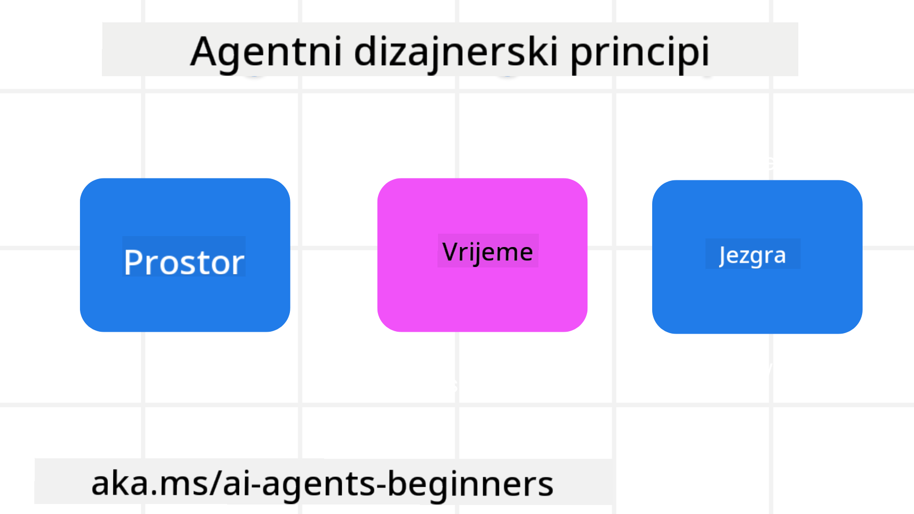

<!--
CO_OP_TRANSLATOR_METADATA:
{
  "original_hash": "4c46e4ff9e349c521e2b0b17f51afa64",
  "translation_date": "2025-08-30T09:11:24+00:00",
  "source_file": "03-agentic-design-patterns/README.md",
  "language_code": "hr"
}
-->

> _(Kliknite na sliku iznad za pregled videa ove lekcije)_
# Načela dizajna agentičkih AI sustava

## Uvod

Postoji mnogo načina za razmišljanje o izgradnji agentičkih AI sustava. S obzirom na to da je dvosmislenost značajka, a ne greška u dizajnu generativne umjetne inteligencije, inženjerima je ponekad teško odrediti odakle uopće početi. Stvorili smo skup načela dizajna korisničkog iskustva usmjerenih na ljude kako bismo omogućili programerima da izgrade sustave usmjerene na korisnike i riješe svoje poslovne potrebe. Ova načela dizajna nisu propisana arhitektura, već početna točka za timove koji definiraju i razvijaju iskustva s agentima.

Općenito, agenti bi trebali:

- Proširiti i skalirati ljudske sposobnosti (brainstorming, rješavanje problema, automatizacija itd.)
- Popuniti praznine u znanju (upoznavanje s novim područjima znanja, prijevod itd.)
- Omogućiti i podržati suradnju na način na koji pojedinci preferiraju raditi s drugima
- Pomoći nam da postanemo bolje verzije sebe (npr. životni trener/organizator zadataka, pomoć u učenju emocionalne regulacije i vještina svjesnosti, izgradnja otpornosti itd.)

## Ova lekcija će obuhvatiti

- Što su načela dizajna agentičkih sustava
- Koje smjernice treba slijediti prilikom implementacije ovih načela dizajna
- Primjere primjene načela dizajna

## Ciljevi učenja

Nakon završetka ove lekcije, moći ćete:

1. Objasniti što su načela dizajna agentičkih sustava
2. Objasniti smjernice za korištenje načela dizajna agentičkih sustava
3. Razumjeti kako izgraditi agenta koristeći načela dizajna agentičkih sustava

## Načela dizajna agentičkih sustava

### Agent (Prostor)

Ovo je okruženje u kojem agent djeluje. Ova načela informiraju kako dizajniramo agente za angažman u fizičkim i digitalnim svjetovima.

- **Povezivanje, a ne razdvajanje** – pomažu povezivanju ljudi s drugim ljudima, događajima i korisnim znanjem kako bi omogućili suradnju i povezivanje.
  - Agenti pomažu povezivanju događaja, znanja i ljudi.
  - Agenti zbližavaju ljude. Nisu dizajnirani da zamijene ili umanje ljude.
- **Lako dostupni, ali povremeno nevidljivi** – agent uglavnom djeluje u pozadini i javlja se samo kada je to relevantno i prikladno.
  - Agent je lako dostupan i otkriven za ovlaštene korisnike na bilo kojem uređaju ili platformi.
  - Agent podržava multimodalne ulaze i izlaze (zvuk, glas, tekst itd.).
  - Agent može neprimjetno prelaziti između prednjeg i pozadinskog plana; između proaktivnog i reaktivnog, ovisno o potrebama korisnika.
  - Agent može djelovati u nevidljivom obliku, ali je njegov proces u pozadini i suradnja s drugim agentima transparentna i pod kontrolom korisnika.

### Agent (Vrijeme)

Ovo je način na koji agent djeluje tijekom vremena. Ova načela informiraju kako dizajniramo agente koji djeluju kroz prošlost, sadašnjost i budućnost.

- **Prošlost**: Refleksija na povijest koja uključuje i stanje i kontekst.
  - Agent pruža relevantnije rezultate na temelju analize bogatijih povijesnih podataka, a ne samo događaja, ljudi ili stanja.
  - Agent stvara poveznice iz prošlih događaja i aktivno reflektira na memoriju kako bi se angažirao u trenutnim situacijama.
- **Sadašnjost**: Poticaj umjesto obavijesti.
  - Agent utjelovljuje sveobuhvatan pristup interakciji s ljudima. Kada se dogodi neki događaj, agent ide dalje od statičnih obavijesti ili drugih formalnosti. Agent može pojednostaviti procese ili dinamički generirati upute kako bi usmjerio pažnju korisnika u pravom trenutku.
  - Agent isporučuje informacije na temelju kontekstualnog okruženja, društvenih i kulturnih promjena te prilagođene korisničkoj namjeri.
  - Interakcija s agentom može biti postupna, razvijajući se i rastući u složenosti kako bi osnažila korisnike na duži rok.
- **Budućnost**: Prilagodba i evolucija.
  - Agent se prilagođava različitim uređajima, platformama i modalitetima.
  - Agent se prilagođava ponašanju korisnika, potrebama pristupačnosti i slobodno je prilagodljiv.
  - Agent se oblikuje i evoluira kroz kontinuiranu interakciju s korisnicima.

### Agent (Jezgra)

Ovo su ključni elementi u jezgri dizajna agenta.

- **Prihvaćanje nesigurnosti, ali uspostavljanje povjerenja**.
  - Određena razina nesigurnosti agenta je očekivana. Nesigurnost je ključni element dizajna agenta.
  - Povjerenje i transparentnost su temeljni slojevi dizajna agenta.
  - Ljudi imaju kontrolu nad time kada je agent uključen/isključen, a status agenta je uvijek jasno vidljiv.

## Smjernice za implementaciju ovih načela

Kada koristite prethodna načela dizajna, koristite sljedeće smjernice:

1. **Transparentnost**: Informirajte korisnika da je AI uključen, kako funkcionira (uključujući prošle radnje) i kako dati povratne informacije i modificirati sustav.
2. **Kontrola**: Omogućite korisniku da prilagodi, specificira preferencije i personalizira, te ima kontrolu nad sustavom i njegovim atributima (uključujući mogućnost zaboravljanja).
3. **Dosljednost**: Ciljajte na dosljedna, multimodalna iskustva na svim uređajima i krajnjim točkama. Koristite poznate UI/UX elemente gdje je to moguće (npr. ikona mikrofona za glasovnu interakciju) i smanjite kognitivno opterećenje korisnika koliko god je to moguće (npr. ciljajte na sažete odgovore, vizualne pomoći i sadržaj "Saznajte više").

## Kako dizajnirati putničkog agenta koristeći ova načela i smjernice

Zamislite da dizajnirate putničkog agenta, evo kako biste mogli razmišljati o korištenju načela dizajna i smjernica:

1. **Transparentnost** – Obavijestite korisnika da je putnički agent AI-enabled agent. Pružite osnovne upute za početak (npr. poruka "Pozdrav", primjeri upita). Jasno to dokumentirajte na stranici proizvoda. Prikažite popis upita koje je korisnik postavio u prošlosti. Jasno naznačite kako dati povratne informacije (palac gore i dolje, gumb "Pošalji povratne informacije" itd.). Jasno artikulirajte ima li agent ograničenja u korištenju ili temama.
2. **Kontrola** – Osigurajte da je jasno kako korisnik može modificirati agenta nakon što je stvoren, s opcijama poput System Prompt-a. Omogućite korisniku da odabere koliko će agent biti opširan, njegov stil pisanja i eventualne teme o kojima agent ne bi trebao govoriti. Dopustite korisniku da pregleda i izbriše sve povezane datoteke ili podatke, upite i prošle razgovore.
3. **Dosljednost** – Osigurajte da su ikone za dijeljenje upita, dodavanje datoteke ili fotografije te označavanje nekoga ili nečega standardne i prepoznatljive. Koristite ikonu spajalice za označavanje prijenosa/dijeljenja datoteka s agentom i ikonu slike za označavanje prijenosa grafike.

### Imate li dodatnih pitanja o obrascima dizajna agentičkih AI sustava?

Pridružite se [Azure AI Foundry Discord](https://aka.ms/ai-agents/discord) kako biste se povezali s drugim učenicima, sudjelovali na konzultacijama i dobili odgovore na svoja pitanja o AI agentima.

## Dodatni resursi

## Prethodna lekcija

[Istrazivanje agentičkih okvira](../02-explore-agentic-frameworks/README.md)

## Sljedeća lekcija

[Obrazac dizajna za korištenje alata](../04-tool-use/README.md)

---

**Odricanje od odgovornosti**:  
Ovaj dokument je preveden pomoću AI usluge za prevođenje [Co-op Translator](https://github.com/Azure/co-op-translator). Iako nastojimo osigurati točnost, imajte na umu da automatski prijevodi mogu sadržavati pogreške ili netočnosti. Izvorni dokument na izvornom jeziku treba smatrati autoritativnim izvorom. Za ključne informacije preporučuje se profesionalni prijevod od strane ljudskog prevoditelja. Ne preuzimamo odgovornost za bilo kakve nesporazume ili pogrešne interpretacije koje proizlaze iz korištenja ovog prijevoda.