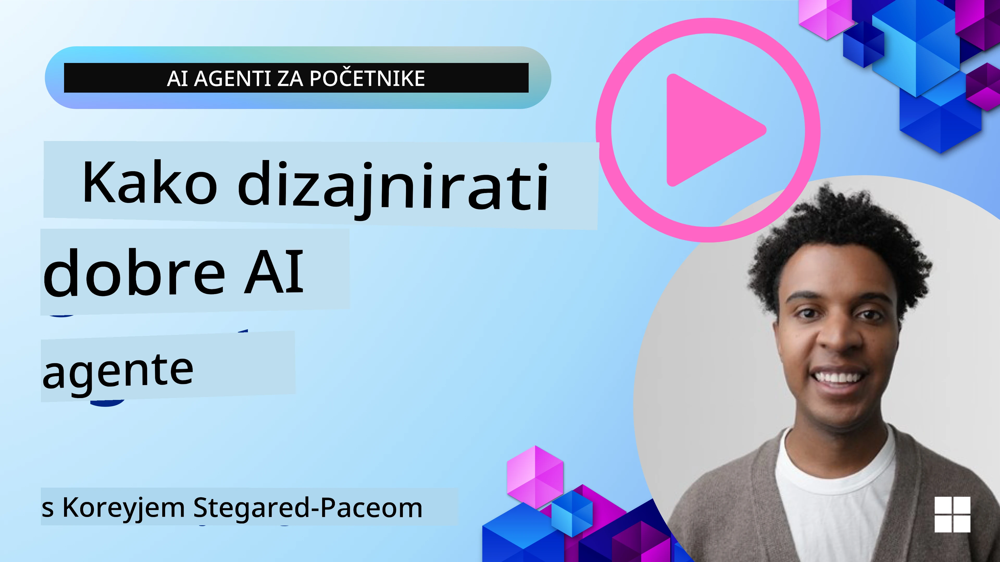
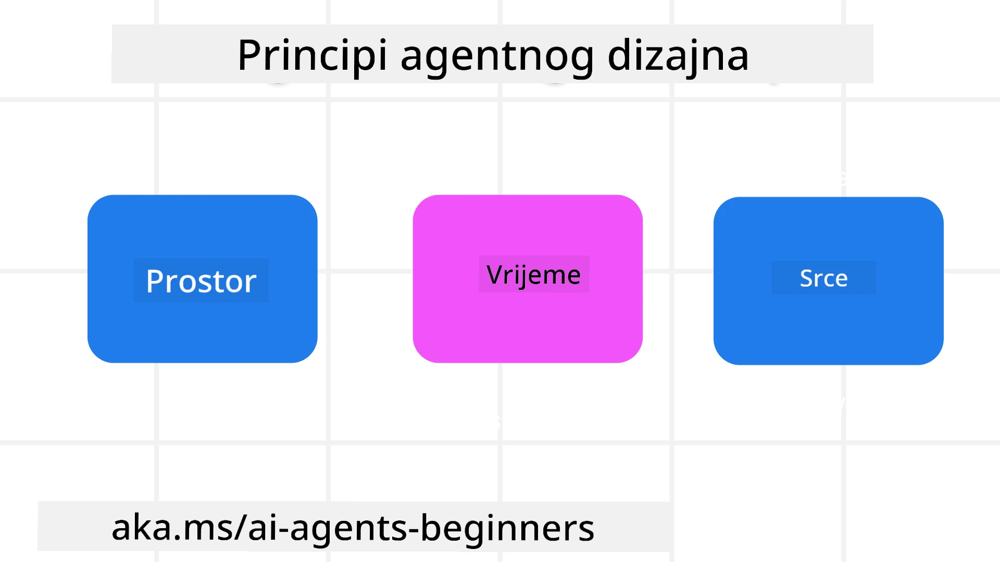

> _(Kliknite na sliku gore za pregled videa ovog poglavlja)_
# Principi dizajna AI agenata

## Uvod

Postoji mnogo načina za razmišljanje o izgradnji AI Agenskih Sustava. S obzirom na to da je dvosmislenost značajka, a ne propust u dizajnu Generativne AI, inženjerima je ponekad teško odrediti odakle uopće započeti. Kreirali smo skup korisnički orijentiranih UX principa dizajna kako bismo omogućili programerima da izgrade sustave usmjerene na korisnika koji zadovoljavaju njihove poslovne potrebe. Ovi principi dizajna nisu propisna arhitektura, već polazna točka za timove koji definiraju i razvijaju iskustva agenata.

Općenito, agenti bi trebali:

- Proširiti i povećati ljudske kapacitete (razmišljanje, rješavanje problema, automatizacija itd.)
- Ispuniti praznine u znanju (brzo me upoznati s područjima znanja, prevođenje itd.)
- Olakšati i podržavati suradnju na načine na koje mi kao pojedinci preferiramo raditi s drugima
- Učiniti nas boljim verzijama nas samih (npr. životni trener/zadatkovni mojster, pomažući nam učiti vještine emocionalne regulacije i mindfulnessa, graditi otpornost itd.)

## Ovo poglavlje će obuhvatiti

- Što su principi dizajna agenata
- Koje smjernice slijediti prilikom implementacije ovih principa dizajna
- Neke primjere primjene principa dizajna

## Ciljevi učenja

Nakon završetka ovog poglavlja, moći ćete:

1. Objasniti što su principi dizajna agenata
2. Objasniti smjernice za korištenje principa dizajna agenata
3. Razumjeti kako izgraditi agenta koristeći principe dizajna agenata

## Principi dizajna agenata

### Agent (Prostor)

Ovo je okruženje u kojem agent djeluje. Ovi principi usmjeravaju kako dizajniramo agente za angažman u fizičkim i digitalnim svjetovima.

- **Povezivanje, ne urušavanje** – pomaže povezati ljude s drugim ljudima, događajima i korisnim znanjem za omogućavanje suradnje i povezanosti.
- Agenti pomažu povezati događaje, znanje i ljude.
- Agenti približavaju ljude. Nisu dizajnirani da zamijene ili umanje ljude.
- **Jednostavno dostupni, ali ponekad nevidljivi** – agent uglavnom djeluje u pozadini i samo nas potiče kada je relevantno i prikladno.
  - Agent je lako otkriven i dostupan ovlaštenim korisnicima na bilo kojem uređaju ili platformi.
  - Agent podržava višemodalne ulaze i izlaze (zvuk, glas, tekst itd.).
  - Agent se može neprimjetno prebacivati između prvog i drugog plana; između proaktivnog i reaktivnog pristupa, ovisno o procjeni potreba korisnika.
  - Agent može djelovati u nevidljivom obliku, ali njegov proces u pozadini i suradnja s drugim agentima su transparentni i podložni kontroli korisnika.

### Agent (Vrijeme)

Ovo opisuje kako agent djeluje tijekom vremena. Ovi principi usmjeravaju kako dizajniramo agente koji komuniciraju preko prošlosti, sadašnjosti i budućnosti.

- **Prošlost**: Promišljanje o povijesti koja uključuje stanje i kontekst.
  - Agent pruža relevantnije rezultate temeljem analize bogatijih povijesnih podataka, ne samo događaja, ljudi ili stanja.
  - Agent stvara veze iz prošlih događaja i aktivno se oslanja na sjećanje za angažman u trenutnim situacijama.
- **Sadašnjost**: Poticanje više nego obavještavanje.
  - Agent utjelovljuje sveobuhvatan pristup interakciji s ljudima. Kad se dogodi događaj, agent nadilazi statičnu obavijest ili drugu statičnu formalnost. Agent može pojednostaviti tokove ili dinamički generirati pokazivače za usmjeravanje pažnje korisnika u pravo vrijeme.
  - Agent isporučuje informacije temeljene na kontekstualnom okruženju, društvenim i kulturnim promjenama te prilagođene korisničkoj namjeri.
  - Interakcija s agentom može biti postupna, koja se razvija/raste u složenosti kako bi dugoročno osnažila korisnike.
- **Budućnost**: Prilagodba i evolucija.
  - Agent se prilagođava različitim uređajima, platformama i modalitetima.
  - Agent se prilagođava korisničkom ponašanju, potrebama pristupačnosti i slobodno je prilagodljiv.
  - Agent je oblikovan i razvija se kroz kontinuiranu interakciju s korisnikom.

### Agent (Srž)

Ovo su ključni elementi u srži dizajna agenta.

- **Prihvatiti nesigurnost, ali uspostaviti povjerenje**.
  - Očekuje se određen stupanj nesigurnosti agenta. Nesigurnost je ključni element dizajna agenta.
  - Povjerenje i transparentnost su temeljni slojevi dizajna agenta.
  - Ljudi kontroliraju kad je agent uključen/isključen, a status agenta je jasno vidljiv u svakom trenutku.

## Smjernice za implementaciju ovih principa

Kada koristite prethodne principe dizajna, slijedite sljedeće smjernice:

1. **Transparentnost**: Obavijestite korisnika da je AI uključen, kako funkcionira (uključujući prošle akcije) i kako dati povratne informacije i mijenjati sustav.
2. **Kontrola**: Omogućite korisniku prilagodbu, definiranje preferencija i personalizaciju, uz kontrolu nad sustavom i njegovim atributima (uključujući mogućnost brisanja podataka).
3. **Dosljednost**: Ciljajte na dosljedna, višemodalna iskustva na različitim uređajima i točkama dodira. Koristite poznate UI/UX elemente gdje je moguće (npr. ikona mikrofona za glasovnu interakciju) i smanjite kognitivno opterećenje korisnika koliko je moguće (npr. ciljate na sažete odgovore, vizualne pomagala i sadržaj „Saznajte više“).

## Kako dizajnirati putničkog agenta koristeći ove principe i smjernice

Zamislite da dizajnirate putničkog agenta, ovako biste mogli razmišljati o korištenju principa i smjernica dizajna:

1. **Transparentnost** – Obavijestite korisnika da je Putnički agent AI omogućen agent. Pružite osnovne upute za početak (npr. poruka „Pozdrav“, primjeri upita). Jasno dokumentirajte ovo na stranici proizvoda. Prikažite popis upita koje je korisnik postavio ranije. Jasno objasnite kako dati povratne informacije (palac gore/dolje, gumb Pošalji povratnu informaciju itd.). Jasno iznesite ima li agent ograničenja u korištenju ili temama.
2. **Kontrola** – Osigurajte da je jasno kako korisnik može mijenjati agenta nakon što je stvoren, primjerice putem Sistemskog upita. Omogućite korisniku da odabere koliko detaljan agent treba biti, njegov stil pisanja i eventualne napomene o temama o kojima agent ne bi smio razgovarati. Dopustite korisniku pregled i brisanje povezanih datoteka ili podataka, upita i prethodnih razgovora.
3. **Dosljednost** – Pobrinite se da su ikone za Dijeljenje upita, dodavanje datoteke ili fotografije i označavanje nekoga ili nečega standardne i prepoznatljive. Koristite ikonu spajalice za označavanje prijenosa/dijeljenja datoteka s agentom, a ikonu slike za prijenos grafika.

## Primjeri koda

- Python: [Agent Framework](./code_samples/03-python-agent-framework.ipynb)
- .NET: [Agent Framework](./code_samples/03-dotnet-agent-framework.md)

## Imate dodatna pitanja o AI agentnim obrascima dizajna?

Pridružite se [Microsoft Foundry Discord](https://discord.com/invite/ATgtXmAS5D) kako biste se susreli s drugim učenicima, sudjelovali na radnim satima i dobili odgovore na svoja pitanja o AI agentima.

## Dodatni resursi

- <a href="https://openai.com" target="_blank">Prakse za upravljanje agentnim AI sustavima | OpenAI</a>
- <a href="https://microsoft.com" target="_blank">The HAX Toolkit Project - Microsoft Research</a>
- <a href="https://responsibleaitoolbox.ai" target="_blank">Responsible AI Toolbox</a>

## Prethodno poglavlje

[Istraživanje agentnih okvira](../02-explore-agentic-frameworks/README.md)

## Sljedeće poglavlje

[Obrazac dizajna korištenja alata](../04-tool-use/README.md)

---

<!-- CO-OP TRANSLATOR DISCLAIMER START -->
**Napomena**:
Ovaj dokument je preveden korištenjem AI prevoditeljskog servisa [Co-op Translator](https://github.com/Azure/co-op-translator). Iako težimo točnosti, imajte na umu da automatski prijevodi mogu sadržavati greške ili netočnosti. Izvorni dokument na izvornom jeziku treba smatrati autoritativnim izvorom. Za važne informacije preporuča se profesionalni ljudski prijevod. Nismo odgovorni za bilo kakva nesporazumevanja ili pogrešne interpretacije koje proizlaze iz korištenja ovog prijevoda.
<!-- CO-OP TRANSLATOR DISCLAIMER END -->