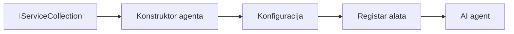

# 🎨 Agentni dizajnerski obrasci s Azure OpenAI (Responses API) (.NET)

## 📋 Ciljevi učenja

Ovaj primjer prikazuje dizajnerske obrasce na razini poduzeća za izgradnju inteligentnih agenata koristeći Microsoft Agent Framework u .NET-u s integracijom Azure OpenAI (Responses API). Naučit ćete profesionalne obrasce i arhitektonske pristupe koji agente čine spremnima za proizvodnju, održivima i skalabilnima.

### Dizajnerski obrasci za poduzeća

- 🏭 **Factory Pattern**: Standardizirana izrada agenata s ubrizgavanjem ovisnosti
- 🔧 **Builder Pattern**: Fluent konfiguracija i postavljanje agenata
- 🧵 **Thread-Safe Patterns**: Upravljanje istovremenim razgovorima
- 📋 **Repository Pattern**: Organizirano upravljanje alatima i sposobnostima

## 🎯 Specifične arhitektonske prednosti za .NET

### Značajke za poduzeća

- **Jaka tipizacija**: Validacija u vrijeme kompajliranja i IntelliSense podrška
- **Ubrizgavanje ovisnosti**: Integracija ugrađenog DI kontejnera
- **Upravljanje konfiguracijom**: IConfiguration i obrasci Options
- **Async/Await**: Podrška za asinhrono programiranje prvoklasne

### Obrasci spremni za proizvodnju

- **Integracija zapisivanja**: ILogger i podrška za strukturirano zapisivanje
- **Provjere zdravlja**: Ugrađeni nadzor i dijagnostika
- **Validacija konfiguracije**: Jaka tipizacija s podacima objašnjenja
- **Upravljanje pogreškama**: Strukturirano upravljanje iznimkama

## 🔧 Tehnička arhitektura

### Osnovne .NET komponente

- **Microsoft.Extensions.AI**: Jedinstvene apstrakcije AI usluga
- **Microsoft.Agents.AI**: Okvir za orkestraciju agenata na razini poduzeća
- **Azure OpenAI (Responses API)**: Obrasci API klijenta visokih performansi
- **Sustav konfiguracije**: appsettings.json i integracija okoline

### Implementacija dizajnerskih obrazaca



## 🏗️ Demonstrirani obrasci za poduzeća

### 1. **Kreacijski obrasci**

- **Agent Factory**: Centralizirana izrada agenata s dosljednom konfiguracijom
- **Builder Pattern**: Fluent API za složenu konfiguraciju agenata
- **Singleton Pattern**: Dijeljeni resursi i upravljanje konfiguracijom
- **Ubrizgavanje ovisnosti**: Slaba povezanost i testabilnost

### 2. **Obrasci ponašanja**

- **Strategy Pattern**: Zamjenjive strategije izvršavanja alata
- **Command Pattern**: Inkapsulirane operacije agenata s poništavanjem/ponovnim izvršavanjem
- **Observer Pattern**: Upravljanje životnim ciklusom agenata vođeno događajima
- **Template Method**: Standardizirani tokovi izvršavanja agenata

### 3. **Strukturni obrasci**

- **Adapter Pattern**: Integracijski sloj Azure OpenAI (Responses API)
- **Decorator Pattern**: Poboljšanje sposobnosti agenata
- **Facade Pattern**: Pojednostavljeni sučelji za interakciju s agentima
- **Proxy Pattern**: Lijeno učitavanje i predmemoriranje za bolje performanse

## 📚 Principi dizajna za .NET

### SOLID principi

- **Pojedinačna odgovornost**: Svaka komponenta ima jednu jasnu svrhu
- **Otvoreno/Zatvoreno**: Proširivo bez izmjena
- **Liskov zamjena**: Implementacije alata temeljene na sučelju
- **Segregacija sučelja**: Fokusirani, kohezivni interfejsi
- **Inverzija ovisnosti**: Ovisnost o apstrakcijama, ne o konkretima

### Čista arhitektura

- **Domain Layer**: Osnovne apstrakcije agenata i alata
- **Application Layer**: Orkestracija agenata i tokovi rada
- **Infrastructure Layer**: Integracija Azure OpenAI (Responses API) i vanjskih usluga
- **Presentation Layer**: Interakcija korisnika i oblikovanje odgovora

## 🔒 Razmatranja za poduzeća

### Sigurnost

- **Upravljanje vjerodajnicama**: Sigurno upravljanje API ključevima s IConfiguration
- **Validacija unosa**: Jaka tipizacija i validacija podataka s bilješkama
- **Sanitizacija izlaza**: Sigurna obrada i filtriranje odgovora
- **Evidencija revizije**: Sveobuhvatno praćenje operacija

### Performanse

- **Async obrasci**: Operacije I/O bez blokiranja
- **Pooling veza**: Učinkovito upravljanje HTTP klijentima
- **Predmemoriranje**: Predmemoriranje odgovora za poboljšane performanse
- **Upravljanje resursima**: Pravilno odlaganje i obrasci čišćenja

### Skalabilnost

- **Sigurnost niti**: Podrška za istovremeno izvršavanje agenata
- **Pooling resursa**: Učinkovita iskorištenost resursa
- **Upravljanje opterećenjem**: Ograničavanje brzine i rukovanje pritiskom
- **Nadzor**: Metrike performansi i provjere zdravlja

## 🚀 Proizvodno postavljanje

- **Upravljanje konfiguracijom**: Postavke specifične za okruženje
- **Strategija zapisivanja**: Strukturirano zapisivanje s korelacijskim ID-jevima
- **Upravljanje pogreškama**: Globalno upravljanje iznimkama s pravilnim oporavkom
- **Nadzor**: Application Insights i brojila performansi
- **Testiranje**: Jedinični testovi, integracijski testovi i obrasci testiranja opterećenja

Spremni za izgradnju inteligentnih agenata na razini poduzeća s .NET-om? Dizajnirajmo nešto robusno! 🏢✨

## 🚀 Početak rada

### Preduvjeti

- [.NET 10 SDK](https://dotnet.microsoft.com/download/dotnet/10.0) ili noviji
- Pretplata na [Azure](https://azure.microsoft.com/free/) s Azure OpenAI resursom i implementacijom modela
- [Azure CLI](https://learn.microsoft.com/cli/azure/install-azure-cli) — prijavite se s `az login`

### Potrebne varijable okoline

```bash
# zsh/bash
export AZURE_OPENAI_ENDPOINT=https://<your-resource>.openai.azure.com
export AZURE_OPENAI_DEPLOYMENT=gpt-4o-mini
# Zatim se prijavite da AzureCliCredential može dobiti token
az login
```

```powershell
# PowerShell
$env:AZURE_OPENAI_ENDPOINT = "https://<your-resource>.openai.azure.com"
$env:AZURE_OPENAI_DEPLOYMENT = "gpt-4o-mini"
# Zatim se prijavite kako bi AzureCliCredential mogao dobiti token
az login
```

### Primjer koda

Za pokretanje primjera koda,

```bash
# zsh/bash
chmod +x ./03-dotnet-agent-framework.cs
./03-dotnet-agent-framework.cs
```

Ili koristeći dotnet CLI:

```bash
dotnet run ./03-dotnet-agent-framework.cs
```

Pogledajte [`03-dotnet-agent-framework.cs`](../../../../03-agentic-design-patterns/code_samples/03-dotnet-agent-framework.cs) za kompletan kod.

```csharp
#!/usr/bin/dotnet run

#:package Microsoft.Extensions.AI@10.*
#:package Microsoft.Agents.AI.OpenAI@1.*-*
#:package Azure.AI.OpenAI@2.1.0
#:package Azure.Identity@1.13.1

using System.ComponentModel;

using Microsoft.Agents.AI;
using Microsoft.Extensions.AI;

using Azure.AI.OpenAI;
using Azure.Identity;

// Tool Function: Random Destination Generator
// This static method will be available to the agent as a callable tool
// The [Description] attribute helps the AI understand when to use this function
// This demonstrates how to create custom tools for AI agents
[Description("Provides a random vacation destination.")]
static string GetRandomDestination()
{
    // List of popular vacation destinations around the world
    // The agent will randomly select from these options
    var destinations = new List<string>
    {
        "Paris, France",
        "Tokyo, Japan",
        "New York City, USA",
        "Sydney, Australia",
        "Rome, Italy",
        "Barcelona, Spain",
        "Cape Town, South Africa",
        "Rio de Janeiro, Brazil",
        "Bangkok, Thailand",
        "Vancouver, Canada"
    };

    // Generate random index and return selected destination
    // Uses System.Random for simple random selection
    var random = new Random();
    int index = random.Next(destinations.Count);
    return destinations[index];
}

// Azure OpenAI with the Responses API (stable v1 endpoint). Sign in with `az login`.
var azureEndpoint = Environment.GetEnvironmentVariable("AZURE_OPENAI_ENDPOINT")
    ?? throw new InvalidOperationException("AZURE_OPENAI_ENDPOINT is not set.");
var deployment = Environment.GetEnvironmentVariable("AZURE_OPENAI_DEPLOYMENT") ?? "gpt-4o-mini";

var azureClient = new AzureOpenAIClient(new Uri(azureEndpoint), new AzureCliCredential());

// Define Agent Identity and Comprehensive Instructions
// Agent name for identification and logging purposes
var AGENT_NAME = "TravelAgent";

// Detailed instructions that define the agent's personality, capabilities, and behavior
// This system prompt shapes how the agent responds and interacts with users
var AGENT_INSTRUCTIONS = """
You are a helpful AI Agent that can help plan vacations for customers.

Important: When users specify a destination, always plan for that location. Only suggest random destinations when the user hasn't specified a preference.

When the conversation begins, introduce yourself with this message:
"Hello! I'm your TravelAgent assistant. I can help plan vacations and suggest interesting destinations for you. Here are some things you can ask me:
1. Plan a day trip to a specific location
2. Suggest a random vacation destination
3. Find destinations with specific features (beaches, mountains, historical sites, etc.)
4. Plan an alternative trip if you don't like my first suggestion

What kind of trip would you like me to help you plan today?"

Always prioritize user preferences. If they mention a specific destination like "Bali" or "Paris," focus your planning on that location rather than suggesting alternatives.
""";

// Create AI Agent with Advanced Travel Planning Capabilities
// Get the Responses client for the deployment and create the AI agent
// Configure agent with name, detailed instructions, and available tools
// This demonstrates the .NET agent creation pattern with full configuration
AIAgent agent = azureClient
    .GetOpenAIResponseClient(deployment)
    .CreateAIAgent(
        name: AGENT_NAME,
        instructions: AGENT_INSTRUCTIONS,
        tools: [AIFunctionFactory.Create(GetRandomDestination)]
    );

// Create New Conversation Thread for Context Management
// Initialize a new conversation thread to maintain context across multiple interactions
// Threads enable the agent to remember previous exchanges and maintain conversational state
// This is essential for multi-turn conversations and contextual understanding
AgentThread thread = agent.GetNewThread();

// Execute Agent: First Travel Planning Request
// Run the agent with an initial request that will likely trigger the random destination tool
// The agent will analyze the request, use the GetRandomDestination tool, and create an itinerary
// Using the thread parameter maintains conversation context for subsequent interactions
await foreach (var update in agent.RunStreamingAsync("Plan me a day trip", thread))
{
    await Task.Delay(10);
    Console.Write(update);
}

Console.WriteLine();

// Execute Agent: Follow-up Request with Context Awareness
// Demonstrate contextual conversation by referencing the previous response
// The agent remembers the previous destination suggestion and will provide an alternative
// This showcases the power of conversation threads and contextual understanding in .NET agents
await foreach (var update in agent.RunStreamingAsync("I don't like that destination. Plan me another vacation.", thread))
{
    await Task.Delay(10);
    Console.Write(update);
}
```

---

<!-- CO-OP TRANSLATOR DISCLAIMER START -->
**Napomena**:
Ovaj dokument je preveden korištenjem AI prevoditeljskog servisa [Co-op Translator](https://github.com/Azure/co-op-translator). Iako težimo točnosti, imajte na umu da automatski prijevodi mogu sadržavati greške ili netočnosti. Izvorni dokument na izvornom jeziku treba smatrati autoritativnim izvorom. Za važne informacije preporuča se profesionalni ljudski prijevod. Nismo odgovorni za bilo kakva nesporazumevanja ili pogrešne interpretacije koje proizlaze iz korištenja ovog prijevoda.
<!-- CO-OP TRANSLATOR DISCLAIMER END -->