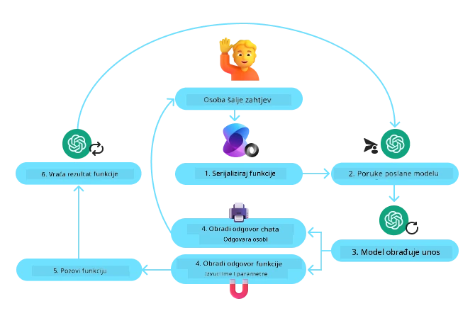
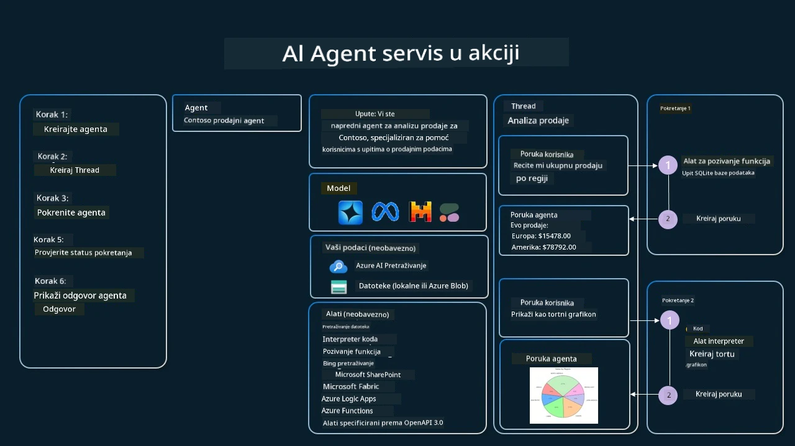

[](https://youtu.be/vieRiPRx-gI?si=cEZ8ApnT6Sus9rhn)

> _(Kliknite sliku iznad za prikaz videa ove lekcije)_

# Obrazac dizajna korištenja alata

Alati su zanimljivi jer omogućuju AI agentima širi spektar mogućnosti. Umjesto da agent ima ograničen skup radnji koje može izvesti, dodavanjem alata agent sada može izvršavati širok raspon radnji. U ovom poglavlju razmotrit ćemo Obrazac dizajna korištenja alata, koji opisuje kako AI agenti mogu koristiti određene alate za postizanje svojih ciljeva.

## Uvod

U ovoj lekciji nastojimo odgovoriti na sljedeća pitanja:

- Što je obrazac dizajna korištenja alata?
- Za koje slučajeve upotrebe se može primijeniti?
- Koji su elementi/gradivni blokovi potrebni za implementaciju obrasca dizajna?
- Koja su posebna razmatranja pri korištenju Obrazca dizajna korištenja alata za izgradnju pouzdanih AI agenata?

## Ciljevi učenja

Nakon završetka ove lekcije moći ćete:

- Definirati Obrazac dizajna korištenja alata i njegovu svrhu.
- Prepoznati slučajeve upotrebe gdje je Obrazac dizajna korištenja alata primjenjiv.
- Razumjeti ključne elemente potrebne za implementaciju obrasca dizajna.
- Uočiti razmatranja za osiguranje pouzdanosti AI agenata koji koriste ovaj obrazac dizajna.

## Što je Obrazac dizajna korištenja alata?

Obrazac dizajna korištenja alata usredotočuje se na davanje LLM-ovima mogućnosti interakcije s vanjskim alatima radi postizanja specifičnih ciljeva. Alati su kod koji agent može izvršiti kako bi obavio radnje. Alat može biti jednostavna funkcija poput kalkulatora ili poziv API-ja treće strane poput pretraživanja cijena dionica ili vremenske prognoze. U kontekstu AI agenata, alati su dizajnirani da ih agenti izvršavaju kao odgovor na **funkcijske pozive generirane od modela**.

## Za koje slučajeve upotrebe se može primijeniti?

AI agenti mogu iskoristiti alate za dovršavanje složenih zadataka, dohvaćanje informacija ili donošenje odluka. Obrazac dizajna korištenja alata često se koristi u scenarijima koji zahtijevaju dinamičku interakciju s vanjskim sustavima, poput baza podataka, web usluga ili interpretatora koda. Ova sposobnost korisna je za niz različitih slučajeva upotrebe uključujući:

- **Dinamično dohvaćanje informacija:** Agenti mogu upitavati vanjske API-je ili baze podataka kako bi dohvatili ažurirane podatke (npr. upit SQLite baze podataka za analizu podataka, dohvaćanje cijena dionica ili vremenskih informacija).
- **Izvršavanje i interpretacija koda:** Agenti mogu izvršavati kod ili skripte kako bi riješili matematičke probleme, generirali izvještaje ili obavljali simulacije.
- **Automatizacija radnih tokova:** Automatiziranje ponavljajućih ili višestupanjskih radnih tokova integracijom alata kao što su raspoređivači zadataka, usluge e-pošte ili podatkovni kanali.
- **Podrška korisnicima:** Agenti mogu stupiti u interakciju s CRM sustavima, platformama za ticketing ili bazama znanja kako bi riješili upite korisnika.
- **Generiranje i uređivanje sadržaja:** Agenti mogu koristiti alate poput provjere gramatike, sažimanja teksta ili evaluatora sigurnosti sadržaja za pomoć u zadacima stvaranja sadržaja.

## Koji su elementi/gradivni blokovi potrebni za implementaciju obrasca dizajna korištenja alata?

Ovi gradivni blokovi omogućuju AI agentu obavljanje širokog spektra zadataka. Pogledajmo ključne elemente potrebne za implementaciju Obrazca dizajna korištenja alata:

- **Sheme funkcija/alata**: Detaljne definicije dostupnih alata, uključujući ime funkcije, svrhu, potrebne parametre i očekivane izlaze. Ove sheme omogućuju LLM-u razumijevanje koji su alati dostupni i kako konstruirati valjane zahtjeve.

- **Logika izvršavanja funkcija**: Uređuje kako i kada se alati pozivaju na temelju korisnikova namjera i konteksta razgovora. Ovo može uključivati module planera, mehanizme usmjeravanja ili uvjetne tokove koji dinamički određuju korištenje alata.

- **Sustav rukovanja porukama**: Komponente koje upravljaju konverzacijski tijek između korisničkih unosa, odgovora LLM-a, poziva alata i izlaza alata.

- **Okvir za integraciju alata**: Infrastruktura koja povezuje agenta s raznim alatima, bilo da su to jednostavne funkcije ili složene vanjske usluge.

- **Rukovanje pogreškama i validacija**: Mehanizmi za rukovanje neuspjesima pri izvršavanju alata, validaciju parametara i upravljanje neočekivanim odgovorima.

- **Upravljanje stanjem**: Prati kontekst razgovora, prethodne interakcije s alatima i trajne podatke kako bi se osigurala dosljednost u višekratnim interakcijama.

Sljedeće, pogledajmo pozivanje funkcija/alata detaljnije.
 
### Pozivanje funkcija/alata

Pozivanje funkcija je primarni način na koji omogućujemo Velikim jezičnim modelima (LLM) interakciju s alatima. Često ćete vidjeti da se 'Function' i 'Tool' koriste naizmjenično jer su 'functions' (blokovi ponovno upotrebljivog koda) 'tools' koje agenti koriste za obavljanje zadataka. Da bi se kod funkcije pozvao, LLM mora usporediti korisničev zahtjev s opisom funkcija. Za to se LLM-u šalje shema koja sadrži opise svih dostupnih funkcija. LLM zatim odabire najprikladniju funkciju za zadatak i vraća njezino ime i argumente. Odabrana funkcija se poziva, njen odgovor se šalje natrag LLM-u, koji koristi te informacije za odgovor na korisnikov zahtjev.

Za razvojne programere koji žele implementirati pozivanje funkcija za agente, bit će vam potrebno:

1. An LLM model that supports function calling
2. A schema containing function descriptions
3. The code for each function described

Let's use the example of getting the current time in a city to illustrate:

1. **Inicijalizirajte LLM koji podržava pozivanje funkcija:**

    Nisu svi modeli podržavaju pozivanje funkcija, stoga je važno provjeriti podržava li LLM koji koristite pozivanje funkcija.     <a href="https://learn.microsoft.com/azure/ai-services/openai/how-to/function-calling" target="_blank">Azure OpenAI</a> podržava pozivanje funkcija. Možemo započeti inicijalizacijom Azure OpenAI klijenta. 

    ```python
    # Inicijalizirajte Azure OpenAI klijenta
    client = AzureOpenAI(
        azure_endpoint = os.getenv("AZURE_AI_PROJECT_ENDPOINT"), 
        api_key=os.getenv("AZURE_OPENAI_API_KEY"),  
        api_version="2024-05-01-preview"
    )
    ```

1. **Kreirajte shemu funkcije**:

    Sljedeće ćemo definirati JSON shemu koja sadrži ime funkcije, opis što funkcija radi i imena te opise parametara funkcije.
    Zatim ćemo ovu shemu proslijediti klijentu kreiranom prethodno, zajedno s korisnikovim zahtjevom da pronađe vrijeme u San Franciscu. Važno je napomenuti da je vraćen **poziv alata**, **ne** konačni odgovor na pitanje. Kao što je ranije spomenuto, LLM vraća ime funkcije koju je odabrao za zadatak i argumente koji će joj se proslijediti.

    ```python
    # Opis funkcije koji model treba pročitati
    tools = [
        {
            "type": "function",
            "function": {
                "name": "get_current_time",
                "description": "Get the current time in a given location",
                "parameters": {
                    "type": "object",
                    "properties": {
                        "location": {
                            "type": "string",
                            "description": "The city name, e.g. San Francisco",
                        },
                    },
                    "required": ["location"],
                },
            }
        }
    ]
    ```
   
    ```python
  
    # Početna poruka korisnika
    messages = [{"role": "user", "content": "What's the current time in San Francisco"}] 
  
    # Prvi API poziv: Zatražite od modela da koristi funkciju
      response = client.chat.completions.create(
          model=deployment_name,
          messages=messages,
          tools=tools,
          tool_choice="auto",
      )
  
      # Obradite odgovor modela
      response_message = response.choices[0].message
      messages.append(response_message)
  
      print("Model's response:")  

      print(response_message)
  
    ```

    ```bash
    Model's response:
    ChatCompletionMessage(content=None, role='assistant', function_call=None, tool_calls=[ChatCompletionMessageToolCall(id='call_pOsKdUlqvdyttYB67MOj434b', function=Function(arguments='{"location":"San Francisco"}', name='get_current_time'), type='function')])
    ```
  
1. **Kod funkcije potreban za izvršenje zadatka:**

    Sada kada je LLM odabrao koju funkciju treba pokrenuti, kod koji obavlja zadatak treba biti implementiran i izvršen.
    Možemo implementirati kod za dobivanje trenutnog vremena u Pythonu. Također ćemo trebati napisati kod za izdvajanje imena i argumenata iz response_message kako bismo dobili konačan rezultat.

    ```python
      def get_current_time(location):
        """Get the current time for a given location"""
        print(f"get_current_time called with location: {location}")  
        location_lower = location.lower()
        
        for key, timezone in TIMEZONE_DATA.items():
            if key in location_lower:
                print(f"Timezone found for {key}")  
                current_time = datetime.now(ZoneInfo(timezone)).strftime("%I:%M %p")
                return json.dumps({
                    "location": location,
                    "current_time": current_time
                })
      
        print(f"No timezone data found for {location_lower}")  
        return json.dumps({"location": location, "current_time": "unknown"})
    ```

     ```python
     # Obradi pozive funkcija
      if response_message.tool_calls:
          for tool_call in response_message.tool_calls:
              if tool_call.function.name == "get_current_time":
     
                  function_args = json.loads(tool_call.function.arguments)
     
                  time_response = get_current_time(
                      location=function_args.get("location")
                  )
     
                  messages.append({
                      "tool_call_id": tool_call.id,
                      "role": "tool",
                      "name": "get_current_time",
                      "content": time_response,
                  })
      else:
          print("No tool calls were made by the model.")  
  
      # Drugi poziv API-ja: Dohvati konačni odgovor od modela
      final_response = client.chat.completions.create(
          model=deployment_name,
          messages=messages,
      )
  
      return final_response.choices[0].message.content
     ```

     ```bash
      get_current_time called with location: San Francisco
      Timezone found for san francisco
      The current time in San Francisco is 09:24 AM.
     ```

Pozivanje funkcija je u srcu većine, ako ne i svih, dizajna korištenja alata agenata, međutim implementacija od nule ponekad može biti izazovna.
Kao što smo naučili u [Lekcija 2](../../../02-explore-agentic-frameworks) agentski okviri nam pružaju unaprijed izgrađene gradivne blokove za implementaciju korištenja alata.
 
## Primjeri korištenja alata s agentskim okvirima

Evo nekoliko primjera kako možete implementirati Obrazac dizajna korištenja alata koristeći različite agentske okvire:

### Microsoft Agent Framework

<a href="https://learn.microsoft.com/azure/ai-services/agents/overview" target="_blank">Microsoft Agent Framework</a> je open-source AI okvir za izgradnju AI agenata. Pojednostavljuje proces korištenja pozivanja funkcija omogućujući vam da definirate alate kao Python funkcije s dekoratorom `@tool`. Okvir upravlja dvosmjernom komunikacijom između modela i vašeg koda. Također pruža pristup unaprijed izgrađenim alatima poput File Search i Code Interpreter kroz `AzureAIProjectAgentProvider`.

Sljedeći dijagram ilustrira proces pozivanja funkcija s Microsoft Agent Framework:



U Microsoft Agent Frameworku, alati se definiraju kao dekorirane funkcije. Možemo pretvoriti funkciju `get_current_time` koju smo vidjeli ranije u alat koristeći dekorator `@tool`. Okvir će automatski serializirati funkciju i njezine parametre, stvarajući shemu za slanje LLM-u.

```python
from agent_framework import tool
from agent_framework.azure import AzureAIProjectAgentProvider
from azure.identity import AzureCliCredential

@tool
def get_current_time(location: str) -> str:
    """Get the current time for a given location"""
    ...

# Kreiraj klijenta
provider = AzureAIProjectAgentProvider(credential=AzureCliCredential())

# Kreiraj agenta i pokreni ga pomoću alata
agent = await provider.create_agent(name="TimeAgent", instructions="Use available tools to answer questions.", tools=get_current_time)
response = await agent.run("What time is it?")
```
  
### Azure AI Agent Service

<a href="https://learn.microsoft.com/azure/ai-services/agents/overview" target="_blank">Azure AI Agent Service</a> je noviji agentski okvir koji je dizajniran da omogući programerima sigurno izgradnju, implementaciju i skaliranje visokokvalitetnih i proširivih AI agenata bez potrebe za upravljanjem temeljnim resursima za izračun i pohranu. Posebno je koristan za enterprise aplikacije budući da je potpuno upravljana usluga s enterprise razinom sigurnosti.

U usporedbi s razvojem s API-jem LLM-a izravno, Azure AI Agent Service pruža neke prednosti, uključujući:

- Automatsko pozivanje alata – nema potrebe za parsiranjem poziva alata, pozivanjem alata i rukovanjem odgovorom; sve se to sada radi na strani poslužitelja
- Sigurno upravljani podaci – umjesto upravljanja vlastitim stanjem razgovora, možete se osloniti na threads za pohranu svih potrebnih informacija
- Alati spremni za upotrebu – alati koje možete koristiti za interakciju s izvorima podataka, poput Bing, Azure AI Search i Azure Functions.

Alati dostupni u Azure AI Agent Service mogu se podijeliti u dvije kategorije:

1. Knowledge Tools:
    - <a href="https://learn.microsoft.com/azure/ai-services/agents/how-to/tools/bing-grounding?tabs=python&pivots=overview" target="_blank">Grounding with Bing Search</a>
    - <a href="https://learn.microsoft.com/azure/ai-services/agents/how-to/tools/file-search?tabs=python&pivots=overview" target="_blank">File Search</a>
    - <a href="https://learn.microsoft.com/azure/ai-services/agents/how-to/tools/azure-ai-search?tabs=azurecli%2Cpython&pivots=overview-azure-ai-search" target="_blank">Azure AI Search</a>

2. Action Tools:
    - <a href="https://learn.microsoft.com/azure/ai-services/agents/how-to/tools/function-calling?tabs=python&pivots=overview" target="_blank">Function Calling</a>
    - <a href="https://learn.microsoft.com/azure/ai-services/agents/how-to/tools/code-interpreter?tabs=python&pivots=overview" target="_blank">Code Interpreter</a>
    - <a href="https://learn.microsoft.com/azure/ai-services/agents/how-to/tools/openapi-spec?tabs=python&pivots=overview" target="_blank">OpenAPI defined tools</a>
    - <a href="https://learn.microsoft.com/azure/ai-services/agents/how-to/tools/azure-functions?pivots=overview" target="_blank">Azure Functions</a>

Agent Service nam omogućava da ove alate koristimo zajedno kao `toolset`. Također koristi `threads` koji prate povijest poruka iz određenog razgovora.

Zamislite da ste prodajni agent u tvrtki nazvanoj Contoso. Želite razviti konverzacijski agent koji može odgovarati na pitanja o vašim prodajnim podacima.

Sljedeća slika ilustrira kako biste mogli koristiti Azure AI Agent Service za analizu vaših prodajnih podataka:



Za korištenje bilo kojeg od ovih alata s uslugom možemo stvoriti klijenta i definirati alat ili skup alata (toolset). Za praktičnu implementaciju možemo koristiti sljedeći Python kod. LLM će moći pogledati toolset i odlučiti hoće li koristiti korisnički kreiranu funkciju, `fetch_sales_data_using_sqlite_query`, ili unaprijed izgrađeni Code Interpreter, ovisno o korisnikovom zahtjevu.

```python 
import os
from azure.ai.projects import AIProjectClient
from azure.identity import DefaultAzureCredential
from fetch_sales_data_functions import fetch_sales_data_using_sqlite_query # funkcija fetch_sales_data_using_sqlite_query koja se nalazi u datoteci fetch_sales_data_functions.py.
from azure.ai.projects.models import ToolSet, FunctionTool, CodeInterpreterTool

project_client = AIProjectClient.from_connection_string(
    credential=DefaultAzureCredential(),
    conn_str=os.environ["PROJECT_CONNECTION_STRING"],
)

# Inicijalizirajte skup alata
toolset = ToolSet()

# Inicijalizirajte agenta koji poziva funkcije s funkcijom fetch_sales_data_using_sqlite_query i dodajte ga u skup alata
fetch_data_function = FunctionTool(fetch_sales_data_using_sqlite_query)
toolset.add(fetch_data_function)

# Inicijalizirajte alat Code Interpreter i dodajte ga u skup alata.
code_interpreter = code_interpreter = CodeInterpreterTool()
toolset.add(code_interpreter)

agent = project_client.agents.create_agent(
    model="gpt-4o-mini", name="my-agent", instructions="You are helpful agent", 
    toolset=toolset
)
```

## Koja su posebna razmatranja pri korištenju Obrasca dizajna korištenja alata za izgradnju pouzdanih AI agenata?

Uobičajena zabrinutost s dinamički generiranim SQL-om od strane LLM-ova je sigurnost, posebno rizik SQL injekcije ili zlonamjernih radnji, poput brisanja ili manipulacije bazom podataka. Iako su te zabrinutosti opravdane, mogu se učinkovito ublažiti pravilnim konfiguriranjem dopuštenja pristupa bazi podataka. Za većinu baza podataka to uključuje konfiguriranje baze kao samo za čitanje. Za usluge baza podataka poput PostgreSQL ili Azure SQL, aplikaciji bi trebala biti dodijeljena uloga samo za čitanje (SELECT).

Pokretanje aplikacije u sigurnom okruženju dodatno pojačava zaštitu. U enterprise scenarijima, podaci se obično izvlače i transformiraju iz operativnih sustava u bazu podataka ili skladište podataka samo za čitanje s korisnički pristupačnom shemom. Ovakav pristup osigurava da su podaci sigurni, optimizirani za performanse i dostupnost te da aplikacija ima ograničen pristup samo za čitanje.

## Primjeri koda

- Python: [Agent Framework](./code_samples/04-python-agent-framework.ipynb)
- .NET: [Agent Framework](./code_samples/04-dotnet-agent-framework.md)

## Imate li dodatnih pitanja o obrascima dizajna korištenja alata?

Pridružite se [Microsoft Foundry Discord](https://aka.ms/ai-agents/discord) kako biste se sastali s drugim polaznicima, prisustvovali office hours i dobili odgovore na svoja pitanja o AI Agentima.

## Dodatni resursi

- <a href="https://microsoft.github.io/build-your-first-agent-with-azure-ai-agent-service-workshop/" target="_blank">Azure AI Agents Service Workshop</a>
- <a href="https://github.com/Azure-Samples/contoso-creative-writer/tree/main/docs/workshop" target="_blank">Contoso Creative Writer Multi-Agent Workshop</a>
- <a href="https://learn.microsoft.com/azure/ai-services/agents/overview" target="_blank">Microsoft Agent Framework Overview</a>

## Prethodna lekcija

[Razumijevanje agentskih obrazaca dizajna](../03-agentic-design-patterns/README.md)

## Sljedeća lekcija
[Agentski RAG](../05-agentic-rag/README.md)

---

<!-- CO-OP TRANSLATOR DISCLAIMER START -->
Izjava o odricanju odgovornosti:
Ovaj dokument je preveden pomoću AI usluge za prevođenje Co-op Translator (https://github.com/Azure/co-op-translator). Iako nastojimo osigurati točnost, imajte na umu da automatski prijevodi mogu sadržavati pogreške ili netočnosti. Originalni dokument na izvornom jeziku treba smatrati mjerodavnim izvorom. Za kritične informacije preporučuje se profesionalni ljudski prijevod. Ne snosimo odgovornost za bilo kakve nesporazume ili pogrešna tumačenja koja proizlaze iz korištenja ovog prijevoda.
<!-- CO-OP TRANSLATOR DISCLAIMER END -->