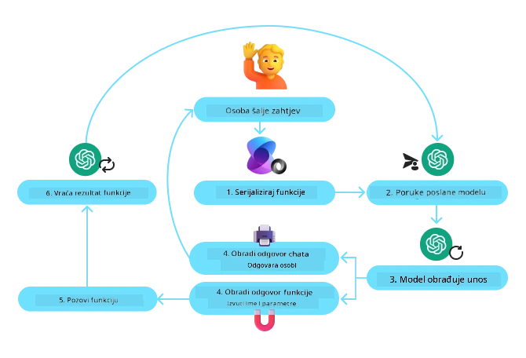
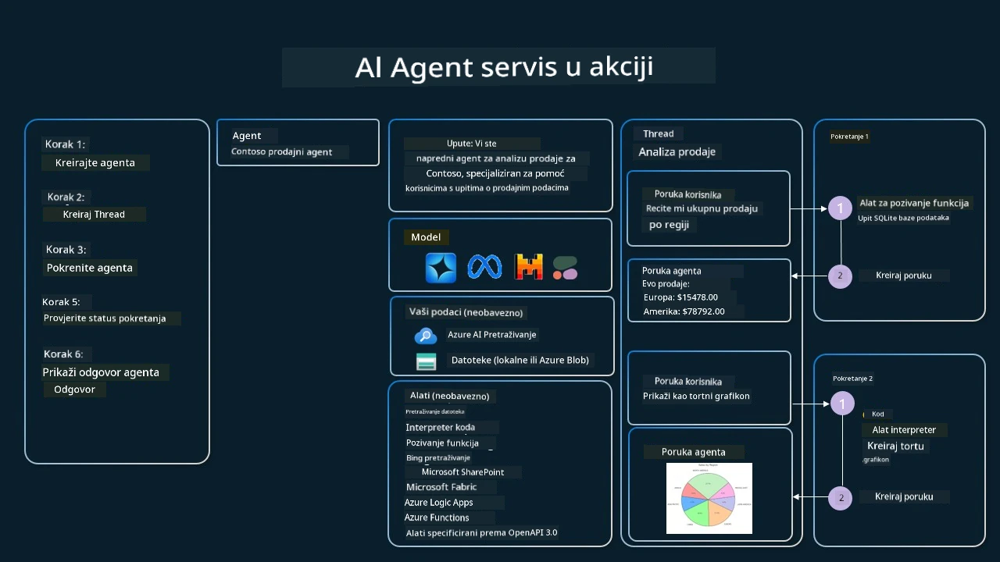

[](https://youtu.be/vieRiPRx-gI?si=cEZ8ApnT6Sus9rhn)

> _(Kliknite na gornju sliku da pogledate video ovog poglavlja)_

# Dizajnerski obrazac korištenja alata

Alati su zanimljivi jer omogućuju AI agentima širi raspon sposobnosti. Umjesto da agent ima ograničen skup radnji koje može izvesti, dodavanjem alata agent može sada izvesti širok spektar radnji. U ovom poglavlju razmotrit ćemo dizajnerski obrazac korištenja alata, koji opisuje kako AI agenti mogu koristiti specifične alate za postizanje svojih ciljeva.

## Uvod

U ovom ćemo poglavlju pokušati odgovoriti na sljedeća pitanja:

- Što je dizajnerski obrazac korištenja alata?
- Za koje se slučajeve primjene može koristiti?
- Koji su elementi/gradivni blokovi potrebni za implementaciju dizajnerskog obrasca?
- Koje su posebne napomene pri korištenju dizajnerskog obrasca korištenja alata za izgradnju pouzdanih AI agenata?

## Ciljevi učenja

Nakon što dovršite ovaj lekciju, moći ćete:

- Definirati dizajnerski obrazac korištenja alata i njegovu namjenu.
- Prepoznati slučajeve primjene dizajnerskog obrasca korištenja alata.
- Shvatiti ključne elemente potrebne za implementaciju dizajnerskog obrasca.
- Prepoznati razmatranja za osiguranje pouzdanosti AI agenata koji koriste ovaj dizajnerski obrazac.

## Što je dizajnerski obrazac korištenja alata?

**Dizajnerski obrazac korištenja alata** usredotočuje se na davanje LLM-ovima mogućnosti interakcije s vanjskim alatima za postizanje specifičnih ciljeva. Alati su kod koji agent može izvršiti da bi obavio radnje. Alat može biti jednostavna funkcija poput kalkulatora ili poziv API-ja treće strane, poput pretraživanja cijena dionica ili vremenske prognoze. U kontekstu AI agenata, alati su dizajnirani da ih agenti izvrše kao odgovor na **pozive funkcijama koje generira model**.

## Za koje se slučajeve primjene može koristiti?

AI agenti mogu koristiti alate za obavljanje složenih zadataka, dohvat informacija ili donošenje odluka. Dizajnerski obrazac korištenja alata često se koristi u scenarijima koji zahtijevaju dinamičku interakciju s vanjskim sustavima, poput baza podataka, web usluga ili tumača koda. Ova sposobnost je korisna za niz različitih slučajeva upotrebe, uključujući:

- **Dinamički dohvat informacija:** Agenti mogu slati upite vanjskim API-jima ili bazama podataka kako bi dohvatili ažurirane podatke (npr. upit SQLite baze za analizu podataka, dohvat cijena dionica ili vremenske prognoze).
- **Izvršavanje i interpretacija koda:** Agenti mogu izvršavati kod ili skripte za rješavanje matematičkih problema, generiranje izvještaja ili izvođenje simulacija.
- **Automatizacija radnih tokova:** Automatizacija ponavljajućih ili višestupanjskih radnih tokova integriranjem alata poput raspoređivača zadataka, email usluga ili podatkovnih cjevovoda.
- **Podrška korisnicima:** Agenti mogu komunicirati sa CRM sustavima, platformama za tiketiranje ili bazama znanja kako bi riješili upite korisnika.
- **Generiranje i uređivanje sadržaja:** Agenti mogu koristiti alate poput gramatickih provjera, sažimatelja teksta ili evaluatora sigurnosti sadržaja za podršku u zadacima stvaranja sadržaja.

## Koji su elementi/gradivni blokovi potrebni za implementaciju dizajnerskog obrasca korištenja alata?

Ovi gradivni blokovi omogućavaju AI agentu da izvrši širok spektar zadataka. Pogledajmo ključne elemente potrebne za implementaciju dizajnerskog obrasca korištenja alata:

- **Sheme funkcija/alata**: Detaljni opisi dostupnih alata, uključujući ime funkcije, svrhu, potrebne parametre i očekivane izlaze. Ove sheme omogućuju LLM-u razumijevanje koji su alati dostupni i kako sastaviti valjane zahtjeve.

- **Logika izvršavanja funkcija**: Upravljanje načinom i vremenom pozivanja alata na temelju korisničke namjere i konteksta razgovora. To može uključivati module planiranja, mehanizme usmjeravanja ili uvjetne protoke koji dinamički određuju korištenje alata.

- **Sustav upravljanja porukama**: Komponente koje upravljaju tijekom razgovora između korisničkih unosa, LLM odgovora, poziva alata i rezultata alata.

- **Okvir za integraciju alata**: Infrastruktura koja povezuje agenta s različitim alatima, bilo da su to jednostavne funkcije ili složene vanjske usluge.

- **Rukovanje pogreškama i validacija**: Mehanizmi za rukovanje neuspjesima u izvršavanju alata, validaciju parametara i upravljanje neočekivanim odgovorima.

- **Upravljanje stanjem**: Praćenje konteksta razgovora, prethodnih interakcija s alatima i trajnih podataka kako bi se osigurala dosljednost u višekratnim interakcijama.

Sljedeće ćemo detaljnije pogledati pozivanje funkcija/alata.
 
### Pozivanje funkcija/alata

Pozivanje funkcija je primarni način na koji omogućujemo velikim jezičnim modelima (LLM) interakciju s alatima. Često ćete vidjeti da se 'Funkcija' i 'Alat' koriste naizmjenično jer su 'funkcije' (blokovi ponovljivog koda) 'alati' koje agenti koriste za obavljanje zadataka. Da bi se pozvao kôd funkcije, LLM mora usporediti korisnički zahtjev s opisom funkcije. Za to se šalje shema koja sadrži opise svih dostupnih funkcija LLM-u. LLM zatim odabire najprikladniju funkciju za zadatak i vraća njezino ime i argumente. Odabrana funkcija se poziva, njen odgovor se šalje natrag LLM-u, koji koristi informacije za odgovor na korisnički zahtjev.

Za programere da implementiraju pozivanje funkcija za agente, potrebno je:

1. LLM model koji podržava pozivanje funkcija
2. Shema koja sadrži opise funkcija
3. Kod za svaku opisanu funkciju

Koristit ćemo primjer dobivanja točnog vremena u nekom gradu:

1. **Inicijalizacija LLM-a koji podržava pozivanje funkcija:**

    Nisu svi modeli podržavaju pozivanje funkcija, stoga je važno provjeriti podršku modela koji koristite.     <a href="https://learn.microsoft.com/azure/ai-services/openai/how-to/function-calling" target="_blank">Azure OpenAI</a> podržava pozivanje funkcija. Možemo započeti inicijalizacijom OpenAI klijenta prema Azure OpenAI **Responses API-ju** (stabilna `/openai/v1/` krajnja točka — bez potrebe za `api_version`).

    ```python
    # Inicijalizirajte OpenAI klijenta za Azure OpenAI (Responses API, v1 endpoint)
    client = OpenAI(
        base_url=f"{os.environ['AZURE_OPENAI_ENDPOINT'].rstrip('/')}/openai/v1/",
        api_key=os.environ["AZURE_OPENAI_API_KEY"],
    )
    deployment_name = os.environ["AZURE_OPENAI_DEPLOYMENT"]
    ```

1. **Izrada sheme funkcije**:

    Zatim ćemo definirati JSON shemu koja sadrži ime funkcije, opis što funkcija radi i imena i opise parametara funkcije.
    Zatim ćemo ovu shemu poslati prethodno kreiranom klijentu, zajedno s korisničkim zahtjevom za pronalazak vremena u San Franciscu. Važno je napomenuti da se kao rezultat vraća **poziv alatu**, a **ne** konačni odgovor na pitanje. Kao što je ranije spomenuto, LLM vraća ime funkcije koju je odabrao za zadatak, i argumente koji će joj se proslijediti.

    ```python
    # Opis funkcije za model za čitanje (Responses API format ravnog alata)
    tools = [
        {
            "type": "function",
            "name": "get_current_time",
            "description": "Get the current time in a given location",
            "parameters": {
                "type": "object",
                "properties": {
                    "location": {
                        "type": "string",
                        "description": "The city name, e.g. San Francisco",
                    },
                },
                "required": ["location"],
            },
        }
    ]
    ```
   
    ```python
  
    # Početna korisnička poruka
    messages = [{"role": "user", "content": "What's the current time in San Francisco"}]

    # Prvi API poziv: Zamolite model da koristi funkciju
    response = client.responses.create(
        model=deployment_name,
        input=messages,
        tools=tools,
        tool_choice="auto",
        store=False,
    )

    # Responses API vraća pozive alata kao function_call stavke u response.output.
    # Dodajte ih u razgovor kako bi model imao potpuni kontekst u sljedećem koraku.
    messages += response.output

    print("Model's response:")
    print(response.output)
  
    ```

    ```bash
    Model's response:
    [ResponseFunctionToolCall(arguments='{"location":"San Francisco"}', call_id='call_pOsKdUlqvdyttYB67MOj434b', name='get_current_time', type='function_call')]
    ```
  
1. **Kod funkcije potreban za izvršenje zadatka:**

    Sada kada je LLM odabrao koju funkciju treba koristiti, potrebno je implementirati i izvršiti kod koji obavlja zadatak.
    Možemo implementirati kod za dohvat točnog vremena u Pythonu. Također ćemo morati napisati kod za izdvajanje imena i argumenata iz odgovora (response_message) da bismo dobili konačni rezultat.

    ```python
      def get_current_time(location):
        """Get the current time for a given location"""
        print(f"get_current_time called with location: {location}")  
        location_lower = location.lower()
        
        for key, timezone in TIMEZONE_DATA.items():
            if key in location_lower:
                print(f"Timezone found for {key}")  
                current_time = datetime.now(ZoneInfo(timezone)).strftime("%I:%M %p")
                return json.dumps({
                    "location": location,
                    "current_time": current_time
                })
      
        print(f"No timezone data found for {location_lower}")  
        return json.dumps({"location": location, "current_time": "unknown"})
    ```

     ```python
    # Obradi pozive funkcija
    tool_calls = [item for item in response.output if item.type == "function_call"]
    if tool_calls:
        for tool_call in tool_calls:
            if tool_call.name == "get_current_time":

                function_args = json.loads(tool_call.arguments)

                time_response = get_current_time(
                    location=function_args.get("location")
                )

                # Vrati rezultat alata kao stavku function_call_output
                messages.append({
                    "type": "function_call_output",
                    "call_id": tool_call.call_id,
                    "output": time_response,
                })
    else:
        print("No tool calls were made by the model.")

    # Drugi API poziv: Dobavi konačni odgovor od modela
    final_response = client.responses.create(
        model=deployment_name,
        input=messages,
        tools=tools,
        store=False,
    )

    return final_response.output_text
     ```

     ```bash
      get_current_time called with location: San Francisco
      Timezone found for san francisco
      The current time in San Francisco is 09:24 AM.
     ```

Pozivanje funkcija je u središtu većine, ako ne i svih dizajnerskih obrazaca korištenja alata, no njihova implementacija od nule može ponekad biti izazovna.
Kao što smo naučili u [Lekciji 2](../../../02-explore-agentic-frameworks), agentski okviri (frameworks) nam pružaju gotove gradivne blokove za implementaciju korištenja alata.
 
## Primjeri korištenja alata s agentskim okvirima

Evo nekoliko primjera kako možete implementirati dizajnerski obrazac korištenja alata koristeći različite agentske okvire:

### Microsoft Agent Framework

<a href="https://learn.microsoft.com/azure/ai-services/agents/overview" target="_blank">Microsoft Agent Framework</a> je open-source AI okvir za gradnju AI agenata. Pojednostavljuje proces pozivanja funkcija omogućujući definiranje alata kao Python funkcija s dekoratorom `@tool`. Okvir upravlja komunikacijom između modela i vašeg koda. Također pruža pristup već izgrađenim alatima poput File Search i Code Interpreter kroz `FoundryChatClient`.

Sljedeći dijagram ilustrira proces pozivanja funkcija u Microsoft Agent Frameworku:



U Microsoft Agent Frameworku, alati su definirani kao dekorirane funkcije. Funkciju `get_current_time` koju smo ranije vidjeli možemo pretvoriti u alat koristeći dekorator `@tool`. Okvir će automatski serijalizirati funkciju i njene parametre, stvarajući shemu koju šalje LLM-u.

```python
import os
from agent_framework import tool
from agent_framework.foundry import FoundryChatClient
from azure.identity import AzureCliCredential

@tool(approval_mode="never_require")
def get_current_time(location: str) -> str:
    """Get the current time for a given location"""
    ...

# Kreirajte klijenta
provider = FoundryChatClient(
    project_endpoint=os.environ["AZURE_AI_PROJECT_ENDPOINT"],
    model=os.environ["AZURE_AI_MODEL_DEPLOYMENT_NAME"],
    credential=AzureCliCredential(),
)

# Kreirajte agenta i pokrenite alat
agent = provider.as_agent(name="TimeAgent", instructions="Use available tools to answer questions.", tools=get_current_time)
response = await agent.run("What time is it?")
```
  
### Microsoft Foundry Agent Service

<a href="https://learn.microsoft.com/azure/ai-services/agents/overview" target="_blank">Microsoft Foundry Agent Service</a> je noviji agentski okvir dizajniran da razvijateljima omogući sigurnu izradu, implementaciju i skaliranje visokokvalitetnih i proširivih AI agenata bez potrebe za upravljanjem računalnim i skladišnim resursima. Posebno je koristan za enterprise aplikacije budući da je to potpuno upravljana usluga s sigurnošću na razini poduzeća.

U usporedbi s razvojem s LLM API-jem direktno, Microsoft Foundry Agent Service nudi neke prednosti, uključujući:

- Automatsko pozivanje alata – nema potrebe za parsiranjem poziva alatu, pokretanjem alata i rukovanjem odgovorom; sve se sada radi na poslužiteljskoj strani
- Sigurno upravljanje podacima – umjesto upravljanja vlastitim stanjem razgovora, možete se osloniti na threadove koji pohranjuju sve potrebne informacije
- Alati spremni za upotrebu – alati koje možete koristiti za interakciju s vašim izvorima podataka, poput Bing, Azure AI Search i Azure Functions.

Alatima dostupnima u Microsoft Foundry Agent Service-u mogu se podijeliti u dvije kategorije:

1. Alati za znanje:
    - <a href="https://learn.microsoft.com/azure/ai-services/agents/how-to/tools/bing-grounding?tabs=python&pivots=overview" target="_blank">Povezanost s Bing pretraživanjem</a>
    - <a href="https://learn.microsoft.com/azure/ai-services/agents/how-to/tools/file-search?tabs=python&pivots=overview" target="_blank">Pretraživanje datoteka</a>
    - <a href="https://learn.microsoft.com/azure/ai-services/agents/how-to/tools/azure-ai-search?tabs=azurecli%2Cpython&pivots=overview-azure-ai-search" target="_blank">Azure AI Search</a>

2. Alati za radnje:
    - <a href="https://learn.microsoft.com/azure/ai-services/agents/how-to/tools/function-calling?tabs=python&pivots=overview" target="_blank">Pozivanje funkcija</a>
    - <a href="https://learn.microsoft.com/azure/ai-services/agents/how-to/tools/code-interpreter?tabs=python&pivots=overview" target="_blank">Code Interpreter</a>
    - <a href="https://learn.microsoft.com/azure/ai-services/agents/how-to/tools/openapi-spec?tabs=python&pivots=overview" target="_blank">Alati definirani OpenAPI-jem</a>
    - <a href="https://learn.microsoft.com/azure/ai-services/agents/how-to/tools/azure-functions?pivots=overview" target="_blank">Azure Functions</a>

Agent Service nam omogućava korištenje ovih alata zajedno kao `toolset`. Također koristi `threadove` koji prate povijest poruka određenog razgovora.

Zamislite da ste prodajni agent u tvrtki Contoso. Želite razviti konverzacijski agent koji može odgovarati na pitanja o vašim prodajnim podacima.

Slika ispod ilustrira kako biste mogli koristiti Microsoft Foundry Agent Service za analizu vaših prodajnih podataka:



Da biste koristili bilo koji od ovih alata s ovom uslugom, možemo kreirati klijenta i definirati alat ili skup alata. Za praktičnu implementaciju možemo koristiti sljedeći Python kod. LLM će moći pogledati skup alata i odlučiti hoće li koristiti korisnički definiranu funkciju `fetch_sales_data_using_sqlite_query` ili unaprijed izrađeni Code Interpreter, ovisno o korisničkom zahtjevu.

```python 
import os
from azure.ai.projects import AIProjectClient
from azure.identity import DefaultAzureCredential
from fetch_sales_data_functions import fetch_sales_data_using_sqlite_query # fetch_sales_data_using_sqlite_query funkcija koja se može pronaći u datoteci fetch_sales_data_functions.py.
from azure.ai.projects.models import ToolSet, FunctionTool, CodeInterpreterTool

project_client = AIProjectClient.from_connection_string(
    credential=DefaultAzureCredential(),
    conn_str=os.environ["PROJECT_CONNECTION_STRING"],
)

# Inicijaliziraj skup alata
toolset = ToolSet()

# Inicijaliziraj agenata za pozivanje funkcije s funkcijom fetch_sales_data_using_sqlite_query i dodaj ga u skup alata
fetch_data_function = FunctionTool(fetch_sales_data_using_sqlite_query)
toolset.add(fetch_data_function)

# Inicijaliziraj alat za tumačenje koda i dodaj ga u skup alata.
code_interpreter = CodeInterpreterTool()toolset.add(code_interpreter)

agent = project_client.agents.create_agent(
    model="gpt-4o-mini", name="my-agent", instructions="You are helpful agent", 
    toolset=toolset
)
```

## Koje su posebne napomene pri korištenju dizajnerskog obrasca korištenja alata za izgradnju pouzdanih AI agenata?

Čest problem kod SQL-a dinamički generiranog od strane LLM-ova je sigurnost, osobito rizik od SQL injekcija ili zlonamjernih radnji, poput brisanja ili manipulacije bazom podataka. Iako su ovi rizici opravdani, mogu se učinkovito ublažiti pravilnim konfiguriranjem dozvola pristupa bazi podataka. Za većinu baza podataka to podrazumijeva postavljanje baze u read-only (samo za čitanje) mod. Za usluge poput PostgreSQL-a ili Azure SQL-a, aplikacija bi trebala imati dodijeljenu ulogu samo za čitanje (SELECT).

Pokretanje aplikacije u sigurnom okruženju dodatno pojačava zaštitu. U enterprise scenarijima podaci se obično izvlače i transformiraju iz operativnih sustava u read-only bazu podataka ili skladište podataka s korisnički prijateljskom shemom. Ovaj pristup osigurava da su podaci sigurni, optimizirani za izvedbu i pristupačnost te da aplikacija ima ograničen pristup samo za čitanje.

## Primjeri koda

- Python: [Agent Framework](./code_samples/04-python-agent-framework.ipynb)
- .NET: [Agent Framework](./code_samples/04-dotnet-agent-framework.md)

## Imate li još pitanja o dizajnerskim obrascima korištenja alata?

Pridružite se [Microsoft Foundry Discord](https://discord.com/invite/ATgtXmAS5D) kako biste se upoznali s drugim učenicima, sudjelovali u radnim satima i dobili odgovore na vaša pitanja o AI agentima.

## Dodatni resursi

- <a href="https://microsoft.github.io/build-your-first-agent-with-azure-ai-agent-service-workshop/" target="_blank">Azure AI Agents Service Workshop</a>
- <a href="https://github.com/Azure-Samples/contoso-creative-writer/tree/main/docs/workshop" target="_blank">Contoso Creative Writer Multi-Agent Workshop</a>
- <a href="https://learn.microsoft.com/azure/ai-services/agents/overview" target="_blank">Pregled Microsoft Agent Frameworka</a>


## Prethodna lekcija

[Razumijevanje agentnih dizajnerskih obrazaca](../03-agentic-design-patterns/README.md)

## Sljedeća lekcija

[Agentni RAG](../05-agentic-rag/README.md)

---

<!-- CO-OP TRANSLATOR DISCLAIMER START -->
**Napomena**:
Ovaj dokument je preveden korištenjem AI prevoditeljskog servisa [Co-op Translator](https://github.com/Azure/co-op-translator). Iako težimo točnosti, imajte na umu da automatski prijevodi mogu sadržavati greške ili netočnosti. Izvorni dokument na izvornom jeziku treba smatrati autoritativnim izvorom. Za važne informacije preporuča se profesionalni ljudski prijevod. Nismo odgovorni za bilo kakva nesporazumevanja ili pogrešne interpretacije koje proizlaze iz korištenja ovog prijevoda.
<!-- CO-OP TRANSLATOR DISCLAIMER END -->