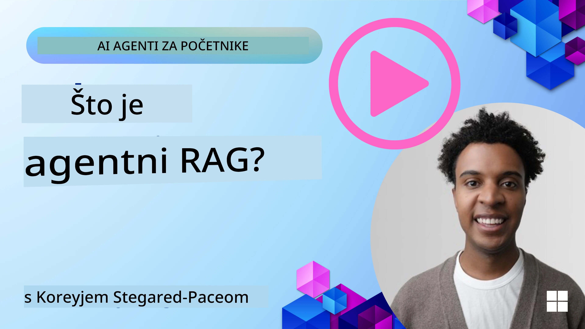
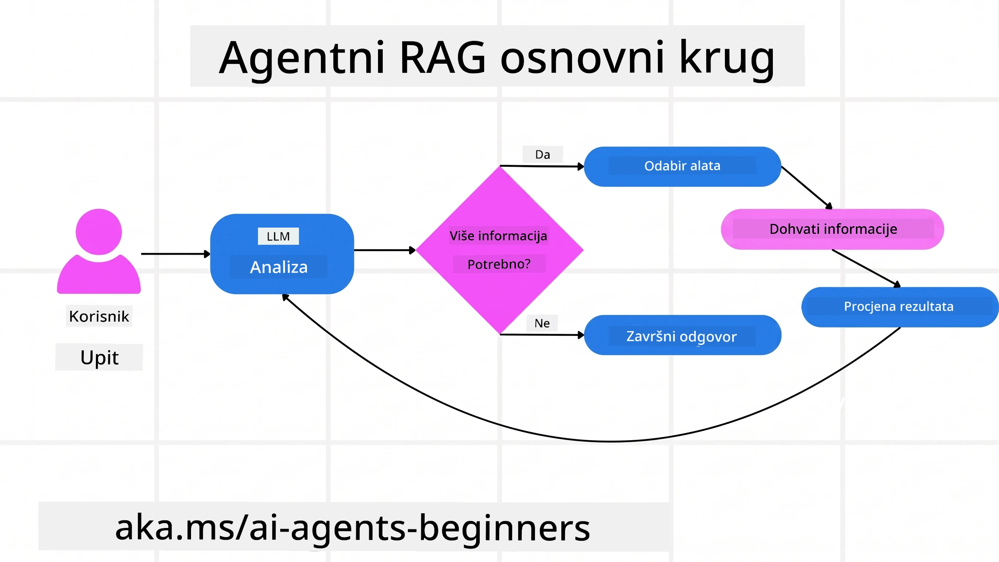
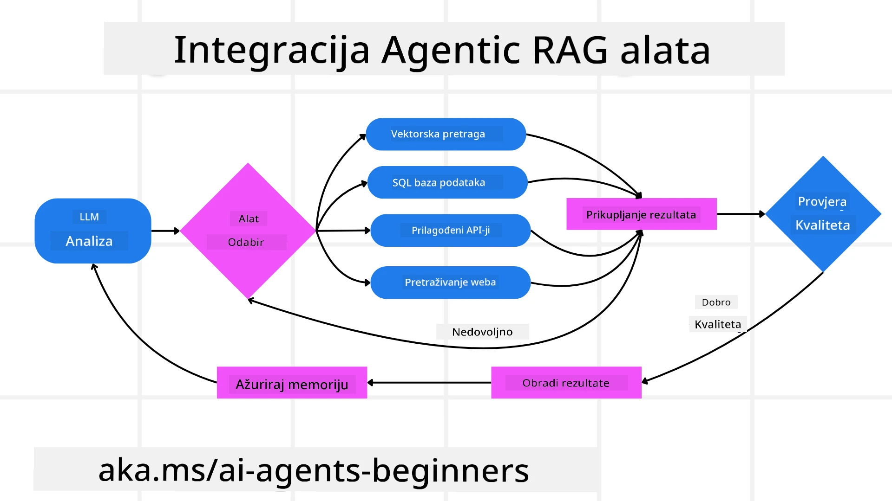
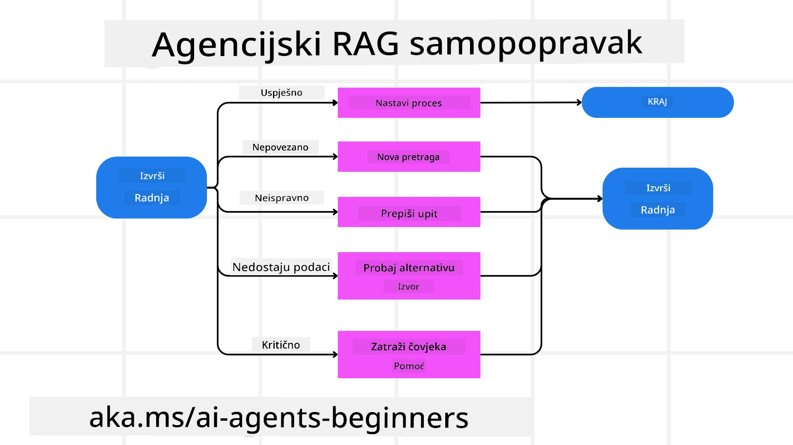
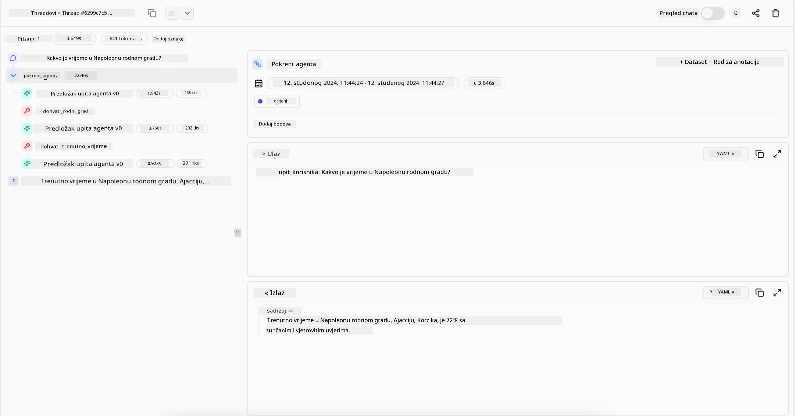

> _(Kliknite na gornju sliku za reproduciranje videa ove lekcije)_

# Agentic RAG

Ova lekcija pruža sveobuhvatan pregled Agentic Retrieval-Augmented Generation (Agentic RAG), novog AI paradigme u kojoj veliki jezični modeli (LLM) samostalno planiraju svoje sljedeće korake dok izvlače informacije iz vanjskih izvora. Za razliku od statičnih obrazaca dohvaćanja i zatim čitanja, Agentic RAG uključuje iterativne pozive LLM-u, izmiješane sa pozivima alata ili funkcija i strukturiranim izlazima. Sustav vrednuje rezultate, usavršava upite, poziva dodatne alate ako je potrebno i nastavlja taj ciklus dok ne postigne zadovoljavajuće rješenje.

## Uvod

Ova lekcija će obuhvatiti

- **Razumijevanje Agentic RAG-a:** Upoznajte se s novom paradigmom u AI-u gdje veliki jezični modeli (LLM) samostalno planiraju svoje sljedeće korake dok izvlače informacije iz vanjskih izvora podataka.
- **Shvaćanje iterativnog Maker-Checker stila:** Razumite petlju iterativnih poziva LLM-u, izmiješanih s pozivima alata ili funkcija i strukturiranim izlazima, dizajniranih za poboljšanje točnosti i rukovanje neispravnim upitima.
- **Istražite praktične primjene:** Identificirajte scenarije u kojima Agentic RAG briljira, poput okruženja u kojima je točnost prioritet, složenih interakcija s bazama podataka i produženih radnih tokova.

## Ciljevi učenja

Nakon dovršetka ove lekcije, znat ćete kako/razumjeti:

- **Razumijevanje Agentic RAG-a:** Upoznajte se s novom paradigmom u AI-u gdje veliki jezični modeli (LLM) samostalno planiraju svoje sljedeće korake dok izvlače informacije iz vanjskih izvora podataka.
- **Iterativni Maker-Checker stil:** Shvatite koncept petlje iterativnih poziva LLM-u, izmiješanih s pozivima alata ili funkcija i strukturiranim izlazima, namijenjenih poboljšanju ispravnosti i rukovanju neispravnim upitima.
- **Posjedovanje procesa rezoniranja:** Razumite sposobnost sustava da posjeduje svoj proces rezoniranja, donoseći odluke o tome kako pristupiti problemima bez oslanjanja na unaprijed definirane putove.
- **Radni tok:** Shvatite kako agentni model samostalno odlučuje dohvatiti izvještaje o tržišnim trendovima, identificirati podatke konkurenata, povezati unutarnje prodajne metrike, sintetizirati nalaze i evaluirati strategiju.
- **Iterativne petlje, integracija alata i memorija:** Naučite o oslanjanju sustava na obrazac interakcije u petlji, održavajući stanje i memoriju kroz korake kako bi izbjegao ponavljajuće petlje i donosio informirane odluke.
- **Rukovanje načinima neuspjeha i samokorekcija:** Istražite robusne mehanizme samokorekcije sustava, uključujući iteriranje i ponovni upit, korištenje dijagnostičkih alata i oslanjanje na ljudski nadzor.
- **Granice agencije:** Shvatite ograničenja Agentic RAG-a, usredotočujući se na domen-specifičnu autonomiju, ovisnost o infrastrukturi i poštivanje ograničenja.
- **Praktični slučajevi uporabe i vrijednost:** Identificirajte scenarije gdje Agentic RAG briljira, poput okruženja s prioritetom na točnost, složenih interakcija s bazama podataka i produženih radnih tokova.
- **Upravljanje, transparentnost i povjerenje:** Naučite o važnosti upravljanja i transparentnosti, uključujući objašnjivo rezoniranje, kontrolu pristranosti i ljudski nadzor.

## Što je Agentic RAG?

Agentic Retrieval-Augmented Generation (Agentic RAG) je nova AI paradigma u kojoj veliki jezični modeli (LLM) samostalno planiraju svoje sljedeće korake dok izvlače informacije iz vanjskih izvora. Za razliku od statičnih obrazaca dohvaćanja i zatim čitanja, Agentic RAG uključuje iterativne pozive LLM-u, izmiješane sa pozivima alata ili funkcija i strukturiranim izlazima. Sustav vrednuje rezultate, usavršava upite, poziva dodatne alate ako je potrebno i nastavlja taj ciklus dok ne postigne zadovoljavajuće rješenje. Ovaj iterativni stil "maker-checker" poboljšava točnost, rukuje neispravnim upitima i osigurava visokokvalitetne rezultate.

Sustav aktivno posjeduje svoj proces rezoniranja, prepisujući neuspjele upite, birajući različite metode dohvaćanja i integrirajući više alata – kao što su vektorsko pretraživanje u Azure AI Search, SQL baze podataka ili prilagođeni API-ji – prije nego što zaključi svoj odgovor. Karakteristična kvaliteta agentnog sustava je njegova sposobnost da posjeduje svoj proces rezoniranja. Tradicionalne RAG implementacije ovise o unaprijed definiranim putevima, dok agentni sustav autonomno određuje niz koraka na temelju kvalitete pronađenih informacija.

## Definiranje Agentic Retrieval-Augmented Generation (Agentic RAG)

Agentic Retrieval-Augmented Generation (Agentic RAG) je nova paradigma u razvoju AI-a gdje LLM-ovi ne samo da izvlače informacije iz vanjskih izvora podataka već i samostalno planiraju svoje sljedeće korake. Za razliku od statičnih obrazaca dohvaćanja i zatim čitanja ili pažljivo skriptiranih nizova upita, Agentic RAG uključuje petlju iterativnih poziva LLM-u, izmiješanih s pozivima alata ili funkcija i strukturiranim izlazima. Na svakom koraku, sustav vrednuje dobivene rezultate, odlučuje treba li usavršiti upite, poziva dodatne alate ako je potrebno i nastavlja taj ciklus dok ne postigne zadovoljavajuće rješenje.

Ovaj iterativni "maker-checker" način rada dizajniran je za poboljšanje točnosti, rukovanje neispravnim upitima prema strukturiranim bazama podataka (npr. NL2SQL) i osiguravanje uravnoteženih, visokokvalitetnih rezultata. Umjesto da se oslanja isključivo na pažljivo izrađene lančane upite, sustav aktivno posjeduje svoj proces rezoniranja. Može prepisivati upite koji ne uspiju, birati različite metode dohvaćanja i integrirati više alata – poput vektorskog pretraživanja u Azure AI Search, SQL baza podataka ili prilagođenih API-ja – prije nego što finalizira odgovor. To uklanja potrebu za previše složenim okvirima orkestracije. Umjesto toga, relativno jednostavna petlja "poziv LLM-u → korištenje alata → poziv LLM-u → …" može proizvesti sofisticirane i dobro utemeljene izlaze.

## Posjedovanje procesa rezoniranja

Karakteristična kvaliteta koja sustav čini "agentnim" je njegova sposobnost da posjeduje svoj proces rezoniranja. Tradicionalne RAG implementacije često ovise o tome da ljudi predefiniraju putanju za model: lanac razmišljanja koji opisuje što treba dohvatiti i kada.
Ali kada je sustav doista agentan, unutarnje odlučuje kako pristupiti problemu. Ne izvršava samo skriptu; autonomno određuje slijed koraka na temelju kvalitete pronađenih informacija.
Na primjer, ako ga se zatraži da stvori strategiju pokretanja proizvoda, ne oslanja se isključivo na upit koji navodi cijeli istraživački i proces donošenja odluka. Umjesto toga, agentni model samostalno odlučuje:

1. Dohvatiti trenutne izvještaje o tržišnim trendovima koristeći Bing Web Grounding
2. Identificirati relevantne podatke konkurenata koristeći Azure AI Search.
3.	Korelirati povijesne interne prodajne metrike koristeći Azure SQL Database.
4. Sintetizirati nalaze u koherentnu strategiju orkestriranu putem Azure OpenAI servisa.
5.	Evaluirati strategiju na prisutnost praznina ili nesukladnosti, po potrebi potaknuti dodatni krug dohvaćanja.
Svi ovi koraci — usavršavanje upita, odabir izvora, ponavljanje dok ne bude "zadovoljan" odgovorom — odlučuje model, a ne unaprijed skriptirani čovjek.

## Iterativne petlje, integracija alata i memorija

Agentni sustav se oslanja na obrazac interakcije u petlji:

- **Početni poziv:** Korisnički cilj (također poznat kao korisnički upit) predstavlja se LLM-u.
- **Pozivanje alata:** Ako model prepozna nedostajuće informacije ili dvosmislene upute, odabire alat ili metodu dohvaćanja — poput upita u vektorskoj bazi podataka (npr. Azure AI Search hibridno pretraživanje preko privatnih podataka) ili strukturirani SQL poziv — kako bi prikupio više konteksta.
- **Procjena i usavršavanje:** Nakon pregleda vraćenih podataka, model odlučuje jesu li informacije dovoljne. Ako nisu, usavršava upit, isprobava drugi alat ili prilagođava svoj pristup.
- **Ponavljanje dok se ne postigne zadovoljstvo:** Ovaj se ciklus nastavlja dok model ne zaključi da ima dovoljno jasnoće i dokaza da bi dao konačni, dobro obrazloženi odgovor.
- **Memorija i stanje:** Budući da sustav održava stanje i memoriju kroz korake, može se sjetiti prethodnih pokušaja i njihovih ishoda, izbjegavajući ponavljajuće petlje i donoseći informiranije odluke tijekom procesa.

S vremenom to stvara osjećaj naprednog razumijevanja, omogućujući modelu da navigira složenim, višekorakovnim zadacima bez potrebe da čovjek stalno intervenirati ili prilagođavati upit.

## Rukovanje načinima neuspjeha i samokorekcija

Autonomija Agentic RAG-a također uključuje robusne mehanizme samokorekcije. Kada sustav naiđe na mrtve točke — poput dohvaćanja irelevantnih dokumenata ili susreta s neispravnim upitima — može:

- **Iterirati i ponovno upitavati:** Umjesto vraćanja odgovora niske vrijednosti, model pokušava nove strategije pretraživanja, prepisuje upite bazama podataka ili pregleda alternativne skupove podataka.
- **Koristiti dijagnostičke alate:** Sustav može pozvati dodatne funkcije osmišljene za pomoć u ispravljanju koraka rezoniranja ili potvrđivanju ispravnosti dohvata podataka. Alati poput Azure AI Tracing važni su za omogućavanje robusne promatranosti i nadzora.
- **Oslanjanje na ljudski nadzor:** Za scenarije visokog rizika ili u slučajevima ponovljenih neuspjeha, model može označiti neizvjesnost i zatražiti ljudsku pomoć. Kada čovjek pruži korektivne povratne informacije, model može uključiti tu lekciju u daljnji rad.

Ovaj iterativni i dinamični pristup daje modelu mogućnost kontinuiranog poboljšanja, osiguravajući da to nije sustav "jedan-put", već onaj koji uči iz svojih pogrešaka tijekom pojedine sesije.

## Granice agencije

Unatoč svojoj autonomiji unutar zadatka, Agentic RAG nije istovjetan Umjetnoj Općoj Inteligenciji. Njegove "agentne" sposobnosti ograničene su na alate, izvore podataka i politike koje osiguravaju ljudski programeri. Ne može samostalno izumiti svoje alate niti izaći iz granica domena koje su postavljene. Umjesto toga, izvrsan je u dinamičnoj orkestraciji dostupnih resursa.
Ključne razlike u odnosu na naprednije oblike AI-a uključuju:

1. **Domena-specifična autonomija:** Agentic RAG sustavi usmjereni su na ostvarenje korisnički definiranih ciljeva unutar poznate domene, koristeći strategije poput prepisivanja upita ili odabira alata za poboljšanje ishoda.
2. **Ovisnost o infrastrukturi:** Mogućnosti sustava ovise o alatima i podacima integriranim od strane programera. Ne može prijeći te granice bez ljudske intervencije.
3. **Poštivanje ograničenja:** Etičke smjernice, pravila usklađenosti i poslovne politike ostaju vrlo važne. Sloboda agenta uvijek je ograničena sigurnosnim mjerama i mehanizmima nadzora (nadamo se?)

## Praktični slučajevi uporabe i vrijednost

Agentic RAG briljira u scenarijima koji zahtijevaju iterativno usavršavanje i preciznost:

1. **Okruženja s primatom točnosti:** U provjerama usklađenosti, regulatornim analizama ili pravnim istraživanjima, agentni model može više puta potvrđivati činjenice, konzultirati više izvora i prepisivati upite dok ne proizvede temeljito provjeren odgovor.
2. **Složene interakcije s bazama podataka:** Kada se radi o strukturiranim podacima gdje upiti mogu često ne uspjeti ili zahtijevati prilagodbu, sustav može samostalno usavršavati svoje upite koristeći Azure SQL ili Microsoft Fabric OneLake, osiguravajući da konačni dohvat bude usklađen s korisničkom namjerom.
3. **Produženi radni tokovi:** Dulje sesije mogu se razvijati kako se pojavljuju nove informacije. Agentic RAG može kontinuirano uključivati nove podatke, mijenjajući strategije dok uči više o problemu.

## Upravljanje, transparentnost i povjerenje

Kako sustavi postaju autonomniji u rezoniranju, upravljanje i transparentnost postaju ključni:

- **Objašnjivo rezoniranje:** Model može pružiti zapisnik upita koje je napravio, izvora koje je konzultirao i koraka rezoniranja koje je poduzeo da bi došao do zaključka. Alati poput Azure AI Content Safety i Azure AI Tracing / GenAIOps pomažu održavati transparentnost i smanjiti rizike.
- **Kontrola pristranosti i uravnoteženi dohvat:** Programeri mogu podesiti strategije dohvaćanja kako bi osigurali da se razmatraju uravnoteženi i reprezentativni izvori podataka te redovito provjeravati rezultate kako bi otkrili pristranosti ili iskrivljene obrasce koristeći prilagođene modele za napredne podatkovne znanstvene organizacije s Azure Machine Learning.
- **Ljudski nadzor i usklađenost:** Za osjetljive zadatke ljudski pregled i dalje je bitan. Agentic RAG ne zamjenjuje ljudsku prosudbu u važnim odlukama – već je nadopunjuje dostavljajući temeljitije provjerene opcije.

Imati alate koji pružaju jasan zapis o radnjama je ključno. Bez njih, otklanjanje pogrešaka u višekoraku može biti vrlo teško. Pogledajte sljedeći primjer iz Literal AI (tvrtka iza Chainlit) za pokretanje agenta:

## Zaključak

Agentic RAG predstavlja prirodnu evoluciju u načinu na koji AI sustavi rukuju složenim, podatcima intenzivnim zadacima. Usvajanjem obrasca ponavljajuće interakcije, autonomnim odabirom alata i usavršavanjem upita dok se ne postigne visokokvalitetni rezultat, sustav prelazi granice statičnog praćenja upita u prilagodljivijeg, osviještenijeg donositelja odluka. Iako su još uvijek ograničeni na infrastrukture i etičke smjernice definirane od strane ljudi, ove agentne sposobnosti omogućuju bogatije, dinamičnije i na kraju korisnije AI interakcije za poduzeća i krajnje korisnike.

### Imate li dodatnih pitanja o Agentic RAG-u?

Pridružite se [Microsoft Foundry Discord](https://discord.com/invite/ATgtXmAS5D) kako biste se upoznali s drugim učenicima, pohađali konzultacije i dobili odgovore na pitanja o AI agentima.

## Dodatni resursi

- <a href="https://learn.microsoft.com/training/modules/use-own-data-azure-openai" target="_blank">Implementacija Retrieval Augmented Generation (RAG) s Azure OpenAI servisom: Naučite kako koristiti vlastite podatke s Azure OpenAI servisom. Ovaj Microsoft Learn modul pruža sveobuhvatan vodič o implementaciji RAG-a</a>
- <a href="https://learn.microsoft.com/azure/ai-studio/concepts/evaluation-approach-gen-ai" target="_blank">Evaluacija generativnih AI aplikacija s Microsoft Foundry: Ovaj članak pokriva evaluaciju i usporedbu modela na javno dostupnim skupovima podataka, uključujući Agentic AI aplikacije i RAG arhitekture</a>
- <a href="https://weaviate.io/blog/what-is-agentic-rag" target="_blank">Što je Agentic RAG | Weaviate</a>
- <a href="https://ragaboutit.com/agentic-rag-a-complete-guide-to-agent-based-retrieval-augmented-generation/" target="_blank">Agentic RAG: Kompletan vodič za agentno zasnovano Retrieval Augmented Generation – Novosti iz generacije RAG</a>

- <a href="https://huggingface.co/learn/cookbook/agent_rag" target="_blank">Agentic RAG: pojačajte svoj RAG reformulacijom upita i samostalnim upitom! Hugging Face Open-Source AI Cookbook</a>
- <a href="https://youtu.be/aQ4yQXeB1Ss?si=2HUqBzHoeB5tR04U" target="_blank">Dodavanje agentskih slojeva RAG-u</a>
- <a href="https://www.youtube.com/watch?v=zeAyuLc_f3Q&t=244s" target="_blank">Budućnost asistenata za znanje: Jerry Liu</a>
- <a href="https://www.youtube.com/watch?v=AOSjiXP1jmQ" target="_blank">Kako izgraditi agentske RAG sustave</a>
- <a href="https://ignite.microsoft.com/sessions/BRK102?source=sessions" target="_blank">Korištenje Microsoft Foundry Agent Service za skaliranje vaših AI agenata</a>

### Akademski radovi

- <a href="https://arxiv.org/abs/2303.17651" target="_blank">2303.17651 Self-Refine: iterativno usavršavanje sa samopovratnom informacijom</a>
- <a href="https://arxiv.org/abs/2303.11366" target="_blank">2303.11366 Reflexion: jezični agenti s verbalnim učenjem pojačanja</a>
- <a href="https://arxiv.org/abs/2305.11738" target="_blank">2305.11738 CRITIC: veliki jezični modeli mogu se samostalno ispraviti interaktivnim kritikama alata</a>
- <a href="https://arxiv.org/abs/2501.09136" target="_blank">2501.09136 Agentic Retrieval-Augmented Generation: pregled agencijskog RAG-a</a>

## Prethodni lekcija

[Dizajnerski uzorak korištenja alata](../04-tool-use/README.md)

## Sljedeća lekcija

[Izgradnja pouzdanih AI agenata](../06-building-trustworthy-agents/README.md)

---

<!-- CO-OP TRANSLATOR DISCLAIMER START -->
**Napomena**:
Ovaj dokument je preveden korištenjem AI prevoditeljskog servisa [Co-op Translator](https://github.com/Azure/co-op-translator). Iako težimo točnosti, imajte na umu da automatski prijevodi mogu sadržavati greške ili netočnosti. Izvorni dokument na izvornom jeziku treba smatrati autoritativnim izvorom. Za važne informacije preporuča se profesionalni ljudski prijevod. Nismo odgovorni za bilo kakva nesporazumevanja ili pogrešne interpretacije koje proizlaze iz korištenja ovog prijevoda.
<!-- CO-OP TRANSLATOR DISCLAIMER END -->