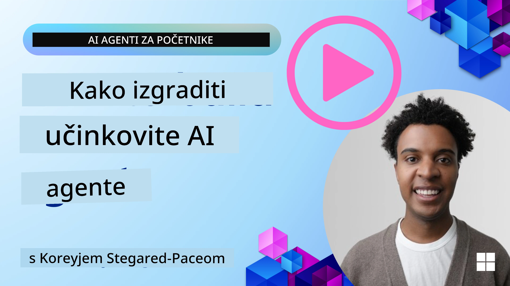
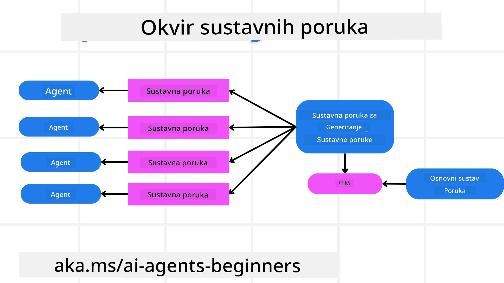
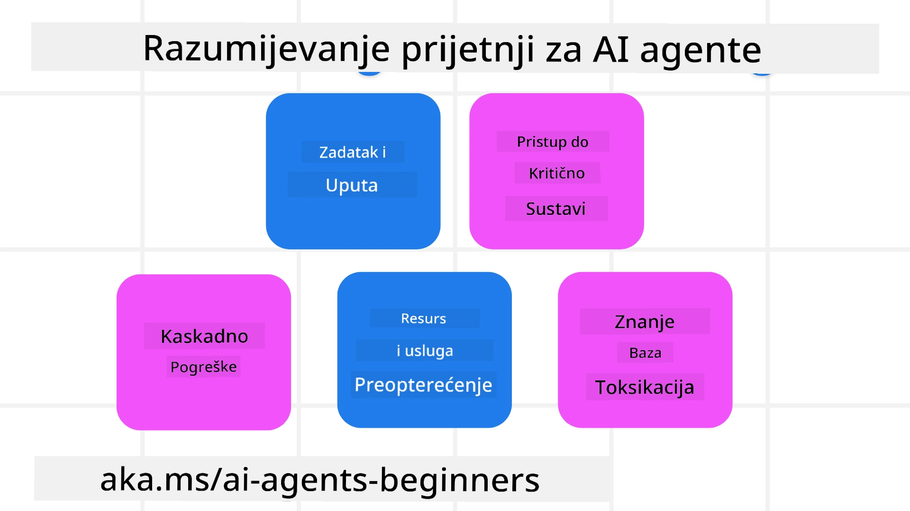
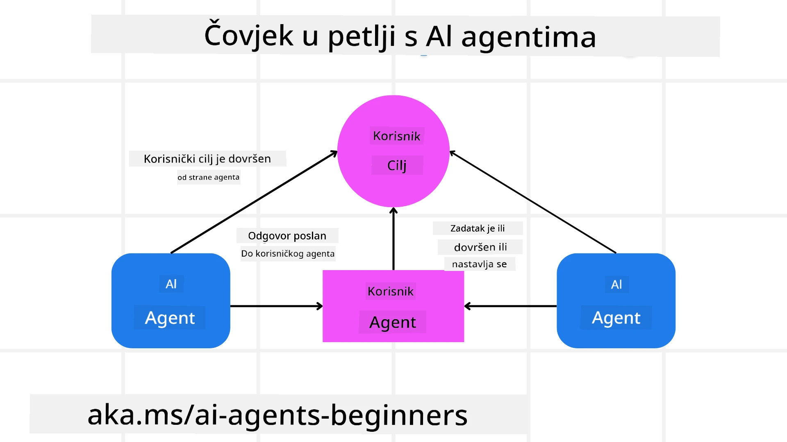

[](https://youtu.be/iZKkMEGBCUQ?si=Q-kEbcyHUMPoHp8L)

> _(Kliknite sliku iznad za pregled videa ove lekcije)_

# Izgradnja pouzdanih AI agenata

## Uvod

Ova lekcija će obuhvatiti:

- Kako izgraditi i postaviti sigurne i učinkovite AI agente
- Važne sigurnosne aspekte pri razvoju AI agenata
- Kako održavati privatnost podataka i korisnika pri razvoju AI agenata

## Ciljevi učenja

Nakon završetka ove lekcije, znat ćete kako:

- Identificirati i ublažiti rizike prilikom stvaranja AI agenata
- Implementirati sigurnosne mjere kako bi se osiguralo pravilno upravljanje podacima i pristupom
- Kreirati AI agente koji održavaju privatnost podataka i pružaju kvalitetno korisničko iskustvo

## Sigurnost

Prvo pogledajmo izgradnju sigurnih agentskih aplikacija. Sigurnost znači da AI agent radi kako je osmišljen. Kao tvorci agentskih aplikacija, imamo metode i alate za maksimiziranje sigurnosti:

### Izrada okvira za sistemske poruke

Ako ste ikada izgradili AI aplikaciju koristeći velike jezične modele (LLM), znate koliko je važno dizajnirati robusni sistemski prompt ili sistemsku poruku. Ti promptovi uspostavljaju meta pravila, upute i smjernice za to kako će LLM komunicirati s korisnikom i podacima.

Za AI agente, sistemski prompt je još važniji jer će AI agenti trebati vrlo specifične upute za dovršavanje zadataka koje smo im zadali.

Kako bismo stvorili skalabilne sistemske promptove, možemo koristiti okvir sistemske poruke za izgradnju jednog ili više agenata u našoj aplikaciji:



#### Korak 1: Kreirajte meta sistemsku poruku 

Meta prompt će koristiti LLM za generiranje sistemskih promptova za agente koje kreiramo. Dizajniramo ga kao predložak kako bismo mogli učinkovito napraviti više agenata po potrebi.

Evo primjera meta sistemske poruke koju bismo dali LLM-u:

```plaintext
You are an expert at creating AI agent assistants. 
You will be provided a company name, role, responsibilities and other
information that you will use to provide a system prompt for.
To create the system prompt, be descriptive as possible and provide a structure that a system using an LLM can better understand the role and responsibilities of the AI assistant. 
```

#### Korak 2: Kreirajte osnovni prompt

Sljedeći korak je kreiranje osnovnog prompta za opis AI agenta. Trebali biste uključiti ulogu agenta, zadatke koje će agent izvršavati i bilo koje druge odgovornosti agenta.

Evo primjera:

```plaintext
You are a travel agent for Contoso Travel that is great at booking flights for customers. To help customers you can perform the following tasks: lookup available flights, book flights, ask for preferences in seating and times for flights, cancel any previously booked flights and alert customers on any delays or cancellations of flights.  
```

#### Korak 3: Pružite osnovnu sistemsku poruku LLM-u

Sada možemo optimizirati ovu sistemsku poruku tako da damo meta sistemsku poruku kao sistemsku poruku i naš osnovni sistemski prompt.

To će proizvesti sistemsku poruku koja je bolje dizajnirana za vođenje naših AI agenata:

```markdown
**Company Name:** Contoso Travel  
**Role:** Travel Agent Assistant

**Objective:**  
You are an AI-powered travel agent assistant for Contoso Travel, specializing in booking flights and providing exceptional customer service. Your main goal is to assist customers in finding, booking, and managing their flights, all while ensuring that their preferences and needs are met efficiently.

**Key Responsibilities:**

1. **Flight Lookup:**
    
    - Assist customers in searching for available flights based on their specified destination, dates, and any other relevant preferences.
    - Provide a list of options, including flight times, airlines, layovers, and pricing.
2. **Flight Booking:**
    
    - Facilitate the booking of flights for customers, ensuring that all details are correctly entered into the system.
    - Confirm bookings and provide customers with their itinerary, including confirmation numbers and any other pertinent information.
3. **Customer Preference Inquiry:**
    
    - Actively ask customers for their preferences regarding seating (e.g., aisle, window, extra legroom) and preferred times for flights (e.g., morning, afternoon, evening).
    - Record these preferences for future reference and tailor suggestions accordingly.
4. **Flight Cancellation:**
    
    - Assist customers in canceling previously booked flights if needed, following company policies and procedures.
    - Notify customers of any necessary refunds or additional steps that may be required for cancellations.
5. **Flight Monitoring:**
    
    - Monitor the status of booked flights and alert customers in real-time about any delays, cancellations, or changes to their flight schedule.
    - Provide updates through preferred communication channels (e.g., email, SMS) as needed.

**Tone and Style:**

- Maintain a friendly, professional, and approachable demeanor in all interactions with customers.
- Ensure that all communication is clear, informative, and tailored to the customer's specific needs and inquiries.

**User Interaction Instructions:**

- Respond to customer queries promptly and accurately.
- Use a conversational style while ensuring professionalism.
- Prioritize customer satisfaction by being attentive, empathetic, and proactive in all assistance provided.

**Additional Notes:**

- Stay updated on any changes to airline policies, travel restrictions, and other relevant information that could impact flight bookings and customer experience.
- Use clear and concise language to explain options and processes, avoiding jargon where possible for better customer understanding.

This AI assistant is designed to streamline the flight booking process for customers of Contoso Travel, ensuring that all their travel needs are met efficiently and effectively.

```

#### Korak 4: Ponavljajte i poboljšavajte

Vrijednost ovog okvira sistemske poruke je u mogućnosti skalirati stvaranje sistemskih poruka za više agenata lakše, kao i poboljšavati vaše sistemske poruke tijekom vremena. Rijetko ćete imati sistemsku poruku koja će raditi iz prve za vaš cjelokupni slučaj upotrebe. Mogućnost napraviti male izmjene i poboljšanja promjenom osnovne sistemske poruke i pokretanjem kroz sustav omogućit će vam usporedbu i procjenu rezultata.

## Razumijevanje prijetnji

Da biste izgradili pouzdane AI agente, važno je razumjeti i ublažiti rizike i prijetnje za vaš AI agent. Pogledajmo samo neke od različitih prijetnji AI agentima i kako se bolje planirati i pripremiti za njih.



### Zadatak i upute

**Opis:** Napadači pokušavaju promijeniti upute ili ciljeve AI agenta putem promptanja ili manipulacije ulazima.

**Ublažavanje**: Izvršite provjere valjanosti i filtre ulaza kako biste otkrili potencijalno opasne promptove prije nego što ih AI agent obradi. Budući da ovi napadi obično zahtijevaju čestu interakciju s agentom, ograničavanje broja krugova u razgovoru još je jedan način za sprječavanje ovakvih napada.

### Pristup kritičnim sustavima

**Opis**: Ako AI agent ima pristup sustavima i servisima koji pohranjuju osjetljive podatke, napadači mogu kompromitirati komunikaciju između agenta i tih servisa. To mogu biti izravni napadi ili neizravni pokušaji dobivanja informacija o tim sustavima preko agenta.

**Ublažavanje**: AI agenti bi trebali imati pristup sustavima samo kada je potreban kako bi se spriječile ovakve vrste napada. Komunikacija između agenta i sustava također bi trebala biti sigurna. Implementacija autentikacije i kontrole pristupa još je jedan način zaštite tih informacija.

### Preopterećenje resursa i usluga

**Opis:** AI agenti mogu pristupiti različitim alatima i servisima kako bi izvršili zadatke. Napadači mogu iskoristiti ovu sposobnost kako bi napali te servise slanjem velikog broja zahtjeva preko AI agenta, što može dovesti do kvarova sustava ili visokih troškova.

**Ublažavanje:** Implementirajte politike za ograničavanje broja zahtjeva koje AI agent može uputiti servisu. Ograničavanje broja krugova u razgovoru i zahtjeva prema vašem AI agentu još je jedan način sprječavanja ovih tipova napada.

### Zatrovanje baze znanja

**Opis:** Ova vrsta napada ne cilja izravno AI agenta, već bazu znanja i druge servise koje će AI agent koristiti. To može uključivati kvarenje podataka ili informacija koje će AI agent koristiti za dovršavanje zadatka, što vodi do pristranih ili neželjenih odgovora korisniku.

**Ublažavanje:** Redovito provjeravajte podatke koje će AI agent koristiti u svojim tokovima rada. Osigurajte da je pristup tim podacima siguran i da ih mijenjaju samo pouzdane osobe kako biste izbjegli ovu vrstu napada.

### Kaskadne pogreške

**Opis:** AI agenti pristupaju raznim alatima i servisima za dovršavanje zadataka. Pogreške uzrokovane napadačima mogu dovesti do kvarova drugih sustava s kojima je AI agent povezan, uzrokujući da napad postane rašireniji i teži za otklanjanje.

**Ublažavanje**: Jedna metoda za izbjegavanje toga je da AI agent radi u ograničenom okruženju, na primjer izvršavajući zadatke u Docker kontejneru, kako bi se spriječili izravni napadi na sustav. Kreiranje mehanizama za rezervno rješenje i logike ponovnog pokušaja kada određeni sustavi odgovore pogreškom još je jedan način za sprječavanje većih kvarova sustava.

## Čovjek u petlji

Još jedan učinkovit način izgradnje pouzdanih sustava AI agenata je korištenje čovjeka u petlji. To stvara tok u kojem korisnici mogu pružiti povratne informacije agentima tijekom izvođenja. Korisnici u biti djeluju kao agenti u sustavu s više agenata i daju odobrenje ili prekidaju proces koji se izvodi.



Evo isječka koda koji koristi Microsoft Agent Framework kako bi pokazao kako je ovaj koncept implementiran:

```python
import os
from agent_framework.azure import AzureAIProjectAgentProvider
from azure.identity import AzureCliCredential

# Kreiraj pružatelja s odobrenjem uz ljudski nadzor
provider = AzureAIProjectAgentProvider(
    credential=AzureCliCredential(),
)

# Kreiraj agenta s korakom ljudskog odobrenja
response = provider.create_response(
    input="Write a 4-line poem about the ocean.",
    instructions="You are a helpful assistant. Ask for user approval before finalizing.",
)

# Korisnik može pregledati i odobriti odgovor
print(response.output_text)
user_input = input("Do you approve? (APPROVE/REJECT): ")
if user_input == "APPROVE":
    print("Response approved.")
else:
    print("Response rejected. Revising...")
```

## Zaključak

Izgradnja pouzdanih AI agenata zahtijeva pažljiv dizajn, robusne sigurnosne mjere i kontinuirano ponavljanje. Implementacijom strukturiranih meta-prompt sustava, razumijevanjem potencijalnih prijetnji i primjenom strategija ublažavanja, programeri mogu stvoriti AI agente koji su i sigurni i učinkoviti. Dodatno, uključivanje čovjeka u petlju osigurava da AI agenti ostanu usklađeni s potrebama korisnika uz minimiziranje rizika. Kako se AI nastavlja razvijati, održavanje proaktivnog pristupa sigurnosti, privatnosti i etičkim razmatranjima bit će ključno za poticanje povjerenja i pouzdanosti u sustavima koje pokreće AI.

### Imate li dodatnih pitanja o izgradnji pouzdanih AI agenata?

Pridružite se [Microsoft Foundry Discord](https://aka.ms/ai-agents/discord) kako biste susreli druge učenike, prisustvovali konzultacijama i dobili odgovore na pitanja o svojim AI agentima.

## Dodatni resursi

- <a href="https://learn.microsoft.com/azure/ai-studio/responsible-use-of-ai-overview" target="_blank">Pregled odgovornog AI-a</a>
- <a href="https://learn.microsoft.com/azure/ai-studio/concepts/evaluation-approach-gen-ai" target="_blank">Procjena generativnih AI modela i AI aplikacija</a>
- <a href="https://learn.microsoft.com/azure/ai-services/openai/concepts/system-message?context=%2Fazure%2Fai-studio%2Fcontext%2Fcontext&tabs=top-techniques" target="_blank">Sigurnosne sistemske poruke</a>
- <a href="https://blogs.microsoft.com/wp-content/uploads/prod/sites/5/2022/06/Microsoft-RAI-Impact-Assessment-Template.pdf?culture=en-us&country=us" target="_blank">Predložak procjene rizika</a>

## Prethodna lekcija

[Agentic RAG](../05-agentic-rag/README.md)

## Sljedeća lekcija

[Obrazac dizajna planiranja](../07-planning-design/README.md)

---

<!-- CO-OP TRANSLATOR DISCLAIMER START -->
**Odricanje odgovornosti**:
Ovaj dokument je preveden korištenjem AI usluge za prevođenje [Co-op Translator](https://github.com/Azure/co-op-translator). Iako nastojimo postići točnost, imajte na umu da automatizirani prijevodi mogu sadržavati pogreške ili netočnosti. Izvorni dokument na izvornom jeziku treba smatrati mjerodavnim. Za kritične informacije preporučuje se profesionalni ljudski prijevod. Ne snosimo odgovornost za bilo kakve nesporazume ili pogrešne interpretacije koje proizlaze iz korištenja ovog prijevoda.
<!-- CO-OP TRANSLATOR DISCLAIMER END -->