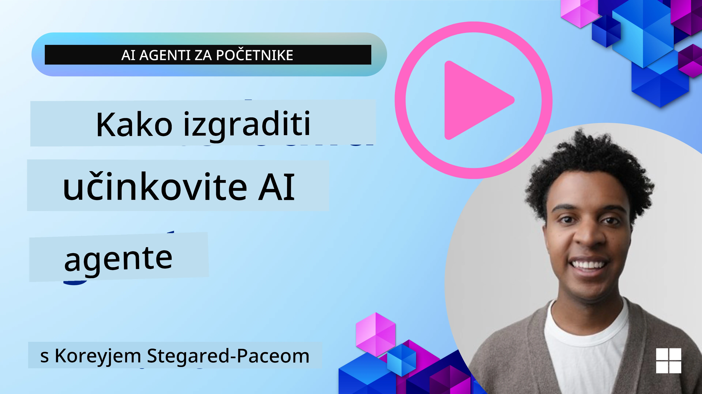
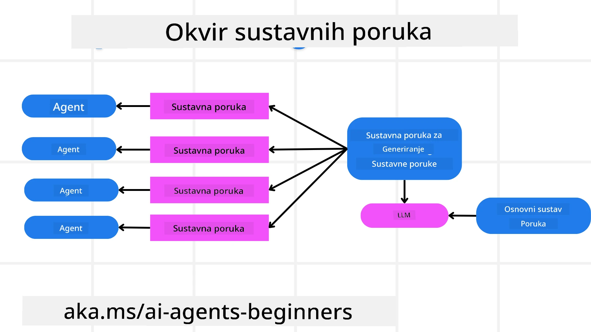
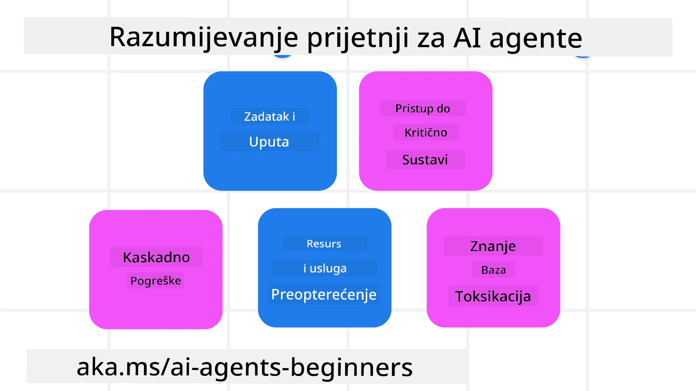
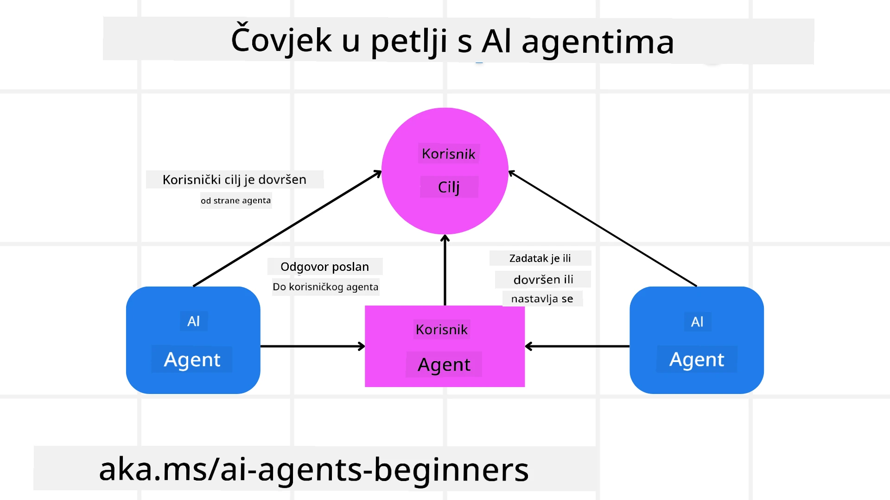

[](https://youtu.be/iZKkMEGBCUQ?si=Q-kEbcyHUMPoHp8L)

> _(Kliknite na sliku iznad za pregled videa ovog poglavlja)_

# Izgradnja pouzdanih AI agenata

## Uvod

Ovo poglavlje će obraditi:

- Kako izgraditi i implementirati sigurne i učinkovite AI agente
- Važne sigurnosne aspekte pri razvoju AI agenata
- Kako održavati privatnost podataka i korisnika pri razvoju AI agenata

## Ciljevi učenja

Nakon završetka ovog poglavlja, znat ćete kako:

- Prepoznati i ublažiti rizike pri stvaranju AI agenata
- Provoditi sigurnosne mjere kako bi se osiguralo pravilno upravljanje podacima i pristupom
- Stvarati AI agente koji čuvaju privatnost podataka i pružaju kvalitetno korisničko iskustvo

## Sigurnost

Prvo pogledajmo izgradnju sigurnih agentskih aplikacija. Sigurnost znači da AI agent djeluje kako je dizajniran. Kao graditelji agentskih aplikacija, imamo metode i alate za maksimiziranje sigurnosti:

### Izgradnja okvira za sistemsku poruku

Ako ste ikada gradili AI aplikaciju koristeći Velike jezične modele (LLM), znate koliko je važno osmisliti robusni sistemski prompt ili sistemsku poruku. Ti promptovi uspostavljaju meta pravila, upute i smjernice za način na koji će LLM komunicirati s korisnikom i podacima.

Za AI agente, sistemski prompt je još važniji jer AI agenti trebaju vrlo specifične upute za izvršavanje zadataka koje smo im dodijelili.

Da bismo kreirali skalabilne sistemske promptove, možemo koristiti okvir sistemske poruke za izgradnju jednog ili više agenata u našoj aplikaciji:



#### Korak 1: Izradite meta sistemsku poruku

Meta prompt će koristiti LLM za generiranje sistemskih promptova za agente koje stvaramo. Dizajniramo ga kao predložak kako bismo učinkovito mogli kreirati više agenata po potrebi.

Evo primjera meta sistemske poruke koju bismo dali LLM-u:

```plaintext
You are an expert at creating AI agent assistants. 
You will be provided a company name, role, responsibilities and other
information that you will use to provide a system prompt for.
To create the system prompt, be descriptive as possible and provide a structure that a system using an LLM can better understand the role and responsibilities of the AI assistant. 
```

#### Korak 2: Izradite osnovni prompt

Sljedeći korak je izraditi osnovni prompt za opis AI agenta. Trebali biste uključiti ulogu agenta, zadatke koje agent treba izvršiti i ostale odgovornosti agenta.

Evo primjera:

```plaintext
You are a travel agent for Contoso Travel that is great at booking flights for customers. To help customers you can perform the following tasks: lookup available flights, book flights, ask for preferences in seating and times for flights, cancel any previously booked flights and alert customers on any delays or cancellations of flights.  
```

#### Korak 3: Pružite osnovnu sistemsku poruku LLM-u

Sada možemo optimizirati ovu sistemsku poruku tako da meta sistemsku poruku pružimo kao sistemsku poruku zajedno s našom osnovnom sistemskom porukom.

Ovo će proizvesti sistemsku poruku koja je bolje dizajnirana za vođenje naših AI agenata:

```markdown
**Company Name:** Contoso Travel  
**Role:** Travel Agent Assistant

**Objective:**  
You are an AI-powered travel agent assistant for Contoso Travel, specializing in booking flights and providing exceptional customer service. Your main goal is to assist customers in finding, booking, and managing their flights, all while ensuring that their preferences and needs are met efficiently.

**Key Responsibilities:**

1. **Flight Lookup:**
    
    - Assist customers in searching for available flights based on their specified destination, dates, and any other relevant preferences.
    - Provide a list of options, including flight times, airlines, layovers, and pricing.
2. **Flight Booking:**
    
    - Facilitate the booking of flights for customers, ensuring that all details are correctly entered into the system.
    - Confirm bookings and provide customers with their itinerary, including confirmation numbers and any other pertinent information.
3. **Customer Preference Inquiry:**
    
    - Actively ask customers for their preferences regarding seating (e.g., aisle, window, extra legroom) and preferred times for flights (e.g., morning, afternoon, evening).
    - Record these preferences for future reference and tailor suggestions accordingly.
4. **Flight Cancellation:**
    
    - Assist customers in canceling previously booked flights if needed, following company policies and procedures.
    - Notify customers of any necessary refunds or additional steps that may be required for cancellations.
5. **Flight Monitoring:**
    
    - Monitor the status of booked flights and alert customers in real-time about any delays, cancellations, or changes to their flight schedule.
    - Provide updates through preferred communication channels (e.g., email, SMS) as needed.

**Tone and Style:**

- Maintain a friendly, professional, and approachable demeanor in all interactions with customers.
- Ensure that all communication is clear, informative, and tailored to the customer's specific needs and inquiries.

**User Interaction Instructions:**

- Respond to customer queries promptly and accurately.
- Use a conversational style while ensuring professionalism.
- Prioritize customer satisfaction by being attentive, empathetic, and proactive in all assistance provided.

**Additional Notes:**

- Stay updated on any changes to airline policies, travel restrictions, and other relevant information that could impact flight bookings and customer experience.
- Use clear and concise language to explain options and processes, avoiding jargon where possible for better customer understanding.

This AI assistant is designed to streamline the flight booking process for customers of Contoso Travel, ensuring that all their travel needs are met efficiently and effectively.

```

#### Korak 4: Iterirajte i poboljšavajte

Vrijednost ovog okvira sistemskih poruka je u tome da možemo skalirati stvaranje sistemskih poruka za više agenata te poboljšavati svoje sistemske poruke tijekom vremena. Rijetko ćete imati sistemsku poruku koja odmah savršeno radi za vaš slučaj upotrebe. Mogućnost da pravite male izmjene i poboljšanja mijenjajući osnovnu sistemsku poruku i prolazeći je kroz sustav omogućuje vam usporedbu i evaluaciju rezultata.

## Razumijevanje prijetnji

Za izgradnju pouzdanih AI agenata važno je razumjeti i ublažiti rizike i prijetnje za vašeg AI agenta. Pogledajmo samo neke od različitih prijetnji za AI agente i kako se bolje možete pripremiti i planirati za njih.



### Zadatak i upute

**Opis:** Napadači pokušavaju izmijeniti upute ili ciljeve AI agenta kroz promptove ili manipulaciju ulaza.

**Ublažavanje:** Izvršite provjere valjanosti i filtre ulaza kako biste otkrili potencijalno opasne promptove prije nego ih AI agent obradi. Budući da ti napadi obično zahtijevaju čestu interakciju s agentom, ograničavanje broja krugova u razgovoru je još jedan način za sprječavanje ovakvih napada.

### Pristup kritičnim sustavima

**Opis:** Ako AI agent ima pristup sustavima i uslugama koje pohranjuju osjetljive podatke, napadači mogu kompromitirati komunikaciju između agenta i tih usluga. To mogu biti direktni napadi ili indirektni pokušaji dobivanja informacija o tim sustavima preko agenta.

**Ublažavanje:** AI agenti trebaju pristup sustavima samo kada je neophodno kako bi se spriječili takvi napadi. Komunikacija između agenta i sustava također treba biti sigurna. Implementacija autentikacije i kontrole pristupa je još jedan način zaštite ovih informacija.

### Preopterećenje resursa i usluga

**Opis:** AI agenti mogu pristupiti različitim alatima i uslugama za izvršavanje zadataka. Napadači mogu iskoristiti ovu sposobnost za napad na te usluge slanjem velike količine zahtjeva kroz AI agenta, što može rezultirati kvarom sustava ili visokim troškovima.

**Ublažavanje:** Uvedite politike za ograničavanje broja zahtjeva koje AI agent može poslati usluzi. Ograničavanje broja krugova razgovora i zahtjeva prema vašem AI agentu također je način za sprječavanje ovakvih napada.

### Trovanje baze znanja

**Opis:** Ova vrsta napada nije usmjerena direktno na AI agenta, već na bazu znanja i druge usluge koje AI agent koristi. To može uključivati korumpiranje podataka ili informacija koje AI agent koristi za izvršavanje zadataka, što može dovesti do pristranih ili neželjenih odgovora korisniku.

**Ublažavanje:** Redovito provjeravajte podatke koje AI agent koristi u svojim tijekovima rada. Osigurajte da je pristup tim podacima siguran i da ih mijenjaju samo pouzdane osobe kako biste spriječili ovu vrstu napada.

### Lančane greške

**Opis:** AI agenti pristupaju različitim alatima i uslugama da bi izvršili zadatke. Greške uzrokovane napadačima mogu dovesti do kvara drugih sustava s kojima je AI agent povezan, čineći napad raširenijim i težim za otklanjanje.

**Ublažavanje:** Jedan je pristup omogućiti AI agentu rad u ograničenom okruženju, kao što je izvođenje zadataka u Docker kontejneru, kako bi se spriječili direktni napadi na sustav. Izrada mehanizama povratka i logike ponovnog pokušaja kad neki sustavi vrate grešku je još jedan način sprječavanja većih kvarova sustava.

## Čovjek u petlji

Još jedan učinkovit način za izgradnju pouzdanih sustava AI agenata je korištenje čovjeka u petlji. Ovo stvara tok u kojem korisnici mogu dati povratnu informaciju agentima tijekom rada. Korisnici zapravo djeluju kao agenti u multi-agentnom sustavu dajući odobrenje ili prekidaju tijek rada.



Evo isječak koda koji koristi Microsoft Agent Framework za prikaz kako se ovaj koncept implementira:

```python
import os
from agent_framework.foundry import FoundryChatClient
from azure.identity import AzureCliCredential

# Kreirajte davatelja usluge s odobrenjem čovjeka u petlji
provider = FoundryChatClient(
    project_endpoint=os.environ["AZURE_AI_PROJECT_ENDPOINT"],
    model=os.environ["AZURE_AI_MODEL_DEPLOYMENT_NAME"],
    credential=AzureCliCredential(),
)

# Kreirajte agenta s korakom odobrenja čovjeka
response = provider.create_response(
    input="Write a 4-line poem about the ocean.",
    instructions="You are a helpful assistant. Ask for user approval before finalizing.",
)

# Korisnik može pregledati i odobriti odgovor
print(response.output_text)
user_input = input("Do you approve? (APPROVE/REJECT): ")
if user_input == "APPROVE":
    print("Response approved.")
else:
    print("Response rejected. Revising...")
```

## Zaključak

Izgradnja pouzdanih AI agenata zahtijeva pažljiv dizajn, robusne sigurnosne mjere i kontinuiranu iteraciju. Implementacijom strukturiranih meta prompt sustava, razumijevanjem mogućih prijetnji i primjenom strategija ublažavanja, programeri mogu stvoriti AI agente koji su sigurni i učinkoviti. Dodatno, uključivanje čovjeka u petlju osigurava da AI agenti ostanu usklađeni s potrebama korisnika uz minimaliziranje rizika. Kako AI nastavlja s razvojem, održavanje proaktivnog pristupa sigurnosti, privatnosti i etičkim pitanjima bit će ključ za izgradnju povjerenja i pouzdanosti u AI sustavima.

## Primjeri koda

- [`code_samples/06-system-message-framework.ipynb`](code_samples/06-system-message-framework.ipynb): Demonstracija korak-po-korak okvira sistema meta promptova.
- [`code_samples/06-human-in-the-loop.ipynb`](code_samples/06-human-in-the-loop.ipynb): Pre-action odobrenje, rangiranje rizika i zapisivanje revizija za pouzdane agente.

### Imate li dodatnih pitanja o izgradnji pouzdanih AI agenata?

Pridružite se [Microsoft Foundry Discord](https://discord.com/invite/ATgtXmAS5D) zajednici kako biste se povezali s drugim učenicima, sudjelovali na radnim satima i dobili odgovore na pitanja o AI agentima.

## Dodatni resursi

- <a href="https://learn.microsoft.com/azure/ai-studio/responsible-use-of-ai-overview" target="_blank">Pregled odgovornog korištenja AI</a>
- <a href="https://learn.microsoft.com/azure/ai-studio/concepts/evaluation-approach-gen-ai" target="_blank">Evaluacija generativnih AI modela i AI aplikacija</a>
- <a href="https://learn.microsoft.com/azure/ai-services/openai/concepts/system-message?context=%2Fazure%2Fai-studio%2Fcontext%2Fcontext&tabs=top-techniques" target="_blank">Sigurnosne sistemske poruke</a>
- <a href="https://blogs.microsoft.com/wp-content/uploads/prod/sites/5/2022/06/Microsoft-RAI-Impact-Assessment-Template.pdf?culture=en-us&country=us" target="_blank">Predložak procjene rizika</a>

## Prethodno poglavlje

[Agentic RAG](../05-agentic-rag/README.md)

## Sljedeće poglavlje

[Dizajn obrasca planiranja](../07-planning-design/README.md)

---

<!-- CO-OP TRANSLATOR DISCLAIMER START -->
**Napomena**:
Ovaj dokument je preveden korištenjem AI prevoditeljskog servisa [Co-op Translator](https://github.com/Azure/co-op-translator). Iako težimo točnosti, imajte na umu da automatski prijevodi mogu sadržavati greške ili netočnosti. Izvorni dokument na izvornom jeziku treba smatrati autoritativnim izvorom. Za važne informacije preporuča se profesionalni ljudski prijevod. Nismo odgovorni za bilo kakva nesporazumevanja ili pogrešne interpretacije koje proizlaze iz korištenja ovog prijevoda.
<!-- CO-OP TRANSLATOR DISCLAIMER END -->