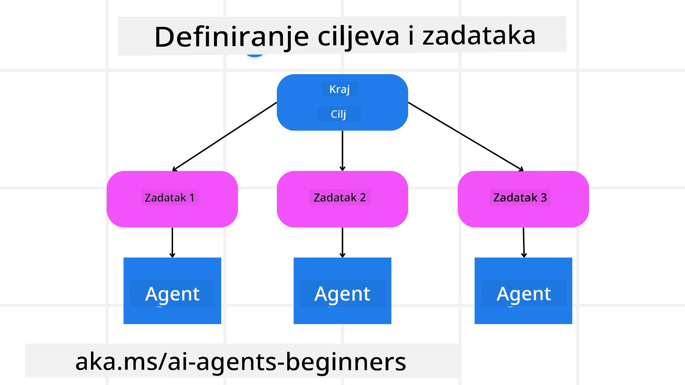

[](https://youtu.be/kPfJ2BrBCMY?si=9pYpPXp0sSbK91Dr)

> _(Kliknite sliku iznad da pogledate video ove lekcije)_

# Dizajn planiranja

## Uvod

Ova lekcija će obuhvatiti

* Definiranje jasnog ukupnog cilja i razbijanje složenog zadatka na upravljive zadatke.
* Korištenje strukturiranog izlaza za pouzdanije i strojno čitljive odgovore.
* Primjena pristupa vođenog događajima za upravljanje dinamičkim zadacima i neočekivanim ulazima.

## Ciljevi učenja

Nakon završetka ove lekcije, razumjet ćete sljedeće:

* Identificirati i postaviti ukupni cilj za AI agenta, osiguravajući da jasno zna što treba postići.
* Razložiti složen zadatak na upravljive podzadatke i organizirati ih u logičan redoslijed.
* Opremljivanje agenata odgovarajućim alatima (npr. alati za pretraživanje ili alati za analizu podataka), odlučivanje kada i kako ih koristiti te rješavanje neočekivanih situacija koje nastanu.
* Procijeniti rezultate podzadatka, mjeriti izvedbu i iterativno prilagođavati postupke kako bi se poboljšao konačni rezultat.

## Definiranje ukupnog cilja i razbijanje zadatka



Većina zadataka u stvarnom svijetu je previše složena za rješavanje u jednom koraku. AI agent treba sažet cilj koji će usmjeravati njegovo planiranje i djelovanje. Na primjer, razmotrite cilj:

    "Generirajte trodnevni plan putovanja."

Iako ga je jednostavno formulirati, još uvijek treba razraditi. Što je cilj jasnije definiran, to se agent (i bilo koji ljudski suradnici) mogu bolje usredotočiti na postizanje odgovarajućeg rezultata, poput izrade sveobuhvatnog itinerara s opcijama letova, preporukama hotela i prijedlozima aktivnosti.

### Razlaganje zadatka

Veliki ili složeni zadaci postaju upravljiviji kada se podijele na manje, prema cilju usmjerene podzadatke.
Za primjer itinerara putovanja, cilj možete razložiti na:

* Rezervacija leta
* Rezervacija hotela
* Najam automobila
* Personalizacija

Svaki podzadatak tada mogu riješiti posvećeni agenti ili procesi. Jedan agent može se specijalizirati za traženje najboljih ponuda za letove, drugi se fokusira na rezervacije hotela itd. Koordinirajući ili "nizvodni" agent može zatim objediniti te rezultate u jedan koherentan itinerar za krajnjeg korisnika.

Ovaj modularni pristup također omogućuje inkrementalna poboljšanja. Na primjer, možete dodati specijalizirane agente za Preporuke hrane ili Prijedloge lokalnih aktivnosti i usavršavati itinerar tijekom vremena.

### Strukturirani izlaz

Veliki jezični modeli (LLM-ovi) mogu generirati strukturirani izlaz (npr. JSON) koji je lakše parsirati i obraditi za nizvodne agente ili servise. To je posebno korisno u kontekstu više agenata, gdje možemo izvršavati te zadatke nakon što je planiranje generiralo izlaz.

The following Python snippet demonstrates a simple planning agent decomposing a goal into subtasks and generating a structured plan:

```python
from pydantic import BaseModel
from enum import Enum
from typing import List, Optional, Union
import json
import os
from typing import Optional
from pprint import pprint
from agent_framework.azure import AzureAIProjectAgentProvider
from azure.identity import AzureCliCredential

class AgentEnum(str, Enum):
    FlightBooking = "flight_booking"
    HotelBooking = "hotel_booking"
    CarRental = "car_rental"
    ActivitiesBooking = "activities_booking"
    DestinationInfo = "destination_info"
    DefaultAgent = "default_agent"
    GroupChatManager = "group_chat_manager"

# Model podzadatka za putovanje
class TravelSubTask(BaseModel):
    task_details: str
    assigned_agent: AgentEnum  # želimo dodijeliti zadatak agentu

class TravelPlan(BaseModel):
    main_task: str
    subtasks: List[TravelSubTask]
    is_greeting: bool

provider = AzureAIProjectAgentProvider(credential=AzureCliCredential())

# Definirajte poruku korisnika
system_prompt = """You are a planner agent.
    Your job is to decide which agents to run based on the user's request.
    Provide your response in JSON format with the following structure:
{'main_task': 'Plan a family trip from Singapore to Melbourne.',
 'subtasks': [{'assigned_agent': 'flight_booking',
               'task_details': 'Book round-trip flights from Singapore to '
                               'Melbourne.'}
    Below are the available agents specialised in different tasks:
    - FlightBooking: For booking flights and providing flight information
    - HotelBooking: For booking hotels and providing hotel information
    - CarRental: For booking cars and providing car rental information
    - ActivitiesBooking: For booking activities and providing activity information
    - DestinationInfo: For providing information about destinations
    - DefaultAgent: For handling general requests"""

user_message = "Create a travel plan for a family of 2 kids from Singapore to Melbourne"

response = client.create_response(input=user_message, instructions=system_prompt)

response_content = response.output_text
pprint(json.loads(response_content))
```

### Agent za planiranje s orkestracijom više agenata

U ovom primjeru, Semantic Router Agent prima korisnički zahtjev (npr. "Trebam plan hotela za svoje putovanje.").

Planer zatim:

* Prima plan hotela: Planer uzima korisničku poruku i, na temelju sistemske upute (uključujući podatke o dostupnim agentima), generira strukturirani plan putovanja.
* Navodi agente i njihove alate: Registar agenata sadrži popis agenata (npr. za letove, hotele, najam automobila i aktivnosti) zajedno s funkcijama ili alatima koje nude.
* Usmjerava plan odgovarajućim agentima: Ovisno o broju podzadatka, planer ili šalje poruku izravno posvećenom agentu (za scenarije s jednim zadatkom) ili koordinira putem upravitelja grupnog chata za suradnju više agenata.
* Sažima ishod: Na kraju planer sažima generirani plan radi jasnoće.
The following Python code sample illustrates these steps:

```python

from pydantic import BaseModel

from enum import Enum
from typing import List, Optional, Union

class AgentEnum(str, Enum):
    FlightBooking = "flight_booking"
    HotelBooking = "hotel_booking"
    CarRental = "car_rental"
    ActivitiesBooking = "activities_booking"
    DestinationInfo = "destination_info"
    DefaultAgent = "default_agent"
    GroupChatManager = "group_chat_manager"

# Model podzadatka za putovanje

class TravelSubTask(BaseModel):
    task_details: str
    assigned_agent: AgentEnum # želimo dodijeliti zadatak agentu

class TravelPlan(BaseModel):
    main_task: str
    subtasks: List[TravelSubTask]
    is_greeting: bool
import json
import os
from typing import Optional

from agent_framework.azure import AzureAIProjectAgentProvider
from azure.identity import AzureCliCredential

# Stvori klijenta

provider = AzureAIProjectAgentProvider(credential=AzureCliCredential())

from pprint import pprint

# Definiraj korisničku poruku

system_prompt = """You are a planner agent.
    Your job is to decide which agents to run based on the user's request.
    Below are the available agents specialized in different tasks:
    - FlightBooking: For booking flights and providing flight information
    - HotelBooking: For booking hotels and providing hotel information
    - CarRental: For booking cars and providing car rental information
    - ActivitiesBooking: For booking activities and providing activity information
    - DestinationInfo: For providing information about destinations
    - DefaultAgent: For handling general requests"""

user_message = "Create a travel plan for a family of 2 kids from Singapore to Melbourne"

response = client.create_response(input=user_message, instructions=system_prompt)

response_content = response.output_text

# Ispiši sadržaj odgovora nakon učitavanja kao JSON

pprint(json.loads(response_content))
```

What follows is the output from the previous code and you can then use this structured output to route to `assigned_agent` and summarize the travel plan to the end user.

```json
{
    "is_greeting": "False",
    "main_task": "Plan a family trip from Singapore to Melbourne.",
    "subtasks": [
        {
            "assigned_agent": "flight_booking",
            "task_details": "Book round-trip flights from Singapore to Melbourne."
        },
        {
            "assigned_agent": "hotel_booking",
            "task_details": "Find family-friendly hotels in Melbourne."
        },
        {
            "assigned_agent": "car_rental",
            "task_details": "Arrange a car rental suitable for a family of four in Melbourne."
        },
        {
            "assigned_agent": "activities_booking",
            "task_details": "List family-friendly activities in Melbourne."
        },
        {
            "assigned_agent": "destination_info",
            "task_details": "Provide information about Melbourne as a travel destination."
        }
    ]
}
```

Primjer notebooka s prethodnim primjerom koda dostupan je [ovdje](07-python-agent-framework.ipynb).

### Iterativno planiranje

Neki zadaci zahtijevaju komunikaciju naprijed-natrag ili ponovno planiranje, gdje ishod jednog podzadatka utječe na sljedeći. Na primjer, ako agent otkrije neočekivani format podataka tijekom rezervacije letova, možda će trebati prilagoditi svoju strategiju prije prelaska na rezervacije hotela.

Dodatno, povratne informacije korisnika (npr. da čovjek odluči da preferira raniji let) mogu pokrenuti djelomično ponovno planiranje. Ovaj dinamičan, iterativni pristup osigurava da konačno rješenje bude usklađeno s ograničenjima iz stvarnog svijeta i promjenjivim korisničkim preferencijama.

npr. primjer koda

```python
from agent_framework.azure import AzureAIProjectAgentProvider
from azure.identity import AzureCliCredential
#.. isto kao i prethodni kod i proslijediti povijest korisnika, trenutni plan

system_prompt = """You are a planner agent to optimize the
    Your job is to decide which agents to run based on the user's request.
    Below are the available agents specialized in different tasks:
    - FlightBooking: For booking flights and providing flight information
    - HotelBooking: For booking hotels and providing hotel information
    - CarRental: For booking cars and providing car rental information
    - ActivitiesBooking: For booking activities and providing activity information
    - DestinationInfo: For providing information about destinations
    - DefaultAgent: For handling general requests"""

user_message = "Create a travel plan for a family of 2 kids from Singapore to Melbourne"

response = client.create_response(
    input=user_message,
    instructions=system_prompt,
    context=f"Previous travel plan - {TravelPlan}",
)
# .. ponovno planirati i poslati zadatke odgovarajućim agentima
```

For more comprehensive planning do checkout Magnetic One <a href="https://www.microsoft.com/research/articles/magentic-one-a-generalist-multi-agent-system-for-solving-complex-tasks" target="_blank">Objava na blogu</a> for solving complex tasks.

## Sažetak

U ovom članku pogledali smo primjer kako možemo stvoriti planer koji može dinamički odabrati definirane dostupne agente. Izlaz Planera razlaže zadatke i dodjeljuje agente kako bi se mogli izvršiti. Pretpostavlja se da agenti imaju pristup funkcijama/alatima potrebnim za obavljanje zadatka. Osim agenata, možete uključiti i druge obrasce poput refleksije, sažimača i rotirajućeg chata kako biste dodatno prilagodili.

## Dodatni resursi

Magentic One - A Generalist multi-agent system for solving complex tasks and has achieved impressive results on multiple challenging agentic benchmarks. Reference: <a href="https://www.microsoft.com/research/articles/magentic-one-a-generalist-multi-agent-system-for-solving-complex-tasks" target="_blank">Magentic One</a>. U ovoj implementaciji orkestrator kreira zadatke specifične planove i delegira te zadatke dostupnim agentima. Osim planiranja, orkestrator također koristi mehanizam praćenja za nadzor napretka zadatka i ponovno planira po potrebi.

### Imate li još pitanja o obrascu dizajna planiranja?

Pridružite se [Microsoft Foundry Discordu](https://aka.ms/ai-agents/discord) kako biste se susreli s drugim učenicima, sudjelovali na satima konzultacija i dobili odgovore na pitanja o AI agentima.

## Prethodna lekcija

[Izrada pouzdanih AI agenata](../06-building-trustworthy-agents/README.md)

## Sljedeća lekcija

[Obrazac dizajna više agenata](../08-multi-agent/README.md)

---

<!-- CO-OP TRANSLATOR DISCLAIMER START -->
Odricanje odgovornosti:
Ovaj dokument preveden je pomoću AI usluge za prijevod [Co-op Translator](https://github.com/Azure/co-op-translator). Iako nastojimo postići točnost, imajte na umu da automatski prijevodi mogu sadržavati pogreške ili netočnosti. Izvorni dokument na izvornom jeziku treba smatrati službenim izvorom. Za kritične informacije preporučuje se profesionalni ljudski prijevod. Ne odgovaramo za bilo kakve nesporazume ili pogrešna tumačenja koja proizlaze iz korištenja ovog prijevoda.
<!-- CO-OP TRANSLATOR DISCLAIMER END -->