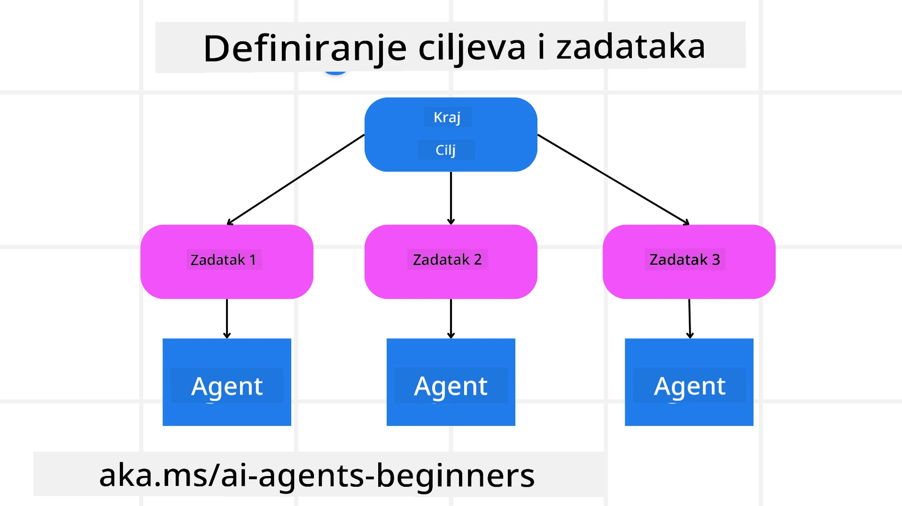

[](https://youtu.be/kPfJ2BrBCMY?si=9pYpPXp0sSbK91Dr)

> _(Kliknite na sliku iznad za pregled video lekcije)_

# Dizajn planiranja

## Uvod

Ova lekcija će obuhvatiti

* Definiranje jasnog ukupnog cilja i razlaganje složenog zadatka na upravljive zadatke.
* Korištenje strukturiranog izlaza za pouzdanije i strojno čitljive odgovore.
* Primjenu pristupa vođenog događajima za upravljanje dinamičkim zadacima i neočekivanim unosima.

## Ciljevi učenja

Nakon završetka ove lekcije, razumjet ćete:

* Identificirati i postaviti ukupni cilj za AI agenta, osiguravajući da jasno zna što treba postići.
* Razložiti složen zadatak na upravljive podzadatke i organizirati ih u logički slijed.
* Opreziti agente pravim alatima (npr. alati za pretraživanje ili alati za analizu podataka), odlučiti kada i kako se koriste te upravljati neočekivanim situacijama koje se pojave.
* Procijeniti ishode podzadatka, mjeriti izvedbu i iterirati akcije za poboljšanje konačnog rezultata.

## Definiranje ukupnog cilja i raščlanjivanje zadatka



Većina stvarnih zadataka previše je složena za rješavanje u jednom koraku. AI agentu je potreban sažet cilj koji će voditi njegovo planiranje i radnje. Na primjer, razmotrite cilj:

    "Generiraj trodnevni plan putovanja."

Iako je jednostavan za izreći, još uvijek treba doradu. Što je cilj jasniji, to se bolji fokus agenta (i svih ljudskih suradnika) može usmjeriti na postizanje pravog ishoda, poput stvaranja sveobuhvatnog itinerara s opcijama leta, preporukama hotela i prijedlozima aktivnosti.

### Raščlanjivanje zadataka

Veliki ili složeni zadaci postaju upravljiviji kada se podijele na manje, ciljno orijentirane podzadatke.
Za primjer plana putovanja, cilj možete raščlaniti na:

* Rezervacija leta
* Rezervacija hotela
* Najam automobila
* Personalizacija

Svaki podzadatak može obaviti posvećeni agent ili proces. Jedan agent može biti specijaliziran za traženje najboljih ponuda za let, drugi se fokusira na rezervacije hotela, i tako dalje. Koordinirajući ili “downstream” agent zatim može sastaviti te rezultate u jedan kohezivan itinerar za krajnjeg korisnika.

Ovaj modularni pristup također omogućuje postupna poboljšanja. Na primjer, mogli biste dodati specijalizirane agente za Preporuke hrane ili Prijedloge lokalnih aktivnosti i s vremenom doraditi itinerar.

### Strukturirani izlaz

Veliki jezični modeli (LLM-ovi) mogu generirati strukturirani izlaz (npr. JSON) koji je lakši za parsiranje i obradu od strane downstream agenata ili servisa. Ovo je posebno korisno u kontekstu višestrukih agenata, gdje možemo izvršavati te zadatke nakon što se dobije plan za izvođenje.

Sljedeći Python isječak prikazuje jednostavnog planerskog agenta koji razlaže cilj na podzadatke i generira strukturirani plan:

```python
from pydantic import BaseModel
from enum import Enum
from typing import List, Optional, Union
import json
import os
from typing import Optional
from pprint import pprint
from agent_framework.foundry import FoundryChatClient
from azure.identity import AzureCliCredential

class AgentEnum(str, Enum):
    FlightBooking = "flight_booking"
    HotelBooking = "hotel_booking"
    CarRental = "car_rental"
    ActivitiesBooking = "activities_booking"
    DestinationInfo = "destination_info"
    DefaultAgent = "default_agent"
    GroupChatManager = "group_chat_manager"

# Model putnog podzadatka
class TravelSubTask(BaseModel):
    task_details: str
    assigned_agent: AgentEnum  # želimo dodijeliti zadatak agentu

class TravelPlan(BaseModel):
    main_task: str
    subtasks: List[TravelSubTask]
    is_greeting: bool

provider = FoundryChatClient(
    project_endpoint=os.environ["AZURE_AI_PROJECT_ENDPOINT"],
    model=os.environ["AZURE_AI_MODEL_DEPLOYMENT_NAME"],
    credential=AzureCliCredential(),
)

# Definiraj korisničku poruku
system_prompt = """You are a planner agent.
    Your job is to decide which agents to run based on the user's request.
    Provide your response in JSON format with the following structure:
{'main_task': 'Plan a family trip from Singapore to Melbourne.',
 'subtasks': [{'assigned_agent': 'flight_booking',
               'task_details': 'Book round-trip flights from Singapore to '
                               'Melbourne.'}
    Below are the available agents specialised in different tasks:
    - FlightBooking: For booking flights and providing flight information
    - HotelBooking: For booking hotels and providing hotel information
    - CarRental: For booking cars and providing car rental information
    - ActivitiesBooking: For booking activities and providing activity information
    - DestinationInfo: For providing information about destinations
    - DefaultAgent: For handling general requests"""

user_message = "Create a travel plan for a family of 2 kids from Singapore to Melbourne"

response = client.create_response(input=user_message, instructions=system_prompt)

response_content = response.output_text
pprint(json.loads(response_content))
```

### Agent za planiranje s orkestracijom više agenata

U ovom primjeru, Semantic Router Agent prima korisnički zahtjev (npr., "Trebam plan hotela za svoje putovanje.").

Planer zatim:

* Prima Plan hotela: Planer koristi korisničku poruku i, na temelju sistemske naredbe (uključujući detalje dostupnih agenata), generira strukturirani putni plan.
* Navodi agente i njihove alate: Registar agenata sadrži popis agenata (npr. za letove, hotele, najam automobila i aktivnosti) zajedno s funkcijama ili alatima koje nude.
* Usmjerava plan prema odgovarajućim agentima: Ovisno o broju podzadatka, planer ili šalje poruku izravno posvećenom agentu (za scenarije s jednim zadatkom) ili koordinira putem upravitelja grupnog chata za suradnju više agenata.
* Sažima ishod: Na kraju, planer sažima generirani plan radi jasnoće.
Sljedeći Python primjer koda ilustrira ove korake:

```python

from pydantic import BaseModel

from enum import Enum
from typing import List, Optional, Union

class AgentEnum(str, Enum):
    FlightBooking = "flight_booking"
    HotelBooking = "hotel_booking"
    CarRental = "car_rental"
    ActivitiesBooking = "activities_booking"
    DestinationInfo = "destination_info"
    DefaultAgent = "default_agent"
    GroupChatManager = "group_chat_manager"

# Model putnog podzadatka

class TravelSubTask(BaseModel):
    task_details: str
    assigned_agent: AgentEnum # želimo dodijeliti zadatak agentu

class TravelPlan(BaseModel):
    main_task: str
    subtasks: List[TravelSubTask]
    is_greeting: bool
import json
import os
from typing import Optional

from agent_framework.foundry import FoundryChatClient
from azure.identity import AzureCliCredential

# Kreirajte klijenta

provider = FoundryChatClient(
    project_endpoint=os.environ["AZURE_AI_PROJECT_ENDPOINT"],
    model=os.environ["AZURE_AI_MODEL_DEPLOYMENT_NAME"],
    credential=AzureCliCredential(),
)

from pprint import pprint

# Definirajte korisničku poruku

system_prompt = """You are a planner agent.
    Your job is to decide which agents to run based on the user's request.
    Below are the available agents specialized in different tasks:
    - FlightBooking: For booking flights and providing flight information
    - HotelBooking: For booking hotels and providing hotel information
    - CarRental: For booking cars and providing car rental information
    - ActivitiesBooking: For booking activities and providing activity information
    - DestinationInfo: For providing information about destinations
    - DefaultAgent: For handling general requests"""

user_message = "Create a travel plan for a family of 2 kids from Singapore to Melbourne"

response = client.create_response(input=user_message, instructions=system_prompt)

response_content = response.output_text

# Ispiši sadržaj odgovora nakon učitavanja kao JSON

pprint(json.loads(response_content))
```

Ono što slijedi je izlaz iz prethodnog koda i potom možete koristiti ovaj strukturirani izlaz da ga uputite na `assigned_agent` i sažmete plan putovanja za krajnjeg korisnika.

```json
{
    "is_greeting": "False",
    "main_task": "Plan a family trip from Singapore to Melbourne.",
    "subtasks": [
        {
            "assigned_agent": "flight_booking",
            "task_details": "Book round-trip flights from Singapore to Melbourne."
        },
        {
            "assigned_agent": "hotel_booking",
            "task_details": "Find family-friendly hotels in Melbourne."
        },
        {
            "assigned_agent": "car_rental",
            "task_details": "Arrange a car rental suitable for a family of four in Melbourne."
        },
        {
            "assigned_agent": "activities_booking",
            "task_details": "List family-friendly activities in Melbourne."
        },
        {
            "assigned_agent": "destination_info",
            "task_details": "Provide information about Melbourne as a travel destination."
        }
    ]
}
```

Primjer bilježnice s prethodnim primjerom koda dostupan je [ovdje](./code_samples/07-python-agent-framework.ipynb).

### Iterativno planiranje

Neki zadaci zahtijevaju međusobnu izmjenu ili ponovno planiranje, gdje ishod jednog podzadatka utječe na sljedeći. Na primjer, ako agent otkrije neočekivani format podataka prilikom rezervacije letova, možda će trebati prilagoditi svoju strategiju prije prelaska na rezervacije hotela.

Osim toga, povratne informacije korisnika (npr. čovjek odlučuje da preferira raniji let) mogu pokrenuti djelomično ponovno planiranje. Ovaj dinamičan, iterativan pristup osigurava da konačno rješenje odgovara stvarnim ograničenjima i razvijajućim se korisničkim preferencijama.

npr. primjer koda

```python
import os
from agent_framework.foundry import FoundryChatClient
from azure.identity import AzureCliCredential
#.. isto kao i prethodni kod i proslijedi povijest korisnika, trenutni plan

system_prompt = """You are a planner agent to optimize the
    Your job is to decide which agents to run based on the user's request.
    Below are the available agents specialized in different tasks:
    - FlightBooking: For booking flights and providing flight information
    - HotelBooking: For booking hotels and providing hotel information
    - CarRental: For booking cars and providing car rental information
    - ActivitiesBooking: For booking activities and providing activity information
    - DestinationInfo: For providing information about destinations
    - DefaultAgent: For handling general requests"""

user_message = "Create a travel plan for a family of 2 kids from Singapore to Melbourne"

response = client.create_response(
    input=user_message,
    instructions=system_prompt,
    context=f"Previous travel plan - {TravelPlan}",
)
# .. ponovno planiraj i pošalji zadatke odgovarajućim agentima
```

Za sveobuhvatnije planiranje pogledajte Magnetic One <a href="https://www.microsoft.com/research/articles/magentic-one-a-generalist-multi-agent-system-for-solving-complex-tasks" target="_blank">Blogpost</a> za rješavanje složenih zadataka.

## Sažetak

U ovom članku pogledali smo primjer kako možemo kreirati planer koji može dinamički odabrati dostupne agente. Izlaz Planera razlaže zadatke i dodjeljuje agente da se oni mogu izvršiti. Pretpostavlja se da agenti imaju pristup funkcijama/alatima potrebnim za obavljanje zadatka. Osim agenata, možete uključiti i druge obrasce poput refleksije, sažimatelja i rundovine za dodatnu prilagodbu.

## Dodatni resursi

Magentic One - Generalistički multi-agentni sustav za rješavanje složenih zadataka koji je postigao impresivne rezultate na više izazovnih benchmarka. Referenca: <a href="https://www.microsoft.com/research/articles/magentic-one-a-generalist-multi-agent-system-for-solving-complex-tasks" target="_blank">Magentic One</a>. U ovoj implementaciji orkestrator kreira zadatke specifične planove i delegira te zadatke dostupnim agentima. Osim planiranja, orkestrator koristi i mehanizam praćenja za nadzor napretka zadatka i po potrebi ponovno planira.

### Imate li dodatnih pitanja o obrascu dizajna planiranja?

Pridružite se [Microsoft Foundry Discord](https://discord.com/invite/ATgtXmAS5D) da se povežete s drugim učenicima, sudjelujete na konzultacijama i dobijete odgovore na pitanja o AI agentima.

## Prethodna lekcija

[Izgradnja pouzdanih AI agenata](../06-building-trustworthy-agents/README.md)

## Sljedeća lekcija

[Obrazac dizajna više agenata](../08-multi-agent/README.md)

---

<!-- CO-OP TRANSLATOR DISCLAIMER START -->
**Napomena**:
Ovaj dokument je preveden korištenjem AI prevoditeljskog servisa [Co-op Translator](https://github.com/Azure/co-op-translator). Iako težimo točnosti, imajte na umu da automatski prijevodi mogu sadržavati greške ili netočnosti. Izvorni dokument na izvornom jeziku treba smatrati autoritativnim izvorom. Za važne informacije preporuča se profesionalni ljudski prijevod. Nismo odgovorni za bilo kakva nesporazumevanja ili pogrešne interpretacije koje proizlaze iz korištenja ovog prijevoda.
<!-- CO-OP TRANSLATOR DISCLAIMER END -->