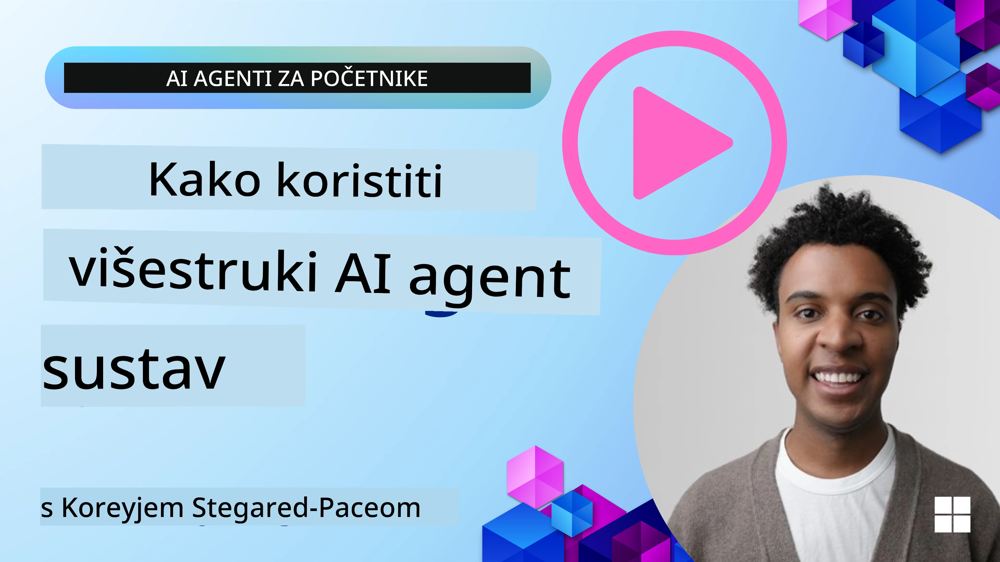
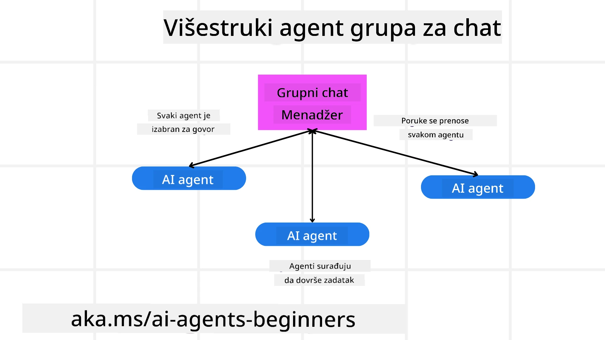
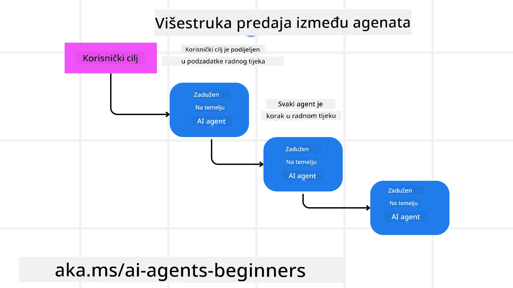
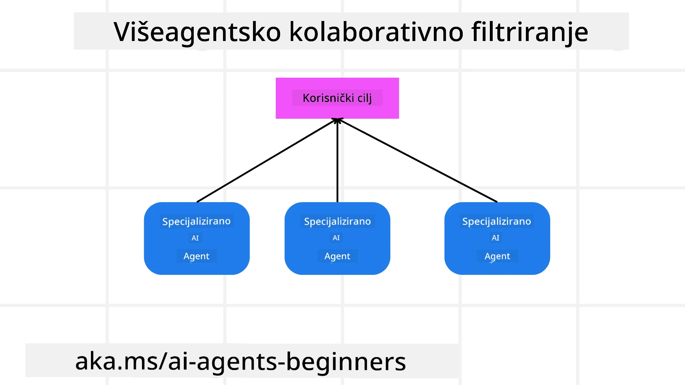

> _(Kliknite gornju sliku da pogledate video ove lekcije)_

# Obrasci dizajna za više agenata

Čim počnete raditi na projektu koji uključuje više agenata, morat ćete razmotriti obrazac dizajna za više agenata. Međutim, možda neće biti odmah jasno kada prijeći na više agenata i koje su prednosti.

## Uvod

U ovoj lekciji želimo odgovoriti na sljedeća pitanja:

- U kojim su scenarijima više agenata primjenjivo?
- Koje su prednosti korištenja više agenata u odnosu na samo jednog agenta koji obavlja više zadataka?
- Koji su gradivni elementi za implementaciju obrasca dizajna za više agenata?
- Kako možemo imati uvid u to kako više agenata međusobno komunicira?

## Ciljevi učenja

Nakon ove lekcije trebali biste moći:

- Prepoznati scenarije u kojima su više agenata primjenjivi
- Prepoznati prednosti korištenja više agenata u odnosu na jednog agenta.
- Shvatiti gradivne elemente implementacije obrasca dizajna za više agenata.

Koja je šira slika?

*Više agenata je obrazac dizajna koji omogućuje više agenata da rade zajedno kako bi postigli zajednički cilj*.

Ovaj se obrazac široko koristi u raznim područjima, uključujući robotiku, autonomne sustave i distribuirano računanje.

## Scenariji u kojima su više agenata primjenjivi

Pa koji su scenariji dobar slučaj za korištenje više agenata? Odgovor je da postoji mnogo scenarija u kojima je korištenje više agenata korisno, osobito u sljedećim slučajevima:

- **Velika opterećenja**: Velika opterećenja mogu se podijeliti na manje zadatke i dodijeliti različitim agentima, što omogućuje paralelnu obradu i brže dovršavanje. Primjer toga je u slučaju velikog zadatka obrade podataka.
- **Složen zadaci**: Složeni zadaci, poput velikih opterećenja, mogu se razložiti na manje podzadatke i dodijeliti različitim agentima, pri čemu se svaki specijalizira za određeni aspekt zadatka. Dobar primjer toga je u slučaju autonomnih vozila gdje različiti agenti upravljaju navigacijom, detekcijom prepreka i komunikacijom s drugim vozilima.
- **Različita stručnost**: Različiti agenti mogu imati različitu stručnost, što im omogućuje učinkovitije rješavanje različitih aspekata zadatka nego pojedinačni agent. Za ovaj slučaj dobar primjer je u zdravstvenoj skrbi gdje agenti mogu upravljati dijagnostikom, planovima liječenja i nadzorom pacijenata.

## Prednosti korištenja više agenata u odnosu na jednog agenta

Sustav s jednim agentom mogao bi dobro funkcionirati za jednostavne zadatke, ali za složenije zadatke korištenje više agenata može pružiti nekoliko prednosti:

- **Specijalizacija**: Svaki agent može biti specijaliziran za određeni zadatak. Nedostatak specijalizacije u jednom agentu znači da imate agenta koji može sve, ali se može zbuniti što treba učiniti kad se suoči sa složenim zadatkom. Može, na primjer, završiti radeći zadatak za koji nije najbolje prikladan.
- **Skalabilnost**: Lakše je skalirati sustave dodavanjem više agenata nego preopterećivanjem jednog agenta.
- **Otpornost na pogreške**: Ako jedan agent otkaže, drugi mogu nastaviti funkcionirati, osiguravajući pouzdanost sustava.

Uzmimo za primjer rezervaciju putovanja za korisnika. Sustav s jednim agentom morao bi upravljati svim aspektima procesa rezervacije putovanja, od pronalaženja letova do rezervacije hotela i rent-a-cara. Da bi to postigao jedan agent, agent bi trebao imati alate za upravljanje svim tim zadacima. To bi moglo dovesti do složenog i monolitnog sustava koji je težak za održavanje i skaliranje. Sustav s više agenata, s druge strane, mogao bi imati različite agente specijalizirane za pronalaženje letova, rezervaciju hotela i rent-a-cara. To bi sustav učinilo modularnijim, lakšim za održavanje i skalabilnijim.

Usporedite to s putničkom agencijom vođenom kao malena obiteljska agencija nasuprot putničkoj agenciji vođenoj kao franšiza. U maloj obiteljskoj agenciji jedan agent bi se bavio svim aspektima procesa rezervacije putovanja, dok bi franšiza imala različite agente koji se bave različitim aspektima procesa rezervacije putovanja.

## Gradivni elementi implementacije obrasca dizajna za više agenata

Prije nego što možete implementirati obrazac dizajna za više agenata, morate razumjeti gradivne elemente koji čine obrazac.

Učinimo ovo konkretnijim opet gledajući primjer rezervacije putovanja za korisnika. U tom bi slučaju gradivni elementi uključivali:

- **Agent Communication**: Agenti za pronalaženje letova, rezervaciju hotela i rent-a-cara trebaju komunicirati i dijeliti informacije o preferencijama i ograničenjima korisnika. Trebate odlučiti o protokolima i metodama za tu komunikaciju. Konkretno to znači da agent za pronalaženje letova treba komunicirati s agentom za rezervaciju hotela kako bi se osiguralo da je hotel rezerviran za iste datume kao i let. To znači da agenti moraju dijeliti informacije o datumima putovanja korisnika, što znači da trebate odlučiti *koji agenti dijele informacije i kako ih dijele*.
- **Coordination Mechanisms**: Agenti trebaju koordinirati svoje radnje kako bi se osiguralo da su preferencije i ograničenja korisnika zadovoljena. Korisnikova preferencija mogla bi biti da želi hotel blizu aerodroma, dok ograničenje može biti da su rent-a-car vozila dostupna samo na aerodromu. To znači da agent za rezervaciju hotela treba koordinirati s agentom za rezervaciju rent-a-cara kako bi se osiguralo da su preferencije i ograničenja korisnika zadovoljena. To znači da trebate odlučiti *kako agenti koordiniraju svoje radnje*.
- **Agent Architecture**: Agenti trebaju imati internu strukturu za donošenje odluka i učenje iz svojih interakcija s korisnikom. To znači da agent za pronalaženje letova treba imati internu strukturu za odlučivanje o tome koje letove preporučiti korisniku. To znači da trebate odlučiti *kako agenti donose odluke i uče iz svojih interakcija s korisnikom*. Primjeri kako agent uči i poboljšava se mogli bi biti da agent za pronalaženje letova koristi model strojnog učenja za preporuku letova korisniku na temelju njihovih prethodnih preferencija.
- **Visibility into Multi-Agent Interactions**: Trebate imati uvid u to kako više agenata međusobno komunicira. To znači da trebate alate i tehnike za praćenje aktivnosti i interakcija agenata. To bi moglo biti u obliku alata za logiranje i nadzor, alata za vizualizaciju i metrika performansi.
- **Multi-Agent Patterns**: Postoje različiti obrasci za implementaciju sustava s više agenata, poput centraliziranih, decentraliziranih i hibridnih arhitektura. Trebate odlučiti o obrascu koji najbolje odgovara vašem slučaju upotrebe.
- **Čovjek u petlji**: U većini slučajeva imat ćete čovjeka u petlji i trebate uputiti agente kada tražiti ljudsku intervenciju. To bi moglo biti u obliku korisnika koji traži određeni hotel ili let koji agenti nisu preporučili ili traži potvrdu prije rezervacije leta ili hotela.

## Uvid u interakcije više agenata

Važno je da imate uvid u to kako više agenata međusobno komunicira. Ovaj uvid je ključan za otklanjanje pogrešaka, optimizaciju i osiguravanje ukupne učinkovitosti sustava. Da biste to postigli, trebate imati alate i tehnike za praćenje aktivnosti i interakcija agenata. To bi moglo biti u obliku alata za logiranje i nadzor, alata za vizualizaciju i metrika performansi.

Na primjer, u slučaju rezervacije putovanja za korisnika, mogli biste imati nadzornu ploču koja prikazuje status svakog agenta, preferencije i ograničenja korisnika te interakcije između agenata. Ta nadzorna ploča mogla bi pokazivati datume putovanja korisnika, letove koje je preporučio agent za letove, hotele koje je preporučio agent za hotele i rent-a-car vozila koja je preporučio agent za rent-a-car. To bi vam dalo jasan uvid u to kako agenti međusobno komuniciraju i jesu li preferencije i ograničenja korisnika zadovoljena.

Pogledajmo svaki od ovih aspekata detaljnije.

- **Logging and Monitoring Tools**: Želite imati zabilježeno svako djelovanje kojeg agent poduzme. Unos u zapisnik mogao bi pohraniti informacije o agentu koji je poduzeo akciju, akciji koja je poduzeta, vremenu kada je akcija poduzeta i ishodu akcije. Te se informacije zatim mogu koristiti za otklanjanje pogrešaka, optimizaciju i slično.
- **Visualization Tools**: Alati za vizualizaciju mogu vam pomoći vidjeti interakcije između agenata na intuitivniji način. Na primjer, mogli biste imati graf koji prikazuje tok informacija između agenata. To vam može pomoći identificirati uska grla, neučinkovitosti i druge probleme u sustavu.
- **Performance Metrics**: Metrike performansi mogu vam pomoći pratiti učinkovitost sustava s više agenata. Na primjer, mogli biste pratiti vrijeme potrebno za dovršetak zadatka, broj zadataka dovršenih po jedinici vremena i točnost preporuka koje agenti daju. Te informacije mogu vam pomoći identificirati područja za poboljšanje i optimizirati sustav.

## Obrasci za više agenata

Detaljnije ćemo razmotriti neke konkretne obrasce koje možemo koristiti za stvaranje aplikacija s više agenata. Evo nekoliko zanimljivih obrazaca koje vrijedi razmotriti:

### Grupni chat

Ovaj je obrazac koristan kada želite stvoriti aplikaciju za grupni chat u kojoj više agenata može međusobno komunicirati. Tipični slučajevi upotrebe za ovaj obrazac uključuju timsku suradnju, korisničku podršku i društvene mreže.

U ovom obrascu svaki agent predstavlja korisnika u grupnom chatu, a poruke se razmjenjuju između agenata koristeći protokol za razmjenu poruka. Agenti mogu slati poruke u grupni chat, primati poruke iz grupnog chata i odgovarati na poruke drugih agenata.

Ovaj se obrazac može implementirati koristeći centraliziranu arhitekturu gdje se sve poruke usmjeravaju kroz središnji poslužitelj, ili decentraliziranu arhitekturu gdje se poruke razmjenjuju izravno.

### Predaja

Ovaj je obrazac koristan kada želite stvoriti aplikaciju u kojoj više agenata može predavati zadatke jedni drugima.

Tipični slučajevi upotrebe za ovaj obrazac uključuju korisničku podršku, upravljanje zadacima i automatizaciju tijeka rada.

U ovom obrascu svaki agent predstavlja zadatak ili korak u tijeku rada, a agenti mogu predavati zadatke drugim agentima na temelju unaprijed definiranih pravila.

### Kolaborativno filtriranje

Ovaj je obrazac koristan kada želite stvoriti aplikaciju u kojoj više agenata može surađivati kako bi korisnicima dali preporuke.

Razlog zašto biste željeli da više agenata surađuje je taj što svaki agent može imati različitu stručnost i može doprinijeti procesu preporuke na različite načine.

Uzmimo primjer gdje korisnik želi preporuku za najbolju dionicu za kupnju na burzi.

- **Stručnjak za industriju**: Jedan agent mogao bi biti stručnjak za određenu industriju.
- **Tehnička analiza**: Drugi agent mogao bi biti stručnjak za tehničku analizu.
- **Fundamentalna analiza**: I treći agent mogao bi biti stručnjak za fundamentalnu analizu. Suradnjom ti agenti mogu korisniku pružiti sveobuhvatniju preporuku.

## Scenarij: Proces povrata novca

Razmotrite scenarij u kojem kupac pokušava dobiti povrat novca za proizvod; u tom procesu može biti uključeno dosta agenata, ali razdvojimo ih na agente specifične za ovaj proces i opće agente koji se mogu koristiti u drugim procesima.

**Agenti specifični za proces povrata novca**:

Slijede neki agenti koji bi mogli biti uključeni u proces povrata novca:

- **Customer agent**: Ovaj agent predstavlja kupca i odgovoran je za pokretanje procesa povrata novca.
- **Seller agent**: Ovaj agent predstavlja prodavača i odgovoran je za obradu povrata novca.
- **Payment agent**: Ovaj agent predstavlja proces plaćanja i odgovoran je za povrat sredstava kupcu.
- **Resolution agent**: Ovaj agent predstavlja proces rješavanja i odgovoran je za rješavanje bilo kakvih problema koji se pojave tijekom procesa povrata novca.
- **Compliance agent**: Ovaj agent predstavlja proces usklađenosti i odgovoran je za osiguravanje da proces povrata novca bude u skladu s propisima i politikama.

**Opći agenti**:

Ovi se agenti mogu koristiti u drugim dijelovima vašeg poslovanja.

- **Shipping agent**: Ovaj agent predstavlja proces otpreme i odgovoran je za slanje proizvoda nazad prodavaču. Ovaj se agent može koristiti i za proces povrata novca i za opću otpremu proizvoda prilikom kupnje, na primjer.
- **Feedback agent**: Ovaj agent predstavlja proces prikupljanja povratnih informacija i odgovoran je za prikupljanje povratnih informacija od kupca. Povratne informacije mogu se prikupljati u bilo kojem trenutku, a ne samo tijekom procesa povrata novca.
- **Escalation agent**: Ovaj agent predstavlja proces eskalacije i odgovoran je za eskalaciju problema na višu razinu podrške. Ovaj se tip agenta može koristiti za bilo koji proces u kojem trebate eskalirati problem.
- **Notification agent**: Ovaj agent predstavlja proces obavještavanja i odgovoran je za slanje obavijesti kupcu u različitim fazama procesa povrata novca.
- **Analytics agent**: Ovaj agent predstavlja proces analitike i odgovoran je za analiziranje podataka vezanih uz proces povrata novca.
- **Audit agent**: Ovaj agent predstavlja proces revizije i odgovoran je za reviziju procesa povrata novca kako bi se osiguralo da se pravilno provodi.
- **Reporting agent**: Ovaj agent predstavlja proces izvještavanja i odgovoran je za generiranje izvještaja o procesu povrata novca.
- **Knowledge agent**: Ovaj agent predstavlja proces znanja i odgovoran je za održavanje baze znanja informacija vezanih uz proces povrata novca. Ovaj agent mogao bi biti upućen i u povrate i u druge dijelove vašeg poslovanja.
- **Security agent**: Ovaj agent predstavlja proces sigurnosti i odgovoran je za osiguravanje sigurnosti procesa povrata novca.
- **Quality agent**: Ovaj agent predstavlja proces kvalitete i odgovoran je za osiguravanje kvalitete procesa povrata novca.

Prethodno je navedeno prilično puno agenata, kako za specifični proces povrata novca, tako i za opće agente koji se mogu koristiti u drugim dijelovima vašeg poslovanja. Nadamo se da vam ovo daje ideju o tome kako možete odlučiti koje agente koristiti u svom sustavu s više agenata.

## Zadatak

Dizajnirajte sustav s više agenata za proces korisničke podrške. Identificirajte agente uključene u proces, njihove uloge i odgovornosti te kako međusobno komuniciraju. Uzmite u obzir i agente specifične za proces korisničke podrške i opće agente koji se mogu koristiti u drugim dijelovima vašeg poslovanja.
> Razmislite prije nego pročitate sljedeće rješenje; možda će vam trebati više agenata nego što mislite.
> SAVJET: Razmislite o različitim fazama procesa korisničke podrške i također uzmite u obzir agente potrebne za bilo koji sustav.

## Solution

[Rješenje](./solution/solution.md)

## Knowledge checks

Question: Kada biste trebali razmotriti upotrebu više agenata?

- [ ] A1: Kada imate mali opseg posla i jednostavan zadatak.
- [ ] A2: Kada imate veliku količinu posla
- [ ] A3: Kada imate jednostavan zadatak.

[Solution quiz](./solution/solution-quiz.md)

## Summary

U ovoj lekciji pregledali smo dizajnerski obrazac višestrukih agenata, uključujući scenarije u kojima je primjenjiv, prednosti korištenja više agenata u odnosu na jednoga agenta, osnovne elemente implementacije tog obrasca te kako dobiti uvid u međusobno djelovanje agenata.

### Imate li još pitanja o dizajnerskom obrascu višestrukih agenata?

Pridružite se [Microsoft Foundry Discord](https://aka.ms/ai-agents/discord) kako biste upoznali druge polaznike, sudjelovali na konzultacijama i dobili odgovore na pitanja o AI agentima.

## Additional resources

- <a href="https://learn.microsoft.com/azure/ai-services/agents/overview" target="_blank">Dokumentacija Microsoft Agent Frameworka</a>
- <a href="https://www.analyticsvidhya.com/blog/2024/10/agentic-design-patterns/" target="_blank">Agentni dizajnerski obrasci</a>

## Previous Lesson

[Planning Design](../07-planning-design/README.md)

## Next Lesson

[Metacognition in AI Agents](../09-metacognition/README.md)

---

<!-- CO-OP TRANSLATOR DISCLAIMER START -->
Izjava o odricanju odgovornosti:
Ovaj je dokument preveden pomoću AI usluge za prevođenje [Co-op Translator](https://github.com/Azure/co-op-translator). Iako težimo točnosti, imajte na umu da automatski prijevodi mogu sadržavati pogreške ili netočnosti. Izvorni dokument na izvornom jeziku treba smatrati autoritativnim izvorom. Za važne informacije preporučuje se profesionalni ljudski prijevod. Ne odgovaramo za bilo kakve nesporazume ili pogrešna tumačenja koja proizlaze iz upotrebe ovog prijevoda.
<!-- CO-OP TRANSLATOR DISCLAIMER END -->