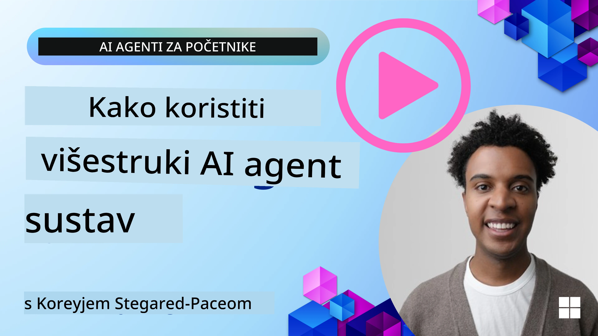
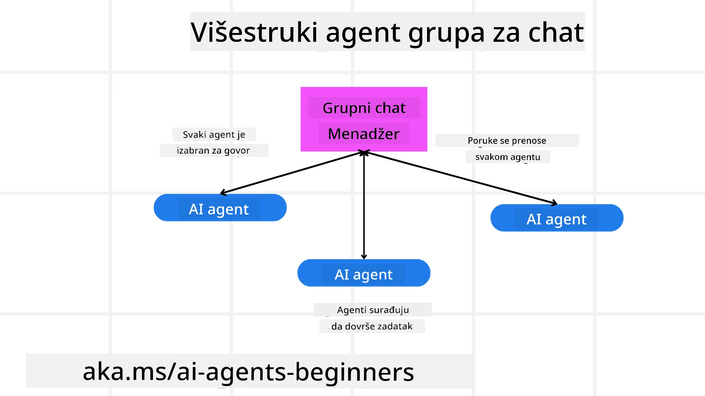
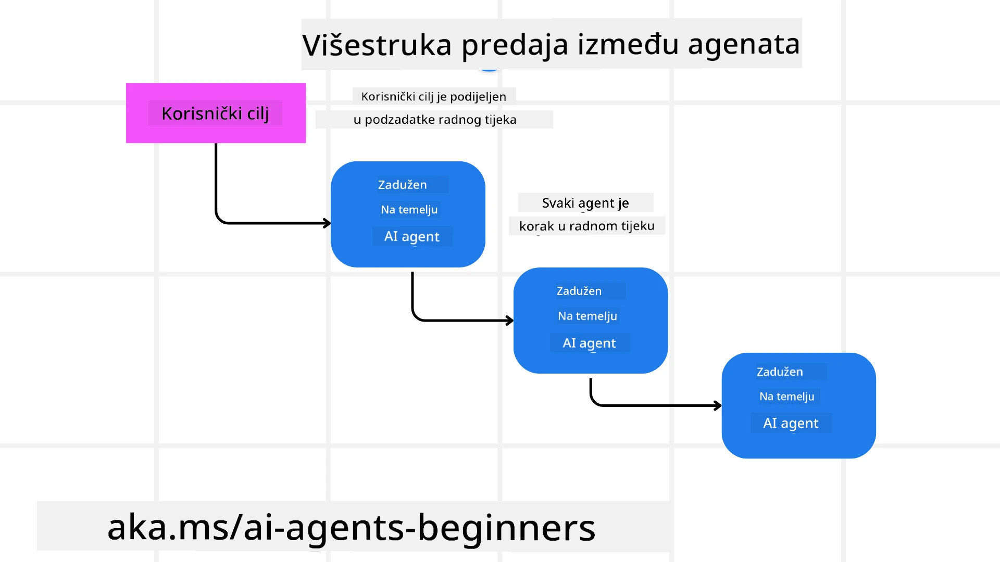
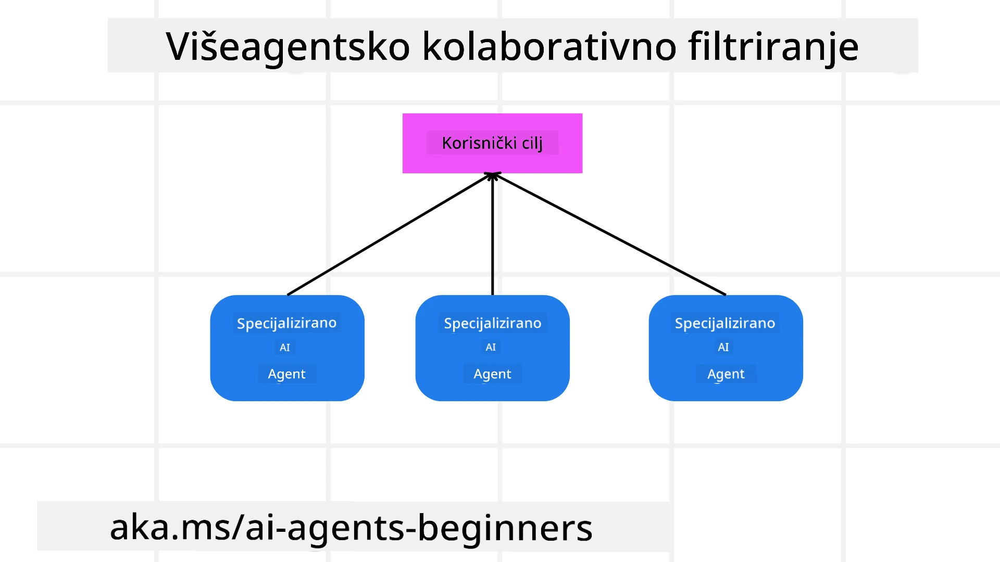

> _(Kliknite na sliku iznad za pregled videa ovog lekcije)_

# Dizajnerski obrasci za više agenata

Čim počnete raditi na projektu koji uključuje više agenata, trebate razmotriti dizajnerski obrazac za više agenata. Međutim, možda nije odmah jasno kada prijeći na više agenata i koje su prednosti.

## Uvod

U ovom lekciji želimo odgovoriti na sljedeća pitanja:

- Koji su scenariji u kojima je primjena višestrukih agenata prikladna?
- Koje su prednosti korištenja više agenata u odnosu na jednog agenta koji obavlja više zadataka?
- Koji su gradivni blokovi za implementaciju dizajnerskog obrasca višestrukih agenata?
- Kako imati uvid u to kako više agenata međusobno komunicira?

## Ciljevi učenja

Nakon ove lekcije trebali biste biti u stanju:

- Prepoznati scenarije u kojima je primjena više agenata prikladna
- Prepoznati prednosti korištenja više agenata u odnosu na jednog agenta.
- Razumjeti gradivne blokove implementacije dizajnerskog obrasca višestrukih agenata.

Koja je šira slika?

*Višestruki agenti su dizajnerski obrazac koji omogućava da više agenata surađuje kako bi postigli zajednički cilj*.

Ovaj obrazac se široko koristi u različitim područjima, uključujući robotiku, autonomne sustave i distribuirane računalne sustave.

## Scenariji u kojima su višestruki agenti primjenjivi

Koji su scenariji dobar slučaj za korištenje višestrukih agenata? Odgovor je da postoji mnogo scenarija u kojima je korisno koristiti više agenata, naročito u sljedećim slučajevima:

- **Veliki opterećenja**: Veliki zadaci mogu se podijeliti na manje zadatke i dodijeliti različitim agentima, omogućujući paralelnu obradu i brže izvršenje. Primjer je obrada velikih količina podataka.
- **Složeni zadaci**: Složeni zadaci, poput velikih opterećenja, mogu se razložiti na manje podzadataka i dodijeliti različitim agentima, pri čemu se svaki specijalizira za određeni dio zadatka. Dobar primjer su autonomna vozila, gdje različiti agenti upravljaju navigacijom, detekcijom prepreka i komunikacijom s drugim vozilima.
- **Različita stručnost**: Različiti agenti mogu imati raznoliku stručnost, što im omogućuje da učinkovitije obrade različite aspekte zadatka nego jedan agent. Za taj slučaj dobar primjer je zdravstvena skrb, gdje agenti upravljaju dijagnostikom, planovima liječenja i praćenjem pacijenta.

## Prednosti korištenja višestrukih agenata u odnosu na jednog agenta

Jedan agent sustav može dobro funkcionirati za jednostavne zadatke, no za složenije zadatke korištenje više agenata može pružiti nekoliko prednosti:

- **Specijalizacija**: Svaki agent može biti specijaliziran za određeni zadatak. Nedostatak specijalizacije kod jednog agenta znači da imate agenta koji može raditi sve, ali može biti zbunjen što učiniti kada se suoči sa složenim zadatkom. Na primjer, mogao bi završiti radeći zadatak za koji nije najbolje kvalificiran.
- **Skalabilnost**: Lakše je skalirati sustave dodavanjem više agenata nego preopterećivanjem jednog agenta.
- **Otpornost na pogreške**: Ako jedan agent zakaže, drugi mogu nastaviti s radom, osiguravajući pouzdanost sustava.

Uzmimo na primjer rezervaciju putovanja za korisnika. Sustav s jednim agentom morao bi obaviti sve aspekte procesa rezervacije, od pronalaženja letova do rezerviranja hotela i najma automobila. Da bi to postigao, agent bi morao imati alate za obavljanje svih tih zadataka. To bi moglo dovesti do složenog i monolitnog sustava koji je teško održavati i skalirati. Sustav s višestrukim agentima mogao bi imati različite agente specijalizirane za pronalaženje letova, rezerviranje hotela i automobila. To bi učinilo sustav modularnijim, lakšim za održavanje i skalabilnijim.

Usporedite to s turističkom agencijom vođenom kao obiteljska trgovina nasuprot turističkoj agenciji vođenoj kao franšiza. Obiteljska trgovina imala bi jednog agenta koji upravlja svim aspektima procesa rezervacije, dok bi franšiza imala različite agente koji upravljaju različitim aspektima istog procesa.

## Gradivni blokovi implementacije dizajnerskog obrasca za više agenata

Prije nego što možete implementirati dizajnerski obrazac za višestruke agente, trebate razumjeti gradivne blokove tog obrasca.

Učinit ćemo to konkretnijim ponovno promatrajući primjer rezervacije putovanja za korisnika. U ovom slučaju gradivni blokovi uključuju:

- **Komunikacija agenata**: Agenti za pronalaženje letova, rezervaciju hotela i automobila moraju komunicirati i dijeliti informacije o preferencijama i ograničenjima korisnika. Morate odlučiti o protokolima i metodama za ovu komunikaciju. Konkretno, agent za pronalaženje letova treba komunicirati s agentom za rezervaciju hotela kako bi se osiguralo da je hotel rezerviran za iste datume kao i let. To znači da agenti trebaju dijeliti informacije o datumima putovanja korisnika, odnosno morate odlučiti *koji agenti dijele informacije i kako dijele informacije*.
- **Mehanizmi koordinacije**: Agenti moraju koordinirati svoje aktivnosti kako bi ispunili korisničke preferencije i ograničenja. Preferencija korisnika može biti da žele hotel blizu aerodroma, dok je ograničenje da su automobili za najam dostupni samo na aerodromu. To znači da agent za rezervaciju hotela treba koordinirati s agentom za najam automobila kako bi se osiguralo da su preferencije i ograničenja korisnika ispunjeni. To znači da trebate odlučiti *kako agenti koordiniraju svoje aktivnosti*.
- **Arhitektura agenata**: Agenti moraju imati internu strukturu za donošenje odluka i učenje iz svojih interakcija s korisnikom. To znači da agent za pronalaženje letova treba imati internu strukturu za donošenje odluka o tome koje letove preporučiti korisniku. To znači da trebate odlučiti *kako agenti donose odluke i uče iz svojih interakcija s korisnikom*. Primjeri kako agent uči i unapređuje se mogu biti da agent za pronalaženje letova koristi model strojnog učenja za preporuku letova temeljenih na prethodnim preferencijama korisnika.
- **Vidljivost u interakcije višestrukih agenata**: Trebate imati uvid u to kako više agenata međusobno komunicira. To znači da morate imati alate i tehnike za praćenje aktivnosti i interakcija agenata. To može biti u obliku alata za evidentiranje i nadzor, alata za vizualizaciju i mjernih pokazatelja učinkovitosti.
- **Obrasci za višestruke agente**: Postoje različiti obrasci za implementaciju sustava s više agenata, poput centralizirane, decentralizirane i hibridne arhitekture. Morate odlučiti koji obrazac najbolje odgovara vašem slučaju.
- **Čovjek u petlji**: U većini slučajeva imat ćete čovjeka u petlji i morate uputiti agente kada trebaju tražiti ljudsku intervenciju. To može biti u obliku korisnika koji traži određeni hotel ili let koji agenti nisu preporučili ili traže potvrdu prije rezervacije leta ili hotela.

## Vidljivost u interakcije višestrukih agenata

Važno je imati uvid u to kako više agenata međusobno komunicira. Ta vidljivost je ključna za otklanjanje pogrešaka, optimizaciju i osiguranje ukupne učinkovitosti sustava. Za to trebate imati alate i tehnike za praćenje aktivnosti i interakcija agenata. To može biti u obliku alata za evidentiranje i nadzor, alata za vizualizaciju i mjernih pokazatelja učinkovitosti.

Na primjer, u slučaju rezervacije putovanja za korisnika, mogli biste imati nadzornu ploču koja prikazuje status svakog agenta, korisničke preferencije i ograničenja te interakcije između agenata. Ta nadzorna ploča mogla bi prikazivati datume putovanja korisnika, letove koje je preporučio agent za letove, hotele koje je preporučio agent za hotele i automobile za najam koje je preporučio agent za rent-a-car. To bi vam dalo jasan pregled kako agenti međusobno komuniciraju i jesu li korisničke preferencije i ograničenja zadovoljeni.

Pogledajmo svaki od ovih aspekata detaljnije.

- **Alati za evidentiranje i nadzor**: Želite evidentirati svaku akciju koju agent poduzme. Zapis unosa može spremiti informacije o agentu koji je poduzeo akciju, poduzetoj akciji, vremenu kada je akcija poduzeta i ishodu akcije. Ove informacije mogu se koristiti za otklanjanje pogrešaka, optimizaciju i slično.

- **Alati za vizualizaciju**: Alati za vizualizaciju mogu vam pomoći vidjeti interakcije između agenata na intuitivniji način. Na primjer, mogli biste imati graf koji prikazuje tok informacija između agenata. To bi vam moglo pomoći identificirati uska grla, neučinkovitosti i druge probleme u sustavu.

- **Pokazatelji performansi**: Pokazatelji performansi mogu vam pomoći pratiti učinkovitost sustava s više agenata. Na primjer, mogli biste pratiti vrijeme potrebno za dovršetak zadatka, broj zadataka obavljenih po jedinici vremena i točnost preporuka koje daju agenti. Ove informacije mogu vam pomoći identificirati područja za poboljšanje i optimizirati sustav.

## Obrasci za višestruke agente

Uronimo u neke konkretne obrasce koje možemo koristiti za stvaranje aplikacija s više agenata. Evo nekoliko zanimljivih obrazaca koje vrijedi razmotriti:

### Grupni chat

Ovaj obrazac je koristan kada želite stvoriti aplikaciju za grupni chat u kojoj više agenata može međusobno komunicirati. Tipični slučajevi korištenja ovog obrasca uključuju timsku suradnju, korisničku podršku i društvene mreže.

U ovom obrascu svaki agent predstavlja korisnika u grupnom chatu, a poruke se razmjenjuju između agenata koristeći protokol za slanje poruka. Agenti mogu slati poruke u grupu, primati poruke iz grupe i odgovarati na poruke drugih agenata.

Ovaj obrazac može se implementirati korištenjem centralizirane arhitekture gdje se sve poruke usmjeravaju kroz središnji poslužitelj, ili decentralizirane arhitekture gdje se poruke razmjenjuju izravno.

### Predaja zadataka (Hand-off)

Ovaj obrazac je koristan kada želite stvoriti aplikaciju u kojoj više agenata može međusobno predavati zadatke.

Tipični slučajevi korištenja ovoga obrasca uključuju korisničku podršku, upravljanje zadacima i automatizaciju radnih tijekova.

U ovom obrascu svaki agent predstavlja zadatak ili korak u radnom tijeku, a agenti mogu predavati zadatke drugim agentima na temelju unaprijed definiranih pravila.

### Kolaborativno filtriranje

Ovaj obrazac je koristan kada želite stvoriti aplikaciju u kojoj više agenata surađuje kako bi dali preporuke korisnicima.

Razlog zašto biste htjeli da više agenata surađuje je taj što svaki agent može imati različitu stručnost i može doprinijeti procesu davanja preporuka na različite načine.

Uzmimo primjer u kojem korisnik želi preporuku o najboljoj dionici za kupnju na burzi.

- **Stručnjak za industriju**: Jedan agent može biti stručnjak za određenu industriju.
- **Tehnička analiza**: Drugi agent može biti stručnjak za tehničku analizu.
- **Fundamentalna analiza**: i još jedan agent može biti stručnjak za fundamentalnu analizu. Suradnjom ovi agenti mogu pružiti sveobuhvatniju preporuku korisniku.

## Scenarij: Proces povrata novca

Razmotrite scenarij u kojem korisnik pokušava dobiti povrat novca za proizvod. U ovom procesu može biti uključeno dosta agenata, ali razdvojimo ih na agente specifične za ovaj proces i opće agente koji se mogu koristiti u drugim procesima.

**Agenti specifični za proces povrata novca**:

Slijede neki agenti koji bi mogli biti uključeni u proces povrata novca:

- **Agent korisnika**: Ovaj agent predstavlja korisnika i odgovoran je za pokretanje procesa povrata.
- **Agent prodavača**: Ovaj agent predstavlja prodavača i odgovoran je za obradu povrata novca.
- **Agent plaćanja**: Ovaj agent predstavlja proces plaćanja i zadužen je za vraćanje novca korisniku.
- **Agent za rješavanje**: Ovaj agent predstavlja proces rješavanja problema i odgovoran je za rješavanje svih problema koji nastanu tijekom procesa povrata.
- **Agent usklađenosti**: Ovaj agent predstavlja proces poštivanja propisa i zadužen je za osiguravanje da proces povrata novca bude u skladu sa zakonima i pravilima.

**Opći agenti**:

Ove agente možete koristiti i u drugim dijelovima poslovanja.

- **Agent dostave**: Ovaj agent predstavlja proces dostave i odgovoran je za slanje proizvoda natrag prodavaču. Ovaj agent može se koristiti i za proces povrata i za opću dostavu proizvoda prilikom kupnje, na primjer.
- **Agent povratnih informacija**: Ovaj agent predstavlja proces prikupljanja povratnih informacija od korisnika. Povratne informacije mogu se prikupljati u bilo kojem trenutku, ne samo tijekom procesa povrata.
- **Agent eskalacije**: Ovaj agent predstavlja proces eskalacije i odgovoran je za podizanje problema na višu razinu podrške. Ovakav agent možete koristiti za bilo koji proces u kojem trebate eskalirati problem.
- **Agent obavijesti**: Ovaj agent predstavlja proces obavještavanja i odgovoran je za slanje obavijesti korisniku u različitim fazama procesa povrata.
- **Agent analitike**: Ovaj agent predstavlja proces analitike i odgovoran je za analizu podataka vezanih uz proces povrata.
- **Agent revizije**: Ovaj agent predstavlja proces revizije i odgovoran je za nadzor procesa povrata kako bi se osiguralo da je postupak pravilno izveden.
- **Agent izvještavanja**: Ovaj agent predstavlja proces izvještavanja i odgovoran je za generiranje izvještaja o procesu povrata.
- **Agent znanja**: Ovaj agent predstavlja proces upravljanja znanjem i odgovoran je za održavanje baze znanja vezane uz proces povrata novca. Ovaj agent mogao bi biti upućen i u povrate i u druge dijelove vašeg poslovanja.
- **Agent sigurnosti**: Ovaj agent predstavlja proces sigurnosti i odgovoran je za osiguranje sigurnosti procesa povrata.
- **Agent kvalitete**: Ovaj agent predstavlja proces kontrole kvalitete i odgovoran je za osiguranje kvalitete procesa povrata.

Navedeno je dosta agenata, i to specifičnih za proces povrata i općih agenata koji se mogu koristiti u drugim dijelovima poslovanja. Nadamo se da vam ovo pruža ideju kako odlučiti koje agente koristiti u vašem sustavu s više agenata.

## Zadavanje zadatka

Dizajnirajte sustav s više agenata za proces korisničke podrške. Identificirajte agente uključene u proces, njihove uloge i odgovornosti te kako međusobno komuniciraju. Razmotrite i agente specifične za proces korisničke podrške i opće agente koji se mogu koristiti u drugim dijelovima poslovanja.

> Razmislite prije nego što pročitate sljedeće rješenje, možda će vam trebati više agenata nego što mislite.

> SAVJET: Razmislite o različitim fazama procesa korisničke podrške i također uzmite u obzir agente potrebne za bilo koji sustav.

## Rješenje

[Rješenje](./solution/solution.md)

## Provjere znanja

### Pitanje 1

Koji je scenarij najbolji za sustav s više agenata?

- [ ] A1: Pomoćni bot odgovara na česta pitanja koristeći jednu bazu znanja i mali set alata.
- [ ] A2: Proces povrata novca zahtijeva zasebne uloge za prijevaru, plaćanja i usklađenost, svaka sa svojim alatima, a njihovi rezultati moraju biti koordinirani.
- [ ] A3: Isti jednostavni zahtjev za klasifikaciju stiže tisućama puta na sat.

### Pitanje 2

Kada je obično bolji izbor jedan agent?

- [ ] A1: Zadatak se može obaviti jednim skupom uputa i alata, bez stručnih prijenosa.
- [ ] A2: Agent ima pristup više od jednog alata.
- [ ] A3: Radni tok zahtijeva zasebne uloge s različitim dopuštenjima i neovisnim revizijskim zapisima.

[Rješenje kviza](./solution/solution-quiz.md)

## Sažetak

U ovoj lekciji smo pogledali uzorak dizajna s više agenata, uključujući scenarije gdje su više agenata primjenjivi, prednosti korištenja više agenata u odnosu na jednoga, osnovne elemente implementacije ovog uzorka dizajna, i kako imati pregled o tome kako više agenata međusobno komunicira.

### Imate li dodatnih pitanja o uzorku dizajna s više agenata?

Pridružite se [Microsoft Foundry Discord](https://discord.com/invite/ATgtXmAS5D) i upoznajte druge učenike, sudjelujte u radnim satima i dobijte odgovore na svoja pitanja o AI agentima.

## Dodatni resursi

- <a href="https://learn.microsoft.com/azure/ai-services/agents/overview" target="_blank">Microsoft Agent Framework dokumentacija</a>
- <a href="https://www.analyticsvidhya.com/blog/2024/10/agentic-design-patterns/" target="_blank">Uzorci dizajna agenata</a>

## Prethodna lekcija

[Planiranje dizajna](../07-planning-design/README.md)

## Sljedeća lekcija

[Metakognicija u AI agentima](../09-metacognition/README.md)

---

<!-- CO-OP TRANSLATOR DISCLAIMER START -->
**Napomena**:
Ovaj dokument je preveden korištenjem AI prevoditeljskog servisa [Co-op Translator](https://github.com/Azure/co-op-translator). Iako težimo točnosti, imajte na umu da automatski prijevodi mogu sadržavati greške ili netočnosti. Izvorni dokument na izvornom jeziku treba smatrati autoritativnim izvorom. Za važne informacije preporuča se profesionalni ljudski prijevod. Nismo odgovorni za bilo kakva nesporazumevanja ili pogrešne interpretacije koje proizlaze iz korištenja ovog prijevoda.
<!-- CO-OP TRANSLATOR DISCLAIMER END -->