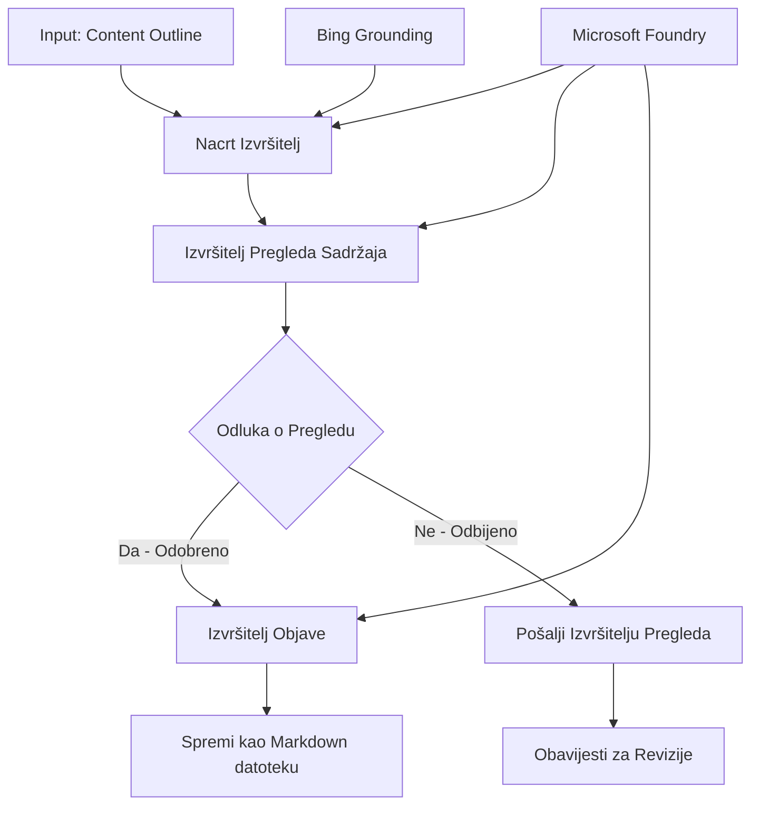

# 🔀 Uvjetni procesi agenata s Microsoft Foundry (.NET)

## 📋 Vodič za inteligentne procese temeljene na odlukama

Ovaj bilježnik prikazuje **uzorke uvjetnih procesa** koristeći Microsoft Foundry i Microsoft Agent Framework za .NET. Naučit ćete kako izgraditi sofisticirane procese vođene odlukama koji inteligentno usmjeravaju obradu na temelju AI analize, poslovnih pravila i dinamičkih uvjeta za automatizaciju na razini poduzeća.

## 🎯 Ciljevi učenja

### 🧠 **Arhitektura inteligentnih odluka**
- **Implementacija uvjetne logike**: Izgradite složena stabla odluka s više razgranatosti
- **Usmjeravanje potpomognuto umjetnom inteligencijom**: Koristite modele Microsoft Foundry za inteligentne odluke o usmjeravanju
- **Dinamična prilagodba procesa**: Mijenjajte ponašanje procesa na temelju analize i uvjeta tijekom izvođenja
- **Integracija poslovnih pravila na razini poduzeća**: Uključite poslovnu logiku i zahtjeve usklađenosti u procese

### 🔀 **Napredni uvjetni uzorci**
- **Višekriterijska evaluacija odluka**: Procjenjujte više čimbenika za odluke o usmjeravanju
- **Obrada svjesna konteksta**: Donosite odluke na temelju prikupljenog konteksta i povijesti procesa
- **Prilagodljivo mijenjanje procesa**: Dinamički prilagođavajte putove obrade na temelju trenutnih uvjeta
- **Integracija s pravnim mehanizmima**: Implementirajte složene poslovne pravne mehanizme unutar procesa

### 🏢 **Uvjetne aplikacije za poduzeća**
- **Klasifikacija i usmjeravanje dokumenata**: Automatski klasificirajte i usmjeravajte dokumente u odgovarajuće procese
- **Triage korisničke službe**: Inteligentno usmjeravanje korisničkih upita specijaliziranim timovima za obradu
- **Usklađenost i procjena rizika**: Primjenjujte različite validacijske i revizijske procese temeljem procjene rizika
- **Procesi za osiguravanje kvalitete**: Usmjeravajte sadržaj kroz odgovarajuće revizijske procese bazirane na metrikama kvalitete

## ⚙️ Preduvjeti i postavljanje

### 📦 **Potrebni NuGet paketi**

Napredni paketi za obradu uvjetnih procesa:

```xml
<!-- Core AI Framework -->
<PackageReference Include="Microsoft.Extensions.AI" Version="9.9.0" />

<!-- Azure AI Agents with Persistent State -->
<PackageReference Include="Azure.AI.Agents.Persistent" Version="1.2.0-beta.5" />

<!-- Azure Identity and Utilities -->
<PackageReference Include="Azure.Identity" Version="1.15.0" />
<PackageReference Include="System.Linq.Async" Version="6.0.3" />
<PackageReference Include="DotNetEnv" Version="3.1.1" />

<!-- Local Workflow Framework References -->
<!-- Microsoft.Agents.Workflows.dll - Advanced workflow orchestration -->
<!-- Microsoft.Agents.AI.AzureAI.dll - Microsoft Foundry integration -->
<!-- Microsoft.Agents.AI.dll - Core agent abstractions -->
```

### 🔑 **Konfiguracija Microsoft Foundryja**

**Potrebni Azure resursi:**
- Microsoft Foundry radni prostor s modelima za uvjetnu obradu
- Azure pretplata s odgovarajućim kvotama i ovlastima za računanje
- Implementirani AI modeli za donošenje odluka i analizu sadržaja
- (Opcionalno) Veza s Bing Search API-jem za mogućnosti oslanjanja na stvarne podatke

**Konfiguracija okoline (.env datoteka):**
```env
# Microsoft Foundry Configuration
AZURE_AI_PROJECT_ENDPOINT=https://your-project.cognitiveservices.azure.com/
BING_CONNECTION_ID=your-bing-connection-id
```

**Pokretanje autentifikacije:**
```csharp
// Azure CLI or Managed Identity authentication
using Azure.Identity;
var credential = new AzureCliCredential();

// Load environment configuration
DotNetEnv.Env.Load("../../../.env");
```

### 🏗️ **Arhitektura uvjetnog procesa**



**Ključne komponente:**
- **Draft Executor**: AI agent koji kreira početne nacrte sadržaja iz skica
- **Content Review Executor**: AI agent koji ocjenjuje kvalitetu i usklađenost nacrta
- **Uvjetno usmjeravanje**: Logika odluke koja usmjerava na temelju rezultata pregleda
- **Putovi objave/recenzije**: Odvojeni procesi za odobreni i odbijeni sadržaj
- **Upravljanje stanjem**: Održava kontekst sadržaja i pregleda tijekom procesa

## 🎨 **Dizajnerski uzorci uvjetnih procesa**

### 📋 **Proizvodnja sadržaja s vratima kvalitete**
```
Outline → Draft Creation → Quality Review → {Approve: Publish | Reject: Revise}
```

### 🎯 **Obrada dokumenata na temelju rizika**
```
Document → Risk Assessment → {Low: Standard | High: Enhanced Review}
```

### 🔍 **Inteligentno usmjeravanje korisničke službe**
```
Customer Query → Analysis → {Simple: FAQ Bot | Complex: Human Agent}
```

### 💼 **Procesi vođeni usklađenošću**
```
Content → Compliance Check → {Pass: Publish | Fail: Legal Review}
```

## 🏢 **Prednosti uvjetnog procesa za poduzeća**

### 🎯 **Inteligentna automatizacija**
- **Pametno donošenje odluka**: AI odluke o usmjeravanju temeljene na analizi sadržaja i konteksta
- **Prilagodljiva obrada**: Procesi koji se automatski prilagođavaju promjenjivim uvjetima
- **Primjena poslovnih pravila**: Automatska primjena složene poslovne logike i politika
- **Usmjeravanje svjesno konteksta**: Odluke temeljene na cjelokupnoj povijesti procesa i prikupljenom kontekstu

### 📈 **Operativna izvrsnost**
- **Optimizirana raspodjela resursa**: Usmjerava rad najprimjerenijim stručnjacima i procesima
- **Smanjenje ručne intervencije**: Automatizirano donošenje odluka minimizira potrebu za ljudskim usmjeravanjem
- **Brže vrijeme rješavanja**: Izravno usmjeravanje prema odgovarajućem stručnjaku i kapacitetima obrade
- **Dosljedna primjena**: Jednolična primjena poslovnih pravila i kriterija odluka

### 🛡️ **Upravljanje rizikom i usklađenošću**
- **Automatizirana procjena rizika**: AI evaluacija sadržaja i razina rizika situacija
- **Provođenje usklađenosti**: Automatsko usmjeravanje kroz potrebne propisane procese
- **Primjena sigurnosnih protokola**: Povećane sigurnosne mjere primijenjene na temelju procjene rizika
- **Održavanje revizijske staze**: Kompletnu dokumentaciju odluka o usmjeravanju i opravdanja

### 📊 **Analitika i kontinuirano poboljšanje**
- **Analitika odluka**: Praćenje učinkovitosti i točnosti odluka o usmjeravanju
- **Prepoznavanje uzoraka**: Identifikacija trendova i obrazaca u odlukama o usmjeravanju tijekom vremena
- **Optimizacija performansi**: Kontinuirano poboljšanje kriterija odluka i učinkovitosti usmjeravanja
- **Poslovna inteligencija**: Uvidi u karakteristike sadržaja i zahtjeve obrade

### 🔧 **Tehnička izvrsnost**
- **Upravljanje trajnim stanjem**: Održava složeno stanje tijekom izvođenja procesa
- **Skalabilna arhitektura**: Podrška za zahtjeve visokovolumenskih uvjetnih procesa
- **Mogućnosti integracije**: Neprekidna integracija s postojećim poslovnim sustavima i procesima
- **Praćenje i uočljivost**: Sveobuhvatno praćenje izvedbe procesa i odluka

Izgradimo inteligentne, odlukama vođene procese za poduzeća s .NET-om! 🚀

## 💻 Pokretanje koda

Cjelovita implementacija dostupna je u `04.dotnet-agent-framework-workflow-aifoundry-condition.cs`. Ovaj primjer prikazuje **proces proizvodnje sadržaja s vratima kvalitete**:

### 🏗️ **Arhitektura procesa**

```
Content Outline → Draft Creation → Quality Review → Conditional Routing:
                                                      ├─ Approved (>200 words) → Publish
                                                      └─ Rejected (<200 words) → Review Notification
```

**Agent u procesu:**
1. **Evangelist Agent**: Kreira nacrte vodiča iz skica s Bing podrškom za oslanjanje
2. **Content Reviewer Agent**: Procjenjuje kvalitetu nacrta (broj riječi, potpunost)
3. **Publisher Agent**: Sprema odobreni sadržaj kao datoteke u Markdown formatu s vremenskim žigom

**Prilagođeni izvršitelji:**
1. **DraftExecutor**: Koordinira izradu nacrta
2. **ContentReviewExecutor**: Obavlja procjenu kvalitete
3. **PublishExecutor**: Rukuje objavom odobrenog sadržaja
4. **SendReviewExecutor**: Upravljanje obavijestima za odbijeni sadržaj

### 🚀 Pokretanje primjera

**Preduvjeti:**
- Microsoft Foundry radni prostor pravilno konfiguriran
- Autentifikacija putem Azure CLI (`az login`)
- (Opcionalno) Veza s Bing Search za oslanjanje na stvarne informacije

```bash
# Postavite skriptu kao izvršnu (Unix/Linux/macOS)
chmod +x 04.dotnet-agent-framework-workflow-aifoundry-condition.cs

# Pokreni uvjetni tijek rada
./04.dotnet-agent-framework-workflow-aifoundry-condition.cs
```

Ili na Windowsu:
```powershell
dotnet run 04.dotnet-agent-framework-workflow-aifoundry-condition.cs
```

### 📝 Očekivani rezultat

Proces će:
1. **Kreirati agente**: Inicijalizirati tri specijalizirana Microsoft Foundry agenta
2. **Generirati nacrt**: Evangelist agent kreira nacrt vodiča iz skice
3. **Pregledati sadržaj**: Content Reviewer procjenjuje kvalitetu nacrta
4. **Uvjetno usmjeravanje**:
   - **Ako je odobreno (>200 riječi)**: Publish executor sprema kao Markdown datoteku
   - **Ako je odbijeno (<200 riječi)**: šalje se obavijest o pregledu
5. **Prikaz rezultata**: Prikazuje konačni ishod procesa

### 🔧 Opcije prilagodbe

**Izmjena kriterija pregleda:**
```csharp
const string ContentReviewerInstructions = @"
You are a content reviewer...
1. Check if content is more than 500 words (instead of 200)
2. Verify technical accuracy
3. Ensure proper formatting
...";
```

**Dodavanje više uvjetnih putanja:**
```csharp
var workflow = new WorkflowBuilder(draftExecutor)
    .AddEdge(draftExecutor, contentReviewerExecutor)
    .AddEdge(contentReviewerExecutor, publishExecutor, condition: GetCondition("Excellent"))
    .AddEdge(contentReviewerExecutor, editExecutor, condition: GetCondition("Good"))
    .AddEdge(contentReviewerExecutor, sendReviewerExecutor, condition: GetCondition("Poor"))
    .Build();
```

**Promjena zahtjeva za sadržaj:**
```csharp
string OUTLINE_Content = @"
# Your Custom Topic
## Section 1
https://your-reference-url
## Section 2
...
";
```

### 🎯 Primjene u stvarnom svijetu

Ovaj uzorak uvjetnog procesa idealan je za:
- **Sustavi za upravljanje sadržajem**: Automatizirani urednički procesi s vratima kvalitete
- **Obrada dokumenata**: Usmjeravanje dokumenata temeljem klasifikacije i usklađenosti
- **Korisnička podrška**: Inteligentno usmjeravanje zahtjeva temeljem složenosti i hitnosti
- **Pravni pregled**: Usmjeravanje ugovora temeljem procjene rizika i vrijednosti
- **Procesi u ljudskim resursima**: Usmjeravanje prijava kroz odgovarajuće postupke pregleda

### 🔍 Razumijevanje uvjetne logike

**Funkcija uvjeta:**
```csharp
public Func<object?, bool> GetCondition(string expectedResult) =>
    reviewResult => reviewResult is ReviewResult review && review.Result == expectedResult;
```

Ova funkcija stvara predikat koji:
1. Provjerava je li rezultat tipa `ReviewResult`
2. Uspoređuje svojstvo `Result` s očekivanom vrijednošću
3. Vraća true/false za određivanje usmjeravanja

**Rubovi procesa s uvjetima:**
```csharp
.AddEdge(contentReviewerExecutor, publishExecutor, condition: GetCondition("Yes"))
.AddEdge(contentReviewerExecutor, sendReviewerExecutor, condition: GetCondition("No"))
```

### 📊 Napredne značajke

**Validacija JSON sheme:**
Proces koristi JSON sheme za osiguranje strukturiranih odgovora:

```csharp
// Define response structure
public class ReviewResult
{
    [JsonPropertyName("review_result")]
    public string Result { get; set; } = string.Empty;
    
    [JsonPropertyName("reason")]
    public string Reason { get; set; } = string.Empty;
    
    [JsonPropertyName("draft_content")]
    public string DraftContent { get; set; } = string.Empty;
}

// Apply to agent
ResponseFormat = ChatResponseFormat.ForJsonSchema(
    AIJsonUtilities.CreateJsonSchema(typeof(ReviewResult)), 
    "ReviewResult", 
    "Review Result From DraftContent"
)
```

**Integracija Bing oslanjanja:**
Evangelist agent koristi Bing oslanjanje za pristup informacijama u stvarnom vremenu:

```csharp
var bingGroundingConfig = new BingGroundingSearchConfiguration(bing_conn_id);
BingGroundingToolDefinition bingGroundingTool = new(
    new BingGroundingSearchToolParameters([bingGroundingConfig])
);
```

To omogućava agentu da prati URL-ove u skici i izvlači najnovije informacije.

### 🛡️ Rukovanje pogreškama

Proces uključuje robusno rukovanje pogreškama za odbijeni sadržaj:
- Neuspjesi pregleda pokreću alternativni put
- Obavijesti jasno navode razloge odbijanja
- Sadržaj se čuva za reviziju

### 🔄 Proširenje procesa

**Dodavanje petlje za reviziju:**
Kreirajte povratnu petlju koja automatski ponovo izrađuje sadržaj:

```csharp
.AddEdge(contentReviewerExecutor, publishExecutor, condition: GetCondition("Yes"))
.AddEdge(contentReviewerExecutor, draftExecutor, condition: GetCondition("No")) // Loop back
```

**Implementacija višerazinskog pregleda:**
Dodajte više faza pregleda s različitim kriterijima:

```csharp
.AddEdge(draftExecutor, technicalReviewer)
.AddEdge(technicalReviewer, editorialReviewer, condition: GetCondition("TechPass"))
.AddEdge(editorialReviewer, publishExecutor, condition: GetCondition("EditPass"))
```

Ovaj uzorak uvjetnog procesa pruža temelj za izgradnju sofisticiranih, inteligentnih sustava automatizacije za poduzeća! 🚀

---

<!-- CO-OP TRANSLATOR DISCLAIMER START -->
**Napomena**:
Ovaj dokument je preveden korištenjem AI prevoditeljskog servisa [Co-op Translator](https://github.com/Azure/co-op-translator). Iako težimo točnosti, imajte na umu da automatski prijevodi mogu sadržavati greške ili netočnosti. Izvorni dokument na izvornom jeziku treba smatrati autoritativnim izvorom. Za važne informacije preporuča se profesionalni ljudski prijevod. Nismo odgovorni za bilo kakva nesporazumevanja ili pogrešne interpretacije koje proizlaze iz korištenja ovog prijevoda.
<!-- CO-OP TRANSLATOR DISCLAIMER END -->