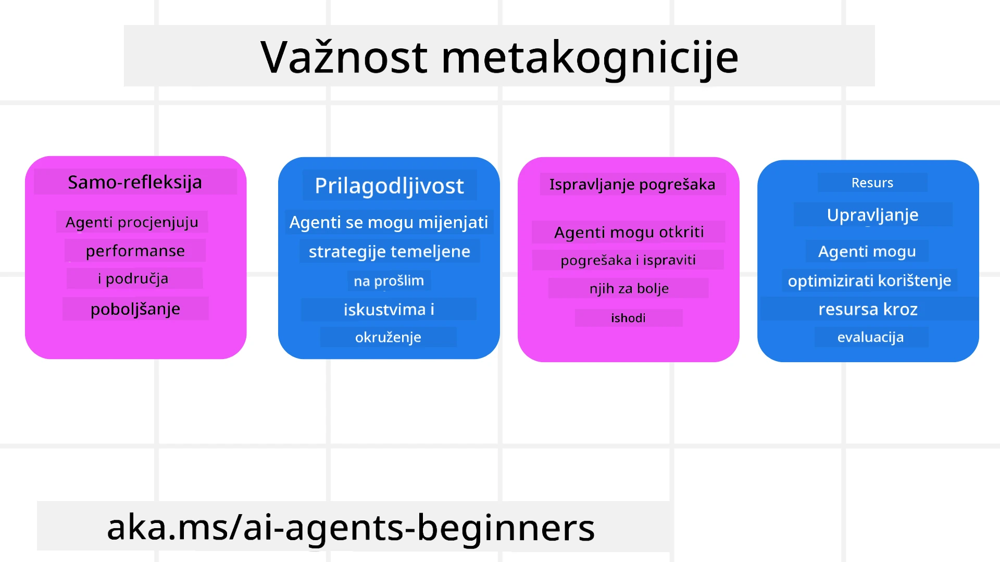
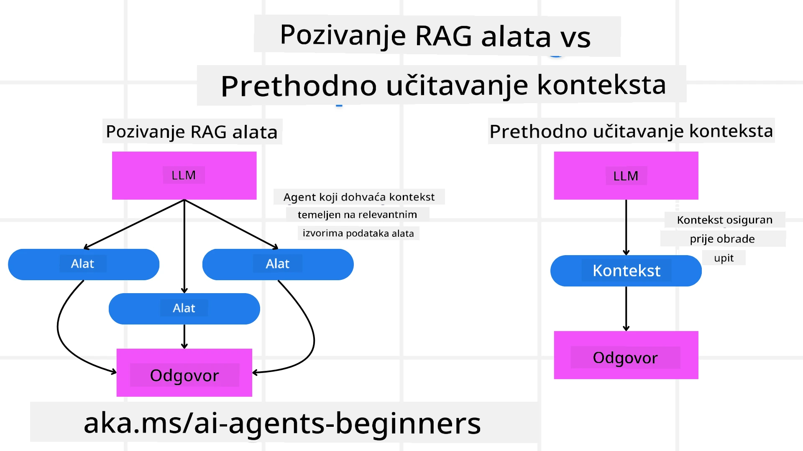

[](https://youtu.be/His9R6gw6Ec?si=3_RMb8VprNvdLRhX)

> _(Kliknite na gornju sliku za pregled videa ove lekcije)_
# Metakognicija u AI agentima

## Uvod

Dobrodošli na lekciju o metakogniciji u AI agentima! Ovo poglavlje je namijenjeno početnicima koji su znatiželjni kako AI agenti mogu razmišljati o vlastitim procesima razmišljanja. Do kraja ove lekcije razumjet ćete ključne koncepte i imat ćete praktične primjere za primjenu metakognicije u dizajnu AI agenata.

## Ciljevi učenja

Nakon dovršetka ove lekcije moći ćete:

1. Razumjeti implikacije petlji rezoniranja u definicijama agenata.
2. Koristiti tehnike planiranja i evaluacije za pomoć samopopravljajućim agentima.
3. Kreirati vlastite agente sposobne manipulirati kodom za izvršavanje zadataka.

## Uvod u Metakogniciju

Metakognicija se odnosi na kognitivne procese višeg reda koji uključuju razmišljanje o vlastitom razmišljanju. Za AI agente, to znači sposobnost procjene i prilagodbe svojih radnji na temelju samosvijesti i prošlih iskustava. Metakognicija, ili "razmišljanje o razmišljanju," važan je koncept u razvoju agentnih AI sustava. Uključuje AI sustave koji su svjesni vlastitih unutarnjih procesa i sposobni su nadzirati, regulirati i prilagođavati svoje ponašanje u skladu s tim. Baš kao što mi činimo kada "čitajemo prostoriju" ili gledamo problem. Ova samosvijest može pomoći AI sustavima da donose bolje odluke, prepoznaju pogreške i poboljšaju svoje performanse tijekom vremena - opet se vraćajući na Turingov test i raspravu o tome hoće li AI preuzeti kontrolu.

U kontekstu agentnih AI sustava, metakognicija može pomoći u rješavanju nekoliko izazova, kao što su:
- Transparentnost: Osiguravanje da AI sustavi mogu objasniti svoje rezoniranje i odluke.
- Rezoniranje: Unapređenje sposobnosti AI sustava da sintetiziraju informacije i donose ispravne odluke.
- Adaptacija: Omogućavanje AI sustavima da se prilagode novim okruženjima i promjenjivim uvjetima.
- Percepcija: Poboljšanje točnosti AI sustava u prepoznavanju i tumačenju podataka iz okoline.

### Što je Metakognicija?

Metakognicija, ili "razmišljanje o razmišljanju," je kognitivni proces višeg reda koji uključuje samosvijest i samoregulaciju vlastitih kognitivnih procesa. U području AI, metakognicija agentima omogućuje da procjenjuju i prilagođavaju svoje strategije i radnje, što dovodi do boljih sposobnosti rješavanja problema i donošenja odluka. Razumijevanjem metakognicije možete dizajnirati AI agente koji nisu samo pametniji već i prilagodljiviji i učinkovitiji. U pravoj metakogniciji vidjeli biste AI kako izričito rezonira o vlastitom rezoniranju.

Primjer: „Prioritizirao sam jeftinije letove jer… možda propustim direktne letove, pa ću ponovno provjeriti.“
Praćenje kako ili zašto je odabrao određenu rutu.
- Primjećivanje da je napravio pogreške jer se previše oslanjao na korisničke preferencije od prošlog puta, pa mijenja strategiju donošenja odluka, a ne samo konačnu preporuku.
- Dijagnosticiranje obrazaca poput: „Kad god vidim da korisnik spomene 'previše gužve', ne bih trebao samo ukloniti određene atrakcije, već također razmisliti da je moj način odabira 'najboljih atrakcija' pogrešan ako uvijek rangiram po popularnosti.“

### Važnost Metakognicije u AI Agentima

Metakognicija ima ključnu ulogu u dizajnu AI agenata iz nekoliko razloga:



- Samorefleksija: Agenti mogu procjenjivati vlastite performanse i identificirati područja za poboljšanje.
- Prilagodljivost: Agenti mogu mijenjati svoje strategije na temelju prošlih iskustava i promjenjivih okruženja.
- Ispravljanje pogrešaka: Agenti mogu samostalno otkrivati i ispravljati pogreške, što vodi do točnijih rezultata.
- Upravljanje resursima: Agenti mogu optimizirati korištenje resursa, poput vremena i računalne snage, planiranjem i evaluacijom svojih radnji.

## Komponente AI Agenta

Prije nego što zaronimo u metakognitivne procese, važno je razumjeti osnovne komponente AI agenta. AI agent obično se sastoji od:

- Persona: Osobnost i karakteristike agenta koje definiraju kako komunicira s korisnicima.
- Alati: Sposobnosti i funkcije koje agent može izvršavati.
- Vještine: Znanja i stručnosti koje agent posjeduje.

Ove komponente rade zajedno kako bi stvorile "stručnu jedinicu" koja može izvršavati specifične zadatke.

**Primjer**:
Razmislite o turističkom agentu, agenta usluga koji ne samo da planira vaš odmor, već i prilagođava svoj put na temelju podataka u stvarnom vremenu i prethodnih iskustava kupaca.

### Primjer: Metakognicija u usluzi Turističkog Agenta

Zamislite da dizajnirate uslugu turističkog agenta koju pokreće AI. Taj agent, "Turistički agent," pomaže korisnicima u planiranju njihovih odmora. Da biste uključili metakogniciju, Turistički agent treba evaluirati i prilagođavati svoje radnje na temelju samosvijesti i prošlih iskustava. Evo kako metakognicija može igrati ulogu:

#### Trenutni zadatak

Trenutni zadatak je pomoći korisniku planirati putovanje u Pariz.

#### Koraci za izvršenje zadatka

1. **Prikupljanje korisničkih preferencija**: Pitajte korisnika za datume putovanja, budžet, interese (npr. muzeji, kuhinja, kupovina) i posebne zahtjeve.
2. **Prikupljanje informacija**: Potražite opcije leta, smještaja, atrakcija i restorana koje odgovaraju korisničkim preferencijama.
3. **Generiranje preporuka**: Ponudite personalizirani plan puta s detaljima o letu, rezervacijama hotela i predloženim aktivnostima.
4. **Prilagodba na temelju povratnih informacija**: Pitajte korisnika za povratne informacije o preporukama i napravite potrebne prilagodbe.

#### Potrebni resursi

- Pristup bazama podataka za rezervacije leta i hotela.
- Informacije o pariškim atrakcijama i restoranima.
- Podaci o povratnim informacijama korisnika iz prethodnih interakcija.

#### Iskustvo i samorefleksija

Turistički agent koristi metakogniciju za evaluaciju svog rada i učenje iz prošlih iskustava. Na primjer:

1. **Analiza povratnih informacija korisnika**: Turistički agent pregledava povratne informacije korisnika da utvrdi koje su preporuke bile dobro prihvaćene, a koje nisu. Prilagođava buduće prijedloge sukladno tome.
2. **Prilagodljivost**: Ako je korisnik prethodno spomenuo da ne voli pretrpana mjesta, Turistički agent će ubuduće izbjegavati preporučivati popularne turističke destinacije tijekom vršnih sati.
3. **Ispravljanje pogrešaka**: Ako je Turistički agent napravio pogrešku u prethodnoj rezervaciji, poput predlaganja hotela koji je bio u potpunosti rezerviran, uči provjeravati dostupnost temeljitije prije davanja preporuka.

#### Praktični primjer za developere

Evo pojednostavljenog primjera kako bi kod Turističkog agenta mogao izgledati pri uključivanju metakognicije:

```python
class Travel_Agent:
    def __init__(self):
        self.user_preferences = {}
        self.experience_data = []

    def gather_preferences(self, preferences):
        self.user_preferences = preferences

    def retrieve_information(self):
        # Pretražujte letove, hotele i atrakcije na temelju preferencija
        flights = search_flights(self.user_preferences)
        hotels = search_hotels(self.user_preferences)
        attractions = search_attractions(self.user_preferences)
        return flights, hotels, attractions

    def generate_recommendations(self):
        flights, hotels, attractions = self.retrieve_information()
        itinerary = create_itinerary(flights, hotels, attractions)
        return itinerary

    def adjust_based_on_feedback(self, feedback):
        self.experience_data.append(feedback)
        # Analizirajte povratne informacije i prilagodite buduće preporuke
        self.user_preferences = adjust_preferences(self.user_preferences, feedback)

# Primjer korištenja
travel_agent = Travel_Agent()
preferences = {
    "destination": "Paris",
    "dates": "2025-04-01 to 2025-04-10",
    "budget": "moderate",
    "interests": ["museums", "cuisine"]
}
travel_agent.gather_preferences(preferences)
itinerary = travel_agent.generate_recommendations()
print("Suggested Itinerary:", itinerary)
feedback = {"liked": ["Louvre Museum"], "disliked": ["Eiffel Tower (too crowded)"]}
travel_agent.adjust_based_on_feedback(feedback)
```

#### Zašto je Metakognicija važna

- **Samorefleksija**: Agenti mogu analizirati svoje performanse i identificirati područja za poboljšanje.
- **Prilagodljivost**: Agenti mogu mijenjati strategije na temelju povratnih informacija i promjenjivih uvjeta.
- **Ispravljanje pogrešaka**: Agenti mogu samostalno otkrivati i ispravljati pogreške.
- **Upravljanje resursima**: Agenti mogu optimizirati korištenje resursa, poput vremena i računalne snage.

Uvođenjem metakognicije, Turistički agent može pružiti personaliziranije i točnije preporuke za putovanja, poboljšavajući cjelokupno korisničko iskustvo.

---

## 2. Planiranje u agentima

Planiranje je ključna komponenta ponašanja AI agenta. Uključuje opisivanje koraka potrebnih za postizanje cilja, uzimajući u obzir trenutni status, resurse i moguće prepreke.

### Elementi planiranja

- **Trenutni zadatak**: Jasno definirajte zadatak.
- **Koraci za izvršenje zadatka**: Razlomite zadatak na upravljive korake.
- **Potrebni resursi**: Identificirajte potrebne resurse.
- **Iskustvo**: Iskoristite prošla iskustva za informiranje planiranja.

**Primjer**:
Evo koraka koje Turistički agent treba poduzeti da učinkovito pomogne korisniku u planiranju putovanja:

### Koraci za Turistički Agent

1. **Prikupljanje korisničkih preferencija**
   - Pitajte korisnika o detaljima njegovih datuma putovanja, budžeta, interesa i svih posebnih zahtjeva.
   - Primjeri: "Kada planirate putovati?" "Koji je vaš budžet?" "Koje aktivnosti volite tijekom odmora?"

2. **Prikupljanje informacija**
   - Potražite relevantne opcije putovanja na temelju korisničkih preferencija.
   - **Letovi**: Potražite dostupne letove unutar budžeta i na željene datume.
   - **Smještaj**: Pronađite hotele ili najam nekretnina koji odgovaraju preferencijama korisnika u pogledu lokacije, cijene i sadržaja.
   - **Atrakcije i restorani**: Identificirajte popularne atrakcije, aktivnosti i opcije za jelo koje odgovaraju interesima korisnika.

3. **Generiranje preporuka**
   - Sastavite prikupljene informacije u personalizirani plan putovanja.
   - Osigurajte detalje poput opcija leta, rezervacija hotela i predloženih aktivnosti, prilagođavajući preporuke korisnikovim interesima.

4. **Predstavljanje plana korisniku**
   - Podijelite predloženi plan putovanja s korisnikom radi pregleda.
   - Primjer: "Evo predloženog plana za vaše putovanje u Pariz. Uključuje detalje o letu, rezervacije hotela i popis preporučenih aktivnosti i restorana. Recite mi svoje mišljenje!"

5. **Prikupljanje povratnih informacija**
   - Pitajte korisnika za povratne informacije o predloženom planu.
   - Primjeri: "Sviđaju li vam se opcije leta?" "Odgovara li hotel vašim potrebama?" "Postoje li aktivnosti koje želite dodati ili ukloniti?"

6. **Prilagodba na temelju povratnih informacija**
   - Izmijenite plan prema korisnikovim povratnim informacijama.
   - Napravite potrebne promjene u preporukama za let, smještaj i aktivnosti kako bi se bolje uskladile s preferencijama korisnika.

7. **Završna potvrda**
   - Prezentirajte ažurirani plan korisniku za konačnu potvrdu.
   - Primjer: "Napravio sam izmjene prema vašim povratnim informacijama. Evo ažuriranog plana. Je li sve u redu?"

8. **Rezervacija i potvrda**
   - Nakon što korisnik odobri plan, nastavite s rezervacijom letova, smještaja i unaprijed planiranih aktivnosti.
   - Pošaljite korisniku potvrde.

9. **Pružanje kontinuirane podrške**
   - Budite dostupni za pomoć korisniku s bilo kakvim promjenama ili dodatnim zahtjevima prije i tijekom putovanja.
   - Primjer: "Ako vam zatreba dodatna pomoć tijekom putovanja, slobodno mi se obratite u bilo koje vrijeme!"

### Primjer interakcije

```python
class Travel_Agent:
    def __init__(self):
        self.user_preferences = {}
        self.experience_data = []

    def gather_preferences(self, preferences):
        self.user_preferences = preferences

    def retrieve_information(self):
        flights = search_flights(self.user_preferences)
        hotels = search_hotels(self.user_preferences)
        attractions = search_attractions(self.user_preferences)
        return flights, hotels, attractions

    def generate_recommendations(self):
        flights, hotels, attractions = self.retrieve_information()
        itinerary = create_itinerary(flights, hotels, attractions)
        return itinerary

    def adjust_based_on_feedback(self, feedback):
        self.experience_data.append(feedback)
        self.user_preferences = adjust_preferences(self.user_preferences, feedback)

# Primjer upotrebe unutar zahtjeva za rezervaciju
travel_agent = Travel_Agent()
preferences = {
    "destination": "Paris",
    "dates": "2025-04-01 to 2025-04-10",
    "budget": "moderate",
    "interests": ["museums", "cuisine"]
}
travel_agent.gather_preferences(preferences)
itinerary = travel_agent.generate_recommendations()
print("Suggested Itinerary:", itinerary)
feedback = {"liked": ["Louvre Museum"], "disliked": ["Eiffel Tower (too crowded)"]}
travel_agent.adjust_based_on_feedback(feedback)
```

## 3. Korektivni RAG sustav

Prvo, započnimo razumijevanjem razlike između RAG Alata i preventivnog učitavanja konteksta.



### Sustav za generiranje s proširenim dohvatom (RAG)

RAG kombinira sustav za dohvaćanje s generativnim modelom. Kada se postavi upit, sustav dohvaćanja pronalazi relevantne dokumente ili podatke iz vanjskog izvora, a te dohvaćene informacije se koriste za proširenje ulaza u generativni model. To pomaže modelu da generira preciznije i kontekstualno relevantnije odgovore.

U RAG sustavu, agent dohvaća relevantne informacije iz baze znanja i koristi ih za generiranje prikladnih odgovora ili radnji.

### Korektivni RAG pristup

Korektivni RAG pristup fokusira se na korištenje RAG tehnika za ispravljanje pogrešaka i poboljšanje točnosti AI agenata. Ovo uključuje:

1. **Tehnika upita**: Korištenje specifičnih upita za usmjeravanje agenta u dohvaćanju relevantnih informacija.
2. **Alat**: Implementacija algoritama i mehanizama koji omogućuju agentu procjenu relevantnosti dohvaćenih informacija i generiranje točnih odgovora.
3. **Evaluacija**: Kontinuirano procjenjivanje performansi agenta i prilagodbe kako bi se poboljšala točnost i učinkovitost.

#### Primjer: Korektivni RAG u pretraživačkom agentu

Razmotrite pretraživačkog agenta koji dohvaća informacije s weba za odgovaranje na korisničke upite. Korektivni RAG pristup mogao bi uključivati:

1. **Tehnika upita**: Formuliranje upita za pretraživanje na temelju korisničkog unosa.
2. **Alat**: Korištenje algoritama obrade prirodnog jezika i strojnog učenja za rangiranje i filtriranje rezultata pretraživanja.
3. **Evaluacija**: Analizu povratnih informacija korisnika za identifikaciju i ispravljanje netočnosti u dohvaćenoj informaciji.

### Korektivni RAG u Turističkom agentu

Korektivni RAG (Retrieval-Augmented Generation) poboljšava sposobnost AI za dohvat i generiranje informacija dok ispravlja sve netočnosti. Pogledajmo kako Turistički agent može koristiti Korektivni RAG pristup za pružanje točnijih i relevantnijih putničkih preporuka.

To uključuje:

- **Tehnika upita:** Korištenje specifičnih upita za usmjeravanje agenta u dohvaćanju relevantnih informacija.
- **Alat:** Implementaciju algoritama i mehanizama koji omogućuju agentu procjenu relevantnosti dohvaćenih podataka i generiranje točnih odgovora.
- **Evaluaciju:** Kontinuiranu procjenu performansi agenta i prilagodbe za poboljšanje točnosti i učinkovitosti.

#### Koraci za implementaciju Korektivnog RAG u Turističkom agentu

1. **Početna interakcija s korisnikom**
   - Turistički agent prikuplja početne preferencije korisnika, kao što su destinacija, datumi putovanja, budžet i interesi.
   - Primjer:

     ```python
     preferences = {
         "destination": "Paris",
         "dates": "2025-04-01 to 2025-04-10",
         "budget": "moderate",
         "interests": ["museums", "cuisine"]
     }
     ```

2. **Dohvat informacija**
   - Turistički agent dohvaća informacije o letovima, smještaju, atrakcijama i restoranima na temelju korisničkih preferencija.
   - Primjer:

     ```python
     flights = search_flights(preferences)
     hotels = search_hotels(preferences)
     attractions = search_attractions(preferences)
     ```

3. **Generiranje početnih preporuka**
   - Turistički agent koristi dohvaćene informacije za generiranje personaliziranog itinerera.
   - Primjer:

     ```python
     itinerary = create_itinerary(flights, hotels, attractions)
     print("Suggested Itinerary:", itinerary)
     ```

4. **Prikupljanje povratnih informacija korisnika**
   - Turistički agent traži povratne informacije od korisnika o početnim preporukama.
   - Primjer:

     ```python
     feedback = {
         "liked": ["Louvre Museum"],
         "disliked": ["Eiffel Tower (too crowded)"]
     }
     ```

5. **Korektivni RAG proces**
   - **Tehnika upita**: Turistički agent formulira nove upite za pretraživanje na temelju povratnih informacija korisnika.
     - Primjer:

       ```python
       if "disliked" in feedback:
           preferences["avoid"] = feedback["disliked"]
       ```

   - **Alat**: Turistički agent koristi algoritme za rangiranje i filtriranje novih rezultata pretraživanja, naglašavajući relevantnost prema povratnim informacijama.
     - Primjer:

       ```python
       new_attractions = search_attractions(preferences)
       new_itinerary = create_itinerary(flights, hotels, new_attractions)
       print("Updated Itinerary:", new_itinerary)
       ```

   - **Evaluacija**: Turistički agent kontinuirano procjenjuje relevantnost i točnost svojih preporuka analizirajući povratne informacije korisnika i vršeći potrebne prilagodbe.
     - Primjer:

       ```python
       def adjust_preferences(preferences, feedback):
           if "liked" in feedback:
               preferences["favorites"] = feedback["liked"]
           if "disliked" in feedback:
               preferences["avoid"] = feedback["disliked"]
           return preferences

       preferences = adjust_preferences(preferences, feedback)
       ```

#### Praktični primjer

Evo pojednostavljenog Python koda koji uključuje Korektivni RAG pristup u Turističkom agentu:

```python
class Travel_Agent:
    def __init__(self):
        self.user_preferences = {}
        self.experience_data = []

    def gather_preferences(self, preferences):
        self.user_preferences = preferences

    def retrieve_information(self):
        flights = search_flights(self.user_preferences)
        hotels = search_hotels(self.user_preferences)
        attractions = search_attractions(self.user_preferences)
        return flights, hotels, attractions

    def generate_recommendations(self):
        flights, hotels, attractions = self.retrieve_information()
        itinerary = create_itinerary(flights, hotels, attractions)
        return itinerary

    def adjust_based_on_feedback(self, feedback):
        self.experience_data.append(feedback)
        self.user_preferences = adjust_preferences(self.user_preferences, feedback)
        new_itinerary = self.generate_recommendations()
        return new_itinerary

# Primjer upotrebe
travel_agent = Travel_Agent()
preferences = {
    "destination": "Paris",
    "dates": "2025-04-01 to 2025-04-10",
    "budget": "moderate",
    "interests": ["museums", "cuisine"]
}
travel_agent.gather_preferences(preferences)
itinerary = travel_agent.generate_recommendations()
print("Suggested Itinerary:", itinerary)
feedback = {"liked": ["Louvre Museum"], "disliked": ["Eiffel Tower (too crowded)"]}
new_itinerary = travel_agent.adjust_based_on_feedback(feedback)
print("Updated Itinerary:", new_itinerary)
```

### Preventivno učitavanje konteksta
Pre-emptivno učitavanje konteksta uključuje učitavanje relevantnog konteksta ili pozadinskih informacija u model prije obrade upita. To znači da model ima pristup tim informacijama od početka, što mu može pomoći da generira bolje informirane odgovore bez potrebe za dohvaćanjem dodatnih podataka tijekom procesa.

Evo pojednostavljenog primjera kako bi pre-emptivno učitavanje konteksta moglo izgledati za aplikaciju turističkog agenta u Pythonu:

```python
class TravelAgent:
    def __init__(self):
        # Unaprijed učitaj popularna odredišta i njihove informacije
        self.context = {
            "Paris": {"country": "France", "currency": "Euro", "language": "French", "attractions": ["Eiffel Tower", "Louvre Museum"]},
            "Tokyo": {"country": "Japan", "currency": "Yen", "language": "Japanese", "attractions": ["Tokyo Tower", "Shibuya Crossing"]},
            "New York": {"country": "USA", "currency": "Dollar", "language": "English", "attractions": ["Statue of Liberty", "Times Square"]},
            "Sydney": {"country": "Australia", "currency": "Dollar", "language": "English", "attractions": ["Sydney Opera House", "Bondi Beach"]}
        }

    def get_destination_info(self, destination):
        # Dohvati informacije o odredištu iz unaprijed učitanog konteksta
        info = self.context.get(destination)
        if info:
            return f"{destination}:\nCountry: {info['country']}\nCurrency: {info['currency']}\nLanguage: {info['language']}\nAttractions: {', '.join(info['attractions'])}"
        else:
            return f"Sorry, we don't have information on {destination}."

# Primjer korištenja
travel_agent = TravelAgent()
print(travel_agent.get_destination_info("Paris"))
print(travel_agent.get_destination_info("Tokyo"))
```

#### Objašnjenje

1. **Inicijalizacija (`__init__` metoda)**: Klasa `TravelAgent` unaprijed učitava rječnik koji sadrži informacije o popularnim destinacijama kao što su Pariz, Tokio, New York i Sydney. Taj rječnik uključuje detalje poput države, valute, jezika i glavnih atrakcija za svaku destinaciju.

2. **Dohvaćanje informacija (`get_destination_info` metoda)**: Kada korisnik upita o određenoj destinaciji, metoda `get_destination_info` dohvaća relevantne informacije iz unaprijed učitanog rječnika konteksta.

Unaprijed učitavanjem konteksta aplikacija turističkog agenta može brzo odgovoriti na korisničke upite bez potrebe za dohvaćanjem informacija iz vanjskog izvora u stvarnom vremenu. To čini aplikaciju učinkovitijom i responzivnijom.

### Inicijaliziranje plana s ciljem prije iteriranja

Inicijaliziranje plana s ciljem uključuje početak s jasnim ciljem ili željenim ishodom na umu. Definiranjem tog cilja unaprijed, model može koristiti ga kao osnovno pravilo tijekom iterativnog procesa. To pomaže osigurati da se svaki korak približava postizanju željenog ishoda, čineći proces učinkovitijim i fokusiranim.

Evo primjera kako možete inicijalizirati plan putovanja s ciljem prije iteriranja za turističkog agenta u Pythonu:

### Scenarij

Turistički agent želi isplanirati prilagođeni odmor za klijenta. Cilj je kreirati itinerar putovanja koji maksimizira zadovoljstvo klijenta na temelju njegovih preferencija i proračuna.

### Koraci

1. Definirati preferencije i proračun klijenta.
2. Inicijalizirati početni plan na temelju tih preferencija.
3. Iterirati kako bi se plan usavršio, optimizirajući zadovoljstvo klijenta.

#### Python kod

```python
class TravelAgent:
    def __init__(self, destinations):
        self.destinations = destinations

    def bootstrap_plan(self, preferences, budget):
        plan = []
        total_cost = 0

        for destination in self.destinations:
            if total_cost + destination['cost'] <= budget and self.match_preferences(destination, preferences):
                plan.append(destination)
                total_cost += destination['cost']

        return plan

    def match_preferences(self, destination, preferences):
        for key, value in preferences.items():
            if destination.get(key) != value:
                return False
        return True

    def iterate_plan(self, plan, preferences, budget):
        for i in range(len(plan)):
            for destination in self.destinations:
                if destination not in plan and self.match_preferences(destination, preferences) and self.calculate_cost(plan, destination) <= budget:
                    plan[i] = destination
                    break
        return plan

    def calculate_cost(self, plan, new_destination):
        return sum(destination['cost'] for destination in plan) + new_destination['cost']

# Primjer korištenja
destinations = [
    {"name": "Paris", "cost": 1000, "activity": "sightseeing"},
    {"name": "Tokyo", "cost": 1200, "activity": "shopping"},
    {"name": "New York", "cost": 900, "activity": "sightseeing"},
    {"name": "Sydney", "cost": 1100, "activity": "beach"},
]

preferences = {"activity": "sightseeing"}
budget = 2000

travel_agent = TravelAgent(destinations)
initial_plan = travel_agent.bootstrap_plan(preferences, budget)
print("Initial Plan:", initial_plan)

refined_plan = travel_agent.iterate_plan(initial_plan, preferences, budget)
print("Refined Plan:", refined_plan)
```

#### Objašnjenje koda

1. **Inicijalizacija (`__init__` metoda)**: Klasa `TravelAgent` inicijalizirana je s listom potencijalnih destinacija, od kojih svaka ima atribute poput imena, cijene i vrste aktivnosti.

2. **Inicijaliziranje plana (`bootstrap_plan` metoda)**: Ova metoda stvara početni plan putovanja na temelju preferencija i proračuna klijenta. Prolazi kroz listu destinacija i dodaje ih u plan ako odgovaraju preferencijama klijenta i uklapaju se u proračun.

3. **Usporedba preferencija (`match_preferences` metoda)**: Ova metoda provjerava odgovara li destinacija preferencijama klijenta.

4. **Iteriranje plana (`iterate_plan` metoda)**: Ova metoda usavršava početni plan pokušavajući zamijeniti svaku destinaciju u planu boljom opcijom, uzimajući u obzir preferencije klijenta i proračunska ograničenja.

5. **Izračun troškova (`calculate_cost` metoda)**: Ova metoda računa ukupne troškove trenutnog plana, uključujući potencijalno novu destinaciju.

#### Primjer upotrebe

- **Početni plan**: Turistički agent stvara početni plan na temelju klijentovih preferencija za razgledavanje i proračuna od 2000$.
- **Usavršen plan**: Turistički agent iterira plan, optimizirajući prema preferencijama i proračunu klijenta.

Inicijaliziranjem plana s jasnim ciljem (npr. maksimiziranjem zadovoljstva klijenta) i iteriranjem za usavršavanje plana, turistički agent može kreirati prilagođeni i optimizirani itinerar putovanja za klijenta. Ovaj pristup osigurava da plan putovanja od samog početka odgovara klijentovim preferencijama i budžetu i napreduje kroz svaku iteraciju.

### Iskorištavanje LLM-a za ponovnu rangiranje i ocjenjivanje

Veliki jezični modeli (LLM) mogu se koristiti za ponovnu rangiranje i ocjenjivanje tako da procjenjuju relevantnost i kvalitetu dohvaćenih dokumenata ili generiranih odgovora. Evo kako to radi:

**Dohvaćanje:** Početni korak dohvaća skup kandidata dokumenata ili odgovora temeljem upita.

**Ponovno rangiranje:** LLM ocenjuje te kandidate i ponovno ih rangira temeljeno na relevantnosti i kvaliteti. Ovaj korak osigurava da se najrelevantnije i najkvalitetnije informacije prikazuju prve.

**Ocjenjivanje:** LLM dodjeljuje ocjene svakom kandidatu, odražavajući njihovu relevantnost i kvalitetu. To pomaže u odabiru najboljeg odgovora ili dokumenta za korisnika.

Iskorištavanjem LLM-a za ponovno rangiranje i ocjenjivanje sustav može pružiti točnije i kontekstualno relevantnije informacije, poboljšavajući ukupno korisničko iskustvo.

Evo primjera kako bi turistički agent mogao koristiti Veliki jezični model (LLM) za ponovno rangiranje i ocjenjivanje turističkih destinacija na temelju preferencija korisnika u Pythonu:

#### Scenarij - Putovanje temeljem preferencija

Turistički agent želi preporučiti najbolje turističke destinacije klijentu na temelju njegovih preferencija. LLM će pomoći u ponovnom rangiranju i ocjenjivanju destinacija kako bi se osiguralo da se prikažu najrelevantnije opcije.

#### Koraci:

1. Prikupiti korisničke preferencije.
2. Dohvatiti listu potencijalnih destinacija za putovanje.
3. Upotrijebiti LLM za ponovno rangiranje i ocjenjivanje destinacija na temelju korisničkih preferencija.

Evo kako možete nadograditi prethodni primjer za korištenje Azure OpenAI usluga:

#### Zahtjevi

1. Potrebno je imati Azure pretplatu.
2. Kreirajte Azure OpenAI resurs i nabavite svoj API ključ.

#### Primjer Python koda

```python
import requests
import json

class TravelAgent:
    def __init__(self, destinations):
        self.destinations = destinations

    def get_recommendations(self, preferences, api_key, endpoint):
        # Generirajte upit za Azure OpenAI
        prompt = self.generate_prompt(preferences)
        
        # Definirajte zaglavlja i sadržaj zahtjeva
        headers = {
            'Content-Type': 'application/json',
            'Authorization': f'Bearer {api_key}'
        }
        payload = {
            "prompt": prompt,
            "max_tokens": 150,
            "temperature": 0.7
        }
        
        # Pozovite Azure OpenAI API za dobivanje ponovno rangiranih i ocijenjenih odredišta
        response = requests.post(endpoint, headers=headers, json=payload)
        response_data = response.json()
        
        # Izvucite i vratite preporuke
        recommendations = response_data['choices'][0]['text'].strip().split('\n')
        return recommendations

    def generate_prompt(self, preferences):
        prompt = "Here are the travel destinations ranked and scored based on the following user preferences:\n"
        for key, value in preferences.items():
            prompt += f"{key}: {value}\n"
        prompt += "\nDestinations:\n"
        for destination in self.destinations:
            prompt += f"- {destination['name']}: {destination['description']}\n"
        return prompt

# Primjer korištenja
destinations = [
    {"name": "Paris", "description": "City of lights, known for its art, fashion, and culture."},
    {"name": "Tokyo", "description": "Vibrant city, famous for its modernity and traditional temples."},
    {"name": "New York", "description": "The city that never sleeps, with iconic landmarks and diverse culture."},
    {"name": "Sydney", "description": "Beautiful harbour city, known for its opera house and stunning beaches."},
]

preferences = {"activity": "sightseeing", "culture": "diverse"}
api_key = 'your_azure_openai_api_key'
endpoint = 'https://your-endpoint.com/openai/deployments/your-deployment-name/completions?api-version=2022-12-01'

travel_agent = TravelAgent(destinations)
recommendations = travel_agent.get_recommendations(preferences, api_key, endpoint)
print("Recommended Destinations:")
for rec in recommendations:
    print(rec)
```

#### Objašnjenje koda - Preference Booker

1. **Inicijalizacija**: Klasa `TravelAgent` inicijalizirana je s listom potencijalnih destinacija za putovanje, od kojih svaka ima atribute poput imena i opisa.

2. **Dohvaćanje preporuka (`get_recommendations` metoda)**: Ova metoda generira prompt za Azure OpenAI uslugu na temelju korisničkih preferencija i šalje HTTP POST zahtjev Azure OpenAI API-ju za dobivanje ponovo rangiranih i ocijenjenih destinacija.

3. **Generiranje prompta (`generate_prompt` metoda)**: Ova metoda sastavlja prompt za Azure OpenAI, uključujući korisničke preferencije i listu destinacija. Prompt usmjerava model da ponovo rangira i ocijeni destinacije na temelju danih preferencija.

4. **Poziv API-ja**: Biblioteka `requests` koristi se za slanje HTTP POST zahtjeva prema Azure OpenAI API endpointu. Odgovor sadrži ponovo rangirane i ocijenjene destinacije.

5. **Primjer upotrebe**: Turistički agent prikuplja korisničke preferencije (npr. interes za razgledanje i raznoliku kulturu) i koristi Azure OpenAI uslugu za dobivanje preporuka za destinacije s rangiranjem i ocjenama.

Obavezno zamijenite `your_azure_openai_api_key` stvarnim API ključem za Azure OpenAI i `https://your-endpoint.com/...` stvarnim URL-om vašeg Azure OpenAI endpointa.

Iskorištavanjem LLM-a za ponovno rangiranje i ocjenjivanje, turistički agent može pružiti personaliziranije i relevantnije preporuke za putovanja klijentima, poboljšavajući njihovo ukupno iskustvo.

### RAG: Tehnika promptiranja nasuprot alatu

Retrieval-Augmented Generation (RAG) može biti i tehnika promptiranja i alat u razvoju AI agenata. Razumijevanje razlike između njih može vam pomoći da učinkovitije iskoristite RAG u svojim projektima.

#### RAG kao tehnika promptiranja

**Što je to?**

- Kao tehnika promptiranja, RAG uključuje formuliranje specifičnih upita ili promptova za usmjeravanje dohvaćanja relevantnih informacija iz velikog korpusa ili baze podataka. Te se informacije zatim koriste za generiranje odgovora ili akcija.

**Kako radi:**

1. **Formuliranje promptova**: Izradite jasno strukturirane promptove ili upite temeljene na zadatku ili unosu korisnika.
2. **Dohvaćanje informacija**: Koristite promptove za pretraživanje relevantnih podataka iz postojeće baze znanja ili skupa podataka.
3. **Generiranje odgovora**: Kombinirajte dohvaćene informacije s generativnim AI modelima kako biste proizveli cjelovit i koherentan odgovor.

**Primjer u turističkom agentu**:

- Korisnički unos: "Želim posjetiti muzeje u Parizu."
- Prompt: "Pronađi najbolje muzeje u Parizu."
- Dohvaćene informacije: Detalji o Louvreu, Muzeju Orsay, itd.
- Generirani odgovor: "Evo nekoliko vrhunskih muzeja u Parizu: Louvre, Muzej Orsay i Centar Pompidou."

#### RAG kao alat

**Što je to?**

- Kao alat, RAG je integrirani sustav koji automatizira proces dohvaćanja i generiranja, olakšavajući programerima implementaciju složenih AI funkcionalnosti bez ručnog sastavljanja promptova za svaki upit.

**Kako radi:**

1. **Integracija**: Ugradite RAG u arhitekturu AI agenta, omogućujući mu automatsko upravljanje zadacima dohvaćanja i generiranja.
2. **Automatizacija**: Alat upravlja cijelim procesom — od primanja korisničkog unosa do generiranja konačnog odgovora — bez potrebe za eksplicitnim promptovima za svaki korak.
3. **Efikasnost**: Poboljšava performanse agenta optimizirajući proces dohvaćanja i generiranja, omogućujući brže i točnije odgovore.

**Primjer u turističkom agentu**:

- Korisnički unos: "Želim posjetiti muzeje u Parizu."
- RAG alat: Automatski dohvaća informacije o muzejima i generira odgovor.
- Generirani odgovor: "Evo nekoliko vrhunskih muzeja u Parizu: Louvre, Muzej Orsay i Centar Pompidou."

### Usporedba

| Aspekt                 | Tehnika promptiranja                                         | Alat                                                  |
|------------------------|-------------------------------------------------------------|-------------------------------------------------------|
| **Ručno vs Automatsko**| Ručno formuliranje promptova za svaki upit.                 | Automatizirani proces za dohvaćanje i generiranje.     |
| **Kontrola**            | Nudi veću kontrolu nad procesom dohvaćanja.                 | Pojednostavljuje i automatizira dohvaćanje i generiranje.|
| **Fleksibilnost**       | Omogućuje prilagođene promptove prema specifičnim potrebama.| Učinkovitije za masovne implementacije.               |
| **Složenost**           | Zahtijeva izradu i podešavanje promptova.                   | Lakše se integrira u arhitekturu AI agenta.           |

### Praktični primjeri

**Primjer tehnike promptiranja:**

```python
def search_museums_in_paris():
    prompt = "Find top museums in Paris"
    search_results = search_web(prompt)
    return search_results

museums = search_museums_in_paris()
print("Top Museums in Paris:", museums)
```

**Primjer alata:**

```python
class Travel_Agent:
    def __init__(self):
        self.rag_tool = RAGTool()

    def get_museums_in_paris(self):
        user_input = "I want to visit museums in Paris."
        response = self.rag_tool.retrieve_and_generate(user_input)
        return response

travel_agent = Travel_Agent()
museums = travel_agent.get_museums_in_paris()
print("Top Museums in Paris:", museums)
```

### Procjena relevantnosti

Procjena relevantnosti ključan je aspekt performansi AI agenta. Ona osigurava da su informacije koje agent dohvaća i generira prikladne, točne i korisne za korisnika. Pogledajmo kako procijeniti relevantnost u AI agentima, uključujući praktične primjere i tehnike.

#### Ključni pojmovi u procjeni relevantnosti

1. **Svijest o kontekstu**:
   - Agent mora razumjeti kontekst korisničkog upita kako bi dohvaćao i generirao relevantne informacije.
   - Primjer: Ako korisnik traži "najbolje restorane u Parizu", agent treba uzeti u obzir korisničke preferencije, poput tipa kuhinje i proračuna.

2. **Točnost**:
   - Informacije koje agent pruža trebaju biti činjenično ispravne i ažurirane.
   - Primjer: Preporučivanje trenutno otvorenih restorana s dobrim recenzijama umjesto zastarjelih ili zatvorenih opcija.

3. **Namjera korisnika**:
   - Agent treba shvatiti korisnikovu namjeru iza upita kako bi pružio najrelevantnije informacije.
   - Primjer: Ako korisnik traži "hoteli povoljni za budžet", agent treba prioritizirati pristupačne opcije.

4. **Povratna petlja**:
   - Kontinuirano prikupljanje i analiza korisničkih povratnih informacija pomaže agentu unaprijediti proces procjene relevantnosti.
   - Primjer: Uključivanje ocjena i povratnih informacija korisnika o prethodnim preporukama za poboljšanje budućih odgovora.

#### Praktične tehnike za procjenu relevantnosti

1. **Ocjena relevantnosti**:
   - Dodjeljivanje ocjene svakom dohvaćenom zapisu na temelju koliko dobro odgovara korisnikovom upitu i preferencijama.
   - Primjer:

     ```python
     def relevance_score(item, query):
         score = 0
         if item['category'] in query['interests']:
             score += 1
         if item['price'] <= query['budget']:
             score += 1
         if item['location'] == query['destination']:
             score += 1
         return score
     ```

2. **Filtriranje i rangiranje**:
   - Filtrirati irelevantne zapise i rangirati preostale na temelju njihovih ocjena relevantnosti.
   - Primjer:

     ```python
     def filter_and_rank(items, query):
         ranked_items = sorted(items, key=lambda item: relevance_score(item, query), reverse=True)
         return ranked_items[:10]  # Vrati top 10 relevantnih stavki
     ```

3. **Obrada prirodnog jezika (NLP)**:
   - Koristiti NLP tehnike za razumijevanje korisničkog upita i dohvaćanje relevantnih informacija.
   - Primjer:

     ```python
     def process_query(query):
         # Koristite NLP za izdvajanje ključnih informacija iz korisničkog upita
         processed_query = nlp(query)
         return processed_query
     ```

4. **Integracija korisničkih povratnih informacija**:
   - Prikupljati povratne informacije o pruženim preporukama i koristiti ih za podešavanje budućih procjena relevantnosti.
   - Primjer:

     ```python
     def adjust_based_on_feedback(feedback, items):
         for item in items:
             if item['name'] in feedback['liked']:
                 item['relevance'] += 1
             if item['name'] in feedback['disliked']:
                 item['relevance'] -= 1
         return items
     ```

#### Primjer: Procjena relevantnosti u Travel Agentu

Evo praktičnog primjera kako Travel Agent može procijeniti relevantnost putničkih preporuka:

```python
class Travel_Agent:
    def __init__(self):
        self.user_preferences = {}
        self.experience_data = []

    def gather_preferences(self, preferences):
        self.user_preferences = preferences

    def retrieve_information(self):
        flights = search_flights(self.user_preferences)
        hotels = search_hotels(self.user_preferences)
        attractions = search_attractions(self.user_preferences)
        return flights, hotels, attractions

    def generate_recommendations(self):
        flights, hotels, attractions = self.retrieve_information()
        ranked_hotels = self.filter_and_rank(hotels, self.user_preferences)
        itinerary = create_itinerary(flights, ranked_hotels, attractions)
        return itinerary

    def filter_and_rank(self, items, query):
        ranked_items = sorted(items, key=lambda item: self.relevance_score(item, query), reverse=True)
        return ranked_items[:10]  # Vrati prvih 10 relevantnih stavki

    def relevance_score(self, item, query):
        score = 0
        if item['category'] in query['interests']:
            score += 1
        if item['price'] <= query['budget']:
            score += 1
        if item['location'] == query['destination']:
            score += 1
        return score

    def adjust_based_on_feedback(self, feedback, items):
        for item in items:
            if item['name'] in feedback['liked']:
                item['relevance'] += 1
            if item['name'] in feedback['disliked']:
                item['relevance'] -= 1
        return items

# Primjer upotrebe
travel_agent = Travel_Agent()
preferences = {
    "destination": "Paris",
    "dates": "2025-04-01 to 2025-04-10",
    "budget": "moderate",
    "interests": ["museums", "cuisine"]
}
travel_agent.gather_preferences(preferences)
itinerary = travel_agent.generate_recommendations()
print("Suggested Itinerary:", itinerary)
feedback = {"liked": ["Louvre Museum"], "disliked": ["Eiffel Tower (too crowded)"]}
updated_items = travel_agent.adjust_based_on_feedback(feedback, itinerary['hotels'])
print("Updated Itinerary with Feedback:", updated_items)
```

### Pretraživanje s namjerom

Pretraživanje s namjerom uključuje razumijevanje i interpretaciju osnovne svrhe ili cilja iza korisničkog upita kako bi se dohvatila i generirala najrelevantnija i najkorisnija informacija. Ovaj pristup nadilazi puko usklađivanje ključnih riječi i fokusira se na shvaćanje stvarnih potreba i konteksta korisnika.

#### Ključni pojmovi u pretraživanju s namjerom

1. **Razumijevanje korisničke namjere**:
   - Korisnička namjera može se svrstati u tri glavna tipa: informativna, navigacijska i transakcijska.
     - **Informativna namjera**: Korisnik traži informacije o nekoj temi (npr. "Koji su najbolji muzeji u Parizu?").
     - **Navigacijska namjera**: Korisnik želi odći na određenu web stranicu ili stranicu (npr. "Službena stranica Louvrea").
     - **Transakcijska namjera**: Korisnik želi izvršiti transakciju, poput rezervacije leta ili kupovine (npr. "Rezerviraj let za Pariz").

2. **Svijest o kontekstu**:
   - Analiza konteksta korisničkog upita pomaže u točnom određivanju njihove namjere. To uključuje razmatranje prethodnih interakcija, korisničkih preferencija i specifičnih detalja trenutnog upita.

3. **Obrada prirodnog jezika (NLP)**:
   - NLP tehnike koriste se za razumijevanje i interpretaciju prirodnih jezičnih upita koje korisnici daju. To uključuje zadatke poput prepoznavanja entiteta, analize sentimenta i parsiranja upita.

4. **Personalizacija**:
   - Personalizacija rezultata pretraživanja temeljem povijesti korisnika, preferencija i povratnih informacija poboljšava relevantnost dohvaćenih informacija.

#### Praktični primjer: Pretraživanje s namjerom u Travel Agentu

Pogledajmo Travel Agent kao primjer kako se može implementirati pretraživanje s namjerom.

1. **Prikupljanje korisničkih preferencija**

   ```python
   class Travel_Agent:
       def __init__(self):
           self.user_preferences = {}

       def gather_preferences(self, preferences):
           self.user_preferences = preferences
   ```

2. **Razumijevanje korisničke namjere**

   ```python
   def identify_intent(query):
       if "book" in query or "purchase" in query:
           return "transactional"
       elif "website" in query or "official" in query:
           return "navigational"
       else:
           return "informational"
   ```

3. **Svijest o kontekstu**
   ```python
   def analyze_context(query, user_history):
       # Kombinirajte trenutni upit s korisničkom poviješću kako biste razumjeli kontekst
       context = {
           "current_query": query,
           "user_history": user_history
       }
       return context
   ```

4. **Pretraživanje i personalizacija rezultata**

   ```python
   def search_with_intent(query, preferences, user_history):
       intent = identify_intent(query)
       context = analyze_context(query, user_history)
       if intent == "informational":
           search_results = search_information(query, preferences)
       elif intent == "navigational":
           search_results = search_navigation(query)
       elif intent == "transactional":
           search_results = search_transaction(query, preferences)
       personalized_results = personalize_results(search_results, user_history)
       return personalized_results

   def search_information(query, preferences):
       # Primjer logike pretraživanja za informativnu namjeru
       results = search_web(f"best {preferences['interests']} in {preferences['destination']}")
       return results

   def search_navigation(query):
       # Primjer logike pretraživanja za navigacijsku namjeru
       results = search_web(query)
       return results

   def search_transaction(query, preferences):
       # Primjer logike pretraživanja za transakcijsku namjeru
       results = search_web(f"book {query} to {preferences['destination']}")
       return results

   def personalize_results(results, user_history):
       # Primjer personalizacijske logike
       personalized = [result for result in results if result not in user_history]
       return personalized[:10]  # Vrati top 10 personaliziranih rezultata
   ```

5. **Primjer upotrebe**

   ```python
   travel_agent = Travel_Agent()
   preferences = {
       "destination": "Paris",
       "interests": ["museums", "cuisine"]
   }
   travel_agent.gather_preferences(preferences)
   user_history = ["Louvre Museum website", "Book flight to Paris"]
   query = "best museums in Paris"
   results = search_with_intent(query, preferences, user_history)
   print("Search Results:", results)
   ```

---

## 4. Generiranje koda kao alat

Agenti za generiranje koda koriste AI modele za pisanje i izvršavanje koda, rješavajući složene probleme i automatizirajući zadatke.

### Agenti za generiranje koda

Agenti za generiranje koda koriste generativne AI modele za pisanje i izvršavanje koda. Ti agenti mogu rješavati složene probleme, automatizirati zadatke i pružati vrijedne uvide generiranjem i pokretanjem koda u raznim programskim jezicima.

#### Praktične primjene

1. **Automatizirano generiranje koda**: Generiranje isječaka koda za specifične zadatke, poput analize podataka, web scrapinga ili strojnog učenja.
2. **SQL kao RAG**: Korištenje SQL upita za dohvat i manipulaciju podacima iz baza podataka.
3. **Rješavanje problema**: Kreiranje i izvršavanje koda za rješavanje određenih problema, poput optimizacije algoritama ili analize podataka.

#### Primjer: Agent za generiranje koda za analizu podataka

Zamislite da dizajnirate agenta za generiranje koda. Evo kako bi to moglo funkcionirati:

1. **Zadatak**: Analizirati skup podataka kako bi se identificirali trendovi i obrasci.
2. **Koraci**:
   - Učitati skup podataka u alat za analizu podataka.
   - Generirati SQL upite za filtriranje i agregiranje podataka.
   - Izvršiti upite i dohvatiti rezultate.
   - Koristiti rezultate za generiranje vizualizacija i uvida.
3. **Potrebni resursi**: Pristup skupu podataka, alati za analizu podataka i SQL mogućnosti.
4. **Iskustvo**: Koristiti prethodne rezultate analiza za poboljšanje točnosti i relevantnosti budućih analiza.

### Primjer: Agent za generiranje koda za agenta za putovanja

U ovom primjeru dizajnirat ćemo agenta za generiranje koda, Travel Agent, koji pomaže korisnicima u planiranju putovanja generiranjem i izvršavanjem koda. Ovaj agent može obavljati zadatke poput pronalaska opcija za putovanje, filtriranja rezultata i sastavljanja itinerera koristeći generativnu AI.

#### Pregled agenta za generiranje koda

1. **Prikupljanje korisničkih preferencija**: Prikuplja korisničke unose kao što su destinacija, datumi putovanja, budžet i interesi.
2. **Generiranje koda za dohvat podataka**: Generira isječke koda za pristup podacima o letovima, hotelima i atrakcijama.
3. **Izvršavanje generiranog koda**: Pokreće generirani kod za dohvat podataka u stvarnom vremenu.
4. **Generiranje itinerera**: Sastavlja dohvaćene podatke u personalizirani plan putovanja.
5. **Prilagodba na temelju povratnih informacija**: Prima povratne informacije korisnika i prema potrebi regenerira kod za fino podešavanje rezultata.

#### Implementacija korak po korak

1. **Prikupljanje korisničkih preferencija**

   ```python
   class Travel_Agent:
       def __init__(self):
           self.user_preferences = {}

       def gather_preferences(self, preferences):
           self.user_preferences = preferences
   ```

2. **Generiranje koda za dohvat podataka**

   ```python
   def generate_code_to_fetch_data(preferences):
       # Primjer: Generiraj kod za pretraživanje letova na temelju korisničkih preferencija
       code = f"""
       def search_flights():
           import requests
           response = requests.get('https://api.example.com/flights', params={preferences})
           return response.json()
       """
       return code

   def generate_code_to_fetch_hotels(preferences):
       # Primjer: Generiraj kod za pretraživanje hotela
       code = f"""
       def search_hotels():
           import requests
           response = requests.get('https://api.example.com/hotels', params={preferences})
           return response.json()
       """
       return code
   ```

3. **Izvršavanje generiranog koda**

   ```python
   def execute_code(code):
       # Izvrši generirani kod koristeći exec
       exec(code)
       result = locals()
       return result

   travel_agent = Travel_Agent()
   preferences = {
       "destination": "Paris",
       "dates": "2025-04-01 to 2025-04-10",
       "budget": "moderate",
       "interests": ["museums", "cuisine"]
   }
   travel_agent.gather_preferences(preferences)
   
   flight_code = generate_code_to_fetch_data(preferences)
   hotel_code = generate_code_to_fetch_hotels(preferences)
   
   flights = execute_code(flight_code)
   hotels = execute_code(hotel_code)

   print("Flight Options:", flights)
   print("Hotel Options:", hotels)
   ```

4. **Generiranje itinerera**

   ```python
   def generate_itinerary(flights, hotels, attractions):
       itinerary = {
           "flights": flights,
           "hotels": hotels,
           "attractions": attractions
       }
       return itinerary

   attractions = search_attractions(preferences)
   itinerary = generate_itinerary(flights, hotels, attractions)
   print("Suggested Itinerary:", itinerary)
   ```

5. **Prilagodba na temelju povratnih informacija**

   ```python
   def adjust_based_on_feedback(feedback, preferences):
       # Prilagodite postavke na temelju povratnih informacija korisnika
       if "liked" in feedback:
           preferences["favorites"] = feedback["liked"]
       if "disliked" in feedback:
           preferences["avoid"] = feedback["disliked"]
       return preferences

   feedback = {"liked": ["Louvre Museum"], "disliked": ["Eiffel Tower (too crowded)"]}
   updated_preferences = adjust_based_on_feedback(feedback, preferences)
   
   # Ponovno generirajte i izvršite kod s ažuriranim postavkama
   updated_flight_code = generate_code_to_fetch_data(updated_preferences)
   updated_hotel_code = generate_code_to_fetch_hotels(updated_preferences)
   
   updated_flights = execute_code(updated_flight_code)
   updated_hotels = execute_code(updated_hotel_code)
   
   updated_itinerary = generate_itinerary(updated_flights, updated_hotels, attractions)
   print("Updated Itinerary:", updated_itinerary)
   ```

### Iskorištavanje svjesnosti okoline i rezonovanja

Na temelju sheme tablice doista se može unaprijediti proces generiranja upita iskorištavanjem svjesnosti okoline i rezonovanja.

Evo primjera kako se to može napraviti:

1. **Razumijevanje sheme**: Sustav razumije shemu tablice i koristi te informacije za početno definiranje generiranja upita.
2. **Prilagodba na temelju povratnih informacija**: Sustav prilagođava korisničke preferencije temeljem povratnih informacija i rezonira o tome koja se polja u shemi trebaju ažurirati.
3. **Generiranje i izvršavanje upita**: Sustav generira i izvršava upite za dohvat ažuriranih podataka o letovima i hotelima temeljem novih preferencija.

Evo ažuriranog primjera Pythona koda koji uključuje ove koncepte:

```python
def adjust_based_on_feedback(feedback, preferences, schema):
    # Prilagodite postavke na temelju povratnih informacija korisnika
    if "liked" in feedback:
        preferences["favorites"] = feedback["liked"]
    if "disliked" in feedback:
        preferences["avoid"] = feedback["disliked"]
    # Razmišljanje temeljeno na shemi za prilagodbu ostalih povezanih postavki
    for field in schema:
        if field in preferences:
            preferences[field] = adjust_based_on_environment(feedback, field, schema)
    return preferences

def adjust_based_on_environment(feedback, field, schema):
    # Prilagođena logika za prilagodbu postavki na temelju sheme i povratnih informacija
    if field in feedback["liked"]:
        return schema[field]["positive_adjustment"]
    elif field in feedback["disliked"]:
        return schema[field]["negative_adjustment"]
    return schema[field]["default"]

def generate_code_to_fetch_data(preferences):
    # Generirajte kod za dohvaćanje podataka o letovima na temelju ažuriranih postavki
    return f"fetch_flights(preferences={preferences})"

def generate_code_to_fetch_hotels(preferences):
    # Generirajte kod za dohvaćanje podataka o hotelima na temelju ažuriranih postavki
    return f"fetch_hotels(preferences={preferences})"

def execute_code(code):
    # Simulirajte izvršenje koda i vratite simulirane podatke
    return {"data": f"Executed: {code}"}

def generate_itinerary(flights, hotels, attractions):
    # Generirajte plan puta na temelju letova, hotela i atrakcija
    return {"flights": flights, "hotels": hotels, "attractions": attractions}

# Primjer sheme
schema = {
    "favorites": {"positive_adjustment": "increase", "negative_adjustment": "decrease", "default": "neutral"},
    "avoid": {"positive_adjustment": "decrease", "negative_adjustment": "increase", "default": "neutral"}
}

# Primjer korištenja
preferences = {"favorites": "sightseeing", "avoid": "crowded places"}
feedback = {"liked": ["Louvre Museum"], "disliked": ["Eiffel Tower (too crowded)"]}
updated_preferences = adjust_based_on_feedback(feedback, preferences, schema)

# Ponovno generirajte i izvršite kod s ažuriranim postavkama
updated_flight_code = generate_code_to_fetch_data(updated_preferences)
updated_hotel_code = generate_code_to_fetch_hotels(updated_preferences)

updated_flights = execute_code(updated_flight_code)
updated_hotels = execute_code(updated_hotel_code)

updated_itinerary = generate_itinerary(updated_flights, updated_hotels, feedback["liked"])
print("Updated Itinerary:", updated_itinerary)
```

#### Objašnjenje - Rezervacija na temelju povratnih informacija

1. **Svjesnost o shemi**: Rječnik `schema` definira kako se preferencije trebaju prilagođavati na temelju povratnih informacija. Uključuje polja poput `favorites` i `avoid` s pripadajućim prilagodbama.
2. **Prilagodba preferencija (`adjust_based_on_feedback` metoda)**: Ova metoda prilagođava preferencije temeljem korisničkih povratnih informacija i sheme.
3. **Prilagodbe temeljene na okolini (`adjust_based_on_environment` metoda)**: Ova metoda prilagođava prilagodbe temeljem sheme i povratnih informacija.
4. **Generiranje i izvršavanje upita**: Sustav generira kod za dohvat ažuriranih podataka o letovima i hotelima temeljem prilagođenih preferencija i simulira izvršavanje tih upita.
5. **Generiranje itinerera**: Sustav kreira ažurirani itinerer na temelju novih podataka o letovima, hotelima i atrakcijama.

Čineći sustav svjesnim okoline i rezonirajući na temelju sheme, moguće je generirati preciznije i relevantnije upite, što vodi do boljih preporuka za putovanja i personaliziranijeg korisničkog iskustva.

### Korištenje SQL-a kao tehnike Retrieval-Augmented Generation (RAG)

SQL (Structured Query Language) je moćan alat za interakciju s bazama podataka. Kada se koristi kao dio pristupa Retrieval-Augmented Generation (RAG), SQL može dohvatiti relevantne podatke iz baza kako bi informirao i generirao odgovore ili akcije u AI agentima. Pogledajmo kako SQL može biti korišten kao RAG tehnika u kontekstu Travel Agenta.

#### Ključni pojmovi

1. **Interakcija s bazom podataka**:
   - SQL se koristi za upite nad bazama, dohvaćanje relevantnih informacija i manipulaciju podacima.
   - Primjer: Dohvat podataka o letovima, hotelima i atrakcijama iz turističke baze podataka.

2. **Integracija s RAG**:
   - SQL upiti se generiraju na temelju korisničkog unosa i preferencija.
   - Dohvaćeni podaci se zatim koriste za generiranje personaliziranih preporuka ili akcija.

3. **Dinamičko generiranje upita**:
   - AI agent generira dinamičke SQL upite ovisno o kontekstu i potrebama korisnika.
   - Primjer: Prilagodba SQL upita za filtriranje rezultata prema budžetu, datumima i interesima.

#### Primjene

- **Automatizirano generiranje koda**: Generiranje isječaka koda za specifične zadatke.
- **SQL kao RAG**: Korištenje SQL upita za manipulaciju podacima.
- **Rješavanje problema**: Kreiranje i izvršavanje koda za rješavanje problema.

**Primjer**: Agent za analizu podataka:

1. **Zadatak**: Analizirati skup podataka da pronađe trendove.
2. **Koraci**:
   - Učitati skup podataka.
   - Generirati SQL upite za filtriranje podataka.
   - Izvršiti upite i dohvatiti rezultate.
   - Generirati vizualizacije i uvide.
3. **Resursi**: Pristup skupu podataka, SQL mogućnosti.
4. **Iskustvo**: Koristiti prethodne rezultate za poboljšanje budućih analiza.

#### Praktični primjer: Korištenje SQL-a u Travel Agentu

1. **Prikupljanje korisničkih preferencija**

   ```python
   class Travel_Agent:
       def __init__(self):
           self.user_preferences = {}

       def gather_preferences(self, preferences):
           self.user_preferences = preferences
   ```

2. **Generiranje SQL upita**

   ```python
   def generate_sql_query(table, preferences):
       query = f"SELECT * FROM {table} WHERE "
       conditions = []
       for key, value in preferences.items():
           conditions.append(f"{key}='{value}'")
       query += " AND ".join(conditions)
       return query
   ```

3. **Izvršavanje SQL upita**

   ```python
   import sqlite3

   def execute_sql_query(query, database="travel.db"):
       connection = sqlite3.connect(database)
       cursor = connection.cursor()
       cursor.execute(query)
       results = cursor.fetchall()
       connection.close()
       return results
   ```

4. **Generiranje preporuka**

   ```python
   def generate_recommendations(preferences):
       flight_query = generate_sql_query("flights", preferences)
       hotel_query = generate_sql_query("hotels", preferences)
       attraction_query = generate_sql_query("attractions", preferences)
       
       flights = execute_sql_query(flight_query)
       hotels = execute_sql_query(hotel_query)
       attractions = execute_sql_query(attraction_query)
       
       itinerary = {
           "flights": flights,
           "hotels": hotels,
           "attractions": attractions
       }
       return itinerary

   travel_agent = Travel_Agent()
   preferences = {
       "destination": "Paris",
       "dates": "2025-04-01 to 2025-04-10",
       "budget": "moderate",
       "interests": ["museums", "cuisine"]
   }
   travel_agent.gather_preferences(preferences)
   itinerary = generate_recommendations(preferences)
   print("Suggested Itinerary:", itinerary)
   ```

#### Primjeri SQL upita

1. **Upit za let**

   ```sql
   SELECT * FROM flights WHERE destination='Paris' AND dates='2025-04-01 to 2025-04-10' AND budget='moderate';
   ```

2. **Upit za hotel**

   ```sql
   SELECT * FROM hotels WHERE destination='Paris' AND budget='moderate';
   ```

3. **Upit za atrakciju**

   ```sql
   SELECT * FROM attractions WHERE destination='Paris' AND interests='museums, cuisine';
   ```

Korištenjem SQL-a kao dijela tehnike Retrieval-Augmented Generation (RAG), AI agenti poput Travel Agenta mogu dinamički dohvatiti i koristiti relevantne podatke za pružanje točnih i personaliziranih preporuka.

### Primjer metazaznavanja

Kako bismo demonstrirali implementaciju metazaznavanja, kreirati ćemo jednostavnog agenta koji *reflektira o svom procesu donošenja odluka* dok rješava problem. U ovom primjeru izgradit ćemo sustav gdje agent pokušava optimizirati izbor hotela, ali potom evaluira vlastito rezoniranje i prilagođava strategiju kada napravi pogreške ili podoptimalne izbore.

Simulirat ćemo to koristeći osnovni primjer gdje agent bira hotele na temelju kombinacije cijene i kvalitete, ali će "reflektirati" o svojim odlukama i prilagođavati se u skladu s time.

#### Kako ovo ilustrira metazaznavanje:

1. **Početna odluka**: Agent će odabrati najjeftiniji hotel, bez razumijevanja utjecaja kvalitete.
2. **Refleksija i evaluacija**: Nakon prvog izbora, agent će provjeriti je li hotel loš izbor koristeći povratne informacije korisnika. Ako utvrdi da je kvaliteta hotela bila preniska, reflektira o svom rezoniranju.
3. **Prilagodba strategije**: Agent prilagođava svoju strategiju temeljenu na refleksiji i prelazi s "najjeftinijeg" na "najkvalitetniji", čime poboljšava proces donošenja odluka u budućim iteracijama.

Evo primjera:

```python
class HotelRecommendationAgent:
    def __init__(self):
        self.previous_choices = []  # Sprema prethodno odabrane hotele
        self.corrected_choices = []  # Sprema ispravljene odabire
        self.recommendation_strategies = ['cheapest', 'highest_quality']  # Dostupne strategije

    def recommend_hotel(self, hotels, strategy):
        """
        Recommend a hotel based on the chosen strategy.
        The strategy can either be 'cheapest' or 'highest_quality'.
        """
        if strategy == 'cheapest':
            recommended = min(hotels, key=lambda x: x['price'])
        elif strategy == 'highest_quality':
            recommended = max(hotels, key=lambda x: x['quality'])
        else:
            recommended = None
        self.previous_choices.append((strategy, recommended))
        return recommended

    def reflect_on_choice(self):
        """
        Reflect on the last choice made and decide if the agent should adjust its strategy.
        The agent considers if the previous choice led to a poor outcome.
        """
        if not self.previous_choices:
            return "No choices made yet."

        last_choice_strategy, last_choice = self.previous_choices[-1]
        # Pretpostavimo da imamo povratnu informaciju korisnika koja nam kaže je li posljednji odabir bio dobar ili ne
        user_feedback = self.get_user_feedback(last_choice)

        if user_feedback == "bad":
            # Prilagodi strategiju ako je prethodni odabir bio nezadovoljavajući
            new_strategy = 'highest_quality' if last_choice_strategy == 'cheapest' else 'cheapest'
            self.corrected_choices.append((new_strategy, last_choice))
            return f"Reflecting on choice. Adjusting strategy to {new_strategy}."
        else:
            return "The choice was good. No need to adjust."

    def get_user_feedback(self, hotel):
        """
        Simulate user feedback based on hotel attributes.
        For simplicity, assume if the hotel is too cheap, the feedback is "bad".
        If the hotel has quality less than 7, feedback is "bad".
        """
        if hotel['price'] < 100 or hotel['quality'] < 7:
            return "bad"
        return "good"

# Simuliraj popis hotela (cijena i kvaliteta)
hotels = [
    {'name': 'Budget Inn', 'price': 80, 'quality': 6},
    {'name': 'Comfort Suites', 'price': 120, 'quality': 8},
    {'name': 'Luxury Stay', 'price': 200, 'quality': 9}
]

# Kreiraj agenta
agent = HotelRecommendationAgent()

# Korak 1: Agent preporučuje hotel koristeći strategiju "najjeftiniji"
recommended_hotel = agent.recommend_hotel(hotels, 'cheapest')
print(f"Recommended hotel (cheapest): {recommended_hotel['name']}")

# Korak 2: Agent razmatra odabir i prilagođava strategiju ako je potrebno
reflection_result = agent.reflect_on_choice()
print(reflection_result)

# Korak 3: Agent ponovno preporučuje, ovaj put koristeći prilagođenu strategiju
adjusted_recommendation = agent.recommend_hotel(hotels, 'highest_quality')
print(f"Adjusted hotel recommendation (highest_quality): {adjusted_recommendation['name']}")
```

#### Sposobnosti metazaznavanja agenata

Ključno je ovdje da agent može:
- Evaluirati prethodne izbore i proces donošenja odluka.
- Prilagoditi svoju strategiju na temelju te refleksije, tj. metazaznavanje u akciji.

Ovo je jednostavan oblik metazaznavanja u kojem sustav može prilagođavati svoj proces rezoniranja temeljem unutarnjih povratnih informacija.

### Zaključak

Metazaznavanje je moćan alat koji značajno može unaprijediti sposobnosti AI agenata. Uključivanjem metazaznavnih procesa možete dizajnirati agente koji su inteligentniji, prilagodljiviji i učinkovitiji. Iskoristite dodatne resurse za daljnje istraživanje fascinantnog svijeta metazaznavanja u AI agentima.

### Imate više pitanja o metazaznavnom dizajnerskom obrascu?

Pridružite se [Microsoft Foundry Discordu](https://discord.com/invite/ATgtXmAS5D) kako biste se upoznali s drugim učenicima, sudjelovali u konzultacijama i dobili odgovore na svoja pitanja o AI agentima.

## Prethodna lekcija

[Multi-Agent Design Pattern](../08-multi-agent/README.md)

## Sljedeća lekcija

[AI Agents in Production](../10-ai-agents-production/README.md)

---

<!-- CO-OP TRANSLATOR DISCLAIMER START -->
**Napomena**:
Ovaj dokument je preveden korištenjem AI prevoditeljskog servisa [Co-op Translator](https://github.com/Azure/co-op-translator). Iako težimo točnosti, imajte na umu da automatski prijevodi mogu sadržavati greške ili netočnosti. Izvorni dokument na izvornom jeziku treba smatrati autoritativnim izvorom. Za važne informacije preporuča se profesionalni ljudski prijevod. Nismo odgovorni za bilo kakva nesporazumevanja ili pogrešne interpretacije koje proizlaze iz korištenja ovog prijevoda.
<!-- CO-OP TRANSLATOR DISCLAIMER END -->