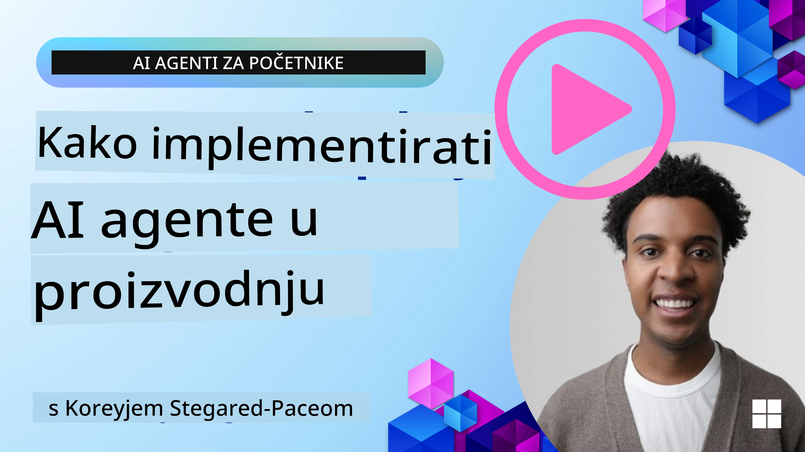

# AI agenti u produkciji: Promatranje i evaluacija

[](https://youtu.be/l4TP6IyJxmQ?si=reGOyeqjxFevyDq9)

Kako AI agenti prelaze iz eksperimentalnih prototipova u primjene u stvarnom svijetu, postaje važno razumjeti njihovo ponašanje, pratiti njihovu izvedbu i sustavno evaluirati njihove rezultate.

## Ciljevi učenja

Nakon završetka ove lekcije, znat ćete kako/razumjeti:
- Temeljne koncepte promatranja i evaluacije agenata
- Tehnike za poboljšanje performansi, troškova i učinkovitosti agenata
- Što i kako sustavno evaluirati svoje AI agente
- Kako kontrolirati troškove prilikom postavljanja AI agenata u produkciju
- Kako instrumentirati agente izgrađene pomoću Microsoft Agent Frameworka

Cilj je opremiti vas znanjem za transformaciju vaših "crnih kutija" agenata u transparentne, upravljive i pouzdane sustave.

_**Napomena:** Važno je postaviti AI agente koji su sigurni i pouzdani. Pogledajte i lekciju [Izrada pouzdanih AI agenata](./06-building-trustworthy-agents/README.md)._

## Tracce i Spanovi

Alati za promatranje poput [Langfuse](https://langfuse.com/) ili [Microsoft Foundry](https://learn.microsoft.com/en-us/azure/ai-foundry/what-is-azure-ai-foundry) obično predstavljaju izvođenja agenata kao traceove i spaneve.

- **Trace** predstavlja kompletan zadatak agenta od početka do kraja (npr. rukovanje upitom korisnika).
- **Spanovi** su pojedinačni koraci unutar tracea (npr. pozivanje jezičnog modela ili dohvaćanje podataka).


<!-- Image URL retained for illustration purposes -->

Bez promatranja AI agent može djelovati kao "crna kutija" – njegovo interno stanje i razmišljanje su neprozirni, što otežava dijagnosticiranje problema ili optimizaciju performansi. S promatranjem, agenti postaju "staklene kutije" koje nude transparentnost vitalnu za izgradnju povjerenja i osiguravanje da rade kako je predviđeno.

## Zašto je promatranje važno u produkcijskom okruženju

Prijelaz AI agenata u produkcijska okruženja donosi nove izazove i zahtjeve. Promatranje više nije "lijepo imati", već kritična sposobnost:

*   **Debugiranje i analiza uzroka:** Kada agent zakaže ili proizvede neočekivani ishod, alati za promatranje pružaju traceove potrebne za precizno pronalaženje izvora greške. Ovo je posebno važno kod složenih agenata koji uključuju višestruke pozive LLM-a, interakcije s alatima i uvjetnu logiku.
*   **Upravljanje latencijom i troškovima:** AI agenti često se oslanjaju na LLM-ove i druge vanjske API-je koji se naplaćuju po tokenu ili pozivu. Promatranje omogućuje precizno praćenje tih poziva, pomažući identificirati one operacije koje su pretjerano spore ili skupe. To omogućuje timovima optimizaciju promptova, odabir učinkovitijih modela ili redizajn workflowa za upravljanje operativnim troškovima i osiguranje dobre korisničke iskustva.
*   **Povjerenje, sigurnost i usklađenost:** U mnogim aplikacijama važno je osigurati da se agenti ponašaju sigurno i etično. Promatranje pruža revizijski trag akcija i odluka agenta. To se može koristiti za otkrivanje i ublažavanje problema poput ubrizgavanja promptova, generiranja štetnog sadržaja ili nepravilnog rukovanja osobnim podacima (PII). Na primjer, možete pregledati traceove da biste razumjeli zašto je agent dao određeni odgovor ili koristio određeni alat.
*   **Petlje kontinuiranog unaprjeđenja:** Podaci promatranja temelj su iterativnog procesa razvoja. Praćenjem izvedbe agenata u stvarnom svijetu, timovi mogu identificirati područja za poboljšanje, prikupiti podatke za fino podešavanje modela i potvrditi učinke promjena. To stvara povratnu petlju u kojoj insajti iz produkcijsko-evaluacijskih podataka informiraju offline eksperimentiranje i dorade, što dovodi do postupnog poboljšanja performansi agenta.

## Ključne metrike za praćenje

Za praćenje i razumijevanje ponašanja agenta potrebno je pratiti različite metrike i signale. Dok se specifične metrike mogu razlikovati ovisno o namjeni agenta, neke su univerzalno važne.

Evo nekoliko najčešćih metrika koje alati za promatranje prate:

**Latencija:** Koliko brzo agent odgovara? Dugotrajna čekanja negativno utječu na korisničko iskustvo. Trebate mjeriti latenciju za zadatke i pojedinačne korake praćenjem izvođenja agenata. Na primjer, agent koji treba 20 sekundi za sve pozive modela može se ubrzati korištenjem bržeg modela ili istovremenim izvođenjem poziva.

**Troškovi:** Koliki je trošak po izvođenju agenta? AI agenti se oslanjaju na pozive LLM-a naplaćene po tokenu ili vanjske API-je. Često korištenje alata ili višestruki promptovi mogu brzo povećati troškove. Na primjer, ako agent pet puta pozove LLM zbog neznatnog poboljšanja kvalitete, morate procijeniti je li trošak opravdan ili biste mogli smanjiti broj poziva ili koristiti jeftiniji model. Praćenje u stvarnom vremenu također može pomoći u otkrivanju neočekivanih skokova (npr. bugovi koji uzrokuju pretjerane petlje API-ja).

**Greške zahtjeva:** Koliko je zahtjeva agent odbio? Ovo može uključivati API greške ili neuspjele pozive alata. Da biste učinili svoj agent otpornijim u produkciji, možete postaviti rezervne opcije ili ponovne pokušaje. Npr. ako je LLM davatelj A nedostupan, možete prebaciti na LLM davatelja B kao rezervu.

**Povratne informacije korisnika:** Implementacija izravnih korisničkih evaluacija pruža vrijedne uvide. To mogu biti eksplicitne ocjene (👍palac gore/👎dolje, ⭐1-5 zvjezdica) ili tekstualni komentari. Dosljedno negativne povratne informacije trebale bi vas upozoriti jer su znak da agent ne radi kako se očekuje.

**Implicitne povratne informacije korisnika:** Ponašanje korisnika pruža neizravnu povratnu informaciju čak i bez eksplicitnih ocjena. To može uključivati trenutnu reformulaciju pitanja, ponovljene upite ili klikanje na gumb za ponovni pokušaj. Npr. ako vidite da korisnici stalno postavljaju isto pitanje, to je znak da agent ne radi kako se očekuje.

**Točnost:** Koliko često agent daje ispravne ili poželjne rezultate? Definicije točnosti variraju (npr. pravilnost rješavanja problema, točnost preuzimanja informacija, zadovoljstvo korisnika). Prvi korak je definirati što za vašeg agenta znači uspjeh. Točnost možete pratiti putem automatiziranih provjera, ocjena evaluacije ili oznaka o dovršenju zadataka. Na primjer, označavanjem traceova kao "uspješan" ili "neuspješan".

**Automatizirane metrike evaluacije:** Možete postaviti i automatizirane evaluacije. Na primjer, možete koristiti LLM za ocjenjivanje izlaza agenta, npr. je li koristan, točan ili nije. Postoji i nekoliko open source biblioteka koje pomažu ocjenjivati različite aspekte agenta. Npr. [RAGAS](https://docs.ragas.io/) za RAG agente ili [LLM Guard](https://llm-guard.com/) za otkrivanje štetnog jezika ili ubrizgavanja promptova.

U praksi kombinacija ovih metrika daje najbolji pregled zdravlja AI agenta. U [primjernoj bilježnici](./code_samples/10-expense_claim-demo.ipynb) iz ovog poglavlja pokazat ćemo kako ove metrike izgledaju u stvarnim primjerima, ali prvo ćemo naučiti kako izgleda tipični workflow evaluacije.

## Instrumentirajte svog agenta

Za prikupljanje podataka praćenja trebate instrumentirati svoj kod. Cilj je instrumentirati kod agenta da emitira traceove i metrike koje observability platforma može uhvatiti, obraditi i vizualizirati.

**OpenTelemetry (OTel):** [OpenTelemetry](https://opentelemetry.io/) postao je industrijski standard za promatranje LLM-a. Pruža skup API-ja, SDK-a i alata za generiranje, prikupljanje i izvoz telemetrijskih podataka.

Postoji mnogo biblioteka za instrumentiranje koje omotavaju postojeće frameworke agenata i olakšavaju izvoz OpenTelemetry spanova prema alatu za promatranje. Microsoft Agent Framework nativno integrira OpenTelemetry. Ispod je primjer instrumentiranja MAF agenta:

```python
from agent_framework.observability import get_tracer, get_meter

tracer = get_tracer()
meter = get_meter()

with tracer.start_as_current_span("agent_run"):
    # Izvršenje agenta automatski se prati
    pass
```

[Primjer bilježnica](./code_samples/10-expense_claim-demo.ipynb) u ovom poglavlju pokazat će kako instrumentirati svoj MAF agent.

**Ručno kreiranje spanova:** Iako biblioteke za instrumentiranje pružaju dobru osnovu, često postoje slučajevi gdje su potrebne detaljnije ili prilagođene informacije. Možete ručno kreirati spanove da biste dodali prilagođenu aplikacijsku logiku. Još važnije, mogu obogatiti automatski ili ručno kreirane spanove prilagođenim atributima (poznatim i kao oznake ili metapodaci). Ti atributi mogu uključivati poslovno-specifične podatke, međurezultate izračuna ili bilo koji kontekst koristan za debugiranje ili analizu, poput `user_id`, `session_id` ili `model_version`.

Primjer ručnog kreiranja traceova i spanova pomoću [Langfuse Python SDK](https://langfuse.com/docs/sdk/python/sdk-v3):

```python
from langfuse import get_client
 
langfuse = get_client()
 
span = langfuse.start_span(name="my-span")
 
span.end()
```

## Evaluacija agenata

Promatranje nam daje metrike, ali evaluacija je proces analiziranja tih podataka (i izvođenja testova) kako bismo odredili koliko dobro AI agent radi i kako ga možemo poboljšati. Drugim riječima, kada imate te traceove i metrike, kako ih koristiti za ocjenu agenta i donošenje odluka?

Redovita evaluacija važna je zato što su AI agenti često nedeterministički i mogu se razvijati (kroz ažuriranja ili promjenu ponašanja modela) – bez evaluacije ne biste znali radi li vaš "pametan agent" svoj posao kako treba ili je došlo do regresije.

Postoje dvije kategorije evaluacija za AI agente: **online evaluacija** i **offline evaluacija**. Obje su vrijedne i nadopunjuju se. Obično krećemo s offline evaluacijom jer je ona minimalni korak prije postavljanja bilo kojeg agenta u produkciju.

### Offline evaluacija


Ovo uključuje evaluaciju agenta u kontroliranom okruženju, obično koristeći testne skupove podataka, a ne upite uživo korisnika. Koristite kurirane skupove podataka gdje znate očekivani izlaz ili ispravno ponašanje, te zatim pokrećete svog agenta na njima.

Na primjer, ako ste izgradili agenta za riješavanje zadataka iz matematike, mogli biste imati [testni skup podataka](https://huggingface.co/datasets/gsm8k) od 100 zadataka s poznatim rješenjima. Offline evaluacija se često provodi tijekom razvoja (i može biti dio CI/CD procesa) da bi se provjerila poboljšanja ili spriječile regresije. Prednost je što je **ponovljivo i možete dobiti jasne metrike točnosti jer imate "ground truth"**. Također možete simulirati korisničke upite i mjeriti odgovore agenta u odnosu na idealne odgovore ili koristiti automatizirane metrike opisane gore.

Ključni izazov offline evaluacije je osigurati da je vaš testni skup reprezentativan i ostaje relevantan – agent može dobro raditi na fiksnom test setu, ali se u produkciji suočiti s potpuno drugačijim upitima. Stoga biste trebali redovito ažurirati test skupove novim ekstremnim slučajevima i primjerima koji odražavaju stvarne situacije. Korisna je kombinacija malih "smoke test" slučajeva za brze provjere i većih evaluacijskih setova za širu analizu performansi.

### Online evaluacija


Odnosi se na evaluaciju agenta u stvarnom, živom okruženju, tj. tijekom stvarne upotrebe u produkciji. Online evaluacija uključuje praćenje izvedbe agenta na stvarnim korisničkim interakcijama i kontinuirano analizira rezultate.

Na primjer, možete pratiti stopu uspjeha, ocjene zadovoljstva korisnika ili druge metrike na stvarnom prometu. Prednost online evaluacije je što **hvata stvari koje ne biste mogli predvidjeti u laboratorijskim uvjetima** – možete uočiti drift modela kroz vrijeme (ako učinkovitost agenta opada kako se ulazni obrasci mijenjaju) i uhvatiti neočekivane upite ili situacije koje nisu bile u testnim podacima. Daje istinsku sliku ponašanja agenta u stvarnom svijetu.

Online evaluacija često uključuje prikupljanje implicitnih i eksplicitnih korisničkih povratnih informacija, kao i eventualno pokretanje "shadow" testova ili A/B testova (gdje nova verzija agenta radi paralelno da bi se usporedila sa starom). Izazov je što može biti teško dobiti pouzdane oznake ili ocjene za žive interakcije – često se oslanjate na povratne informacije korisnika ili downstream metrike (npr. je li korisnik kliknuo na rezultat).

### Kombiniranje dvaju metoda

Online i offline evaluacije nisu međusobno isključive; one su vrlo komplementarne. Uvidi iz online praćenja (npr. novi tipovi korisničkih upita kod kojih agent loše radi) mogu se koristiti za dopunjavanje i poboljšanje offline test skupova. Suprotno tome, agenti koji dobro prolaze offline testove mogu se s većim povjerenjem postaviti i pratiti u online okruženju.

Zapravo mnogi timovi uspostavljaju petlju:

_evaluacija offline -> deployment -> praćenje online -> prikupljanje novih neuspješnih slučajeva -> dodavanje u offline dataset -> poboljšanje agenta -> ponavljanje_.

## Česti problemi

Dok postavljate AI agente u produkciju, možete naići na razne izazove. Evo nekih uobičajenih problema i njihovih mogućih rješenja:

| **Problem**    | **Moguće rješenje**   |
| ------------- | ------------------ |
| AI agent ne izvršava zadatke dosljedno | - Doradite prompt dan AI agentu; budite jasni u ciljevima.<br>- Identificirajte gdje dijeljenje zadataka na podzadatke kojima upravljaju različiti agenti može pomoći. |
| AI agent upada u beskonačne petlje  | - Osigurajte jasne uvjete završetka tako da agent zna kada zaustaviti proces.<br>- Za složene zadatke koji zahtijevaju zaključivanje i planiranje koristite veći model specijaliziran za takve zadatke. |
| Pozivi alata AI agenta ne funkcioniraju dobro   | - Testirajte i validirajte rezultat alata izvan sustava agenta.<br>- Doradite definirane parametre, promptove i imenovanje alata.  |
| Multi-agentni sustav ne radi dosljedno | - Doradite promptove za svakog agenta kako bi bili specifični i različiti.<br>- Izgradite hijerarhijski sustav koristeći "routing" ili kontrolni agent za određivanje koji je agent ispravan. |

Mnoge od ovih problema možete učinkovitije identificirati ako imate uspostavljeno promatranje. Traceovi i metrike o kojima smo ranije govorili pomažu precizno odrediti gdje u tijeku rada agenta nastaju problemi, što debugiranje i optimizaciju čini znatno učinkovitijim.

## Upravljanje troškovima
Evo nekoliko strategija za upravljanje troškovima implementacije AI agenata u produkciju:

**Korištenje manjih modela:** Mali jezični modeli (SLM-ovi) mogu dobro funkcionirati za određene agentne slučajeve upotrebe i znatno će smanjiti troškove. Kao što je ranije spomenuto, izgradnja sustava za evaluaciju koji određuje i uspoređuje performanse u odnosu na veće modele najbolji je način da se razumije koliko će SLM dobro funkcionirati za vaš slučaj uporabe. Razmotrite korištenje SLM-ova za jednostavnije zadatke poput klasifikacije namjere ili ekstrakcije parametara, dok veće modele zadržite za složeno rezoniranje.

**Korištenje modela za usmjeravanje:** Slična strategija je koristiti raznolikost modela i veličina. Možete koristiti LLM/SLM ili serverless funkciju za usmjeravanje zahtjeva na temelju složenosti na najbolje odgovarajuće modele. To će također pomoći u smanjenju troškova, a istovremeno osigurati performanse za prave zadatke. Na primjer, usmjeravajte jednostavne upite manjim, bržim modelima, a skupe velike modele koristite samo za složene zadatke rezoniranja.

**Predmemoriranje odgovora:** Identificiranje uobičajenih zahtjeva i zadataka te pružanje odgovora prije nego što prođu kroz vaš agentski sustav dobar je način za smanjenje volumena sličnih zahtjeva. Možete čak implementirati tok za određivanje koliko je zahtjev sličan vašim predmemoriranim zahtjevima koristeći osnovnije AI modele. Ova strategija može značajno smanjiti troškove za često postavljana pitanja ili uobičajene radne tijekove.

## Pogledajmo kako ovo funkcionira u praksi

U [primjernom bilježnicu ovog odjeljka](./code_samples/10-expense_claim-demo.ipynb) vidjet ćemo primjere kako možemo koristiti alate za opažanje za nadzor i evaluaciju našeg agenta.


### Imate li još pitanja o AI agentima u produkciji?

Pridružite se [Microsoft Foundry Discordu](https://aka.ms/ai-agents/discord) kako biste se družili s drugim učenicima, sudjelovali na konzultacijama i dobili odgovore na svoja pitanja o AI agentima.

## Prethodna lekcija

[Metakognitivni dizajn obrazac](../09-metacognition/README.md)

## Sljedeća lekcija

[Agentni protokoli](../11-agentic-protocols/README.md)

---

<!-- CO-OP TRANSLATOR DISCLAIMER START -->
**Napomena o odricanju od odgovornosti**:  
Ovaj je dokument preveden pomoću AI usluge prevođenja [Co-op Translator](https://github.com/Azure/co-op-translator). Iako nastojimo osigurati točnost, imajte na umu da automatizirani prijevodi mogu sadržavati pogreške ili netočnosti. Izvorni dokument na izvornom jeziku treba smatrati službenim i autoritativnim izvorom. Za kritične informacije preporučuje se profesionalni ljudski prijevod. Ne snosimo odgovornost za bilo kakva nerazumijevanja ili kriva tumačenja nastala uporabom ovog prijevoda.
<!-- CO-OP TRANSLATOR DISCLAIMER END -->