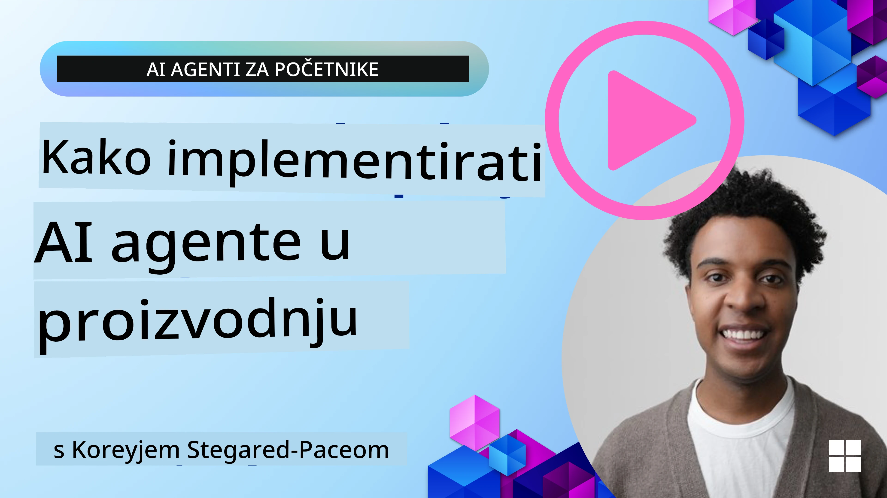

# AI agenti u produkciji: Promatranje i evaluacija

[](https://youtu.be/l4TP6IyJxmQ?si=reGOyeqjxFevyDq9)

Kako AI agenti prelaze iz eksperimentalnih prototipova u stvarne aplikacije, sposobnost razumijevanja njihovog ponašanja, praćenja izvedbe i sustavne evaluacije njihovih rezultata postaje važna.

## Ciljevi učenja

Nakon završetka ove lekcije, znat ćete kako/razumjeti:
- Osnovne koncepte promatranja i evaluacije agenata
- Tehnike za poboljšanje izvedbe, troškova i učinkovitosti agenata
- Što i kako sustavno evaluirati vaše AI agente
- Kako kontrolirati troškove prilikom uvođenja AI agenata u produkciju
- Kako instrumentirati agente izgrađene s Microsoft Agent Frameworkom

Cilj je opremiti vas znanjem za transformaciju vaših „crnih kutija“ agenata u prozirne, upravljive i pouzdane sustave.

_**Napomena:** Važno je implementirati AI agente koji su sigurni i pouzdani. Pogledajte i lekciju [Izgradnja pouzdanih AI agenata](./06-building-trustworthy-agents/README.md)._

## Tragovi i vremenski intervali

Alati za promatranje poput [Langfuse](https://langfuse.com/) ili [Microsoft Foundry](https://learn.microsoft.com/en-us/azure/ai-foundry/what-is-azure-ai-foundry) obično predstavljaju izvršavanja agenata kao tragove i vremenske intervale.

- **Trag (Trace)** predstavlja cjelokupni zadatak agenta od početka do kraja (npr. obrada korisničkog upita).
- **Vremenski intervali (Spans)** su pojedinačni koraci unutar traga (npr. pozivanje jezičnog modela ili dohvat podataka).


<!-- Image URL retained for illustration purposes -->

Bez promatranja, AI agent može se doimati kao „crna kutija“ – njegov unutarnji status i razmišljanje su nepristupačni, što otežava dijagnosticiranje problema ili optimizaciju izvedbe. Uz promatranje, agenti postaju „staklene kutije“, nudeći prozirnost koja je ključna za izgradnju povjerenja i osiguranje da rade kako je predviđeno.

## Zašto je promatranje važno u produkcijskim okruženjima

Prijenos AI agenata u produkcijska okruženja uvodi nove izazove i zahtjeve. Promatranje više nije „lijepo imati“, nego kritična sposobnost:

*   **Otklanjanje pogrešaka i analiza uzroka kvarova**: Kada agent zakaže ili proizvede neočekivani rezultat, alati za promatranje pružaju tragove potrebne za pronalaženje izvora pogreške. Ovo je posebno važno za složene agente koji mogu uključivati višestruke pozive LLM-a, interakcije s alatima i uvjetnu logiku.
*   **Upravljanje latencijom i troškovima**: AI agenti često ovise o LLM-ovima i drugim vanjskim API-jima koji se naplaćuju po tokenu ili pozivu. Promatranje omogućuje precizno praćenje ovih poziva, pomažući identificirati operacije koje su pretjerano spore ili skupe. To omogućuje timovima optimizaciju upita, odabir učinkovitijih modela ili preoblikovanje radnih procesa kako bi se upravljalo operativnim troškovima i osiguralo dobro korisničko iskustvo.
*   **Povjerenje, sigurnost i usklađenost**: U mnogim aplikacijama važno je osigurati da se agenti ponašaju sigurno i etički. Promatranje pruža revizijski zapis akcija i odluka agenta. Ovo se može koristiti za otkrivanje i ublažavanje problema poput ubrizgavanja upita, generiranja štetnog sadržaja ili nepropisnog rukovanja osobnim podacima (PII). Na primjer, možete pregledati tragove da biste razumjeli zašto je agent dao određeni odgovor ili koristio određeni alat.
*   **Petlje kontinuiranog poboljšanja**: Podaci o promatranju temelj su iterativnog razvojog procesa. Praćenjem kako agenti funkcioniraju u stvarnom svijetu, timovi mogu identificirati područja za poboljšanje, prikupiti podatke za fino podešavanje modela i potvrditi utjecaj promjena. Time se stvara povratna petlja gdje uvidi iz produkcije putem online evaluacije informiraju offline eksperimentiranje i doradu, što vodi postupnom poboljšanju izvedbe agenta.

## Ključne metrike za praćenje

Za praćenje i razumijevanje ponašanja agenta potrebno je pratiti niz metrika i signala. Iako specifične metrike mogu varirati ovisno o namjeni agenta, neke su univerzalno važne.

Evo nekih najčešćih metrika koje alati za promatranje prate:

**Latencija:** Koliko brzo agent odgovara? Dugotrajna čekanja negativno utječu na korisničko iskustvo. Trebali biste mjeriti latenciju za zadatke i pojedinačne korake praćenjem izvršavanja agenta. Na primjer, agent koji za sve pozive modela koristi 20 sekundi mogao bi se ubrzati korištenjem bržeg modela ili izvođenjem poziva modela paralelno.

**Troškovi:** Koliki je trošak po izvršavanju agenta? AI agenti ovise o pozivima LLM-a koji se naplaćuju po tokenu ili vanjskim API-jima. Često korištenje alata ili višestruki upiti brzo mogu povećati troškove. Na primjer, ako agent pozove LLM pet puta za marginalno poboljšanje kvalitete, morate procijeniti je li trošak opravdan ili možete smanjiti broj poziva ili koristiti jeftiniji model. Praćenje u stvarnom vremenu također može pomoći u otkrivanju neočekivanih skokova (npr. bube koje uzrokuju pretjerane petlje API-ja).

**Pogreške zahtjeva:** Koliko je zahtjeva agent propustio? Ovo može uključivati pogreške API-ja ili neuspjele pozive alata. Da biste svoj agent učinili robusnijim u produkciji, možete postaviti rezervne opcije ili ponovne pokušaje. Npr. ako LLM dobavljač A ne radi, prebacite se na LLM dobavljača B kao rezervu.

**Povratna informacija korisnika:** Implementacija izravnih korisničkih evaluacija pruža vrijedne uvide. To može uključivati eksplicitne ocjene (👍palac gore/👎dolje, ⭐1-5 zvjezdica) ili tekstualne komentare. Konzistentno negativne povratne informacije trebaju vas upozoriti jer su znak da agent ne radi kako se očekuje.

**Implicitna povratna informacija korisnika:** Korisnička ponašanja daju neizravne povratne informacije čak i bez eksplicitnih ocjena. To može uključivati trenutačno preformuliranje pitanja, ponovljene upite ili klik na gumb za ponovno pokušavanje. Npr. ako primijetite da korisnici stalno postavljaju isto pitanje, to je znak da agent ne radi kako se očekuje.

**Točnost:** Koliko često agent proizvodi točne ili poželjne rezultate? Definicije točnosti variraju (npr. ispravnost rješavanja problema, točnost informacija, zadovoljstvo korisnika). Prvi korak je definirati što uspjeh znači za vašeg agenta. Točnost možete pratiti automatiziranim provjerama, ocjenama evaluacije ili oznakama dovršenosti zadatka. Na primjer, označavanje tragova kao „uspješno“ ili „neuspješno“.

**Automatizirane evaluacijske metrike:** Također možete postaviti automatske evaluacije. Na primjer, možete koristiti LLM za ocjenjivanje rezultata agenta, npr. je li koristan, točan ili nije. Postoji i nekoliko open source biblioteka koje vam pomažu ocijeniti različite aspekte agenta. Npr. [RAGAS](https://docs.ragas.io/) za RAG agente ili [LLM Guard](https://llm-guard.com/) za otkrivanje štetnog jezika ili ubrizgavanja upita.

U praksi, kombinacija ovih metrika pruža najbolji pregled stanja AI agenta. U [primjernom bilježniku ovog poglavlja](./code_samples/10-expense_claim-demo.ipynb) pokazat ćemo vam kako ove metrike izgledaju na stvarnim primjerima, ali prvo ćemo naučiti kako izgleda tipičan tijek evaluacije.

## Instrumentirajte svog agenta

Za prikupljanje podataka o tragovima, potrebno je instrumentirati vaš kôd. Cilj je instrumentirati kôd agenta da emitira tragove i metrike koje može uhvatiti, obraditi i vizualizirati platforma za promatranje.

**OpenTelemetry (OTel):** [OpenTelemetry](https://opentelemetry.io/) se nametnuo kao industrijski standard za promatranje LLM-a. Nudi skup API-ja, SDK-ova i alata za generiranje, prikupljanje i izvoz telemetrijskih podataka.

Postoji mnogo knjižnica za instrumentaciju koje omotavaju postojeće okvire agenata i olakšavaju izvoz OpenTelemetry vremenskih intervala u alat za promatranje. Microsoft Agent Framework ima izvorno integriranu podršku za OpenTelemetry. Ispod je primjer instrumentacije MAF agenta:

```python
from agent_framework.observability import get_tracer, get_meter

tracer = get_tracer()
meter = get_meter()

with tracer.start_as_current_span("agent_run"):
    # Izvršenje agenta se automatski prati
    pass
```

[Primjerni bilježnik](./code_samples/10-expense_claim-demo.ipynb) u ovom poglavlju demonstrirat će kako instrumentirati vaš MAF agent.

**Ručno stvaranje vremenskih intervala:** Iako knjižnice za instrumentaciju pružaju dobru osnovu, često postoje situacije kada su potrebne detaljnije ili prilagođene informacije. Vremenske intervale možete ručno kreirati kako biste dodali prilagođenu poslovnu logiku. Još je važnije da mogu obogatiti automatski ili ručno kreirane intervale prilagođenim atributima (poznatim i kao oznake ili metapodaci). Ti atributi mogu uključivati poslovne specifikacije, međuprosjede ili bilo koji kontekst koji može biti koristan za otklanjanje pogrešaka ili analizu, poput `user_id`, `session_id` ili `model_version`.

Primjer ručnog kreiranja tragova i vremenskih intervala s [Langfuse Python SDK-om](https://langfuse.com/docs/sdk/python/sdk-v3):

```python
from langfuse import get_client
 
langfuse = get_client()
 
span = langfuse.start_span(name="my-span")
 
span.end()
```

## Evaluacija agenta

Promatranje nam daje metrike, no evaluacija je proces analiziranja tih podataka (i izvođenja testova) kako bismo odredili koliko dobro AI agent obavlja svoj posao i kako se može poboljšati. Drugim riječima, kad imate te tragove i metrike, kako ih koristiti za ocjenjivanje agenta i donošenje odluka?

Redovita evaluacija je važna jer AI agenti često nisu deterministički i mogu se mijenjati (kroz nadogradnje ili driftanje modela) – bez evaluacije ne biste znali je li vaš „pametni agent“ zapravo dobar u svom poslu ili se pogoršao.

Postoje dvije kategorije evaluacija za AI agente: **online evaluacija** i **offline evaluacija**. Obje su vrijedne i nadopunjuju se. Obično počinjemo s offline evaluacijom jer je to minimalni potreban korak prije uvođenja bilo kojeg agenta.

### Offline evaluacija


Ona podrazumijeva evaluaciju agenta u kontroliranom okruženju, obično koristeći testne skupove podataka, a ne žive korisničke upite. Koristite kurirane skupove podataka za koje znate očekivani rezultat ili ispravno ponašanje, i potom pokrećete agenta na njima.

Na primjer, ako ste napravili agenta za riječi iz matematičkih zadataka, mogli biste imati [testni skup podataka](https://huggingface.co/datasets/gsm8k) od 100 problema s poznatim odgovorima. Offline evaluacija se često radi tijekom razvoja (i može biti dio CI/CD procesa) da bi se provjerila poboljšanja ili spriječio regres. Prednost je što je **ponovljivo i možete dobiti jasne metrike točnosti jer imate osnovnu istinu**. Također možete simulirati korisničke upite i mjeriti odgovore agenta u odnosu na idealne odgovore ili koristiti automatizirane metrike kako je opisano gore.

Ključni izazov offline evaluacije jest osigurati da vaš testni skup bude sveobuhvatan i relevantan – agent može dobro raditi na fiksiranom testnom skupu, ali naići na vrlo različite upite u produkciji. Zato je važno ažurirati testne skupove novim rubnim slučajevima i primjerima koji odražavaju stvarne scenarije​. Korisna je kombinacija malih „smoketesta“ i većih evaluacijskih skupina: male za brze provjere, velike za šire metrike izvedbe​.

### Online evaluacija


Ona se odnosi na evaluaciju agenta u stvarnom, živom okruženju, tj. tijekom stvarne upotrebe u produkciji. Online evaluacija uključuje praćenje izvedbe agenta na stvarnim korisničkim interakcijama i kontinuiranu analizu ishoda.

Na primjer, možete pratiti uspješnost, ocjene zadovoljstva korisnika ili druge metrike na živom prometu. Prednost online evaluacije je što **hvata stvari koje ne biste mogli predvidjeti u laboratorijskom okruženju** – možete opaziti drift modela kroz vrijeme (ako učinkovitost agenta opada sa promjenama ulaznih obrasca) i uočiti neočekivane upite ili situacije koje nisu bile u vašim testnim podacima​. Ona pruža stvarnu sliku kako se agent ponaša u prirodi.

Online evaluacija često uključuje prikupljanje implicitnih i eksplicitnih korisničkih povratnih informacija, kao što smo raspravili, i moguće izvođenje shadow testova ili A/B testova (gdje nova verzija agenta radi paralelno za usporedbu sa starom). Izazov je što može biti teško dobiti pouzdane oznake ili ocjene za žive interakcije – često se oslanjate na povratne informacije korisnika ili metrike u nastavku toka (npr. je li korisnik kliknuo na rezultat).

### Kombiniranje dvaju metoda

Online i offline evaluacije nisu međusobno isključive; one su izrazito dopunjajuće. Uvidi iz online nadzora (npr. novi tipovi korisničkih upita gdje agent loše prolazi) mogu se koristiti za dopunu i poboljšanje offline testnih skupova podataka. Suprotno tome, agenti koji dobro prolaze offline testove mogu se sa više povjerenja uvesti u produkciju i pratiti online.

Zapravo, mnogi timovi usvajaju petlju:

_evaluiraj offline -> uvedi u produkciju -> prati online -> prikupi nove slučajeve neuspjeha -> dodaj u offline skup -> doradi agenta -> ponovi_.

## Česti problemi

Dok uvodite AI agente u produkciju, mogli biste naići na različite izazove. Evo nekih čestih problema i potencijalnih rješenja:

| **Problem**    | **Potencijalno rješenje**   |
| ------------- | ------------------ |
| AI agent ne izvršava zadatke dosljedno | - Doradite upit dan AI agentu; budite jasni u ciljevima.<br>- Identificirajte gdje razdvajanje zadataka na podzadatke i njihovo upravljanje višestrukim agentima može pomoći. |
| AI agent se zaglavi u beskonačnim petljama  | - Osigurajte jasne uvjete za završetak tako da agent zna kada zaustaviti proces.<br>- Za složene zadatke koji zahtijevaju rezoniranje i planiranje, koristite veći model specijaliziran za rezonirajuće zadatke. |
| Pozivi alata unutar AI agenta ne funkcioniraju dobro   | - Testirajte i validirajte izlaz alata izvan sustava agenta.<br>- Doradite definirane parametre, upite i imenovanje alata.  |
| Više-agentski sustav ne radi dosljedno | - Doradite upite dati svakom agentu kako bi bili specifični i različiti.<br>- Izgradite hijerarhijski sustav koristeći „routing“ ili kontrolni agent za određivanje ispravnog agenta. |

Mnogi od ovih problema mogu se učinkovitije identificirati uz implementirano promatranje. Tragovi i metrike o kojima smo ranije govorili pomažu precizno locirati gdje u tijeku rada agenta nastaju problemi, čime otklanjanje pogrešaka i optimizacija postaju mnogo učinkovitiji.

## Upravljanje troškovima
Evo nekoliko strategija za upravljanje troškovima implementacije AI agenata u produkciju:

**Korištenje manjih modela:** Mali jezični modeli (SLM) mogu dobro funkcionirati u određenim agentnim slučajevima korištenja i značajno će smanjiti troškove. Kao što je ranije spomenuto, izgradnja sustava za procjenu kako bi se odredila i usporedila izvedba u odnosu na veće modele najbolji je način da se razumije koliko će se SLM dobro pokazati za vaš slučaj uporabe. Razmotrite korištenje SLM-a za jednostavnije zadatke poput klasifikacije namjere ili ekstrakcije parametara, dok veće modele rezervirajte za složeno zaključivanje.

**Korištenje modela za usmjeravanje:** Slična strategija je korištenje raznolikosti modela i veličina. Možete koristiti LLM/SLM ili funkciju bez poslužitelja za usmjeravanje zahtjeva na temelju složenosti prema najboljim prikladnim modelima. Ovo će također pomoći u smanjenju troškova, a ujedno osigurati izvedbu za odgovarajuće zadatke. Na primjer, jednostavne upite usmjerite prema manjim, bržim modelima, a skupe velike modele koristite samo za složene zadatke zaključivanja.

**Predmemoriranje odgovora:** Identificiranje čestih zahtjeva i zadataka te pružanje odgovora prije nego što prođu kroz vaš agentni sustav dobar je način za smanjenje volumena sličnih zahtjeva. Možete čak implementirati tok za identificiranje koliko je zahtjev sličan već predmemoriranim zahtjevima koristeći jednostavnije AI modele. Ova strategija može značajno smanjiti troškove za često postavljana pitanja ili uobičajene radne tokove.

## Pogledajmo kako to funkcionira u praksi

U [primjeru bilježnice ovog odjeljka](./code_samples/10-expense_claim-demo.ipynb) vidjet ćemo primjere kako možemo koristiti alate za promatranje da nadgledamo i procijenimo našeg agenta.


### Imate još pitanja o AI agentima u produkciji?

Pridružite se [Microsoft Foundry Discordu](https://discord.com/invite/ATgtXmAS5D) kako biste se povezali s drugim učenicima, sudjelovali na radnim satima i dobili odgovore na pitanja o AI agentima.

## Prethodna lekcija

[Metacognition Design Pattern](../09-metacognition/README.md)

## Sljedeća lekcija

[Agentic Protocols](../11-agentic-protocols/README.md)

---

<!-- CO-OP TRANSLATOR DISCLAIMER START -->
**Napomena**:
Ovaj dokument je preveden korištenjem AI prevoditeljskog servisa [Co-op Translator](https://github.com/Azure/co-op-translator). Iako težimo točnosti, imajte na umu da automatski prijevodi mogu sadržavati greške ili netočnosti. Izvorni dokument na izvornom jeziku treba smatrati autoritativnim izvorom. Za važne informacije preporuča se profesionalni ljudski prijevod. Nismo odgovorni za bilo kakva nesporazumevanja ili pogrešne interpretacije koje proizlaze iz korištenja ovog prijevoda.
<!-- CO-OP TRANSLATOR DISCLAIMER END -->