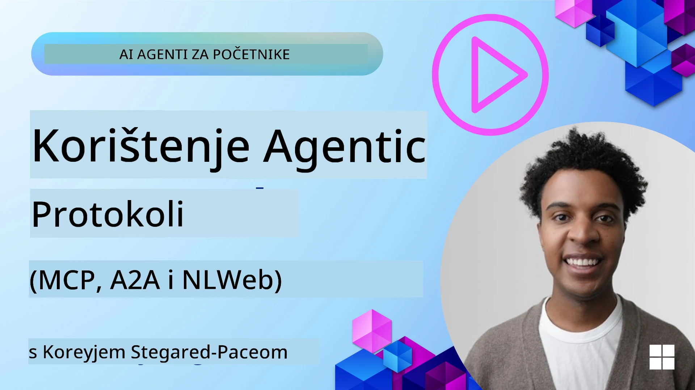
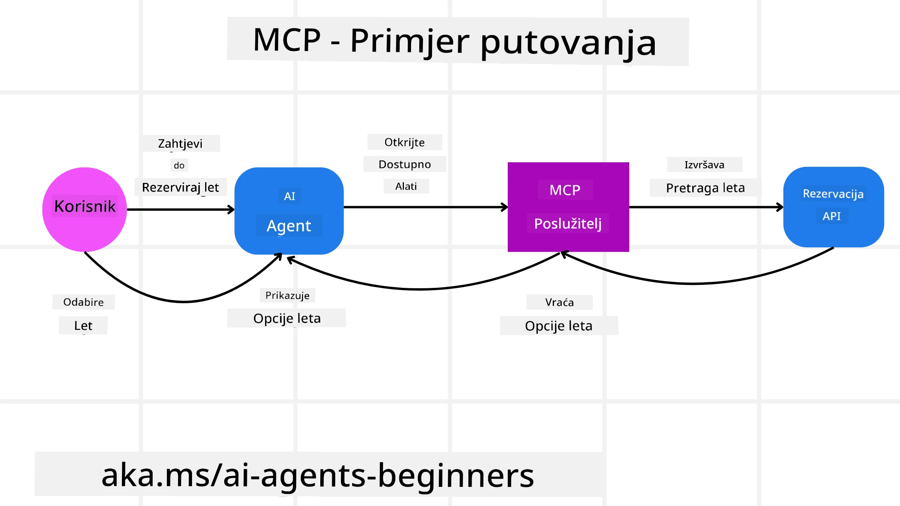
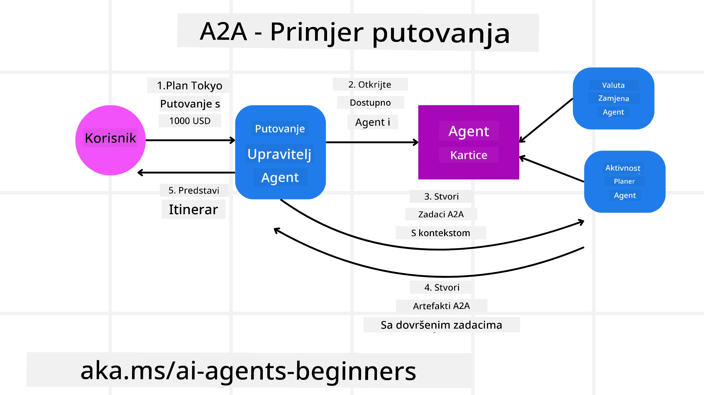
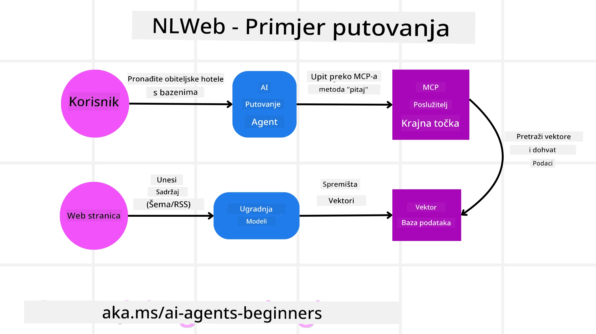

# Korištenje agentskih protokola (MCP, A2A i NLWeb)

> _(Kliknite gornju sliku za pregled videa ovog lekcije)_

Kako raste uporaba AI agenata, raste i potreba za protokolima koji osiguravaju standardizaciju, sigurnost i podržavaju otvorene inovacije. U ovoj lekciji pokrit ćemo 3 protokola usmjerena na zadovoljenje ove potrebe - Model Context Protocol (MCP), Agent to Agent (A2A) i Natural Language Web (NLWeb).

## Uvod

U ovoj lekciji pokrit ćemo:

• Kako **MCP** omogućuje AI agentima pristup vanjskim alatima i podacima za izvršavanje korisničkih zadataka.

• Kako **A2A** omogućuje komunikaciju i suradnju između različitih AI agenata.

• Kako **NLWeb** donosi sučelja prirodnog jezika na bilo koju web stranicu, omogućujući AI agentima otkrivanje i interakciju s sadržajem.

## Ciljevi učenja

• **Prepoznati** osnovnu svrhu i prednosti MCP, A2A i NLWeb u kontekstu AI agenata.

• **Objasniti** kako svaki protokol olakšava komunikaciju i interakciju između LLM-ova, alata i drugih agenata.

• **Razumjeti** različite uloge koje svaki protokol ima u izgradnji složenih agentskih sustava.

## Model Context Protocol

**Model Context Protocol (MCP)** je otvoreni standard koji pruža standardizirani način za aplikacije za pružanje konteksta i alata LLM-ovima. Ovo omogućuje "univerzalni adapter" za različite izvore podataka i alate na koje se AI agenti mogu dosljedno povezivati.

Pogledajmo komponente MCP-a, prednosti u odnosu na izravnu upotrebu API-ja i primjer korištenja MCP servera od strane AI agenata.

### Osnovne komponente MCP-a

MCP radi na **klijent-poslužitelj arhitekturi** i osnovne komponente su:

• **Domaćini** su LLM aplikacije (na primjer uređivač koda poput VSCode-a) koje započinju veze s MCP serverom.

• **Klijenti** su komponente unutar domaćinske aplikacije koje održavaju jedinstvene veze s poslužiteljima.

• **Poslužitelji** su lagani programi koji izlažu određene mogućnosti.

U protokolu su uključene tri osnovne primitivne jedinice koje su sposobnosti MCP servera:

• **Alati**: To su diskretne akcije ili funkcije koje agent AI može pozvati za izvršavanje radnje. Na primjer, usluga za vremensku prognozu može izložiti alat "dohvati vremensku prognozu", ili e-trgovina može izložiti alat "kupi proizvod". MCP serveri oglašavaju ime alata, opis i ulazno/izlaznu shemu u popisu svojih sposobnosti.

• **Resursi**: To su podaci ili dokumenti samo za čitanje koje MCP server može pružiti, a klijenti ih mogu dohvatiti na zahtjev. Primjeri uključuju sadržaj datoteka, zapise baza podataka ili zapisnike događaja. Resursi mogu biti tekstualni (kao kod ili JSON) ili binarni (poput slika ili PDF-ova).

• **Upiti**: To su unaprijed definirane predloške koje pružaju predložene upite, omogućujući složenije tijekove rada.

### Prednosti MCP-a

MCP nudi značajne prednosti za AI agente:

• **Dinamično otkrivanje alata**: Agenti mogu dinamički primati popis dostupnih alata s poslužitelja zajedno s opisima njihovih funkcija. To se razlikuje od tradicionalnih API-ja koji često zahtijevaju statičko kodiranje za integracije, što znači da svaka promjena API-ja zahtijeva ažuriranje koda. MCP nudi pristup "integriraj jednom", što dovodi do veće prilagodljivosti.

• **Interoperabilnost među LLM-ovima**: MCP radi preko različitih LLM-ova, pružajući fleksibilnost u prelasku na druge osnovne modele radi bolje izvedbe.

• **Standardizirana sigurnost**: MCP uključuje standardizirani način autentifikacije, poboljšavajući skalabilnost pri dodavanju pristupa dodatnim MCP serverima. To je jednostavnije od upravljanja različitim ključevima i vrstama autentifikacije za razne tradicionalne API-je.

### Primjer MCP-a

Zamislite da korisnik želi rezervirati let koristeći AI asistenta pokretanog MCP-om.

1. **Veza**: AI asistent (MCP klijent) povezuje se s MCP serverom kojeg pruža zrakoplovna kompanija.

2. **Otkrivanje alata**: Klijent pita MCP server zrakoplovne kompanije: "Koje alate imate na raspolaganju?" Server odgovara s alatima poput "pretraži letove" i "rezerviraj letove".

3. **Poziv alata**: Korisnik zatim pita AI asistenta: "Molim te, pretraži let iz Portlanda u Honolulu." AI asistent, koristeći svoj LLM, prepoznaje da treba pozvati alat "pretraži letove" i prosljeđuje relevantne parametre (polazište, odredište) MCP serveru.

4. **Izvršenje i odgovor**: MCP server, djelujući kao "omot", izvršava stvarni poziv internom API-ju zrakoplovne kompanije. Nakon toga prima informacije o letu (npr. JSON podatke) i šalje ih natrag AI asistentu.

5. **Daljnja interakcija**: AI asistent prikazuje opcije leta. Nakon što korisnik odabere let, asistent može pozvati alat "rezerviraj let" na istom MCP serveru i dovršiti rezervaciju.

## Agent-to-Agent protokol (A2A)

Dok se MCP fokusira na povezivanje LLM-ova s alatima, **Agent-to-Agent (A2A) protokol** ide korak dalje omogućujući komunikaciju i suradnju između različitih AI agenata. A2A povezuje AI agente iz različitih organizacija, okruženja i tehnoloških okvira kako bi zajednički izvršili zadatak.

Ispitat ćemo komponente i prednosti A2A protokola, uz primjer primjene u našoj aplikaciji za putovanja.

### Osnovne komponente A2A

A2A omogućuje komunikaciju između agenata i njihovu suradnju na izvršavanju podzadatka korisnika. Svaka komponenta protokola doprinosi tome:

#### Kartica agenta

Slično kao što MCP server dijeli popis alata, Kartica agenta sadrži:
- Ime agenta.
- **Opis općih zadataka** koje agent izvršava.
- **Popis specifičnih vještina** s opisima kako bi drugi agenti (ili ljudi) razumjeli kada i zašto bi trebali pozvati tog agenta.
- **Trenutni URL krajnje točke** agenta.
- **Verziju** i **sposobnosti** agenta kao što su streaming odgovori i push obavijesti.

#### Izvršitelj agenta

Izvršitelj agenta je odgovoran za **prosljeđivanje konteksta korisničkog razgovora udaljenom agentu**, kojem je to potrebno da razumije zadatak koji se mora izvršiti. U A2A serveru agent koristi vlastiti Large Language Model (LLM) za tumačenje dolaznih zahtjeva i izvršavanje zadataka koristeći vlastite interne alate.

#### Artefakt

Nakon što udaljeni agent završi traženi zadatak, njegov radni proizvod se stvara kao artefakt. Artefakt **sadrži rezultat rada agenta**, **opis onoga što je izvršeno** i **tekstualni kontekst** koji se šalje kroz protokol. Nakon slanja artefakta, veza s udaljenim agentom se zatvara dok ponovno nije potrebna.

#### Red događaja

Ova komponenta se koristi za **rukovanje ažuriranjima i prosljeđivanje poruka**. Posebno je važna u produkciji za agentske sustave kako bi se spriječilo zatvaranje veze između agenata prije završetka zadatka, naročito kada vrijeme izvršenja zadataka može biti dulje.

### Prednosti A2A

• **Poboljšana suradnja**: Omogućuje agentima iz različitih dobavljača i platformi da međusobno komuniciraju, dijele kontekst i surađuju, olakšavajući besprijekornu automatizaciju preko tradicionalno odvojenih sustava.

• **Fleksibilnost izbora modela**: Svaki A2A agent može odlučiti koji LLM koristi za obradu svojih zahtjeva, omogućujući optimizirane ili prilagođene modele po agentu, za razliku od jedne LLM veze u nekim MCP scenarijima.

• **Ugrađena autentifikacija**: Autentifikacija je integrirana neposredno u A2A protokol, pružajući robustan sigurnosni okvir za interakcije agenata.

### Primjer A2A

Razvijmo naš scenarij rezervacije putovanja, ali ovoga puta koristeći A2A.

1. **Korisnički zahtjev multi-agentu**: Korisnik komunicira s "putničkim agentom" A2A klijent/agentom, na primjer izgovarajući: "Molim te rezerviraj cijelo putovanje za Honolulu za sljedeći tjedan, uključujući letove, hotel i najam auta".

2. **Orkestracija putničkog agenta**: Putnički agent prima ovaj složeni zahtjev. Koristi svoj LLM da rasuđuje o zadatku i utvrdi da mora komunicirati s drugim specijaliziranim agentima.

3. **Komunikacija između agenata**: Putnički agent koristi A2A protokol da se poveže s niže rangiranim agentima poput "agenta zrakoplovne kompanije", "agentskog hotela" i "agentskog najma auta" koje su napravile različite tvrtke.

4. **Delegirano izvršavanje zadatka**: Putnički agent šalje specifične zadatke tim specijaliziranim agentima (npr. "Pronađi letove za Honolulu", "Rezerviraj hotel", "Iznajmi auto"). Svaki od ovih specijaliziranih agenata, pokrećući vlastiti LLM i koristeći svoje vlastite alate (koji sami mogu biti MCP serveri), izvršava svoj dio rezervacije.

5. **Konsolidirani odgovor**: Kada svi niže rangirani agenti završe svoje zadatke, putnički agent sastavlja rezultate (detalje leta, potvrdu hotela, rezervaciju auta) i šalje sveobuhvatan odgovor u stilu razgovora korisniku.

## Natural Language Web (NLWeb)

Web stranice su već dugo primarni način pristupa informacijama i podacima korisnika na internetu.

Pogledajmo različite komponente NLWeb-a, njegove prednosti i primjer kako NLWeb radi u našoj aplikaciji za putovanja.

### Komponente NLWeb-a

- **NLWeb aplikacija (osnovni kod usluge)**: Sustav koji obrađuje pitanja na prirodnom jeziku. Povezuje različite dijelove platforme kako bi stvorio odgovore. Možete ga smatrati **motorom koji pokreće značajke prirodnog jezika** na web stranici.

- **NLWeb protokol**: To je **osnovni skup pravila za interakciju prirodnim jezikom** sa web stranicom. Vraća odgovore u JSON formatu (često koristeći Schema.org). Njegova svrha je stvoriti jednostavnu osnovu za “AI web”, na isti način na koji je HTML omogućio dijeljenje dokumenata online.

- **MCP server (krajnja točka Model Context Protocol-a)**: Svaka NLWeb postava također funkcionira kao **MCP server**. To znači da može **dijeliti alate (poput metode “ask”) i podatke** s drugim AI sustavima. U praksi to omogućuje da sadržaj i mogućnosti web stranice budu dostupni AI agentima, dopuštajući stranici da postane dio šire “agentske ekosfere.”

- **Embedding modeli**: Ovi modeli se koriste za **pretvaranje sadržaja web stranice u numeričke prikaze zvane vektori** (embeddinge). Ovi vektori hvataju značenje na način koji računala mogu uspoređivati i pretraživati. Pohranjuju se u posebnu bazu podataka, a korisnici mogu odabrati koji embedding model žele koristiti.

- **Vektorska baza podataka (mehanizam dohvata)**: Ova baza podataka **pohranjuje embeddinge sadržaja web stranice**. Kad netko postavi pitanje, NLWeb provjerava u vektorskoj bazi kako bi brzo pronašao najrelevantnije informacije. Daje brzi popis mogućih odgovora poredanih prema sličnosti. NLWeb radi s različitim sustavima za pohranu vektora poput Qdranta, Snowflakea, Milvusa, Azure AI Searcha i Elasticsearcha.

### NLWeb na primjeru

Razmotrimo ponovno našu web stranicu za rezervacije putovanja, ali ovoga puta pokreće je NLWeb.

1. **Učitavanje podataka**: Postojeći katalog proizvoda putničke web stranice (npr. popisi letova, opisi hotela, paket ture) formatira se koristeći Schema.org ili učitava putem RSS feedova. NLWeb alati unose ove strukturirane podatke, kreiraju embeddinge i pohranjuju ih u lokalnu ili udaljenu vektorsku bazu.

2. **Upit na prirodnom jeziku (čovjek)**: Korisnik posjećuje stranicu i umjesto korištenja izbornika, unosi u chat sučelje: "Pronađi mi obiteljski prilagođen hotel u Honoluluu s bazenom za sljedeći tjedan".

3. **Obrada NLWeb-a**: NLWeb aplikacija prima ovaj upit. Šalje ga LLM-u za razumijevanje te istovremeno pretražuje svoju vektorsku bazu za relevantnim hotelima.

4. **Točni rezultati**: LLM pomaže interpretirati rezultate pretraživanja baze, identificira najbolje podudarnosti na temelju kriterija "obiteljski prilagođeno", "bazen" i "Honolulu", a zatim formatira odgovor prirodnim jezikom. Važno je da odgovor upućuje na stvarne hotele iz kataloga stranice, izbjegavajući izmišljene informacije.

5. **Interakcija AI agenta**: Budući da NLWeb djeluje kao MCP server, vanjski AI putnički agent također se može povezati na ovu NLWeb instancu. AI agent tada može koristiti MCP metodu `ask` da izravno postavi pitanje stranici: `ask("Postoje li veganski restorani u području Honolulua koje preporučuje hotel?")`. NLWeb instanca će to obraditi koristeći svoju bazu podataka o restoranima (ako je učitana) i vratiti strukturirani JSON odgovor.

### Imate još pitanja o MCP/A2A/NLWeb?

Pridružite se [Microsoft Foundry Discordu](https://aka.ms/ai-agents/discord) da se povežete s drugim učenicima, sudjelujete u radnim satima i dobijete odgovore na pitanja o AI agentima.

## Resursi

- [MCP za početnike](https://aka.ms/mcp-for-beginners)  
- [MCP dokumentacija](https://learn.microsoft.com/python/api/overview/azure/ai-projects-readme)
- [NLWeb repozitorij](https://github.com/nlweb-ai/NLWeb)
- [Microsoft Agent Framework](https://aka.ms/ai-agents-beginners/agent-framewrok)

---

<!-- CO-OP TRANSLATOR DISCLAIMER START -->
**Izjava o odricanju od odgovornosti**:  
Ovaj dokument je preveden pomoću AI prevoditeljske usluge [Co-op Translator](https://github.com/Azure/co-op-translator). Iako nastojimo osigurati točnost, molimo imajte na umu da automatski prijevodi mogu sadržavati pogreške ili netočnosti. Izvorni dokument na izvornom jeziku treba smatrati autoritativnim izvorom. Za važne informacije preporučuje se profesionalni ljudski prijevod. Nismo odgovorni za bilo kakve nesporazume ili pogrešna tumačenja koja proizlaze iz korištenja ovog prijevoda.
<!-- CO-OP TRANSLATOR DISCLAIMER END -->