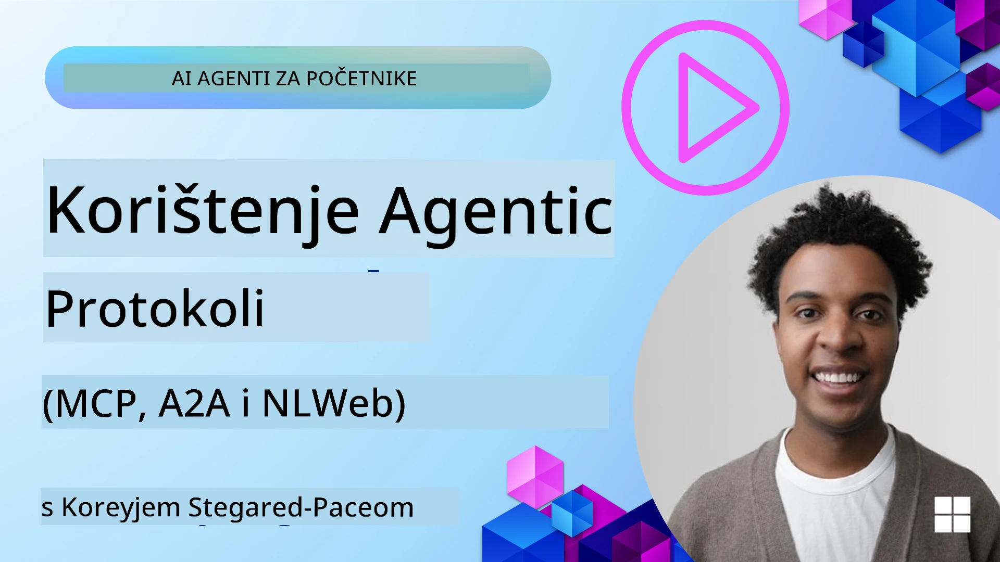
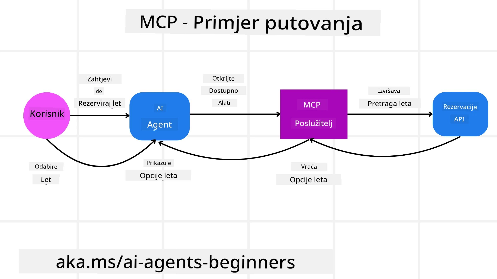
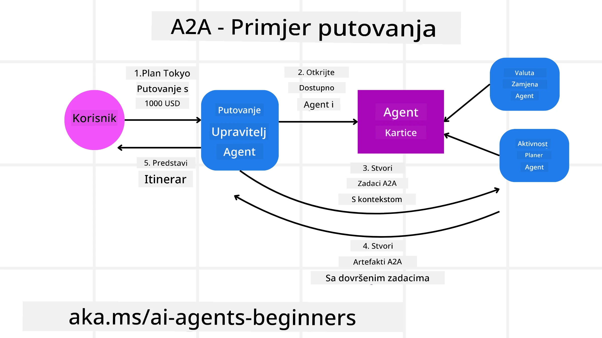
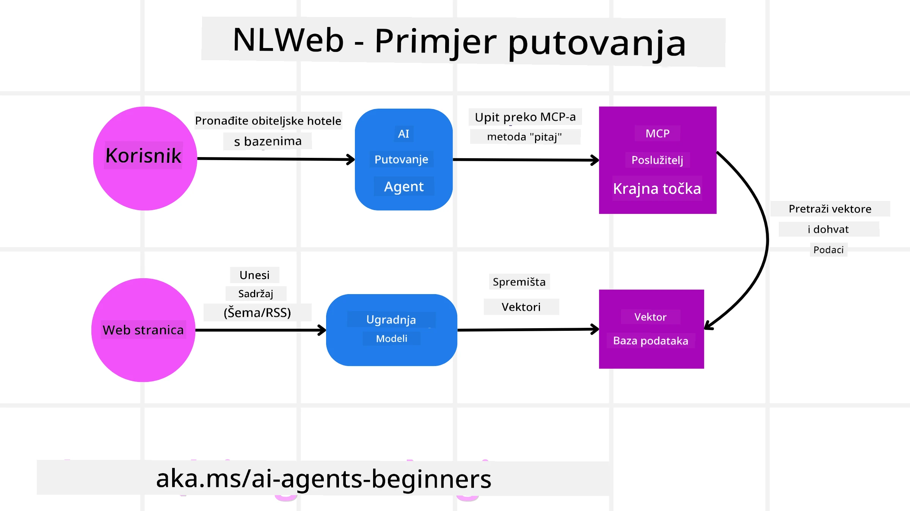

# Korištenje agentnih protokola (MCP, A2A i NLWeb)

> _(Kliknite na gornju sliku za prikaz video lekcije)_

Kako raste upotreba AI agenata, tako raste i potreba za protokolima koji osiguravaju standardizaciju, sigurnost i podržavaju otvorenu inovaciju. U ovoj lekciji obradit ćemo 3 protokola koji nastoje zadovoljiti ovu potrebu - Model Context Protocol (MCP), Agent to Agent (A2A) i Natural Language Web (NLWeb).

## Uvod

U ovoj lekciji ćemo pokriti:

• Kako **MCP** omogućuje AI agentima pristup vanjskim alatima i podacima za izvršavanje korisničkih zadataka.

• Kako **A2A** omogućuje komunikaciju i suradnju između različitih AI agenata.

• Kako **NLWeb** donosi sučelja prirodnog jezika na bilo koju web stranicu omogućujući AI agentima da otkrivaju i međusobno djeluju s sadržajem.

## Ciljevi učenja

• **Prepoznati** osnovnu svrhu i prednosti MCP-a, A2A i NLWeb-a u kontekstu AI agenata.

• **Objasniti** kako svaki protokol olakšava komunikaciju i interakciju između LLM-ova, alata i drugih agenata.

• **Utvrdite** različite uloge koje svaki protokol ima u izgradnji složenih agentnih sustava.

## Model Context Protocol

**Model Context Protocol (MCP)** je otvoreni standard koji pruža standardizirani način za aplikacije da pružaju kontekst i alate LLM-ovima. To omogućuje "univerzalni adapter" za različite izvore podataka i alate na koje se AI agenti mogu povezati na dosljedan način.

Pogledajmo komponente MCP-a, prednosti u odnosu na direktno korištenje API-ja te primjer kako AI agenti mogu koristiti MCP poslužitelj.

### Osnovne komponente MCP-a

MCP radi na **arhitekturi klijent-poslužitelj**, a osnovne komponente su:

• **Hostovi** su aplikacije s LLM-om (npr. uređivač koda poput VSCode) koje započinju veze na MCP poslužitelj.

• **Klijenti** su komponente unutar host aplikacije koje održavaju veze jedan-na-jedan s poslužiteljima.

• **Poslužitelji** su lagani programi koji izlažu određene funkcionalnosti.

U protokolu su uključene tri osnovne primitivne jedinice koje predstavljaju sposobnosti MCP poslužitelja:

• **Alati**: To su diskretne akcije ili funkcije koje AI agent može pozvati za izvršenje neke radnje. Na primjer, vremenska služba može izložiti alat "dohvati vremensku prognozu", ili e-trgovinski poslužitelj može izložiti alat "kupi proizvod". MCP poslužitelji oglašavaju naziv alata, opis i unos/izlazni shemu u svojoj listi sposobnosti.

• **Resursi**: To su podatkovni elementi ili dokumenti samo za čitanje koje MCP poslužitelj može pružiti, a klijenti ih mogu dohvatiti prema potrebi. Primjeri uključuju sadržaj datoteka, zapise u bazi podataka ili log datoteke. Resursi mogu biti tekstualni (poput koda ili JSON-a) ili binarni (poput slika ili PDF-ova).

• **Promptovi**: To su unaprijed definirane predloške koji pružaju predložene promptove, dopuštajući složenije tijekove rada.

### Prednosti MCP-a

MCP nudi značajne prednosti za AI agente:

• **Dinamičko otkrivanje alata**: Agent može dinamički primiti popis dostupnih alata od poslužitelja zajedno s opisima što oni rade. To je suprotno tradicionalnim API-jima koji često zahtijevaju statičko kodiranje integracija, što znači da svaka promjena API-ja zahtijeva ažuriranje koda. MCP pruža pristup "integriraj jednom", što vodi većoj prilagodljivosti.

• **Interoperabilnost preko različitih LLM-ova**: MCP funkcionira preko različitih LLM-ova, pružajući fleksibilnost za promjenu osnovnog modela radi bolje izvedbe.

• **Standardizirana sigurnost**: MCP uključuje standardnu metodu autentifikacije, što poboljšava skalabilnost pri dodavanju pristupa dodatnim MCP poslužiteljima. To je jednostavnije nego upravljanje različitim ključevima i tipovima autentifikacije za različite tradicionalne API-je.

### Primjer MCP-a

Zamislimo da korisnik želi rezervirati let pomoću AI asistenta kojeg pokreće MCP.

1. **Veza**: AI asistent (MCP klijent) se povezuje na MCP poslužitelj aviokompanije.

2. **Otkrivanje alata**: Klijent pita MCP poslužitelj aviokompanije: "Koje alate imate dostupne?" Poslužitelj odgovara alatima poput "pretraži letove" i "rezerviraj letove".

3. **Pozivanje alata**: Korisnik traži od AI asistenta: "Molim te pretraži let od Portlanda do Honolulu-a." AI asistent, koristeći LLM, prepoznaje da treba pozvati alat "pretraži letove" i prosljeđuje relevantne parametre (polazište, odredište) MCP poslužitelju.

4. **Izvršenje i odgovor**: MCP poslužitelj, djelujući kao omotač, poziva stvarni interno API aviokompanije za rezervacije. Zatim prima informacije o letu (npr. JSON podatke) i šalje ih natrag AI asistentu.

5. **Daljnja interakcija**: AI asistent prikazuje opcije letova. Kada korisnik odabere let, asistent može pozvati alat "rezerviraj let" na istom MCP poslužitelju i dovršiti rezervaciju.

## Agent-to-Agent protokol (A2A)

Dok se MCP fokusira na povezivanje LLM-ova i alata, **Agent-to-Agent (A2A) protokol** ide korak dalje omogućavajući komunikaciju i suradnju između različitih AI agenata. A2A povezuje AI agente iz različitih organizacija, okruženja i tehnoloških slojeva kako bi zajednički izvršili zadatak.

Ispitat ćemo komponente i prednosti A2A, kao i primjer njegove primjene u našoj aplikaciji za putovanja.

### Osnovne komponente A2A

A2A se fokusira na omogućavanje komunikacije između agenata i njihovu suradnju na izvršavanju podzadataka korisnika. Svaka komponenta protokola doprinosi tome:

#### Kartica agenta

Slično kao što MCP poslužitelj dijeli popis alata, Kartica agenta sadrži:
- Ime agenta.
- **Opis općih zadataka** koje agent obavlja.
- **Popis specifičnih vještina** s opisima koji pomažu drugim agentima (ili čak ljudskim korisnicima) razumjeti kada i zašto pozvati tog agenta.
- **Trenutni Endpoint URL** agenta.
- **Verziju** i **sposobnosti** agenta poput streaminga odgovora i push notifikacija.

#### Izvršitelj agenta (Agent Executor)

Izvršitelj agenta je odgovoran za **prenošenje konteksta korisničkog razgovora udaljenom agentu**, jer udaljeni agent treba razumjeti zadatak koji treba izvršiti. U A2A poslužitelju agent koristi svoj vlastiti LLM za razjašnjenje dolaznih zahtjeva i izvršavanje zadataka koristeći vlastite interne alate.

#### Artefakt

Kad udaljeni agent završi zatrađeni zadatak, njegov proizvod rada se kreira kao artefakt. Artefakt **sadrži rezultat agentovog rada**, **opis što je izvršeno** i **tekstualni kontekst** koji se šalje kroz protokol. Nakon slanja artefakta, veza s udaljenim agentom se zatvara dok opet ne bude potrebna.

#### Red čekanja događaja (Event Queue)

Ova komponenta koristi se za **obradu ažuriranja i slanje poruka**. Posebno je važna u produkciji za agentske sustave da spriječi zatvaranje veze između agenata prije nego što zadatak bude završen, osobito kada izvršenje može trajati dulje.

### Prednosti A2A

• **Unaprijeđena suradnja**: Omogućuje agentima iz različitih dobavljača i platformi da komuniciraju, dijele kontekst i surađuju, olakšavajući besprijekornu automatizaciju preko tradicionalno odvojenih sustava.

• **Fleksibilnost u odabiru modela**: Svaki A2A agent može odlučiti koji LLM koristi za svoje zahtjeve, dopuštajući optimizirane ili fino podešene modele po agentu, za razliku od jedne LLM veze u nekim MCP scenarijima.

• **Ugrađena autentifikacija**: Autentifikacija je integrirana izravno u A2A protokol, pružajući robustan sigurnosni okvir za interakcije agenata.

### Primjer A2A

Proširimo naš scenarij rezervacije putovanja, ali ovaj put koristeći A2A.

1. **Korisnički zahtjev za više agenata**: Korisnik komunicira s „agentom za putovanja“ A2A klijentom/agentom, možda rekavši: "Molim te, rezerviraj cijelo putovanje u Honolulu za sljedeći tjedan, uključujući letove, hotel i iznajmljivanje automobila".

2. **Orkestracija putničkog agenta**: Agent za putovanja prima ovaj složeni zahtjev. Koristi svoj LLM da razmotri zadatak i utvrdi da treba komunicirati s drugim specijaliziranim agentima.

3. **Međuagentska komunikacija**: Agent za putovanja koristi A2A protokol za povezivanje s niže rangiranim agentima, poput "agent aviokompanije", "agent hotela" i "agent za iznajmljivanje automobila" koje su stvorile različite tvrtke.

4. **Izvršenje delegiranih zadataka**: Agent za putovanja šalje specifične zadatke tim specijaliziranim agentima (npr. "Pronađi letove do Honolulua", "Rezerviraj hotel", "Iznajmi auto"). Svaki od ovih specijaliziranih agenata, koristeći vlastite LLM-ove i vlastite alate (koji mogu biti i MCP poslužitelji), izvršava svoj specifični dio rezervacije.

5. **Konsolidirani odgovor**: Nakon što svi niže rangirani agenti završe svoje zadatke, agent za putovanja sastavlja rezultate (detalje leta, potvrdu hotela, rezervaciju auta) i šalje sveobuhvatan odgovor u obliku razgovora korisniku.

## Natural Language Web (NLWeb)

Web stranice dugo su glavna metoda za korisnike da pristupe informacijama i podacima na internetu.

Pogledajmo različite komponente NLWeb-a, prednosti NLWeb-a i primjer kako naš NLWeb radi kroz našu aplikaciju za putovanja.

### Komponente NLWeb-a

- **NLWeb aplikacija (osnovni servisni kod)**: Sustav koji obrađuje pitanja na prirodnom jeziku. Povezuje različite dijelove platforme za stvaranje odgovora. Možete je zamisliti kao **motor koji pokreće značajke prirodnog jezika** web stranice.

- **NLWeb protokol**: To je **osnovni skup pravila za interakciju prirodnog jezika** s web stranicom. Vraća odgovore u JSON formatu (često koristeći Schema.org). Njegova svrha je stvoriti jednostavnu osnovu za "AI Web", jednako kao što je HTML omogućio dijeljenje dokumenata online.

- **MCP poslužitelj (Model Context Protocol endpoint)**: Svaka NLWeb postava također funkcionira kao **MCP poslužitelj**. To znači da može **dijeliti alate (poput metode „ask“) i podatke** s drugim AI sustavima. U praksi, to čini sadržaj i mogućnosti web stranice dostupnima AI agentima, omogućujući stranici da postane dio šire „agentske ekosustava“.

- **Ugrađeni modeli (Embedding Models)**: Ovi modeli koriste se za **pretvaranje sadržaja web stranice u numeričke reprezentacije zvane vektori** (embeddinge). Ti vektori hvataju značenje na način koji računala mogu uspoređivati i pretraživati. Pohranjuju se u posebnu bazu podataka, a korisnici mogu odabrati koji embedding model žele koristiti.

- **Vektorska baza podataka (mehanizam dohvaćanja)**: Ta baza podataka **sprema embeddinge sadržaja web stranice**. Kada netko postavi pitanje, NLWeb provjerava vektorsku bazu radi brzog pronalaženja najrelevantnijih informacija. Daje brzu listu mogućih odgovora, rangiranih po sličnosti. NLWeb radi s različitim sustavima za pohranu vektora poput Qdrant, Snowflake, Milvus, Azure AI Search i Elasticsearch.

### NLWeb na primjeru

Razmotrimo opet našu web stranicu za rezervaciju putovanja, ali ovaj put pokreće je NLWeb.

1. **Uvoz podataka**: Postojeći katalozi proizvoda putničke stranice (npr. popisi letova, opisi hotela, turistički paketi) formatirani su koristeći Schema.org ili su učitani putem RSS feedova. NLWeb alati unose ove strukturirane podatke, stvaraju embeddinge i pohranjuju ih u lokalnu ili udaljenu vektorsku bazu podataka.

2. **Upit na prirodnom jeziku (korisnik)**: Korisnik posjećuje web stranicu i umjesto navigacije kroz izbornike, unosi u chat "Pronađi mi hotel primjeren za obitelj u Honoluluu s bazenom za sljedeći tjedan".

3. **Obrada NLWeb-a**: NLWeb aplikacija prima upit. Šalje upit LLM-u radi razumijevanja te istovremeno pretražuje svoju vektorsku bazu podataka za relevantne ponude hotela.

4. **Precizni rezultati**: LLM pomaže interpretirati rezultate pretraživanja iz baze podataka, identificira najbolje podudarnosti na temelju kriterija "prikladan za obitelj", "bazen" i "Honolulu" te zatim formatira odgovor na prirodnom jeziku. Ključno, odgovor se odnosi na stvarne hotele iz kataloga stranice, izbjegavajući izmišljene informacije.

5. **Interakcija AI agenta**: Kako NLWeb služi kao MCP poslužitelj, vanjski AI agent za putovanja također može povezati ovaj primjer NLWeb-a stranice. AI agent potom može koristiti MCP metodu `ask` za upit stranice izravno: `ask("Postoje li veganski restorani u području Honolulu koje hotel preporučuje?")`. NLWeb zalogaj obrađuje ovo, koristeći svoju bazu podataka restorana (ako je učitana) i vraća strukturirani JSON odgovor.

### Imate li još pitanja o MCP/A2A/NLWeb?

Pridružite se [Microsoft Foundry Discordu](https://discord.com/invite/ATgtXmAS5D) kako biste se povezali s drugim učenicima, pohađali uredske sate i dobili odgovore na vaša pitanja o AI agentima.

## Resursi

- [MCP za početnike](https://aka.ms/mcp-for-beginners)  
- [MCP dokumentacija](https://learn.microsoft.com/python/api/overview/azure/ai-projects-readme)
- [NLWeb repozitorij](https://github.com/nlweb-ai/NLWeb)
- [Microsoft Agent Framework](https://aka.ms/ai-agents-beginners/agent-framework)

---

<!-- CO-OP TRANSLATOR DISCLAIMER START -->
**Napomena**:
Ovaj dokument je preveden korištenjem AI prevoditeljskog servisa [Co-op Translator](https://github.com/Azure/co-op-translator). Iako težimo točnosti, imajte na umu da automatski prijevodi mogu sadržavati greške ili netočnosti. Izvorni dokument na izvornom jeziku treba smatrati autoritativnim izvorom. Za važne informacije preporuča se profesionalni ljudski prijevod. Nismo odgovorni za bilo kakva nesporazumevanja ili pogrešne interpretacije koje proizlaze iz korištenja ovog prijevoda.
<!-- CO-OP TRANSLATOR DISCLAIMER END -->