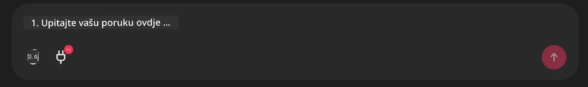

# Github MCP Server Primjer

## Opis

Ovo je demo napravljen za AI Agents Hackathon organiziran kroz Microsoft Reactor.

Alat se koristi za preporuku hackathon projekata na temelju korisničkih Github repozitorija.
To se radi na sljedeći način:

1. **Github Agent** - Koristi Github MCP Server za dohvat repozitorija i informacija o tim repozitorijima.
2. **Hackathon Agent** - Preuzima podatke od Github Agenta i osmišljava kreativne ideje za hackathon projekte na temelju projekata, jezika koje korisnik koristi i tema projekata za AI Agents hackathon.
3. **Events Agent** - Na temelju prijedloga hackathon agenta, Events Agent preporučuje relevantne događaje iz serije AI Agent Hackathon.

## Pokretanje koda

### Varijable okoline

Ovaj demo koristi Microsoft Agent Framework, Azure OpenAI Service, Github MCP Server i Azure AI Search.

Provjerite imate li ispravno postavljene varijable okoline za korištenje ovih alata:

```python
AZURE_AI_PROJECT_ENDPOINT=""
AZURE_AI_MODEL_DEPLOYMENT_NAME=""
AZURE_SEARCH_SERVICE_ENDPOINT=""
AZURE_SEARCH_API_KEY=""
``` 


## Pokretanje Chainlit Servera

Za povezivanje s MCP serverom, ovaj demo koristi Chainlit kao chat sučelje.

Za pokretanje servera koristite sljedeću naredbu u terminalu:

```bash
chainlit run app.py -w
```


Ovo bi trebalo pokrenuti vaš Chainlit server na `localhost:8000` kao i popuniti vaš Azure AI Search indeks s sadržajem `event-descriptions.md`.

## Povezivanje na MCP Server

Za povezivanje s Github MCP Serverom, odaberite ikonu "utikača" ispod okvira za chat "Type your message here..":



Nakon toga kliknite na "Connect an MCP" da dodate naredbu za povezivanje s Github MCP Serverom:

```bash
npx -y @modelcontextprotocol/server-github --env GITHUB_PERSONAL_ACCESS_TOKEN=[YOUR PERSONAL ACCESS TOKEN]
```


Zamijenite "[YOUR PERSONAL ACCESS TOKEN]" s vašim stvarnim Personal Access Token-om.

Nakon povezivanja, trebali biste vidjeti (1) pored ikone utikača kao potvrdu da je povezano. Ako nije, pokušajte ponovno pokrenuti chainlit server s `chainlit run app.py -w`.

## Korištenje Demoa

Za pokretanje radnog toka agenta koji preporučuje hackathon projekte, možete upisati poruku poput:

"Recommend hackathon projects for the Github user koreyspace"

Router Agent će analizirati vaš zahtjev i odrediti koja kombinacija agenata (GitHub, Hackathon i Events) je najbolje prilagođena za obradu vašeg upita. Agenti rade zajedno kako bi pružili sveobuhvatne preporuke na temelju analize Github repozitorija, osmišljavanja projekata i relevantnih tehnoloških događaja.

---

<!-- CO-OP TRANSLATOR DISCLAIMER START -->
**Odricanje od odgovornosti**:
Ovaj je dokument preveden pomoću AI usluge za prijevod [Co-op Translator](https://github.com/Azure/co-op-translator). Iako nastojimo osigurati točnost, imajte na umu da automatizirani prijevodi mogu sadržavati pogreške ili netočnosti. Izvorni dokument na izvornom jeziku treba smatrati ovlaštenim izvorom. Za kritične informacije preporučuje se profesionalni ljudski prijevod. Ne odgovaramo za bilo kakva nesporazuma ili pogrešne interpretacije koje proizlaze iz korištenja ovog prijevoda.
<!-- CO-OP TRANSLATOR DISCLAIMER END -->