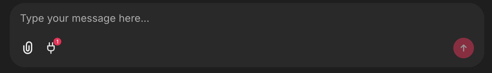

<!--
CO_OP_TRANSLATOR_METADATA:
{
  "original_hash": "9bf0395cbc541ce8db2a9699c8678dfc",
  "translation_date": "2025-08-30T10:29:46+00:00",
  "source_file": "11-agentic-protocols/code_samples/github-mcp/README.md",
  "language_code": "hr"
}
-->
# Github MCP Server Example

## Opis

Ovo je demo kreiran za AI Agents Hackathon koji je organizirao Microsoft Reactor.

Alat se koristi za preporuku projekata za hackathon na temelju korisnikovih Github repozitorija. To se postiže putem:

1. **Github Agent** - Koristi Github MCP Server za dohvaćanje repozitorija i informacija o tim repozitorijima.
2. **Hackathon Agent** - Uzima podatke od Github Agenta i osmišljava kreativne ideje za hackathon projekte na temelju projekata, jezika koje korisnik koristi i tematskih smjerova za AI Agents hackathon.
3. **Events Agent** - Na temelju prijedloga hackathon agenta, events agent preporučuje relevantne događaje iz serije AI Agent Hackathon.

## Pokretanje koda 

### Varijable okruženja

Ovaj demo koristi Azure Open AI Service, Semantic Kernel, Github MCP Server i Azure AI Search.

Provjerite jeste li postavili odgovarajuće varijable okruženja za korištenje ovih alata:

```python
AZURE_OPENAI_CHAT_DEPLOYMENT_NAME=""
AZURE_OPENAI_EMBEDDING_DEPLOYMENT_NAME=""
AZURE_OPENAI_ENDPOINT=""
AZURE_OPENAI_API_KEY=""
AZURE_OPENAI_API_VERSION=""
AZURE_SEARCH_SERVICE_ENDPOINT=""
AZURE_SEARCH_API_KEY=""
``` 

## Pokretanje Chainlit Servera

Za povezivanje s MCP serverom, ovaj demo koristi Chainlit kao sučelje za chat.

Za pokretanje servera, koristite sljedeću naredbu u terminalu:

```bash
chainlit run app.py -w
```

Ovo bi trebalo pokrenuti vaš Chainlit server na `localhost:8000` i također popuniti vaš Azure AI Search Index sadržajem iz datoteke `event-descriptions.md`.

## Povezivanje s MCP Serverom

Za povezivanje s Github MCP Serverom, odaberite ikonu "plug" ispod okvira za unos poruke "Type your message here..":



Od tamo možete kliknuti na "Connect an MCP" kako biste dodali naredbu za povezivanje s Github MCP Serverom:

```bash
npx -y @modelcontextprotocol/server-github --env GITHUB_PERSONAL_ACCESS_TOKEN=[YOUR PERSONAL ACCESS TOKEN]
```

Zamijenite "[YOUR PERSONAL ACCESS TOKEN]" vašim stvarnim Personal Access Tokenom.

Nakon povezivanja, trebali biste vidjeti broj (1) pored ikone plug, što potvrđuje da je povezano. Ako ne, pokušajte ponovno pokrenuti Chainlit server s `chainlit run app.py -w`.

## Korištenje Dema 

Za pokretanje radnog procesa agenta za preporuku projekata za hackathon, možete unijeti poruku poput:

"Preporuči hackathon projekte za Github korisnika koreyspace"

Router Agent će analizirati vaš zahtjev i odrediti koja kombinacija agenata (GitHub, Hackathon i Events) najbolje odgovara vašem upitu. Agenti surađuju kako bi pružili sveobuhvatne preporuke na temelju analize Github repozitorija, ideja za projekte i relevantnih tehnoloških događaja.

---

**Odricanje od odgovornosti**:  
Ovaj dokument je preveden pomoću AI usluge za prevođenje [Co-op Translator](https://github.com/Azure/co-op-translator). Iako nastojimo osigurati točnost, imajte na umu da automatski prijevodi mogu sadržavati pogreške ili netočnosti. Izvorni dokument na izvornom jeziku treba smatrati autoritativnim izvorom. Za ključne informacije preporučuje se profesionalni prijevod od strane ljudskog prevoditelja. Ne preuzimamo odgovornost za nesporazume ili pogrešna tumačenja koja mogu proizaći iz korištenja ovog prijevoda.