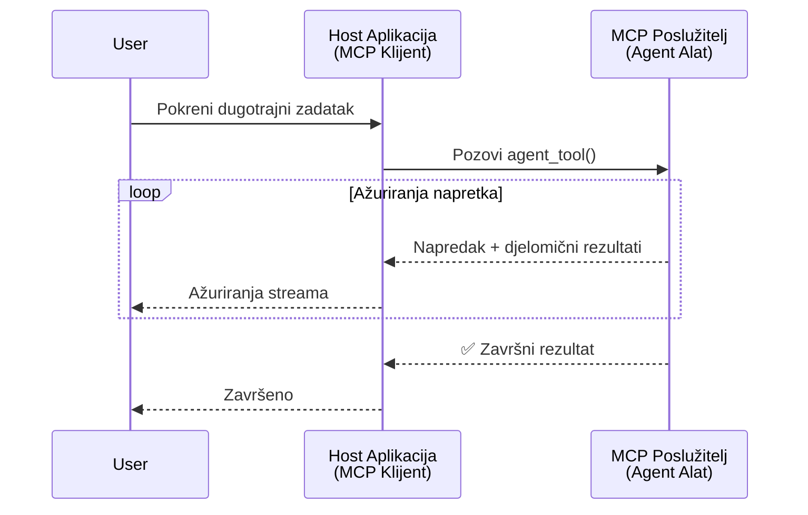
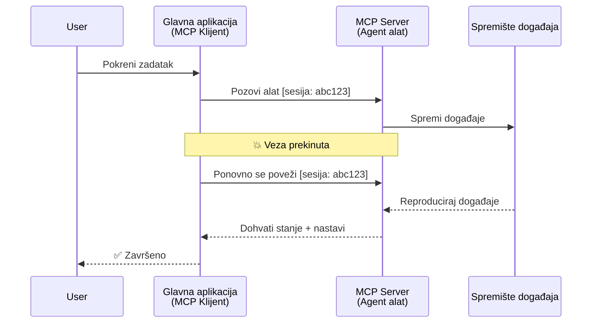
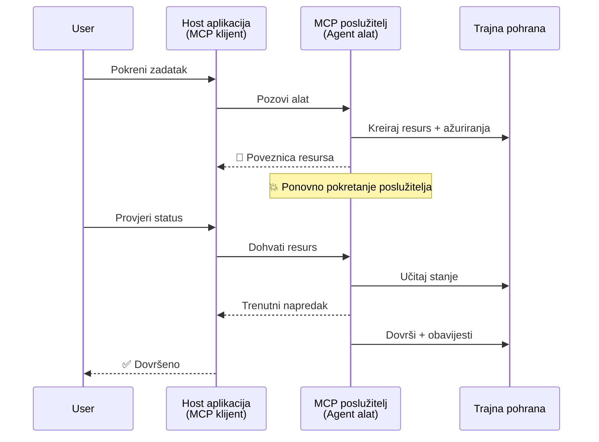
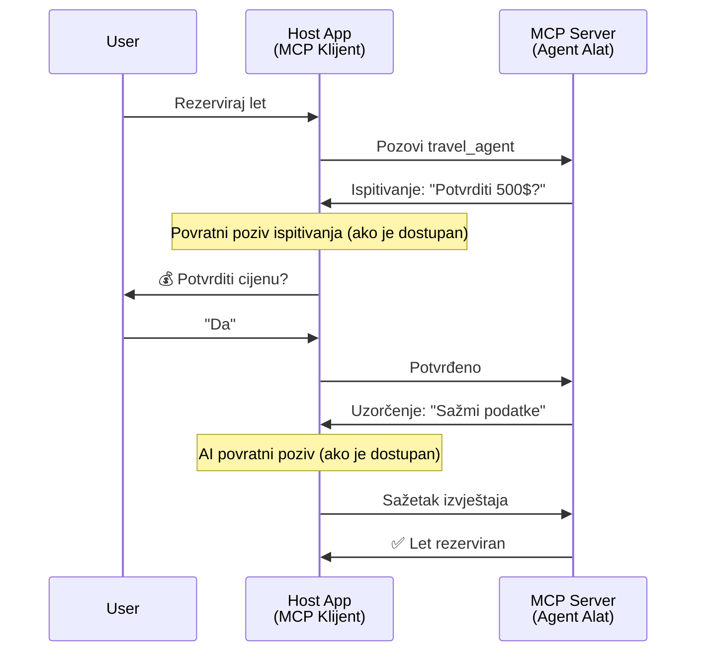
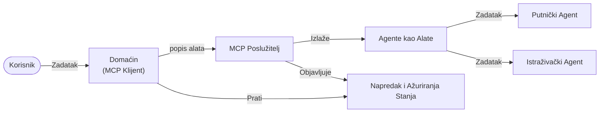

# Izgradnja sustava komunikacije između agenata pomoću MCP-a

> TL;DR - Možete li izgraditi komunikaciju Agent2Agent na MCP-u? Da!

MCP se značajno razvio izvan svoje izvornog cilja „pružanja konteksta za LLM-ove“. S nedavnim poboljšanjima uključujući [resumabilne tokove](https://modelcontextprotocol.io/docs/concepts/transports#resumability-and-redelivery), [elicitation](https://modelcontextprotocol.io/specification/2025-06-18/client/elicitation), [uzorkovanje](https://modelcontextprotocol.io/specification/2025-06-18/client/sampling) i obavijesti ([napredak](https://modelcontextprotocol.io/specification/2025-06-18/basic/utilities/progress) i [resursi](https://modelcontextprotocol.io/specification/2025-06-18/schema#resourceupdatednotification)), MCP sada pruža snažnu osnovu za izgradnju složenih sustava komunikacije između agenata.

## Pogrešna predodžba o agentu/alatu

Kako sve više programera istražuje alate s agentnim ponašanjem (koji mogu raditi dulje vrijeme, mogu zahtijevati dodatne unose tijekom izvršenja itd.), česta pogrešna predodžba je da MCP nije prikladan prvenstveno jer su rani primjeri njegovih primitivnih alata bili usredotočeni na jednostavne obrasce zahtjev-odgovor.

Ovo je zastarjela percepcija. Specifikacija MCP-a je značajno unaprijeđena tijekom proteklih nekoliko mjeseci s mogućnostima koje smanjuju jaz u izgradnji dugotrajnih agentnih ponašanja:

- **Streaming i djelomični rezultati**: Ažuriranja napretka u stvarnom vremenu tijekom izvršenja
- **Resumabilnost**: Klijenti se mogu ponovno povezati i nastaviti nakon prekida veze
- **Trajnost**: Rezultati preživljavaju ponovno pokretanje poslužitelja (npr. putem poveznica na resurse)
- **Višekratna interakcija**: Interaktivni unos tijekom izvršavanja putem elicitation i uzorkovanja

Ove značajke mogu se kombinirati za omogućavanje složenih agentnih i višestrukih agentnih aplikacija, sve implementirano na MCP protokolu.

Za referencu, agenta ćemo nazivati „alatom“ koji je dostupan na MCP poslužitelju. To podrazumijeva postojanje host aplikacije koja implementira MCP klijenta koji uspostavlja sesiju s MCP poslužiteljem i može pozivati agenta.

## Što čini MCP alat „agentnim“?

Prije nego što prijeđemo na implementaciju, definirajmo koje infrastrukturne mogućnosti su potrebne za podršku dugotrajnih agenata.

> Definirat ćemo agenta kao entitet koji može autonomno djelovati tijekom duljih razdoblja, sposoban za rješavanje složenih zadataka koji mogu zahtijevati višestruke interakcije ili prilagodbe na temelju povratne informacije u stvarnom vremenu.

### 1. Streaming i djelomični rezultati

Tradicionalni obrasci zahtjev-odgovor ne funkcioniraju za dugotrajne zadatke. Agenti moraju pružiti:

- Ažuriranja napretka u stvarnom vremenu
- Srednje rezultate

**Podrška MCP-a**: Obavijesti o ažuriranju resursa omogućuju streaming djelomičnih rezultata, iako je potrebna pažljiva konstrukcija da bi se izbjegli sukobi s JSON-RPC-ovim modelom 1:1 zahtjev/odgovor.

| Značajka                 | Primjer uporabe                                                                                                                                     | Podrška MCP-a                                                                              |
| ----------------------- | -------------------------------------------------------------------------------------------------------------------------------------------------- | ------------------------------------------------------------------------------------------ |
| Ažuriranja napretka     | Korisnik zahtijeva zadatak migracije koda. Agent prenosi napredak: „10 % - Analiza ovisnosti... 25 % - Pretvaranje TypeScript datoteka... 50 % - Ažuriranje importa...“ | ✅ Obavijesti o napretku                                                                   |
| Djelomični rezultati    | Zadatak „Generiraj knjigu“ prenosi djelomične rezultate, npr., 1) Skica zapleta, 2) Popis poglavlja, 3) Svako poglavlje kad je dovršeno. Host može pregledavati, otkazati ili preusmjeriti u bilo kojem trenutku. | ✅ Obavijesti se mogu „proširiti“ za uključivanje djelomičnih rezultata, vidi prijedloge u PR 383, 776 |

<div align="center" style="font-style: italic; font-size: 0.95em; margin-bottom: 0.5em;">
<strong>Slika 1:</strong> Ovaj dijagram prikazuje kako MCP agent prenosi ažuriranja napretka u stvarnom vremenu i djelomične rezultate host aplikaciji tijekom dugotrajnog zadatka, omogućujući korisniku praćenje izvršenja u stvarnom vremenu.
</div>



### 2. Resumabilnost

Agenti moraju elegantno rukovati prekidima mreže:

- Ponovno se povezati nakon (klijentskog) prekida
- Nastaviti od točke prekida (ponovna dostava poruka)

**Podrška MCP-a**: MCP StreamableHTTP transport danas podržava nastavak sesije i ponovnu dostavu poruka s ID-jevima sesije i posljednjim ID-jevima događaja. Važna napomena je da poslužitelj mora implementirati EventStore koji omogućuje reprodukciju događaja prilikom ponovne veze klijenta.  
Napominjemo da postoji prijedlog zajednice (PR #975) koji istražuje transportno-agnostičke resumabilne tokove.

| Značajka      | Primjer uporabe                                                                                                                               | Podrška MCP-a                                                           |
| ------------ | --------------------------------------------------------------------------------------------------------------------------------------------- | ----------------------------------------------------------------------- |
| Resumabilnost | Klijent se prekine tijekom dugotrajnog zadatka. Nakon ponovne veze, sesija se nastavlja s reproduciranim propuštenim događajima, bez zastoja. | ✅ StreamableHTTP transport s ID-jevima sesije, reproduciranje događaja i EventStore |

<div align="center" style="font-style: italic; font-size: 0.95em; margin-bottom: 0.5em;">
<strong>Slika 2:</strong> Ovaj dijagram prikazuje kako MCP-ov StreamableHTTP transport i Event Store omogućuju neprimjetan nastavak sesije: ako se klijent prekine, može se ponovno povezati i reproducirati propuštene događaje, nastavljajući zadatak bez gubitka napretka.
</div>



### 3. Trajnost

Dugotrajni agenti trebaju trajno stanje:

- Rezultati preživljavaju ponovno pokretanje poslužitelja
- Status se može dohvatiti izvan sesije
- Praćenje napretka između sesija

**Podrška MCP-a**: MCP sada podržava povratne tipove poveznica na resurse za pozive alatu. Danas je mogući obrazac dizajnirati alat koji stvara resurs i odmah vraća poveznicu na resurs. Alat može nastaviti rješavati zadatak u pozadini i ažurirati resurs. Klijent zatim može birati da provjerava stanje tog resursa kako bi dobio djelomične ili potpune rezultate (ovisno o tome koje obavijesti o ažuriranju resursa poslužitelj pruža) ili se pretplatiti na resurs za obavijesti o ažuriranjima.

Jedno ograničenje ovdje je da provjeravanje resursa ili pretplata na obavijesti može trošiti resurse s posljedicama na većem opsegu. Postoji otvoreni prijedlog zajednice (uključujući #992) koji istražuje mogućnost uključivanja webhookova ili okidača koje poslužitelj može pozvati za obavještavanje klijenta/host aplikacije o ažuriranjima.

| Značajka  | Primjer uporabe                                                                                                                                  | Podrška MCP-a                                                    |
| -------- | ------------------------------------------------------------------------------------------------------------------------------------------------- | ---------------------------------------------------------------- |
| Trajnost | Poslužitelj se ruši tijekom zadatka migracije podataka. Rezultati i napredak prežive ponovno pokretanje, klijent može provjeriti status i nastaviti iz trajnog resursa. | ✅ Poveznice na resurse s trajnom pohranom i obavijestima o statusu |

Danas je uobičajen obrazac dizajnirati alat koji stvara resurs i odmah vraća poveznicu na resurs. Alat može u pozadini rješavati zadatak, izdavati obavijesti o resursima koje služe kao ažuriranja napretka ili uključivati djelomične rezultate i po potrebi ažurirati sadržaj unutar resursa.

<div align="center" style="font-style: italic; font-size: 0.95em; margin-bottom: 0.5em;">
<strong>Slika 3:</strong> Ovaj dijagram pokazuje kako MCP agenti koriste trajne resurse i obavijesti o statusu kako bi osigurali da dugotrajni zadaci prežive ponovno pokretanje poslužitelja, dopuštajući klijentima da provjere napredak i dohvaćaju rezultate čak i nakon kvarova.
</div>



### 4. Višekratne Interakcije

Agenti često trebaju dodatni unos tijekom izvršavanja:

- Ljudsko pojašnjenje ili potvrdu
- Pomoć AI-a za složene odluke
- Dinamička prilagodba parametara

**Podrška MCP-a**: Potpuno podržano putem uzorkovanja (za AI unos) i elicitation (za ljudski unos).

| Značajka                 | Primjer uporabe                                                                                                                                | Podrška MCP-a                                            |
| ----------------------- | --------------------------------------------------------------------------------------------------------------------------------------------- | -------------------------------------------------------- |
| Višekratne interakcije   | Agent za rezervaciju putovanja traži potvrdu cijene od korisnika, zatim traži od AI sažetak podataka o putovanju prije završetka rezervacije. | ✅ Elicitation za ljudski unos, uzorkovanje za AI unos  |

<div align="center" style="font-style: italic; font-size: 0.95em; margin-bottom: 0.5em;">
<strong>Slika 4:</strong> Ovaj dijagram prikazuje kako MCP agenti interaktivno mogu zatražiti ljudski unos ili tražiti pomoć AI-a tijekom izvršenja, podržavajući složene višekratne tijekove rada poput potvrda i dinamičkog donošenja odluka.
</div>



## Implementacija dugotrajnih agenata na MCP-u - Pregled koda

Kao dio ovog članka, pružamo [repozitorij koda](https://github.com/victordibia/ai-tutorials/tree/main/MCP%20Agents) koji sadrži potpunu implementaciju dugotrajnih agenata koristeći MCP Python SDK sa StreamableHTTP transportom za nastavak sesije i ponovnu dostavu poruka. Implementacija prikazuje kako mogućnosti MCP-a mogu biti složene kako bi podržale sofisticirana agentna ponašanja.

Konkretno, implementiramo poslužitelj s dva primarna agentska alata:

- **Agent za putovanja** - Simulira uslugu rezervacije putovanja s potvrdom cijene putem elicitation
- **Agent za istraživanje** - Obavlja istraživačke zadatke s AI-pomoći za sažetke putem uzorkovanja

Oba agenta demonstriraju ažuriranja napretka u stvarnom vremenu, interaktivne potvrde i potpuno vraćanje sesije.

### Ključni koncepti implementacije

Sljedeći odjeljci prikazuju implementaciju agenata na strani poslužitelja i rukovanje host klijenta za svaku mogućnost:

#### Streaming i ažuriranja napretka - Status zadatka u stvarnom vremenu

Streaming omogućuje agentima da pružaju ažuriranja napretka u stvarnom vremenu tijekom dugotrajnih zadataka, informirajući korisnike o statusu zadatka i srednjim rezultatima.

**Implementacija na poslužitelju (agent šalje obavijesti o napretku):**

```python
# Iz server/server.py - Putni agent šalje ažuriranja napretka
for i, step in enumerate(steps):
    await ctx.session.send_progress_notification(
        progress_token=ctx.request_id,
        progress=i * 25,
        total=100,
        message=step,
        related_request_id=str(ctx.request_id)
    )
    await anyio.sleep(2)  # Simuliraj rad

# Alternativa: Zabilježi poruke za detaljna ažuriranja korak po korak
await ctx.session.send_log_message(
    level="info",
    data=f"Processing step {current_step}/{steps} ({progress_percent}%)",
    logger="long_running_agent",
    related_request_id=ctx.request_id,
)
```

**Implementacija na klijentu (host prima ažuriranja napretka):**

```python
# Iz client/client.py - Klijent koji obrađuje obavijesti u stvarnom vremenu
async def message_handler(message) -> None:
    if isinstance(message, types.ServerNotification):
        if isinstance(message.root, types.LoggingMessageNotification):
            console.print(f"📡 [dim]{message.root.params.data}[/dim]")
        elif isinstance(message.root, types.ProgressNotification):
            progress = message.root.params
            console.print(f"🔄 [yellow]{progress.message} ({progress.progress}/{progress.total})[/yellow]")

# Registriraj obradu poruka prilikom stvaranja sesije
async with ClientSession(
    read_stream, write_stream,
    message_handler=message_handler
) as session:
```

#### Elicitation - Zahtjev za unosom korisnika

Elicitation omogućuje agentima da zatraže unos korisnika tijekom izvršenja. To je ključno za potvrde, pojašnjenja ili odobrenja tijekom dugotrajnih zadataka.

**Implementacija na poslužitelju (agent traži potvrdu):**

```python
# Iz server/server.py - Putnički agent traži potvrdu cijene
elicit_result = await ctx.session.elicit(
    message=f"Please confirm the estimated price of $1200 for your trip to {destination}",
    requestedSchema=PriceConfirmationSchema.model_json_schema(),
    related_request_id=ctx.request_id,
)

if elicit_result and elicit_result.action == "accept":
    # Nastavi s rezervacijom
    logger.info(f"User confirmed price: {elicit_result.content}")
elif elicit_result and elicit_result.action == "decline":
    # Otkaži rezervaciju
    booking_cancelled = True
```

**Implementacija na klijentu (host osigurava povratni poziv za elicitation):**

```python
# Iz client/client.py - Klijent rukuje zahtjevima za ispitivanjem
async def elicitation_callback(context, params):
    console.print(f"💬 Server is asking for confirmation:")
    console.print(f"   {params.message}")

    response = console.input("Do you accept? (y/n): ").strip().lower()

    if response in ['y', 'yes']:
        return types.ElicitResult(
            action="accept",
            content={"confirm": True, "notes": "Confirmed by user"}
        )
    else:
        return types.ElicitResult(
            action="decline",
            content={"confirm": False, "notes": "Declined by user"}
        )

# Registrirajte povratni poziv prilikom stvaranja sesije
async with ClientSession(
    read_stream, write_stream,
    elicitation_callback=elicitation_callback
) as session:
```

#### Uzorkovanje - Zahtjev AI pomoći

Uzorkovanje omogućuje agentima traženje pomoći LLM-a za složene odluke ili generiranje sadržaja tijekom izvršenja. To podržava hibridne ljudsko-AI tijekove rada.

**Implementacija na poslužitelju (agent traži AI pomoć):**

```python
# Iz server/server.py - Istraživački agent traži AI sažetak
sampling_result = await ctx.session.create_message(
    messages=[
        SamplingMessage(
            role="user",
            content=TextContent(type="text", text=f"Please summarize the key findings for research on: {topic}")
        )
    ],
    max_tokens=100,
    related_request_id=ctx.request_id,
)

if sampling_result and sampling_result.content:
    if sampling_result.content.type == "text":
        sampling_summary = sampling_result.content.text
        logger.info(f"Received sampling summary: {sampling_summary}")
```

**Implementacija na klijentu (host osigurava povratni poziv za uzorkovanje):**

```python
# Iz client/client.py - Klijent obrađuje zahtjeve za uzorkovanjem
async def sampling_callback(context, params):
    message_text = params.messages[0].content.text if params.messages else 'No message'
    console.print(f"🧠 Server requested sampling: {message_text}")

    # U stvarnoj aplikaciji, ovo bi moglo pozvati LLM API
    # Za demo svrhe, pružamo lažni odgovor
    mock_response = "Based on current research, MCP has evolved significantly..."

    return types.CreateMessageResult(
        role="assistant",
        content=types.TextContent(type="text", text=mock_response),
        model="interactive-client",
        stopReason="endTurn"
    )

# Registrirajte povratni poziv prilikom kreiranja sesije
async with ClientSession(
    read_stream, write_stream,
    sampling_callback=sampling_callback,
    elicitation_callback=elicitation_callback
) as session:
```

#### Resumabilnost - Kontinuitet sesije kroz prekide veze

Resumabilnost osigurava da dugotrajni agentni zadaci mogu preživjeti prekide veze klijenta i neprimjetno nastaviti nakon ponovne veze. Ovo je implementirano kroz event store-ove i tokene za nastavak.

**Implementacija event store-a (poslužitelj čuva stanje sesije):**

```python
# Iz server/event_store.py - Jednostavno memorijsko spremište događaja
class SimpleEventStore(EventStore):
    def __init__(self):
        self._events: list[tuple[StreamId, EventId, JSONRPCMessage]] = []
        self._event_id_counter = 0

    async def store_event(self, stream_id: StreamId, message: JSONRPCMessage) -> EventId:
        """Store an event and return its ID."""
        self._event_id_counter += 1
        event_id = str(self._event_id_counter)
        self._events.append((stream_id, event_id, message))
        return event_id

    async def replay_events_after(self, last_event_id: EventId, send_callback: EventCallback) -> StreamId | None:
        """Replay events after the specified ID for resumption."""
        start_index = None
        stream_id = None
        for index, (event_stream_id, event_id, _) in enumerate(self._events):
            if event_id == last_event_id:
                start_index = index + 1
                stream_id = event_stream_id
                break

        if start_index is None:
            return None

        # Reproduciraj samo kasnije događaje iz izvornog toka sesije.
        for event_stream_id, event_id, message in self._events[start_index:]:
            if event_stream_id != stream_id:
                continue
            await send_callback(EventMessage(message, event_id))

        return stream_id

# Iz server/server.py - Prosljeđivanje spremišta događaja upravitelju sesije
def create_server_app(event_store: Optional[EventStore] = None) -> Starlette:
    server = ResumableServer()

    # Kreiraj upravitelj sesije sa spremištem događaja za nastavak
    session_manager = StreamableHTTPSessionManager(
        app=server,
        event_store=event_store,  # Spremište događaja omogućuje nastavak sesije
        json_response=False,
        security_settings=security_settings,
    )

    return Starlette(routes=[Mount("/mcp", app=session_manager.handle_request)])

# Upotreba: Inicijaliziraj sa spremištem događaja
event_store = SimpleEventStore()
app = create_server_app(event_store)
```

**Klijentski metapodaci s tokenom za nastavak (klijent se ponovno povezuje koristeći pohranjeno stanje):**

```python
# Iz client/client.py - Nastavak klijenta s metapodacima
if existing_tokens and existing_tokens.get("resumption_token"):
    # Koristite postojeći token za nastavak kako biste nastavili tamo gdje smo stali
    metadata = ClientMessageMetadata(
        resumption_token=existing_tokens["resumption_token"],
    )
else:
    # Kreirajte povratni poziv za spremanje tokena za nastavak kad se primi
    def enhanced_callback(token: str):
        protocol_version = getattr(session, 'protocol_version', None)
        token_manager.save_tokens(session_id, token, protocol_version, command, args)

    metadata = ClientMessageMetadata(
        on_resumption_token_update=enhanced_callback,
    )

# Pošaljite zahtjev s metapodacima za nastavak
result = await session.send_request(
    types.ClientRequest(
        types.CallToolRequest(
            method="tools/call",
            params=types.CallToolRequestParams(name=command, arguments=args)
        )
    ),
    types.CallToolResult,
    metadata=metadata,
)
```

Host aplikacija lokalno održava ID-jeve sesije i tokene za nastavak, dopuštajući ponovno povezivanje s postojećim sesijama bez gubitka napretka ili stanja.

### Organizacija koda

<div align="center" style="font-style: italic; font-size: 0.95em; margin-bottom: 0.5em;">
<strong>Slika 5:</strong> Arhitektura sustava agenata zasnovanih na MCP-u
</div>



**Ključne datoteke:**

- **`server/server.py`** - Resumabilni MCP poslužitelj s agentima za putovanja i istraživanja koji demonstriraju elicitation, uzorkovanje i ažuriranja napretka
- **`client/client.py`** - Interaktivna host aplikacija s podrškom za nastavak, rukovateljima povratnih poziva i upravljanjem tokenima
- **`server/event_store.py`** - Implementacija event store-a koja omogućuje nastavak sesije i ponovnu dostavu poruka

## Proširenje na komunikaciju više agenata na MCP-u

Gornju implementaciju moguće je proširiti na sustave s više agenata poboljšanjem inteligencije i opsega host aplikacije:

- **Inteligentno razlaganje zadataka**: Host analizira složene korisničke zahtjeve i razlaže ih u podzadatke za različite specijalizirane agente
- **Koordinacija među više poslužitelja**: Host održava veze s više MCP poslužitelja, od kojih svaki izlaže različite agentske mogućnosti
- **Upravljanje stanjem zadatka**: Host prati napredak kroz više istovremenih agentskih zadataka, upravljajući ovisnostima i sekvenciranjem
- **Otpornost i ponovne pokušaje**: Host upravlja neuspjesima, implementira logiku ponovnog pokušaja i preusmjerava zadatke kada agenti postanu nedostupni
- **Sinteza rezultata**: Host kombinira izlaze iz više agenata u koherentne konačne rezultate

Host se razvija iz jednostavnog klijenta u inteligentnog orkestratora, koordinirajući distribuirane agentske mogućnosti dok održava istu MCP protokolnu osnovu.

## Zaključak

Poboljšane mogućnosti MCP-a - obavijesti o resursima, elicitation/uzorkovanje, resumabilni tokovi i trajni resursi - omogućuju složene interakcije između agenata uz održavanje jednostavnosti protokola.

## Početak rada

Spremni za izgradnju vlastitog sustava agent2agent? Slijedite ove korake:

### 1. Pokrenite demo

```bash
# Pokrenite poslužitelj s pohranom događaja za nastavak
python -m server.server --port 8006

# U drugom terminalu pokrenite interaktivnog klijenta
python -m client.client --url http://127.0.0.1:8006/mcp
```

**Dostupne naredbe u interaktivnom načinu:**

- `travel_agent` - Rezervirajte putovanje s potvrdom cijene putem elicitation
- `research_agent` - Istražujte teme s AI-pomoći za sažetke putem uzorkovanja
- `list` - Prikaži sve dostupne alate
- `clean-tokens` - Očisti tokene za nastavak
- `help` - Prikaži detaljnu pomoć za naredbe
- `quit` - Izlaz iz klijenta

### 2. Testirajte mogućnosti nastavka

- Pokrenite dugotrajni agent (npr. `travel_agent`)
- Prekinite klijenta tijekom izvršavanja (Ctrl+C)
- Ponovno pokrenite klijenta - automatski će nastaviti tamo gdje je stao

### 3. Istražite i proširite

- **Istražite primjere**: Pogledajte ovaj [mcp-agents](https://github.com/victordibia/ai-tutorials/tree/main/MCP%20Agents)
- **Pridružite se zajednici**: Sudjelujte u MCP raspravama na GitHubu
- **Eksperimentirajte**: Počnite s jednostavnim dugotrajnim zadatkom i postupno dodajte streaming, resume i koordinaciju više agenata

Ovo pokazuje kako MCP omogućuje inteligentna agentska ponašanja dok održava jednostavnost alata.

Sveukupno, MCP specifikacija brzo se razvija; preporučuje se čitatelju da pregleda službenu web stranicu dokumentacije za najnovije nadopune - https://modelcontextprotocol.io/introduction

---

<!-- CO-OP TRANSLATOR DISCLAIMER START -->
**Napomena**:
Ovaj dokument je preveden korištenjem AI prevoditeljskog servisa [Co-op Translator](https://github.com/Azure/co-op-translator). Iako težimo točnosti, imajte na umu da automatski prijevodi mogu sadržavati greške ili netočnosti. Izvorni dokument na izvornom jeziku treba smatrati autoritativnim izvorom. Za važne informacije preporuča se profesionalni ljudski prijevod. Nismo odgovorni za bilo kakva nesporazumevanja ili pogrešne interpretacije koje proizlaze iz korištenja ovog prijevoda.
<!-- CO-OP TRANSLATOR DISCLAIMER END -->