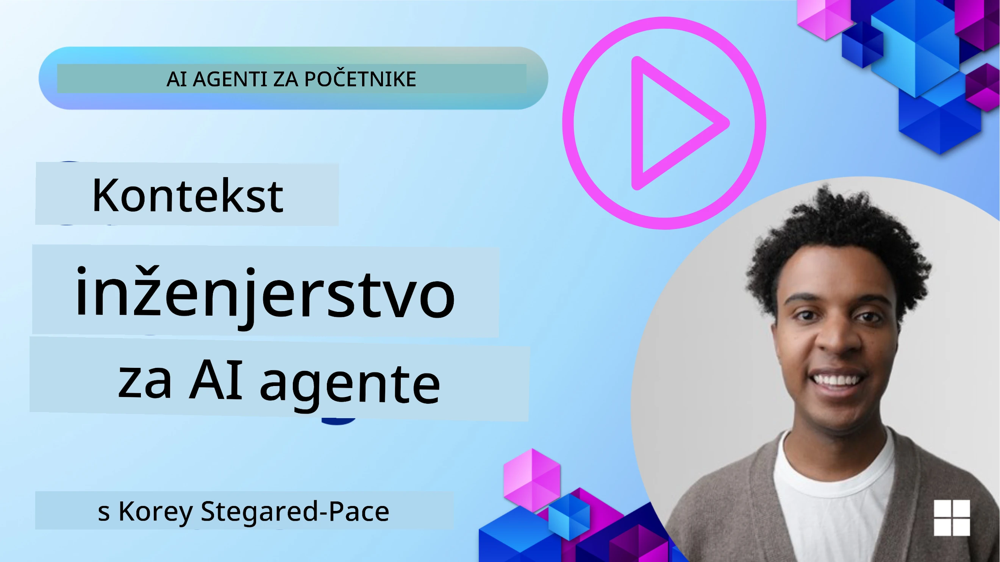
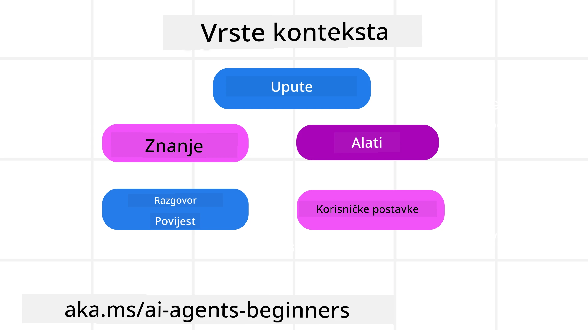
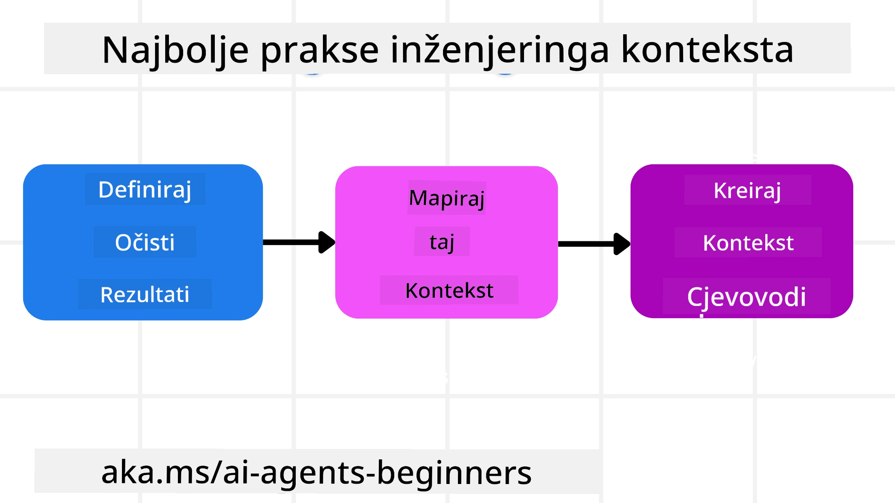

# Inženjering konteksta za AI agente

> _(Kliknite sliku iznad za pregled videa ove lekcije)_

Razumijevanje složenosti aplikacije za koju gradite AI agenta važno je za izradu pouzdanog agenta. Potrebno je izgraditi AI agente koji učinkovito upravljaju informacijama kako bi zadovoljili složene potrebe koje nadilaze samo inženjering upita.

U ovoj lekciji razmotrit ćemo što je inženjering konteksta i njegovu ulogu u izgradnji AI agenata.

## Uvod

Ova lekcija će pokriti:

• **Što je inženjering konteksta** i zašto se razlikuje od inženjeringa upita.

• **Strategije za učinkovit inženjering konteksta**, uključujući kako pisati, odabrati, sažeti i izolirati informacije.

• **Uobičajene pogreške u kontekstu** koje mogu omesti vaš AI agent i kako ih popraviti.

## Ciljevi učenja

Nakon završetka ove lekcije, razumjet ćete kako:

• **Definirati inženjering konteksta** i razlikovati ga od inženjeringa upita.

• **Prepoznati ključne komponente konteksta** u aplikacijama velikih jezičnih modela (LLM).

• **Primijeniti strategije za pisanje, odabir, sažimanje i izolaciju konteksta** za poboljšanje performansi agenta.

• **Prepoznati uobičajene pogreške u kontekstu**, poput trovanja, ometanja, zbunjenosti i sukoba, te implementirati tehnike ublažavanja.

## Što je inženjering konteksta?

Za AI agente, kontekst je ono što pokreće planiranje AI agenta da poduzme određene radnje. Inženjering konteksta je praksa osiguravanja da AI agent ima prave informacije za dovršetak sljedećeg koraka zadatka. Prozor konteksta je ograničen veličinom, stoga kao kreatori agenata trebamo izgraditi sustave i procese za upravljanje dodavanjem, uklanjanjem i sažimanjem informacija u prozoru konteksta.

### Inženjering upita vs inženjering konteksta

Inženjering upita fokusira se na jedinstveni skup statičnih uputa koje učinkovito vode AI agente s nizom pravila. Inženjering konteksta odnosi se na upravljanje dinamičnim skupom informacija, uključujući početni upit, kako bi se osiguralo da AI agent ima ono što mu treba kroz vrijeme. Glavna ideja inženjeringa konteksta je učiniti taj proces ponovljivim i pouzdanim.

### Vrste konteksta

Važno je zapamtiti da kontekst nije samo jedna stvar. Informacije koje AI agent treba mogu dolaziti iz raznih izvora i na nama je da osiguramo da agent ima pristup tim izvorima:

Vrste konteksta koje AI agent može trebati upravljati uključuju:

• **Upute:** One su poput "pravila" agenta – upiti, sistemske poruke, primjeri s nekoliko uzoraka (pokazujući AI kako nešto učiniti) i opisi alata koje može koristiti. Ovo je mjesto gdje se fokus inženjeringa upita spaja s inženjeringom konteksta.

• **Znanje:** Obuhvaća činjenice, informacije dohvaćene iz baza podataka ili dugoročna sjećanja koja je agent prikupio. To uključuje integriranje sustava za augmentaciju dohvaćanja (RAG) ako agent treba pristup različitim spremištima znanja i bazama podataka.

• **Alati:** Definicije vanjskih funkcija, API-ja i MCP poslužitelja koje agent može pozvati, zajedno s povratnim informacijama (rezultatima) koje dobiva njihovim korištenjem.

• **Povijest razgovora:** Teče dijalog s korisnikom. Kako vrijeme prolazi, ti razgovori postaju duži i složeniji, što zauzima prostor u prozoru konteksta.

• **Korisničke preferencije:** Informacije o preferencijama korisnika koje se uče tijekom vremena. One se mogu spremiti i koristiti pri važnim odlukama kako bi se pomoglo korisniku.

## Strategije za učinkovit inženjering konteksta

### Strategije planiranja

Dobar inženjering konteksta počinje s dobrim planiranjem. Evo pristupa koji će vam pomoći da počnete razmišljati o tome kako primijeniti koncept inženjeringa konteksta:

1. **Definirajte jasne rezultate** – Rezultati zadataka koji će biti dodijeljeni AI agentima trebaju biti jasno definirani. Odgovorite na pitanje - "Kako će svijet izgledati kada AI agent završi svoj zadatak?" Drugim riječima, koja promjena, informacija ili odgovor korisnik treba dobiti nakon interakcije s AI agentom.
2. **Mapirajte kontekst** – Nakon što definirate rezultate AI agenta, potrebna je analiza "Koje informacije AI agent treba da bi dovršio ovaj zadatak?". Na ovaj način možete početi mapirati kontekst gdje se te informacije mogu nalaziti.
3. **Izradite kontekstualne tokove** – Sada kada znate gdje su informacije, morate odgovoriti na pitanje "Kako će agent dobiti te informacije?". To se može učiniti na razne načine uključujući RAG, korištenje MCP poslužitelja i drugih alata.

### Praktične strategije

Planiranje je važno, ali kad informacije počnu pristizati u prozor konteksta našeg agenta, trebamo praktične strategije za njihovo upravljanje:

#### Upravljanje kontekstom

Dok će neke informacije biti automatski dodane u prozor konteksta, inženjering konteksta podrazumijeva aktivniju ulogu u upravljanju tim informacijama kroz nekoliko strategija:

 1. **Radna bilježnica agenta**  
 Omogućuje AI agentu da bilježi relevantne informacije o trenutnim zadacima i korisničkim interakcijama tijekom jedne sesije. Trebala bi postojati izvan prozora konteksta u datoteci ili objektu u izvođenju koji agent može naknadno dohvatiti tijekom ove sesije, ako je potrebno.

 2. **Sjećanja**  
 Radne bilježnice su dobre za upravljanje informacijama izvan konteksta jedne sesije. Sjećanja omogućuju agentima da pohranjuju i dohvaćaju relevantne informacije kroz više sesija. To može uključivati sažetke, korisničke preferencije i povratne informacije za buduća poboljšanja.

 3. **Sažimanje konteksta**  
 Kada prozor konteksta raste i približava se svojem ograničenju, može se koristiti tehnika poput sažimanja i rezanja. To uključuje zadržavanje samo najrelevantnijih informacija ili uklanjanje starijih poruka.
  
 4. **Sistemi s više agenata**  
 Razvoj sustava s više agenata je oblik inženjeringa konteksta zato što svaki agent ima svoj kontekstualni prozor. Kako se taj kontekst dijeli i prosljeđuje različitim agentima nešto je što treba isplanirati prilikom izrade takvih sustava.
  
 5. **Sandbox okruženja**  
 Ako agent treba pokrenuti neki kod ili obraditi velike količine informacija u dokumentu, to može zahtijevati veliki broj tokena za obradu rezultata. Umjesto da se sve to sprema u prozor konteksta, agent može koristiti sandbox okruženje koje može pokrenuti kod i samo pročitati rezultate i druge relevantne informacije.
  
 6. **Objekti stanja izvođenja**  
  To se radi stvaranjem spremnika informacija za upravljanje situacijama kad agent treba imati pristup određenim informacijama. Za složen zadatak, to bi omogućilo agentu da pohranjuje rezultate svakog podzadatka korak po korak, dopuštajući kontekstu da ostane povezan samo s tim specifičnim podzadatkom.

#### Pregled konteksta

Nakon što primijenite neku od ovih strategija, prikladno je provjeriti što je sljedeći poziv modela zapravo dobio. Korisno je pitanje za otklanjanje pogrešaka:

> Je li agent učitao previše konteksta, pogrešan kontekst ili mu je nedostajao potreban kontekst?

Nije potrebno bilježiti sirove upite, izlaze alata ili sadržaj memorije da bi odgovorili na to pitanje. U produkciji se preferiraju mali zapisi pregleda konteksta koji bilježe brojeve, ID-jeve, hash vrijednosti i oznake politike:

- **Odabir:** Pratite koliko je kandidatskih dijelova, alata ili memorija razmatrano, koliko ih je odabrano i koje je pravilo ili ocjena uzrokovala filtriranje ostalih.
- **Sažimanje:** Zabilježite raspon izvora ili identifikator traga, ID sažetka, procijenjeni broj tokena prije i poslije sažimanja te je li sirovi sadržaj isključen iz sljedećeg poziva.
- **Izolacija:** Zabilježite koji je podzadatak izvršen u zasebnom agentu, sesiji ili sandboxu, koji je sažetak ograničen i je li veliki izlaz alata ostao izvan konteksta glavnog agenta.
- **Memorija i RAG:** Spremajte ID-jeve dokumenata za dohvaćanje, ID-jeve memorije, ocjene, odabrane ID-jeve i status cenzure umjesto punog dohvaćenog teksta.
- **Sigurnost i privatnost:** Preferirajte hash vrijednosti, ID-jeve, token kante i oznake politike umjesto osjetljivog teksta upita, argumenata alata, rezultata alata ili tijela korisničke memorije.

Cilj nije čuvati više konteksta. Cilj je ostaviti dovoljno dokaza da programer može utvrditi koja je strategija konteksta pokrenuta i je li promijenila sljedeći poziv modela na željeni način.

### Primjer inženjeringa konteksta

Recimo da želimo da AI agent **"Rezervira putovanje u Pariz."**

• Jednostavan agent koji koristi samo inženjering upita možda će samo odgovoriti: **"U redu, kada želite ići u Pariz?"**. On je obradio samo vaše izravno pitanje u trenutku kada ga je korisnik postavio.

• Agent koji koristi strategije inženjeringa konteksta opisane ovdje učinio bi mnogo više. Prije nego što uopće odgovori, njegov sustav bi mogao:

  ◦ **Provjeriti vaš kalendar** za dostupne datume (dohvaćajući podatke u stvarnom vremenu).

  ◦ **Prisjetiti se prethodnih putničkih preferencija** (iz dugoročne memorije), poput vaše omiljene zrakoplovne tvrtke, budžeta ili preferencije za direktne letove.

  ◦ **Prepoznati dostupne alate** za rezervaciju leta i hotela.

- Zatim bi primjer odgovora mogao biti:  "Bok [Vaše ime]! Vidim da ste slobodni prvi tjedan listopada. Želite li da potražim direktne letove za Pariz na [Omiljena zrakoplovna tvrtka] unutar vašeg uobičajenog budžeta od [Budžet]?" Ovaj bogatiji, kontekstualno svjestan odgovor pokazuje moć inženjeringa konteksta.

## Uobičajene pogreške u kontekstu

### Trovanje konteksta

**Što je to:** Kada se halucinacija (lažna informacija generirana LLM-om) ili pogreška uvuku u kontekst i stalno se referenciraju, uzrokujući da agent slijedi nemoguće ciljeve ili razvija besmislene strategije.

**Što učiniti:** Implementirajte **validaciju konteksta** i **karantenu**. Validirajte informacije prije nego što se dodaju u dugoročnu memoriju. Ako se otkrije mogućnost trovanja, započnite nove kontekstualne niti kako biste spriječili širenje loših informacija.

**Primjer rezervacije putovanja:** Vaš agent halucinira **direktni let s malog lokalnog aerodroma do udaljenog međunarodnog grada** koji zapravo nema međunarodne letove. Taj nepostojeći detalj leta pohranjen je u kontekst. Kasnije, kad zatražite rezervaciju, agent uporno pokušava pronaći karte za ovu nemoguću rutu, što uzrokuje ponavljane pogreške.

**Rješenje:** Implementirajte korak koji **validira postojanje leta i rute putem API-ja u stvarnom vremenu** _prije_ dodavanja detalja leta u radni kontekst agenta. Ako validacija ne uspije, pogrešna informacija se "karanteniše" i ne koristi se dalje.

### Ometanje konteksta

**Što je to:** Kad kontekst postane toliko velik da se model previše fokusira na nakupljenu povijest umjesto na ono što je naučio tijekom treniranja, što dovodi do ponavljajućih ili neodgovarajućih radnji. Modeli mogu početi griješiti i prije nego što je prozor konteksta pun.

**Što učiniti:** Koristite **sažimanje konteksta**. Povremeno sažimajte nakupljene informacije u kraće sažetke, zadržavajući važne detalje dok uklanjate suvišnu povijest. To pomaže "resetiranju" fokusa.

**Primjer rezervacije putovanja:** Dugo ste razgovarali o različitim putničkim destinacijama iz snova, uključujući detaljno prepričavanje vašeg backpacking putovanja od prije dvije godine. Kad konačno zatražite **"pronađi mi jeftin let za sljedeći mjesec,"** agent se zapetlja u stare, nerelevantne detalje i stalno vas pita o vašoj opremi za backpacking ili prošlim itinerarima, zanemarujući vaš trenutni zahtjev.

**Rješenje:** Nakon određenog broja okretaja ili kada kontekst naraste prevelik, agent bi trebao **sažeti najnovije i najrelevantnije dijelove razgovora** – fokusirajući se na vaše trenutne datume i destinaciju – i koristiti taj sažeti sažetak za sljedeći LLM poziv, odbacujući manje relevantni povijesni razgovor.

### Zbunjenost konteksta

**Što je to:** Kad nepotreban kontekst, često u obliku previše dostupnih alata, uzrokuje da model generira loše odgovore ili poziva irelevantne alate. Manji modeli su posebno skloni tome.

**Što učiniti:** Implementirajte **upravljanje opterećenjem alata** koristeći RAG tehnike. Spremajte opise alata u vektorsku bazu podataka i odaberite _samo_ najrelevantnije alate za svaki specifični zadatak. Istraživanja pokazuju da je najbolje ograničiti odabir alata na manje od 30.

**Primjer rezervacije putovanja:** Vaš agent ima pristup desetinama alata: `book_flight`, `book_hotel`, `rent_car`, `find_tours`, `currency_converter`, `weather_forecast`, `restaurant_reservations` itd. Pitate: **"Koji je najbolji način kretanja po Parizu?"** Zbog velikog broja alata, agent se zbuni i pokuša pozvati `book_flight` unutar Pariza, ili `rent_car` iako preferirate javni prijevoz, jer se opisi alata mogu preklapati ili agent jednostavno ne može razlikovati najprikladniji.

**Rješenje:** Koristite **RAG nad opisima alata**. Kad pitate o prijevozu u Parizu, sustav dinamički dohvaća _samo_ najrelevantnije alate poput `rent_car` ili `public_transport_info` na temelju vašeg upita, predstavljajući usmjereni "set alata" LLM-u.

### Sukob u kontekstu

**Što je to:** Kad u kontekstu postoje kontradiktorne informacije, što dovodi do nekonzistentnog rezoniranja ili loših konačnih odgovora. To se često događa kada informacije dolaze u fazama, a rana, netočna pretpostavka ostaje u kontekstu.

**Što učiniti:** Koristite **pruning konteksta** i **prenos**. Pruning znači uklanjanje zastarjelih ili kontradiktornih informacija kako dolaze nove. Prenos daje modelu zaseban radni prostor ("radnu bilježnicu") za obradu informacija bez zagušenja glavnog konteksta.
**Primjer rezervacije putovanja:** Isprva kažete svom agentu, **"Želim letjeti u ekonomskoj klasi."** Kasnije u razgovoru promijenite mišljenje i kažete, **"Zapravo, za ovo putovanje idemo u poslovnoj klasi."** Ako obje upute ostanu u kontekstu, agent može dobiti kontradiktorne rezultate pretraživanja ili se zbuniti koju preferenciju treba dati na prvom mjestu.

**Rješenje:** Implementirajte **obrezivanje konteksta**. Kada nova uputa proturječi staroj, starija uputa se uklanja ili eksplicitno nadjačava u kontekstu. Alternativno, agent može koristiti **radnu bilježnicu** za usklađivanje kontradiktornih preferencija prije donošenja odluke, osiguravajući da samo konačna, dosljedna uputa vodi njegove akcije.

## Imate li još pitanja o inženjerstvu konteksta?

Pridružite se [Microsoft Foundry Discordu](https://aka.ms/ai-agents/discord) kako biste se upoznali s drugim učenicima, sudjelovali na radnim satima i dobili odgovore na svoja pitanja o AI agentima.

---

<!-- CO-OP TRANSLATOR DISCLAIMER START -->
**Napomena**:
Ovaj dokument je preveden korištenjem AI prevoditeljskog servisa [Co-op Translator](https://github.com/Azure/co-op-translator). Iako težimo točnosti, imajte na umu da automatski prijevodi mogu sadržavati greške ili netočnosti. Izvorni dokument na izvornom jeziku treba smatrati autoritativnim izvorom. Za važne informacije preporuča se profesionalni ljudski prijevod. Nismo odgovorni za bilo kakva nesporazumevanja ili pogrešne interpretacije koje proizlaze iz korištenja ovog prijevoda.
<!-- CO-OP TRANSLATOR DISCLAIMER END -->