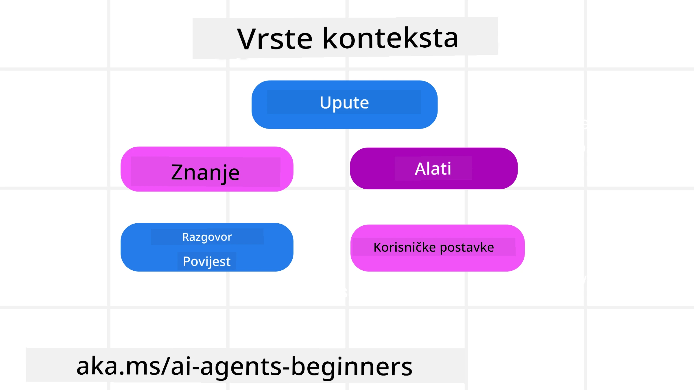
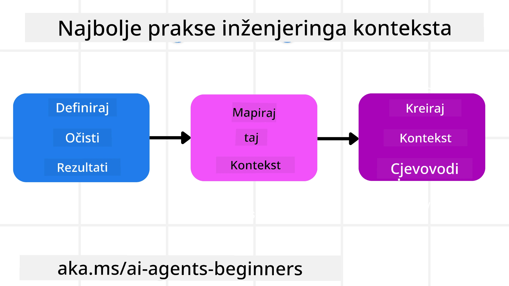

# Inženjering konteksta za AI agente

> _(Kliknite na sliku gore za pregled video lekcije)_

Razumijevanje složenosti aplikacije za koju gradite AI agenta važno je za izradu pouzdanog agenta. Trebamo graditi AI agente koji učinkovito upravljaju informacijama kako bi odgovorili na složene potrebe koje nadilaze prompt inženjering.

U ovoj lekciji ćemo pogledati što je inženjering konteksta i njegovu ulogu u izgradnji AI agenata.

## Uvod

Ova lekcija će obuhvatiti:

• **Što je inženjering konteksta** i zašto se razlikuje od prompt inženjeringa.

• **Strategije za učinkovit inženjering konteksta**, uključujući kako pisati, odabrati, komprimirati i izolirati informacije.

• **Uobičajeni neuspjesi konteksta** koji mogu pokvariti vašeg AI agenta i kako ih popraviti.

## Ciljevi učenja

Nakon dovršetka ove lekcije, razumjet ćete kako:

• **Definirati inženjering konteksta** i razlikovati ga od prompt inženjeringa.

• **Prepoznati ključne komponente konteksta** u aplikacijama velikih jezičnih modela (LLM).

• **Primijeniti strategije za pisanje, odabir, komprimiranje i izolaciju konteksta** za poboljšanje izvedbe agenta.

• **Prepoznati uobičajene neuspjehe konteksta** kao što su trovanje, ometanje, zbunjenost i sukob, te provoditi tehnike ublažavanja.

## Što je inženjering konteksta?

Za AI agente, kontekst je ono što pokreće planiranje AI agenta da poduzme određene radnje. Inženjering konteksta je praksa osiguravanja da AI agent ima prave informacije za dovršetak sljedećeg koraka zadatka. Prozor konteksta je ograničen veličinom, pa kao tvorci agenata trebamo izgraditi sustave i procese za upravljanje dodavanjem, uklanjanjem i kondenziranjem informacija u prozoru konteksta.

### Prompt inženjering vs Inženjering konteksta

Prompt inženjering fokusira se na jedan skup statičkih uputa za učinkovito vođenje AI agenata skupom pravila. Inženjering konteksta odnosi se na upravljanje dinamičkim skupom informacija, uključujući početni prompt, kako bi se osiguralo da AI agent ima ono što mu je potrebno tijekom vremena. Glavna ideja oko inženjeringa konteksta je učiniti ovaj proces ponovljivim i pouzdanim.

### Vrste konteksta

Važno je zapamtiti da kontekst nije samo jedna stvar. Informacije koje AI agent treba mogu doći iz različitih izvora i na nama je da osiguramo agentu pristup tim izvorima:

Vrste konteksta koje bi AI agent mogao trebati upravljati uključuju:

• **Upute:** Ovo su poput "pravila" agenta – prompti, sistemske poruke, few-shot primjeri (pokazujući AI kako nešto učiniti) i opisi alata koje može koristiti. Ovo je mjesto gdje se fokus prompt inženjeringa spaja s inženjeringom konteksta.

• **Znanje:** Obuhvaća činjenice, informacije dohvaćene iz baza podataka ili dugoročne memorije koju je agent prikupio. To uključuje integraciju sustava Retrieval Augmented Generation (RAG) ako agent treba pristup različitim skladištima znanja i bazama podataka.

• **Alati:** Definicije vanjskih funkcija, API-ja i MCP poslužitelja koje agent može pozivati, zajedno s povratnim informacijama (rezultatima) koje dobiva iz njihove uporabe.

• **Povijest razgovora:** Trenutni dijalog s korisnikom. Kako vrijeme prolazi, ti razgovori postaju dulji i složeniji, što zauzima prostor u prozoru konteksta.

• **Korisničke postavke:** Informacije o korisnikovim željama ili odbojnostima naučene kroz vrijeme. One se mogu pohraniti i pozivati prilikom donošenja ključnih odluka kako bi se pomoglo korisniku.

## Strategije za učinkovit inženjering konteksta

### Strategije planiranja

Dobar inženjering konteksta počinje dobrim planiranjem. Evo pristupa koji će vam pomoći započeti razmišljati o primjeni koncepta inženjeringa konteksta:

1. **Definirajte jasne rezultate** - Rezultati zadataka koji će biti dodijeljeni AI agentima trebaju biti jasno definirani. Odgovorite na pitanje – "Kako će svijet izgledati kada AI agent završi svoj zadatak?" Drugim riječima, koja promjena, informacija ili odgovor bi korisnik trebao imati nakon interakcije s AI agentom.
2. **Mapirajte kontekst** - Kad definirate rezultate AI agenta, morate odgovoriti na pitanje "Koje informacije AI agent treba da dovrši ovaj zadatak?". Na taj način možete početi mapirati gdje se mogu pronaći te informacije.
3. **Kreirajte kontekstualne tokove** - Sad kad znate gdje su informacije, trebate odgovoriti na pitanje "Kako će agent dobiti te informacije?". Ovo se može napraviti na različite načine uključujući RAG, korištenje MCP poslužitelja i drugih alata.

### Praktične strategije

Planiranje je važno, ali čim informacije počnu pristizati u prozor konteksta našeg agenta, trebamo imati praktične strategije za njihovo upravljanje:

#### Upravljanje kontekstom

Dok će se neke informacije automatski dodavati u prozor konteksta, inženjering konteksta znači preuzeti aktivniju ulogu s tim informacijama što se može napraviti kroz nekoliko strategija:

 1. **Agentova bilježnica (Scratchpad)**
 Ovo omogućuje AI agentu da bilježi relevantne informacije o trenutačnim zadacima i interakcijama s korisnikom tijekom jedne sesije. Trebala bi postojati izvan prozora konteksta u datoteci ili objektu runtime-a koji agent može naknadno dohvatiti tijekom sesije ako je potrebno.

 2. **Memorije**
 Bilježnice su dobre za upravljanje informacijama izvan konteksta jedne sesije. Memorije omogućuju agentima da pohrane i dohvaćaju relevantne informacije kroz više sesija. To može uključivati sažetke, korisničke preferencije i povratne informacije za buduća poboljšanja.

 3. **Kompresija konteksta**
  Kad prozor konteksta raste i približava se svom limitu, koriste se tehnike poput sažimanja i rezanja. Ovo uključuje ili zadržavanje samo najvažnijih informacija ili uklanjanje starijih poruka.
  
 4. **Sistemi s više agenata**
  Izgradnja sustava s više agenata je oblik inženjeringa konteksta jer svaki agent ima vlastiti prozor konteksta. Kako se taj kontekst dijeli i prosljeđuje različitim agentima je još jedna stvar koju treba isplanirati pri izgradnji tih sustava.
  
 5. **Sandbox okruženja**
  Ako agent treba pokrenuti neki kod ili obraditi velike količine informacija u dokumentu, to može zahtijevati velik broj tokena za procesiranje rezultata. Umjesto da se sve to pohranjuje u prozoru konteksta, agent može koristiti sandbox okruženje koje može pokrenuti taj kod i samo pročitati rezultate i ostale relevantne informacije.
  
 6. **Objekti stanja u runtime-u**
   Ovo se radi kreiranjem spremnika informacija za upravljanje situacijama kada agent treba imati pristup određenim informacijama. Za složen zadatak to bi omogućilo agentu da pohrani rezultate svakog podzadatka korak po korak, dopuštajući da kontekst ostane povezan samo s tim specifičnim podzadatkom.

#### Pregled konteksta

Nakon što primijenite neku od ovih strategija, vrijedno je provjeriti što je sljedeći poziv modela zapravo primio. Korisno pitanje za otklanjanje pogrešaka je:

> Je li agent učitao previše konteksta, krivi kontekst ili mu je nedostajao kontekst koji je trebao?

Ne morate bilježiti sirove prompty, izlaze alata ili sadržaj memorije da biste odgovorili na to pitanje. U produkciji je bolje koristiti male zapise pregleda konteksta koji hvataju brojeve, id-eve, hasheve i oznake pravila:

- **Odabir:** Pratite koliko je kandidata za fragmente, alata ili memorija razmotreno, koliko je odabrano i koji je pravilo ili rezultat uzrokovao filtriranje ostalih.
- **Kompresija:** Zabilježite izvorni raspon ili id traga, id sažetka, procijenjeni broj tokena prije i poslije kompresije, i je li sirovi sadržaj isključen iz sljedećeg poziva.
- **Izolacija:** Zabilježite koji je podzadatak pokrenut u zasebnom agentu, sesiji ili sandboxu, koji je sažetak vraćen, i je li veliki izlaz alata ostao izvan konteksta roditeljskog agenta.
- **Memorija i RAG:** Pohranite id-eve dokumenata za dohvat, id-eve memorija, rezultate, odabrane id-eve i status redakcije umjesto punog dohvaćenog teksta.
- **Sigurnost i privatnost:** Preporučuju se hashevi, id-evi, token torbe i oznake pravila umjesto osjetljivog promt teksta, argumenata alata, rezultata alata ili tijela korisničke memorije.

Cilj nije zadržati više konteksta. Cilj je ostaviti dovoljno dokaza da programer može reći koja je strategija konteksta korištena i je li promijenila sljedeći poziv modela na namjeravan način.

### Primjer inženjeringa konteksta

Recimo da želimo da AI agent **"Rezervira mi putovanje u Pariz."**

• Jednostavan agent koji koristi samo prompt inženjering mogao bi samo odgovoriti: **"U redu, kada želite ići u Pariz?"** Obradio je samo vaše izravno pitanje u trenutku kad je korisnik pitao.

• Agent koji koristi strategije inženjeringa konteksta pokrivene u ovom prikazu učinio bi mnogo više. Prije nego odgovori, njegov sustav bi mogao:

  ◦ **Provjeriti vaš kalendar** za dostupne datume (dohvaćanje podataka u stvarnom vremenu).

 ◦ **Prikupiti prethodne putničke preferencije** (iz dugoročne memorije) poput omiljene zrakoplovne kompanije, budžeta ili preferencije direktnih letova.

 ◦ **Identificirati dostupne alate** za rezervaciju leta i hotela.

- Zatim bi primjer odgovora mogao biti: "Hej [Vaše ime]! Vidim da ste slobodni prvi tjedan u listopadu. Da li da tražim direktne letove za Pariz na [Omiljena zrakoplovna kompanija] unutar vašeg uobičajenog budžeta od [Budžet]?" Ovaj bogatiji, kontekstualno osviješten odgovor demonstrira moć inženjeringa konteksta.

## Uobičajeni neuspjesi konteksta

### Trovanje konteksta

**Što je:** Kad halucinacija (lažna informacija koju generira LLM) ili pogreška uđe u kontekst i stalno se referencira, uzrokujući da agent slijedi nemoguće ciljeve ili razvija besmislene strategije.

**Što učiniti:** Implementirajte **provjeru valjanosti konteksta** i **karantenu**. Provjerite informacije prije nego se dodaju u dugoročnu memoriju. Ako se otkrije potencijalno trovanje, započnite nove niti konteksta kako biste spriječili širenje loših informacija.

**Primjer rezervacije putovanja:** Vaš agent hallucinira **direktni let iz malog lokalnog aerodroma do udaljenog međunarodnog grada** koji zapravo ne nudi međunarodne letove. Taj nepostojeći detalj leta se sprema u kontekst. Kasnije, kad tražite da agent rezervira, on stalno pokušava pronaći karte za ovu nemoguću rutu, što rezultira ponavljajućim pogreškama.

**Rješenje:** Implementirajte korak koji **provjerava postojanje leta i rute putem API-ja u stvarnom vremenu** _prije_ nego što se dodaju detalji leta u radni kontekst agenta. Ako provjera ne prođe, pogrešna informacija stavlja se u "karantenu" i dalje se ne koristi.

### Ometanje konteksta

**Što je:** Kad kontekst postane toliko velik da se model previše fokusira na akumuliranu povijest umjesto na ono što je naučio tijekom treniranja, što dovodi do ponavljajućih ili neupotrebljivih radnji. Modeli mogu početi griješiti čak i prije nego što je prozor konteksta pun.

**Što učiniti:** Koristite **sažimanje konteksta**. Povremeno komprimirajte akumulirane informacije u kraće sažetke, zadržavajući važne detalje dok uklanjate redundantnu povijest. Ovo pomaže "resetirati" fokus.

**Primjer rezervacije putovanja:** Dugo ste razgovarali o raznim omiljenim destinacijama za putovanja, uključujući detaljan opis vašeg putovanja s ruksakom prije dvije godine. Kad konačno zatražite **"pronađi mi jeftin let za sljedeći mjesec"**, agent se zapetlja u stare, irelevantne detalje i stalno vas ispituje o vašoj opremi za ruksak ili prethodnim itinerarima, zanemarujući vaš trenutačni zahtjev.

**Rješenje:** Nakon određenog broja okretaja ili kad kontekst postane prevelik, agent bi trebao **sažeti najnovije i relevantne dijelove razgovora** – fokusirajući se na vaše trenutačne datume putovanja i destinaciju – i koristiti taj sažetak za sljedeći LLM poziv, odbacujući manje relevantni povijesni razgovor.

### Zbunjenost konteksta

**Što je:** Kad nepotreban kontekst, često u obliku previše dostupnih alata, uzrokuje da model generira loše odgovore ili poziva nerelevantne alate. Manji modeli su naročito skloni tome.

**Što učiniti:** Implementirajte **upravljanje opterećenjem alata** koristeći RAG tehnike. Pohranite opise alata u vektorsku bazu podataka i odaberite _samo_ najrelevantnije alate za svaki specifični zadatak. Istraživanja pokazuju da je dobro ograničiti odabir alata na manje od 30.

**Primjer rezervacije putovanja:** Vaš agent ima pristup desecima alata: `book_flight`, `book_hotel`, `rent_car`, `find_tours`, `currency_converter`, `weather_forecast`, `restaurant_reservations` itd. Pitate, **"Koji je najbolji način da se krećem po Parizu?"** Zbog velike količine alata, agent se zbunjuje i pokušava pozvati `book_flight` _unutar_ Pariza, ili `rent_car` iako preferirate javni prijevoz, jer se opisi alata mogu preklapati ili agent jednostavno ne može razlikovati najbolji alat.

**Rješenje:** Koristite **RAG nad opisima alata**. Kad pitate o kretanju po Parizu, sustav dinamički dohvaća _samo_ najrelevantnije alate poput `rent_car` ili `public_transport_info` na temelju vašeg upita, predstavljajući fokusirani "set" alata LLM-u.

### Sukob konteksta

**Što je:** Kad postoje kontradiktorne informacije unutar konteksta, što dovodi do nekonzistentnog rezoniranja ili loših konačnih odgovora. Ovo se često događa kada informacije dolaze u fazama, a rane, netočne pretpostavke ostaju u kontekstu.

**Što učiniti:** Koristite **pruning konteksta** i **offloading**. Pruning znači uklanjanje zastarjelih ili kontradiktornih informacija kako pristižu novi detalji. Offloading daje modelu zasebni radni prostor (scratchpad) za obradu informacija bez zagušenja glavnog konteksta.
**Primjer rezervacije putovanja:** Isprva svom agentu kažete, **"Želim letjeti u ekonomskom razredu."** Kasnije u razgovoru promijenite mišljenje i kažete, **"Zapravo, za ovo putovanje idemo u poslovnom razredu."** Ako obje upute ostanu u kontekstu, agent može dobiti kontradiktorne rezultate pretraživanja ili se može zbuniti koju preferenciju treba prioritetno uzeti u obzir.

**Rješenje:** Provedite **sječu konteksta**. Kada nova uputa proturječi staroj, starija uputa se uklanja ili eksplicitno nadjačava u kontekstu. Alternativno, agent može koristiti **radni blok** za usklađivanje proturječnih preferencija prije donošenja odluke, osiguravajući da samo konačna, dosljedna uputa usmjerava njegove radnje.

## Imate li još pitanja o inženjerstvu konteksta?

Pridružite se [Microsoft Foundry Discord](https://discord.com/invite/ATgtXmAS5D) kako biste se upoznali s drugim učenicima, sudjelovali na radnim satima i dobili odgovore na pitanja o AI agentima.

---

<!-- CO-OP TRANSLATOR DISCLAIMER START -->
**Napomena**:
Ovaj dokument je preveden korištenjem AI prevoditeljskog servisa [Co-op Translator](https://github.com/Azure/co-op-translator). Iako težimo točnosti, imajte na umu da automatski prijevodi mogu sadržavati greške ili netočnosti. Izvorni dokument na izvornom jeziku treba smatrati autoritativnim izvorom. Za važne informacije preporuča se profesionalni ljudski prijevod. Nismo odgovorni za bilo kakva nesporazumevanja ili pogrešne interpretacije koje proizlaze iz korištenja ovog prijevoda.
<!-- CO-OP TRANSLATOR DISCLAIMER END -->