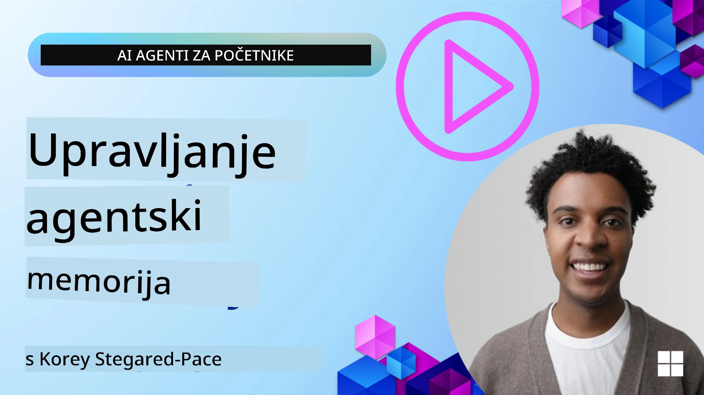

# Memorija za AI agente 

Kada se raspravlja o jedinstvenim prednostima kreiranja AI agenata, uglavnom se govori o dvije stvari: mogućnosti pozivanja alata za izvršavanje zadataka i sposobnosti poboljšavanja tijekom vremena. Memorija je temelj za stvaranje agenata koji se sami unapređuju i mogu pružiti bolje iskustvo našim korisnicima.

U ovoj lekciji pogledat ćemo što je memorija za AI agente i kako je možemo upravljati i koristiti za dobrobit naših aplikacija.

## Uvod

Ova lekcija će obuhvatiti:

• **Razumijevanje memorije AI agenata**: Što je memorija i zašto je bitna za agente.

• **Implementacija i pohrana memorije**: Praktične metode dodavanja memorijskih sposobnosti vašim AI agentima, s fokusom na kratkoročnu i dugoročnu memoriju.

• **Kako učiniti AI agente samopoboljšavajućima**: Kako memorija omogućuje agentima da uče iz prošlih interakcija i unapređuju se tijekom vremena.

## Dostupne implementacije

Ova lekcija uključuje dva opsežna vodiča u bilježnicama:

• **[13-agent-memory.ipynb](./13-agent-memory.ipynb)**: Implementira memoriju koristeći Mem0 i Azure AI Search s Microsoft Agent Frameworkom

• **[13-agent-memory-cognee.ipynb](./13-agent-memory-cognee.ipynb)**: Implementira strukturiranu memoriju koristeći Cognee, automatski gradi graf znanja podržan ugradnjama, vizualizira graf i inteligentno pronalazi informacije

## Ciljevi učenja

Nakon završetka ove lekcije znat ćete kako:

• **Razlikovati različite vrste memorije AI agenata**, uključujući radnu, kratkoročnu i dugoročnu memoriju, kao i specijalizirane oblike poput memorije persone i epizodne memorije.

• **Implementirati i upravljati kratkoročnom i dugoročnom memorijom za AI agente** koristeći Microsoft Agent Framework, koristeći alate poput Mem0, Cognee, memoriju na bijeloj ploči i integraciju s Azure AI Searchom.

• **Razumjeti principe samopoboljšavajućih AI agenata** i kako robusni sustavi za upravljanje memorijom doprinose kontinuiranom učenju i prilagodbi.

## Razumijevanje memorije AI agenata

U svojoj srži, **memorija za AI agente odnosi se na mehanizme koji im omogućuju zadržavanje i prizivanje informacija**. Ove informacije mogu biti specifični detalji o razgovoru, korisničke preferencije, prošle radnje ili čak naučeni obrasci.

Bez memorije, AI aplikacije često nemaju stanje, što znači da svaka interakcija počinje ispočetka. To dovodi do ponavljajućeg i frustrirajućeg korisničkog iskustva gdje agent "zaboravlja" prethodni kontekst ili preferencije.

### Zašto je memorija važna?

inteligencija agenta duboko je povezana s njegovom sposobnošću prizivanja i korištenja prethodnih informacija. Memorija omogućuje agentima da budu:

• **Refleksivni**: Učiti iz prošlih radnji i ishoda.

• **Interaktivni**: Održavati kontekst tijekom tekućeg razgovora.

• **Proaktivni i reaktivni**: Predviđati potrebe ili odgovarati prikladno na temelju povijesnih podataka.

• **Autonomni**: Djelovati neovisnije koristeći pohranjeno znanje.

Cilj implementacije memorije je učiniti agente **pouzdanijima i sposobnijima**.

### Vrste memorije

#### Radna memorija

Zamislite to kao komad papira za skiciranje kojeg agent koristi tijekom jedne, tekuće zadaće ili misaonog procesa. Drži neposredne informacije potrebne za izračun sljedećeg koraka.

Za AI agente, radna memorija često hvata najrelevantnije informacije iz razgovora, čak i ako je cijela povijest chata duga ili skraćena. Fokusira se na izvlačenje ključnih elemenata poput zahtjeva, prijedloga, odluka i akcija.

**Primjer radne memorije**

U agentu za rezervaciju putovanja, radna memorija može bilježiti trenutačni zahtjev korisnika, poput "Želim rezervirati putovanje u Pariz". Taj specifični zahtjev drži se u neposrednom kontekstu agenta kako bi usmjerio trenutnu interakciju.

#### Kratkoročna memorija

Ova vrsta memorije zadržava informacije tijekom trajanja jedne konverzacije ili sesije. To je kontekst tekućeg razgovora koji omogućuje agentu da se pozove na prethodne dijelove dijaloga.

**Primjer kratkoročne memorije**

Ako korisnik pita: "Koliko bi let za Pariz koštao?" a zatim nastavi s "A što je s smještajem tamo?", kratkoročna memorija osigurava da agent zna da se "tamo" odnosi na "Pariz" unutar istog razgovora.

#### Dugoročna memorija

To su informacije koje traju kroz više razgovora ili sesija. Omogućuje agentima da pamte korisničke preferencije, povijesne interakcije ili općenito znanje tijekom dužih vremenskih razdoblja. Ovo je važno za personalizaciju.

**Primjer dugoročne memorije**

Dugoročna memorija može pohraniti da "Ben voli skijanje i aktivnosti na otvorenom, voli kavu s pogledom na planinu i želi izbjeći napredne skijaške staze zbog prijašnje ozljede". Ove informacije, naučene iz prošlih interakcija, utječu na preporuke u budućim planiranjima putovanja, čineći ih vrlo personaliziranim.

#### Memorija persone

Ova specijalizirana vrsta memorije pomaže agentu u razvijanju dosljedne "osobnosti" ili "presone". Omogućuje agentu da pamti detalje o sebi ili svojoj namijenjenoj ulozi, čineći interakcije fluidnijima i fokusiranijima.

**Primjer memorije persone**

Ako je agent za putovanja dizajniran da bude "stručnjak za planiranje skijanja", memorija persone može ojačati tu ulogu, utječući na njegove odgovore da budu u skladu s tonom i znanjem stručnjaka.

#### Radni tok / epizodna memorija

Ova memorija pohranjuje niz koraka koje agent poduzima tijekom složenog zadatka, uključujući uspjehe i neuspjehe. Kao da pamti specifične "epizode" ili prošla iskustva da bi iz njih učio.

**Primjer epizodne memorije**

Ako je agent pokušao rezervirati određeni let, ali nije uspio zbog nedostupnosti, epizodna memorija može zabilježiti taj neuspjeh, omogućujući agentu da pokuša alternativne letove ili obavijesti korisnika o problemu na informiraniji način prilikom sljedećeg pokušaja.

#### Memorija entiteta

Ovo uključuje izdvajanje i pamćenje specifičnih entiteta (kao što su osobe, mjesta ili stvari) i događaja iz razgovora. Omogućuje agentu da gradi strukturirano razumijevanje ključnih elemenata o kojima se raspravlja.

**Primjer memorije entiteta**

Iz razgovora o prošlom putovanju, agent može izdvojiti "Pariz", "Eiffelov toranj" i "večera u restoranu Le Chat Noir" kao entitete. U budućoj interakciji agent može prisjetiti se "Le Chat Noir" i ponuditi novu rezervaciju tamo.

#### Strukturirani RAG (Retrieval Augmented Generation)

Dok je RAG općenitija tehnika, "Strukturirani RAG" ističe se kao moćna memorijska tehnologija. Izvlači guste, strukturirane informacije iz raznih izvora (razgovora, e-pošte, slika) i koristi ih za poboljšanje preciznosti, prizivanja i brzine u odgovorima. Za razliku od klasičnog RAG-a koji se oslanja samo na semantičku sličnost, Strukturirani RAG radi s inherentnom strukturom informacija.

**Primjer strukturiranog RAG-a**

Umjesto da samo podudara ključne riječi, Strukturirani RAG može parsirati detalje leta (destinacija, datum, vrijeme, prijevoznik) iz e-maila i pohraniti ih na strukturirani način. Time se omogućavaju precizni upiti poput "Koji sam let rezervirao za Pariz u utorak?"

## Implementacija i pohrana memorije

Implementacija memorije za AI agente uključuje sustavan proces **upravljanja memorijom**, koji uključuje generiranje, pohranu, dohvat, integraciju, ažuriranje, pa čak i "zaboravljanje" (ili brisanje) informacija. Dohvat je posebno važan aspekt.

### Specijalizirani alati za memoriju

#### Mem0

Jedan od načina za pohranu i upravljanje memorijom agenata je korištenje specijaliziranih alata poput Mem0. Mem0 funkcionira kao trajni sloj memorije, omogućujući agentima prizivanje relevantnih interakcija, pohranu korisničkih preferencija i činjenica kao i učenje iz uspjeha i neuspjeha tijekom vremena. Ideja je da stateless agenti postanu stateful.

Radi kroz **dvodjelni memorijski proces: ekstrakciju i ažuriranje**. Prvo se poruke dodane u niti agenta šalju Mem0 servisu, koji koristi veliki jezični model (LLM) da sažme povijest razgovora i izvadi nove memorije. Nakon toga, faza ažuriranja, vođena LLM-om, određuje treba li te memorije dodati, izmijeniti ili izbrisati, pohranjujući ih u hibridnu bazu podataka koja može uključivati vektor, graf i ključ-vrijednost baze. Sustav podržava različite vrste memorije i može uključiti i graf memorije za upravljanje odnosima između entiteta.

#### Cognee

Drugi moćan pristup je korištenje **Cognee**, open-source semantičke memorije za AI agente koja pretvara strukturirane i nestrukturirane podatke u upitne grafove znanja podržane ugradnjama. Cognee pruža **dvostruku arhitekturu pohrane** koja kombinira pretraživanje po vektorskoj sličnosti s grafičkim odnosima, omogućujući agentima razumijevanje ne samo što je slično, već i kako su koncepti međusobno povezani.

Izvrsno funkcionira u **hibridnom dohvaćanju** koje spaja vektorsku sličnost, grafičku strukturu i LLM zaključivanje – od jednostavnog traženja fragmenata do odgovaranja s osjetilnošću prema grafu. Sustav održava **živu memoriju** koja evoluira i raste, ali ostaje upitna kao jedan povezani graf, podržavajući kako kratkoročni kontekst sesije tako i dugoročnu trajnu memoriju.

Vodič u Cognee bilježnici ([13-agent-memory-cognee.ipynb](./13-agent-memory-cognee.ipynb)) demonstrira izgradnju ovog jedinstvenog sloja memorije, s praktičnim primjerima unosa raznovrsnih izvora podataka, vizualizacije grafa znanja i upita različitim strategijama pretraživanja prilagođenim potrebama specifičnih agenata.

### Pohrana memorije s RAG-om

Osim specijaliziranih memorijskih alata poput Mem0, možete koristiti robusne servise za pretraživanje poput **Azure AI Search kao pozadinu za pohranu i dohvat memorije**, naročito za strukturirani RAG.

To vam omogućuje da utemeljite odgovore agenta na vlastitim podacima, osiguravajući relevantnije i točnije odgovore. Azure AI Search može se koristiti za pohranu korisničkih memorija o putovanjima, kataloge proizvoda ili bilo koje drugo domenatsko znanje.

Azure AI Search podržava mogućnosti poput **strukturiranog RAG-a**, koji izvrsno izvlači i dohvaća guste, strukturirane informacije iz velikih skupova podataka kao što su povijesti razgovora, e-pošta ili čak slike. To pruža "natčovječansku preciznost i prizivanje" u usporedbi s tradicionalnim pristupima koji koriste tekstualno dijeljenje i ugradnje.

## Kako učiniti AI agente samopoboljšavajućima

Uobičajeni obrazac za samopoboljšavajuće agente uključuje uvođenje **"agenta znanja"**. Ovaj zasebni agent promatra glavni razgovor između korisnika i primarnog agenta. Njegova uloga je:

1. **Identificirati vrijedne informacije**: Utvrditi je li neki dio razgovora vrijedan pohranjivanja kao opće znanje ili specifična korisnička preferencija.

2. **Izvući i sažeti**: Izlučiti bitnu lekciju ili preferenciju iz razgovora.

3. **Pohraniti u bazu znanja**: Trajno spremiti tu izdvojenu informaciju, često u vektorsku bazu podataka, kako bi kasnije mogla biti dohvaćena.

4. **Proširiti buduće upite**: Kada korisnik inicira novi upit, agent znanja dohvaća relevantne pohranjene informacije i dodaje ih u korisnički prompt, pružajući ključni kontekst primarnom agentu (slično RAG-u).

### Optimizacije za memoriju

• **Upravljanje latencijom**: Kako se ne bi usporile korisničke interakcije, može se koristiti jeftiniji i brži model za početnu provjeru je li informacija vrijedna za pohranu ili dohvat, a složeniji postupak ekstrakcije/dohvata pokreće se samo ako je potrebno.

• **Održavanje baze znanja**: Za rastuću bazu znanja, informacije koje se rjeđe koriste mogu se premjestiti u "hladnu pohranu" radi smanjenja troškova.

## Imate li dodatna pitanja o memoriji agenata?

Pridružite se [Microsoft Foundry Discord](https://aka.ms/ai-agents/discord) zajednici kako biste se povezali s drugim učenicima, sudjelovali u konzultacijama i dobili odgovore na pitanja o AI agentima.

---

<!-- CO-OP TRANSLATOR DISCLAIMER START -->
**Odricanje od odgovornosti**:
Ovaj dokument preveden je korištenjem AI prevoditeljskog servisa [Co-op Translator](https://github.com/Azure/co-op-translator). Iako težimo točnosti, imajte na umu da automatski prijevodi mogu sadržavati pogreške ili netočnosti. Izvorni dokument na njegovom izvornom jeziku treba smatrati autoritativnim izvorom. Za kritične informacije preporučuje se profesionalni ljudski prijevod. Ne odgovaramo za bilo kakve nesporazume ili pogrešne interpretacije koje proizlaze iz korištenja ovog prijevoda.
<!-- CO-OP TRANSLATOR DISCLAIMER END -->