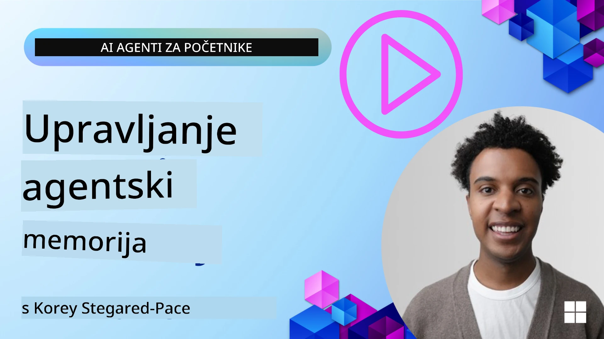

# Memorija za AI agente 

Kada se raspravlja o jedinstvenim prednostima stvaranja AI agenata, uglavnom se razgovara o dvije stvari: sposobnosti pozivanja alata za izvršavanje zadataka i sposobnosti poboljšanja tijekom vremena. Memorija je temelj za stvaranje samopoboljšavajućeg agenta koji može stvoriti bolje iskustvo za naše korisnike.

U ovoj lekciji ćemo pogledati što je memorija za AI agente i kako je možemo upravljati i koristiti za dobrobit naših aplikacija.

## Uvod

Ova lekcija će obuhvatiti:

• **Razumijevanje memorije AI agenta**: Što je memorija i zašto je važna za agente.

• **Implementacija i pohrana memorije**: Praktične metode za dodavanje memorijskih sposobnosti vašim AI agentima, s fokusom na kratkoročnu i dugoročnu memoriju.

• **Čineći AI agente samopoboljšavajućim**: Kako memorija omogućuje agentima da uče iz prošlih interakcija i poboljšavaju se tijekom vremena.

## Dostupne implementacije

Ova lekcija uključuje dva iscrpna tutorijala u obliku bilježnice:

• **[13-agent-memory.ipynb](./13-agent-memory.ipynb)**: Implementira memoriju koristeći Mem0 i Azure AI Search s Microsoft Agent Frameworkom

• **[13-agent-memory-cognee.ipynb](./13-agent-memory-cognee.ipynb)**: Implementira strukturiranu memoriju koristeći Cognee, automatski gradi graf znanja podržan ugrađivanjima, vizualizira graf i inteligentno dohvaćanje

## Ciljevi učenja

Nakon što završite ovu lekciju, znat ćete kako:

• **Razlikovati različite vrste memorije AI agenta**, uključujući radnu, kratkoročnu i dugoročnu memoriju, kao i specijalizirane oblike poput persona i epizodne memorije.

• **Implementirati i upravljati kratkoročnom i dugoročnom memorijom za AI agente** koristeći Microsoft Agent Framework, koristeći alate poput Mem0, Cognee, Whiteboard memoriju i integraciju s Azure AI Search.

• **Razumjeti principe iza samopoboljšavajućih AI agenata** i kako robusni sustavi upravljanja memorijom pridonose kontinuiranom učenju i prilagodbi.

## Razumijevanje memorije AI agenta

U svojoj srži, **memorija za AI agente odnosi se na mehanizme koji im omogućuju da zadrže i prizovu informacije**. Te informacije mogu biti specifični detalji o razgovoru, preferencije korisnika, prošli postupci ili čak naučeni obrasci.

Bez memorije, AI aplikacije često su bezstanje (stateless), što znači da svaka interakcija započinje od nule. To dovodi do ponavljajućeg i frustrirajućeg korisničkog iskustva gdje agent "zaboravlja" prethodni kontekst ili preferencije.

### Zašto je memorija važna?

Pamet agenta duboko je povezana s njegovom sposobnošću prizivanja i korištenja prošlih informacija. Memorija omogućuje agentima da budu:

• **Reflektivni**: Učenje iz prošlih postupaka i ishoda.

• **Interaktivni**: Održavanje konteksta tijekom tekućeg razgovora.

• **Proaktivni i reaktivni**: Predviđanje potreba ili prikladan odgovor na temelju povijesnih podataka.

• **Autonomni**: Djelovanje samostalnije koristeći pohranjeno znanje.

Cilj implementacije memorije je učiniti agente **pouzdanijima i sposobnijima**.

### Vrste memorije

#### Radna memorija

Zamislite je kao komad bilježnice koji agent koristi tijekom jedne tekuće zadaće ili misaonog procesa. Drži neposredne informacije potrebne za izračunavanje sljedećeg koraka.

Za AI agente, radna memorija često hvata najrelevantnije informacije iz razgovora, čak i ako je povijest chata duga ili skraćena. Fokusira se na izvlačenje ključnih elemenata kao što su zahtjevi, prijedlozi, odluke i akcije.

**Primjer radne memorije**

U agentu za rezervaciju putovanja, radna memorija može zabilježiti trenutni zahtjev korisnika, kao što je "Želim rezervirati putovanje u Pariz". Ovaj specifični zahtjev zadržava se u neposrednom kontekstu agenta kako bi usmjerio trenutnu interakciju.

#### Kratkoročna memorija

Ova vrsta memorije zadržava informacije tijekom trajanja jednog razgovora ili sesije. To je kontekst trenutnog chata, omogućujući agentu da se pozove na prethodne dijelove dijaloga.

U [Microsoft Agent Framework](https://github.com/microsoft/agent-framework) Python SDK uzorcima, ovo odgovara `AgentSession`, kreiranom s `agent.create_session()`. Sesija je ugrađena kratkoročna memorija frameworka: čuva kontekst razgovora dok se ista sesija koristi, ali taj kontekst se ne sprema kad sesija završi ili se aplikacija ponovno pokrene. Koristite dugoročnu memoriju za činjenice i preferencije koje trebaju preživjeti kroz sesije, obično putem baze podataka, vektorskog indeksa ili drugog trajnog spremišta.

**Primjer kratkoročne memorije**

Ako korisnik pita "Koliko bi koštao let za Pariz?" a zatim nastavi s "Što je s smještajem tamo?", kratkoročna memorija osigurava da agent zna da se "tamo" odnosi na "Pariz" unutar istog razgovora.

#### Dugoročna memorija

To su informacije koje traju kroz više razgovora ili sesija. Omogućava agentima da se sjećaju korisničkih preferencija, povijesnih interakcija ili općeg znanja tijekom duljeg razdoblja. To je važno za personalizaciju.

**Primjer dugoročne memorije**

Dugoročna memorija može pohraniti da "Ben voli skijanje i aktivnosti na otvorenom, voli kavu s pogledom na planinu i želi izbjeći napredne skijaške staze zbog prošle ozljede". Te informacije, naučene iz prethodnih interakcija, utječu na preporuke u budućim sesijama planiranja putovanja, čineći ih vrlo personaliziranim.

#### Persona memorija

Ova specijalizirana vrsta memorije pomaže agentu razviti dosljednu "osobnost" ili "personu". Omogućuje agentu da se sjeća detalja o sebi ili svojoj namijenjenoj ulozi, čineći interakcije fluidnijima i fokusiranijima.

**Primjer persona memorije**
Ako je agent za putovanja dizajniran kao "stručnjak za planiranje skijanja", persona memorija može pojačati tu ulogu, utječući na njegove odgovore da budu u skladu s tonom i znanjem stručnjaka.

#### Workflow/Epizodna memorija

Ova memorija pohranjuje slijed koraka koje agent poduzima tijekom složenog zadatka, uključujući uspjehe i neuspjehe. To je poput pamćenja specifičnih "epizoda" ili prošlih iskustava kako bi iz njih učio.

**Primjer epizodne memorije**

Ako je agent pokušao rezervirati određeni let, ali nije uspio zbog nedostupnosti, epizodna memorija može zabilježiti taj neuspjeh, dopuštajući agentu da pokuša alternativne letove ili korisniku pruži bolje informiranu obavijest tijekom sljedećeg pokušaja.

#### Memorija entiteta

Ovo uključuje izvlačenje i pamćenje specifičnih entiteta (kao ljudi, mjesta ili stvari) i događaja iz razgovora. Omogućuje agentu da izgradi strukturirano razumijevanje ključnih elemenata raspravljenih tema.

**Primjer memorije entiteta**

Iz razgovora o prošlom putovanju, agent može izvući "Pariz", "Eiffeliov toranj" i "večeru u restoranu Le Chat Noir" kao entitete. U budućoj interakciji agent bi se mogao sjetiti "Le Chat Noir" i ponuditi napraviti novu rezervaciju tamo.

#### Strukturirani RAG (Retrieval Augmented Generation)

Dok je RAG šira tehnika, "Strukturirani RAG" istaknut je kao snažna memorijska tehnologija. Izvlači gustu, strukturiranu informaciju iz različitih izvora (razgovori, e-mailovi, slike) i koristi ih za poboljšanje preciznosti, prizivanja i brzine u odgovorima. Za razliku od klasičnog RAG-a koji se oslanja samo na semantičku sličnost, Strukturirani RAG radi s inherentnom strukturom informacija.

**Primjer Strukturanog RAG-a**

Umjesto samo podudaranja ključnih riječi, Strukturirani RAG može parsirati detalje leta (odredište, datum, vrijeme, zrakoplovna tvrtka) iz e-pošte i pohraniti ih na strukturiran način. To omogućava precizne upite poput "Koji let sam rezervirao za Pariz u utorak?"

## Implementacija i pohrana memorije

Implementacija memorije za AI agente uključuje sustavni proces **upravljanja memorijom**, što uključuje generiranje, pohranu, dohvaćanje, integraciju, ažuriranje, pa čak i "zaboravljanje" (ili brisanje) informacija. Dohvat je osobito važan aspekt.

### Specijalizirani alati za memoriju

#### Mem0

Jedan od načina za pohranu i upravljanje memorijom agenta je korištenje specijaliziranih alata poput Mem0. Mem0 radi kao trajni sloj memorije, omogućujući agentima da prizovu relevantne interakcije, pohrane korisničke preferencije i faktualni kontekst te uče iz uspjeha i neuspjeha tijekom vremena. Ideja je ovdje da stateless agenti postanu stateful.

Radi putem **dvofaznog memorijskog procesa: ekstrakcija i ažuriranje**. Prvo se poruke dodane u niti agenta šalju Mem0 usluzi, koja koristi veliki jezični model (LLM) za sažimanje povijesti razgovora i izvlačenje novih memorija. Nakon toga, faza ažuriranja vođena LLM-om određuje hoće li te memorije dodati, izmijeniti ili izbrisati, pohranjujući ih u hibridno spremište podataka koje može uključivati vektorsku, grafičku i bazu ključ-vrijednost. Ovaj sustav također podržava različite vrste memorija i može uključiti graf memoriju za upravljanje odnosima između entiteta.

#### Cognee

Drugi snažan pristup je korištenje **Cognee**, open-source semantičke memorije za AI agente koja pretvara strukturirane i nestrukturirane podatke u upitljive grafove znanja podržane ugradnjama (embeddings). Cognee pruža **dual-store arhitekturu** koja kombinira pretraživanje vektorske sličnosti s grafičkim odnosima, što agentima omogućuje razumjeti ne samo što je slično, nego i kako su koncepti međusobno povezani.

Izvrsna je u **hibridnom dohvaćanju** koje spaja vektorsku sličnost, strukturu grafa i LLM rezoniranje - od sirovog pretraživanja do odgovaranja na pitanja svjesnih grafa. Sustav održava **živu memoriju** koja evoluira i raste, a istovremeno ostaje upitna kao jedan povezani graf, podržavajući i kratkoročni kontekst sesije i dugoročnu trajnu memoriju.

Tutorijal u bilježnici Cognee ([13-agent-memory-cognee.ipynb](./13-agent-memory-cognee.ipynb)) demonstrira izgradnju ovog jedinstvenog sloja memorije s praktičnim primjerima ubacivanja različitih izvora podataka, vizualizacije grafa znanja i upita s različitim strategijama pretraživanja prilagođenim specifičnim potrebama agenta.

### Pohrana memorije s RAG-om

Osim specijaliziranih memorijskih alata poput Mem0, možete iskoristiti robusne pretraživačke usluge poput **Azure AI Search kao backend za pohranu i dohvat memorija**, osobito za strukturirani RAG.

To vam omogućuje da utemeljite odgovore vašeg agenta na vlastitim podacima, osiguravajući relevantnije i preciznije odgovore. Azure AI Search može se koristiti za pohranu memorija o korisničkim putovanjima, kataloge proizvoda ili bilo koje drugo domen-specifično znanje.

Azure AI Search podržava mogućnosti poput **Strukturiranog RAG-a**, koji izvrsno izvlači i dohvaća guste, strukturirane informacije iz velikih skupova podataka poput povijesti razgovora, e-mailova ili čak slika. Ovo pruža "superljudsku preciznost i dohvat" u usporedbi s tradicionalnim pristupima dijeljenju teksta i ugradnjama.

## Čineći AI agente samopoboljšavajućima

Uobičajeni obrazac za samopoboljšavajuće agente uključuje uvođenje **"agenata za znanje"**. Ovaj odvojeni agent promatra glavni razgovor između korisnika i primarnog agenta. Njegova uloga je:

1. **Identificirati vrijedne informacije**: Odrediti je li dio razgovora vrijedan spremanja kao opće znanje ili specifična korisnička preferencija.

2. **Izvlačenje i sažimanje**: Destilirati bitno učenje ili preferenciju iz razgovora.

3. **Pohrana u bazu znanja**: Trajno spremiti ove izvučene informacije, često u vektorsku bazu podataka, kako bi se mogle kasnije dohvatiti.

4. **Proširenje budućih upita**: Kada korisnik pokrene novi upit, agent za znanje dohvaća relevantne pohranjene informacije i dodaje ih u korisnički upit, pružajući ključni kontekst primarnom agentu (slično RAG-u).

### Optimizacije za memoriju

• **Upravljanje latencijom**: Kako bi se izbjeglo usporavanje korisničkih interakcija, može se početno koristiti jeftiniji, brži model za brzo provjeravanje je li informacija vrijedna za spremanje ili dohvaćanje, a složeniji proces ekstrakcije/dohvata pokreće se samo po potrebi.

• **Održavanje baze znanja**: Za rastuću bazu znanja, rjeđe korištene informacije mogu se premjestiti u "hladni spremnik" radi upravljanja troškovima.

## Imate još pitanja o memoriji agenta?

Pridružite se [Microsoft Foundry Discord](https://discord.com/invite/ATgtXmAS5D) kako biste se povezali s drugim učenicima, sudjelovali na konzultacijama i dobili odgovore na svoja pitanja o AI agentima.

---

<!-- CO-OP TRANSLATOR DISCLAIMER START -->
**Napomena**:
Ovaj dokument je preveden korištenjem AI prevoditeljskog servisa [Co-op Translator](https://github.com/Azure/co-op-translator). Iako težimo točnosti, imajte na umu da automatski prijevodi mogu sadržavati greške ili netočnosti. Izvorni dokument na izvornom jeziku treba smatrati autoritativnim izvorom. Za važne informacije preporuča se profesionalni ljudski prijevod. Nismo odgovorni za bilo kakva nesporazumevanja ili pogrešne interpretacije koje proizlaze iz korištenja ovog prijevoda.
<!-- CO-OP TRANSLATOR DISCLAIMER END -->