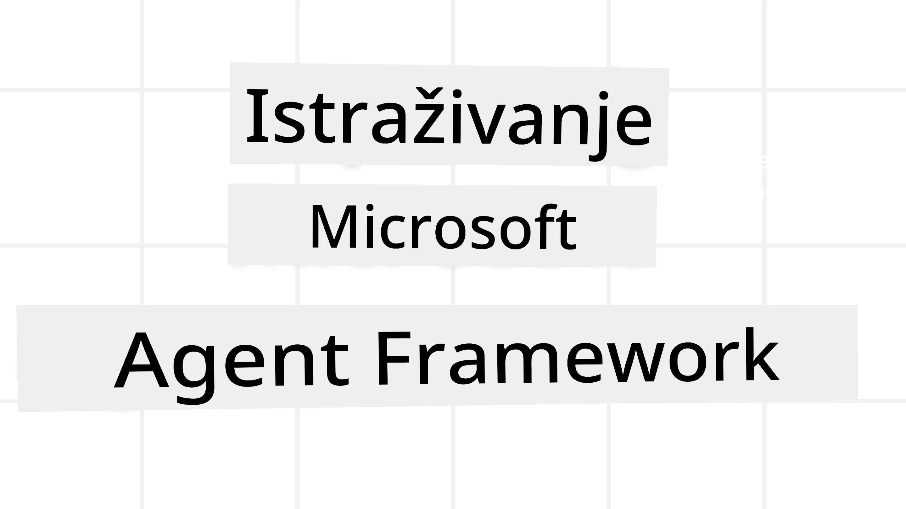
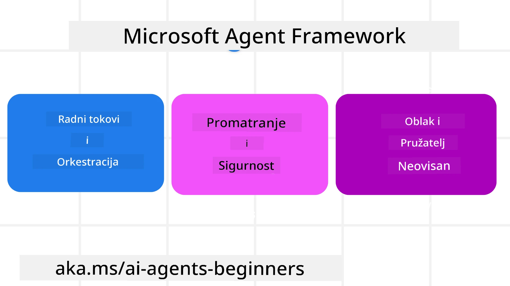
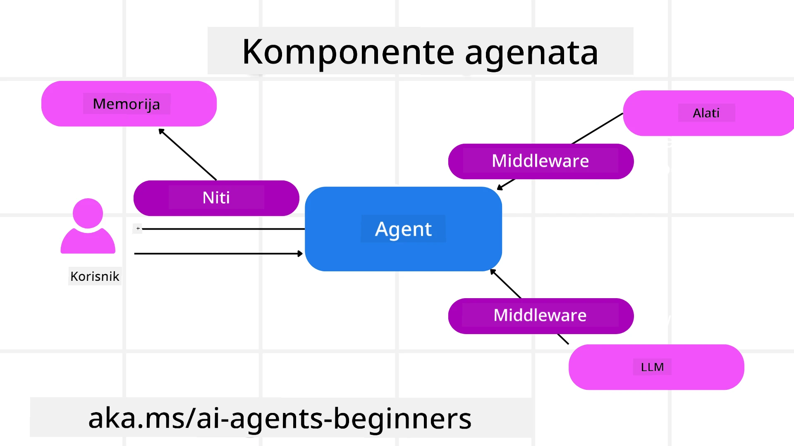

# Istraživanje Microsoft Agent Framework



### Uvod

Ova lekcija obradit će:

- Razumijevanje Microsoft Agent Framework: Ključne značajke i vrijednost  
- Istraživanje ključnih koncepata Microsoft Agent Framework
- Napredni MAF obrasci: tokovi rada, middleware i memorija

## Ciljevi učenja

Nakon završetka ove lekcije, znat ćete kako:

- Izgraditi AI agente spremne za produkciju koristeći Microsoft Agent Framework
- Primijeniti osnovne značajke Microsoft Agent Frameworka na vaše agentne slučajeve upotrebe
- Koristiti napredne obrasce uključujući tokove rada, middleware i promatljivost

## Primjeri koda 

Primjere koda za [Microsoft Agent Framework (MAF)](https://aka.ms/ai-agents-beginners/agent-framewrok) možete pronaći u ovom spremištu u datotekama `xx-python-agent-framework` i `xx-dotnet-agent-framework`.

## Razumijevanje Microsoft Agent Framework



[Microsoft Agent Framework (MAF)](https://aka.ms/ai-agents-beginners/agent-framewrok) je Microsoftov jedinstveni okvir za izgradnju AI agenata. Nudi fleksibilnost za rješavanje široke lepeze agentnih slučajeva upotrebe koji se vide u produkcijskim i istraživačkim okruženjima, uključujući:

- **Sekvencijalna orkestracija agenata** u scenarijima gdje su potrebni korak-po-korak tokovi rada.
- **Istovremena orkestracija** u scenarijima gdje agenti trebaju dovršiti zadatke istovremeno.
- **Orkestracija grupnog chata** u scenarijima gdje agenti mogu surađivati na jednom zadatku.
- **Handoff orkestracija** u scenarijima gdje agenti predaju zadatak jedni drugima kako se podzadaci dovršavaju.
- **Magnetna orkestracija** u scenarijima gdje menadžer agent stvara i mijenja popis zadataka i koordinira podagente za dovršetak zadatka.

Za isporuku AI agenata u produkciju, MAF također uključuje značajke za:

- **Promatljivost** putem korištenja OpenTelemetry gdje se svaka radnja AI agenta uključujući pozive alata, korake orkestracije, tokove rezoniranja i praćenje performansi može nadzirati kroz Microsoft Foundry nadzorne ploče.
- **Sigurnost** hostanjem agenata nativno na Microsoft Foundry koja uključuje sigurnosne kontrole poput pristupa temeljenog na ulogama, rukovanja privatnim podacima i ugrađene sigurnosti sadržaja.
- **Trajnost** jer se niti agenata i tokovi rada mogu pauzirati, nastaviti i oporaviti od pogrešaka što omogućuje duže trajanje procesa.
- **Kontrola** jer su podržani radni tokovi s uključenim ljudskim odobrenjem (human in the loop) gdje su zadaci označeni kao zahtijevajući ljudsko odobrenje.

Microsoft Agent Framework je također usmjeren na interoperabilnost kroz:

- **Neovisnost o oblaku** - Agenti mogu raditi u kontejnerima, on-prem i preko više različitih cloudova.
- **Neovisnost o pružatelju** - Agenti se mogu kreirati putem željenog SDK-a uključujući Azure OpenAI i OpenAI
- **Integriranje otvorenih standarda** - Agenti mogu koristiti protokole poput Agent-to-Agent (A2A) i Model Context Protocol (MCP) za otkrivanje i korištenje drugih agenata i alata.
- **Dodaci i konektori** - Mogu se uspostaviti veze s podacima i memorijskim servisima poput Microsoft Fabric, SharePoint, Pinecone i Qdrant.

Pogledajmo kako se ove značajke primjenjuju na neke od osnovnih koncepata Microsoft Agent Frameworka.

## Ključni koncepti Microsoft Agent Frameworka

### Agenti



**Stvaranje agenata**

Stvaranje agenta vrši se definiranjem inference servisa (LLM Provider), skupa uputa koje AI agent treba slijediti, i dodijeljenog `name`:

```python
agent = AzureOpenAIChatClient(credential=AzureCliCredential()).create_agent( instructions="You are good at recommending trips to customers based on their preferences.", name="TripRecommender" )
```

Gore se koristi `Azure OpenAI`, ali agenti se mogu stvoriti koristeći razne usluge uključujući `Microsoft Foundry Agent Service`:

```python
AzureAIAgentClient(async_credential=credential).create_agent( name="HelperAgent", instructions="You are a helpful assistant." ) as agent
```

OpenAI `Responses`, `ChatCompletion` APIs

```python
agent = OpenAIResponsesClient().create_agent( name="WeatherBot", instructions="You are a helpful weather assistant.", )
```

```python
agent = OpenAIChatClient().create_agent( name="HelpfulAssistant", instructions="You are a helpful assistant.", )
```

ili udaljeni agenti koristeći A2A protokol:

```python
agent = A2AAgent( name=agent_card.name, description=agent_card.description, agent_card=agent_card, url="https://your-a2a-agent-host" )
```

**Pokretanje agenata**

Agenti se pokreću koristeći metode `.run` ili `.run_stream` za ne-streaming ili streaming odgovore.

```python
result = await agent.run("What are good places to visit in Amsterdam?")
print(result.text)
```

```python
async for update in agent.run_stream("What are the good places to visit in Amsterdam?"):
    if update.text:
        print(update.text, end="", flush=True)

```

Svako pokretanje agenta također može imati opcije za prilagodbu parametara kao što su `max_tokens` koje agent koristi, `tools` koje agent može pozivati, pa čak i sam `model` koji agent koristi.

Ovo je korisno u slučajevima kada su za dovršetak zadatka korisnika potrebni specifični modeli ili alati.

**Alati**

Alati se mogu definirati i prilikom definiranja agenta:

```python
def get_attractions( location: Annotated[str, Field(description="The location to get the top tourist attractions for")], ) -> str: """Get the top tourist attractions for a given location.""" return f"The top attractions for {location} are." 


# Prilikom izravnog stvaranja ChatAgenta

agent = ChatAgent( chat_client=OpenAIChatClient(), instructions="You are a helpful assistant", tools=[get_attractions]

```

i također pri pokretanju agenta:

```python

result1 = await agent.run( "What's the best place to visit in Seattle?", tools=[get_attractions] # Alat je dostupan samo za ovo pokretanje )
```

**Nitovi agenata**

Nitovi agenata koriste se za upravljanje višekratnim razgovorima. Niti se mogu stvoriti na sljedeće načine:

- Korištenjem `get_new_thread()` što omogućuje da se nit sprema tijekom vremena
- Automatskim stvaranjem niti pri pokretanju agenta pri čemu nit traje samo tijekom trenutnog pokretanja.

Za stvaranje niti, kod izgleda ovako:

```python
# Stvori novu dretvu.
thread = agent.get_new_thread() # Pokreni agenta s dretvom.
response = await agent.run("Hello, I am here to help you book travel. Where would you like to go?", thread=thread)

```

Potom možete serijalizirati nit kako biste je spremili za kasniju upotrebu:

```python
# Stvori novu nit.
thread = agent.get_new_thread() 

# Pokreni agenta koristeći nit.

response = await agent.run("Hello, how are you?", thread=thread) 

# Serijaliziraj nit za pohranu.

serialized_thread = await thread.serialize() 

# Deserijaliziraj stanje niti nakon učitavanja iz pohrane.

resumed_thread = await agent.deserialize_thread(serialized_thread)
```

**Agent Middleware**

Agenti stupaju u interakciju s alatima i LLM-ovima kako bi izvršili korisničke zadatke. U određenim scenarijima želimo izvesti ili pratiti radnje između tih interakcija. Agent middleware nam to omogućuje kroz:

*Funkcijski middleware*

Ovaj middleware omogućuje izvođenje radnje između agenta i funkcije/alata koju će pozivati. Primjer upotrebe je kad želite napraviti određeno bilježenje (logging) kod poziva funkcije.

U kodu ispod `next` definira hoće li se pozvati sljedeći middleware ili stvarna funkcija.

```python
async def logging_function_middleware(
    context: FunctionInvocationContext,
    next: Callable[[FunctionInvocationContext], Awaitable[None]],
) -> None:
    """Function middleware that logs function execution."""
    # Predobrada: zapisivanje prije izvršavanja funkcije
    print(f"[Function] Calling {context.function.name}")

    # Nastavi na sljedeći middleware ili izvršavanje funkcije
    await next(context)

    # Naknadna obrada: zapisivanje nakon izvršavanja funkcije
    print(f"[Function] {context.function.name} completed")
```

*Chat middleware*

Ovaj middleware omogućuje izvršavanje ili bilježenje radnje između agenta i zahtjeva upućenih LLM-u.

Ovo sadrži važne informacije poput `messages` koje se šalju AI servisu.

```python
async def logging_chat_middleware(
    context: ChatContext,
    next: Callable[[ChatContext], Awaitable[None]],
) -> None:
    """Chat middleware that logs AI interactions."""
    # Predobrada: Zabilježi prije poziva AI
    print(f"[Chat] Sending {len(context.messages)} messages to AI")

    # Nastavi na sljedeći middleware ili AI servis
    await next(context)

    # Naknadna obrada: Zabilježi nakon odgovora AI
    print("[Chat] AI response received")

```

**Memorija agenta**

Kao što je obuhvaćeno u lekciji `Agentic Memory`, memorija je važan element koji omogućuje agentu rad u različitim kontekstima. MAF nudi nekoliko različitih vrsta memorija:

*Pohrana u memoriji*

Ovo je memorija pohranjena u nitima tijekom izvođenja aplikacije.

```python
# Stvori novu dretvu.
thread = agent.get_new_thread() # Pokreni agenta s dretvom.
response = await agent.run("Hello, I am here to help you book travel. Where would you like to go?", thread=thread)
```

*Trajne poruke*

Ova se memorija koristi pri pohrani povijesti razgovora kroz različite sesije. Definira se koristeći `chat_message_store_factory` :

```python
from agent_framework import ChatMessageStore

# Stvori prilagođeno spremište poruka
def create_message_store():
    return ChatMessageStore()

agent = ChatAgent(
    chat_client=OpenAIChatClient(),
    instructions="You are a Travel assistant.",
    chat_message_store_factory=create_message_store
)

```

*Dinamična memorija*

Ova se memorija dodaje kontekstu prije nego što se agenti pokrenu. Ove se memorije mogu pohraniti u vanjske usluge poput mem0:

```python
from agent_framework.mem0 import Mem0Provider

# Korištenje Mem0-a za napredne memorijske mogućnosti
memory_provider = Mem0Provider(
    api_key="your-mem0-api-key",
    user_id="user_123",
    application_id="my_app"
)

agent = ChatAgent(
    chat_client=OpenAIChatClient(),
    instructions="You are a helpful assistant with memory.",
    context_providers=memory_provider
)

```

**Promatljivost agenta**

Promatljivost je važna za izgradnju pouzdanih i održivih agentnih sustava. MAF se integrira s OpenTelemetryjem kako bi pružio praćenje (tracing) i mjerače (meters) za bolju promatljivost.

```python
from agent_framework.observability import get_tracer, get_meter

tracer = get_tracer()
meter = get_meter()
with tracer.start_as_current_span("my_custom_span"):
    # uradi nešto
    pass
counter = meter.create_counter("my_custom_counter")
counter.add(1, {"key": "value"})
```

### Tokovi rada

MAF nudi tokove rada koji su unaprijed definirani koraci za dovršetak zadatka i uključuju AI agente kao komponente u tim koracima.

Tokovi rada sastavljeni su od različitih komponenti koje omogućuju bolji tok kontrole. Tokovi rada također omogućuju **orkestraciju više agenata** i **checkpointing** za spremanje stanja toka rada.

Osnovne komponente toka rada su:

**Izvršitelji**

Izvršitelji primaju ulazne poruke, izvršavaju dodijeljene zadatke i potom proizvode izlaznu poruku. Time se tok rada pomiče prema dovršetku većeg zadatka. Izvršitelji mogu biti AI agenti ili prilagođena logika.

**Poveznice**

Poveznice se koriste za definiranje toka poruka u toku rada. One mogu biti:

*Direktne poveznice* - Jednostavne veze jedan-na-jedan između izvršitelja:

```python
from agent_framework import WorkflowBuilder

builder = WorkflowBuilder()
builder.add_edge(source_executor, target_executor)
builder.set_start_executor(source_executor)
workflow = builder.build()
```

*Uvjetne poveznice* - Aktiviraju se kada je zadovoljen određeni uvjet. Na primjer, kada sobe u hotelu nisu dostupne, izvršitelj može predložiti druge opcije.

*Poveznice tipa switch-case* - Usmjeravaju poruke različitim izvršiteljima na temelju definiranih uvjeta. Na primjer, ako putnik ima prioritetni pristup, njegovi će zadaci biti obrađeni putem drugog toka rada.

*Fan-out poveznice* - Šalju jednu poruku na više odredišta.

*Fan-in poveznice* - Prikupljaju više poruka od različitih izvršitelja i šalju ih jednom odredištu.

**Događaji**

Kako bi se osigurala bolja promatljivost tokova rada, MAF nudi ugrađene događaje za izvršavanje koji uključuju:

- `WorkflowStartedEvent`  - Izvršavanje toka rada započinje
- `WorkflowOutputEvent` - Tok rada generira izlaz
- `WorkflowErrorEvent` - Tok rada nailazi na pogrešku
- `ExecutorInvokeEvent`  - Izvršitelj započinje obradu
- `ExecutorCompleteEvent`  -  Izvršitelj završava obradu
- `RequestInfoEvent` - Izdaje se zahtjev

## Napredni MAF obrasci

Gornji odjeljci obuhvaćaju ključne koncepte Microsoft Agent Frameworka. Kako gradite složenije agente, evo nekoliko naprednih obrazaca koje treba razmotriti:

- **Sastavljanje middleware-a**: Povežite više middleware handlera (logiranje, autentikacija, ograničavanje brzine) koristeći funkcijski i chat middleware za finu kontrolu ponašanja agenta.
- **Checkpointing toka rada**: Koristite događaje toka rada i serijalizaciju za spremanje i nastavak dugotrajnih procesa agenata.
- **Dinamički odabir alata**: Kombinirajte RAG preko opisa alata s MAF-ovom registracijom alata kako biste prikazali samo relevantne alate po upitu.
- **Predaja između više agenata**: Koristite poveznice toka rada i uvjetno usmjeravanje za orkestraciju predaja između specijaliziranih agenata.

## Primjeri koda 

Primjere koda za Microsoft Agent Framework možete pronaći u ovom spremištu u datotekama `xx-python-agent-framework` i `xx-dotnet-agent-framework`.

## Imate li dodatnih pitanja o Microsoft Agent Frameworku?

Pridružite se [Microsoft Foundry Discord](https://aka.ms/ai-agents/discord) kako biste susreli druge polaznike, sudjelovali na konzultacijama i dobili odgovore na pitanja o svojim AI agentima.

---

<!-- CO-OP TRANSLATOR DISCLAIMER START -->
Odricanje odgovornosti:

Ovaj dokument preveden je korištenjem AI usluge prevođenja Co-op Translator (https://github.com/Azure/co-op-translator). Iako nastojimo biti točni, imajte na umu da automatski prijevodi mogu sadržavati pogreške ili netočnosti. Izvorni dokument na izvornom jeziku treba smatrati autoritativnim izvorom. Za važne informacije preporučuje se profesionalni prijevod od strane stručnog prevoditelja. Ne snosimo odgovornost za bilo kakve nesporazume ili pogrešna tumačenja koja proizlaze iz korištenja ovog prijevoda.
<!-- CO-OP TRANSLATOR DISCLAIMER END -->