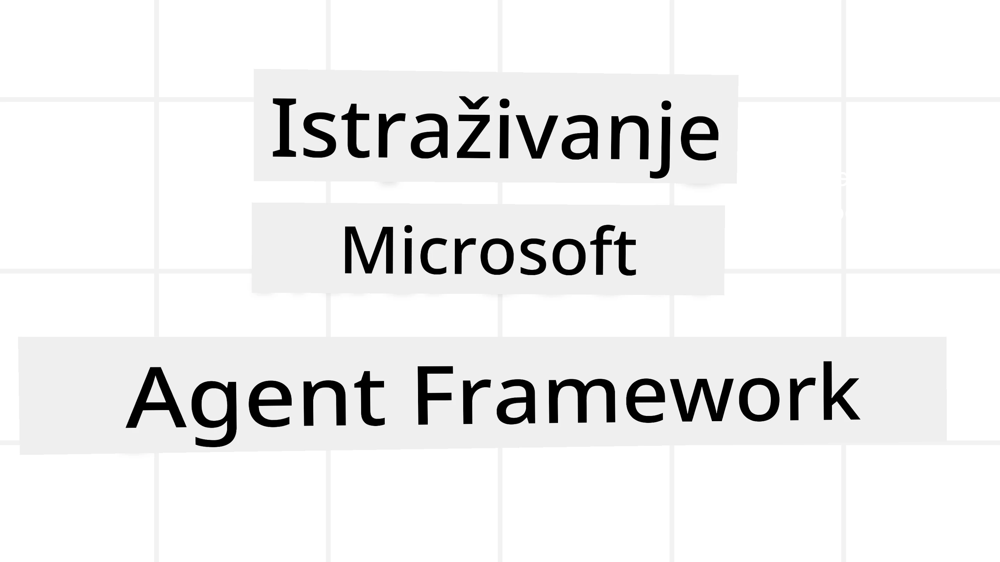
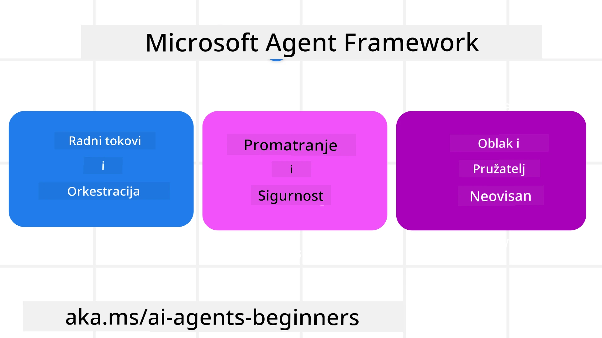
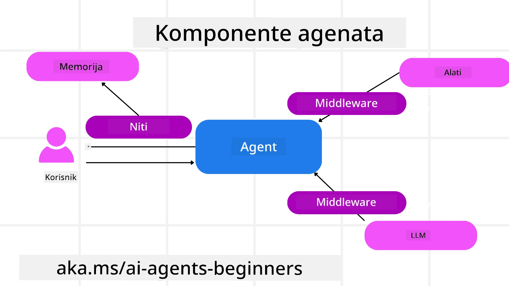

# Istraživanje Microsoft Agent Frameworka



### Uvod

Ova lekcija će pokriti:

- Razumijevanje Microsoft Agent Frameworka: Ključne Značajke i Vrijednost  
- Istraživanje Ključnih Koncepata Microsoft Agent Frameworka
- Napredni MAF Obrasci: Radni tokovi, Middleware i Memorija

## Ciljevi učenja

Nakon završetka ove lekcije, znat ćete kako:

- Izgraditi AI agente spremne za proizvodnju koristeći Microsoft Agent Framework
- Primijeniti osnovne značajke Microsoft Agent Frameworka na vaše agentične slučajeve upotrebe
- Koristiti napredne obrasce uključujući radne tokove, middleware i promatranje

## Primjeri koda

Primjeri koda za [Microsoft Agent Framework (MAF)](https://aka.ms/ai-agents-beginners/agent-framework) mogu se pronaći u ovom repozitoriju pod datotekama `xx-python-agent-framework` i `xx-dotnet-agent-framework`.

## Razumijevanje Microsoft Agent Frameworka



[Microsoft Agent Framework (MAF)](https://aka.ms/ai-agents-beginners/agent-framework) je Microsoftov jedinstveni okvir za izgradnju AI agenata. Pruža fleksibilnost za rješavanje širokog spektra agentičnih slučajeva upotrebe viđenih u proizvodnim i istraživačkim okruženjima, uključujući:

- **Sekvencijalna orkestracija agenata** u scenarijima gdje su potrebni radni tokovi korak-po-korak.
- **Istovremena orkestracija** u scenarijima gdje agenti trebaju istovremeno dovršiti zadatke.
- **Orkestracija grupnog chata** u scenarijima gdje agenti mogu surađivati na jednom zadatku.
- **Prijenos zadataka (Handoff Orchestration)** u scenarijima gdje agenti predaju zadatak jedan drugome kako se podzadaci dovršavaju.
- **Magnetna orkestracija** u scenarijima gdje agent menadžer stvara i mijenja listu zadataka te koordinira subagente za dovršetak zadatka.

Za isporuku AI agenata u proizvodnji, MAF uključuje i značajke za:

- **Promatranje** kroz korištenje OpenTelemetry gdje se svaka akcija AI agenta uključujući pozive alata, orkestracijske korake, tokove rezoniranja i nadzor izvedbe prati preko Microsoft Foundry nadzornih ploča.
- **Sigurnost** hostanjem agenata nativno na Microsoft Foundry koje uključuje sigurnosne kontrole poput pristupa temeljenog na ulogama, upravljanja privatnim podacima i ugrađene sigurnosti sadržaja.
- **Otpornost** budući da se agent threads i radni tokovi mogu pauzirati, nastaviti i oporaviti od pogrešaka, što omogućuje dugotrajnije procese.
- **Kontrolu** jer se podržavaju radni tokovi s ljudskim nadzorom u kojima se zadaci označavaju kao zahtijevajući ljudsko odobrenje.

Microsoft Agent Framework je također fokusiran na interoperabilnost:

- **Neovisan o oblaku** - Agent može raditi u kontejnerima, lokalno i preko različitih oblaka.
- **Neovisan o dobavljaču** - Agent se može kreirati kroz vaš omiljeni SDK uključujući Azure OpenAI i OpenAI
- **Integriranje otvorenih standarda** - Agent može koristiti protokole kao što su Agent-to-Agent (A2A) i Model Context Protocol (MCP) za otkrivanje i korištenje drugih agenata i alata.
- **Dodaci i konektori** - Veze se mogu uspostaviti s uslugama podataka i memorije poput Microsoft Fabric, SharePoint, Pinecone i Qdrant.

Pogledajmo kako se ove značajke primjenjuju na neke ključne koncepte Microsoft Agent Frameworka.

## Ključni koncepti Microsoft Agent Frameworka

### Agenti



**Kreiranje agenata**

Kreiranje agenata se radi definiranjem inferencijske usluge (LLM providera),
skupa uputa koje AI agent treba slijediti i dodijeljenog `name`:

```python
agent = AzureOpenAIChatClient(credential=AzureCliCredential()).create_agent( instructions="You are good at recommending trips to customers based on their preferences.", name="TripRecommender" )
```

Gore je korišten `Azure OpenAI` ali agenti se mogu kreirati korištenjem različitih usluga uključujući `Microsoft Foundry Agent Service`:

```python
AzureAIAgentClient(async_credential=credential).create_agent( name="HelperAgent", instructions="You are a helpful assistant." ) as agent
```

OpenAI `Responses`, `ChatCompletion` API-je

```python
agent = OpenAIResponsesClient().create_agent( name="WeatherBot", instructions="You are a helpful weather assistant.", )
```

```python
agent = OpenAIChatClient().create_agent( name="HelpfulAssistant", instructions="You are a helpful assistant.", )
```

ili [MiniMax](https://platform.minimaxi.com/), koji pruža OpenAI-kompatibilan API s velikim kontekstnim prozorima (do 204K tokena):

```python
agent = OpenAIChatClient(base_url="https://api.minimax.io/v1", api_key=os.environ["MINIMAX_API_KEY"], model_id="MiniMax-M3").create_agent( name="HelpfulAssistant", instructions="You are a helpful assistant.", )
```

ili udaljene agente koristeći A2A protokol:

```python
agent = A2AAgent( name=agent_card.name, description=agent_card.description, agent_card=agent_card, url="https://your-a2a-agent-host" )
```

**Pokretanje agenata**

Agenti se pokreću koristeći `.run` ili `.run_stream` metode za odgovore bez striminga ili sa strimingom.

```python
result = await agent.run("What are good places to visit in Amsterdam?")
print(result.text)
```

```python
async for update in agent.run_stream("What are the good places to visit in Amsterdam?"):
    if update.text:
        print(update.text, end="", flush=True)

```

Svako pokretanje agenta može imati opcije za prilagodbu parametara poput `max_tokens` koje agent koristi, `tools` koje agent može pozivati, te čak i sam `model` koji se koristi za agenta.

Ovo je korisno u slučajevima kada su specifični modeli ili alati potrebni za dovršavanje korisničkog zadatka.

**Alati**

Alati se mogu definirati kako pri definiranju agenta:

```python
def get_attractions( location: Annotated[str, Field(description="The location to get the top tourist attractions for")], ) -> str: """Get the top tourist attractions for a given location.""" return f"The top attractions for {location} are." 


# Kada se izravno stvara ChatAgent

agent = ChatAgent( chat_client=OpenAIChatClient(), instructions="You are a helpful assistant", tools=[get_attractions]

```

tako i prilikom pokretanja agenta:

```python

result1 = await agent.run( "What's the best place to visit in Seattle?", tools=[get_attractions] # Alat dostupan samo za ovo izvršavanje )
```

**Agent Threads**

Agent Threads se koriste za upravljanje višeslojnim razgovorima. Threadovi se mogu kreirati:

- Korištenjem `get_new_thread()` što omogućuje spremanje threada tijekom vremena
- Automatskim kreiranjem threada pri pokretanju agenta koji traje samo za trenutno pokretanje.

Za kreiranje threada, kod izgleda ovako:

```python
# Stvori novi thread.
thread = agent.get_new_thread() # Pokreni agenta s threadom.
response = await agent.run("Hello, I am here to help you book travel. Where would you like to go?", thread=thread)

```

Thread se zatim može serijalizirati i pohraniti za kasniju upotrebu:

```python
# Kreirajte novu nit.
thread = agent.get_new_thread() 

# Pokrenite agenta s niti.

response = await agent.run("Hello, how are you?", thread=thread) 

# Serijalizirajte nit za pohranu.

serialized_thread = await thread.serialize() 

# Deserijalizirajte stanje niti nakon učitavanja iz pohrane.

resumed_thread = await agent.deserialize_thread(serialized_thread)
```

**Agent Middleware**

Agenti komuniciraju s alatima i LLM-ovima kako bi dovršili zadatke korisnika. U određenim scenarijima, želimo izvršiti ili pratiti radnje između te interakcije. Agent middleware omogućuje to kroz:

*Middleware funkcije*

Ovaj middleware omogućuje izvršavanje akcije između agenta i funkcije/alata kojeg agent poziva. Primjer uporabe je kada želite napraviti zapis (log) poziva funkcije.

U kodu ispod `next` definira hoće li se pozvati sljedeći middleware ili stvarna funkcija.

```python
async def logging_function_middleware(
    context: FunctionInvocationContext,
    next: Callable[[FunctionInvocationContext], Awaitable[None]],
) -> None:
    """Function middleware that logs function execution."""
    # Predobrada: Zabilježi prije izvršenja funkcije
    print(f"[Function] Calling {context.function.name}")

    # Nastavi na sljedeći middleware ili izvršenje funkcije
    await next(context)

    # Obrada nakon izvršenja: Zabilježi nakon izvršenja funkcije
    print(f"[Function] {context.function.name} completed")
```

*Chat middleware*

Ovaj middleware omogućava izvršavanje ili zapis akcije između agenta i zahtjeva prema LLM-u.

Ovo sadrži važnu informaciju kao što su `messages` koji se šalju AI servisu.

```python
async def logging_chat_middleware(
    context: ChatContext,
    next: Callable[[ChatContext], Awaitable[None]],
) -> None:
    """Chat middleware that logs AI interactions."""
    # Predobrada: Zabilježi prije poziva AI-ja
    print(f"[Chat] Sending {len(context.messages)} messages to AI")

    # Nastavi na sljedeći middleware ili AI servis
    await next(context)

    # Obrada nakon: Zabilježi nakon odgovora AI-ja
    print("[Chat] AI response received")

```

**Agent Memory**

Kao što je objašnjeno u lekciji o `Agentic Memory`, memorija je važan element koji omogućuje agentu da djeluje u različitim kontekstima. MAF nudi nekoliko različitih tipova memorija:

*Memorija u memoriji (In-Memory Storage)*

Ovo je memorija pohranjena u threadovima tijekom trajanja aplikacije.

```python
# Stvori novu nit.
thread = agent.get_new_thread() # Pokreni agenta s nitima.
response = await agent.run("Hello, I am here to help you book travel. Where would you like to go?", thread=thread)
```

*Trajne poruke (Persistent Messages)*

Ova memorija se koristi za pohranu povijesti razgovora kroz različite sesije. Definira se pomoću `chat_message_store_factory`:

```python
from agent_framework import ChatMessageStore

# Kreiraj prilagođenu pohranu poruka
def create_message_store():
    return ChatMessageStore()

agent = ChatAgent(
    chat_client=OpenAIChatClient(),
    instructions="You are a Travel assistant.",
    chat_message_store_factory=create_message_store
)

```

*Dinamička memorija (Dynamic Memory)*

Ova memorija se dodaje u kontekst prije pokretanja agenata. Ove memorije se mogu pohraniti u vanjskim servisima kao što je mem0:

```python
from agent_framework.mem0 import Mem0Provider

# Korištenje Mem0 za napredne mogućnosti memorije
memory_provider = Mem0Provider(
    api_key="your-mem0-api-key",
    user_id="user_123",
    application_id="my_app"
)

agent = ChatAgent(
    chat_client=OpenAIChatClient(),
    instructions="You are a helpful assistant with memory.",
    context_providers=memory_provider
)

```

**Agent Observability (Promatranje)**

Promatranje je važno za izgradnju pouzdanih i održivih agentičnih sustava. MAF se integrira s OpenTelemetry kako bi pružio praćenje i metrike za bolju uvidljivost.

```python
from agent_framework.observability import get_tracer, get_meter

tracer = get_tracer()
meter = get_meter()
with tracer.start_as_current_span("my_custom_span"):
    # učini nešto
    pass
counter = meter.create_counter("my_custom_counter")
counter.add(1, {"key": "value"})
```

### Radni tokovi

MAF nudi radne tokove koji su unaprijed definirani koraci za dovršetak zadatka i uključuju AI agente kao komponente tih koraka.

Radni tokovi se sastoje od različitih komponenti koje omogućuju bolju kontrolu protoka. Radni tokovi također omogućuju **multi-agent orkestraciju** i **checkpointing** za spremanje stanja radnog toka.

Glavne komponente radnog toka su:

**Executor-i**

Executor-i primaju ulazne poruke, izvršavaju njihove zadatke te zatim proizvode izlaznu poruku. Time se radni tok pomiče prema dovršetku većeg zadatka. Executor može biti ili AI agent ili prilagođena logika.

**Edge-i**

Edge-i se koriste za definiranje toka poruka u radnom toku. Mogu biti:

*Direktni edge-i* - Jednostavne veze jedan na jedan između executor-a:

```python
from agent_framework import WorkflowBuilder

builder = WorkflowBuilder()
builder.add_edge(source_executor, target_executor)
builder.set_start_executor(source_executor)
workflow = builder.build()
```

*Uvjetni edge-i* - Aktiviraju se nakon što je ispunjen određeni uvjet. Na primjer, kada sobe u hotelu nisu dostupne, executor može predložiti druge opcije.

*Switch-case edge-i* - Usmjeravaju poruke različitim executor-ima na osnovu definiranih uvjeta. Na primjer, ako putnik ima prioritetni pristup, njegovi zadaci će se obrađivati kroz drugi radni tok.

*Fan-out edge-i* - Jedna poruka se šalje na više odredišta.

*Fan-in edge-i* - Prikupljaju više poruka od različitih executor-a i šalju ih prema jednom odredištu.

**Događaji**

Za bolje praćenje radnih tokova, MAF nudi ugrađene događaje za izvršenje uključujući:

- `WorkflowStartedEvent`  - Početak izvršenja radnog toka
- `WorkflowOutputEvent` - Radni tok proizvodi izlaz
- `WorkflowErrorEvent` - Radni tok susreće pogrešku
- `ExecutorInvokeEvent`  - Executor započinje obradu
- `ExecutorCompleteEvent`  -  Executor završava obradu
- `RequestInfoEvent` - Izdaje se zahtjev

## Napredni MAF obrasci

Gornji odjeljci pokrivaju ključne koncepte Microsoft Agent Frameworka. Kako gradite složenije agente, evo nekoliko naprednih obrazaca koje možete razmotriti:

- **Middleware kompozicija**: Povežite više middleware handlera (logiranje, autentikacija, ograničenje brzine) koristeći middleware funkcije i chat middleware za detaljnu kontrolu ponašanja agenta.
- **Spremanje stanja radnog toka (Workflow Checkpointing)**: Koristite događaje radnog toka i serijalizaciju za spremanje i nastavljanje dugotrajnih procesa agenata.
- **Dinamički izbor alata**: Kombinirajte RAG na osnovu opisa alata s MAF-ovom registracijom alata kako biste prikazali samo relevantne alate po upitu.
- **Višenamjenski prijenos zadataka (Multi-Agent Handoff)**: Koristite edge-e radnog toka i uvjetno usmjeravanje da orkestrirate prijenos između specijaliziranih agenata.

## Primjeri koda

Primjeri koda za Microsoft Agent Framework mogu se pronaći u ovom repozitoriju pod datotekama `xx-python-agent-framework` i `xx-dotnet-agent-framework`.

## Imate li dodatnih pitanja o Microsoft Agent Frameworku?

Pridružite se [Microsoft Foundry Discord](https://discord.com/invite/ATgtXmAS5D) da upoznate druge učenike, sudjelujete na konzultacijama i dobijete odgovore na vaša pitanja o AI agentima.

---

<!-- CO-OP TRANSLATOR DISCLAIMER START -->
**Napomena**:
Ovaj dokument je preveden korištenjem AI prevoditeljskog servisa [Co-op Translator](https://github.com/Azure/co-op-translator). Iako težimo točnosti, imajte na umu da automatski prijevodi mogu sadržavati greške ili netočnosti. Izvorni dokument na izvornom jeziku treba smatrati autoritativnim izvorom. Za važne informacije preporuča se profesionalni ljudski prijevod. Nismo odgovorni za bilo kakva nesporazumevanja ili pogrešne interpretacije koje proizlaze iz korištenja ovog prijevoda.
<!-- CO-OP TRANSLATOR DISCLAIMER END -->