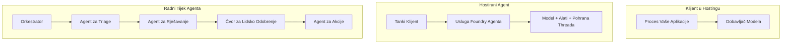
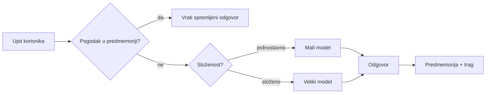
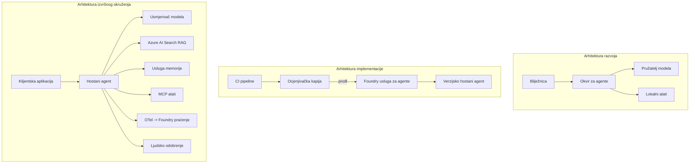

# Implementacija skalabilnih agenata s Microsoft Foundry


Do sada u tečaju ste izgradili agente koji se izvršavaju na vašem laptopu, unutar bilježnice, pokretani `az login` i nekoliko varijabli okoline. To je točno pravi način za učenje. Nije to pravi način za pokretanje agenta o kojem tisuće korisnika ovise u 3 sata ujutro.

Ova lekcija govori o jazu između "radi na mom računalu" i "radi pouzdano i pristupačno u produkciji." Taj jaz zatvaramo koristeći **Microsoft Foundry** i **Microsoft Foundry Agent Service**, i činimo to izradom pravog agenta za korisničku podršku koji ima alate, dohvat, memoriju, evaluaciju i nadzor.

## Uvod

Ova lekcija će obuhvatiti:

- Razliku između **prototipnog agenta** i **implementiranog agenta**, te zašto prijelaz uglavnom ovisi o svemu *oko* modela.
- **Obrasce implementacije** za agente: klijentski-hostirani, servis-hostirani (Hosted Agents) i orkestrirani tijekovi rada.
- **Životni ciklus agenta** na Microsoft Foundry — izrada, verzioniranje, implementacija, evaluacija, nadzor, povlačenje.
- **Strategije skaliranja**: usmjeravanje modela, keširanje, konkurencija i bezdržavni dizajn.
- **Promatranje** s OpenTelemetry i Foundry praćenjem.
- **Optimizacija troškova** kroz izbor modela, usmjeravanje i evaluacijske kapije.
- **Razmatranja za poduzeća**: upravljanje, ljudsko odobrenje i sigurno pokretanje MCP servera u produkciji.

## Ciljevi učenja

Nakon dovršetka ove lekcije znat ćete kako:

- Odabrati pravi obrazac implementacije za zadani radni opterećenje agenta.
- Implementirati agenta na Microsoft Foundry Agent Service tako da je verzioniran, upravljan i promatran.
- Instrumentirati agenta za praćenje i povezati evaluacijski tok koji se izvršava prije svakog izdanja.
- Primijeniti usmjeravanje i keširanje modela za održavanje latencije i troškova pod kontrolom na skali.
- Dodati kapiju ljudskog odobrenja za rizične radnje i integrirati MCP server na siguran način za produkciju.

## Preduvjeti

Ova lekcija pretpostavlja da ste završili ranije lekcije i da ste upoznati s:

- Izradom agenata s [Microsoft Agent Framework](../14-microsoft-agent-framework/README.md) (Lekcija 14).
- [Upotreba alata](../04-tool-use/README.md) (Lekcija 4) i [Agentički RAG](../05-agentic-rag/README.md) (Lekcija 5).
- [Memorija agenta](../13-agent-memory/README.md) (Lekcija 13) i [Agentički protokoli / MCP](../11-agentic-protocols/README.md) (Lekcija 11).
- [Promatranje i evaluacija](../10-ai-agents-production/README.md) (Lekcija 10) — ova lekcija se direktno nadovezuje na nju.

Također ćete trebati:

- **Azure pretplatu** i **Microsoft Foundry projekt** s barem jednim implementiranim chat modelom.
- Autentificirani **Azure CLI** (`az login`).
- Python 3.12+ i pakete navedene u repozitoriju [`requirements.txt`](../../../requirements.txt).

## Od prototipa do produkcije: što se zapravo mijenja

Prototipni agent i produkcijski agent dijele istu osnovnu petlju — razmišljanje, pozivanje alata, odgovor. Ono što se mijenja jest sve što je omotano oko te petlje. Model je možda 20% produkcijskog agenta; ostalih 80% je operativni kostur.

| Pitanje | Prototip | Produkcija |
| --- | --- | --- |
| **Hostiranje** | Radi u vašoj bilježnici | Radi kao hostirana usluga, verzionirana i rasprostranjena |
| **Identitet** | Vaš `az login` token | Upravljani identitet s ograničenim RBAC pristupom |
| **Stanje** | U memoriji, gubi se pri ponovnom pokretanju | Eksternalizirano (spremište niti, memorijska usluga) |
| **Kvar** | Vidite trag pogreške | Pokušaji ponovo, rezervne opcije, dead-letter, upozorenja |
| **Trošak** | "To je nekoliko centi" | Praćeno po zahtjevu, usmjereno, keširano, u proračunu |
| **Kvaliteta** | Okom kontrolirate izlaz | Automatski evaluirano prije svakog izdanja |
| **Povjerenje** | Odobravate svaku radnju | Pravila + ljudski nadzor za rizične radnje |

Imajte ovu tablicu na umu. Svaki odjeljak u nastavku odgovara jednom od ovih redaka.

## Obrasci implementacije agenata

Postoje tri obrasca koja ćete koristiti, često u kombinaciji.

### 1. Klijentski-hostirani agenti

Objekt agenta živi unutar *vašeg* procesa aplikacije. Vaš kod izravno poziva pružatelja modela; petlja razmišljanja izvršava se u vašoj usluzi. Ovo je ono što je prethodna lekcija radila.

- **Koristite kada** trebate punu kontrolu nad petljom, prilagođeni middleware ili ugrađujete agenta u postojeći backend.
- **Nedostatak**: sami nosite odgovornost za skaliranje, stanje i otpornost.

### 2. Hostirani agenti (Foundry Agent Service)

Agent je *registriran kao resurs* u Microsoft Foundry. Foundry hostira petlju razmišljanja, pohranjuje niti, provodi sigurnost sadržaja i RBAC, te čini agenta vidljivim u Foundry portalu. Vaša aplikacija postaje tanka klijentska aplikacija koja stvara niti i čita odgovore.

- **Koristite kada** želite trajnost, ugrađeni nadzor, upravljanje i manji operativni opseg.
- **Nedostatak**: manje niskorazinske kontrole u zamjenu za upravljani runtime.

### 3. Tijekovi rada agenata

Više agenata (i alata) sastavljeno je u graf s eksplicitnim tijekovima kontrole — sekvencijalni koraci, grananje, čvorovi ljudskog odobrenja i trajne kontrolne točke koje se mogu pauzirati i nastaviti. Ovo je Microsoft Agent Framework **Workflows** funkcionalnost primijenjena na razinu implementacije.

- **Koristite kada** jedna zadaća obuhvaća nekoliko specijaliziranih agenata ili zahtijeva korak odobrenja usred procesa.
- **Nedostatak**: više pokretnih dijelova; potrebna je nadzorna razina orkestracije.



## Životni ciklus agenta na Microsoft Foundry

Implementacija agenta nije jednokratno `push` slanje. To je petlja, koja izgleda poput ciklusa izdanja softvera jer je upravo to.


Ključna ideja, prenesena iz [Lekcije 10](../10-ai-agents-production/README.md): **offline evaluacija je kapija, ne sporedna misao.** Nova verzija agenta se ne objavljuje osim ako ne prođe vaše evaluacijske pragove. Online nadzor zatim vraća stvarne pogreške natrag u vaš offline testni skup. To je cijela petlja.

## Strategije skaliranja

Skaliranje agenta razlikuje se od skaliranja bezdržavnog web API-ja, jer svaki zahtjev može pokrenuti višestruke skupe pozive modela i alata. Četiri tehnike nose najveći teret.

**Bezdržavna obrada zahtjeva.** Nemojte držati niti jedno korisničko stanje u memoriji vašeg procesa. Pohranite niti razgovora u Foundry thread store ili memorijsku uslugu tako da svaki primjerak može obraditi bilo koji zahtjev. Ovo vam omogućuje horizontalno skaliranje — dodajte primjerke, bez lijepljenja sesija.

**Usmjeravanje modela.** Ne treba svaki zahtjev vaš najsposobniji (i najskuplji) model. Usmjerite jednostavne zahtjeve — klasifikaciju namjere, kratke činjenične odgovore — na mali, brzi model i rezervirajte veliki model za pravi razlog. Foundry **Model Router** može to napraviti za vas, ili možete sami implementirati lagani klasifikator. Izgradit ćete verziju "uradi sam" u laboratoriju.

**Keširanje odgovora.** Mnogi upiti za podršku su gotovo-duplicirani ("kako resetiram lozinku?"). Keširajte odgovore na često postavljana pitanja i pružajte ih bez poziva modela uopće. Čak i umjerena stopa uspješnog keširanja značajno smanjuje troškove i latenciju.

**Konkurencija i povratni tlak.** Pružatelji modela imaju ograničenja stope. Ograničite konkurenciju, koristite pokušaje s eksponencijalnim odmakom i propustite graciozno (odgovor u redu "radimo na tome" u redu je bolje od 500 pogreške).



## Promatranje u produkciji

Ne možete upravljati onim što ne možete vidjeti. Kao što je opisano u Lekciji 10, Microsoft Agent Framework izvorno emitira **OpenTelemetry** tragove — svaki poziv modela, poziv alata i korak orkestracije postaju spanovi. U produkciji izvozite te spanove u Microsoft Foundry (ili bilo koju OTel-kompatibilnu pozadinu) tako da možete:

- Pratiti jedan prigovor korisnika od početka do kraja kroz svaki poziv modela i alata.
- Promatrati latenciju p50/p95 i troškove po zahtjevu kroz vrijeme.
- Upozoriti na nagle poraste stope pogrešaka i anomalije u troškovima prije nego što ih primijete vaši korisnici (ili vaše financijsko odjeljenje).

```python
from agent_framework.observability import get_tracer

tracer = get_tracer()

with tracer.start_as_current_span("support_request") as span:
    span.set_attribute("customer.tier", "enterprise")
    span.set_attribute("routed.model", "gpt-5-nano")
    # izvršenje agenta se automatski prati unutar ovog raspona
```

Atributi poput `customer.tier` i `routed.model` pretvaraju masu tragova u pitanja na koja se može odgovoriti ("daju li se poduzećnim korisnicima prečesto male modele?").

## Optimizacija troškova

Troškovi u produkcijskim agentima dominiraju tokenima. Tri poluge, po utjecaju:

1. **Pravilno veličina modela.** Mali model koji prođe vašu evaluacijsku kapiju gotovo je uvijek jeftiniji od velikog koji također prolazi. Koristite evaluaciju kako biste *dokazali* da je mali model dovoljno dobar umjesto da iz opreza birate najveći model.
2. **Usmjeravanje prema složenosti.** Kao gore — plaćajte cijenu velikog modela samo za zahtjeve koji trebaju razmišljanje velikog modela.
3. **Agresivno keširajte.** Najjeftiniji poziv modela je onaj kojeg nikad ne napravite.

Evaluacijske kapije i kontrola troškova su ista disciplina gledana iz dva kuta: evaluacija vam kaže *donju granicu kvalitete*, usmjeravanje i keširanje vas drže što bliže *trošku* te granice.

## Razmatranja implementacije u poduzećima

**Upravljanje.** Hostirani agenti nasljeđuju Foundryjev RBAC, sigurnost sadržaja i zapisnik revizije. Svakom agentu dajte upravljani identitet s najmanjim potrebnim privilegijama — pristup samo za čitanje bazi znanja, ograničen pristup API-ju za ticketing, ništa više.

**Ljudski nadzor (human-in-the-loop).** Neke radnje su suviše važne da bi se automatizirale izravno — izdavanje povrata, brisanje računa, eskalacija pravnom timu. Microsoft Agent Framework podržava alate koji zahtijevaju **odobrenje**: agent predlaže radnju, izvršenje se pauzira, čovjek odobrava ili odbija, i tijek rada se nastavlja. Vidjeli ste primitiv u [Lekciji 6](../06-building-trustworthy-agents/README.md); ovdje ga implementirate.

**MCP u produkciji.** [MCP](../11-agentic-protocols/README.md) omogućuje vašem agentu da koristi vanjske alate kroz standardni sučelje. U produkciji tretirajte svaki MCP server kao nepouzdanu granicu: učvrstite verziju servera, pokrećite ga s ograničenim identitetom, validirajte njegove izlaze i nikad mu ne otkrivajte tajne. MCP server je ovisnost, i ovisnosti se zakrpljuju, pregledavaju i ograničavaju.



Ta tri dijagrama — razvoj, implementacija, runtime — predstavljaju istog agenta u tri faze njegova života. Sljedeća laboratorijska vježba vodi vas kroz njegovo izgradnju.

## Praktična vježba: Agent korisničke podrške spreman za produkciju

Otvorite [`code_samples/16-python-agent-framework.ipynb`](./code_samples/16-python-agent-framework.ipynb) i prođite ga od početka do kraja. Sastavit ćete **Contoso agenta korisničke podrške** sa svim proizvodnim zahtjevima:

1. **Pozivanje alata** — provjera statusa narudžbe i otvaranje zahtjeva za podršku.
2. **RAG** — odgovaranje na pitanja o pravilima iz baze znanja (Azure AI Search, s rezervom u memoriji tako da bilježnica radi bez Search resursa).
3. **Memorija** — pamćenje korisnika kroz okretaje razgovora.
4. **Usmjeravanje modela** — klasifikator složenosti usmjerava svaki zahtjev na mali ili veliki model.
5. **Keširanje odgovora** — ponovljena pitanja služe se iz keša.
6. **Ljudsko odobrenje** — povrati iznad određenog praga čekaju ljudsko odobrenje.
7. **Evaluacijski tok** — mali offline testni skup ocjenjuje agenta i djeluje kao kapija izdavanja.
8. **Promatranje** — OpenTelemetry praćenje oko svakog zahtjeva.

### Vodič kroz laboratorij

Bilježnica je organizirana tako da je svaki proizvodni zahtjev samostalni, izvršivi odjeljak. Srž je rukovatelj zahtjeva s usmjeravanjem i keširanjem:

```python
async def handle_support_request(query: str, customer_id: str) -> str:
    # 1. Poslužiti iz predmemorije kad god možemo.
    cached = response_cache.get(normalize(query))
    if cached:
        return cached

    # 2. Usmjeravati prema složenosti radi kontrole troškova.
    model = "gpt-5-nano" if is_simple(query) else "gpt-5-mini"

    # 3. Pokrenuti agenta unutar traga radi promatranja.
    with tracer.start_as_current_span("support_request") as span:
        span.set_attribute("routed.model", model)
        span.set_attribute("customer.id", customer_id)
        response = await support_agent.run(query, model=model)

    # 4. Predmemorirati i vratiti.
    response_cache.set(normalize(query), response.text)
    return response.text
```

Evaluacijska kapija koja čuva izdanje izgleda ovako:

```python
async def evaluation_gate(agent, test_cases, threshold: float = 0.8) -> bool:
    passed = 0
    for case in test_cases:
        result = await agent.run(case["input"])
        if score_response(result.text, case["expected"]) >= 0.8:
            passed += 1
    pass_rate = passed / len(test_cases)
    print(f"Evaluation pass rate: {pass_rate:.0%} (gate: {threshold:.0%})")
    return pass_rate >= threshold  # implementiraj samo ako prolaz vrata uspije
```

Pročitajte svaki redak — bilježnica održava primitivce namjerno malima kako ništa ne bi bilo skriveno iza poziva okvira.

## Validacija implementiranog agenta s Smoke testovima

Evaluacijska kapija gore se pokreće *offline* prema vašem agent objektu. Kada se agent implementira kao Hostirani agent, potrebna vam je još jedna, još jeftinija provjera: **odgovara li implementirana krajnja točka stvarno?**

Implementacija "uspješno" dokazuje samo da je kontrolna ravnina prihvatila definiciju — ne dokazuje da agent odgovara. Nedostajuća ovisnost, pogrešno usmjeravanje modela ili istekla veza mogu ostaviti zelenu implementaciju koja ne vraća ništa. **Smoke test** to hvata u sekundama, pri svakoj implementaciji, bez troškova pune evaluacije.

Ovaj repozitorij nudi spreman za uporabu smoke-test pipeline izgrađen na GitHub akciji [AI Smoke Test](https://github.com/marketplace/actions/ai-smoke-test):

- **Katalog** — [`tests/lesson-16-smoke-tests.json`](../../../tests/lesson-16-smoke-tests.json) sadrži upite i tvrdnje za Contoso agenta podrške (odgovori temeljeni na pravilima, provjera narudžbe, ostanak na temi i kontinuitet niti na više okretaja). Kataloge za agente drugih lekcija nalaze se uz njega — vidi [`tests/README.md`](../tests/README.md).
- **Tijek rada** — [`.github/workflows/smoke-test.yml`](../../../.github/workflows/smoke-test.yml) prijavljuje se s Azure OIDC te šalje svaki upit na agentovu krajnju točku Odgovori, i prekida posao na svaku promašenu tvrdnju.

```yaml
- name: Smoke-test hosted agent
  uses: JFolberth/ai-smoketest@v1
  with:
    project_endpoint: ${{ inputs.project_endpoint }}
    agent_name: ContosoSupportAgent
    tests_file: tests/lesson-16-smoke-tests.json
```


Pokrenite ga s kartice **Actions** nakon što je vaš agent postavljen, unoseći vašu Foundry točku kraja projekta i naziv agenta. Federirana identitet treba imati ulogu **Azure AI User** na opsegu Foundry projekta. Zamislite slojeve kao piramidu: testovi dima (dostupno i odgovara?) pokreću se pri svakoj implementaciji, offline evaluacija (dovoljno dobra za isporuku?) izvršava se prije promocije, a online evaluacija (kako se ponaša u stvarnom okruženju?) radi kontinuirano.

## Provjera Znanja

Testirajte svoje razumijevanje prije nego što prijeđete na zadatak.

**1. Otprilike koliko proizvodnog agenta čini "model," i što je ostatak?**

<details>
<summary>Odgovor</summary>

Model je manjina sustava — često se navodi oko 20%. Ostatak je operativni kostur: hosting i verzioniranje, identitet i RBAC, eksternalizirano stanje, rukovanje neuspjesima, praćenje troškova, evaluacija i kontrole s uključenim čovjekom. Prijelaz u produkciju uglavnom se odnosi na izgradnju svega *oko* petlje rezoniranja.
</details>

**2. Kada biste odabrali Hosted Agent umjesto agenta hostanog preko klijenta?**

<details>
<summary>Odgovor</summary>

Kada želite upravljano vrijeme izvođenja s ugrađenom trajnošću (niti koje traju i mogu se nastaviti), promatranjem, sigurnošću sadržaja i RBAC-om, i spremni ste žrtvovati nešto niskorazinske kontrole petlje rezoniranja za manje operativnog opsega. Hostanje preko klijenta je poželjno kada trebate potpunu kontrolu petlje ili ugrađujete agenta u postojeći backend.
</details>

**3. Zašto skalabilni agent mora biti bezstanja u svojoj vlastitoj memoriji procesa?**

<details>
<summary>Odgovor</summary>

Kako bi svaka instanca mogla obraditi bilo koji zahtjev, što omogućava horizontalno skaliranje bez vezanih sesija. Stanje po korisničkom razgovoru eksternalizira se na pohranu niti ili uslugu memorije. Da je stanje u memoriji procesa, gubili biste ga pri ponovno pokretanju i ne biste mogli slobodno raspodijeliti opterećenje.
</details>

**4. Koji problem rješava usmjeravanje modela i kako je povezano s evaluacijom?**

<details>
<summary>Odgovor</summary>

Usmjeravanje šalje jednostavne zahtjeve malom, jeftinom i brzom modelu i rezervira veliki model za stvarno rezoniranje, kontrolirajući latenciju i troškove. Povezano je s evaluacijom jer evaluacija dokazuje da je mali model dovoljan za određenu klasu zahtjeva — usmjeravanje bez evaluacije je nagađanje.
</details>

**5. Što je "evaluacijska brava" i gdje se nalazi u životnom ciklusu?**

<details>
<summary>Odgovor</summary>

Evaluacijska brava provodi offline testni set nad novom verzijom agenta i blokira implementaciju ako postotak prolaznosti ne prijeđe prag. Nalazi se između "verzije" i "implementacije" u životnom ciklusu, čineći kvalitetu preduvjetom za izdanje, a ne nečim što se provjerava nakon isporuke.
</details>

**6. Zašto MCP poslužitelj u produkciji treba tretirati kao nepouzdanu granicu?**

<details>
<summary>Odgovor</summary>

Zato što je vanjska ovisnost u koju vaš agent upućuje pozive. Trebate fiksirati njegovu verziju, pokretati ga s ograničenim identitetom, potvrđivati njegove izlaze, ograničavati stopu zahtjeva i nikada mu ne otkrivati tajne — ista disciplina kao i kod bilo koje treće strane ovisnosti. Njegovi izlazi ulaze u rezoniranje vašeg agenta, pa nepodržano povjerenje predstavlja sigurnosni rizik.
</details>

**7. Koja pojedinačna promjena obično ima najveći utjecaj na troškove proizvodnog agenta i zašto?**

<details>
<summary>Odgovor</summary>

Pravilno dimenzioniranje modela — korištenje najmanjeg modela koji prolazi vašu evaluacijsku bravu. Troškove dominantno uzrokuju tokeni, a manji model koji zadovoljava kriterije kvalitete gotovo je uvijek jeftiniji od većeg. Keširanje i usmjeravanje dodatno smanjuju troškove, ali izbor pravog osnovnog modela ima najveći primarni učinak.
</details>

**8. Koju ulogu atributi spreza poput `customer.tier` i `routed.model` igraju u promatranju?**

<details>
<summary>Odgovor</summary>

Oni pretvaraju sirove tragove u odgovarajuća poslovna pitanja. Bez atributa imate zid spreza; s njima možete pitati "jesu li enterprise korisnici prečesto usmjereni na mali model?" ili "koji model obrađuje naše najsporije zahtjeve?" Atributi su kako režete telemetriju po dimenzijama koje su važne za vaše poslovanje.
</details>

## Zadatak

Uzmite agenta za korisničku podršku iz laboratorija i učvrstite ga za specifični scenarij: **agent za podršku naplati pretplate za SaaS tvrtku.**

Vaša predaja treba:

1. **Zamijeniti alate** alatima relevantnim za naplatu: `get_subscription_status`, `get_invoice`, i `issue_credit` (krediti iznad $50 zahtijevaju ljudsko odobrenje).
2. **Dodati tri RAG dokumenta** koja pokrivaju politiku povrata novca tvrtke, ciklus naplate i politiku otkazivanja.
3. **Proširiti evaluacijski skup** na najmanje osam slučajeva, uključujući barem dva koja *trebaju* aktivirati put ljudskog odobrenja i potvrditi da vaša evaluacijska brava ispravno prolazi ili ne.
4. **Dodati jedan izvještaj o troškovima**: nakon pokretanja deset miješanih upita kroz agenta, ispišite koliko je bilo upućeno malom modelu, koliko velikom modelu, i koliko je posluženo iz keša.

Napišite kratak odlomak (u markdown ćeliji) koji objašnjava koju ste pravilo model-usmjeravanja odabrali i kako biste ga validirali s pravim prometom. Nema jedinstvenog ispravnog odgovora — ocjenjuje se jeste li povezali produkcijske aspekte koherentno.

## Sažetak

U ovoj lekciji ste premjestili agenta iz prototipa u produkciju s Microsoft Foundry:

- Skok u produkciju uglavnom je o **operativnom kosturu** oko modela — hosting, identitet, stanje, rukovanje neuspjesima, troškovi, kvaliteta i povjerenje.
- Naučili ste tri **obračunska obrasca** — hostanje preko klijenta, Hosted Agente i tokove rada agenta — i kada koji odgovara.
- Prošli ste kroz **životni ciklus agenta**, gdje offline **evaluacija djeluje kao izlazna brava** i online promatranje vraća neuspjehe u testni skup.
- Primijenili ste **strategije skaliranja** — dizajn bez stanja, usmjeravanje modela, keširanje i ograničenu konkurentnost — i povezali ih s **optimizacijom troškova**.
- Uključili ste **poslovne kontrole**: RBAC, ljudsko odobrenje u petlji i produkcijski sigurno MCP integraciju.
- Izgradili ste **produkcijski spremnog agenta za korisničku podršku** koji povezuje sve te aspekte u izvršivi kod.

Sljedeća lekcija vodi suprotnim putem: umjesto skaliranja agenata u oblak, spustit ćete ih *dolje* na jedan razvojni stroj i pokretati ih u potpunosti lokalno.

## Dodatni resursi

- <a href="https://learn.microsoft.com/azure/ai-foundry/what-is-azure-ai-foundry" target="_blank">Dokumentacija Microsoft Foundry</a>
- <a href="https://learn.microsoft.com/azure/ai-foundry/agents/overview" target="_blank">Pregled Microsoft Foundry Agent Service</a>
- <a href="https://learn.microsoft.com/en-us/agent-framework/overview/?wt.mc_id=youtube_26688_organicsocial_reactor&pivots=programming-language-python" target="_blank">Microsoft Agent Framework</a>
- <a href="https://learn.microsoft.com/azure/ai-foundry/concepts/model-router" target="_blank">Model Router u Microsoft Foundry</a>
- <a href="https://learn.microsoft.com/azure/search/search-what-is-azure-search" target="_blank">Azure AI Search</a>
- <a href="https://opentelemetry.io/" target="_blank">OpenTelemetry</a>
- <a href="https://github.com/marketplace/actions/ai-smoke-test" target="_blank">GitHub akcija AI Smoke Test</a>
- <a href="https://modelcontextprotocol.io/" target="_blank">Model Context Protocol (MCP)</a>

## Prethodna Lekcija

[Izgradnja agenata za korištenje računala (CUA)](../15-browser-use/README.md)

## Sljedeća Lekcija

[Izrada lokalnih AI agenata](../17-creating-local-ai-agents/README.md)

---

<!-- CO-OP TRANSLATOR DISCLAIMER START -->
**Napomena**:
Ovaj dokument je preveden korištenjem AI prevoditeljskog servisa [Co-op Translator](https://github.com/Azure/co-op-translator). Iako težimo točnosti, imajte na umu da automatski prijevodi mogu sadržavati greške ili netočnosti. Izvorni dokument na izvornom jeziku treba smatrati autoritativnim izvorom. Za važne informacije preporuča se profesionalni ljudski prijevod. Nismo odgovorni za bilo kakva nesporazumevanja ili pogrešne interpretacije koje proizlaze iz korištenja ovog prijevoda.
<!-- CO-OP TRANSLATOR DISCLAIMER END -->