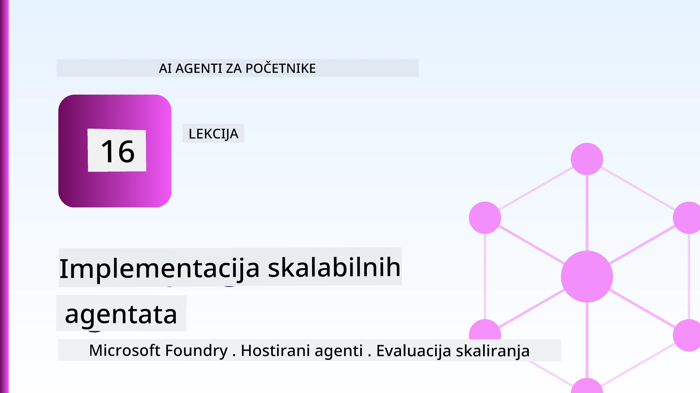
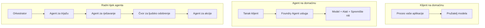
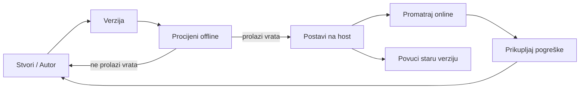
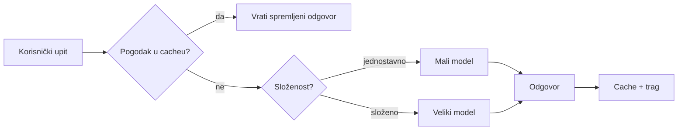
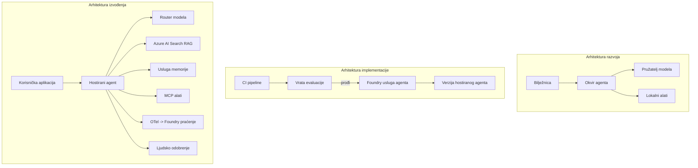

# Postavljanje skalabilnih agenata s Microsoft Foundry



Do sada ste u tečaju izgradili agente koji rade na vašem prijenosnom računalu, unutar bilježnice, vođeni `az login` i nekoliko varijabli okruženja. To je točno pravi način za učenje. To nije pravi način za pokretanje agenta na kojeg se tisuće kupaca oslanjaju u 3 ujutro.

Ova lekcija govori o jazu između "radi na mom računalu" i "radi, pouzdano i povoljno, u produkciji." Taj jaz zatvaramo korištenjem **Microsoft Foundry** i **Microsoft Foundry Agent Service**, i to tako što gradimo stvarnog korisničkog agenta za podršku koji ima alate, dohvat, memoriju, evaluaciju i praćenje.

## Uvod

Ova lekcija će obuhvatiti:

- Razliku između **prototipskog agenta** i **postavljenog agenta**, i zašto je prijelaz uglavnom o svemu *oko* modela.
- **Obrasci postavljanja** za agente: klijent-hostirani, servis-hostirani (Hostirani agenti) i orkestrirani putem radnog toka.
- **Životni ciklus agenta** na Microsoft Foundry — stvaranje, verzioniranje, postavljanje, evaluacija, promatranje, povlačenje.
- **Strategije skaliranja**: usmjeravanje modela, predmemoriranje, konkurentnost i dizajn bez stanja.
- **Promatranje** s OpenTelemetry i Foundry praćenjem.
- **Optimizacija troškova** kroz odabir modela, usmjeravanje i evaluacijske kapije.
- **Razmatranja za poduzeća**: upravljanje, ljudsko odobrenje i siguran rad MCP servera u produkciji.

## Ciljevi učenja

Nakon završetka ove lekcije, znat ćete kako:

- Odabrati pravi obrazac postavljanja za dani radni teret agenta.
- Postaviti agenta za Microsoft Foundry Agent Service tako da bude verzioniran, upravljan i promatran.
- Instrumentirati agenta za praćenje i povezati evaluacijski pipeline koji se pokreće prije svakog izdanja.
- Primijeniti usmjeravanje modela i predmemoriranje kako biste održali latenciju i troškove pod kontrolom u škali.
- Dodati ljudsku odobrenu kapiju za rizične radnje i integrirati MCP server na siguran način u produkciji.

## Preduvjeti

Ova lekcija pretpostavlja da ste završili ranije lekcije i da se osjećate ugodno s:

- Izgradnjom agenata pomoću [Microsoft Agent Framework](../14-microsoft-agent-framework/README.md) (Lekcija 14).
- [Korištenjem alata](../04-tool-use/README.md) (Lekcija 4) i [Agentic RAG](../05-agentic-rag/README.md) (Lekcija 5).
- [Agent Memory](../13-agent-memory/README.md) (Lekcija 13) i [Agentic Protocols / MCP](../11-agentic-protocols/README.md) (Lekcija 11).
- [Promatranjem i evaluacijom](../10-ai-agents-production/README.md) (Lekcija 10) — ova lekcija se direktno nastavlja na to.

Također će vam trebati:

- **Pretplata na Azure** i **Microsoft Foundry projekt** s barem jednim postavljenim modelom za chat.
- **Azure CLI** autentificiran (`az login`).
- Python 3.12+ i paketi u repozitoriju [`requirements.txt`](../../../requirements.txt).

## Od prototipa do produkcije: što se zapravo mijenja

Prototipski agent i produkcijski agent dijele isti osnovni ciklus — razmišljanje, pozivanje alata, odgovor. Ono što se mijenja jest sve što je omotano oko tog ciklusa. Model je možda 20% produkcijskog agenta; ostalih 80% je operativni kostur.

| Briga | Prototip | Produkcija |
| --- | --- | --- |
| **Hostiranje** | Radi u vašoj bilježnici | Radi kao hostirana usluga, verzionirana i puštana u rad |
| **Identitet** | Vaš `az login` token | Upravljani identitet s ograničenim RBAC |
| **Stanje** | U memoriji, gubi se prilikom ponovnog pokretanja | Eksternalizirano (spremište niti, usluga memorije) |
| **Neuspjeh** | Vidite traceback | Pokušaji ponovo, zamjene, dead-letter, upozorenja |
| **Trošak** | "To je nekoliko centi" | Praćeno po zahtjevu, usmjeravanje, keširanje, proračun |
| **Kvaliteta** | Pregledavate izlaz | Evaluacija automatski prije svakog izdanja |
| **Povjerenje** | Odobravate svaku radnju | Politika + čovjek u petlji za rizične radnje |

Imajte ovaj tablični prikaz na umu. Svaki odjeljak dolje odnosi se na jedan od ovih redaka.

## Obrasci postavljanja agenata

Postoje tri obrasca koje ćete koristiti, često u kombinaciji.

### 1. Klijent-hostirani agenti

Objekt agenta živi unutar *vašeg* procesa aplikacije. Vaš kod izravno poziva pružatelja modela; ciklus razmišljanja radi u vašoj usluzi. Ovo je ono što je rađeno u svim prethodnim lekcijama.

- **Koristite ga kada** trebate punu kontrolu nad ciklusom, prilagođeni middleware ili ugrađujete agenta u postojeći backend.
- **Razmjena**: sami ste odgovorni za skaliranje, stanje i otpornost.

### 2. Hostirani agenti (Foundry Agent Service)

Agent je *registriran kao resurs* u Microsoft Foundry. Foundry hostira ciklus razmišljanja, pohranjuje niti, nameće sigurnost sadržaja i RBAC, te čini agenta vidljivim u Foundry portalu. Vaša aplikacija postaje lagani klijent koji stvara niti i čita odgovore.

- **Koristite ga kada** želite trajnost, ugrađeno promatranje, upravljanje i manje operativnog opterećenja.
- **Razmjena**: manje niskorazinske kontrole u zamjenu za upravljano runtime okruženje.

### 3. Radni tokovi agenata

Višestruki agenti (i alati) složeni su u graf s eksplicitnim kontrolnim tokom — sekvencijalni koraci, grananje, čvorovi ljudskog odobrenja i trajne kontrolne točke koje mogu pauzirati i nastaviti. Ovo je Microsoft Agent Framework **Workflows** funkcionalnost primijenjena na razini postavljanja.

- **Koristite ga kada** jedan zadatak obuhvaća nekoliko specijaliziranih agenata ili zahtijeva korak odobrenja usred procesa.
- **Razmjena**: više pokretnih dijelova; potrebna je vidljivost na razini orkestracije.



## Životni ciklus agenta na Microsoft Foundry

Postavljanje agenta nije jednokratni `push`. To je petlja i izgleda vrlo slično ciklusu izdavanja softvera jer to i jest.



Ključna ideja, prenesena iz [Lekcije 10](../10-ai-agents-production/README.md): **offline evaluacija je kapija, a ne naknadna misao.** Nova verzija agenta ne šalje se osim ako ne prođe vaše evaluacijske pragove. Online promatranje tada vraća stvarne kvarove u vaš offline testni set. To je cijela petlja.

## Strategije skaliranja

Skaliranje agenta razlikuje se od skaliranja bezstanja web API-ja, jer svaki zahtjev može pokrenuti više skupih poziva modela i alata. Četiri tehnike nose većinu opterećenja.

**Rukovanje zahtjevima bez stanja.** Ne držite nikakvo stanje po korisniku u memoriji vašeg procesa. Trajno pohranite niti razgovora u Foundry spremište niti ili uslugu memorije tako da bilo koja instanca može obraditi bilo koji zahtjev. Ovo vam omogućuje horizontalno skaliranje — dodajte instance, nema ljepljivih sesija.

**Usmjeravanje modela.** Nije svaki zahtjev za vaš najsposobniji (i najskuplji) model. Usmjerite jednostavne zahtjeve— klasifikaciju namjere, kratke faktografske odgovore — na mali, brzi model i rezervirajte veliki model za pravo razmišljanje. Foundryjev **Model Router** to može učiniti za vas, ili možete sami implementirati lagani klasifikator. DIY verziju ćete izgraditi u labu.

**Predmemoriranje odgovora.** Mnogi upiti podrške su gotovo duplikati ("kako resetirati lozinku?"). Predmemorirajte odgovore na česta pitanja i poslužite ih bez poziva na model. Čak i umjerena stopa pogotka u kešu značajno smanjuje trošak i latenciju.

**Konkurentnost i povratni pritisak.** Pružatelji modela imaju ograničenja brzine. Ograničite konkurentnost, koristite ponovne pokušaje s eksponencijalnim povratnim odgodama i graceful fail (prioritetni odgovor „radimo na tome“ bolje je od 500).



## Promatranje u produkciji

Ne možete upravljati onim što ne možete vidjeti. Kao što je obrađeno u Lekciji 10, Microsoft Agent Framework emitira **OpenTelemetry** tragove izvorno — svaki poziv modela, poziv alata i korak orkestracije postaje span. U produkciji te spaneve izvozite u Microsoft Foundry (ili bilo koje kompatibilno OTel odredište) tako da možete:

- Pratiti jednu korisničku pritužbu od početka do kraja kroz svaki poziv modela i alata.
- Pratiti p50/p95 latenciju i troškove po zahtjevu kroz vrijeme.
- Upozoriti na šiljke stope pogrešaka i anomalije troškova prije nego što ih primijete vaši korisnici (ili vaši financijski timovi).

```python
from agent_framework.observability import get_tracer

tracer = get_tracer()

with tracer.start_as_current_span("support_request") as span:
    span.set_attribute("customer.tier", "enterprise")
    span.set_attribute("routed.model", "gpt-5-nano")
    # izvođenje agenta automatski se prati unutar ovog raspona
```

Atributi poput `customer.tier` i `routed.model` pretvaraju zid tragova u pitanja na koja se može odgovoriti ("dobivaju li poduzetnički korisnici prečesto usmjeravanje na mali model?").

## Optimizacija troškova

Troškovi u produkcijskim agentima dominirani su tokenima. Tri poluge, po redoslijedu utjecaja:

1. **Pravilno veličajte model.** Mali model koji prođe vašu evaluacijsku kapiju gotovo je uvijek jeftiniji od velikog koji također prolazi. Koristite evaluaciju da *dokažete* da je mali model dovoljno dobar umjesto da kao zadano koristite najveći model iz opreza.
2. **Usmjeravajte prema složenosti.** Kao gore — plaćajte cijenu velikog modela samo za zahtjeve koji trebaju razmišljanje velikog modela.
3. **Predmemorirajte agresivno.** Najjeftiniji poziv modela je onaj koji nikada ne napravite.

Evaluacijske kapije i kontrola troškova su ista disciplina gledana iz dva kuta: evaluacija vam pokazuje *kvalitetnu podlogu*, usmjeravanje i predmemoriranje vas drže što bliže toj *cijeni* podloge.

## Razmatranja za postavljanje u poduzeću

**Upravljanje.** Hostirani agenti nasljeđuju Foundryjev RBAC, sigurnost sadržaja i evidenciju revizije. Dajte svakom agentu upravljani identitet s najmanjim potrebnim ovlastima — pristup samo za čitanje baze znanja, ograničen pristup API-ju za tikete, ništa više.

**Čovjek u petlji.** Neke radnje su previše važne da bi se automatizirale izravno — izdavanje povrata, brisanje računa, eskaliranje pravnom timu. Microsoft Agent Framework podržava alate s **potrebom odobrenja**: agent predlaže radnju, izvršenje se pauzira, čovjek odobrava ili odbija, a radni tok se nastavlja. Primitiv ste vidjeli u [Lekciji 6](../06-building-trustworthy-agents/README.md); ovdje ga postavljate.

**MCP u produkciji.** [MCP](../11-agentic-protocols/README.md) omogućuje vašem agentu da koristi vanjske alate kroz standardno sučelje. U produkciji svaki MCP server tretirajte kao nepouzdanu granicu: pinirajte verziju servera, pokrećite ga s ograničenim identitetom, provjeravajte njegove izlaze i nikad mu ne otkrivajte tajne. MCP server je ovisnost, a ovisnosti se popravljaju, pregledavaju i imaju ograničenja brzine.



Ta tri dijagrama — razvoj, postavljanje, vrijeme izvođenja — predstavljaju istog agenta u tri faze njegova života. Lab koji slijedi vodi vas kroz njegovo stvaranje.

## Praktični laboratorij: Agent za korisničku podršku spreman za produkciju

Otvorite [`code_samples/16-python-agent-framework.ipynb`](./code_samples/16-python-agent-framework.ipynb) i radite kroz njega od početka do kraja. Sastavit ćete **Contoso agenta korisničke podrške** sa svim produkcijskim značajkama:

1. **Pozivanje alata** — pregledajte status narudžbe i otvorite zahtjeve za podršku.
2. **RAG** — odgovarajte na pitanja o politici iz baze znanja (Azure AI Search, s rezervnim rješenjem u memoriji da bilježnica radi bez Search resursa).
3. **Memorija** — sjećajte se korisnika kroz okrete razgovora.
4. **Usmjeravanje modela** — klasifikator složenosti usmjerava svaki zahtjev na mali ili veliki model.
5. **Predmemoriranje odgovora** — ponovljena pitanja se poslužuju iz keša.
6. **Ljudsko odobrenje** — povrati iznad određenog praga čekaju ljudsku potvrdu.
7. **Evaluacijski pipeline** — mali offline testni skup boduje agenta i služi kao kapija za izdanje.
8. **Promatranje** — OpenTelemetry praćenje oko svakog zahtjeva.

### Korak po korak

Bilježnica je organizirana tako da je svaki produkcijski detalj samostalni, pokretni odjeljak. Srž je rukovalac zahtjevima koji kombinira usmjeravanje i predmemoriranje:

```python
async def handle_support_request(query: str, customer_id: str) -> str:
    # 1. Poslužite iz predmemorije kad god možemo.
    cached = response_cache.get(normalize(query))
    if cached:
        return cached

    # 2. Usmjeravajte prema složenosti za kontrolu troškova.
    model = "gpt-5-nano" if is_simple(query) else "gpt-5-mini"

    # 3. Pokrenite agenta unutar traga za promatranje.
    with tracer.start_as_current_span("support_request") as span:
        span.set_attribute("routed.model", model)
        span.set_attribute("customer.id", customer_id)
        response = await support_agent.run(query, model=model)

    # 4. Predmemorirajte i vratite.
    response_cache.set(normalize(query), response.text)
    return response.text
```

Evaluacijska kapija koja čuva izdanje izgleda ovako:

```python
async def evaluation_gate(agent, test_cases, threshold: float = 0.8) -> bool:
    passed = 0
    for case in test_cases:
        result = await agent.run(case["input"])
        if score_response(result.text, case["expected"]) >= 0.8:
            passed += 1
    pass_rate = passed / len(test_cases)
    print(f"Evaluation pass rate: {pass_rate:.0%} (gate: {threshold:.0%})")
    return pass_rate >= threshold  # implementiraj samo ako prolaz na ulazu uspije
```

Pročitajte svaki red — bilježnica svjesno održava primitivce malima tako da ništa nije sakriveno iza poziva na framework.

## Validacija postavljenog agenta pomoću Smoke testova

Evaluacijska kapija gore radi *offline* nad vašim objektom agenta. Kad je agent postavljen kao Hostirani agent, treba vam još jedna, još jeftinija provjera: **da li postavljena krajnja točka zapravo odgovara?**

"Uspješno" postavljanje dokazuje samo da je kontrolna ploča prihvatila definiciju — ne dokazuje da agent odgovara. Nedostajuća ovisnost, loše usmjeravanje modela ili istekla veza mogu ostaviti zeleno postavljanje koje ne vraća ništa. **Smoke test** to uhvati u sekundi, pri svakom postavljanju, bez troškova pune evaluacije.

Ovaj repozitorij isporučuje spremni smoke-test pipeline izgrađen na [AI Smoke Test](https://github.com/marketplace/actions/ai-smoke-test) GitHub akciji:

- **Katalog** — [`tests/lesson-16-smoke-tests.json`](../../../tests/lesson-16-smoke-tests.json) sadrži upite i tvrdnje za Contoso podršku agenta (temeljeni odgovori politike, pregled narudžbe, ostajanje na temi i kontinuitet više okreta). Katalozi za agente drugih lekcija nalaze se zajedno s ovim — pogledajte [`tests/README.md`](../tests/README.md).
- **Radni tok** — [`.github/workflows/smoke-test.yml`](../../../.github/workflows/smoke-test.yml) prijavljuje se s Azure OIDC-jem i šalje POST svaki upit na krajnju točku Responses agenta, ukoliko neka tvrdnja nije zadovoljena posao ne uspije.

```yaml
- name: Smoke-test hosted agent
  uses: JFolberth/ai-smoketest@v1
  with:
    project_endpoint: ${{ inputs.project_endpoint }}
    agent_name: ContosoSupportAgent
    tests_file: tests/lesson-16-smoke-tests.json
```


Pokrenite ga s kartice **Actions** nakon što je vaš agent implementiran, unoseći endpoint projekta Foundry i ime agenta. Federativni identitet treba imati ulogu **Azure AI User** unutar opsega Foundry projekta. Zamislite te slojeve kao piramidu: testovi dima (dostupan i odgovara?) pokreću se pri svakom implementiranju, evaluacija offline (dovoljno dobra za isporuku?) pokreće se prije promocije, a evaluacija online (kako se ponaša u stvarnom svijetu?) pokreće se kontinuirano.

## Provjera znanja

Testirajte svoje razumijevanje prije prelaska na zadatak.

**1. Otprilike koliko je "model" dio produkcijskog agenta, a što je ostatak?**

<details>
<summary>Odgovor</summary>

Model čini manjinu sustava — često se navodi oko 20%. Ostatak je operativni kostur: hosting i verzioniranje, identitet i RBAC, eksternalizirano stanje, rukovanje neuspjesima, praćenje troškova, evaluacija i kontrole s ljudskom intervencijom. Prelazak u produkciju uglavnom je izgradnja svega *oko* petlje rezoniranja.
</details>

**2. Kada biste odabrali Hosted Agenta umjesto agenta koji se izvršava na klijentu?**

<details>
<summary>Odgovor</summary>

Kada želite upravljano okruženje izvođenja s ugrađenom trajnošću (niti koje traju i mogu se nastaviti), promatranjem, sigurnošću sadržaja i RBAC-om, te ste spremni žrtvovati dio niskorazinske kontrole petlje rezoniranja za manju operativnu površinu. Agent na klijentu je poželjniji kada trebate punu kontrolu nad petljom ili ugrađujete agenta u postojeći backend.
</details>

**3. Zašto skalabilni agent mora biti bezstanja u vlastitoj memoriji procesa?**

<details>
<summary>Odgovor</summary>

Tako da bilo koja instanca može obraditi bilo koji zahtjev, što omogućava horizontalno skaliranje bez vezanih sesija. Stanje razgovora po korisniku eksternalizira se u spremište niti ili memorijska usluga. Ako bi stanje bilo u memoriji procesa, izgubilo bi se pri ponovnom pokretanju i ne bi se mogao slobodno raspodijeliti teret.
</details>

**4. Koji problem rješava usmjeravanje modela i kako se odnosi na evaluaciju?**

<details>
<summary>Odgovor</summary>

Usmjeravanje šalje jednostavne zahtjeve malom, jeftinom i brzom modelu i rezervira veliki model za stvarno rezoniranje, kontrolirajući latenciju i troškove. Odnosi se na evaluaciju jer je evaluacija ono što *dokazuje* da je mali model dovoljno dobar za određenu klasu zahtjeva — usmjeravanje bez evaluacije je pogađanje.
</details>

**5. Što je "evaluacijski graničnik" i gdje se nalazi u životnom ciklusu?**

<details>
<summary>Odgovor</summary>

Evaluacijski graničnik pokreće offline skup testova na novoj verziji agenta i blokira implementaciju osim ako stopa prolaza ne prijeđe prag. Nalazi se između "verzije" i "implementacije" u životnom ciklusu, čineći kvalitetu preduvjetom za izdanje, a ne nečim što se provjerava nakon isporuke.
</details>

**6. Zašto se MCP poslužitelj u produkciji mora tretirati kao nepouzdana granica?**

<details>
<summary>Odgovor</summary>

Zato što je to vanjska ovisnost na koju vaš agent poziva. Trebate zakačiti njegovu verziju, pokretati ga s ograničenim identitetom, provjeravati njegove izlaze, ograničavati brzinu poziva i nikada ne izlagati lozinke njemu — ista disciplina koju primjenjujete na bilo koju ovisnost treće strane. Njegovi izlazi ulaze u rezoniranje vašeg agenta, pa neprovjerena povjerenja predstavljaju sigurnosni rizik.
</details>

**7. Koja pojedinačna promjena obično ima najveći utjecaj na trošak produkcijskog agenta i zašto?**

<details>
<summary>Odgovor</summary>

Prava veličina modela — korištenje najmanjeg modela koji još uvijek prolazi vaš evaluacijski graničnik. Trošak dominiraju tokeni, a manji model koji zadovoljava prag kvalitete obično je jeftiniji od većeg. Keširanje i usmjeravanje dodatno smanjuju troškove, ali izbor pravog baznog modela ima najveći primarni učinak.
</details>

**8. Koju ulogu imaju atributi span-a poput `customer.tier` i `routed.model` u promatranju?**

<details>
<summary>Odgovor</summary>

Oni pretvaraju sirove tragove u odgovarajuća poslovna pitanja. Bez atributa imate zid span-ova; s njima možete pitati "da li se korporativni kupci prečesto usmjeravaju na mali model?" ili "koji model obrađuje naše najsporije zahtjeve?" Atributi su način na koji režete telemetriju po dimenzijama koje su važne za vaše poslovanje.
</details>

## Zadatak

Uzmite agenta za korisničku podršku iz laboratorija i prilagodite ga za specifičan scenarij: **agent za podršku pretplatama za SaaS tvrtku.**

Vaša predaja treba sadržavati:

1. **Zamijenite alate** alatima relevantnim za naplatu: `get_subscription_status`, `get_invoice`, i `issue_credit` (krediti iznad 50$ zahtijevaju ljudsko odobrenje).
2. **Dodajte tri RAG dokumenta** koji pokrivaju politiku povrata novca, ciklus naplate i politiku otkazivanja tvrtke.
3. **Proširite evaluacijski set** na najmanje osam slučajeva, uključujući najmanje dva koja *bi* trebala pokrenuti put ljudskog odobrenja, i potvrdite da vaš evaluacijski graničnik ispravno prolazi ili ne prolazi.
4. **Dodajte jedan izvještaj o troškovima**: nakon što kroz agenta prođete deset miješanih upita, ispišite koliko je otišlo na mali model, koliko na veliki, i koliko je posluženo iz keša.

Napišite kratak paragraf (u markdown ćeliji) objašnjavajući koju ste pravilu usmjeravanja modela odabrali i kako biste ga validirali stvarnim prometom. Ne postoji jedini točan odgovor — ocjenjivat će se hoće li produkcijski aspekti biti koherentno povezani.

## Sažetak

U ovoj lekciji premjestili ste agenta iz prototipa u produkciju koristeći Microsoft Foundry:

- Prijelaz u produkciju uglavnom se odnosi na **operativni kostur** oko modela — hosting, identitet, stanje, rukovanje neuspjesima, troškovi, kvaliteta i povjerenje.
- Naučili ste tri **obraza implementacije** — agent na klijentu, Hosted Agent i Agent Workflows — te kada se koji primjenjuje.
- Prošli ste kroz **životni ciklus agenta**, gdje offline **evaluacija djeluje kao zaključna brava** za izdanje, a online promatranje vraća greške u set testova.
- Primijenili ste **strategije skaliranja** — dizajn bez stanja, usmjeravanje modela, keširanje i ograničenu konkurenciju — i povezali ih s **optimizacijom troškova**.
- Uspostavili ste **kontrole za poslovnu uporabu**: RBAC, ljudsko odobrenje i MCP integraciju sigurnu za produkciju.
- Izgradili ste **produkcijski spremnog agenta za korisničku podršku** koji povezuje sve ove aspekte u izvršni kod.

Sljedeća lekcija ide u suprotnom smjeru: umjesto skaliranja agenata u oblak, spustit ćete ih *dolje* na jedan razvojni stroj i pokrenuti ih potpuno lokalno.

## Dodatni resursi

- <a href="https://learn.microsoft.com/azure/ai-foundry/what-is-azure-ai-foundry" target="_blank">Microsoft Foundry dokumentacija</a>
- <a href="https://learn.microsoft.com/azure/ai-foundry/agents/overview" target="_blank">Pregled Microsoft Foundry Agent Service</a>
- <a href="https://learn.microsoft.com/en-us/agent-framework/overview/?wt.mc_id=youtube_26688_organicsocial_reactor&pivots=programming-language-python" target="_blank">Microsoft Agent Framework</a>
- <a href="https://learn.microsoft.com/azure/ai-foundry/concepts/model-router" target="_blank">Model Router u Microsoft Foundry</a>
- <a href="https://learn.microsoft.com/azure/search/search-what-is-azure-search" target="_blank">Azure AI Search</a>
- <a href="https://opentelemetry.io/" target="_blank">OpenTelemetry</a>
- <a href="https://github.com/marketplace/actions/ai-smoke-test" target="_blank">AI Smoke Test GitHub akcija</a>
- <a href="https://modelcontextprotocol.io/" target="_blank">Model Context Protocol (MCP)</a>

## Prethodna lekcija

[Izrada agenata za upotrebu računala (CUA)](../15-browser-use/README.md)

## Sljedeća lekcija

[Izrada lokalnih AI agenata](../17-creating-local-ai-agents/README.md)

---

<!-- CO-OP TRANSLATOR DISCLAIMER START -->
**Napomena**:
Ovaj dokument je preveden korištenjem AI prevoditeljskog servisa [Co-op Translator](https://github.com/Azure/co-op-translator). Iako težimo točnosti, imajte na umu da automatski prijevodi mogu sadržavati greške ili netočnosti. Izvorni dokument na izvornom jeziku treba smatrati autoritativnim izvorom. Za važne informacije preporuča se profesionalni ljudski prijevod. Nismo odgovorni za bilo kakva nesporazumevanja ili pogrešne interpretacije koje proizlaze iz korištenja ovog prijevoda.
<!-- CO-OP TRANSLATOR DISCLAIMER END -->