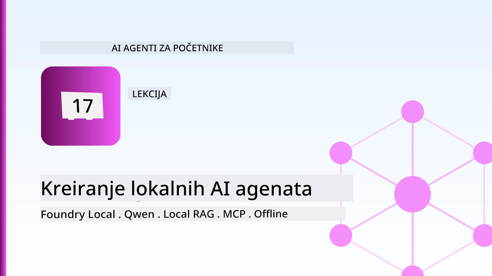
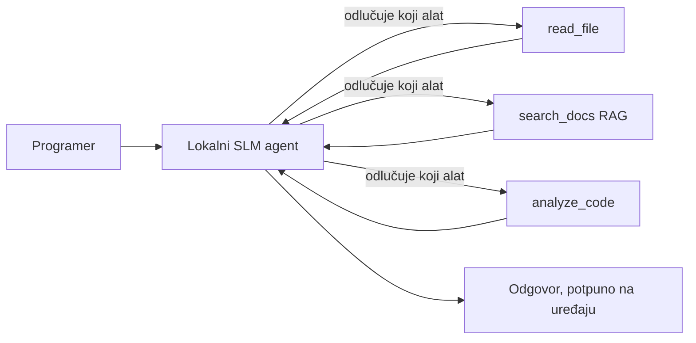
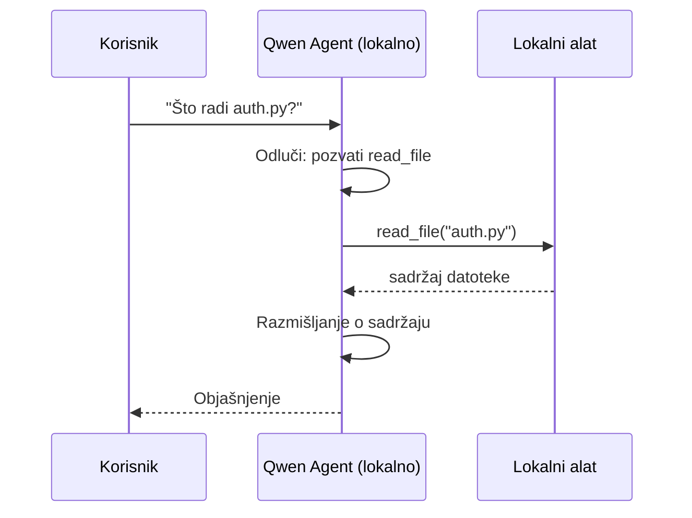
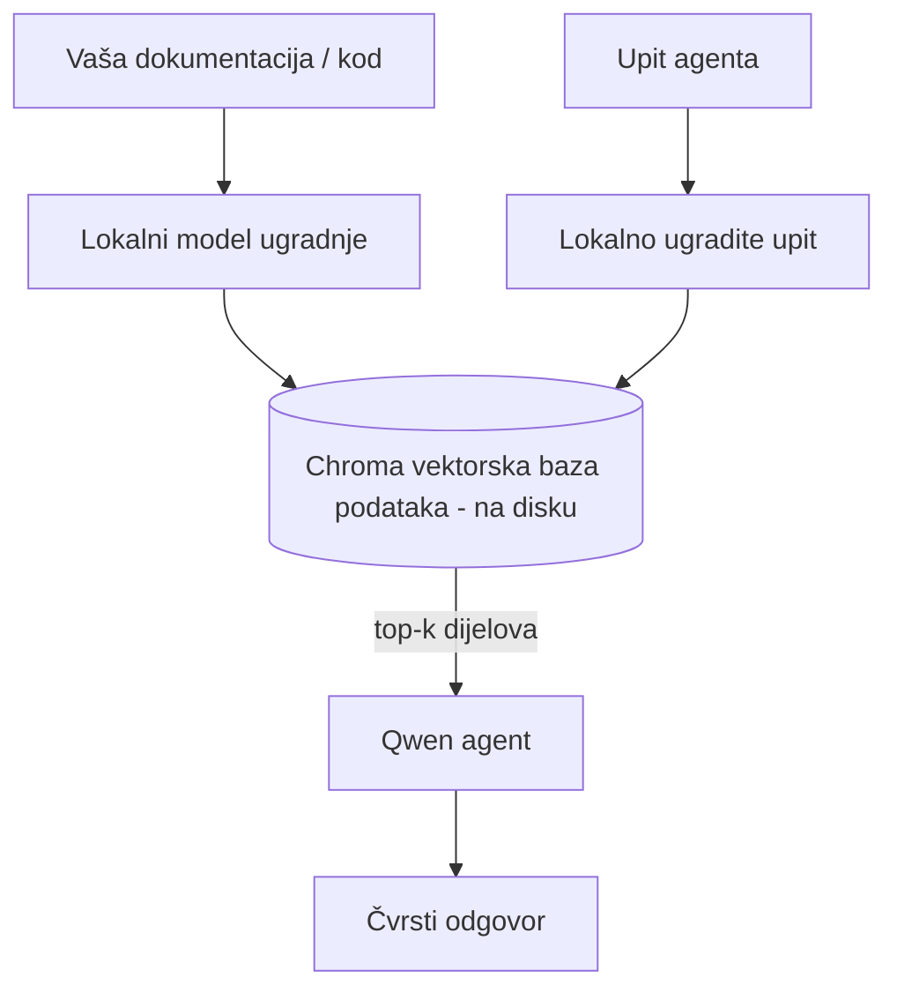
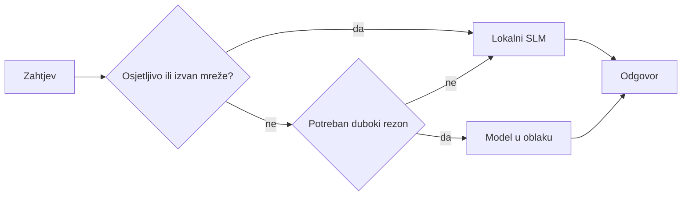

# Kreiranje lokalnih AI agenata pomoću Microsoft Foundry Local i Qwen



Prethodna lekcija je skalirala agente *prema gore* u oblak. Ova ih spušta *dolje* na jedan stroj. Do kraja ćete imati radnog inženjerskog asistenta koji razmišlja, poziva alate, čita vaše datoteke i pretražuje vašu dokumentaciju — **bez ijednog poziva za inferenciju u oblaku.**

Zašto biste to željeli? Tri razloga koja se stalno javljaju u stvarnom inženjerskom radu:

- **Privatnost.** Kod i dokumenti nikada ne napuštaju stroj. Nijedan upit, isječak, niti podaci o korisniku ne prelaze mrežnu granicu.
- **Trošak.** Lokalna inferencija nema naknadu po tokenu. Možete iterirati cijeli dan za cijenu električne energije.
- **Offline.** U zrakoplovu, u sigurnom objektu ili tijekom prekida, agent i dalje radi.

Ulov je u tome da mijenjate vrhunski oblačni model za **Mali jezični model (SLM)** koji radi na vašem CPU-u, GPU-u ili NPU-u. Ova lekcija je o gradnji agenata koji su *dobri* unutar tog ograničenja, a ne o pretvaranju da ograničenje ne postoji.

## Uvod

Ova lekcija će obuhvatiti:

- **Mali jezični modeli (SLM)** — što su, gdje sjaje i gdje ne.
- **Microsoft Foundry Local** — runtime koji preuzima i poslužuje modele lokalno putem **OpenAI-kompatibilnog API-ja**.
- **Qwen modeli za pozivanje funkcija** — SLM-ovi koji pouzdano proizvode pozive alata, što omogućava lokalne *agente* (ne samo lokalni chat).
- **Lokalni alati, lokalni RAG i lokalni MCP** — dajući agentu sposobnosti bez oblaka.
- **Hibridni obrasci** — kada zadržati stvari lokalno, a kada posegnuti za oblakom.

## Ciljevi učenja

Nakon završetka ove lekcije, znat ćete kako:

- Objasniti kompromise SLM-ova i odabrati odgovarajuće slučajeve korištenja lokalnih agenata.
- Poslužiti Qwen model lokalno koristeći Foundry Local i povezati se na njega putem OpenAI-kompatibilne točke pristupa.
- Izgraditi agenta za pozivanje alata koji radi potpuno na vašem radnom stroju.
- Dodati lokalni RAG preko vlastitih dokumenata korištenjem lokalne vektorske baze podataka (Chroma).
- Povezati agenta s lokalnim MCP serverom i razmišljati o hibridnim lokalnim/oblacnim dizajnima.

## Preduvjeti

Ova lekcija pretpostavlja da ste dovršili prethodne lekcije i da ste upoznati s:

- [Korištenjem alata](../04-tool-use/README.md) (Lekcija 4) i [Agentic RAG](../05-agentic-rag/README.md) (Lekcija 5).
- [Agentic protokoli / MCP](../11-agentic-protocols/README.md) (Lekcija 11).
- [Microsoft Agent Framework](../14-microsoft-agent-framework/README.md) (Lekcija 14).

Također ćete trebati:

- Radnu postaju za razvoj. **8 GB RAM-a je realan minimum**; 16 GB+ je udobno. GPU ili NPU pomaže, ali nije potreban.
- Instaliran **Microsoft Foundry Local** (pogledajte odjeljak za postavljanje u nastavku).
- Python 3.12+ i pakete u repozitoriju [`requirements.txt`](../../../requirements.txt), plus `foundry-local-sdk`, `openai` i `chromadb` za ovu lekciju.

## Mali jezični modeli: Pravi alat za lokalni rad

Vrhunski oblačni model ima stotine milijardi parametara i podatkovni centar iza sebe. SLM ima nekoliko milijardi parametara i mora stati u RAM vašeg prijenosnika. Ta razlika postavlja jasna očekivanja.

**SLM-ovi su dobri u:**

- Strukturiranim, ograničenim zadacima — klasifikacija, ekstrakcija, sažimanje poznatog dokumenta.
- **Pozivanje alata** — odlučivanje koju funkciju pozvati i s kojim argumentima.
- Brzoj, jeftinoj i privatnoj iteraciji na vlastitim podacima.

**SLM-ovi su slabiji u:**

- Otvorenim, višeskokovnim rezoniranjem kroz veliki kontekst.
- Širokom znanju o svijetu (vidjeli su manje, a zaboravljaju više).

Pobjednička strategija za lokalne agente je stoga: **neka SLM orkestrira, a neka alati obave teški posao.** Model ne mora *znati* vaš kod — mora znati kada pozvati `read_file` i `search_docs`. To ide izravno u snage SLM-a.



## Microsoft Foundry Local

**Microsoft Foundry Local** je lagani runtime koji preuzima, upravlja i poslužuje modele u potpunosti na vašem stroju. Njegova najvažnija značajka za nas je što izlaže **OpenAI-kompatibilnu HTTP točku pristupa** — što znači da OpenAI SDK i Microsoft Agent Frameworkov OpenAI klijent rade prema njemu samo promjenom `base_url`. Sve što ste naučili o izgradnji agenata prenosi se izravno; samo se točka pristupa premješta iz oblaka na `localhost`.

Foundry Local također automatski bira najbolju izvedbu modela za vaš hardver — CPU izvedbu, CUDA/GPU izvedbu ili NPU izvedbu — tako da ne morate ručno optimizirati za svaki stroj.

### Postavljanje

Instalirajte Foundry Local (pogledajte [dokumentaciju](https://learn.microsoft.com/azure/ai-foundry/foundry-local/) za vaš OS), zatim potvrdite da radi:

```bash
# Instalirajte (primjer; slijedite dokumentaciju za vašu platformu)
winget install Microsoft.FoundryLocal      # Windows
# brew install microsoft/foundrylocal/foundrylocal   # macOS

# Preuzmite i pokrenite Qwen model, zatim pokrenite lokalnu uslugu
foundry model run qwen2.5-7b-instruct
foundry service status
```

Jednom kad je usluga pokrenuta, imate lokalnu, OpenAI-kompatibilnu točku pristupa (obično `http://localhost:PORT/v1`). Bilježnica koristi `foundry-local-sdk` za automatsko otkrivanje točke pristupa, pa ne morate ručno kodirati port.

## Qwen pozivanje funkcija: Zašto je važno

Agent je agent samo ako može pozivati alate. Mnogi SLM-ovi mogu chatati, ali proizvode nepouzdane, nepravilne pozive alata. **Qwen** modeli su trenirani za pozivanje funkcija i dosljedno emitiraju ispravno oblikovane strukture poziva alata — i to je ono što lokalni chat model pretvara u lokalnog *agenta*.

Tok je standardna petlja pozivanja alata koju već poznajete, samo što radi lokalno:



## Lokalni RAG

Pretraživanje dokumentacije je gdje lokalni agenti pokazuju svoju vrijednost. Umjesto da se nadate da je SLM zapamtio dokumentaciju vašeg okvira, ugrađujete te dokumente u **lokalnu vektorsku bazu podataka** i dopuštate agentu da dohvati relevantne dijelove na zahtjev.

Koristimo **Chroma**, ugrađenu vektorsku pohranu koja radi u procesu bez potrebe za serverom za upravljanje. Cijeli pipeline je lokalni: lokalni model za ugradnju → lokalni vektori → lokalno pretraživanje → lokalni SLM.



Ovo je isti Agentic RAG obrazac iz Lekcije 5 — jedina promjena je da svaki komponent radi na vašem stroju.

## Lokalni MCP serveri

[MCP](../11-agentic-protocols/README.md) je transport, a ne oblačna usluga. MCP server može raditi kao lokalni proces na `stdio`, izlažući alate vašem agentu preko standardnog protokola. To vam omogućava ponovno korištenje rastućeg ekosustava MCP servera — pristup datotečnom sustavu, git operacije, upiti baze podataka — potpuno offline.

Sigurnosni položaj je drugačiji nego u oblaku, ali nije odsutan: lokalni MCP server i dalje radi s dopuštenjima vašeg korisnika, pa ograničite što može dohvatiti (direktorij projekta, ne cijelu vašu početnu mapu) i tretirajte njegove izlaze kao ulaze koje treba provjeriti.

## Hibridni obrasci rada u oblaku i lokalno

Lokalno-prvo ne znači samo lokalno. Zreli sustavi usmjeravaju ovisno o osjetljivosti i težini:

| Situacija | Gdje se izvršava |
| --- | --- |
| Osjetljiv kod / podaci, ili offline | **Lokalni SLM** |
| Jednostavan, ograničen zadatak | **Lokalni SLM** (jeftino, brzo) |
| Teško višeskokovno rezoniranje na neosjetljivim podacima | **Oblačni model** |
| Sve tijekom prekida | **Lokalni SLM** (nježno smanjenje kvalitete) |

Ovo odražava ideju **usmjeravanja modela** iz Lekcije 16 — osim što je jedan od "modela" sada vaš vlastiti stroj. Robustan dizajn se vraća na lokalno kad oblak nije dostupan, tako da agent pogoršava kvalitetu, a ne da potpuno zakaže.



## Praktična radionica: Lokalni inženjerski asistent

Otvorite [`code_samples/17-local-agent-foundry-local.ipynb`](./code_samples/17-local-agent-foundry-local.ipynb) i radite kroz njega. Izgradit ćete **lokalnog inženjerskog asistenta** koji radi potpuno na vašem radnom stroju i može:

1. **Pozivati alate** — preko Qwen poziva funkcijama putem Foundry Local.
2. **Izvršavati lokalne operacije s datotekama** — listati i čitati datoteke u direktoriju projekta.
3. **Analizirati kod** — izvještavati osnovne metrike o izvornim datotekama.
4. **Pretraživati dokumentaciju** — lokalni RAG preko mape s dokumentima koristeći Chroma.
5. **Koristiti MCP** — povezati se na lokalni MCP server (s nježnim preskakanjem ako nije konfiguriran).

Ni u jednom trenutku nije korištena inferencija iz oblaka.

### Vodič kroz rad

Asistent se povezuje na Foundry Local putem OpenAI-kompatibilne točke pristupa, tako da agentski kod izgled gotovo isto kao u lekcijama za oblak — samo se mijenja klijent:

```python
from foundry_local import FoundryLocalManager
from openai import OpenAI

# Foundry Local pronalazi/preuzima model i daje nam lokalnu krajnju točku.
manager = FoundryLocalManager(\"qwen2.5-7b-instruct\")
client = OpenAI(base_url=manager.endpoint, api_key=manager.api_key)  # api_key je lokalni privremeni označivač
```

Alati su uobičajene Python funkcije ograničene na direktorij projekta:

```python
def read_file(path: str) -> str:
    \"\"\"Read a file, but only inside the sandboxed project directory.\"\"\"
    full = (PROJECT_ROOT / path).resolve()
    if PROJECT_ROOT not in full.parents and full != PROJECT_ROOT:
        return \"Access denied: path is outside the project directory.\"
    return full.read_text(encoding=\"utf-8\")
```

Obratite pažnju na provjeru sandboxa — čak i lokalno, alat koji čita proizvoljne putanje može predstavljati sigurnosni rizik. Bilježnica ograničava svaki alat na jedan korijen projekta.

## Provjera znanja

Testirajte svoje razumijevanje prije prelaska na zadatak.

**1. Navedite dva konkretna razloga za pokretanje agenta lokalno umjesto u oblaku.**

<details>
<summary>Odgovor</summary>

Bilo koja dva od: **privatnost** (kod i podaci nikada ne napuštaju stroj), **trošak** (nema naknade po tokenu za inferenciju) i **mogućnost rada offline** (radi bez mreže — u zrakoplovu, u sigurnom objektu ili tijekom prekida). Regulativna/zakonska ograničenja koja zabranjuju slanje podataka s uređaja su čest razlog za privatnost.
</details>

**2. Koja je preporučena podjela rada između SLM-a i njegovih alata u lokalnom agentu, i zašto?**

<details>
<summary>Odgovor</summary>

Neka SLM **orkestrira** (odlučuje koji alat pozvati i s kojim argumentima), a neka **alati obave teški posao** (čitaju datoteke, dohvaćaju dokumente, računaju rezultate). SLM-ovi su jaki u ograničenim odlukama poput odabira alata, ali slabiji u širokom znanju i dugom višeskokovnom rezoniranju, pa oslanjanje na alate ide u njihovu korist.
</details>

**3. Što omogućuje ponovno korištenje koda za agent iz oblaka s Foundry Local?**

<details>
<summary>Odgovor</summary>

Foundry Local izlaže **OpenAI-kompatibilnu HTTP točku pristupa**. OpenAI SDK i Agent Frameworkov OpenAI klijent rade prema njoj samo promjenom `base_url` (i korištenjem lokalnog privremenog API ključa). Sve ostalo u kodu agenta ostaje isto.
</details>

**4. Zašto koristimo specifično Qwen model za pozivanje funkcija, a ne bilo koji SLM?**

<details>
<summary>Odgovor</summary>

Zato što agent mora proizvesti pouzdane, ispravno oblikovane **pozive alata**. Mnogi SLM-ovi mogu chatati, ali emitiraju neispravne ili nekonzistentne strukture poziva alata. Qwen modeli su trenirani za pozivanje funkcija i proizvode dosljedne pozive alata, što lokalni chat model pretvara u radnog lokalnog agenta.
</details>

**5. Koji se dijelovi pipelinea lokalnog RAG-a izvode na stroju?**

<details>
<summary>Odgovor</summary>

Svi dijelovi: model za ugradnju, vektorska baza podataka (Chroma, na disku), korak pretraživanja i SLM. Dokumenti se ugrađuju lokalno, pohranjuju lokalno, dohvaćaju lokalno i rezonira se nad njima lokalnim modelom — nijedna komponenta ne dodiruje oblak.
</details>

**6. Lokalni MCP server radi na vašem stroju. Znači li to automatski da je siguran? Koju mjeru opreza još trebate poduzeti?**

<details>
<summary>Odgovor</summary>

Ne. Lokalni MCP server radi s dopuštenjima vašeg korisnika, tako da može pristupiti bilo čemu što i vi možete. Ograničite ga na ono što treba (na primjer, jedan direktorij projekta, a ne cijelu početnu mapu) i tretirajte njegov izlaz kao ulaz koji treba provjeriti prije korištenja.
</details>

**7. Opišite smisleno pravilo hibridnog usmjeravanja koje uključuje lokalni model.**

<details>
<summary>Odgovor</summary>

Usmjerite osjetljive ili offline zahtjeve lokalnom SLM-u; jednostavne ograničene zadatke lokalnom SLM-u radi brzine i cijene; teško višeskokovno rezoniranje na neosjetljivim podacima oblačnom modelu; i pitajte lokalnog SLM-a ako oblak nije dostupan tako da agent nježno degradira umjesto da potpuno zakaže. Ovo je usmjeravanje modela (Lekcija 16) pri čemu je lokalni stroj jedan od modela.
</details>

**8. Koja je realna minimalna količina RAM-a za pokretanje lokalnog agenta u ovoj lekciji i što dobivate s više RAM-a?**

<details>
<summary>Odgovor</summary>

Oko **8 GB** je realan minimum; 16 GB+ je udobno. Više RAM-a omogućava vam da pokrećete veće, sposobnije modele i držite više konteksta u memoriji. GPU ili NPU ubrzavaju inferenciju, ali nisu nužni — Foundry Local odabire CPU izvedbu ako nema dostupnog akceleratora.
</details>

## Zadatak

Proširite lokalnog inženjerskog asistenta u **lokalnog recenzenta dokumentacije** za mali projekt po vašem izboru (ako želite, koristite jedan od lekcijskih foldera ovog repozitorija).

Vaš rad trebao bi:

1. **Indeksirati stvarni folder s dokumentacijom/kodom** u Chroma-u (najmanje pet datoteka).
2. **Dodati alat `find_todos`** koji pretražuje projekt za komentare `TODO`/`FIXME` i vraća ih s nazivom datoteke i brojem retka — s istom provjerom sandboxa kao i `read_file`.

3. **Postavite agentu tri pitanja** koja ga tjeraju da kombinira alate: jedno čisto RAG pitanje, jedno koje zahtijeva čitanje određenog fajla, i jedno koje zahtijeva pronalaženje TODO-a.
4. **Izmjerite**: zabilježite vrijeme svakog od tri odgovora u markdown ćeliji. Komentirajte je li kašnjenje prihvatljivo za vaš namijenjeni tijek rada.

Zatim napišite kratak paragraf o **što biste premjestili u oblak, a što biste zadržali lokalno** za ovog recenzenta, i zašto. Vaša ocjena ovisi o tome jesu li lokalne komponente ispravno povezane i je li vaša hibridna logika ispravna — a ne o kvaliteti modela.

## Sažetak

U ovoj lekciji ste izgradili agenta koji se u potpunosti pokreće na vašem računalu:

- **SLM-ovi** žrtvuju širinu znanja za privatnost, troškove i offline rad — i briljiraju kada **orkestriraju alate** umjesto da sami nose sve znanje.
- **Foundry Local** servisira modele na uređaju iza **OpenAI-kompatibilnog endpointa**, pa se vaš cloud agent kod prenosi jednom linijskom promjenom.
- **Qwen modeli za pozivanje funkcija** omogućuju pouzdano lokalno pozivanje alata — i time lokalne *agente*.
- **Lokalni RAG** (Chroma) i **lokalni MCP** daju agentu sposobnosti bez napuštanja uređaja.
- **Hibridni obrasci** omogućuju usmjeravanje po osjetljivosti i težini, s lokalnim kao elegantnim rezervnim rješenjem.

Time je dovršen arc implementacije: Lekcija 16 je skalirala agente u Microsoft Foundry, a ova lekcija ih je skalirala na jednu radnu stanicu. Sljedeća lekcija bavi se sigurnošću implementiranih agenata.

## Dodatni resursi

- <a href="https://learn.microsoft.com/azure/ai-foundry/foundry-local/" target="_blank">Microsoft Foundry Local dokumentacija</a>
- <a href="https://learn.microsoft.com/azure/ai-foundry/what-is-azure-ai-foundry" target="_blank">Microsoft Foundry dokumentacija</a>
- <a href="https://learn.microsoft.com/en-us/agent-framework/overview/?wt.mc_id=youtube_26688_organicsocial_reactor&pivots=programming-language-python" target="_blank">Microsoft Agent Framework</a>
- <a href="https://qwen.readthedocs.io/en/latest/framework/function_call.html" target="_blank">Dokumentacija o Qwen pozivanju funkcija</a>
- <a href="https://modelcontextprotocol.io/" target="_blank">Model Context Protocol (MCP)</a>
- <a href="https://docs.trychroma.com/" target="_blank">Chroma vektorska baza podataka</a>

## Prethodna lekcija

[Deploying Scalable Agents](../16-deploying-scalable-agents/README.md)

## Sljedeća lekcija

[Securing AI Agents](../18-securing-ai-agents/README.md)

---

<!-- CO-OP TRANSLATOR DISCLAIMER START -->
**Napomena**:
Ovaj dokument je preveden korištenjem AI prevoditeljskog servisa [Co-op Translator](https://github.com/Azure/co-op-translator). Iako težimo točnosti, imajte na umu da automatski prijevodi mogu sadržavati greške ili netočnosti. Izvorni dokument na izvornom jeziku treba smatrati autoritativnim izvorom. Za važne informacije preporuča se profesionalni ljudski prijevod. Nismo odgovorni za bilo kakva nesporazumevanja ili pogrešne interpretacije koje proizlaze iz korištenja ovog prijevoda.
<!-- CO-OP TRANSLATOR DISCLAIMER END -->