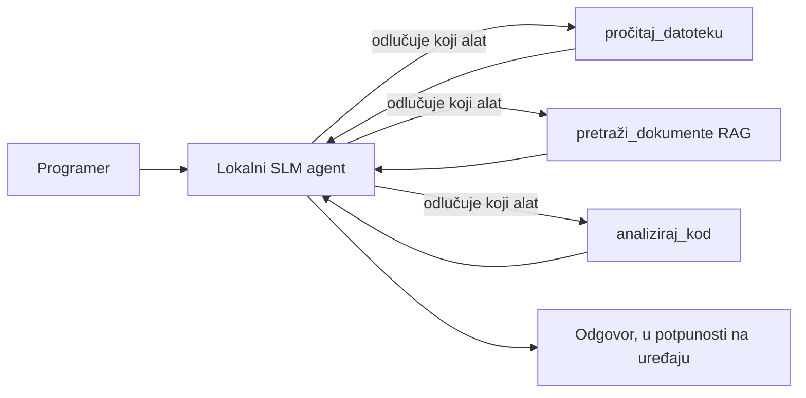
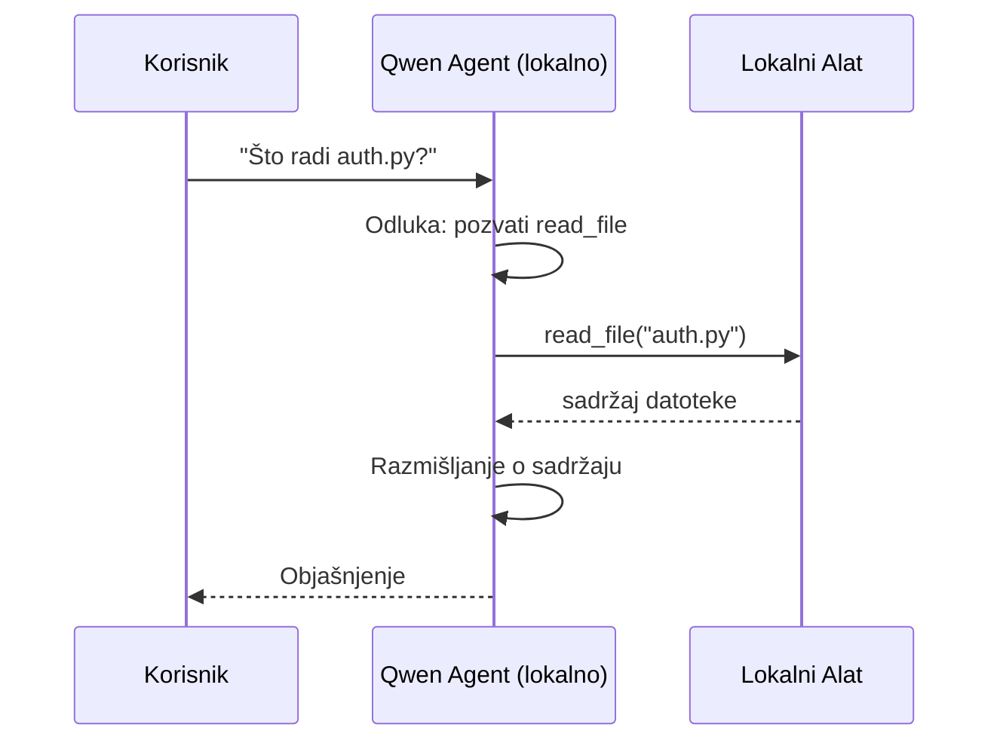
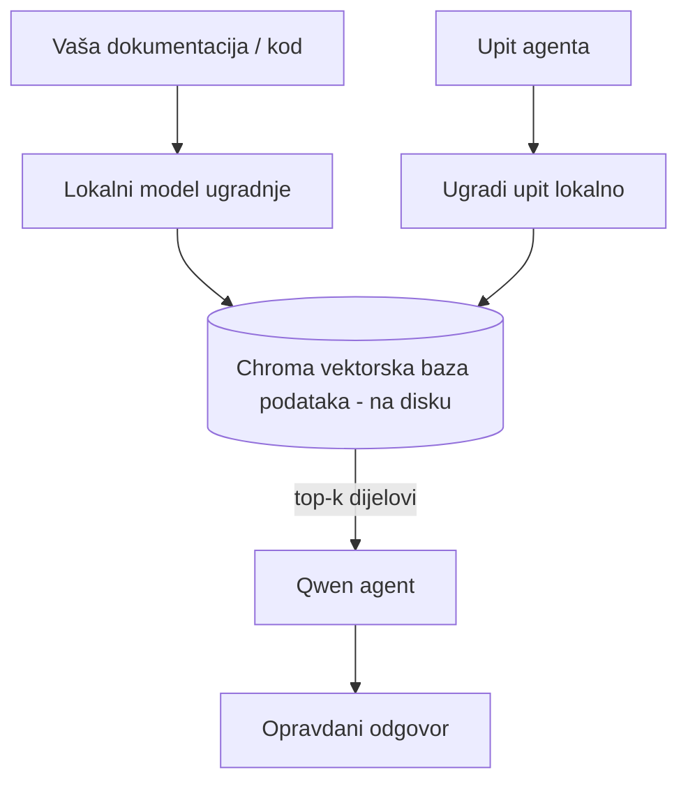
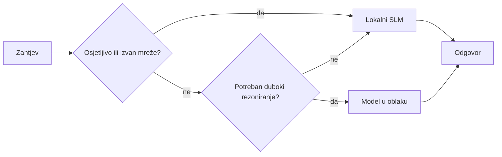

# Kreiranje lokalnih AI agenata koristeći Microsoft Foundry Local i Qwen


Prethodna lekcija je skalirala agente *prema gore* u oblak. Ova ih spušta *dolje* na jedan stroj. Na kraju ćete imati funkcionalnog inženjerskog asistenta koji razmišlja, zove alate, čita vaše datoteke i pretražuje vašu dokumentaciju — **bez ijednog poziva na inference u oblaku.**

Zašto biste to željeli? Tri razloga koja se stalno pojavljuju u stvarnom inženjerskom radu:

- **Privatnost.** Kod i dokumenti nikada ne napuštaju stroj. Nijedan upit, nijedan isječak, nijedan podatak o korisniku ne prelazi mrežnu granicu.
- **Trošak.** Lokalna inference nema naplatu po tokenu. Možete iterirati cijeli dan za cijenu električne energije.
- **Izvan mreže.** U zrakoplovu, u sigurnom objektu ili tijekom prekida rada, agent i dalje radi.

Pravilo je da mijenjate vodoravni cloud model za **Mali jezični model (SLM)** koji radi na vašem CPU-u, GPU-u ili NPU-u. Ova lekcija je o izgradnji agenata koji su *dobri* unutar tog ograničenja, a ne da se pretvarate da ograničenje ne postoji.

## Uvod

Ova lekcija će obuhvatiti:

- **Mali jezični modeli (SLM-ovi)** — što su, gdje briljiraju i gdje ne.
- **Microsoft Foundry Local** — runtime koji preuzima i servira modele na uređaju putem **OpenAI-kompatibilnog API-ja**.
- **Qwen modeli za pozivanje funkcija** — SLM-ovi koji pouzdano proizvode pozive alata, što omogućuje lokalne *agente* (ne samo lokalni chat).
- **Lokalni alati, lokalni RAG i lokalni MCP** — daju agentu sposobnosti bez oblaka.
- **Hibridni obrasci** — kada zadržati stvari lokalnima, a kada posegnuti za oblakom.

## Ciljevi učenja

Nakon dovršetka ove lekcije, znat ćete kako:

- Objasniti kompromise SLM-ova i odabrati odgovarajuće slučajeve uporabe lokalnih agenata.
- Poslužiti Qwen model lokalno s Foundry Local i povezati se kroz OpenAI-kompatibilnu krajnju točku.
- Izgraditi agenta za pozivanje alata koji radi u potpunosti na vašoj radnoj stanici.
- Dodati lokalni RAG preko vlastitih dokumenata koristeći lokalnu vektorsku bazu podataka (Chroma).
- Povezati agenta s lokalnim MCP serverom i razmišljati o hibridnim lokalno/oblačnim dizajnima.

## Preduvjeti

Ova lekcija pretpostavlja da ste dovršili prethodne lekcije i da ste upoznati s:

- [Korištenjem alata](../04-tool-use/README.md) (Lekcija 4) i [Agentic RAG](../05-agentic-rag/README.md) (Lekcija 5).
- [Agentic protokoli / MCP](../11-agentic-protocols/README.md) (Lekcija 11).
- [Microsoft Agent Framework](../14-microsoft-agent-framework/README.md) (Lekcija 14).

Također će vam trebati:

- Radna stanica za razvoj. **8 GB RAM-a je realistični minimum**; 16 GB+ je ugodno. GPU ili NPU pomaže, ali nije obavezno.
- Instaliran **Microsoft Foundry Local** (pogledajte odjeljak za postavljanje dolje).
- Python 3.12+ i paketi iz repozitorija [`requirements.txt`](../../../requirements.txt), plus `foundry-local-sdk`, `openai` i `chromadb` za ovu lekciju.

## Mali jezični modeli: Pravi alat za lokalni rad

Vodeći oblačni model ima stotine milijardi parametara i podatkovni centar iza sebe. SLM ima nekoliko milijardi parametara i mora stati u RAM vašeg prijenosnog računala. Ta razlika postavlja jasna očekivanja.

**SLM-ovi su dobri u:**

- Strukturiranima, ograničenim zadacima — klasifikacija, ekstrakcija, sažetak poznatog dokumenta.
- **Pozivanju alata** — odlučivanju koju funkciju pozvati i s kojim argumentima.
- Brzoj, jeftinoj i privatnoj iteraciji na vlastitim podacima.

**SLM-ovi su slabiji u:**

- Otvorenim, višeslojim zaključivanjem kroz veliki kontekst.
- Širokom svijetu znanja (vidjeli su manje, i zaboravljaju više).

Dakle, pobjednička strategija za lokalne agente je: **dopustite SLM-u da orkestrira, a alatima da obave teški posao.** Model ne mora *znati* vaš kod — mora znati kada pozvati `read_file` i `search_docs`. To direktno igra u korist SLM-ovih snaga.



## Microsoft Foundry Local

**Microsoft Foundry Local** je lagani runtime koji preuzima, upravlja i poslužuje modele u potpunosti na vašem računalu. Njegova najvažnija značajka za nas je što izlaže **OpenAI-kompatibilnu HTTP krajnju točku** — što znači da OpenAI SDK i Microsoft Agent Framework-ov OpenAI klijent rade s njom s promjenom samo `base_url`. Sve što ste naučili o izgradnji agenata prenosi se izravno; samo se krajnja točka pomiče iz oblaka na `localhost`.

Foundry Local također automatski odabire najbolju verziju modela za vaš hardver — CPU verziju, CUDA/GPU verziju ili NPU verziju — tako da ne morate ručno optimizirati po stroju.

### Postavljanje

Instalirajte Foundry Local (pogledajte [dokumentaciju](https://learn.microsoft.com/azure/ai-foundry/foundry-local/) za vaš OS), zatim provjerite radi li:

```bash
# Instalirajte (primjer; slijedite dokumentaciju za vašu platformu)
winget install Microsoft.FoundryLocal      # Windows
# brew install microsoft/foundrylocal/foundrylocal   # macOS

# Preuzmite i pokrenite Qwen model, zatim pokrenite lokalnu uslugu
foundry model run qwen2.5-7b-instruct
foundry service status
```

Kad je servis pokrenut imate lokalnu, OpenAI-kompatibilnu krajnju točku (tipično `http://localhost:PORT/v1`). Bilježnica koristi `foundry-local-sdk` da automatski otkrije krajnju točku, tako da ne morate ručno kodirati port.

## Qwen pozivanje funkcija: Zašto je važno

Agent je agent samo ako može pozivati alate. Mnogi SLM-ovi mogu chatati, ali proizvode nepouzdane, nepravilne pozive alata. **Qwen** modeli su trenirani za pozivanje funkcija i dosljedno emitirju pravilno oblikovane pozive alata — što točno pretvara lokalni chat model u lokalnog *agenta*.

Tijek je standardna petlja pozivanja alata koja vam je već poznata, samo što radi na uređaju:



## Lokalni RAG

Pretraživanje dokumentacije je gdje lokalni agenti odrađuju svoj posao. Umjesto da se nadate da je SLM zapamtio dokumentaciju vašeg okvira, ugrađujete te dokumente u **lokalnu vektorsku bazu podataka** i dopuštate agentu da po potrebi dohvaća relevantne dijelove.

Koristimo **Chromu**, ugrađenu vektorsku pohranu koja radi unutar procesa bez potrebe za serverom. Cijeli tijek je lokalni: lokalni model za ugradnju → lokalni vektori → lokalno dohvaćanje → lokalni SLM.



Ovo je isti Agentic RAG obrazac iz Lekcije 5 — jedina promjena je da svaki dio radi na vašem stroju.

## Lokalni MCP serveri

[MCP](../11-agentic-protocols/README.md) je transport, a ne oblačna usluga. MCP server može raditi kao lokalni proces na `stdio`, izlažući alate vašem agentu preko standardnog protokola. To vam omogućuje ponovno korištenje rastućeg ekosustava MCP servera — pristup datotečnom sustavu, git operacije, baze podataka — u potpunosti offline.

Sigurnosni pristup je drugačiji nego u oblaku, ali nije odsutan: lokalni MCP server i dalje radi s vašim korisničkim pravima, zato ograničite što može pristupiti (direktorij projekta, a ne cijelu vašu kućnu mapu) i tretirajte njegove izlaze kao ulaze koje treba validirati.

## Hibridni obrasci lokalno i u oblaku

Lokalno-prvo ne znači samo lokalno. Zreli sustavi usmjeravaju prema osjetljivosti i težini:

| Situacija | Gdje radi |
| --- | --- |
| Osjetljiv kod / podaci ili offline | **Lokalni SLM** |
| Jednostavan, ograničen zadatak | **Lokalni SLM** (jeftino, brzo) |
| Teško višeslojno zaključivanje na neosjetljivim podacima | **Model u oblaku** |
| Sve, tijekom prekida | **Lokalni SLM** (nježno degradiranje) |

Ovo odražava ideju **usmjeravanja modela** iz Lekcije 16 — osim što je jedan od "modela" sada vaš vlastiti stroj. Robustan dizajn se prebacuje na lokalno kad oblak nije dostupan, tako agent pada u kvaliteti umjesto da potpuno zakaže.



## Praktična radionica: lokalni inženjerski asistent

Otvorite [`code_samples/17-local-agent-foundry-local.ipynb`](./code_samples/17-local-agent-foundry-local.ipynb) i radite kroz nju. Izgradit ćete **lokalnog inženjerskog asistenta** koji radi potpuno na vašoj radnoj stanici i može:

1. **Pozivati alate** — putem Qwen pozivanja funkcija kroz Foundry Local.
2. **Obavljati lokalne datotečne operacije** — listati i čitati datoteke u direktoriju projekta.
3. **Analizirati kod** — izvještavati osnovne metrike na izvornoj datoteci.
4. **Pretraživati dokumentaciju** — lokalni RAG preko dokumentacije u mapi s Chromom.
5. **Koristiti MCP** — povezati se na lokalni MCP server (uz nježno preskakanje ako nije konfiguriran).

Nije korištena nimalo inference u oblaku.

### Objašnjenje

Asistent se povezuje na Foundry Local kroz OpenAI-kompatibilnu krajnju točku, pa kod agenta izgleda gotovo identično kao u oblačnim lekcijama — samo se klijent mijenja:

```python
from foundry_local import FoundryLocalManager
from openai import OpenAI

# Foundry Local otkriva/preuzima model i daje nam lokalnu završnu točku.
manager = FoundryLocalManager(\"qwen2.5-7b-instruct\")
client = OpenAI(base_url=manager.endpoint, api_key=manager.api_key)  # api_key je lokalni privremeni pokazivač
```

Alati su obične Python funkcije ograničene na direktorij projekta:

```python
def read_file(path: str) -> str:
    \"\"\"Read a file, but only inside the sandboxed project directory.\"\"\"
    full = (PROJECT_ROOT / path).resolve()
    if PROJECT_ROOT not in full.parents and full != PROJECT_ROOT:
        return \"Access denied: path is outside the project directory.\"
    return full.read_text(encoding=\"utf-8\")
```

Primijetite provjeru sandboxa — čak i lokalno, alat koji čita proizvoljne putanje je rizik. Bilježnica drži svaki alat ograničenim na korijen jednog projekta.

## Provjera znanja

Testirajte svoje razumijevanje prije prelaska na zadatak.

**1. Navedite dva konkretna razloga za pokretanje agenta lokalno umjesto u oblaku.**

<details>
<summary>Odgovor</summary>

Bilo koja dva od: **privatnost** (kod i podaci nikada ne napuštaju stroj), **trošak** (nema naplate po tokenu za inference) i **mogućnost rada offline** (radi bez mreže — u zrakoplovu, u sigurnom objektu ili tijekom prekida). Regulatorna/pridržavajuća ograničenja koja zabranjuju slanje podataka s uređaja često su temelj razloga privatnosti.
</details>

**2. Koja je preporučena podjela rada između SLM-a i njegovih alata u lokalnom agentu i zašto?**

<details>
<summary>Odgovor</summary>

Dopustite da SLM **orkestrira** (odlučuje kojeg alata pozvati i s kojim argumentima) a da **alatima prepustite težak posao** (čitanje datoteka, dohvaćanje dokumenata, računske rezultate). SLM-ovi su snažni u ograničenim odlukama poput odabira alata, ali slabiji u općem znanju i dugom višeslojnom zaključivanju, pa oslanjanje na alate igra u njihovu korist.
</details>

**3. Što omogućuje ponovno korištenje kod agenta za oblak s Foundry Local?**

<details>
<summary>Odgovor</summary>

Foundry Local izlaže **OpenAI-kompatibilnu HTTP krajnju točku**. OpenAI SDK i Agent Framework-ov OpenAI klijent rade s njom samo mijenjajući `base_url` (i koristeći lokalni privremeni API ključ). Sve ostalo u kodu agenta ostaje isto.
</details>

**4. Zašto koristimo posebno Qwen model za pozivanje funkcija, a ne bilo koji SLM?**

<details>
<summary>Odgovor</summary>

Zato što agent mora proizvesti pouzdane i pravilno oblikovane **pozive alata**. Mnogi SLM-ovi mogu chatati, ali proizvode nepravilne ili nedosljedne strukture poziva alata. Qwen modeli su trenirani za pozivanje funkcija i konzistentno proizvode pozive alata, što pretvara lokalni chat model u funkcionalnog lokalnog agenta.
</details>

**5. Koji dijelovi u lokalnom RAG tijeku rade na stroju?**

<details>
<summary>Odgovor</summary>

Svi: model za ugradnju, vektorska baza podataka (Chroma, na disku), korak dohvaćanja i SLM. Dokumenti se ugrađuju lokalno, pohranjuju lokalno, dohvaćaju lokalno i analiziraju lokalnim modelom — nijedan dio ne dira oblak.
</details>

**6. Lokalni MCP server radi na vašem stroju. Čini li to automatski sigurnim? Koju mjeru opreza biste još trebali poduzeti?**

<details>
<summary>Odgovor</summary>

Ne. Lokalni MCP server radi s vašim korisničkim ovlastima, pa može pristupiti svemu što vi možete. Ograničite mu pristup na ono što treba (na primjer, jedan direktorij projekta, a ne cijelu vašu kućnu mapu) i tretirajte njegove izlaze kao ulaze koje treba validirati prije nego što na njima djelujete.
</details>

**7. Opišite razuman hibridni pravilo usmjeravanja koje uključuje lokalni model.**

<details>
<summary>Odgovor</summary>

Usmjerite osjetljive ili offline zahtjeve na lokalni SLM; jednostavne ograničene zadatke usmjerite na lokalni SLM zbog brzine i troška; zahtjeve za teškim višeslojnim zaključivanjem o neosjetljivim podacima usmjerite na model u oblaku; i vratite se lokalnom SLM-u ako oblak nije dostupan tako da agent lijepo degradira umjesto da zakaže. Ovo je usmjeravanje modela (Lekcija 16) s lokalnim računalom kao jednim od modela.
</details>

**8. Koja je realistična minimalna količina RAM-a za pokretanje lokalnog agenta u ovoj lekciji i što vam donosi više RAM-a?**

<details>
<summary>Odgovor</summary>

Otprilike **8 GB** je realistični minimum; 16 GB+ je ugodno. Više RAM-a omogućuje pokretanje većih, sposobnijih modela i držanje više konteksta u memoriji. GPU ili NPU ubrzava inference, ali nije potreban — Foundry Local bira CPU verziju ako nema dostupnog akceleratora.
</details>

## Zadatak

Proširite lokalnog inženjerskog asistenta u **lokalnog recenzenta dokumentacije** za mali projekt po vašem izboru (koristite jednu od lekcija ovog repozitorija ako želite).

Vaša predaja treba:

1. **Indeksirati stvarni direktorij dokumenata/koda** u Chromu (najmanje pet datoteka).
2. **Dodati alat `find_todos`** koji pretražuje projekt za `TODO`/`FIXME` komentare i vraća ih s imenom datoteke i brojem retka — zadržavajući istu provjeru sandboxa kao i `read_file`.

3. **Postavite agentu tri pitanja** koja ga prisiljavaju da kombinira alate: jedno čisto RAG pitanje, jedno koje zahtijeva čitanje određenog datoteke, i jedno koje zahtijeva pronalaženje TODO-a.
4. **Izmjerite to**: izmjerite vrijeme svakog od tri odgovora i zabilježite ih u markdown ćeliju. Komentirajte je li latencija prihvatljiva za vaš namjeravani radni tijek.

Zatim napišite kratak odlomak o **što biste premjestili u oblak, a što biste zadržali lokalno** za ovog recenzenta i zašto. Ocjenjujete se na temelju toga jesu li lokalne komponente ispravno povezane i je li vaše hibridno rezoniranje smisleno — a ne na kvaliteti modela.

## Sažetak

U ovoj lekciji ste izgradili agenta koji radi u potpunosti na vašem vlastitom računalu:

- **SLM-ovi** zamjenjuju širinu privatnošću, cijenom i radom bez veze — i izvrsni su kad **orkestriraju alate** umjesto da sami nose sve znanje.
- **Foundry Local** poslužuje modele na uređaju iza **OpenAI-kompatibilne krajnje točke**, tako da vaš kod agenta u oblaku prenosi se s jednom linijom promjene.
- **Qwen modeli za pozivanje funkcija** omogućuju pouzdano lokalno pozivanje alata — a samim time lokalne *agente*.
- **Lokalni RAG** (Chroma) i **lokalni MCP** daju agentu sposobnost bez napuštanja računala.
- **Hibridni obrasci** omogućuju usmjeravanje prema osjetljivosti i složenosti, s lokalnim kao elegantnim rezervnim rješenjem.

Ovo završava luk implementacije: Lekcija 16 je skalirala agente u Microsoft Foundry, a ova lekcija ih je skalirala natrag na jedno radno mjesto. Sljedeća lekcija obrađuje sigurnost implementiranih agenata.

## Dodatni resursi

- <a href="https://learn.microsoft.com/azure/ai-foundry/foundry-local/" target="_blank">Microsoft Foundry Local dokumentacija</a>
- <a href="https://learn.microsoft.com/azure/ai-foundry/what-is-azure-ai-foundry" target="_blank">Microsoft Foundry dokumentacija</a>
- <a href="https://learn.microsoft.com/en-us/agent-framework/overview/?wt.mc_id=youtube_26688_organicsocial_reactor&pivots=programming-language-python" target="_blank">Microsoft Agent Framework</a>
- <a href="https://qwen.readthedocs.io/en/latest/framework/function_call.html" target="_blank">Qwen dokumentacija za pozivanje funkcija</a>
- <a href="https://modelcontextprotocol.io/" target="_blank">Model Context Protocol (MCP)</a>
- <a href="https://docs.trychroma.com/" target="_blank">Chroma vektorska baza podataka</a>

## Prethodna lekcija

[Implementacija skalabilnih agenata](../16-deploying-scalable-agents/README.md)

## Sljedeća lekcija

[Osiguravanje AI agenata](../18-securing-ai-agents/README.md)

---

<!-- CO-OP TRANSLATOR DISCLAIMER START -->
**Napomena**:
Ovaj dokument je preveden korištenjem AI prevoditeljskog servisa [Co-op Translator](https://github.com/Azure/co-op-translator). Iako težimo točnosti, imajte na umu da automatski prijevodi mogu sadržavati greške ili netočnosti. Izvorni dokument na izvornom jeziku treba smatrati autoritativnim izvorom. Za važne informacije preporuča se profesionalni ljudski prijevod. Nismo odgovorni za bilo kakva nesporazumevanja ili pogrešne interpretacije koje proizlaze iz korištenja ovog prijevoda.
<!-- CO-OP TRANSLATOR DISCLAIMER END -->