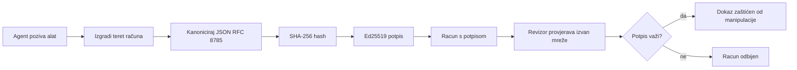
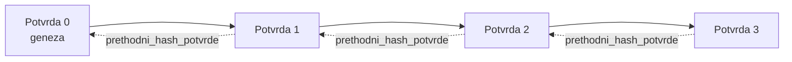

[Watch the lesson video: Osiguravanje AI agenata pomoću kriptografskih potvrda](https://youtu.be/PLACEHOLDER_VIDEO_ID)

> _(Video lekcije i sličica bit će dodani od strane Microsoftova sadržajnog tima nakon spajanja, u skladu sa šablonom lekcija 14 / 15.)_

# Osiguravanje AI agenata pomoću kriptografskih potvrda

## Uvod

Ova lekcija će obuhvatiti:

- Zašto su audit-trail zapisi za AI agente važni za usklađenost, otklanjanje grešaka i povjerenje.
- Što je kriptografska potvrda i kako se razlikuje od nepotpisane linije zapisa.
- Kako u običnom Pythonu proizvesti potpisanu potvrdu za poziv alata agenta.
- Kako offline provjeriti potvrdu i otkriti manipulaciju.
- Kako povezati potvrde tako da uklanjanje ili promjena redoslijeda jedne potvrde narušava lanac.
- Što potvrde dokazuju, a što eksplicitno ne dokazuju.

## Ciljevi učenja

Nakon završetka ove lekcije znat ćete kako:

- Prepoznati načine neuspjeha koji motiviraju kriptografski dokaz podrijetla za akcije agenta.
- Proizvesti Ed25519-potpisanu potvrdu nad kanoničkim JSON-om.
- Neovisno provjeriti potvrdu koristeći samo javni ključ potpisnika.
- Otkrivati manipulaciju ponovnim pokretanjem provjere na modificiranoj potvrdi.
- Izgraditi hash-povezan niz potvrda i objasniti zašto je lanac važan.
- Razlikovati što potvrde dokazuju (atribuciju, integritet, redoslijed), a što ne dokazuju (ispravnost akcije, valjanost politike).

## Problem: Audit-trail vašeg agenta

Zamislite da ste implementirali AI agenta za Contoso Travel. Agent čita korisničke zahtjeve, poziva API za letove da pronađe opcije i rezervira sjedala u ime korisnika. Prošlog kvartala agent je obradio 50.000 rezervacija.

Danas dolazi revizor. Postavlja jednostavno pitanje: „Pokažite mi što je vaš agent napravio.“

Vi predajete zapisnike. Revizor ih pregleda i postavlja teže pitanje: „Kako znam da zapisnici nisu uređivani?“

To je problem audit-traila. Većina današnjih implementacija agenata oslanja se na:

- **Aplikacijske zapisnike**: koje agent sam piše, a može ih mijenjati svatko s pristupom datotečnom sustavu.
- **Cloud usluge zapisivanja**: otporne na manipulaciju na razini platforme, ali samo ako revizor vjeruje operatoru platforme.
- **Zapisnike baza podataka**: prikladne za promjene u bazama, ali ne i za proizvoljne pozive alata.

Nijedan od ovih ne može odgovoriti revizoru bez da on mora nekome vjerovati (vama, vašem cloud pružatelju usluge, dobavljaču baze podataka). Za internu uporabu često je povjerenje prihvatljivo. Za regulirane radne opterećenja (financije, zdravstvo, sve pod EU AI Aktom), nije.

Kriptografske potvrde rješavaju ovaj problem tako što svaku akciju agenta čine neovisno provjerljivom. Revizor vam ne mora vjerovati. Treba mu samo vaš javni ključ i sama potvrda.

## Što je kriptografska potvrda?

Potvrda je JSON objekt koji bilježi što je agent napravio, potpisan digitalnim potpisom.



Minimalna potvrda izgleda ovako:

```json
{
  "type": "agent.tool_call.v1",
  "agent_id": "contoso-travel-bot",
  "tool_name": "lookup_flights",
  "tool_args_hash": "sha256:a3f9c1...",
  "result_hash": "sha256:7b2e1d...",
  "policy_id": "contoso-travel-policy-v3",
  "timestamp": "2026-04-25T14:30:00Z",
  "sequence": 47,
  "previous_receipt_hash": "sha256:9d4e6a...",
  "signature": {
    "alg": "EdDSA",
    "sig": "c5af83...",
    "public_key": "8f3b2c..."
  }
}
```

Tri svojstva obavljaju ključni posao:

1. **Potpis**. Potvrdu potpisuje gateway agenta koristeći Ed25519 privatni ključ. Svako tko ima odgovarajući javni ključ može offline provjeriti potpis. Svaka promjena polja poništava potpis.

2. **Kanoničko kodiranje**. Prije potpisivanja potvrda se serijalizira koristeći JSON Canonicalization Scheme (JCS, RFC 8785). To osigurava da dvije implementacije koje proizvode istu logičku potvrdu daju identičan bajt-izlaz. Bez kanonizacije različiti JSON serijalizatori proizveli bi različite potpise za isti sadržaj.

3. **Hash povezivanje**. Polje `previous_receipt_hash` povezuje svaku potvrdu sa prethodnom. Uklanjanje ili promjena redoslijeda jedne potvrde razbija svaku kasniju potvrdu. Manipulacija postaje vidljiva na razini lanca čak i ako se pojedinačni potpisi zaobiđu.

Zajedno ova svojstva daju tri jamstva:

- **Atribucija**: ovaj ključ potpisao je ovaj sadržaj.
- **Integritet**: sadržaj nije promijenjen od potpisivanja.
- **Redoslijed**: ova potvrda dolazi nakon one u lancu.

## Proizvodnja potvrde u Pythonu

Ne trebate posebnu biblioteku za proizvodnju potvrde. Kriptografski primitivci su široko dostupni, a logika je nekoliko desetaka linija Pythona.

Praktične vježbe u `code_samples/18-signed-receipts.ipynb` vode vas kroz cijeli proces. Rezimirano:

```python
import json
import hashlib
import base64
from nacl import signing
from jcs import canonicalize  # RFC 8785 kanonički JSON

def b64url_nopad(data: bytes) -> str:
    return base64.urlsafe_b64encode(data).decode("ascii").rstrip("=")

def sha256_canonical(obj) -> str:
    """SHA-256 of a Python object's JCS-canonical JSON form."""
    return f"sha256:{hashlib.sha256(canonicalize(obj)).hexdigest()}"

# Generirajte ili učitajte ključ za potpisivanje (u produkciji, spremite u ključni trezor)
signing_key = signing.SigningKey.generate()
verify_key = signing_key.verify_key

# Izgradite teret računa (još bez potpisa)
tool_args = {"origin": "SYD", "destination": "LAX"}
tool_result = [{"flight": "QF11", "price": 1850, "stops": 0}]

payload = {
    "type": "agent.tool_call.v1",
    "agent_id": "contoso-travel-bot",
    "tool_name": "lookup_flights",
    "tool_args_hash": sha256_canonical(tool_args),
    "result_hash": sha256_canonical(tool_result),
    "policy_id": "contoso-travel-policy-v3",
    "timestamp": "2026-04-25T14:30:00Z",
    "sequence": 0,
    "previous_receipt_hash": None,
}

# Kanonizirajte, hashirajte, potpišite.
canonical_bytes = canonicalize(payload)
message_hash = hashlib.sha256(canonical_bytes).digest()
signature_bytes = signing_key.sign(message_hash).signature

# Priložite strukturirani objekt potpisa.
receipt = {
    **payload,
    "signature": {
        "alg": "EdDSA",
        "sig": b64url_nopad(signature_bytes),
        "public_key": b64url_nopad(bytes(verify_key)),
    },
}
```

To je cijeli tok potpisivanja. Vježbe u bilježnici vode kroz svaki korak.

## Provjera potvrde i otkrivanje manipulacije

Provjera je obrnuta operacija:

```python
import base64
import hashlib
from nacl import signing
from nacl.exceptions import BadSignatureError
from jcs import canonicalize

def b64url_decode(s: str) -> bytes:
    padding = "=" * ((4 - len(s) % 4) % 4)
    return base64.urlsafe_b64decode(s + padding)

def verify_receipt(receipt: dict) -> bool:
    # Potpis je strukturirani objekt: {"alg", "sig", "public_key"}.
    sig_obj = receipt.get("signature")
    if not sig_obj or sig_obj.get("alg") != "EdDSA":
        return False

    # Rekonstruirajte teret koji je zapravo potpisan (sve osim potpisa).
    payload = {k: v for k, v in receipt.items() if k != "signature"}

    canonical_bytes = canonicalize(payload)
    message_hash = hashlib.sha256(canonical_bytes).digest()

    try:
        verify_key = signing.VerifyKey(b64url_decode(sig_obj["public_key"]))
        verify_key.verify(message_hash, b64url_decode(sig_obj["sig"]))
        return True
    except BadSignatureError:
        return False
```

Ova funkcija prima potvrdu i vraća `True` ako je potpis valjan, inače `False`. Nema mrežnih poziva, nema ovisnosti o uslugama, ni potrebe za pouzdanjem u treću stranu.

Da vidite otkrivanje manipulacije u praksi, bilježnica vodi kroz:

1. Proizvodnju valjane potvrde i potvrdu da se može verificirati.
2. Izmjenu jednog bajta u polju `tool_args_hash`.
3. Ponovno pokretanje verifikacije i vidjeti neuspjeh.

Ovo je praktičan dokaz da su potvrde otporne na manipulaciju: bilo koja promjena, koliko god mala, razbija potpis.

## Povezivanje potvrda za višekorak agente

Jedna potpisana potvrda štiti jednu akciju. Lanac potvrda štiti niz.



Svaka potvrda bilježi hash prethodne potvrde. Da napadač tiho ukloni potvrdu 2, morao bi:

- Promijeniti polje `previous_receipt_hash` u potvrdi 3 (to narušava potpis potvrde 3), ILI
- Krivotvoriti novi potpis na izmijenjenoj potvrdi 3 (što zahtijeva privatni ključ agenta).

Ako je privatni ključ u hardverskom sigurnosnom spremištu i ako objavljujete javni ključ uz svaku potvrdu, nijedan od tih napada nije izvediv bez otkrivanja.

Bilježnica vodi kroz:

1. Izradu lanca od tri potvrde.
2. Provjeru da polje `previous_receipt_hash` svake potvrde odgovara stvarnom hashu prethodne potvrde.
3. Manipulaciju s jednom potvrdom u sredini i vidjeti da lanac pukne točno na toj točki.

Tako proizvodite audit-trail koji vanjski revizor može provjeriti bez potrebe za povjerenjem u vas.

## Što potvrde dokazuju (a što ne)

Ovo je najvažniji dio ove lekcije. Potvrde su moćne, ali moć im je ograničena.

**Potvrde dokazuju tri stvari:**

1. **Atribuciju**: određen ključ potpisao je određeni sadržaj.
2. **Integritet**: sadržaj nije promijenjen od potpisivanja.
3. **Redoslijed**: ova potvrda dolazi nakon one u hash lancu.

**Potvrde NE dokazuju:**

1. **Ispravnost**: da je akcija agenta bila ispravna. Potvrda se može potpisati i za pogrešan odgovor jednako uredno kao i za točan.
2. **Usklađenost s politikom**: da je politika navedena u `policy_id` stvarno evaluirana ili da bi dopustila ovu akciju ako bi se provjeravala. Potvrda bilježi što je tvrdnjeno, a ne što je provođeno.
3. **Identitet izvan ključa**: potvrda kaže „ovaj ključ potpisao je ovaj sadržaj“. Ne kaže „ovaj čovjek je odobrio ovo“. Povezivanje ključa s osobom ili organizacijom zahtijeva zasebnu infrastrukturu identiteta (direktorij, registar javnih ključeva itd.).
4. **Istinitost ulaza**: ako agent dobije manipulirani prompt i reagira na njega, potvrda vjerodostojno bilježi tu akciju. Potvrde slijede validaciju ulaza, nisu zamjena za nju.

Ova granica je važna iz dva razloga:

- Govori vam za što su potvrde korisne: da učine ponašanje agenta audibilnim i otporan na manipulaciju, čak i preko organizacijskih granica.
- Govori vam koje dodatne slojeve još trebate: validaciju ulaza (Lekcija 6), provođenje politika (kratko obrađeno niže) i infrastrukturu identiteta (nije obuhvaćeno ovom lekcijom).

Česta je pogreška pretpostaviti da „imamo potvrde“ znači „podliježemo upravljanju“. Ne znači. Potvrde su temelj. Upravljanje je sustav koji gradite na njemu.

## Reference za produkciju

Python kod u ovoj lekciji je namjerno minimalan kako biste mogli pročitati svaku liniju i razumjeti točno što se događa. U produkciji imate dvije opcije:

1. **Graditi direktno na kriptografskim primitivima.** Spomenutih 50 redaka je često dovoljno za mnoge slučajeve. PyNaCl (Ed25519) i paket `jcs` (kanonički JSON) su dobro održavane i revidirane biblioteke.

2. **Koristiti produkcijsku biblioteku za potvrde.** Nekoliko open-source projekata implementira isti obrazac s dodatnim značajkama (rotacija ključeva, serijska provjera, distribucija JWK seta, integracija s policijskim motorima):
   - Format potvrde korišten u ovoj lekciji prati IETF Internet-Draft (`draft-farley-acta-signed-receipts`) koji je u procesu standardizacije.
   - Microsoft Agent Governance Toolkit sastavlja potvrde s odlukama na bazi Cedar politike; pogledajte Tutorial 33 u tom repozitoriju za primjer end-to-end.
   - Paketi `protect-mcp` (npm) i `@veritasacta/verify` (npm) pružaju Node implementaciju potpisivanja potvrda i offline provjere, namijenjene za omatanje bilo kojeg MCP servera tamper-evident audit trailom.

Odluka između vlastite implementacije i biblioteke slična je odluci između pisanja vlastite JWT biblioteke i korištenja testirane: oba su prikladna; biblioteka štedi vrijeme i smanjuje površinu revizije; vlastita implementacija tjera vas da razumijete svaki primitiv. Ova lekcija podučava vlastiti pristup da imate temelj za bilo koji izbor.

## Provjera znanja

Testirajte razumijevanje prije prelaska na vježbu.

**1. Potvrda je potpisana privatnim Ed25519 ključem agenta. Revizor ima samo javni ključ. Može li revizor verificirati potvrdu offline?**

<details>
<summary>Odgovor</summary>

Da. Ed25519 verifikacija zahtijeva samo javni ključ i potpisane bajtove. Nema mrežnih poziva, nema ovisnosti o uslugama. Ovo svojstvo čini potvrde korisnim u zračnim, višestrukim organizacijama ili niskopouzdanim revizorskim scenarijima.
</details>

**2. Napadač izmijeni polje `policy_id` potvrde kako bi tvrdio da je nadzirana permisivnijom politikom. Potpis je bio nad originalnim sadržajem. Što se dogodi pri provjeri?**

<details>
<summary>Odgovor</summary>

Provjera ne uspijeva. Potpis je izračunat nad kanoničkim bajtovima originalnog sadržaja; izmjena bilo kojeg polja mijenja kanoničke bajtove, što mijenja SHA-256 hash, što potpis čini nevažećim. Napadaču bi trebao privatni ključ da generira novi valjani potpis, kojeg nema.
</details>

**3. Zašto potvrda uključuje `tool_args_hash` i `result_hash` umjesto sirovih argumenata i rezultata?**

<details>
<summary>Odgovor</summary>

Dva razloga. Prvo, potvrda može trebati biti arhivirana ili prenošena u okruženjima gdje curenje sirovog sadržaja (osobni podaci, poslovni podaci) predstavlja problem. Hashiranje drži potvrdu malom i sadržaj privatnim; revizor provjerava da hash odgovara zasebno pohranjenoj kopiji sadržaja. Drugo, hashovi su fiksne veličine; potvrda s hashovima je ograničena po veličini bez obzira koliko su ulazi i izlazi velikih dimenzija.
</details>

**4. Polje `previous_receipt_hash` povezuje svaku potvrdu s prethodnom. Ako napadač tiho izbriše jednu potvrdu iz sredine lanca, što postaje nevažeće?**

<details>
<summary>Odgovor</summary>

Svaka potvrda nakon obrisane. Njihova polja `previous_receipt_hash` više ne odgovaraju stvarnom lancu (jer potvrda na koju su se pozivali više ne postoji ili lanac sad pokazuje na drugog prethodnika). Da bi prikrio brisanje, napadač bi morao ponovno potpisati svaku kasniju potvrdu, što zahtijeva privatni ključ.
</details>

**5. Potvrda se uspješno verificira. Dokazuje li to da je akcija agenta bila točna, valjana ili u skladu s politikom?**

<details>
<summary>Odgovor</summary>

Ne. Valjana potvrda dokazuje tri stvari: atribuciju (ovaj ključ potpisao je sadržaj), integritet (sadržaj nije promijenjen) i redoslijed (ova potvrda dolazi nakon one druge). Ne dokazuje da je akcija ispravna, da je politika u `policy_id` stvarno evaluirana ili da je agent slijedio svako pravilo. Potvrde čine ponašanje agenta audibilnim, ne nužno ispravnim. Ovo je najvažnija granica u lekciji.
</details>

## Praktična vježba

Otvorite `code_samples/18-signed-receipts.ipynb` i dovršite sva četiri dijela:

1. **Dio 1**: Potpišite prvu potvrdu i verificirajte je.
2. **Dio 2**: Manipulirajte potvrdom i promatrajte neuspjeh provjere.
3. **Dio 3**: Izgradite lanac od tri potvrde i provjerite integritet lanca.
4. **Dio 4**: Primijenite obrazac na agenta izgrađenog s Microsoft Agent Frameworkom: omotajte poziv alata potpisivanjem potvrde, zatim neovisno verificirajte potvrdu.

**Izazov za dodatni rad 1:** proširite shemu potvrde s dodatnim poljem po vlastitom izboru (npr. ID zahtjeva za praćenje), ažurirajte kanoničku logiku potpisivanja da ga uključi i potvrdite da potvrda i dalje prolazi provjeru bez problema. Zatim izmijenite polje nakon potpisivanja i potvrdite da provjera ne uspijeva. Ovo vas prisiljava da razumijete kako svaki bajt kanoničkog kodiranja doprinosi potpisu.
**Izazov za rastezanje 2:** SHA-256-hash-ajte zajedno dva svoja računa (spojite njihove kanonske bajtove u determinističkom redoslijedu) i ugurajte dobiveni sažetak kao novo polje na treći račun prije potpisivanja. Provjerite da sva tri računa i dalje prolaze provjeru. Upravo ste izgradili dokaz uključivanja u jednom koraku: bilo tko tko posjeduje treći račun može dokazati da su prva dva postojala u vrijeme njezinog potpisivanja, bez potrebe da otkriva njihov sadržaj. Ovo je obrazac koji računi s selektivnim otkrivanjem koriste u velikom opsegu (Merkle obveze, RFC 6962).

## Zaključak

Kriptografski računi daju AI agentima zapisnik revizije koji je:

- **Neovisno provjerljiv**: bilo koja strana s javnim ključem može provjeriti, bez ovisnosti o usluzi.
- **Očigledno nepromijenjen**: svaka izmjena poništava potpis.
- **Prijenosiv**: račun je mala JSON datoteka; može se arhivirati, prenijeti i provjeriti bilo gdje.
- **U skladu sa standardima**: baziran na Ed25519 (RFC 8032), JCS (RFC 8785) i SHA-256, svi široko korišteni primitivni elementi.

Nisu zamjena za validaciju ulaza, provođenje politike ili infrastrukturu identiteta. Oni su temelj za te slojeve. Kada uvodite agente u regulirane radne zadatke, višestruke organizacijske tokove rada ili bilo koje okruženje gdje se ne može pretpostaviti povjerenje budućeg revizora, računi su način na koji činite zapisnik revizije poštenim.

Najvažnija poruka: računi dokazuju tko je što rekao i kada. Ne dokazuju da je ono što je rečeno istinito ili ispravno. Držite tu razliku čvrsto. To je razlika između poštenog sustava podrijetla i zavaravajućeg.

## Kontrolni popis za proizvodnju

Kada ste spremni prijeći iz ovog poglavlja u implementaciju agenata potpisanih računima u stvarnom okruženju:

- [ ] **Premjestite ključ za potpisivanje sa razvojnog prijenosnog računala.** Koristite Azure Key Vault, AWS KMS ili hardverski sigurnosni modul. Privatni ključ kojim potpisujete račune nikada ne smije živjeti u kontroli izvornog koda ili u običnom tekstu na strojevima primjene.
- [ ] **Objavite javni ključ za potvrdu.** Revizori ga trebaju za offline provjeru. Standardni obrazac je JWK Set na dobro poznatoj URL adresi (RFC 7517), npr. `https://your-org.example.com/.well-known/agent-keys.json`.
- [ ] **Usidrite lanac izvana.** Povremeno zapišite najnoviji hash vrha lanca u transparentni zapis (Sigstore Rekor, RFC 3161 vremenska pečatna uprava ili neki drugi interni sustav) tako da vanjska strana može potvrditi "ovaj lanac je postojao u ovo vrijeme."
- [ ] **Pohranite račune nepromjenjivo.** Pohrana vrste append-only blob (Azure Storage s pravilima nepromjenjivosti, AWS S3 Object Lock) sprječava insajdera da prepisuje povijest u sloju pohrane.
- [ ] **Odlučite o zadržavanju podataka.** Mnogi propisi zahtijevaju višegodišnje zadržavanje. Planirajte rast računa (svaki račun je oko 500 bajtova; agent koji obavi 10 000 poziva dnevno stvara oko 1,8 GB godišnje).
- [ ] **Dokumentirajte što računi ne pokrivaju.** Računi dokazuju atribuciju, integritet i redoslijed. Vaš radni protokol treba izričito navesti koje dodatne kontrole (validacija ulaza, provođenje politike, ograničenje stope, infrastruktura identiteta) stoje uz račune u vašem upravljačkom okviru.

### Imate li još pitanja oko osiguranja AI agenata?

Pridružite se [Microsoft Foundry Discordu](https://aka.ms/ai-agents/discord) za susret s drugim polaznicima, sudjelovanje na radnim satima i dobivanje odgovora na pitanja o AI agentima.

## Izvan ovog poglavlja

Ovo poglavlje pokriva potpisivanje pojedinačnih računa i nizove hashiranih lanaca. Isti primitivni elementi čine nekoliko naprednijih obrazaca na koje možete naići kako vaš upravljački okvir sazrijeva:

- **Selektivno otkrivanje.** Kada su polja računa neovisno obvezana (Merkle stablo u stilu RFC 6962), možete otkriti određena polja određenim revizorima i dokazati da su ostala nepromijenjena bez izlaganja. Korisno kada isti račun mora zadovoljiti i sveobuhvatnu reviziju (koja želi potpunost) i pravila o minimizaciji podataka poput GDPR-a (koji žele da revizor vidi što je manje moguće).
- **Poništenje računa.** Ako je ključ za potpisivanje kompromitiran, trebate način da označite sve račune potpisane tim ključem kao nepouzdane od određenog trenutka. Standardni obrasci: kratkotrajni ključevi za potpisanje plus objavljeni popis poništenja, ili transparentni zapis s unosima poništenja.
- **Dvosmjerni / računi s podijeljenim potpisom.** Neke implementacije dijele potpisani sadržaj na polovice prije izvršenja (`authorization_*`) i poslije izvršenja (`result_*`) s neovisnim potpisima, korisno kada odluku o ovlaštenju i promatrani rezultat donose različiti akteri ili u različito vrijeme. Ovo se može aditivno složiti na format računa naučen u ovom poglavlju.
- **Složeni sadržaji.** Račun zatvara bilo koje bajtove koje stavite u `result_hash`. Pravi sadržaji često su bogatiji od rezultata jednog poziva alata: razlozi pred donošenjem odluke (predviđanje modela, razmotrene opcije, dokazi i njihova potpunost, položaj rizika, lanac odgovornosti, rezultat vrata) mogu svi živjeti unutar sadržaja, zatvoreni jednim računom. Ovo drži format računa minimalnim dok dopušta da se sheme sadržaja razvijaju ovisno o domenu.
- **Sukladnost između implementacija.** Više neovisnih implementacija istog formata računa (Python, TypeScript, Rust, Go) međusobno se verificiraju prema zajedničkim testnim vektorima. Ako izgradite vlastitu implementaciju, validacija prema objavljenim vektorima potvrđuje kompatibilnost preko žičane veze.
- **Migracija nakon kvantnog doba.** Ed25519 je danas široko primijenjen, ali nije kvantno otporan. Format računa je algoritamski agilan: polje `signature.alg` može sadržavati `ML-DSA-65` (NIST standard za potpise nakon kvantnog doba) kada trebate migrirati. Planirajte prijelazno razdoblje u kojem se računi potpisuju dvostruko.

## Dodatni resursi

- <a href="https://datatracker.ietf.org/doc/draft-farley-acta-signed-receipts/" target="_blank">IETF Internet-Draft: Potpisani računi odluka za kontrolu pristupa stroj-stroj</a>
- <a href="https://learn.microsoft.com/azure/ai-studio/responsible-use-of-ai-overview" target="_blank">Pregled odgovorne AI (Azure AI)</a>
- <a href="https://datatracker.ietf.org/doc/html/rfc8032" target="_blank">RFC 8032: Edwards-krivuljski digitalni potpisni algoritam (EdDSA)</a>
- <a href="https://datatracker.ietf.org/doc/html/rfc8785" target="_blank">RFC 8785: Shema kanonizacije JSON-a (JCS)</a>
- <a href="https://datatracker.ietf.org/doc/html/rfc6962" target="_blank">RFC 6962: Transparentnost certifikata</a> (Merkle stabla korišteno u računima sa selektivnim otkrivanjem)
- <a href="https://github.com/microsoft/agent-governance-toolkit/blob/main/docs/tutorials/33-offline-verifiable-receipts.md" target="_blank">Microsoft Agent Governance Toolkit, Tutorijal 33: Offline-provjerljivi računi odluka</a>
- <a href="https://github.com/ScopeBlind/agent-governance-testvectors" target="_blank">Testni vektori za sukladnost među implementacijama</a> za format računa korišten u ovom poglavlju (Apache-2.0)
- <a href="https://pynacl.readthedocs.io/" target="_blank">PyNaCl dokumentacija</a> (Ed25519 u Pythonu)

## Prethodno poglavlje

[Izgradnja agenata za korištenje računala (CUA)](../15-browser-use/README.md)

## Sljedeće poglavlje

_(Bit će određeno od strane održavatelja kurikuluma)_

---

<!-- CO-OP TRANSLATOR DISCLAIMER START -->
**Napomena**:
Ovaj dokument je preveden korištenjem AI prevoditeljskog servisa [Co-op Translator](https://github.com/Azure/co-op-translator). Iako težimo točnosti, imajte na umu da automatski prijevodi mogu sadržavati greške ili netočnosti. Izvorni dokument na izvornom jeziku treba smatrati autoritativnim izvorom. Za važne informacije preporuča se profesionalni ljudski prijevod. Nismo odgovorni za bilo kakva nesporazumevanja ili pogrešne interpretacije koje proizlaze iz korištenja ovog prijevoda.
<!-- CO-OP TRANSLATOR DISCLAIMER END -->