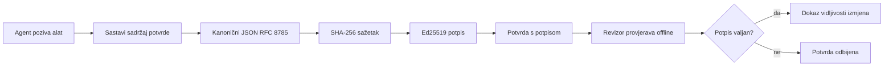

[Watch the lesson video: Osiguravanje AI agenata kriptografskim potvrdom](https://youtu.be/PLACEHOLDER_VIDEO_ID)

> _(Video lekcije i sličica bit će dodani od strane Microsoftovog tima za sadržaj nakon spajanja, u skladu s obrascem lekcija 14 / 15.)_

# Osiguravanje AI agenata kriptografskim potvrdom

## Uvod

Ova lekcija će pokriti:

- Zašto su auditori za AI agente važni za usklađenost, ispravljanje pogrešaka i povjerenje.
- Što je kriptografska potvrda i kako se razlikuje od nesignirane zapisničke linije.
- Kako proizvesti potpisanu potvrdu za poziv alata agenta u čistom Pythonu.
- Kako provjeriti potvrdu izvan mreže i otkriti manipulacije.
- Kako povezati potvrde tako da uklanjanje ili mijenjanje reda jedne prekida niz.
- Što potvrde dokazuju, a što eksplicitno ne dokazuju.

## Ciljevi učenja

Nakon ove lekcije znat ćete kako:

- Identificirati načine neuspjeha koji motiviraju kriptografsku vjerodostojnost radnji agenata.
- Proizvesti Ed25519-potpisanu potvrdu preko kanonskog JSON sadržaja.
- Neovisno provjeriti potvrdu koristeći samo javni ključ potpisivača.
- Otkrivati manipulacije ponovnim pokretanjem verifikacije na izmijenjenoj potvrdi.
- Izgraditi hash-povezan niz potvrda i objasniti zašto niz ima važnost.
- Prepoznati granicu između onoga što potvrde dokazuju (atribucija, integritet, redoslijed) i onoga što ne dokazuju (ispravnost radnje, ispravnost politike).

## Problem: zapisnik vašeg agenta

Zamislite da ste postavili AI agenta za Contoso Travel. Agent čita zahtjeve korisnika, poziva API za letove da pronađe opcije i rezervira sjedala u njihovo ime. Prošli kvartal, agent je obradio 50.000 rezervacija.

Danas dolazi revizor. Postavlja jednostavno pitanje: "Pokažite mi što je vaš agent napravio."

Predajete svoje zapisničke datoteke. Revizor ih gleda i postavlja teže pitanje: "Kako znam da ove zapise netko nije mijenjao?"

Ovo je problem zapisnika audita. Većina današnjih implementacija agenata oslanja se na:

- **Zapisnike aplikacija**: koje agent sam piše, a mogu ih mijenjati svi koji imaju pristup datotečnom sustavu.
- **Usluge zapisivanja u oblaku**: otporne na manipulacije na razini platforme, ali samo ako revizor vjeruje operatoru platforme.
- **Zapisnike transakcija u bazama podataka**: prikladne za promjene u bazi, ali ne i za proizvoljne pozive alata.

Nijedan od njih ne može odgovoriti na revizorovo pitanje bez da revizor ima povjerenje u nekoga (vas, vašeg cloud providera, vašeg dobavljača baze podataka). Za internu upotrebu, to je često prihvatljivo. Za regulirane radne zadatke (financije, zdravstvo, bilo što pod EU AI zakonom), nije.

Kriptografske potvrde to rješavaju tako da svaka radnja agenta postaje neovisno provjerljiva. Revizor vas ne mora vjerovati. Treba mu samo vaš javni ključ i sama potvrda.

## Što je kriptografska potvrda?

Potvrda je JSON objekt koji bilježi što je agent napravio, potpisan digitalnim potpisom.



Minimalna potvrda izgleda ovako:

```json
{
  "type": "agent.tool_call.v1",
  "agent_id": "contoso-travel-bot",
  "tool_name": "lookup_flights",
  "tool_args_hash": "sha256:a3f9c1...",
  "result_hash": "sha256:7b2e1d...",
  "policy_id": "contoso-travel-policy-v3",
  "timestamp": "2026-04-25T14:30:00Z",
  "sequence": 47,
  "previous_receipt_hash": "sha256:9d4e6a...",
  "signature": {
    "alg": "EdDSA",
    "sig": "c5af83...",
    "public_key": "8f3b2c..."
  }
}
```

Tri svojstva rade posao:

1. **Potpis**. Potvrdu potpisuje agentov gateway koristeći Ed25519 privatni ključ. Bilo tko s pripadajućim javnim ključem može offline provjeriti potpis. Manipulacija bilo kojim poljem poništava potpis.

2. **Kanonsko kodiranje**. Prije potpisivanja, potvrda se serijalizira korištenjem JSON kanonskog shema (JCS, RFC 8785). To osigurava da dvije implementacije koje proizvode istu logičku potvrdu proizvode identičan niz bajtova. Bez kanonizacije, različiti JSON serializeri bi dali različite potpise za isti sadržaj.

3. **Hash povezivanje**. Polje `previous_receipt_hash` povezuje svaku potvrdu s onom prije. Uklanjanje ili mijenjanje reda potvrde prekida sve potvrde iza. Manipulacija postaje vidljiva na razini lanca čak i ako se pojedinačni potpisi zaobiđu.

Zajedno, ova svojstva pružaju tri jamstva:

- **Atribuciju**: ovaj ključ je potpisao ovaj sadržaj.
- **Integritet**: sadržaj nije promijenjen od potpisivanja.
- **Redoslijed**: ova potvrda je nastupila nakon one u lancu.

## Proizvodnja potvrde u Pythonu

Ne trebate posebnu knjižnicu za proizvodnju potvrde. Kriptografske primitive su široko dostupne, a logika je tek nekoliko desetaka redaka Pythona.

Praktične vježbe u `code_samples/18-signed-receipts.ipynb` vode vas kroz cijeli tijek. Sažetak:

```python
import json
import hashlib
import base64
from nacl import signing
from jcs import canonicalize  # RFC 8785 kanonski JSON

def b64url_nopad(data: bytes) -> str:
    return base64.urlsafe_b64encode(data).decode("ascii").rstrip("=")

def sha256_canonical(obj) -> str:
    """SHA-256 of a Python object's JCS-canonical JSON form."""
    return f"sha256:{hashlib.sha256(canonicalize(obj)).hexdigest()}"

# Generirajte ili učitajte potpisni ključ (u produkciji, pohranite u spremište ključeva)
signing_key = signing.SigningKey.generate()
verify_key = signing_key.verify_key

# Izgradite sadržaj računa (još bez potpisa)
tool_args = {"origin": "SYD", "destination": "LAX"}
tool_result = [{"flight": "QF11", "price": 1850, "stops": 0}]

payload = {
    "type": "agent.tool_call.v1",
    "agent_id": "contoso-travel-bot",
    "tool_name": "lookup_flights",
    "tool_args_hash": sha256_canonical(tool_args),
    "result_hash": sha256_canonical(tool_result),
    "policy_id": "contoso-travel-policy-v3",
    "timestamp": "2026-04-25T14:30:00Z",
    "sequence": 0,
    "previous_receipt_hash": None,
}

# Kanonizirajte, heširajte, potpišite.
canonical_bytes = canonicalize(payload)
message_hash = hashlib.sha256(canonical_bytes).digest()
signature_bytes = signing_key.sign(message_hash).signature

# Priložite strukturirani potpisni objekt.
receipt = {
    **payload,
    "signature": {
        "alg": "EdDSA",
        "sig": b64url_nopad(signature_bytes),
        "public_key": b64url_nopad(bytes(verify_key)),
    },
}
```

To je cijeli proces potpisivanja. Vježbe u bilježnici detaljno objašnjavaju svaki korak.

## Verifikacija potvrde i otkrivanje manipulacija

Verifikacija je obrnuta operacija:

```python
import base64
import hashlib
from nacl import signing
from nacl.exceptions import BadSignatureError
from jcs import canonicalize

def b64url_decode(s: str) -> bytes:
    padding = "=" * ((4 - len(s) % 4) % 4)
    return base64.urlsafe_b64decode(s + padding)

def verify_receipt(receipt: dict) -> bool:
    # Potpis je strukturirani objekt: {"alg", "sig", "public_key"}.
    sig_obj = receipt.get("signature")
    if not sig_obj or sig_obj.get("alg") != "EdDSA":
        return False

    # Rekonstruirajte podatke koji su zapravo potpisani (sve osim potpisa).
    payload = {k: v for k, v in receipt.items() if k != "signature"}

    canonical_bytes = canonicalize(payload)
    message_hash = hashlib.sha256(canonical_bytes).digest()

    try:
        verify_key = signing.VerifyKey(b64url_decode(sig_obj["public_key"]))
        verify_key.verify(message_hash, b64url_decode(sig_obj["sig"]))
        return True
    except BadSignatureError:
        return False
```

Ova funkcija prima potvrdu i vraća `True` ako je potpis valjan, `False` ako nije. Nema poziva mreži, nema ovisnosti o uslugama, ne treba vjerovati trećoj strani.

Da vidite otkrivanje manipulacija u akciji, bilježnica prikazuje:

1. Proizvodnju valjane potvrde i potvrdu da se može verificirati.
2. Mijenjanje jednog bajta u polju `tool_args_hash`.
3. Ponovnu verifikaciju koja sada ne uspijeva.

To je praktični dokaz da su potvrde otporne na manipulacije: svaka izmjena, ma koliko mala bila, ruši potpis.

## Povezivanje potvrda za agente s više koraka

Pojedinačna potpisana potvrda štiti jednu radnju. Lanac potvrda štiti niz radnji.


Svaka potvrda bilježi hash prethodne potvrde. Da bi nekome uspjelo da tiho ukloni potvrdu 2, morao bi ili:

- Promijeniti polje `previous_receipt_hash` potvrde 3 (čime se prekida potpis potvrde 3), ILI
- Krivotvoriti novi potpis za izmijenjenu potvrdu 3 (što zahtijeva privatni ključ agenta).

Ako je privatni ključ pohranjen u hardverskom trezoru, a javni ključ objavljujete uz svaku potvrdu, nijedan od tih napada nije izvediv bez otkrivanja.

Bilježnica detaljno pokazuje:

1. Izgradnju lanca od tri potvrde.
2. Verifikaciju da `previous_receipt_hash` svake potvrde odgovara hashu prethodne potvrde.
3. Manipuliranje jednom potvrdom u sredini i vidjeti da se lanac prekida točno na tom mjestu.

Ovo je način na koji proizvodite zapisnik audita koji vanjski revizor može verificirati bez da vam mora vjerovati.

## Što potvrde dokazuju (i što ne dokazuju)

Ovo je najvažniji dio lekcije. Potvrde su moćne, ali njihova moć ima granice.

**Potvrde dokazuju tri stvari:**

1. **Atribuciju**: određeni ključ je potpisao određeni sadržaj.
2. **Integritet**: sadržaj nije promijenjen od potpisivanja.
3. **Redoslijed**: ova potvrda je došla nakon one u hash lancu.

**Potvrde NE dokazuju:**

1. **Ispravnost**: da je radnja agenta bila ispravna. Potvrda može biti potpisana i za pogrešan odgovor jednako kao i za točan.
2. **Usklađenost s politikom**: da je politika navedena u `policy_id` stvarno evaluirana, ili da bi ta politika dopustila radnju ako bi se provjerila. Potvrda bilježi ono što je tvrdnja, a ne ono što je provedeno.
3. **Identitet izvan ključa**: potvrda kaže "ovaj ključ je potpisao ovaj sadržaj". Ne kaže "ova osoba je ovlastila ovo". Povezivanje ključa s osobom ili organizacijom zahtijeva zasebnu identitetsku infrastrukturu (adresar, registar javnih ključeva, itd.).
4. **Istinitost ulaza**: ako agent primi manipulirani upit i djeluje na njega, potvrda vjerno bilježi radnju. Potvrde su nizvodno od provjere valjanosti ulaza, nisu njihova zamjena.

Ta granica je važna iz dva razloga:

- Kaže za što su potvrde korisne: da rad ponašanja agenta bude audibilan i vidljiv kod manipulacije, čak i preko organizacijskih granica.
- Kaže koje dodatne slojeve i dalje trebate: provjeru valjanosti ulaza (lekcija 6), provođenje politike (kratko obrađeno niže), i infrastrukturu identiteta (nije u opsegu ove lekcije).

Česta pogreška je pretpostaviti da "imamo potvrde" znači "upravljamo sustavom". Ne znači. Potvrde su temelj. Upravljanje je sustav koji na tom temelju gradite.

## Reference za produkciju

Python kod u ovoj lekciji je namjerno minimalistički kako biste mogli pročitati svaki redak i razumjeti točno što se događa. U produkciji imate dvije mogućnosti:

1. **Graditi izravno na kriptografskim primitivima.** 50 redaka prikazanih iznad dovoljno je za mnoge slučajeve uporabe. PyNaCl (Ed25519) i paket `jcs` (kanonski JSON) su dobro održavane i revidirane knjižnice.

2. **Koristiti produkcijsku knjižnicu za potvrde.** Nekoliko open source projekata implementira isti obrazac s dodatnim značajkama (rotacija ključeva, serijski pregled, distribucija JWK seta, integracija s mehanizmima politika):
   - Format potvrda korišten u ovoj lekciji slijedi IETF Internet-draft (`draft-farley-acta-signed-receipts`) koji je trenutno u procesu standardizacije.
   - Microsoft Agent Governance Toolkit sastavlja potvrde s Cedar-baziranim odlukama politike; pogledajte Tutorijal 33 u tom repozitoriju za primjer od početka do kraja.
   - Paketi `protect-mcp` (npm) i `@veritasacta/verify` (npm) pružaju Node implementaciju potpisivanja potvrda i offline verifikacije, namijenjenu za omatanje bilo kojeg MCP servera s zapisnikom otpornim na manipulacije.
   - Python SDK **[nobulex](https://github.com/arian-gogani/nobulex)** (`pip install nobulex`) pruža isti Ed25519 + JCS obrazac potpisivanja u Pythonu s integracijama LangChain i CrewAI, uključujući objavljene vektore za unakrsnu provjeru i mapiranje usklađenosti koje je pridonio [OWASP PR #2210](https://github.com/OWASP/CheatSheetSeries/pull/2210).

Odluka između izgradnje vlastitog i korištenja knjižnice je kao odluka između pisanja vlastite JWT knjižnice i korištenja testirane: oba su razumljiva; knjižnica štedi vrijeme i smanjuje površinu audita; pristup od nule prisiljava vas da razumijete svaki primitiv. Ova lekcija poučava pristup od nule kako biste imali temelj za oba izbora.

## Provjera znanja

Testirajte svoje razumijevanje prije nego nastavite na praktičnu vježbu.

**1. Potvrda je potpisana agentovim privatnim Ed25519 ključem. Revizor ima samo javni ključ. Može li revizor verificirati potvrdu offline?**

<details>
<summary>Odgovor</summary>

Da. Ed25519 verifikacija zahtijeva samo javni ključ i potpisane bajtove. Nema poziva mreži, nema ovisnosti o uslugama. To je svojstvo koje potvrde čini korisnima u situacijama bez mreže, u okruženjima s više organizacija ili niskim povjerenjem.
</details>

**2. Napadač mijenja polje `policy_id` potvrde da tvrdnja bude da je podložna labavijoj politici. Potpis je bio nad izvornim sadržajem. Što se događa pri verifikaciji?**

<details>
<summary>Odgovor</summary>

Verifikacija ne uspijeva. Potpis je izračunat nad kanonskim bajtovima izvornog sadržaja; izmjena bilo kojeg polja mijenja kanonske bajtove, što mijenja SHA-256 hash i čini potpis nevaljanim. Napadač bi trebao privatni ključ da proizvede novi valjani potpis, kojeg nema.
</details>

**3. Zašto potvrda uključuje `tool_args_hash` i `result_hash` umjesto sirovih argumenata i rezultata?**

<details>
<summary>Odgovor</summary>

Dva razloga. Prvo, potvrdu može trebati arhivirati ili prenositi u okruženjima gdje bi otkrivanje sirovih podataka (PII, poslovni podaci) bio problem. Hashiranje održava potvrdu malom i sadržaj privatnim; revizor provjerava da hash odgovara posebno pohranjenoj kopiji stvarnog sadržaja. Drugo, hash je fiksne veličine; potvrda s hashovima je veličinski ograničena bez obzira na veličinu ulaza i izlaza.
</details>

**4. Polje `previous_receipt_hash` povezuje svaku potvrdu s prethodnom. Ako napadač tiho izbriše potvrdu iz sredine lanca, što postaje nevaljano?**

<details>
<summary>Odgovor</summary>

Svaka potvrda koja je dolazila nakon izbrisane. Njihova polja `previous_receipt_hash` više ne odgovaraju stvarnom lancu (jer potvrda na koju su se odnosile više ne postoji ili lanac sada pokazuje na drugog prethodnika). Da bi prikrio brisanje, napadač bi morao ponovno potpisati svaku kasniju potvrdu, što zahtijeva privatni ključ.
</details>

**5. Potvrda se čisto verificira. Dokazuje li to da je radnja agenta bila ispravna, valjana ili u skladu s politikom?**

<details>
<summary>Odgovor</summary>

Ne. Valjana potvrda dokazuje tri stvari: atribuciju (ovaj ključ je potpisao ovaj sadržaj), integritet (sadržaj nije mijenjan) i redoslijed (ova potvrda je stigla nakon one u lancu). Ne dokazuje da je radnja bila ispravna, da je politika u `policy_id` stvarno evaluirana ili da je agent slijedio sva pravila. Potvrde omogućuju auditabilno ponašanje agenta, ne nužno ispravno. Ovo je najvažnija granica u lekciji.
</details>

## Praktična vježba

Otvorite `code_samples/18-signed-receipts.ipynb` i dovršite sve četiri sekcije:

1. **Sekcija 1**: Potpišite svoju prvu potvrdu i verificirajte je.
2. **Sekcija 2**: Manipulirajte potvrdom i promatrajte neuspjeh verifikacije.
3. **Sekcija 3**: Izgradite lanac od tri potvrde i provjerite integritet lanca.
4. **Sekcija 4**: Primijenite obrazac na agenta izgrađenog Microsoft Agent Frameworkom: omotajte poziv alata u potpisivanje potvrde, zatim neovisno verificirajte potvrdu.
**Izazov proširenja 1:** proširite shemu potvrde dodatnim poljem po vlastitom izboru (na primjer, ID zahtjeva za praćenje), ažurirajte logiku kanonskog potpisivanja da ga uključi i potvrdite da potvrda i dalje prolazi kroz verifikaciju. Zatim izmijenite to polje nakon potpisivanja i potvrdite da verifikacija ne uspijeva. Ovo vas prisiljava da shvatite kako svaki bajt kanonskog kodiranja doprinosi potpisu.

**Izazov proširenja 2:** SHA-256-izračunajte hash dviju svojih potvrda zajedno (konkatenirajte njihove kanonske bajtove u determinističkom redoslijedu) i ugradite rezultirajući digest kao novo polje u treću potvrdu prije potpisivanja. Potvrdite da sve tri potvrde i dalje prolaze kroz verifikaciju. Upravo ste izgradili dokaz uključivanja u jednom koraku: bilo tko tko posjeduje treću potvrdu može dokazati da prve dvije postoje u trenutku potpisivanja, a da pritom ne mora otkriti njihov sadržaj. Ovo je uzorak koji selektivno-otkrivajuće potvrde koriste u velikom obujmu (Merkle obveze, RFC 6962).

## Zaključak

Kriptografske potvrde daju AI agentima revizijski trag koji je:

- **Neovisno provjerljiv:** bilo koja strana s javnim ključem može provjeriti, nema ovisnosti o usluzi.
- **Otkriva promjene:** svaka izmjena poništava potpis.
- **Prijenosiv:** potvrda je mala JSON datoteka; može se arhivirati, prenositi i provjeravati bilo gdje.
- **U skladu sa standardima:** izgrađeno na Ed25519 (RFC 8032), JCS (RFC 8785) i SHA-256, svim široko korištenim primitivima.

Nisu zamjena za validaciju unosa, provođenje politika ili infrastrukturu identiteta. Oni su temelj za te slojeve. Kada implementirate agente u reguliranim radnim opterećenjima, višestrukim organizacijskim tokovima rada ili bilo kojem okruženju gdje budući revizor ne može pretpostaviti da vam vjeruje, potvrde su način kako učiniti revizijski trag iskrenim.

Najvažnija poruka: potvrde dokazuju tko je što rekao i kada. One ne dokazuju da je ono što je rečeno istinito ili ispravno. Čvrsto držite tu razliku. To je razlika između iskrenog sustava podrijetla i onog koji može zavarati.

## Popis zadataka za produkciju

Kada ste spremni prijeći iz ove lekcije u implementaciju agenata potpisanih potvrdom u stvarnom okruženju:

- [ ] **Premjestite ključ za potpisivanje s prijenosnog računala programera.** Koristite Azure Key Vault, AWS KMS ili hardverski sigurnosni modul. Privatni ključ koji potpisuje vaše potvrde nikada ne smije biti u sustavu za verzioniranje izvornog koda niti u običnom tekstu na aplikacijskim strojevima.
- [ ] **Objavite javni ključ za verifikaciju.** Revizori ga trebaju za offline provjeru. Standardni uzorak je JWK Set na dobro poznatoj URL adresi (RFC 7517), npr. `https://your-org.example.com/.well-known/agent-keys.json`.
- [ ] **Ukočite lanac izvana.** Povremeno zapišite najnoviji hash vrha lanca u transparentni dnevnik (Sigstore Rekor, RFC 3161 autoritet vremenske oznake ili drugi interni sustav) tako da vanjska strana može potvrditi "ovaj je lanac postojao u ovom trenutku."
- [ ] **Pohranjujte potvrde nepromjenjivo.** Spremišta samo za dodavanje (Azure Storage s politikama nepromjenjivosti, AWS S3 Object Lock) sprječavaju insajdere da prepisuju povijest na razini pohrane.
- [ ] **Odlučite o zadržavanju.** Mnogi režimi usklađenosti zahtijevaju višegodišnje zadržavanje. Planirajte rast potvrda (svaka potvrda je ~500 bajtova; agent koji izvrši 10.000 poziva dnevno proizvodi ~1,8 GB godišnje).
- [ ] **Dokumentirajte što potvrde ne pokrivaju.** Potvrde dokazuju atribuciju, integritet i redoslijed. Vaš vodič treba eksplicitno navesti koje dodatne kontrole (validacija unosa, provođenje politika, ograničavanje brzine, infrastruktura identiteta) stoje uz potvrde u vašem upravljačkom okviru.

### Imate dodatnih pitanja o zaštiti AI agenata?

Pridružite se [Microsoft Foundry Discordu](https://aka.ms/ai-agents/discord) da upoznate druge polaznike, sudjelujete na konzultacijama i dobijete odgovore na svoja pitanja o AI agentima.

## Izvan ove lekcije

Ova lekcija pokriva potpisivanje jedne potvrde i slijedove hash-povezanih zapisa. Isti se primitivni alati kombiniraju u nekoliko naprednijih obrazaca koje možete sresti kako vaš upravljački okvir sazrijeva:

- **Selektivno otkrivanje.** Kada su polja potvrde neovisno obavezna (Merkle stablo prema RFC 6962), možete otkriti određena polja specifičnim revizorima i dokazati da su ostala nepromijenjena bez da ih otkrivate. Korisno kada ista potvrda mora zadovoljiti i sveobuhvatnu reviziju (koja zahtijeva potpunost) i propise o minimizaciji podataka poput GDPR-a (koji žele da revizor vidi što je manje moguće).
- **Poništenje potvrda.** Ako je ključ za potpisivanje kompromitiran, treba način da se sve potvrde potpisane tim ključem označe nepouzdanim od određenog trenutka nadalje. Standardni obrasci: kratkotrajni ključevi za potpisivanje plus objavljeni popis poništenja ili transparentni dnevnik s unosima poništenja.
- **Dvostruke / podijeljene potvrde potpisa.** Neke implementacije dijele potpisani sadržaj na predizvršni (`authorization_*`) i postizvršni (`result_*`) dio s neovisnim potpisima, korisno kada odluka o autorizaciji i opaženi rezultat dolaze od različitih aktera ili u različito vrijeme. Ovo se aditivno nadograđuje na format potvrde iz ove lekcije.
- **Sastavljanje sadržaja.** Potvrda brtvi sve bajtove koje stavite u `result_hash`. Stvarni sadržaji često su bogatiji od samog rezultata poziva alati: ranije razmišljanje o odluci (predikcija modela, razmotrene opcije, dokazi i njihova potpunost, procjena rizika, lanac odgovornosti, ishod kontrole) mogu biti svi unutar sadržaja, koji je zapečaćen jednom potvrdom. Ovo održava format potvrde minimalnim dok dopušta evoluciju shema podataka po domenama.
- **Usklađenost među implementacijama.** Više neovisnih implementacija istog formata potvrda (Python, TypeScript, Rust, Go) međusobno provjerava putem zajedničkih test vektora. Ako napravite vlastitu implementaciju, validacija protiv objavljenih vektora potvrđuje kompatibilnost na mrežnoj razini.
- **Migracija nakon kvantnog razdoblja.** Ed25519 je danas široko implementiran, ali nije otporan na kvantna računala. Format potvrde je algoritamski prilagodljiv: polje `signature.alg` može sadržavati `ML-DSA-65` (NIST standard post-kvantnog potpisa) kada bude potrebno migrirati. Planirajte prijelazno razdoblje kada potvrde budu dvosmjerno potpisane.

## Dodatni resursi

- <a href="https://datatracker.ietf.org/doc/draft-farley-acta-signed-receipts/" target="_blank">IETF Internet-Predložak: Potpisane potvrde odluka za strojno-pristupnu kontrolu</a>
- <a href="https://learn.microsoft.com/azure/ai-studio/responsible-use-of-ai-overview" target="_blank">Pregled odgovorne upotrebe AI (Azure AI)</a>
- <a href="https://datatracker.ietf.org/doc/html/rfc8032" target="_blank">RFC 8032: Edwards-kurva digitalni algoritam potpisa (EdDSA)</a>
- <a href="https://datatracker.ietf.org/doc/html/rfc8785" target="_blank">RFC 8785: Shema kanonizacije JSON-a (JCS)</a>
- <a href="https://datatracker.ietf.org/doc/html/rfc6962" target="_blank">RFC 6962: Transparentnost certifikata</a> (Merkle-ovo stablo korišteno kod potvrda sa selektivnim otkrivanjem)
- <a href="https://github.com/microsoft/agent-governance-toolkit/blob/main/docs/tutorials/33-offline-verifiable-receipts.md" target="_blank">Microsoft Agent Governance Toolkit, Tutorial 33: Offline-verificirane potvrde odluka</a>
- <a href="https://github.com/ScopeBlind/agent-governance-testvectors" target="_blank">Test vektori za usklađenost među implementacijama</a> za format potvrde korišten u ovoj lekciji (Apache-2.0)
- <a href="https://pynacl.readthedocs.io/" target="_blank">PyNaCl dokumentacija</a> (Ed25519 u Pythonu)

## Prethodna lekcija

[Izgradnja agenata za korištenje računala (CUA)](../15-browser-use/README.md)

## Sljedeća lekcija

_(Odrediti će održavatelji kurikuluma)_

---

<!-- CO-OP TRANSLATOR DISCLAIMER START -->
**Napomena**:
Ovaj dokument je preveden korištenjem AI prevoditeljskog servisa [Co-op Translator](https://github.com/Azure/co-op-translator). Iako težimo točnosti, imajte na umu da automatski prijevodi mogu sadržavati greške ili netočnosti. Izvorni dokument na izvornom jeziku treba smatrati autoritativnim izvorom. Za važne informacije preporuča se profesionalni ljudski prijevod. Nismo odgovorni za bilo kakva nesporazumevanja ili pogrešne interpretacije koje proizlaze iz korištenja ovog prijevoda.
<!-- CO-OP TRANSLATOR DISCLAIMER END -->