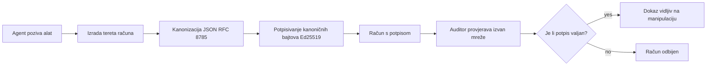
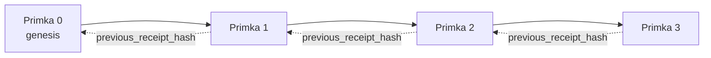

[Pogledajte video lekcije: Sigurnost AI agenata s kriptografskim potvrđivanjem](https://youtu.be/PLACEHOLDER_VIDEO_ID)

> _(Video lekcije i sličica bit će dodani od strane Microsoft sadržajnog tima nakon spajanja, u skladu s obrascem lekcija 14 / 15.)_

# Sigurnost AI agenata s kriptografskim potvrđivanjem

## Uvod

Ova će lekcija obuhvatiti:

- Zašto su audit tragovi za AI agente važni za usklađenost, otklanjanje pogrešaka i povjerenje.
- Što je kriptografski račun i kako se razlikuje od neovjerenog zapisa dnevnika.
- Kako proizvesti potpisani račun za poziv alata agenta u čistom Pythonu.
- Kako verificirati račun offline i otkriti manipulacije.
- Kako povezati račune u lanac tako da uklanjanje ili preuređenje jednog prekida lanac.
- Što računi dokazuju i što eksplicitno ne dokazuju.

## Ciljevi učenja

Nakon završetka ove lekcije, znat ćete kako:

- Identificirati načine neuspjeha koji motiviraju kriptografsko porijeklo za akcije agenta.
- Proizvesti Ed25519 potpisani račun preko kanoničnog JSON paketa.
- Neovisno verificirati račun koristeći samo javni ključ potpisnika.
- Otkrivati manipulacije ponovnim pokretanjem provjere na izmijenjenom računu.
- Izgraditi sekvencu računa povezanu hash-om i objasniti zašto je lanac važan.
- Prepoznati granicu između onoga što računi dokazuju (atribucija, integritet, redoslijed) i onoga što ne dokazuju (ispravnost akcije, valjanost politike).

## Problem: Audit trag vašeg agenta

Zamislite da ste postavili AI agenta za Contoso Travel. Agent čita zahtjeve korisnika, poziva API leta za pregled opcija i rezervira sjedala u ime korisnika. Prošli kvartal agent je obradio 50.000 rezervacija.

Danas dolazi revizor. Postavlja jednostavno pitanje: "Pokažite mi što je vaš agent radio."

Predajete dnevnike. Revizor ih pregledava i postavlja teže pitanje: "Kako znam da ovi dnevnici nisu uređivani?"

To je problem audit traga. Većina današnjih implementacija agenata oslanja se na:

- **Aplikacijske dnevnike**: koje piše sam agent, može ih uređivati bilo tko s pristupom datotečnom sustavu.
- **Cloud usluge za dnevničke podatke**: otporne na manipulaciju na razini platforme, ali samo ako revizor vjeruje operateru platforme.
- **Dnevnike transakcija baze podataka**: prikladni za promjene baze, ali ne za proizvoljne pozive alata.

Nijedan od ovih ne može odgovoriti revizorovu pitanju bez da revizor mora nekome vjerovati (vama, vašem cloud pružatelju, dobavljaču baze podataka). Za internu upotrebu, ta se povjerenja često prihvaćaju. Za regulirane zadatke (financije, zdravstvo, bilo što pod EU AI zakonom), nije.

Kriptografski računi to rješavaju tako da svaku akciju agenta čine neovisno provjerljivom. Revizoru nije potrebno vjerovati vama. Treba mu samo vaš javni ključ i sam račun.

## Što je kriptografski račun?

Račun je JSON objekt koji bilježi što je agent učinio, potpisan digitalnim potpisom.


```mermaid
flowchart LR
    A[Agent poziva alat] --> B[Izrada tereta računa]
    B --> C[Kanonizacija JSON RFC 8785]
    C --> E[Potpisivanje kanoničnih bajtova Ed25519]
    E --> F[Račun s potpisom]
    F --> G[Auditor provjerava izvan mreže]
    G --> H{Je li potpis valjan?}
    H -- yes --> I[Dokaz vidljiv na manipulaciju]
    H -- no --> J[Račun odbijen]
```

Minimalni račun izgleda ovako:

```json
{
  "type": "agent.tool_call.v1",
  "agent_id": "contoso-travel-bot",
  "tool_name": "lookup_flights",
  "tool_args_hash": "sha256:a3f9c1...",
  "result_hash": "sha256:7b2e1d...",
  "policy_id": "contoso-travel-policy-v3",
  "timestamp": "2026-04-25T14:30:00Z",
  "sequence": 47,
  "previous_receipt_hash": "sha256:9d4e6a...",
  "signature": {
    "alg": "EdDSA",
    "sig": "c5af83...",
    "public_key": "8f3b2c..."
  }
}
```

Tri svojstva obavljaju posao:

1. **Potpis**. Račun potpisuje agentova pristupna točka koristeći Ed25519 privatni ključ. Bilo tko s odgovarajućim javnim ključem može offline verificirati potpis. Manipulacija bilo kojim poljem poništava potpis.

2. **Kanoničko kodiranje**. Prije potpisivanja, račun se serijalizira pomoću JSON Kanonizacijskog Shema (JCS, RFC 8785). To osigurava da dvije implementacije koje proizvode isti logički račun proizvode bajt-identičan izlaz. Bez kanonizacije, različiti JSON serijalizatori proizveli bi različite potpise za isti sadržaj.

3. **Povezivanje hash-om**. Polje `previous_receipt_hash` povezuje svaki račun s prethodnim. Uklanjanje ili preuređenje nekog računa prekida svaki račun koji dolazi nakon. Manipulacija postaje vidljiva na razini lanca čak i ako se pojedinačni potpisi zaobiđu.

Zajedno ova svojstva pružaju tri jamstva:

- **Atribucija**: ovaj ključ je potpisao ovaj sadržaj.
- **Integritet**: sadržaj se nije promijenio od potpisivanja.
- **Redoslijed**: ovaj je račun došao nakon tog računa u lancu.

## Proizvodnja računa u Pythonu

Za proizvodnju računa nije potrebna posebna biblioteka. Kriptografski primitivci su široko dostupni, a logika je nekoliko desetaka linija Pythona.

Praktične vježbe u `code_samples/18-signed-receipts.ipynb` vode kroz cijeli tijek. Sažetak:

```python
import json
import hashlib
import base64
from nacl import signing
from jcs import canonicalize  # RFC 8785 kanonički JSON

def b64url_nopad(data: bytes) -> str:
    return base64.urlsafe_b64encode(data).decode("ascii").rstrip("=")

def sha256_canonical(obj) -> str:
    """SHA-256 of a Python object's JCS-canonical JSON form."""
    return f"sha256:{hashlib.sha256(canonicalize(obj)).hexdigest()}"

# Generirajte ili učitajte ključ za potpisivanje (u produkciji, pohranite u spremište ključeva)
signing_key = signing.SigningKey.generate()
verify_key = signing_key.verify_key

# Izgradite sadržaj primitka (još bez potpisa)
tool_args = {"origin": "SYD", "destination": "LAX"}
tool_result = [{"flight": "QF11", "price": 1850, "stops": 0}]

payload = {
    "type": "agent.tool_call.v1",
    "agent_id": "contoso-travel-bot",
    "tool_name": "lookup_flights",
    "tool_args_hash": sha256_canonical(tool_args),
    "result_hash": sha256_canonical(tool_result),
    "policy_id": "contoso-travel-policy-v3",
    "timestamp": "2026-04-25T14:30:00Z",
    "sequence": 0,
    "previous_receipt_hash": None,
}

# Kanonizirajte i potpišite JCS bajtove izravno. PureEdDSA internu koristi hashiranje.
canonical_bytes = canonicalize(payload)
signature_bytes = signing_key.sign(canonical_bytes).signature

# Priložite strukturirani objekt potpisa.
receipt = {
    **payload,
    "signature": {
        "alg": "EdDSA",
        "sig": b64url_nopad(signature_bytes),
        "public_key": b64url_nopad(bytes(verify_key)),
    },
}
```

To je cijeli postupak potpisivanja. Vježbe u bilježnici prolaze kroz svaki korak.

## Verifikacija računa i otkrivanje manipulacije

Verifikacija je inverzna operacija:

```python
import base64
import hashlib
from nacl import signing
from nacl.exceptions import BadSignatureError
from jcs import canonicalize

def b64url_decode(s: str) -> bytes:
    padding = "=" * ((4 - len(s) % 4) % 4)
    return base64.urlsafe_b64decode(s + padding)

def verify_receipt(receipt: dict) -> bool:
    # Potpis je strukturirani objekt: {"alg", "sig", "public_key"}.
    sig_obj = receipt.get("signature")
    if not sig_obj or sig_obj.get("alg") != "EdDSA":
        return False

    # Rekonstruirajte teret koji je zapravo potpisan (sve osim potpisa).
    payload = {k: v for k, v in receipt.items() if k != "signature"}

    canonical_bytes = canonicalize(payload)

    try:
        verify_key = signing.VerifyKey(b64url_decode(sig_obj["public_key"]))
        verify_key.verify(canonical_bytes, b64url_decode(sig_obj["sig"]))
        return True
    except BadSignatureError:
        return False
```

Ova funkcija prima račun i vraća `True` ako je potpis valjan, `False` inače. Nema poziva mreži, nema ovisnosti o servisu, nije potrebna vjerovanja u treću stranu.

Za vidjeti otkrivanje manipulacije u praksi, bilježnica vodi kroz:

1. Proizvodnju valjanog računa i potvrdu da se verificira.
2. Izmjenu jednog bajta u polju `tool_args_hash`.
3. Ponovnu provjeru i uočavanje neuspjeha.

Ovo je praktična demonstracija da su računi otporni na manipulacije: svaka izmjena, koliko god mala bila, prekida potpis.

## Povezivanje računa za agente s višestrukim koracima

Jedan potpisani račun štiti jednu akciju. Lanac računa štiti niz.


```mermaid
flowchart LR
    R0[Primka 0<br/>genesis] --> R1[Primka 1]
    R1 --> R2[Primka 2]
    R2 --> R3[Primka 3]
    R1 -. previous_receipt_hash .-> R0
    R2 -. previous_receipt_hash .-> R1
    R3 -. previous_receipt_hash .-> R2
```

Svaki račun bilježi hash prethodnog računa. Da bi napadač tiho uklonio račun 2, morao bi:

- Izmijeniti polje `previous_receipt_hash` računa 3 (što prekida potpis računa 3), ILI
- Krivotvoriti novi potpis na izmijenjenom računu 3 (što zahtijeva privatni ključ agenta).

Ako je privatni ključ u hardverskom skladištu ključeva, a vi objavljujete javni ključ s svakim računom, nijedan od tih napada nije izvediv bez otkrivanja.

Bilježnica vodi kroz:

1. Izgradnju lanca od tri računa.
2. Verifikaciju da polje `previous_receipt_hash` svakog računa odgovara stvarnom hash-u prethodnog računa.
3. Manipulaciju jednim računom u sredini i promatranje kako lanac prekida točno na toj točki.

Ovako proizvodite audit trag koji vanjski revizor može verificirati bez povjerenja u vas.

## Što računi dokazuju (i što ne dokazuju)

Ovo je najvažniji dio lekcije. Računi su moćni, ali njihova moć je ograničena.

**Računi dokazuju tri stvari:**

1. **Atribuciju**: specifični ključ potpisao je specifičan paket.
2. **Integritet**: paket se nije promijenio od potpisivanja.
3. **Redoslijed**: ovaj račun je došao nakon tog računa u lancu hash-ova.

**Računi NE dokazuju:**

1. **Ispravnost**: da je akcija agenta bila ispravna akcija. Račun se može potpisati za pogrešan odgovor jednako čisto kao i za ispravan.
2. **Usklađenost s politikom**: da je politika referencirana u `policy_id` stvarno evaluirana, ili da bi ta politika dozvolila akciju ako bi se provjeravala. Račun bilježi što je navedeno, ne što je provedeno.
3. **Identitet osim ključa**: račun kaže "ovaj ključ je potpisao ovaj sadržaj." Ne kaže "ovaj čovjek je autorizirao ovo." Povezivanje ključa s osobom ili organizacijom zahtijeva zasebnu identitetsku infrastrukturu (imenik, registar javnih ključeva, itd.).
4. **Istinitost ulaza**: ako agent primi manipulirani prompt i na njega djeluje, račun to vjerodostojno bilježi. Računi su nizvodni od validacije ulaza, nisu njezina zamjena.

Ova granica je važna iz dva razloga:

- Kaže vam za što su računi korisni: za učiniti ponašanje agenta auditable i otporno na manipulacije, čak i preko organizacijskih granica.
- Kaže vam koje dodatne slojeve još trebate: validaciju ulaza (lekcija 6), provedbu politike (kratko obrađeno kasnije), i identitetsku infrastrukturu (izvan opsega ove lekcije).

Uobičajena pogreška je pretpostaviti da "imamo račune" znači "imamo upravljanje." Ne znači. Računi su temelj. Upravljanje je sustav koji gradite na tom temelju.

## Dokazivanje da je čovjek odobrio točnu akciju

Stavka 3 iznad zaslužuje svoj odjeljak: račun akcije kaže "ovaj ključ je potpisao ovaj sadržaj," nikad "čovjek je autorizirao ovo." Za akcije visokog rizika (povrati, brisanja, novčani prijenosi), okviri upravljanja sve više zahtijevaju upravo tu nedostajuću izjavu, a ona se može proizvesti s istim primitivima koje ste već izgradili u ovoj lekciji.

Sljedeća bilježnica `code_samples/human-authorization-receipts.ipynb` dodaje drugi tip računa, `human.approval.v1`, u isti oblik omotnice kao i računi iz lekcije (tipizirani paket potpisan Ed25519 preko njegovih kanoničnih JCS bajtova, s objektom `signature` izvan potpisanih bajtova). Imenovani ovlaštenik potpisuje **cjelokupnu kanoničnu akciju i njen digest** prije izvršenja; račun akcije agenta nosi **isti digest akcije** i `parent_approval_ref`, `receipt_hash` odobrenja, isti konvencijski pristup kao i `previous_receipt_hash` u lancu koji ste gore izgradili. Jedan `verify_chain` provodi oba artefakta pod **odvojenim registrima pričvršćenih ključeva** (ključevi ovlaštenika vs ključevi agenta), tako da se put koda dijeli, ali vlasti nikad.

Svojstvo koje time dobivate, pažljivo formulirano: *čovjek je odobrio upravo ovu akciju, a agent je izvršio točno tu odobrenu akciju.* Odbijanja u bilježnici su što to svojstvo čini stvarnim, a ne samo tvrdnjom:

- klasični set: manipulacije, zbunjen posrednik, ponavljanje, krivotvoreni ključevi s bilo koje strane, neispravni ulazi;
- **istekla vlast**: potpis koji se još verificira, ali se odbija jer je verzija politike promijenjena, ključ ovlaštenika je rotiran iz piniranog registra, ili je odobrenje isteklo prije izvršenja;
- **zamjena digesta**: valjano potpisani račun akcije koji pokazuje na *pravo* odobrenje koje veže *drugu* kanoničnu akciju.

Svaki neuspjeh odbija se s posebnim razlogom, tako da revizor čitajući odbijanje može znati je li vlast istekla ili se izvršena akcija promijenila. Pravilo koje bilježnica uči: potpisano odobrenje samo po sebi nije vlast. Vlast postoji samo ako oba računa i dalje vežu istu kanoničnu akciju u vrijeme izvršenja. Račun ljudskog odobrenja je poučna kompozicija definirana ovom lekcijom, nije tip računa definiran `draft-farley-acta-signed-receipts`.

## Reference za proizvodnju

Python kod u ovoj lekciji je namjerno minimalan da možete pročitati svaku liniju i razumjeti točno što se događa. U produkciji imate dvije opcije:

1. **Graditi izravno na kriptografskim primitivima.** Spomenutih 50 linija gore je dovoljno za mnoge slučajeve upotrebe. PyNaCl (Ed25519) i paket `jcs` (kanonički JSON) su dobro održavane i revidirane biblioteke.

2. **Koristiti biblioteku za račune u produkciji.** Nekoliko open-source projekata implementira isti obrazac s dodatnim značajkama (rotacija ključeva, serijska verifikacija, distribucija JWK seta, integracija s policy engine-ima):
   - Pipeline potpisivanja koristi JCS i konvencije opsega potpisa iz neovisnog IETF Internet-Drafta ([`draft-farley-acta-signed-receipts`](https://datatracker.ietf.org/doc/draft-farley-acta-signed-receipts/), revizija 02). Obrazac obrazovne lekcije s ravnim računom razlikuje se od omotnice drafts-a `{payload, signature}` i nije prikazan kao konformna implementacija. Draft objavljuje zajednički testni skup ([agent-governance-testvectors](https://github.com/ScopeBlind/agent-governance-testvectors)) za implementacije usmjerene na njegov format prijenosa.
   - Microsoft Agent Governance Toolkit komponira račune s Cedar baziranim odlukama politike; pogledajte Tutorial 33 u tom repozitoriju za primjer od početka do kraja.
   - Paketi `protect-mcp` (npm) i `@veritasacta/verify` (npm) pružaju Node implementaciju potpisivanja računa i offline verifikacije, namijenjenu omatanju bilo kojeg MCP servera s otporanjem audit tragom, uključujući tok sadržećeg su-potpisa u kojem pauzirana akcija emitira odobrenje vezano uz digest akcije (WebAuthn potpomognuto u desktop toku), isti obrazac potvrde-odobrenja kao bilježnica ljudske autorizacije gore.
   - **[nobulex](https://github.com/arian-gogani/nobulex)** Python SDK (`pip install nobulex`) nudi isti Ed25519 + JCS obrazac potpisivanja u Pythonu s LangChain i CrewAI integracijama, uključujući objavljene testne vektore i kartiranje usklađenosti doprinijeto putem [OWASP PR #2210](https://github.com/OWASP/CheatSheetSeries/pull/2210).

Odluka između izrade vlastitog rješenja i korištenja biblioteke podsjeća na odluku između pisanja vlastite JWT biblioteke i korištenja isprobane: oboje su razumna; biblioteka štedi vrijeme i smanjuje područje audita; pristup od nule tjera vas da razumijete svaki primitiv. Ova lekcija uči pristup od nule kako biste imali temelj za bilo koji izbor.

## Provjera znanja

Testirajte svoje razumijevanje prije prelaska na praktičnu vježbu.

**1. Račun se potpisuje privatnim Ed25519 ključem agenta. Revizor ima samo javni ključ. Može li revizor potvrditi račun offline?**

<details>
<summary>Odgovor</summary>

Da. Ed25519 verifikacija zahtijeva samo javni ključ i potpisane bajtove. Nema poziva mreži, nema ovisnosti o servisu. Ovo je svojstvo koje račune čini korisnima u okruženjima bez mreže, višeorganizacijskim ili niskopovjerljivim okruženjima za reviziju.
</details>

**2. Napadač mijenja polje `policy_id` računa tvrdeći da ga je upravljala permissivnija politika. Potpis je bio nad izvornim paketom. Što se događa tijekom verifikacije?**

<details>
<summary>Odgovor</summary>


Provjera ne uspijeva. Potpis je izračunat preko kanonskih bajtova izvornog sadržaja; izmjena bilo kojeg polja mijenja te bajtove, što potpis čini nevažećim. Napadač bi trebao privatni ključ da proizvede novi valjani potpis, što nema.
</details>

**3. Zašto potvrda uključuje `tool_args_hash` i `result_hash` umjesto sirovih argumenata i rezultata?**

<details>
<summary>Odgovor</summary>

Dva razloga. Prvo, potvrda može trebati biti arhivirana ili prenesena u okruženjima gdje je otkrivanje sirovog sadržaja (osobni podaci, poslovni podaci) problem. Hashiranje drži potvrdu malom i sadržaj privatnim; auditor potvrđuje da hash odgovara zasebno pohranjenoj kopiji stvarnog sadržaja. Drugo, hash ima fiksnu veličinu; potvrda s hashom ima ograničenu veličinu bez obzira koliko su ulazi i izlazi veliki.
</details>

**4. Polje `previous_receipt_hash` povezuje svaku potvrdu s prethodnom. Ako napadač tiho izbriše jednu potvrdu iz sredine lanca, što postaje nevažeće?**

<details>
<summary>Odgovor</summary>

Svaka potvrda koja je došla nakon izbrisane. Njihova polja `previous_receipt_hash` više ne odgovaraju stvarnom lancu (jer potvrda na koju su se referirali više ne postoji ili lanac sada pokazuje na drugog prethodnika). Da bi sakrio brisanje, napadač bi morao ponovo potpisati svaku kasniju potvrdu, što zahtijeva privatni ključ.
</details>

**5. Potvrda se uspješno verificira. Dokazuje li to da je radnja agenta bila točna, ispravna ili u skladu s politikom?**

<details>
<summary>Odgovor</summary>

Ne. Valjana potvrda dokazuje tri stvari: atribuciju (ovaj ključ je potpisao ovaj sadržaj), integritet (sadržaj se nije promijenio) i redoslijed (ova potvrda je došla nakon one druge). Ne dokazuje da je radnja bila točna, da je politika imenovana u `policy_id` zapravo evaluirana ili da je agent slijedio svako pravilo. Potvrde čine ponašanje agenta revizorski provjerljivim, ali ne nužno točnim. Ovo je najvažnija granica u lekciji.
</details>

## Vježba za praksu

Otvorite `code_samples/18-signed-receipts.ipynb` i dovršite sva četiri dijela:

1. **Dio 1**: Potpišite svoju prvu potvrdu i verificirajte je.
2. **Dio 2**: Manipulirajte potvrdom i promatrajte neuspjeh provjere.
3. **Dio 3**: Izgradite lanac od tri potvrde i verificirajte integritet lanca.
4. **Dio 4**: Primijenite obrazac na agenta izgrađenog s Microsoft Agent Framework: omotajte poziv alatu u potpisivanje potvrde, zatim neovisno verificirajte potvrdu.

**Izazov za dodatno:** proširite shemu potvrde dodatnim poljem po vlastitom izboru (na primjer, ID zahtjeva za praćenje), ažurirajte logiku kanonskog potpisivanja da ga uključi i potvrdite da potvrda i dalje prolazi provjeru. Zatim izmijenite polje nakon potpisivanja i potvrdite da provjera ne uspijeva. Ovo vas prisiljava da razumijete kako svaki bajt kanonskog kodiranja doprinosi potpisu.

**Izazov za dodatno 2:** Spojite SHA-256 hashom dvije svoje potvrde zajedno (konkatenirajte njihove kanonske bajtove u determinističkom redoslijedu) i ugrađenu rezultirajući sažetak kao novo polje u trećoj potvrdi prije potpisivanja. Verificirajte da sve tri potvrde i dalje prolaze provjeru. Upravo ste izgradili dokaz o uključenju u jednom koraku: bilo tko s trećom potvrdom može dokazati da su prve dvije postojale u vrijeme potpisivanja, bez potrebe za otkrivanjem njihovog sadržaja. Ovo je obrazac koji selektivno-otkrivajuće potvrde koriste u velikom obimu (Merkleovi obvezujući objekti, RFC 6962).

## Zaključak

Kriptografske potvrde daju AI agentima revizorski trag koji je:

- **Neovisno provjerljiv**: svaka strana s javnim ključem može verificirati, nema ovisnosti o uslugama.
- **Vidljiv na manipulacije**: svaka izmjena poništava potpis.
- **Prijenosan**: potvrda je mala JSON datoteka; može biti arhivirana, prenesena i verificirana bilo gdje.
- **U skladu sa standardima**: građen na Ed25519 (RFC 8032), JCS (RFC 8785) i SHA-256, svim široko korištenim primitivima.

Nisu zamjena za validaciju ulaza, provođenje politika ili identitetsku infrastrukturu. Oni su temelj tih slojeva. Kada raspoređujete agente u reguliranim okruženjima, višestrukim organizacijskim tijekovima rada ili bilo kojem okruženju gdje se budući revizor ne može pretpostaviti da vam vjeruje, potvrde su način da revizorski trag učinite poštenim.

Najvažnija poruka: potvrde dokazuju tko je što rekao i kada. Ne dokazuju da je ono što je rečeno bilo istinito ili ispravno. Držite tu razliku čvrsto. To je razlika između poštenog sustava podrijetla i zavaravajućeg.

## Popis za produkciju

Kada ste spremni preći s ove lekcije na raspoređivanje agenata potpisanih potvrdom u stvarno okruženje:

- [ ] **Premjestite ključ za potpisivanje s laptopa developera.** Koristite Azure Key Vault, AWS KMS ili hardverski sigurnosni modul. Privatni ključ koji potpisuje vaše potvrde nikada ne smije biti u kontrolom izvora ili u običnom tekstu na aplikacijskim računalima.
- [ ] **Objavite javni ključ za verifikaciju.** Revizori ga trebaju za offline provjeru. Standardan obrazac je JWK set na dobro poznatoj URL adresi (RFC 7517), npr. `https://your-org.example.com/.well-known/agent-keys.json`.
- [ ] **Sidrite lanac izvana.** Povremeno zapišite hash najnovijeg uvodnog čvora lanca u transparentni zapis (Sigstore Rekor, RFC 3161 služba vremenskog pečata ili drugi interni sustav) kako bi vanjska strana mogla potvrditi "ovaj lanac je postojao u ovo vrijeme."
- [ ] **Skladištite potvrde nepromjenjivo.** Spremište samo za dodavanje (Azure Storage s politikama nepromjenjivosti, AWS S3 Object Lock) sprječava insajdera da prepiše povijest na sloju skladištenja.
- [ ] **Odlučite o čuvanju.** Mnogi režimi usklađenosti zahtijevaju višegodišnje čuvanje. Planirajte za rast potvrda (svaka potvrda je ~500 bajtova; agent koji napravi 10.000 poziva dnevno proizvodi ~1,8 GB godišnje).
- [ ] **Dokumentirajte što potvrde ne pokrivaju.** Potvrde dokazuju atribuciju, integritet i redoslijed. Vaš plan rada treba eksplicitno navesti koje dodatne kontrole (validacija ulaza, provođenje politika, ograničenje brzine, infrastruktura identiteta) stoje uz potvrde u vašoj upravljačkoj politici.

### Imate li dodatnih pitanja o sigurnosti AI agenata?

Pridružite se [Microsoft Foundry Discord](https://aka.ms/ai-agents/discord) da se povežete s ostalim učenicima, prisustvujete sati ureda i dobijete odgovore na pitanja o AI Agenti.

## Izvan ove lekcije

Ova lekcija pokriva potpisivanje pojedinačnih potvrda i sekvence s hash-lancom. Isti primitivci čine nekoliko naprednijih obrazaca koje ćete možda susresti kako vaša upravljačka praksa sazrijeva:

- **Selektivno otkrivanje.** Kada su polja potvrde neovisno obavezana (Merkleovo stablo u stilu RFC 6962), možete otkriti specifična polja određenim auditorima i dokazati da su ostala nepromijenjena bez otkrivanja. Korisno kada ista potvrda mora zadovoljiti i opsežnu reviziju (koja traži potpunost) i propise o minimizaciji podataka poput GDPR-a (koji žele da auditor vidi što je moguće manje).
- **Poništenje potvrda.** Ako je ključ za potpisivanje kompromitiran, trebate način da označite sve potvrde potpisane tim ključem kao nepouzdane od određenog trenutka nadalje. Standardni obrasci: kratkotrajni ključevi za potpisivanje plus objavljen popis poništenja ili transparentni zapis s unosima poništenja.
- **Dvosmjerne / potvrde s podijeljenim potpisom.** Neke implementacije dijele potpisani sadržaj na pre-ekspanziju (`authorization_*`) i post-ekspanziju (`result_*`) polovice s neovisnim potpisima, korisno kada odluku o autorizaciji i zapaženi rezultat proizvode različiti akteri ili u različito vrijeme. Ovo se nadograđuje na format potvrde obrađen u ovoj lekciji.
- **Sastav sadržaja.** Potvrda zatvara bilo koje bajtove koje stavite u `result_hash`. Stvarni sadržaji često su bogatiji od rezultata jednog poziva alatu: razlozi prije odluke (predviđanje modela, razmotrene opcije, dokazi i njihova potpunost, procjena rizika, lanac odgovornosti, ishod kontrole) mogu sve živjeti unutar sadržaja zatvorenom jednom potvrdom. Ovo održava format potvrde minimalnim omogućujući šemu sadržaja da se razvija po domenama.
- **Usklađenost među implementacijama.** Više neovisnih implementacija istog formata potvrde (Python, TypeScript, Rust, Go) međusobno verificiraju prema zajedničkim testnim vektorima. Ako izgradite vlastitu implementaciju, validacija prema objavljenim vektorima potvrđuje kompatibilnost protokola.
- **Migracija na postkvantno.** Ed25519 je danas široko korišten, ali nije otporan na kvantne napade. Format potvrde je algoritamski prilagodljiv: polje `signature.alg` može nositi `ML-DSA-65` (NIST standard za postkvantni potpis) kada trebate migrirati. Planirajte prijelazni period u kojem su potvrde dvostruko potpisane.

## Dodatni resursi

- <a href="https://datatracker.ietf.org/doc/draft-farley-acta-signed-receipts/" target="_blank">IETF Internet-Draft: Potpisane potvrde odluka za strojni pristup upravljanju</a>
- <a href="https://learn.microsoft.com/azure/ai-studio/responsible-use-of-ai-overview" target="_blank">Pregled odgovorne AI (Azure AI)</a>
- <a href="https://datatracker.ietf.org/doc/html/rfc8032" target="_blank">RFC 8032: Edwards-Curve Digital Signature Algorithm (EdDSA)</a>
- <a href="https://datatracker.ietf.org/doc/html/rfc8785" target="_blank">RFC 8785: JSON Canonicalization Scheme (JCS)</a>
- <a href="https://datatracker.ietf.org/doc/html/rfc6962" target="_blank">RFC 6962: Certifikatna transparentnost</a> (Merkleova konstrukcija stabla koju koriste selektivno-otkrivajuće potvrde)
- <a href="https://github.com/microsoft/agent-governance-toolkit/blob/main/docs/tutorials/33-offline-verifiable-receipts.md" target="_blank">Microsoft Agent Governance Toolkit, Tutorial 33: Offline-verificirane potvrde odluka</a>
- <a href="https://github.com/ScopeBlind/agent-governance-testvectors" target="_blank">Testni vektori za usklađenost među implementacijama</a> za format potvrde korišten u ovoj lekciji (Apache-2.0)
- <a href="https://pynacl.readthedocs.io/" target="_blank">PyNaCl dokumentacija</a> (Ed25519 u Pythonu)

## Prethodna lekcija

[Kreiranje lokalnih AI agenata](../17-creating-local-ai-agents/README.md)

---

<!-- CO-OP TRANSLATOR DISCLAIMER START -->
**Napomena**:
Ovaj dokument je preveden korištenjem AI prevoditeljskog servisa [Co-op Translator](https://github.com/Azure/co-op-translator). Iako težimo točnosti, imajte na umu da automatski prijevodi mogu sadržavati greške ili netočnosti. Izvorni dokument na izvornom jeziku treba smatrati autoritativnim izvorom. Za važne informacije preporuča se profesionalni ljudski prijevod. Nismo odgovorni za bilo kakva nesporazumevanja ili pogrešne interpretacije koje proizlaze iz korištenja ovog prijevoda.
<!-- CO-OP TRANSLATOR DISCLAIMER END -->