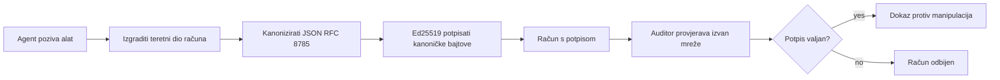
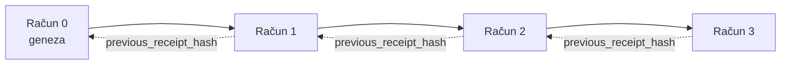

[Gledajte video lekciju: Osiguravanje AI agenata kriptografskim potvrdom](https://youtu.be/PLACEHOLDER_VIDEO_ID)

> _(Video lekcija i sličica bit će dodani od strane Microsoftovog sadržajnog tima nakon spajanja, u skladu s obrascem lekcija 14 / 15.)_

# Osiguravanje AI agenata kriptografskim potvrdom

## Uvod

Ova lekcija obuhvatit će:

- Zašto su audit staze za AI agente bitne za usklađenost, ispravljanje pogrešaka i povjerenje.
- Što je kriptografski potvrda i kako se razlikuje od nesignirane zapisne linije.
- Kako proizvesti potpisanu potvrdu za poziv alatu agenta u običnom Pythonu.
- Kako provjeriti potvrdu offline i otkriti manipulaciju.
- Kako povezati potvrde tako da uklanjanje ili premještanje jedne prekida lanac.
- Što potvrde dokazuju, a što izričito ne dokazuju.

## Ciljevi učenja

Nakon završetka ove lekcije, znat ćete kako:

- Prepoznati načine neuspjeha koji motiviraju kriptografsko porijeklo radnji agenta.
- Proizvesti potpisanu Ed25519 potvrdu nad kanonskim JSON payloadom.
- Neovisno provjeriti potvrdu koristeći samo javni ključ potpisnika.
- Otkrivati manipulaciju ponovnim pokretanjem provjere modificirane potvrde.
- Izgraditi lanac hashiranih potvrda i objasniti zašto je lanac važan.
- Prepoznati granicu između onoga što potvrde dokazuju (atribucija, integritet, redoslijed) i što ne dokazuju (ispravnost radnje, ispravnost politike).

## Problem: Audit staza vašeg agenta

Zamislite da ste implementirali AI agenta za Contoso Travel. Agent čita zahtjeve korisnika, poziva API za letove kako bi potražio opcije i rezervira sjedala u ime korisnika. Prošli kvartal agent je obradio 50.000 rezervacija.

Danas dolazi revizor. Postavlja jednostavno pitanje: "Pokažite mi što je vaš agent radio."

Predajete mu svoje zapisnike. Revizor ih pregleda i postavlja teže pitanje: "Kako znam da ti zapisnici nisu uređivani?"

Ovo je problem audit staze. Većina današnjih implementacija agenata oslanja se na:

- **Aplikacijske zapisnike**: koje piše sam agent, a bilo tko s pristupom datotečnom sustavu može ih uređivati.
- **Cloud usluge zapisivanja**: otporne na manipulaciju na razini platforme, ali samo ako revizor vjeruje operatoru platforme.
- **Zapisnike transakcija baze podataka**: dobre za promjene baze, ali ne i za proizvoljne pozive alata.

Nijedan od ovih ne može odgovoriti revizorovom pitanju bez zahtjeva da revizor nekome vjeruje (vama, vašem cloud pružatelju ili dobavljaču baze podataka). Za internu upotrebu, to povjerenje je često prihvatljivo. Za regulirane poslove (financije, zdravstvo, sve prema EU AI Aktu) nije.

Kriptografske potvrde rješavaju ovaj problem tako što svaku radnju agenta čine neovisno provjerljivom. Revizoru ne treba vjerovati vama. Treba mu samo vaš javni ključ i sama potvrda.

## Što je kriptografska potvrda?

Potvrda je JSON objekt koji bilježi što je agent napravio, potpisan digitalnim potpisom.


```mermaid
flowchart LR
    A[Agent poziva alat] --> B[Izgraditi teretni dio računa]
    B --> C[Kanonizirati JSON RFC 8785]
    C --> E[Ed25519 potpisati kanoničke bajtove]
    E --> F[Račun s potpisom]
    F --> G[Auditor provjerava izvan mreže]
    G --> H{Potpis valjan?}
    H -- yes --> I[Dokaz protiv manipulacija]
    H -- no --> J[Račun odbijen]
```

Minimalna potvrda izgleda ovako:

```json
{
  "type": "agent.tool_call.v1",
  "agent_id": "contoso-travel-bot",
  "tool_name": "lookup_flights",
  "tool_args_hash": "sha256:a3f9c1...",
  "result_hash": "sha256:7b2e1d...",
  "policy_id": "contoso-travel-policy-v3",
  "timestamp": "2026-04-25T14:30:00Z",
  "sequence": 47,
  "previous_receipt_hash": "sha256:9d4e6a...",
  "signature": {
    "alg": "EdDSA",
    "sig": "c5af83...",
    "public_key": "8f3b2c..."
  }
}
```

Tri svojstva obavljaju posao:

1. **Potpis**. Potvrdu potpisuje agentov gateway koristeći Ed25519 privatni ključ. Svako tko ima odgovarajući javni ključ može provjeriti potpis offline. Svaka manipulacija bilo kojim poljem poništava potpis.

2. **Kanonsko kodiranje**. Prije potpisivanja potvrda se serijalizira koristeći JSON Canonicalization Scheme (JCS, RFC 8785). Ovo osigurava da dvije implementacije koje proizvode isti logički sadržaj daju identičan niz bajtova. Bez kanonizacije, različiti JSON serijalizatori bi proizvodili različite potpise za isti sadržaj.

3. **Lančano hashiranje**. Polje `previous_receipt_hash` povezuje svaku potvrdu s prethodnom. Uklanjanje ili promjena redoslijeda potvrde prekida sve potvrde koje slijede. Manipulacija postaje vidljiva na razini lanca, čak i ako se pojedinačni potpisi zaobiđu.

Zajedno ova svojstva pružaju tri jamstva:

- **Atribucija**: ovaj ključ potpisao je ovaj sadržaj.
- **Integritet**: sadržaj nije promijenjen od potpisivanja.
- **Redoslijed**: ova potvrda je došla nakon one potvrde u lancu.

## Proizvodnja potvrde u Pythonu

Ne trebate posebnu biblioteku za proizvodnju potvrde. Kriptografske primitive su široko dostupne, a logika je nekoliko desetaka linija Python koda.

Praktični zadaci u `code_samples/18-signed-receipts.ipynb` prolaze kroz cijeli tijek. Sažetak:

```python
import json
import hashlib
import base64
from nacl import signing
from jcs import canonicalize  # RFC 8785 kanonski JSON

def b64url_nopad(data: bytes) -> str:
    return base64.urlsafe_b64encode(data).decode("ascii").rstrip("=")

def sha256_canonical(obj) -> str:
    """SHA-256 of a Python object's JCS-canonical JSON form."""
    return f"sha256:{hashlib.sha256(canonicalize(obj)).hexdigest()}"

# Generiraj ili učitaj potpisni ključ (u produkciji, spremi u spremište ključeva)
signing_key = signing.SigningKey.generate()
verify_key = signing_key.verify_key

# Izgradi podatke primitka (još bez potpisa)
tool_args = {"origin": "SYD", "destination": "LAX"}
tool_result = [{"flight": "QF11", "price": 1850, "stops": 0}]

payload = {
    "type": "agent.tool_call.v1",
    "agent_id": "contoso-travel-bot",
    "tool_name": "lookup_flights",
    "tool_args_hash": sha256_canonical(tool_args),
    "result_hash": sha256_canonical(tool_result),
    "policy_id": "contoso-travel-policy-v3",
    "timestamp": "2026-04-25T14:30:00Z",
    "sequence": 0,
    "previous_receipt_hash": None,
}

# Kanoniziraj i potpiši JCS bajtove izravno. PureEdDSA interno hešira.
canonical_bytes = canonicalize(payload)
signature_bytes = signing_key.sign(canonical_bytes).signature

# Priloži strukturirani objekt potpisa.
receipt = {
    **payload,
    "signature": {
        "alg": "EdDSA",
        "sig": b64url_nopad(signature_bytes),
        "public_key": b64url_nopad(bytes(verify_key)),
    },
}
```

To je cijeli pipeline potpisivanja. Zadatci u bilježnici vode kroz svaki korak.

## Provjera potvrde i otkrivanje manipulacije

Provjera je inverzna operacija:

```python
import base64
import hashlib
from nacl import signing
from nacl.exceptions import BadSignatureError
from jcs import canonicalize

def b64url_decode(s: str) -> bytes:
    padding = "=" * ((4 - len(s) % 4) % 4)
    return base64.urlsafe_b64decode(s + padding)

def verify_receipt(receipt: dict) -> bool:
    # Potpis je strukturirani objekt: {"alg", "sig", "public_key"}.
    sig_obj = receipt.get("signature")
    if not sig_obj or sig_obj.get("alg") != "EdDSA":
        return False

    # Rekonstruirajte sadržaj koji je zapravo potpisan (sve osim potpisa).
    payload = {k: v for k, v in receipt.items() if k != "signature"}

    canonical_bytes = canonicalize(payload)

    try:
        verify_key = signing.VerifyKey(b64url_decode(sig_obj["public_key"]))
        verify_key.verify(canonical_bytes, b64url_decode(sig_obj["sig"]))
        return True
    except BadSignatureError:
        return False
```

Ova funkcija prima potvrdu i vraća `True` ako je potpis valjan, inače `False`. Nema mrežnog poziva, nema ovisnosti o usluzi, ne treba vjerovati nijednoj trećoj strani.

Za demonstraciju otkrivanja manipulacije, bilježnica prolazi kroz:

1. Proizvodnju valjane potvrde i potvrdu da se može verificirati.
2. Modifikaciju jednog bajta polja `tool_args_hash`.
3. Ponovnu provjeru i uočavanje neuspjeha.

Ovo je praktičan dokaz da su potvrde otporne na manipulacije: svaka promjena, ma koliko mala, prekida potpis.

## Povezivanje potvrda za agente s više koraka

Jedna potpisana potvrda štiti jednu radnju. Lanac potvrda štiti niz radnji.


```mermaid
flowchart LR
    R0[Račun 0<br/>geneza] --> R1[Račun 1]
    R1 --> R2[Račun 2]
    R2 --> R3[Račun 3]
    R1 -. previous_receipt_hash .-> R0
    R2 -. previous_receipt_hash .-> R1
    R3 -. previous_receipt_hash .-> R2
```

Svaka potvrda bilježi hash prethodne potvrde. Da bi napadač tiho uklonio potvrdu 2, morao bi:

- Modificirati polje `previous_receipt_hash` potvrde 3 (time se prekida potpis potvrde 3), ILI
- Krivotvoriti novi potpis na modificiranoj potvrdi 3 (što zahtijeva privatni ključ agenta).

Ako je privatni ključ pohranjen u hardverskom sigurnosnom uređaju, a javni ključ se objavljuje uz svaku potvrdu, nijedan od tih napada nije izvediv bez otkrivanja.

Bilježnica prolazi kroz:

1. Izgradnju lanca od tri potvrde.
2. Provjeru da polje `previous_receipt_hash` svake potvrde odgovara stvarnom hashu prethodne potvrde.
3. Manipulaciju jedne potvrde u sredini i uočavanje prekida lanca točno na tom mjestu.

Ovo je način da proizvedete audit stazu koju vanjski revizor može verificirati bez povjerenja u vas.

## Što potvrde dokazuju (i što ne)

Ovo je najvažniji dio ove lekcije. Potvrde su moćne, ali njihova moć je ograničena.

**Potvrde dokazuju tri stvari:**

1. **Atribucija**: specifični ključ potpisao je specifični payload.
2. **Integritet**: payload nije mijenjan od potpisivanja.
3. **Redoslijed**: ova potvrda je nastupila nakon one u hash lancu.

**Potvrde NE dokazuju:**

1. **Ispravnost**: da je radnja agenta bila ispravna. Potvrda se može potpisati i za pogrešan odgovor jednako kao i za ispravan.
2. **Usklađenost s politikom**: da je politika označena u `policy_id` stvarno procijenjena ili da bi dopustila tu radnju ako bi se provjeravala. Potvrda bilježi ono što je tvrdnjeno, a ne ono što je provedeno.
3. **Identitet izvan ključa**: potvrda kaže "ovaj ključ je potpisao ovaj sadržaj." Ne kaže "ovaj je čovjek odobrio ovo." Povezivanje ključa s osobom ili organizacijom traži zasebnu infrastrukturu identiteta (imenik, registar javnih ključeva i sl.).
4. **Istinitost ulaza**: ako agent dobije modificirani zahtjev i djeluje prema njemu, potvrda vjerno bilježi tu radnju. Potvrde su nizvodno od validacije ulaza, nisu njezin zamjenski alat.

Ova je granica važna iz dva razloga:

- Kaže vam za što su potvrde korisne: čine agentovo ponašanje audibilnim i otkrivačkim manipulacije, čak i preko organizacijskih granica.
- Kaže vam što dodatne slojeve i dalje trebate: validaciju ulaza (Lekcija 6), provođenje politika (kratko pokriveno dolje) i infrastrukturu identiteta (izvan dometa ove lekcije).

Česta pogreška je pretpostaviti da "imamo potvrde" znači "mi smo regulirani." Ne znači. Potvrde su temelj. Upravljački sustav je ono što gradite na tom temelju.

## Dokazivanje da je čovjek odobrio točnu radnju

Stavka 3 iznad zaslužuje svoj odjeljak: potvrda radnje kaže "ovaj ključ je potpisao ovaj sadržaj," nikada ne kaže "čovjek je odobrio ovo." Za radnje visokog rizika (povrati, brisanja, prijenosi novca), okviri upravljanja sve češće zahtijevaju upravo tu izostalu tvrdnju, a ona se može proizvesti istim primitivima koje ste već izgradili u ovoj lekciji.

Sljedeća bilježnica `code_samples/human-authorization-receipts.ipynb` dodaje drugi tip potvrde, `human.approval.v1`, u istom omotu kao i lekcijske potvrde (tipizirani payload potpisan Ed25519 na njegovim kanonskim JCS bajtovima, s objektom `signature` izvan potpisanih bajtova). Nazvani odobravatelj potpisuje **punu kanonsku radnju i njegov sažetak** prije izvršenja; potvrda radnje agenta nosi **ista sažetak radnje** i `parent_approval_ref`, `receipt_hash` odobrenja, istu konvenciju kao `previous_receipt_hash` u lancu koji ste gore napravili. Jedan `verify_chain` vodi oba artefakta pod **odvojenim registrima pričvršćenih ključeva** (ključevi odobravatelja vs ključevi agenta), tako da je kodni put zajednički, ali autoriteti nikada nisu.

Kupljeno svojstvo, pažljivo izraženo: *čovjek je odobrio točnu ovu radnju, a agent je izvršio upravo tu odobrenu radnju.* Refuzni primjeri u bilježnici čine ovo svojstvo stvarnim, a ne samo tvrdnjom:

- klasični skup: manipulacija, zbunjeni zamjenik, ponavljanje, krivotvoreni ključevi s bilo koje strane, neispravan unos;
- **istekao autoritet**: potpis koji se još provjerava, ali se odbija jer je verzija politike promijenjena, ključ odobravatelja uklonjen iz registra ili je odobrenje isteklo prije izvršenja;
- **zamjena sažetka**: valjana potpisana potvrda akcije upućuje na *pravo* odobrenje koje veže *drugu* kanonsku radnju.

Svaki neuspjeh odbija s drugačijim razlogom, pa revizor čitajući odbijanje može reći je li autoritet istekao ili je izvršena radnja promijenjena. Pravilo koje bilježnica podučava: potpisano odobrenje samo po sebi nije autoritet. Autoritet postoji samo ako se obje potvrde još vežu za istu kanonsku radnju u vrijeme izvršenja. Potvrda ljudskog odobrenja je obrazovni sastav definiran ovom lekcijom, ne tip potvrde definiran u `draft-farley-acta-signed-receipts`.

## Produkcijske reference

Python kod u ovoj lekciji namjerno je minimalan da možete pročitati svaku liniju i razumjeti točno što se događa. U produkciji imate dvije opcije:

1. **Graditi direktno na kriptografskim primitivima.** 50 linija iznad dovoljno je za mnoge upotrebe. PyNaCl (Ed25519) i paket `jcs` (kanonski JSON) su dobro održavane i auditirane biblioteke.

2. **Koristiti produkcijsku biblioteku za potvrde.** Nekoliko open-source projekata implementira isti uzorak s dodatnim značajkama (rotacija ključeva, serijska provjera, distribucija JWK seta, integracija s politikama):
   - Pipeline potpisivanja koristi JCS i konvencije opsega potpisa u neovisnom IETF Internet-Draftu ([`draft-farley-acta-signed-receipts`](https://datatracker.ietf.org/doc/draft-farley-acta-signed-receipts/), revizija 02). Lekcija pruža plitku edukativnu potvrdu koja se razlikuje od nacrta `{payload, signature}` omota i ne predstavlja konformnu implementaciju. Nacrt objavljuje zajednički niz test vektora ([agent-governance-testvectors](https://github.com/ScopeBlind/agent-governance-testvectors)) za implementacije koje ciljaju njegov wire format.
   - Microsoft Agent Governance Toolkit komponira potvrde s odluka utemeljenih na Cedar politici; pogledajte Tutorial 33 u repozitoriju za primjerni end-to-end primjer.
   - Paketi `protect-mcp` (npm) i `@veritasacta/verify` (npm) pružaju Node implementaciju potpisivanja i offline provjere potvrda, namijenjenu obavijanju bilo kojeg MCP servera s otkrivajućom audit stazom, uključujući tijek držanja za zajednički potpis u kojem pauzirana radnja emitira potvrdu odobrenja vezanu uz sažetak radnje (WebAuthn-podržan u desktop tijeku), isti obrazac potvrde odobrenja kao u ljudskom odobrenju bilježnice gore.
   - **[nobulex](https://github.com/arian-gogani/nobulex)** Python SDK (`pip install nobulex`) pruža isti Ed25519 + JCS uzorak potpisivanja u Pythonu s LangChain i CrewAI integracijama, uključujući objavljene test vektore za međusobnu provjeru i mapiranje usklađenosti dodano preko [OWASP PR #2210](https://github.com/OWASP/CheatSheetSeries/pull/2210).

Odluka između izrade vlastitog i korištenja biblioteke podsjeća na odluku između pisanja vlastite JWT biblioteke i korištenja testirane: oba su razumna; biblioteka štedi vrijeme i smanjuje površinu za reviziju; pristup od nule prisiljava vas da razumijete svaki primitiv. Ova lekcija podučava put od nule da biste imali temelj za oba izbora.

## Provjera znanja

Testirajte svoje razumijevanje prije prelaska na praktični zadatak.

**1. Potvrda je potpisana agentovim privatnim Ed25519 ključem. Revizor ima samo javni ključ. Može li revizor potvrdu verificirati offline?**

<details>
<summary>Odgovor</summary>

Da. Ed25519 provjera zahtijeva samo javni ključ i potpisane bajtove. Nema mrežnog poziva, nema ovisnosti o usluzi. Ovo je značajka koja potvrde čini korisnim u izoliranim, višestruko-organizacijskim ili nisko-povjerljivim revizorskim okruženjima.
</details>

**2. Napadač modificira polje `policy_id` potvrde tvrdeći da je potvrda bila regulirana blažom politikom. Potpis je bio nad originalnim payloadom. Što se događa tijekom provjere?**

<details>
<summary>Odgovor</summary>


Provjera ne uspijeva. Potpis je izračunat na kanonskim bajtovima izvornog opterećenja; promjena bilo kojeg polja mijenja te bajtove, što čini potpis nevažećim. Napadač bi trebao privatni ključ za izradu novog valjanog potpisa, kojeg nema.
</details>

**3. Zašto račun uključuje `tool_args_hash` i `result_hash` umjesto sirovih argumenata i rezultata?**

<details>
<summary>Odgovor</summary>

Dva razloga. Prvo, račun se možda treba arhivirati ili prenositi u okruženjima gdje je curenje sirovog sadržaja (PII, poslovni podaci) problem. Hashiranje drži račun malim i sadržaj privatnim; revizor provjerava podudara li se hash s zasebno pohranjenom kopijom stvarnog sadržaja. Drugo, hashovi imaju fiksnu veličinu; račun s hashovima je veličinski ograničen bez obzira koliko su ulazi i izlazi bili veliki.
</details>

**4. Polje `previous_receipt_hash` povezuje svaki račun s prethodnikom. Ako napadač tiho izbriše jedan račun iz sredine lanca, što postaje nevažeće?**

<details>
<summary>Odgovor</summary>

Svaki račun koji je došao nakon izbrisanog. Njihova polja `previous_receipt_hash` više se ne podudaraju sa stvarnim lancem (jer račun na koji su se pozivali više ne postoji, ili lanac sada pokazuje na drugog prethodnika). Da bi sakrio brisanje, napadač bi morao ponovno potpisati svaki kasniji račun, što zahtijeva privatni ključ.
</details>

**5. Račun je valjano verificiran. Dokazuje li to da je akcija agenta bila ispravna, valjana ili u skladu s pravilima?**

<details>
<summary>Odgovor</summary>

Ne. Valjan račun dokazuje tri stvari: atribuciju (ovaj ključ je potpisao ovaj sadržaj), integritet (sadržaj se nije promijenio) i redoslijed (ovaj račun je došao nakon onog računa). NE dokazuje da je akcija bila ispravna, da je pravilo imenovano u `policy_id` zapravo procijenjeno, ili da je agent slijedio svako pravilo. Računi čine ponašanje agenta revizorski provjerljivim, ali ne nužno ispravno. Ovo je najvažnija granica u lekciji.
</details>

## Vježba za praksu

Otvorite `code_samples/18-signed-receipts.ipynb` i dovršite sva četiri dijela:

1. **Dio 1**: Potpišite svoj prvi račun i verificirajte ga.
2. **Dio 2**: Manipulirajte računom i promatrajte pad verifikacije.
3. **Dio 3**: Izgradite lanac od tri računa i verificirajte integritet lanca.
4. **Dio 4**: Primijenite obrazac na agenta izgrađenog pomoću Microsoft Agent Frameworka: omotajte poziv alata u potpisivanje računa, zatim zasebno verificirajte račun.

**Izazov 1 za proširenje:** proširite shemu računa dodatnim poljem po vlastitom izboru (na primjer, ID zahtjeva za praćenje), ažurirajte logiku kanonskog potpisivanja da ga uključi i potvrdite da račun i dalje prolazi kroz verifikaciju. Zatim izmijenite polje nakon potpisivanja i potvrdite da provjera ne uspijeva. Ovo vas prisiljava da shvatite kako svaki bajt kanonskog kodiranja doprinosi potpisu.

**Izazov 2 za proširenje:** izračunajte SHA-256 hash sažetka dva svoja računa (kombinirajte njihove kanonske bajtove u determinističkom redoslijedu) i ugurajte dobiveni sažetak kao novo polje u treći račun prije potpisivanja. Potvrdite da sva tri računa i dalje prolaze kroz potpisivanje i verifikaciju. Upravo ste izgradili dokaz uključenja u jednom koraku: svatko tko drži treći račun može dokazati da su prva dva postojala u trenutku potpisivanja, bez potrebe da otkriva njihov sadržaj. Ovo je obrazac koji računi selektivnog otkrivanja koriste u velikoj mjeri (Merkleova obećanja, RFC 6962).

## Zaključak

Kriptografski računi daju AI agentima revizijski trag koji je:

- **Neovisno verificiran:** bilo koja strana s javnim ključem može verificirati, bez ovisnosti o usluzi.
- **Otkriva manipulacije:** svaka izmjena poništava potpis.
- **Prijenosan:** račun je mala JSON datoteka; može se arhivirati, prenositi i verificirati bilo gdje.
- **U skladu sa standardima:** temeljen na Ed25519 (RFC 8032), JCS (RFC 8785) i SHA-256, svi široko korišteni primitivni algoritmi.

Oni nisu zamjena za validaciju ulaza, provođenje pravila ili identitetsku infrastrukturu. Oni su temelj za te slojeve. Kada implementirate agente u regulirana okruženja, u tijekove rada s više organizacija ili u bilo kojem postavkama gdje se ne može pretpostaviti da će vas budući revizor vjerovati, računi su način kako održati revizijski trag iskrenim.

Najvažnija pouka: računi dokazuju tko je što rekao i kada. Ne dokazuju da je ono što je rečeno istinito ili ispravno. Držite tu razliku čvrsto. To je razlika između iskrenog i obmanjujućeg sustava podrijetla.

## Kontrolni popis za produkciju

Kad ste spremni preći s ove lekcije na implementaciju agenata s potpisanim računima u stvarnom okruženju:

- [ ] **Premjestite ključ za potpisivanje s developerskog računala.** Koristite Azure Key Vault, AWS KMS ili hardverski sigurnosni modul. Privatni ključ koji potpisuje vaše račune nikada ne smije biti u verzioniranju izvornog koda niti u običnom tekstu na računalima aplikacija.
- [ ] **Objavite javni ključ za verifikaciju.** Revizori ga trebaju za offline provjeru. Standardni obrazac je JWK Set na poznatoj URL adresi (RFC 7517), npr. `https://your-org.example.com/.well-known/agent-keys.json`.
- [ ] **Sidrite lanac vanjski.** Povremeno zapišite najnoviji sažetak glave lanca u transparentni zapis (Sigstore Rekor, RFC 3161 timestamp authority ili drugi interni sustav) tako da vanjska strana može potvrditi "ovaj lanac je postojao u ovom vremenu."
- [ ] **Pohranite račune nepromjenjivo.** Pohrana samo za dodavanje (Azure Storage s politikama nepromjenjivosti, AWS S3 Object Lock) sprječava osobu iznutra da prepiše povijest na razini pohrane.
- [ ] **Odlučite o zadržavanju.** Mnogi propisi zahtijevaju višegodišnje zadržavanje. Planirajte rast računa (svaki račun je ~500 bajtova; agent koji napravi 10K poziva dnevno proizvodi ~1,8 GB godišnje).
- [ ] **Dokumentirajte što računi ne pokrivaju.** Računi dokazuju atribuciju, integritet i redoslijed. Vaš priručnik treba eksplicitno nabrojati koje dodatne kontrole (validacija ulaza, provedba pravila, ograničenje brzine, identitetska infrastruktura) su uz račune u vašem upravljačkom okviru.

### Imate li dodatnih pitanja o osiguranju AI agenata?

Pridružite se [Microsoft Foundry Discord](https://aka.ms/ai-agents/discord) da upoznate druge učenike, sudjelujete u uredu za pitanja i dobijete odgovore na pitanja o AI agentima.

## Iza ove lekcije

Ova lekcija pokriva potpisivanje pojedinačnih računa i sekvence povezane hashom. Isti primitivni dijelovi tvore nekoliko naprednijih obrazaca koje možete susresti kako vaša upravljačka praksa sazrijeva:

- **Selektivno otkrivanje.** Kad su polja računa neovisno predana (Merkleovo stablo u stilu RFC 6962), možete otkriti određena polja određenim revizorima i dokazati da ostala nisu promijenjena bez otkrivanja. Korisno kad isti račun mora zadovoljiti i opsežnu reviziju (koja želi potpunost) i propise o minimizaciji podataka kao GDPR (koji žele da revizor vidi što je moguće manje).
- **Poništenje računa.** Ako je ključ za potpisivanje kompromitiran, trebate način da označite sve račune potpisane tim ključem kao nepouzdane od određenog vremena nadalje. Standardni obrasci: kratkotrajni ključevi za potpisivanje plus objavljeni popis poništenja, ili transparentni zapis s unosima o poništenju.
- **Dvosmjerni / podijeljeni potpisi računa.** Neke implementacije dijele potpisano opterećenje na preizvršnu (`authorization_*`) i postizvršnu (`result_*`) polovicu s neovisnim potpisima, korisno kada odluku o autorizaciji i opaženi rezultat donose različiti akteri ili u različito vrijeme. Ovo se aditivno nadograđuje na format računa iz ove lekcije.
- **Sastav opterećenja.** Račun zatvara bajtove koje stavite u `result_hash`. Stvarni primjeri opterećenja često su bogatiji od rezultata pojedinačnog poziva alatu: pred-racionalizacija (predviđanje modela, razmotrene opcije, dokazi i njihova potpunost, rizik, lanac odgovornosti, ishod čvora) može biti unutar opterećenja, zatvorenog jednim računom. Ovo održava format računa minimalnim dok dopušta evoluciju shema opterećenja po domenama.
- **Skladnost između implementacija.** Više neovisnih implementacija istog formata računa (Python, TypeScript, Rust, Go) međusobno se verifikacijski podudaraju preko zajedničkih testnih vektora. Ako napravite vlastitu implementaciju, validacija preko objavljenih vektora potvrđuje kompatibilnost prijenosa podataka.
- **Migracija prema post-kvantnim algoritmima.** Ed25519 je široko korišten danas, ali nije kvantno otporan. Format računa je algoritamski prilagodljiv: polje `signature.alg` može sadržavati `ML-DSA-65` (NIST post-kvantni standard potpisa) kad je migracija potrebna. Planirajte razdoblje prijelaza u kojem su računi dvostruko potpisani.

## Dodatni resursi

- <a href="https://datatracker.ietf.org/doc/draft-farley-acta-signed-receipts/" target="_blank">IETF Internet koncept: Potpisani računi odluka za strojno-kontrolirani pristup</a>
- <a href="https://learn.microsoft.com/azure/ai-studio/responsible-use-of-ai-overview" target="_blank">Pregled odgovorne umjetne inteligencije (Azure AI)</a>
- <a href="https://datatracker.ietf.org/doc/html/rfc8032" target="_blank">RFC 8032: Digitalni potpis algoritmo Edwards-kurve (EdDSA)</a>
- <a href="https://datatracker.ietf.org/doc/html/rfc8785" target="_blank">RFC 8785: Šema kanonizacije JSON-a (JCS)</a>
- <a href="https://datatracker.ietf.org/doc/html/rfc6962" target="_blank">RFC 6962: Transparentnost certifikata</a> (Merkleova stabla korištena u računima selektivnog otkrivanja)
- <a href="https://github.com/microsoft/agent-governance-toolkit/blob/main/docs/tutorials/33-offline-verifiable-receipts.md" target="_blank">Microsoft Agent Governance Toolkit, vodič 33: Offline-verificirani računi odluka</a>
- <a href="https://github.com/ScopeBlind/agent-governance-testvectors" target="_blank">Testni vektori sukladnosti između implementacija</a> za format računa korišten u ovoj lekciji (Apache-2.0)
- <a href="https://pynacl.readthedocs.io/" target="_blank">PyNaCl dokumentacija</a> (Ed25519 u Pythonu)

## Prethodna lekcija

[Izrada lokalnih AI agenata](../17-creating-local-ai-agents/README.md)

---

<!-- CO-OP TRANSLATOR DISCLAIMER START -->
**Napomena**:
Ovaj dokument je preveden korištenjem AI prevoditeljskog servisa [Co-op Translator](https://github.com/Azure/co-op-translator). Iako težimo točnosti, imajte na umu da automatski prijevodi mogu sadržavati greške ili netočnosti. Izvorni dokument na izvornom jeziku treba smatrati autoritativnim izvorom. Za važne informacije preporuča se profesionalni ljudski prijevod. Nismo odgovorni za bilo kakva nesporazumevanja ili pogrešne interpretacije koje proizlaze iz korištenja ovog prijevoda.
<!-- CO-OP TRANSLATOR DISCLAIMER END -->