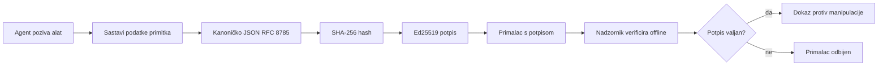
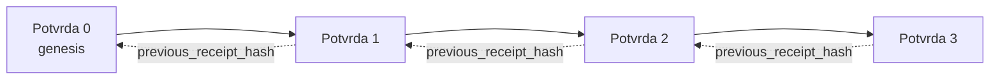

[Watch the lesson video: Sigurnost AI agenata s kriptografskim potvrđivanjima](https://youtu.be/PLACEHOLDER_VIDEO_ID)

> _(Video lekcije i sličica bit će dodani od strane Microsoft tima za sadržaj nakon spajanja, u skladu s obrascem lekcije 14 / 15.)_

# Sigurnost AI agenata s kriptografskim potvrđivanjima

## Uvod

Ova lekcija će obuhvatiti:

- Zašto su audit staze za AI agente važne za usklađenost, otklanjanje pogrešaka i povjerenje.
- Što je kriptografski račun (potvrda) i kako se razlikuje od nepotištene linije dnevnika.
- Kako proizvesti potpisani račun za poziv alata agenta u običnom Pythonu.
- Kako offline verificirati račun i otkriti manipulacije.
- Kako povezati račune tako da uklanjanje ili preraspoređivanje jednog prekida lanac.
- Što računi dokazuju, a što izričito ne dokazuju.

## Ciljevi učenja

Nakon završetka ove lekcije, znat ćete kako:

- Prepoznati načine pogreške koji motiviraju kriptografsko podrijetlo radnji agenta.
- Proizvesti račun potpisan Ed25519 ključem preko kanoničkog JSON opterećenja.
- Neovisno verificirati račun koristeći samo javni ključ potpisnika.
- Otkrivati manipulacije ponovnim pokretanjem verifikacije na izmijenjenom računu.
- Izgraditi lanac hashiranih računa i objasniti zašto je lanac bitan.
- Prepoznati granicu između onoga što računi dokazuju (pripisivanje, integritet, redoslijed) i onoga što ne dokazuju (točnost radnje, valjanost politike).

## Problem: Audit staza vašeg agenta

Zamislite da ste implementirali AI agenta za Contoso Travel. Agent čita zahtjeve kupaca, poziva API za letove da traži opcije i rezervira mjesta u ime kupca. Prošli kvartal, agent je obradio 50.000 rezervacija.

Danas dolazi revizor. Postavlja jednostavno pitanje: "Pokažite mi što je vaš agent radio."

Vi mu dajete log datoteke. Revizor ih pregleda i postavlja teže pitanje: "Kako znam da ti logovi nisu uređivani?"

To je problem audit staze. Većina današnjih implementacija agenata oslanja se na:

- **Aplikacijske dnevnike**: koje piše sam agent, može ih urediti svatko tko ima pristup datotečnom sustavu.
- **Cloud usluge zapisivanja**: dokazive o manipulaciji na razini platforme, ali samo ako revizor vjeruje platformskom operatoru.
- **Dnevničke zapise baza podataka**: prilagođene za promjene u bazi podataka, ali ne za proizvoljne pozive alata.

Nijedan od ovih ne može odgovoriti revizoru bez da revizor vjeruje nekome (vama, vašem cloud pružatelju, vašem dobavljaču baze podataka). Za internu upotrebu, takvo povjerenje često je prihvatljivo. Za regulirane radne opterećenja (financije, zdravstvo, bilo što pod EU AI Zakonom) nije.

Kriptografska potvrđivanja to rješavaju tako što svaku radnju agenta čine neovisno provjerljivom. Revizor vam ne mora vjerovati; treba mu samo vaš javni ključ i sam račun.

## Što je kriptografski račun?

Račun je JSON objekt koji bilježi što je agent napravio, potpisan digitalnim potpisom.


```mermaid
flowchart LR
    A[Agent poziva alat] --> B[Sastavi podatke primitka]
    B --> C[Kanoničko JSON RFC 8785]
    C --> D[SHA-256 hash]
    D --> E[Ed25519 potpis]
    E --> F[Primalac s potpisom]
    F --> G[Nadzornik verificira offline]
    G --> H{Potpis valjan?}
    H -- da --> I[Dokaz protiv manipulacije]
    H -- ne --> J[Primalac odbijen]
```

Minimalni račun izgleda ovako:

```json
{
  "type": "agent.tool_call.v1",
  "agent_id": "contoso-travel-bot",
  "tool_name": "lookup_flights",
  "tool_args_hash": "sha256:a3f9c1...",
  "result_hash": "sha256:7b2e1d...",
  "policy_id": "contoso-travel-policy-v3",
  "timestamp": "2026-04-25T14:30:00Z",
  "sequence": 47,
  "previous_receipt_hash": "sha256:9d4e6a...",
  "signature": {
    "alg": "EdDSA",
    "sig": "c5af83...",
    "public_key": "8f3b2c..."
  }
}
```

Tri svojstva obavljaju posao:

1. **Potpis**. Račun potpisuje pristupnik (gateway) agenta koristeći Ed25519 privatni ključ. Svako tko ima pripadajući javni ključ može offline provjeriti potpis. Manipulacija bilo kojim poljem poništava potpis.

2. **Kanoničko kodiranje**. Prije potpisivanja, račun se serijalizira koristeći JSON Canonicalization Scheme (JCS, RFC 8785). To osigurava da dvije implementacije koje proizvode isti logički račun daju identičan niz bajtova. Bez kanonizacije, različiti JSON serijalizatori proizvodili bi različite potpise za isti sadržaj.

3. **Hash lanac**. Polje `previous_receipt_hash` povezuje svaki račun s prethodnim. Uklanjanje ili preraspoređivanje računa lomi svaki račun koji dolazi nakon toga. Manipulacije postaju vidljive na razini lanca, čak i ako se pojedinačni potpisi zaobiđu.

Zajedno ta svojstva pružaju tri jamstva:

- **Pripisivanje**: ovaj ključ je potpisao ovaj sadržaj.
- **Integritet**: sadržaj nije promijenjen od potpisivanja.
- **Redoslijed**: ovaj račun je došao nakon onog računa u lancu.

## Proizvodnja računa u Pythonu

Ne trebate posebnu biblioteku za proizvodnju računa. Kriptografske primitive su široko dostupne, a logika je nekoliko desetaka linija Python koda.

Praktični primjeri u `code_samples/18-signed-receipts.ipynb` prolaze cijeli tijek. Sažetak:

```python
import json
import hashlib
import base64
from nacl import signing
from jcs import canonicalize  # RFC 8785 kanonički JSON

def b64url_nopad(data: bytes) -> str:
    return base64.urlsafe_b64encode(data).decode("ascii").rstrip("=")

def sha256_canonical(obj) -> str:
    """SHA-256 of a Python object's JCS-canonical JSON form."""
    return f"sha256:{hashlib.sha256(canonicalize(obj)).hexdigest()}"

# Generirajte ili učitajte ključ za potpisivanje (u produkciji, spremite ga u skladište ključeva)
signing_key = signing.SigningKey.generate()
verify_key = signing_key.verify_key

# Izgradite koristni teret potvrde (još bez potpisa)
tool_args = {"origin": "SYD", "destination": "LAX"}
tool_result = [{"flight": "QF11", "price": 1850, "stops": 0}]

payload = {
    "type": "agent.tool_call.v1",
    "agent_id": "contoso-travel-bot",
    "tool_name": "lookup_flights",
    "tool_args_hash": sha256_canonical(tool_args),
    "result_hash": sha256_canonical(tool_result),
    "policy_id": "contoso-travel-policy-v3",
    "timestamp": "2026-04-25T14:30:00Z",
    "sequence": 0,
    "previous_receipt_hash": None,
}

# Kanonizirajte, izračunajte hash, potpišite.
canonical_bytes = canonicalize(payload)
message_hash = hashlib.sha256(canonical_bytes).digest()
signature_bytes = signing_key.sign(message_hash).signature

# Priložite strukturirani objekt potpisa.
receipt = {
    **payload,
    "signature": {
        "alg": "EdDSA",
        "sig": b64url_nopad(signature_bytes),
        "public_key": b64url_nopad(bytes(verify_key)),
    },
}
```

To je cijeli proces potpisivanja. Vježbe u bilježnici vode kroz svaki korak.

## Verifikacija računa i otkrivanje manipulacija

Verifikacija je obratna operacija:

```python
import base64
import hashlib
from nacl import signing
from nacl.exceptions import BadSignatureError
from jcs import canonicalize

def b64url_decode(s: str) -> bytes:
    padding = "=" * ((4 - len(s) % 4) % 4)
    return base64.urlsafe_b64decode(s + padding)

def verify_receipt(receipt: dict) -> bool:
    # Potpis je strukturirani objekt: {"alg", "sig", "public_key"}.
    sig_obj = receipt.get("signature")
    if not sig_obj or sig_obj.get("alg") != "EdDSA":
        return False

    # Rekonstruirajte teret koji je zapravo potpisan (sve osim potpisa).
    payload = {k: v for k, v in receipt.items() if k != "signature"}

    canonical_bytes = canonicalize(payload)
    message_hash = hashlib.sha256(canonical_bytes).digest()

    try:
        verify_key = signing.VerifyKey(b64url_decode(sig_obj["public_key"]))
        verify_key.verify(message_hash, b64url_decode(sig_obj["sig"]))
        return True
    except BadSignatureError:
        return False
```

Ova funkcija prima račun i vraća `True` ako je potpis valjan, `False` inače. Nema mrežnog poziva, nema ovisnosti o servisima, nije potrebno povjerenje u treću stranu.

Za prikaz otkrivanja manipulacija, bilježnica prolazi kroz:

1. Proizvođenje valjanog računa i potvrđivanje da prolazi verifikaciju.
2. Izmjenu jednog bajta u polju `tool_args_hash`.
3. Ponovno pokretanje verifikacije i vidjeti da ne uspije.

Ovo je praktičan dokaz da su računi dokazivi na manipulaciju: svaka promjena, koliko god mala, lomi potpis.

## Povezivanje računa za agente s više koraka

Jedan potpisani račun štiti jednu radnju. Lanac računa štiti sekvencu.


```mermaid
flowchart LR
    R0[Potvrda 0<br/>genesis] --> R1[Potvrda 1]
    R1 --> R2[Potvrda 2]
    R2 --> R3[Potvrda 3]
    R1 -. previous_receipt_hash .-> R0
    R2 -. previous_receipt_hash .-> R1
    R3 -. previous_receipt_hash .-> R2
```

Svaki račun bilježi hash prethodnog računa. Da bi napadač tiho uklonio račun 2, morao bi:

- Izmijeniti polje `previous_receipt_hash` računa 3 (što lomi potpis računa 3), ILI
- Krivotvoriti novi potpis na izmijenjenom računu 3 (što zahtijeva privatni ključ agenta).

Ako je privatni ključ u hardverskom spremištu ključeva i javni ključ je objavljen s svakim računom, nijedan od tih napada nije izvediv bez detekcije.

Bilježnica prolazi kroz:

1. Izgradnju lanca od tri računa.
2. Provjeru da svaki `previous_receipt_hash` računa odgovara stvarnom hashu prethodnog računa.
3. Manipulaciju jednim računom u sredini i promatranje prekida lanca točno u toj točki.

Tako pravite audit stazu koju vanjski revizor može verificirati bez povjerenja u vas.

## Što računi dokazuju (i što ne)

Ovo je najvažniji dio ove lekcije. Računi su moćni, ali njihova moć je ograničena.

**Računi dokazuju tri stvari:**

1. **Pripisivanje**: određeni ključ je potpisao određeni teret.
2. **Integritet**: teret nije promijenjen od potpisivanja.
3. **Redoslijed**: ovaj račun je došao nakon onog u hash lancu.

**Računi NE dokazuju:**

1. **Ispravnost**: da je radnja agenta bila ispravna. Račun se može potpisati i za pogrešan odgovor jednako lako kao i za točan.
2. **Usklađenost s politikom**: da je politika navedena u `policy_id` stvarno evaluirana, ili da bi dozvolila ovu radnju ako bi bila provjerena. Račun bilježi što je tvrdnjeno, ne što je provedeno.
3. **Identitet izvan ključa**: račun kaže "ovaj ključ je potpisao ovaj sadržaj." Ne kaže "ovaj čovjek je autorizirao ovo." Povezivanje ključa s osobom ili organizacijom zahtjeva zasebnu infrastrukturu identiteta (imenik, registar javnih ključeva itd.).
4. **Istinitost unosa**: ako agent primi manipulirani upit i djeluje na njemu, račun vjerno bilježi akciju. Računi su nizvodno od validacije unosa, nisu njezina zamjena.

Ova granica je važna iz dva razloga:

- Govori za što su računi korisni: čine ponašanje agenta audibilnim i dokazivo otkrivajuće manipulaciju, čak i preko organizacijskih granica.
- Govori koje dodatne slojeve još trebate: validaciju unosa (Lekcija 6), provođenje politike (ukratko ovdje) i infrastrukturu identiteta (izvan dosega ove lekcije).

Česta pogreška je pretpostaviti da "imamo račune" znači "upravljamo." Ne znači. Računi su temelj. Upravljanje je sustav koji gradite na tom temelju.

## Proizvodna referenca

Python kod u ovoj lekciji je namjerno minimalan da biste mogli pročitati svaku liniju i razumjeti što se točno događa. U produkciji imate dvije opcije:

1. **Graditi direktno na kriptografskim primitivima.** 50 linija koje ste vidjeli gore dovoljno je za mnoge slučajeve. PyNaCl (Ed25519) i `jcs` paket (kanonički JSON) su dobro održavane i revidirane biblioteke.

2. **Koristiti produkcijsku biblioteku za račune.** Nekoliko open-source projekata implementira isti obrazac s dodatnim značajkama (rotacija ključeva, batch verifikacija, distribucija JWK seta, integracija s policy engineima):
   - Format računa korišten u ovoj lekciji slijedi IETF Internet-Draft (`draft-farley-acta-signed-receipts`) trenutno u procesu standardizacije.
   - Microsoft Agent Governance Toolkit kombinira račune s odlukama o politici baziranim na Cedar-u; vidi 33. tutorial u tom repozitoriju za kompletan primjer.
   - Paketi `protect-mcp` (npm) i `@veritasacta/verify` (npm) pružaju Node implementaciju potpisivanja i offline verifikacije računa, namijenjenu za omotavanje bilo kojeg MCP servera s audit stazom koja dokazuje manipulaciju.
   - **[nobulex](https://github.com/arian-gogani/nobulex)** Python SDK (`pip install nobulex`) daje isti Ed25519 + JCS potpisni obrazac u Pythonu s LangChain i CrewAI integracijama, uključujući objavljene vektore za međusobnu provjeru i mapiranje usklađenosti doprinijeto putem [OWASP PR #2210](https://github.com/OWASP/CheatSheetSeries/pull/2210).

Odluka između pravljenja vlastitog i korištenja biblioteke sliči odluci između pisanja vlastite JWT biblioteke ili korištenja testirane: oba su razumna; biblioteka štedi vrijeme i smanjuje površinu revizije; pristup iz temelja vas sili razumjeti svaki primitiv. Ova lekcija uči put iz temelja da imate temelj za obje mogućnosti.

## Provjera znanja

Testirajte svoje razumijevanje prije nego nastavite na praktičnu vježbu.

**1. Račun je potpisan privatnim Ed25519 ključem agenta. Revizor ima samo javni ključ. Može li revizor verificirati račun offline?**

<details>
<summary>Odgovor</summary>

Da. Ed25519 verifikacija zahtijeva samo javni ključ i potpisane bajtove. Nema mrežnog poziva, nema ovisnosti o servisima. Ovo je svojstvo koje račune čini korisnima u zračnim prazninama, višeorganizacijskim ili nisko-povjerljivim audit okruženjima.
</details>

**2. Napadač mijenja polje `policy_id` računa da tvrdi da je upravljano permisivnijom politikom. Potpis je bio nad izvornim teretom. Što se događa prilikom verifikacije?**

<details>
<summary>Odgovor</summary>

Verifikacija ne uspijeva. Potpis je računan nad kanoničkim bajtovima izvornog tereta; izmjena bilo kojeg polja mijenja kanoničke bajtove, što mijenja SHA-256 hash, što potpis čini nevaljanim. Napadaču bi bio potreban privatni ključ da proizvede novi valjani potpis, a nema ga.
</details>

**3. Zašto račun uključuje `tool_args_hash` i `result_hash` umjesto sirovih argumenata i rezultata?**

<details>
<summary>Odgovor</summary>

Dvije su razloga. Prvo, račun može trebati biti arhiviran ili prenošen u okruženjima gdje je curenje sirovog sadržaja (osobni podaci, poslovni podaci) problem. Hashiranje održava račun malim i sadržaj privatnim; revizor provjerava da hash odgovara zasebno pohranjenoj kopiji stvarnog sadržaja. Drugo, hashovi imaju fiksnu veličinu; račun s hashovima je ograničene veličine bez obzira koliko su veliki ulazi i izlazi.
</details>

**4. Polje `previous_receipt_hash` povezuje svaki račun s prethodnikom. Ako napadač tiho obriše jedan račun iz sredine lanca, što postaje nevaljano?**

<details>
<summary>Odgovor</summary>

Svaki račun koji je došao nakon obrisanog. Njihova polja `previous_receipt_hash` više ne odgovaraju stvarnom lancu (jer račun na koji su pokazivali ne postoji ili lanac sada pokazuje na drugog prethodnika). Da bi prikrio brisanje, napadač bi morao ponovno potpisati svaki kasniji račun, što zahtijeva privatni ključ.
</details>

**5. Račun se verificira uredno. Dokazuje li to da je radnja agenta bila ispravna, valjana ili u skladu s politikom?**

<details>
<summary>Odgovor</summary>

Ne. Valjan račun dokazuje tri stvari: pripisivanje (ovaj ključ je potpisao ovaj sadržaj), integritet (sadržaj nije promijenjen) i redoslijed (ovaj račun je došao nakon onog). Ne dokazuje da je radnja bila ispravna, da je politika iz `policy_id` stvarno evaluirana, ili da se agent pridržavao svih pravila. Računi čine ponašanje agenta audibilnim, ne nužno ispravnim. Ovo je najvažnija granica u lekciji.
</details>

## Praktična vježba

Otvorite `code_samples/18-signed-receipts.ipynb` i dovršite svih četiri dijela:

1. **Dio 1**: Potpišite svoj prvi račun i verificirajte ga.
2. **Dio 2**: Manipulirajte računom i promatrajte pad verifikacije.
3. **Dio 3**: Izgradite lanac od tri računa i provjerite integritet lanca.
4. **Dio 4**: Primijenite obrazac na agenta izgrađenog s Microsoft Agent Frameworkom: omotajte poziv alatu u potpisivanje računa, zatim neovisno verificirajte račun.
**Izazov za razvijanje 1:** proširite shemu primitka dodatnim poljem po vlastitom izboru (na primjer, ID zahtjeva za praćenje), ažurirajte logiku kanonskog potpisivanja da ga uključi i potvrdite da primka još uvijek prolazi kroz verifikaciju. Zatim izmijenite polje nakon potpisivanja i potvrdite da verifikacija ne uspijeva. To vas prisiljava da razumijete kako svaki bajt kanonskog kodiranja doprinosi potpisu.

**Izazov za razvijanje 2:** SHA-256 hashajte dvije svoje primke zajedno (spojite njihove kanonske bajtove u determinističkom redoslijedu) i ugurajte dobiveni sažetak kao novo polje u treću primku prije potpisivanja. Potvrdite da sve tri primke još uvijek prolaze verifikaciju. Upravo ste izgradili dokaz uključivanja u jednom koraku: svatko tko ima treću primku može dokazati da su prve dvije postojale u trenutku kada je ona potpisana, bez potrebe za otkrivanjem njihovog sadržaja. Ovo je obrazac koji primke sa selektivnim otkrivanjem koriste u velikim razmjerima (Merkleovi kompleti, RFC 6962).

## Zaključak

Kriptografske primke daju AI agentima auditni trag koji je:

- **Neovisno provjerljiv:** bilo koja strana s javnim ključem može provjeriti, bez ovisnosti o usluzi.
- **Otporn na manipulacije:** svaka izmjena poništava potpis.
- **Prijenosiv:** primka je mala JSON datoteka; može se arhivirati, prenositi i provjeravati bilo gdje.
- **U skladu sa standardima:** izgrađena na Ed25519 (RFC 8032), JCS (RFC 8785) i SHA-256, sve široko rasprostranjene primitivne metode.

Nisu zamjena za validaciju unosa, provođenje pravila ili identitetsku infrastrukturu. Oni su temelj za te slojeve. Kada postavljate agente u regulirana radna opterećenja, višeslojne radne tokove više organizacija ili bilo koje okruženje gdje ne možete pretpostaviti budućeg revizora kao povjerljivog, primke su način da auditni trag bude pošten.

Najvažnija spoznaja: primke dokazuju tko je što rekao i kada. Ne dokazuju da je ono što je rečeno bilo istinito ili točno. Držite tu razliku čvrsto. To je razlika između poštenog sustava porijekla i obmanjujućeg.

## Kontrolni popis za produkciju

Kad budete spremni prijeći s ovogodišnje lekcije na postavljanje agenata potpisanih primkama u stvarnom okruženju:

- [ ] **Premjestite ključ za potpisivanje s developerskog prijenosnika.** Koristite Azure Key Vault, AWS KMS ili hardverski sigurnosni modul. Privatni ključ koji potpisuje vaše primke nikada ne smije biti u repozitoriju izvornog koda ili u običnom tekstu na računarskim strojevima za aplikaciju.
- [ ] **Objavite javni ključ za verifikaciju.** Revizori ga trebaju za offline provjeru. Standardni obrazac je JWK set na poznatoj URL adresi (RFC 7517), npr. `https://your-org.example.com/.well-known/agent-keys.json`.
- [ ] **Učvrstite lanac vanjskim putem.** Povremeno zapisujte zadnji hash glave lanca u transparentni dnevnik (Sigstore Rekor, RFC 3161 timestamp authority ili drugi interni sustav) da bi vanjska strana mogla potvrditi „da je ovaj lanac postojan u ovom vremenu“.
- [ ] **Spremite primke nepromjenjivo.** Spremišta samo za dodavanje (Azure Storage s politikama nepromjenjivosti, AWS S3 Object Lock) sprječavaju unutarnjeg korisnika da prepravi povijest na sloju pohrane.
- [ ] **Odlučite o zadržavanju.** Mnogi režimi usklađenosti zahtijevaju višegodišnje zadržavanje. Planirajte rast primki (svaka primka je ~500 bajtova; agent koji pravi 10 000 poziva dnevno proizvodi ~1,8 GB godišnje).
- [ ] **Dokumentirajte što primke ne pokrivaju.** Primke dokazuju atribuciju, integritet i redoslijed. Vaš priručnik trebaju eksplicitno navesti koje dodatne kontrole (validacija unosa, provođenje pravila, ograničenje brzine, identitetska infrastruktura) stoje uz primke u vašem upravljanju.

### Imate dodatnih pitanja o osiguranju AI agenata?

Pridružite se [Microsoft Foundry Discordu](https://aka.ms/ai-agents/discord) da upoznate druge učenike, sudjelujete na uredskim satima i dobijete odgovore na pitanja o AI agentima.

## Izvan ove lekcije

Ova lekcija pokriva potpisivanje jedne primke i lančane hash sekvence. Iste primitivne metode komponiraju se u nekoliko naprednijih obrazaca koje možete susresti kako vaš upravljački položaj sazrijeva:

- **Selektivno otkrivanje.** Kad su polja primke neovisno potvrđena (RFC 6962-stil Merkleovo stablo), možete otkriti određena polja određenim revizorima i dokazati da su ostala nepromijenjena bez izlaganja. Korisno kada ista primka mora zadovoljiti i opširan audit (koji traži potpunost) i propise o minimiziranju podataka poput GDPR-a (koji žele da revizor vidi što je moguće manje).
- **Poništenje primke.** Ako je ključ za potpisivanje kompromitiran, treba vam način da označite sve primke potpisane tim ključem kao nepouzdane od točke u vremenu nadalje. Standardni obrasci: kratkoročni ključevi za potpisivanje plus objavljene liste poništenja ili transparentni dnevnik s unosima poništenja.
- **Obostrane / podijeljene primke s potpisima.** Neke implementacije dijele potpisani teret na poluproizvodnju prije izvršenja (`authorization_*`) i nakon izvršenja (`result_*`) s neovisnim potpisima, korisno kada odluku o autorizaciji i zapaženi rezultat proizvode različiti akteri ili u različito vrijeme. Ovo se dodatno nadograđuje na format primke naučen u ovoj lekciji.
- **Sastav tereta.** Primka pečati bilo koje bajtove koje stavite u `result_hash`. Stvarni tereti često su bogatiji od pojedinačnog rezultata poziva alata: razlozi prije odluke (predviđanje modela, razmotrene opcije, dokazi i njihova potpunost, procjena rizika, lanac odgovornosti, ishod ključa) mogu sva živjeti unutar tereta, pečatirani jednom primkom. Ovo održava format primke minimalnim, a dopušta evoluciju šema tereta po domenu.
- **Usklađenost između implementacija.** Više neovisnih implementacija istog formata primke (Python, TypeScript, Rust, Go) međusobno se verifikiraju prema zajedničkim testnim vektorima. Ako razvijate vlastitu implementaciju, validacija prema objavljenim vektorima potvrđuje kompatibilnost.
- **Migracija prema post-kvantnom razdoblju.** Ed25519 je danas široko rasprostranjen, ali nije kvantno-otporan. Format primke je algoritamski fleksibilan: polje `signature.alg` može nositi `ML-DSA-65` (NIST post-kvantan standard potpisa) kada trebate migrirati. Planirajte prijelazno razdoblje gdje su primke dvosmjerno potpisane.

## Dodatni resursi

- <a href="https://datatracker.ietf.org/doc/draft-farley-acta-signed-receipts/" target="_blank">IETF Internet-Radni dokument: Potpisane primke odluka za strojem sa strojem kontrolu pristupa</a>
- <a href="https://learn.microsoft.com/azure/ai-studio/responsible-use-of-ai-overview" target="_blank">Pregled odgovorne AI (Azure AI)</a>
- <a href="https://datatracker.ietf.org/doc/html/rfc8032" target="_blank">RFC 8032: Digitalni potpisni algoritam Edwardsove krivulje (EdDSA)</a>
- <a href="https://datatracker.ietf.org/doc/html/rfc8785" target="_blank">RFC 8785: JSON šema kanonizacije (JCS)</a>
- <a href="https://datatracker.ietf.org/doc/html/rfc6962" target="_blank">RFC 6962: Transparentnost certifikata</a> (Merkleova konstrukcija stabla korištena u primkama sa selektivnim otkrivanjem)
- <a href="https://github.com/microsoft/agent-governance-toolkit/blob/main/docs/tutorials/33-offline-verifiable-receipts.md" target="_blank">Microsoft Agent Governance Toolkit, Tutorijal 33: Offline-Verifiable Decision Receipts</a>
- <a href="https://github.com/ScopeBlind/agent-governance-testvectors" target="_blank">Testni vektori usklađenosti između implementacija</a> za format primke korišten u ovoj lekciji (Apache-2.0)
- <a href="https://pynacl.readthedocs.io/" target="_blank">PyNaCl dokumentacija</a> (Ed25519 u Pythonu)

## Prethodna lekcija

[Izgradnja agenata za korištenje računala (CUA)](../15-browser-use/README.md)

---

<!-- CO-OP TRANSLATOR DISCLAIMER START -->
**Napomena**:
Ovaj dokument je preveden korištenjem AI prevoditeljskog servisa [Co-op Translator](https://github.com/Azure/co-op-translator). Iako težimo točnosti, imajte na umu da automatski prijevodi mogu sadržavati greške ili netočnosti. Izvorni dokument na izvornom jeziku treba smatrati autoritativnim izvorom. Za važne informacije preporuča se profesionalni ljudski prijevod. Nismo odgovorni za bilo kakva nesporazumevanja ili pogrešne interpretacije koje proizlaze iz korištenja ovog prijevoda.
<!-- CO-OP TRANSLATOR DISCLAIMER END -->