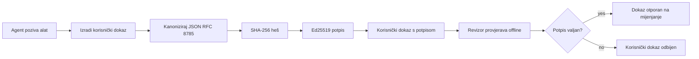
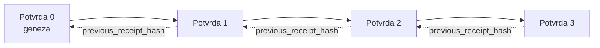

[Pogledajte video lekciju: Osiguravanje AI agenata kriptografskim potvrdom](https://youtu.be/PLACEHOLDER_VIDEO_ID)

> _(Video lekcija i sličica bit će dodani od strane Microsoft sadržajnog tima nakon spajanja, usklađeno s uzorkom lekcija 14 / 15.)_

# Osiguravanje AI agenata kriptografskim potvrdom

## Uvod

Ova lekcija će obraditi:

- Zašto su audit tragovi za AI agente važni za usklađenost, otklanjanje pogrešaka i povjerenje.
- Što je kriptografska potvrda i kako se razlikuje od neoznačenog zapisa dnevnika.
- Kako proizvesti potpisanu potvrdu za poziv alata agenta u čistom Pythonu.
- Kako provjeriti potvrdu offline i otkriti manipulacije.
- Kako povezati potvrde lančano tako da uklanjanje ili promjena redoslijeda jedne prekida lanac.
- Što potvrde dokazuju, a što eksplicitno ne dokazuju.

## Ciljevi učenja

Nakon završetka ove lekcije znat ćete kako:

- Identificirati načine pogrešaka koji motiviraju kriptografsko podrijetlo za radnje agenta.
- Proizvesti Ed25519-potpisanu potvrdu nad kanoniziranim JSON sadržajem.
- Neovisno provjeriti potvrdu koristeći samo javni ključ potpisivača.
- Otkriti manipulacije ponovnim pokretanjem provjere na izmijenjenoj potvrdi.
- Izgraditi hash-vezani niz potvrda i objasniti zašto je lanac važan.
- Prepoznati granicu između onoga što potvrde dokazuju (atribucija, integritet, redoslijed) i onoga što ne dokazuju (ispravnost radnje, valjanost politike).

## Problem: Audit trag vašeg agenta

Zamislite da ste implementirali AI agenta za Contoso Travel. Agent čita zahtjeve korisnika, poziva API za letove kako bi pronašao opcije i rezervira sjedala u ime korisnika. U prošlom kvartalu agent je obradio 50.000 rezervacija.

Danas dolazi revizor. Postavlja jednostavno pitanje: "Pokažite mi što je vaš agent radio."

Predajete mu svoje zapisnike. Revizor ih pogledava i postavlja teže pitanje: "Kako da znam da zapisnici nisu uređivani?"

Ovo je problem audit traga. Većina današnjih implementacija agenata oslanja se na:

- **Zapisnike aplikacija**: piše ih sam agent, može ih urediti svatko tko ima pristup datotečnom sustavu.
- **Cloud usluge za vođenje zapisnika**: otkrivaju manipulacije na razini platforme, ali samo ako revizor vjeruje operatoru platforme.
- **Zapisnike baza podataka**: prikladni za promjene u bazi, ali ne za proizvoljne pozive alata.

Ni jedan od ovih ne može odgovoriti na revizorsko pitanje bez da revizor mora vjerovati nekom (vama, vašem cloud dobavljaču, dobavljaču baze podataka). Za internu upotrebu, to se često prihvaća. Za regulirane radne opterećenja (financije, zdravstvo, bilo što pod EU AI uredbom) nije.

Kriptografske potvrde rješavaju taj problem čineći svaku radnju agenta neovisno provjerljivom. Revizor vam ne mora vjerovati. Potreban mu je samo vaš javni ključ i sama potvrda.

## Što je kriptografska potvrda?

Potvrda je JSON objekt koji bilježi što je agent učinio, potpisan digitalnim potpisom.


```mermaid
flowchart LR
    A[Agent poziva alat] --> B[Izradi korisnički dokaz]
    B --> C[Kanoniziraj JSON RFC 8785]
    C --> D[SHA-256 heš]
    D --> E[Ed25519 potpis]
    E --> F[Korisnički dokaz s potpisom]
    F --> G[Revizor provjerava offline]
    G --> H{Potpis valjan?}
    H -- yes --> I[Dokaz otporan na mijenjanje]
    H -- no --> J[Korisnički dokaz odbijen]
```

Minimalna potvrda izgleda ovako:

```json
{
  "type": "agent.tool_call.v1",
  "agent_id": "contoso-travel-bot",
  "tool_name": "lookup_flights",
  "tool_args_hash": "sha256:a3f9c1...",
  "result_hash": "sha256:7b2e1d...",
  "policy_id": "contoso-travel-policy-v3",
  "timestamp": "2026-04-25T14:30:00Z",
  "sequence": 47,
  "previous_receipt_hash": "sha256:9d4e6a...",
  "signature": {
    "alg": "EdDSA",
    "sig": "c5af83...",
    "public_key": "8f3b2c..."
  }
}
```

Tri svojstva obavljaju posao:

1. **Potpis**. Potvrdu potpisuje agentov gateway koristeći Ed25519 privatni ključ. Svako tko ima odgovarajući javni ključ može offline provjeriti potpis. Manipulacija bilo kojim poljem poništava potpis.

2. **Kanonizirani zapis**. Prije potpisivanja, potvrda se serijalizira koristeći JSON Canonicalization Scheme (JCS, RFC 8785). To osigurava da ako dvije implementacije proizvedu isti logički sadržaj potvrde, oni proizvode bit-identičan izlaz. Bez kanonizacije, različiti JSON serijalizatori bi proizveli različite potpise za isti sadržaj.

3. **Lančanje hash-ova**. Polje `previous_receipt_hash` povezuje svaku potvrdu s prethodnom. Uklanjanje ili promjena redoslijeda potvrde prekida svaku potvrdu nakon nje. Manipulacija postaje vidljiva na razini lanca čak i ako se pojedinačni potpisi zaobiđu.

Zajedno ova svojstva pružaju tri jamstva:

- **Atribucija**: ovaj ključ je potpisao ovaj sadržaj.
- **Integritet**: sadržaj se nije promijenio od potpisivanja.
- **Redoslijed**: ova potvrda je došla nakon one potvrde u lancu.

## Proizvodnja potvrde u Pythonu

Ne treba vam posebna biblioteka za proizvodnju potvrde. Kriptografski primitivci su široko dostupni, a logika je nekoliko desetaka linija Python koda.

Praktične vježbe u `code_samples/18-signed-receipts.ipynb` vode kroz cijeli tijek. Sažetak:

```python
import json
import hashlib
import base64
from nacl import signing
from jcs import canonicalize  # RFC 8785 kanonski JSON

def b64url_nopad(data: bytes) -> str:
    return base64.urlsafe_b64encode(data).decode("ascii").rstrip("=")

def sha256_canonical(obj) -> str:
    """SHA-256 of a Python object's JCS-canonical JSON form."""
    return f"sha256:{hashlib.sha256(canonicalize(obj)).hexdigest()}"

# Generiraj ili učitaj ključ za potpisivanje (u produkciji, pohrani u sigurnosni spremnik ključeva)
signing_key = signing.SigningKey.generate()
verify_key = signing_key.verify_key

# Izgradi korisnički podatak potvrde (još bez potpisa)
tool_args = {"origin": "SYD", "destination": "LAX"}
tool_result = [{"flight": "QF11", "price": 1850, "stops": 0}]

payload = {
    "type": "agent.tool_call.v1",
    "agent_id": "contoso-travel-bot",
    "tool_name": "lookup_flights",
    "tool_args_hash": sha256_canonical(tool_args),
    "result_hash": sha256_canonical(tool_result),
    "policy_id": "contoso-travel-policy-v3",
    "timestamp": "2026-04-25T14:30:00Z",
    "sequence": 0,
    "previous_receipt_hash": None,
}

# Kanoniziraj, hashiraj, potpiši.
canonical_bytes = canonicalize(payload)
message_hash = hashlib.sha256(canonical_bytes).digest()
signature_bytes = signing_key.sign(message_hash).signature

# Priloži strukturirani objekt potpisa.
receipt = {
    **payload,
    "signature": {
        "alg": "EdDSA",
        "sig": b64url_nopad(signature_bytes),
        "public_key": b64url_nopad(bytes(verify_key)),
    },
}
```

To je cijeli postupak potpisivanja. Vježbe u bilježnici vode kroz svaki korak.

## Verifikacija potvrde i otkrivanje manipulacija

Provjera je inverzna operacija:

```python
import base64
import hashlib
from nacl import signing
from nacl.exceptions import BadSignatureError
from jcs import canonicalize

def b64url_decode(s: str) -> bytes:
    padding = "=" * ((4 - len(s) % 4) % 4)
    return base64.urlsafe_b64decode(s + padding)

def verify_receipt(receipt: dict) -> bool:
    # Potpis je strukturirani objekt: {"alg", "sig", "public_key"}.
    sig_obj = receipt.get("signature")
    if not sig_obj or sig_obj.get("alg") != "EdDSA":
        return False

    # Rekonstruirajte podatke koji su zapravo potpisani (sve osim potpisa).
    payload = {k: v for k, v in receipt.items() if k != "signature"}

    canonical_bytes = canonicalize(payload)
    message_hash = hashlib.sha256(canonical_bytes).digest()

    try:
        verify_key = signing.VerifyKey(b64url_decode(sig_obj["public_key"]))
        verify_key.verify(message_hash, b64url_decode(sig_obj["sig"]))
        return True
    except BadSignatureError:
        return False
```

Ova funkcija uzima potvrdu i vraća `True` ako je potpis važeći, inače `False`. Nema mrežnih poziva, nema ovisnosti o servisu, ne treba povjerenje u treću stranu.

Da biste vidjeli detekciju manipulacije u akciji, bilježnica vodi kroz:

1. Proizvodnju valjane potvrde i potvrđivanje njezine valjanosti.
2. Mijenjanje jednog bajta u polju `tool_args_hash`.
3. Ponovno pokretanje provjere i vidjeti da ne uspije.

Ovo je praktični dokaz da su potvrde otporne na manipulacije: bilo kakva izmjena, ma koliko mala, prekida potpis.

## Lančanje potvrda za agente s više koraka

Jedna potpisana potvrda štiti jednu radnju. Lanac potvrda štiti slijed radnji.


```mermaid
flowchart LR
    R0[Potvrda 0<br/>geneza] --> R1[Potvrda 1]
    R1 --> R2[Potvrda 2]
    R2 --> R3[Potvrda 3]
    R1 -. previous_receipt_hash .-> R0
    R2 -. previous_receipt_hash .-> R1
    R3 -. previous_receipt_hash .-> R2
```

Svaka potvrda bilježi hash prethodne potvrde. Da bi napadač tiho uklonio potvrdu 2, morao bi:

- Izmijeniti polje `previous_receipt_hash` potvrde 3 (time se prekida potpis potvrde 3), ILI
- Krivotvoriti novi potpis za izmijenjenu potvrdu 3 (što zahtijeva privatni ključ agenta).

Ako je privatni ključ pohranjen u hardverskom ključarniku i javni ključ je objavljen uz svaku potvrdu, nijedan od napada nije izvediv bez otkrivanja.

Bilježnica vodi kroz:

1. Izgradnju lanca od tri potvrde.
2. Provjeru da se `previous_receipt_hash` svake potvrde podudara s stvarnim hash-om prethodne potvrde.
3. Manipulaciju jedne potvrde u sredini i vidjeti da se lanac prekida upravo u toj točki.

Tako proizvodite audit trag koji vanjski revizor može provjeriti bez da vam mora vjerovati.

## Što potvrde dokazuju (a što ne dokazuju)

Ovo je najvažniji odjeljak ove lekcije. Potvrde su moćne, ali njihova moć je ograničena.

**Potvrde dokazuju tri stvari:**

1. **Atribuciju**: specifični ključ je potpisao specifični sadržaj.
2. **Integritet**: sadržaj se nije promijenio od potpisivanja.
3. **Redoslijed**: ova potvrda je došla nakon one druge u hash lancu.

**Potvrde ne dokazuju:**

1. **Ispravnost**: da je radnja agenta bila ispravna. Potvrda se može potpisati jednako za krivi odgovor kao i za pravi.
2. **Usklađenost s politikom**: da je politika označena u `policy_id` zaista evaluirana, ili da bi dopustila ovu radnju ako bi bila provjeravana. Potvrda bilježi što je tvrdnjeno, ne što je provedeno.
3. **Identitet izvan ključa**: potvrda kaže "ovaj ključ je potpisao ovaj sadržaj." Ne kaže "ovaj čovjek je autorizirao ovo." Povezivanje ključa s osobom ili organizacijom zahtijeva zasebnu infrastrukturu identiteta (adresar, registar javnih ključeva itd.).
4. **Iskrenost unosa**: ako agent prima manipuliran upit i izvršava ga, potvrda vjerno bilježi radnju. Potvrde dolaze nakon provjere unosa, nisu zamjena za nju.

Ova granica je važna zbog dva razloga:

- Govori vam za što su potvrde korisne: učiniti radnje agenta revizorski provjerljivima i otkrivati manipulacije, čak i preko organizacijskih granica.
- Govori vam koje dodatne slojeve još trebate: provjeru unosa (Lekcija 6), provođenje politike (koje je ukratko opisano ispod) i infrastrukturu identiteta (van dosega ove lekcije).

Česta pogreška je pretpostaviti da "imamo potvrde" znači "upravljamo." Ne znači. Potvrde su temelj. Upravljanje je sustav koji gradite na njemu.

## Reference za proizvodnju

Python kod u ovoj lekciji je namjerno minimalan da biste mogli pročitati svaki redak i razumjeti točno što se događa. U produkciji imate dvije opcije:

1. **Graditi direktno na kriptografskim primitivcima.** 50 linija koje ste vidjeli je dovoljno za mnoge primjene. PyNaCl (Ed25519) i `jcs` paket (kanonični JSON) su dobro održavane i auditirane biblioteke.

2. **Koristiti produkcijsku biblioteku za potvrde.** Nekoliko open-source projekata implementira isti obrazac s dodatnim značajkama (rotacija ključeva, skupna provjera, distribucija skupa JWK, integracija s policy engine-ima):
   - Format potvrde korišten u ovoj lekciji slijedi IETF Internet-Draft (`draft-farley-acta-signed-receipts`) koji je trenutno u procesu standardizacije.
   - Microsoft Agent Governance Toolkit komponira potvrde s Cedar-based policy odlukama; vidi Tutorial 33 u tom repozitoriju za cjelovit primjer.
   - Paketi `protect-mcp` (npm) i `@veritasacta/verify` (npm) pružaju Node-based implementaciju potpisivanja i offline verifikacije potvrda, namijenjenu omotavanju bilo kojeg MCP servera s tamper-evident audit tragom.
   - **[nobulex](https://github.com/arian-gogani/nobulex)** Python SDK (`pip install nobulex`) daje isti Ed25519 + JCS obrazac potpisivanja u Pythonu s integracijama za LangChain i CrewAI, uključujući objavljene vektore za međusobnu provjeru i mapiranje usklađenosti doprinijelo putem [OWASP PR #2210](https://github.com/OWASP/CheatSheetSeries/pull/2210).

Odluka između izgradnje vlastitog i korištenja biblioteke odražava izbor između pisanja svoje JWT biblioteke i korištenja testirane: oba su razumna; biblioteka štedi vrijeme i smanjuje područje revizije; izgradnja od nule tjera vas da razumijete svaki primitiv. Ova lekcija uči prvi put da imate temelj za oba izbora.

## Provjera znanja

Testirajte svoje razumijevanje prije prelaska na praktičnu vježbu.

**1. Potvrda je potpisana privatnim Ed25519 ključem agenta. Revizor ima samo javni ključ. Može li revizor potvrdu provjeriti offline?**

<details>
<summary>Odgovor</summary>

Da. Ed25519 provjera zahtijeva samo javni ključ i potpisane bajtove. Nema mrežnih poziva, nema ovisnosti o usluzi. Ovo je svojstvo koje potvrde čini korisnima u okruženjima bez mreže, u višeorganizacijskim ili niskopovjerljivim revizijama.
</details>

**2. Napadač mijenja polje `policy_id` potvrde da tvrdi da ju je regulirala permisivnija politika. Potpis je bio nad izvornim sadržajem. Što se događa tijekom provjere?**

<details>
<summary>Odgovor</summary>

Provjera ne uspijeva. Potpis je izračunat nad kanoničnim bajtovima izvornog sadržaja; promjena bilo kojeg polja mijenja kanonične bajtove, što mijenja SHA-256 hash, što čini potpis nevažećim. Napadač bi trebao privatni ključ da proizvede novi valjani potpis, kojeg nema.
</details>

**3. Zašto potvrda uključuje `tool_args_hash` i `result_hash` umjesto sirovih argumenata i rezultata?**

<details>
<summary>Odgovor</summary>

Dva razloga. Prvo, potvrda može trebati biti arhivirana ili prenesena u okruženjima gdje curenje sirovog sadržaja (osobni podaci, poslovni podaci) predstavlja problem. Hashiranje čini potvrdu malom i sadržaj privatnim; revizor provjerava da hash odgovara zasebno pohranjenoj kopiji stvarnog sadržaja. Drugo, hashovi imaju fiksnu veličinu; potvrda s hashovima je ograničena veličinom bez obzira koliko su veliki unosi i izlazi bili.
</details>

**4. Polje `previous_receipt_hash` povezuje svaku potvrdu s prethodnom. Ako napadač tiho izbriše jednu potvrdu iz sredine lanca, što postaje nevažeće?**

<details>
<summary>Odgovor</summary>

Svaka potvrda koja je došla nakon izbrisane. Njihova polja `previous_receipt_hash` više se ne podudaraju sa stvarnim lancem (jer potvrda na koju su referirale ne postoji ili lanac sada pokazuje na drugog prethodnika). Da bi prikrio brisanje, napadač bi morao ponovno potpisati svaku kasniju potvrdu, što zahtijeva privatni ključ.
</details>

**5. Potvrda se provjerava kao valjana. Dokazuje li to da je radnja agenta bila ispravna, valjana ili usklađena s politikom?**

<details>
<summary>Odgovor</summary>

Ne. Valjana potvrda dokazuje tri stvari: atribuciju (ovaj ključ je potpisao ovaj sadržaj), integritet (sadržaj se nije promijenio) i redoslijed (ova potvrda je došla nakon druge). Ne dokazuje da je radnja bila ispravna, da je politika označena u `policy_id` zaista evaluirana ili da je agent slijedio sva pravila. Potvrde čine ponašanje agenta revizorski provjerljivim, ali ne nužno ispravnim. Ovo je najvažnija granica u lekciji.
</details>

## Praktična vježba

Otvorite `code_samples/18-signed-receipts.ipynb` i dovršite svih četiri dijela:

1. **Dio 1**: Potpišite svoju prvu potvrdu i provjerite je.
2. **Dio 2**: Manipulirajte potvrdom i promatrajte neuspjeh provjere.
3. **Dio 3**: Izgradite lanac od tri potvrde i provjerite integritet lanca.
4. **Dio 4**: Primijenite obrazac na agenta izrađenog s Microsoft Agent Framework-om: omotajte poziv alata potpisivanjem potvrde, zatim neovisno provjerite potvrdu.


**Izazov za proširenje 1:** proširite shemu potvrde s dodatnim poljem po vlastitom izboru (na primjer, ID zahtjeva za praćenje), ažurirajte kanonsku logiku potpisivanja da ga uključi, i potvrdite da potvrda i dalje prolazi kroz verifikaciju. Zatim izmijenite polje nakon potpisivanja i potvrdite da verifikacija ne uspije. Ovo vas prisiljava da razumijete kako svaki bajt kanonskog kodiranja doprinosi potpisu.

**Izazov za proširenje 2:** SHA-256 sažetak napravite od dvije vaše potvrde zajedno (spojite njihove kanonske bajtove u determinističkom redoslijedu) i ugrađite dobiveni digest kao novo polje u treću potvrdu prije potpisivanja. Provjerite da sve tri potvrde i dalje prolaze kroz verifikaciju. Upravo ste izgradili jednoslojni dokaz uključenosti: svatko tko drži treću potvrdu može dokazati da su prve dvije postojale u vrijeme potpisivanja, bez potrebe da otkriva njihov sadržaj. Ovo je obrazac koji potvrde selektivnog otkrivanja koriste u velikoj skali (Merkleovi potpisi, RFC 6962).

## Zaključak

Kriptografske potvrde daju AI agentima zapisnik za reviziju koji je:

- **Neovisno provjerljiv**: bilo koja strana s javnim ključem može provjeriti, bez ovisnosti o usluzi.
- **Otporan na neovlaštene izmjene**: svaka izmjena poništava potpis.
- **Prijenosiv**: potvrda je mala JSON datoteka; može se arhivirati, prenositi i verificirati bilo gdje.
- **U skladu sa standardima**: temeljen na Ed25519 (RFC 8032), JCS (RFC 8785) i SHA-256, svi široko korišteni primitivni algoritmi.

Nisu zamjena za validaciju unosa, provođenje politika ili infrastrukturu identiteta. Oni su temelj za te slojeve. Kad implementirate agente u regulirane zadatke, višestruke organizacijske radne tokove ili bilo koje okruženje gdje se ne može pretpostaviti povjerenje budućeg revizora, potvrde su način da zapisnik revizije bude iskren.

Najvažnija poruka: potvrde dokazuju tko je što rekao, kada. Ne dokazuju da je ono što je rečeno istinito ili točno. Držite tu razliku jasno. To je razlika između iskrenog sustava podrijetla i onog koji može zavaravati.

## Proizvodni kontrolni popis

Kad ste spremni napustiti ovu lekciju i implementirati agente s potpisanim potvrdama u stvarnom okruženju:

- [ ] **Premjestite ključ za potpisivanje izvan prijenosnog računala developera.** Koristite Azure Key Vault, AWS KMS ili hardverski sigurnosni modul. Privatni ključ koji potpisuje vaše potvrde ne smije nikad biti u sustavu za upravljanje verzijama ni u običnom tekstu na računalima aplikacije.
- [ ] **Objavite javni ključ za verifikaciju.** Revizori ga trebaju za provjeru offline. Standardni obrazac je JWK skup na poznatoj URL adresi (RFC 7517), npr. `https://your-org.example.com/.well-known/agent-keys.json`.
- [ ] **Učvrstite lanac vanjsko.** S vremena na vrijeme zapišite zadnju vrijednost glave lanca u transparentni zapisnik (Sigstore Rekor, RFC 3161 vremenska autoriteta ili drugi interni sustav) tako da vanjska strana može potvrditi "ovaj lanac je postojao u ovom vremenu."
- [ ] **Pohranite potvrde nepromjenjivo.** Spremište samo za dodavanje podataka (Azure Storage s pravilima nepromjenjivosti, AWS S3 Object Lock) sprječava unutarnje osobe da prepravljaju povijest na razini spremišta.
- [ ] **Odlučite o zadržavanju podataka.** Mnogi propisi zahtijevaju višegodišnje zadržavanje. Planirajte rast potvrda (svaka potvrda oko 500 bajtova; agent koji dnevno šalje 10 tisuća poziva proizvodi ~1.8 GB godišnje).
- [ ] **Dokumentirajte što potvrde ne pokrivaju.** Potvrde dokazuju atribuciju, integritet i redoslijed. Vaš priručnik treba eksplicitno navesti koje dodatne kontrole (validacija unosa, provođenje pravila, ograničenje brzine, infrastruktura identiteta) su sastavni dio vašeg upravljanja uz potvrde.

### Imate Više Pitanja o Sigurnosti AI Agenta?

Pridružite se [Microsoft Foundry Discordu](https://aka.ms/ai-agents/discord) da se povežete s drugim polaznicima, sudjelujete na radnim satima i dobijete odgovore na svoja pitanja o AI agentima.

## Izvan Ove Lekcije

Ova lekcija obuhvaća potpisivanje jedne potvrde i nizove povezane hashom. Isti primitivni elementi mogu se sastaviti u nekoliko naprednijih obrazaca koje možete sresti kako vaše upravljanje bude sazrijevalo:

- **Selektivno otkrivanje.** Kada su polja potvrde neovisno vezana (Merkleovo stablo u stilu RFC 6962), možete otkriti određena polja određenim revizorima i dokazati da ostala nisu izmijenjena bez da ih izlažete. Korisno kada ista potvrda mora zadovoljiti sveobuhvatnu reviziju (koja želi potpunost) i propise o minimizaciji podataka poput GDPR-a (koji zahtijevaju da revizor vidi samo najmanje potrebno).
- **Poništenje potvrda.** Ako je ključ za potpisivanje kompromitiran, trebate način da označite sve potvrde potpisane tim ključem kao nepouzdane od određenog trenutka nadalje. Standardni obrasci: kratkotrajni ključevi za potpisivanje plus objavljena lista poništenja ili transparentni zapisnik s unosima poništenja.
- **Obostrane / razdvojene potpisne potvrde.** Neke implementacije dijele potpisani sadržaj na polovice prije izvršenja (`authorization_*`) i nakon izvršenja (`result_*`) s neovisnim potpisima, korisno kada odluku o autorizaciji i promatrani rezultat donose različiti akteri ili u različito vrijeme. Ovo se aditivno nadograđuje na format potvrde iz ove lekcije.
- **Sastavljanje sadržaja.** Potvrda zatvara bilo koje bajtove koje stavite u `result_hash`. Stvarni sadržaji često su bogatiji od rezultata jednog poziva alatu: pred-odlučivanje (predviđanje modela, razmatrane opcije, dokazi i njihova potpunost, rizik, lanac odgovornosti, rezultat vrata) mogu svi biti unutar sadržaja, zatvoreni jednom potvrdom. Time se format potvrde drži minimalnim, dok sheme sadržaja mogu evoluirati po domenama.
- **Usklađenost među implementacijama.** Višestruke neovisne implementacije istog formata potvrde (Python, TypeScript, Rust, Go) križno provjeravaju zajedničke testne vektore. Ako napravite vlastitu implementaciju, provjera prema objavljenim vektorima potvrđuje kompatibilnost.
- **Migracija na post-kvantni kriptografski sustav.** Ed25519 je danas široko korišten ali nije otporan na kvantna računala. Format potvrde je algoritamski prilagodljiv: polje `signature.alg` može nositi `ML-DSA-65` (NIST-ov post-kvantni standard potpisa) kad zatrebate migraciju. Planirajte razdoblje prijelaza u kojem će potvrde imati dvostruke potpise.

## Dodatni Resursi

- <a href="https://datatracker.ietf.org/doc/draft-farley-acta-signed-receipts/" target="_blank">IETF Internet-Nacrt: Potpisane potvrde odluka za strojni pristup kontroli</a>
- <a href="https://learn.microsoft.com/azure/ai-studio/responsible-use-of-ai-overview" target="_blank">Pregled odgovorne primjene AI (Azure AI)</a>
- <a href="https://datatracker.ietf.org/doc/html/rfc8032" target="_blank">RFC 8032: Digitalni potpisni algoritam Edwardsove krivulje (EdDSA)</a>
- <a href="https://datatracker.ietf.org/doc/html/rfc8785" target="_blank">RFC 8785: Shema kanonske JSON normalizacije (JCS)</a>
- <a href="https://datatracker.ietf.org/doc/html/rfc6962" target="_blank">RFC 6962: Transparentnost certifikata</a> (Merkleovo stablo korišteno u potvrđivanju selektivnog otkrivanja)
- <a href="https://github.com/microsoft/agent-governance-toolkit/blob/main/docs/tutorials/33-offline-verifiable-receipts.md" target="_blank">Microsoft Agent Governance Toolkit, Tutorijal 33: Potvrde odluka verifikabilne offline</a>
- <a href="https://github.com/ScopeBlind/agent-governance-testvectors" target="_blank">Testni vektori za usklađenost između implementacija</a> za format potvrde korišten u ovoj lekciji (Apache-2.0)
- <a href="https://pynacl.readthedocs.io/" target="_blank">Dokumentacija PyNaCl</a> (Ed25519 u Pythonu)

## Prethodna lekcija

[Izgradnja agenata za upotrebu računala (CUA)](../15-browser-use/README.md)

---

<!-- CO-OP TRANSLATOR DISCLAIMER START -->
**Napomena**:
Ovaj dokument je preveden korištenjem AI prevoditeljskog servisa [Co-op Translator](https://github.com/Azure/co-op-translator). Iako težimo točnosti, imajte na umu da automatski prijevodi mogu sadržavati greške ili netočnosti. Izvorni dokument na izvornom jeziku treba smatrati autoritativnim izvorom. Za važne informacije preporuča se profesionalni ljudski prijevod. Nismo odgovorni za bilo kakva nesporazumevanja ili pogrešne interpretacije koje proizlaze iz korištenja ovog prijevoda.
<!-- CO-OP TRANSLATOR DISCLAIMER END -->